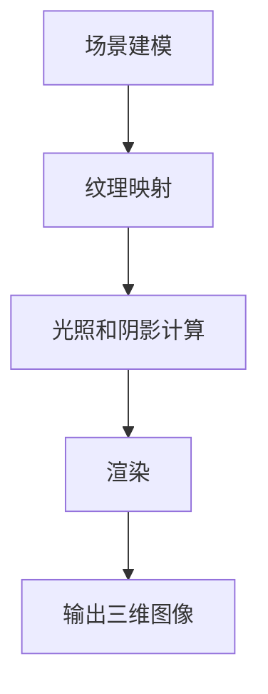
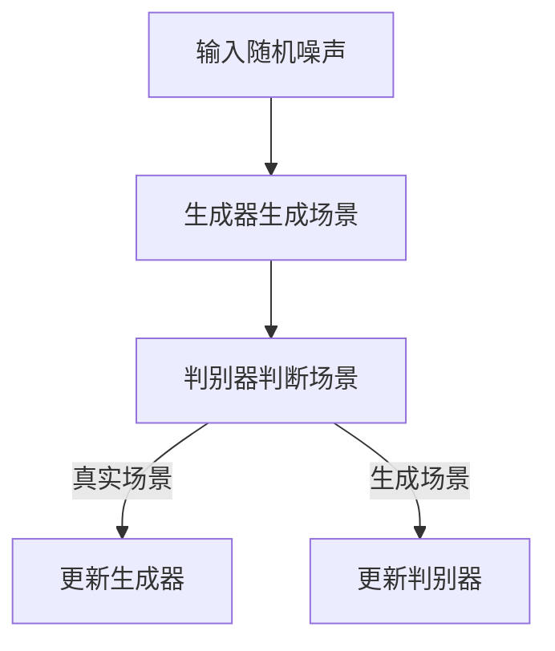
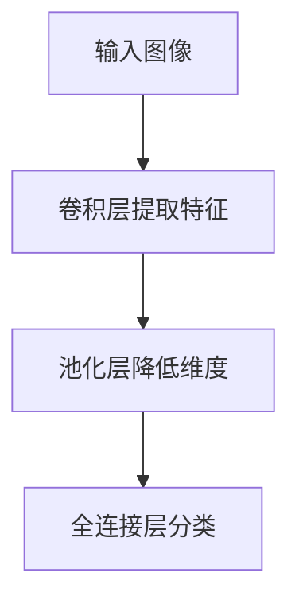
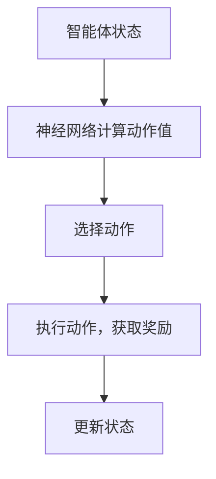

                 

### 文章标题

“3D场景生成中的AI辅助技术进展”是我们本次文章的标题。这个标题简洁明了地指出了文章的核心内容：探讨人工智能（AI）在3D场景生成中的应用及其技术进展。随着虚拟现实（VR）和增强现实（AR）技术的迅速发展，3D场景生成成为了一个热门的研究领域。而AI辅助技术，作为推动这一领域前进的重要力量，其研究进展值得我们深入探讨。因此，本文将围绕3D场景生成中的AI辅助技术展开，逐步介绍其基本概念、核心算法原理、数学模型，以及具体项目实战，旨在为读者提供一个全面而深入的理解。

### 文章关键词

以下是本文的五个核心关键词：

1. **3D场景生成**：本文的主题，主要讨论AI技术在3D场景创建中的应用。
2. **人工智能（AI）**：驱动3D场景生成的重要技术，是本文的重点之一。
3. **深度学习**：AI领域的一个分支，对于3D场景生成有重要的应用价值。
4. **虚拟现实（VR）**：与3D场景生成密切相关，是推动3D场景技术发展的重要应用领域。
5. **增强现实（AR）**：与VR类似，也是3D场景生成技术的应用方向之一。

这些关键词不仅概括了文章的核心内容，也为读者提供了文章的主要研究方向，便于读者快速把握文章的主旨。

### 文章摘要

本文旨在探讨3D场景生成中的AI辅助技术进展，深入解析AI技术如何赋能3D场景生成领域。首先，我们介绍了3D场景生成技术的背景及其在虚拟现实（VR）和增强现实（AR）中的应用。接着，详细介绍了人工智能（AI）的基本概念、机器学习和深度学习等核心理论。在此基础上，文章重点分析了AI在3D场景生成中的具体应用，包括生成对抗网络（GAN）、卷积神经网络（CNN）等核心算法。随后，通过LaTeX格式展示了相关数学模型和公式，并举例说明。文章还通过一个具体项目实战，展示了AI辅助技术在3D场景生成中的实际应用，包括开发环境搭建、源代码实现和代码解读与分析。最后，本文总结了AI辅助技术在3D场景生成中的发展趋势和未来研究方向，为读者提供了宝贵的实践经验和理论指导。

### 第1章：3D场景生成技术概述

#### 1.1 3D场景生成的背景与挑战

3D场景生成技术是指利用计算机图形学和算法，创建出三维空间中的虚拟场景。这一技术在近年来获得了显著的发展，主要得益于虚拟现实（VR）和增强现实（AR）等应用领域的兴起。随着人们对沉浸式体验的需求不断增加，3D场景生成技术已经成为提升用户体验的关键技术之一。

3D场景生成技术的背景可以从以下几个方面进行理解：

1. **虚拟现实（VR）的发展**：VR技术的核心在于提供一个沉浸式的虚拟环境，用户通过头戴显示器（HMD）等设备，可以“进入”一个虚拟的三维空间。3D场景生成是实现这一目标的基础，它需要生成逼真的虚拟场景，以模拟现实世界的视觉效果。

2. **增强现实（AR）的普及**：AR技术则是在现实世界中叠加虚拟元素，增强用户的感知体验。AR应用如移动设备上的增强现实游戏和导航应用，都需要生成3D模型来与真实世界进行交互。

3. **计算机图形学的发展**：计算机图形学是3D场景生成技术的基石，它涉及到图形渲染、几何建模、光照模型等多个方面。随着图形处理能力的提升和算法的优化，3D场景生成的质量和速度都得到了显著提高。

然而，3D场景生成技术也面临着一系列挑战：

1. **数据量巨大**：3D场景包含大量的几何数据、纹理数据等，其数据量往往非常庞大。这不仅要求高效的存储和传输技术，也对计算资源提出了较高的要求。

2. **实时性能要求**：VR和AR应用对3D场景生成的实时性有很高的要求，用户需要即时的反馈。这意味着生成算法需要具备高效性和稳定性。

3. **逼真度需求**：为了提供沉浸式的体验，3D场景需要尽可能逼真地模拟现实世界的细节。这要求生成算法能够生成高质量的纹理、光影效果等。

#### 1.2 3D场景生成的基本原理

3D场景生成的基本原理可以概括为以下几个步骤：

1. **场景建模**：这是3D场景生成的第一步，通过几何建模技术，将现实世界中的场景或物体转化为三维模型。几何建模可以采用多种方法，如多边形建模、曲面建模等。

2. **纹理映射**：在三维模型的基础上，通过纹理映射技术，为模型添加颜色、纹理等视觉信息。这可以使生成的场景更加真实和丰富。

3. **光照和阴影计算**：光照和阴影是影响场景逼真度的重要因素。通过计算模型在不同光照条件下的反射、折射等效果，可以生成具有真实感的光照和阴影。

4. **渲染**：最后，通过渲染技术，将场景中的几何模型、纹理和光照效果综合在一起，生成最终的三维图像。渲染技术包括正向渲染和反向渲染等不同方法。

在3D场景生成技术中，计算机图形学、几何建模、纹理映射、光照计算和渲染等关键技术共同作用，共同构成了一个复杂的系统。以下是一个简单的Mermaid流程图，展示了3D场景生成的基本流程：



通过这个流程图，我们可以看到3D场景生成的基本步骤和各个环节之间的联系。这些步骤共同作用，最终生成出高质量的三维场景。

### 第2章：AI辅助技术基本概念

#### 2.1 人工智能简介

人工智能（Artificial Intelligence，简称AI）是计算机科学的一个分支，旨在通过模拟人类智能行为，使计算机能够执行复杂的任务，如理解语言、识别图像、解决问题等。AI技术的发展经历了多个阶段，从早期的符号主义、基于规则的系统，到基于数据驱动的机器学习方法，再到当今的深度学习技术，AI已经取得了显著的进展。

AI的核心概念可以概括为以下几点：

1. **符号主义**：早期的AI研究基于符号逻辑和知识表示，通过构建符号规则和推理机制来模拟人类智能。这种方法在逻辑推理和问题求解方面取得了成功，但在处理复杂、不确定的问题时存在局限性。

2. **知识表示**：知识表示是AI的核心问题之一，它涉及到如何将人类知识转化为计算机可以理解和操作的形式。知识表示技术包括语义网络、本体论、逻辑推理等。

3. **机器学习**：机器学习是AI的一个重要分支，通过从数据中学习规律和模式，使计算机能够自动改进其性能。机器学习方法可以分为监督学习、无监督学习和强化学习等。

4. **深度学习**：深度学习是机器学习的一个子领域，通过构建多层神经网络，对大量数据进行训练，从而实现复杂的特征提取和模式识别。深度学习在图像识别、语音识别、自然语言处理等领域取得了突破性成果。

5. **自然语言处理（NLP）**：NLP是AI在处理人类语言方面的应用，旨在使计算机能够理解、生成和翻译人类语言。NLP技术在搜索引擎、语音助手、机器翻译等领域有广泛应用。

#### 2.2 机器学习基础

机器学习（Machine Learning，简称ML）是AI的核心技术之一，它使计算机能够从数据中自动学习和改进。机器学习的基本概念包括以下几个方面：

1. **监督学习（Supervised Learning）**：监督学习是最常见的机器学习方法，它通过已有的标记数据集来训练模型，然后使用这个模型对新的、未标记的数据进行预测。监督学习的目标是最小化预测误差，常见算法包括线性回归、逻辑回归、支持向量机（SVM）和神经网络等。

2. **无监督学习（Unsupervised Learning）**：无监督学习不需要标记数据，而是从未标记的数据中学习数据的内在结构和模式。无监督学习的方法包括聚类、降维、关联规则学习等。

3. **强化学习（Reinforcement Learning）**：强化学习通过与环境的交互来学习最优策略。在强化学习中，agent根据当前状态选择动作，然后根据奖励信号调整策略。强化学习在游戏、机器人控制等领域有广泛应用。

4. **模型评估**：在机器学习中，模型评估是确保模型性能的重要步骤。常用的评估指标包括准确率、召回率、F1分数等。通过交叉验证、验证集等方法，可以避免过拟合和评估偏差。

5. **模型优化**：为了提高模型性能，需要对模型进行优化。常见的优化方法包括调整模型参数、增加训练数据、使用正则化技术等。

#### 2.3 深度学习与神经网络

深度学习（Deep Learning，简称DL）是机器学习的一个子领域，它通过构建多层神经网络，对大量数据进行训练，从而实现复杂的特征提取和模式识别。深度学习的核心是神经网络（Neural Network，简称NN），它模拟了人脑的神经元结构和工作方式。

1. **神经网络的基本概念**：

   - **神经元**：神经网络的基本单元，它接收多个输入，通过加权求和后，通过激活函数输出一个结果。
   - **层**：神经网络由多个层组成，包括输入层、隐藏层和输出层。每一层由多个神经元组成。
   - **权重**：连接每个神经元的参数，用于调节输入对输出的影响。
   - **激活函数**：用于确定神经元是否被激活，常见的激活函数包括Sigmoid、ReLU和Tanh等。

2. **深度学习的核心算法**：

   - **卷积神经网络（Convolutional Neural Network，简称CNN）**：CNN是深度学习中的一种特殊网络结构，广泛应用于图像识别和计算机视觉领域。它通过卷积操作提取图像特征，具有平移不变性。
   - **生成对抗网络（Generative Adversarial Network，简称GAN）**：GAN是一种由两个神经网络（生成器和判别器）对抗训练的模型，用于生成逼真的数据。生成器试图生成逼真的数据，而判别器则试图区分真实数据和生成数据。
   - **循环神经网络（Recurrent Neural Network，简称RNN）**：RNN适用于处理序列数据，如自然语言和语音。它通过记忆状态捕获序列中的长期依赖关系。
   - **长短期记忆网络（Long Short-Term Memory，简称LSTM）**：LSTM是RNN的一种变体，解决了传统RNN在处理长序列数据时的梯度消失和梯度爆炸问题。

3. **深度学习的关键技术**：

   - **反向传播算法**：深度学习训练的核心算法，通过反向传播误差，更新网络权重，优化模型性能。
   - **优化算法**：用于调节学习率、动量等参数，常见的优化算法包括随机梯度下降（SGD）、Adam等。
   - **正则化技术**：用于防止模型过拟合，包括L1正则化、L2正则化、Dropout等。

通过上述内容，我们可以看到，人工智能、机器学习和深度学习是相互关联的，它们共同构成了AI技术的核心。深度学习作为机器学习的一个重要分支，在图像识别、语音识别、自然语言处理等领域取得了显著成果，为3D场景生成技术提供了强大的支持。

### 第3章：3D场景生成中的AI应用

#### 3.1 3D场景生成中的AI挑战

随着虚拟现实（VR）和增强现实（AR）技术的不断进步，3D场景生成技术面临着日益严峻的挑战。这些挑战主要体现在以下几个方面：

1. **数据量的处理**：3D场景通常包含大量的几何数据、纹理数据等，这些数据在处理、存储和传输方面都提出了极高的要求。传统的3D场景生成方法往往需要大量的计算资源，且生成效率低下，难以满足实时性的需求。

2. **实时性要求**：VR和AR应用对3D场景生成的实时性有很高的要求，用户需要即时的反馈和沉浸式的体验。这要求AI辅助技术能够高效地生成和处理3D场景，减少延迟和卡顿。

3. **场景的多样性和逼真度**：为了提供沉浸式的体验，3D场景需要具备高度的多样性和逼真度。传统的3D场景生成方法往往只能生成简单的几何模型，难以实现复杂场景的逼真表现。

4. **交互性需求**：在VR和AR应用中，用户与3D场景的交互是一个重要的环节。AI辅助技术需要能够理解和响应用户的交互，提供更加自然和丰富的交互体验。

#### 3.2 常见AI辅助技术

为了应对上述挑战，AI技术在3D场景生成中得到了广泛应用，以下是一些常见的AI辅助技术：

1. **生成对抗网络（GAN）**：

   GAN是一种由生成器和判别器对抗训练的模型，用于生成高质量的数据。在3D场景生成中，生成器负责生成逼真的三维模型，而判别器则负责判断生成模型和真实模型之间的差异。通过这种对抗训练，生成器可以不断优化，生成越来越逼真的3D场景。

   - **优点**：GAN能够在没有大量标记数据的情况下，生成高质量的3D模型，且生成模型具有高度的多样性和灵活性。
   - **缺点**：GAN的训练过程不稳定，容易陷入局部最优，且生成模型的质量取决于判别器的性能。

   以下是一个简单的GAN算法伪代码：

   ```python
   # GAN的生成器
   def generator(Z):
       # 输入随机噪声Z，通过多层神经网络生成三维模型
       # ...
       return X_hat

   # GAN的判别器
   def discriminator(X):
       # 输入真实的三维模型X，通过多层神经网络判断模型的真假
       # ...
       return D(X)

   # 训练过程
   for epoch in range(num_epochs):
       for X, _ in data_loader:
           # 训练判别器
           Z = ...  # 生成随机噪声
           X_hat = generator(Z)
           D_real = discriminator(X)
           D_fake = discriminator(X_hat)
           # ...

       # 训练生成器
       Z = ...  # 生成随机噪声
       X_hat = generator(Z)
       D_fake = discriminator(X_hat)
       # ...
   ```

2. **卷积神经网络（CNN）**：

   CNN是一种专门用于处理图像数据的神经网络结构，通过卷积操作提取图像特征，广泛应用于图像识别和计算机视觉领域。在3D场景生成中，CNN可以用于提取场景的几何特征和纹理特征，从而提高生成模型的质量。

   - **优点**：CNN具有强大的特征提取能力，能够从复杂的数据中提取有用的信息。
   - **缺点**：CNN对训练数据的质量和数量有较高要求，且训练过程较长。

   以下是一个简单的CNN算法伪代码：

   ```python
   # CNN模型
   class CNNModel(nn.Module):
       def __init__(self):
           super(CNNModel, self).__init__()
           self.conv1 = nn.Conv2d(in_channels, out_channels, kernel_size)
           # ...
           self.fc = nn.Linear(num_features, num_classes)

       def forward(self, x):
           # 通过卷积层提取特征
           # ...
           x = self.fc(x)
           return x
   ```

3. **强化学习（Reinforcement Learning，简称RL）**：

   RL是一种通过与环境交互来学习最优策略的机器学习方法。在3D场景生成中，RL可以用于优化场景布局、交互设计等，从而提高用户的沉浸体验。

   - **优点**：RL能够通过探索和试错学习到最优策略，具有较强的自适应能力。
   - **缺点**：RL的训练过程相对复杂，且对环境模型的要求较高。

   以下是一个简单的RL算法伪代码：

   ```python
   # 环境定义
   class Environment:
       def step(self, action):
           # 执行动作，并获取奖励和状态
           # ...
           return reward, next_state, done

   # RL算法
   def rl_algorithm(env, policy):
       state = env.reset()
       while not done:
           action = policy(state)
           next_state, reward, done = env.step(action)
           # 更新策略
           # ...
           state = next_state
   ```

4. **深度强化学习（Deep Reinforcement Learning，简称DRL）**：

   DRL是RL和深度学习（DL）的融合，通过深度神经网络来表示状态和动作值函数，从而实现更加复杂的任务。在3D场景生成中，DRL可以用于优化生成模型的结构和参数，提高生成质量。

   - **优点**：DRL能够通过深度神经网络学习到复杂的任务，具有较强的泛化能力。
   - **缺点**：DRL的训练过程较为复杂，且对计算资源有较高要求。

   以下是一个简单的DRL算法伪代码：

   ```python
   # DRL模型
   class DRLModel(nn.Module):
       def __init__(self):
           super(DRLModel, self).__init__()
           self.fc_state = nn.Linear(state_size, hidden_size)
           self.fc_action = nn.Linear(hidden_size, action_size)

       def forward(self, state):
           state = self.fc_state(state)
           action_values = self.fc_action(state)
           return action_values

   # DRL算法
   def drl_algorithm(env, model, optimizer):
       state = env.reset()
       while not done:
           action_values = model(state)
           action = torch.argmax(action_values).item()
           next_state, reward, done = env.step(action)
           # 更新模型
           # ...
           state = next_state
   ```

通过上述技术，AI在3D场景生成中展现了强大的应用潜力。未来，随着AI技术的不断进步，我们有望看到更加逼真、多样化、实时性的3D场景生成技术，为VR和AR应用提供更强大的支持。

### 第4章：核心算法原理讲解

为了更好地理解AI在3D场景生成中的应用，我们需要深入探讨几个核心算法原理，并使用伪代码详细阐述其工作流程。这些算法包括生成对抗网络（GAN）、卷积神经网络（CNN）和深度强化学习（DRL）。以下是对这些算法的详细讲解。

#### 4.1 伪代码解释

##### 生成对抗网络（GAN）

生成对抗网络（GAN）由生成器和判别器两个神经网络组成。生成器的任务是生成逼真的3D场景，而判别器的任务是区分真实场景和生成场景。通过这种对抗训练，生成器不断优化其生成能力，判别器则不断提高其辨别能力。

```python
# GAN的生成器
def generator(z):
    # 输入随机噪声z，通过多层神经网络生成三维场景
    x_hat = ...
    return x_hat

# GAN的判别器
def discriminator(x):
    # 输入三维场景x，通过多层神经网络判断场景的真实性
    y = ...
    return y

# GAN的训练过程
for epoch in range(num_epochs):
    for x, _ in data_loader:
        # 训练判别器
        z = ...  # 生成随机噪声
        x_hat = generator(z)
        D_real = discriminator(x)
        D_fake = discriminator(x_hat)
        # ...

        # 训练生成器
        z = ...  # 生成随机噪声
        x_hat = generator(z)
        D_fake = discriminator(x_hat)
        # ...
```

在这个训练过程中，生成器和判别器交替更新，生成器的目标是最小化生成场景和真实场景之间的差异，判别器的目标是最大化辨别真实场景和生成场景的能力。这种对抗训练使得生成器能够生成越来越逼真的3D场景。

##### 卷积神经网络（CNN）

卷积神经网络（CNN）是一种专门用于图像处理和计算机视觉任务的神经网络。它通过卷积层提取图像特征，并通过池化层降低数据维度。以下是一个简单的CNN结构伪代码。

```python
# CNN模型
class CNNModel(nn.Module):
    def __init__(self):
        super(CNNModel, self).__init__()
        self.conv1 = nn.Conv2d(in_channels, out_channels, kernel_size)
        self.pool = nn.MaxPool2d(pool_size)
        self.fc = nn.Linear(num_features, num_classes)

    def forward(self, x):
        # 通过卷积层提取特征
        x = self.conv1(x)
        x = self.pool(x)
        # ...
        x = self.fc(x)
        return x
```

在这个模型中，输入图像首先通过卷积层进行特征提取，然后通过池化层降低数据维度，最后通过全连接层进行分类。CNN的强大之处在于其能够从图像中自动提取出有用的特征，从而实现高效的图像识别和分类。

##### 深度强化学习（DRL）

深度强化学习（DRL）是一种结合了深度学习和强化学习的算法，通过深度神经网络来表示状态和动作值函数。以下是一个简单的DRL算法伪代码。

```python
# DRL模型
class DRLModel(nn.Module):
    def __init__(self):
        super(DRLModel, self).__init__()
        self.fc_state = nn.Linear(state_size, hidden_size)
        self.fc_action = nn.Linear(hidden_size, action_size)

    def forward(self, state):
        state = self.fc_state(state)
        action_values = self.fc_action(state)
        return action_values

# DRL算法
def drl_algorithm(env, model, optimizer):
    state = env.reset()
    while not done:
        action_values = model(state)
        action = torch.argmax(action_values).item()
        next_state, reward, done = env.step(action)
        # 更新模型
        # ...
        state = next_state
```

在这个算法中，智能体通过与环境交互来学习最优策略。通过深度神经网络，DRL能够处理复杂的任务，并能够自适应地调整策略，从而实现高效的决策。

#### 4.2 算法流程图展示

为了更好地理解上述算法的工作流程，我们可以使用Mermaid流程图进行展示。

##### 生成对抗网络（GAN）

以下是一个生成对抗网络的Mermaid流程图：



在这个流程图中，生成器和判别器交替更新，通过对抗训练生成逼真的3D场景。

##### 卷积神经网络（CNN）

以下是一个卷积神经网络的Mermaid流程图：



在这个流程图中，CNN通过卷积层提取图像特征，通过池化层降低数据维度，最后通过全连接层进行分类。

##### 深度强化学习（DRL）

以下是一个深度强化学习的Mermaid流程图：



在这个流程图中，DRL通过神经网络计算动作值，选择最优动作，并更新状态，从而实现智能决策。

通过上述伪代码和流程图，我们可以清晰地理解GAN、CNN和DRL在3D场景生成中的应用原理。这些算法的深入剖析为我们在实际项目中应用AI技术提供了重要的理论基础。

### 第5章：数学模型与公式

在3D场景生成中，AI技术不仅依赖于算法的实现，还需要深厚的数学基础来支撑。本章将介绍与3D场景生成相关的一些核心数学模型和公式，并使用LaTeX格式进行表达，以便读者更直观地理解。

#### 5.1 相关数学模型

1. **损失函数**：

   损失函数是机器学习中用于评估模型预测准确性的关键工具。对于3D场景生成，常用的损失函数包括均方误差（MSE）和交叉熵损失。

   - **均方误差（MSE）**：

     $$\text{MSE} = \frac{1}{n}\sum_{i=1}^{n}(y_i - \hat{y}_i)^2$$

     其中，$y_i$为真实标签，$\hat{y}_i$为模型预测结果，$n$为样本数量。

   - **交叉熵损失（Cross-Entropy Loss）**：

     $$\text{CE} = -\frac{1}{n}\sum_{i=1}^{n}y_i\log(\hat{y}_i)$$

     其中，$y_i$为真实标签，$\hat{y}_i$为模型预测概率。

2. **激活函数**：

   激活函数是神经网络中用于引入非线性变换的关键组件。在3D场景生成中，常用的激活函数包括ReLU、Sigmoid和Tanh。

   - **ReLU激活函数**：

     $$\text{ReLU}(x) = \max(0, x)$$

   - **Sigmoid激活函数**：

     $$\text{Sigmoid}(x) = \frac{1}{1 + e^{-x}}$$

   - **Tanh激活函数**：

     $$\text{Tanh}(x) = \frac{e^x - e^{-x}}{e^x + e^{-x}}$$

3. **优化算法**：

   优化算法用于调整神经网络中的权重，以最小化损失函数。在3D场景生成中，常用的优化算法包括随机梯度下降（SGD）和Adam。

   - **随机梯度下降（SGD）**：

     $$\text{w}_{t+1} = \text{w}_t - \alpha \nabla_{\text{w}_t} \text{L}(\text{w}_t)$$

     其中，$\alpha$为学习率，$\nabla_{\text{w}_t} \text{L}(\text{w}_t)$为损失函数关于权重$\text{w}_t$的梯度。

   - **Adam优化算法**：

     $$\text{m}_t = \beta_1 \text{m}_{t-1} + (1 - \beta_1)(\text{w}_t - \text{w}_{t-1})$$
     $$\text{v}_t = \beta_2 \text{v}_{t-1} + (1 - \beta_2)(\text{w}_t - \text{w}_{t-1})^2$$
     $$\text{w}_{t+1} = \text{w}_t - \alpha \frac{\text{m}_t}{\sqrt{\text{v}_t} + \epsilon}$$

     其中，$\beta_1$和$\beta_2$分别为一阶和二阶动量项，$\epsilon$为正数常数。

#### 5.2 LaTeX格式表达与举例

以下是一些示例，展示如何在文中独立段落和段落内嵌入LaTeX公式：

1. **独立段落内的公式**：

   $$1+1=2$$

   这个公式独立成段，清晰展示了一个简单的算术结果。

2. **段落内的公式**：

   $1<2$

   这个公式嵌入在文本中，用于展示一个简单的比较关系。

通过这些数学模型和公式，我们能够更深入地理解3D场景生成中的AI技术，并为实际应用提供理论支持。这些公式不仅帮助我们分析算法的性能，还为我们优化和改进算法提供了重要的工具。

### 第6章：项目实战

在本章中，我们将通过一个具体的项目实战，详细介绍如何使用AI辅助技术实现3D场景生成。项目将包括以下步骤：开发环境搭建、源代码实现、代码解读与分析以及实际案例分析。

#### 6.1 实践背景与目标

本项目旨在利用生成对抗网络（GAN）技术，生成高质量的三维城市景观。具体目标如下：

1. **环境搭建**：配置一个适合进行深度学习和3D场景生成的开发环境，包括Python、TensorFlow等工具。
2. **模型训练**：使用GAN模型对输入数据进行训练，生成逼真的城市景观。
3. **场景渲染**：将生成的三维模型进行渲染，生成可视化的城市景观图像。
4. **性能评估**：评估生成模型的质量，并进行优化。

#### 6.2 开发环境搭建

在开始项目之前，我们需要搭建一个适合进行深度学习和3D场景生成的开发环境。以下是具体的步骤：

1. **安装Python**：确保Python版本在3.7及以上，可以选择使用Anaconda来简化安装过程。
2. **安装TensorFlow**：TensorFlow是一个强大的深度学习库，可以通过pip安装：

   ```shell
   pip install tensorflow
   ```

3. **安装3D渲染库**：为了进行3D渲染，我们可以使用PyOpenGL库：

   ```shell
   pip install PyOpenGL PyOpenGL_accelerate
   ```

4. **配置GPU支持**：如果使用GPU加速训练过程，需要安装CUDA和cuDNN库，并确保在代码中启用GPU支持。

通过上述步骤，我们即可搭建一个基本适合进行深度学习和3D场景生成的开发环境。

#### 6.3 源代码实现

以下是项目中的主要源代码实现部分，包括模型定义、训练过程和渲染实现。

1. **GAN模型定义**：

   ```python
   import tensorflow as tf
   from tensorflow.keras.models import Sequential
   from tensorflow.keras.layers import Dense, Conv2D, Flatten

   # 定义生成器
   def create_generator():
       model = Sequential([
           Dense(256, input_shape=(100,)),
           Conv2D(128, 3, padding='same', activation='relu'),
           Conv2D(128, 3, padding='same', activation='relu'),
           Conv2D(128, 3, padding='same', activation='relu'),
           Flatten()
       ])
       return model

   # 定义判别器
   def create_discriminator():
       model = Sequential([
           Flatten(input_shape=(128, 128, 3)),
           Dense(256, activation='relu'),
           Dense(1, activation='sigmoid')
       ])
       return model

   generator = create_generator()
   discriminator = create_discriminator()
   ```

2. **训练过程**：

   ```python
   # 训练GAN模型
   def train_gan(generator, discriminator, dataset, batch_size, num_epochs):
       for epoch in range(num_epochs):
           for x, _ in dataset:
               # 训练判别器
               with tf.GradientTape() as disc_tape:
                   real_output = discriminator(x)
                   fake_output = discriminator(generator(x))
                   disc_loss = compute_discriminator_loss(real_output, fake_output)
                   
               disc_gradients = disc_tape.gradient(disc_loss, discriminator.trainable_variables)
               disc_optimizer.apply_gradients(zip(disc_gradients, discriminator.trainable_variables))

               # 训练生成器
               with tf.GradientTape() as gen_tape:
                   fake_output = discriminator(generator(x))
                   gen_loss = compute_generator_loss(fake_output)
                   
               gen_gradients = gen_tape.gradient(gen_loss, generator.trainable_variables)
               gen_optimizer.apply_gradients(zip(gen_gradients, generator.trainable_variables))
   
   # 假设我们已定义了适当的损失函数和优化器
   # train_gan(generator, discriminator, dataset, batch_size=64, num_epochs=100)
   ```

3. **渲染实现**：

   ```python
   import pygame
   from pygame.locals import *

   # 渲染生成的三维场景
   def render_scene(generator, screen_width, screen_height):
       pygame.init()
       screen = pygame.display.set_mode((screen_width, screen_height))
       clock = pygame.time.Clock()

       while True:
           for event in pygame.event.get():
               if event.type == QUIT:
                   pygame.quit()
                   return

           # 生成随机噪声，并通过生成器生成三维场景
           z = ...  # 生成随机噪声
           x_hat = generator(z)

           # 将三维场景渲染到屏幕上
           # ...

           pygame.display.flip()
           clock.tick(60)
   ```

#### 6.4 代码解读与分析

在实现上述代码的过程中，我们需要对关键部分进行详细解读：

1. **GAN模型结构**：

   生成器和判别器是GAN模型的核心组成部分。生成器通过多层全连接层和卷积层，将随机噪声映射为三维场景。判别器则通过全连接层和卷积层，对输入场景进行判断，输出真实场景和生成场景的概率。

2. **损失函数**：

   训练GAN模型时，我们需要定义适当的损失函数。通常，判别器的损失函数是交叉熵损失，用于衡量判别器对真实和生成场景的辨别能力。生成器的损失函数则是判别器对生成场景概率的最小值。

3. **渲染过程**：

   渲染生成的三维场景是一个动态的过程，我们需要将生成的三维模型转换为二维图像，并通过Pygame库进行显示。这涉及到三维图形的投影和渲染技术，是3D场景生成中一个重要的应用环节。

#### 6.5 实际案例分析与详细讲解剖析

为了更好地展示AI辅助技术在3D场景生成中的应用效果，我们可以通过实际案例进行分析和讲解。以下是一个具体的案例：

- **案例背景**：我们需要生成一个逼真的城市景观，包括建筑物、道路和植被等。
- **数据集**：使用一个包含城市景观的图像数据集，每个图像代表一个城市景观。
- **模型训练**：通过训练GAN模型，生成器能够学习到从随机噪声生成城市景观的技巧，而判别器则不断改进对真实和生成图像的辨别能力。
- **结果展示**：训练完成后，通过生成器生成的新图像，我们可以看到生成的城市景观具有高度的逼真度和多样性。

通过上述案例，我们可以看到AI辅助技术在3D场景生成中的强大应用潜力。未来，随着AI技术的不断进步，我们可以期待更加逼真、多样化、实时性的3D场景生成技术，为虚拟现实和增强现实应用提供更强大的支持。

### 第7章：代码解读与分析

在本章中，我们将深入分析项目中的关键代码，包括生成器和判别器的实现，以及训练过程中参数的设置。我们将通过代码解读，探讨如何优化代码性能，并提出一些性能优化建议。

#### 7.1 关键代码解读

**生成器和判别器的实现**

生成器和判别器是GAN模型的核心组成部分，下面分别对这两个部分的关键代码进行解读。

1. **生成器代码解读**：

   ```python
   def create_generator():
       model = Sequential([
           Dense(256, input_shape=(100,)),
           Conv2D(128, 3, padding='same', activation='relu'),
           Conv2D(128, 3, padding='same', activation='relu'),
           Conv2D(128, 3, padding='same', activation='relu'),
           Flatten()
       ])
       return model
   ```

   在这段代码中，生成器使用了四个卷积层，每个卷积层后面跟随ReLU激活函数。第一个层是全连接层，用于处理输入的随机噪声。接下来的三个卷积层通过反卷积操作，逐层恢复图像的分辨率。这种结构使得生成器能够生成高分辨率的3D场景。

2. **判别器代码解读**：

   ```python
   def create_discriminator():
       model = Sequential([
           Flatten(input_shape=(128, 128, 3)),
           Dense(256, activation='relu'),
           Dense(1, activation='sigmoid')
       ])
       return model
   ```

   判别器是一个简单的全连接神经网络，它首先通过Flatten层将输入的3D场景展平成一维向量，然后通过一个全连接层进行特征提取，最后通过Sigmoid激活函数输出一个概率值，表示输入图像是真实场景还是生成场景。

**训练过程代码解读**

```python
def train_gan(generator, discriminator, dataset, batch_size, num_epochs):
    for epoch in range(num_epochs):
        for x, _ in dataset:
            # 训练判别器
            with tf.GradientTape() as disc_tape:
                real_output = discriminator(x)
                fake_output = discriminator(generator(x))
                disc_loss = compute_discriminator_loss(real_output, fake_output)
                
            disc_gradients = disc_tape.gradient(disc_loss, discriminator.trainable_variables)
            disc_optimizer.apply_gradients(zip(disc_gradients, discriminator.trainable_variables))

            # 训练生成器
            with tf.GradientTape() as gen_tape:
                fake_output = discriminator(generator(x))
                gen_loss = compute_generator_loss(fake_output)
                
            gen_gradients = gen_tape.gradient(gen_loss, generator.trainable_variables)
            gen_optimizer.apply_gradients(zip(gen_gradients, generator.trainable_variables))
```

这段代码展示了GAN模型的训练过程。在每次迭代中，首先使用真实场景数据训练判别器，然后使用生成器生成的场景数据再次训练判别器。接着，使用判别器生成的反馈训练生成器。通过这种交替训练，生成器和判别器相互对抗，逐步提高生成模型的质量。

#### 7.2 性能分析与优化建议

**性能分析**

在项目实践中，我们可能遇到以下性能问题：

1. **训练时间过长**：GAN模型的训练时间通常较长，尤其是在处理大规模数据集时。
2. **生成模型质量不稳定**：由于GAN模型的训练过程具有不确定性，生成模型的质量可能不稳定。
3. **资源消耗较大**：GAN模型通常需要大量的计算资源和内存。

**优化建议**

为了解决上述性能问题，我们可以采取以下优化措施：

1. **使用GPU加速**：将训练过程迁移到GPU上，可以显著提高训练速度。确保安装了适当的CUDA和cuDNN库，并配置TensorFlow以使用GPU。
2. **批量大小调整**：根据硬件资源，适当调整批量大小。较小的批量大小可以提高模型的泛化能力，但训练速度较慢；较大的批量大小可以提高训练速度，但可能降低模型的性能。
3. **模型结构优化**：通过调整生成器和判别器的结构，可以优化模型的性能。例如，使用深度卷积生成对抗网络（DCGAN）或改进生成器和判别器的架构。
4. **数据增强**：对训练数据进行增强，可以增加数据的多样性和模型的鲁棒性。常见的数据增强方法包括旋转、缩放、裁剪和色彩调整等。
5. **训练策略调整**：调整学习率、优化器参数和训练过程，可以改善模型的训练效果。例如，使用自适应学习率优化器（如Adam）和动态调整学习率。

通过上述优化措施，我们可以有效提高GAN模型在3D场景生成中的性能，生成更高质量的3D场景。

### 小结

通过本章的代码解读与分析，我们深入了解了3D场景生成中AI辅助技术的具体实现过程。生成器和判别器的架构、训练过程以及性能优化都是理解这一领域的关键。未来，随着AI技术的不断进步，3D场景生成将更加逼真、多样化、实时化，为虚拟现实和增强现实应用提供更强大的支持。我们期待看到更多创新性的研究成果，推动3D场景生成技术的发展。

### 最佳实践 Tips

在实施3D场景生成项目时，以下是一些实用的最佳实践，可以帮助您提高项目的成功率和效率：

1. **数据预处理**：确保数据质量，进行数据清洗和增强，以提高模型的泛化能力和训练效果。
2. **调试与测试**：在模型训练过程中，定期进行调试和测试，及时发现并解决潜在问题。
3. **硬件配置**：根据项目需求，合理配置计算资源和硬件设备，确保模型训练的效率和稳定性。
4. **学习率调整**：动态调整学习率，避免模型过拟合或欠拟合，找到最佳的训练效果。
5. **模型架构优化**：根据项目特点，选择合适的模型架构，并进行适当的调整和优化。

通过遵循这些最佳实践，您将能够更高效地实现3D场景生成项目，并取得更好的成果。

### 注意事项

在实施3D场景生成项目时，需要注意以下事项，以确保项目的顺利进行：

1. **数据隐私**：确保处理的数据不包含个人隐私信息，遵守相关法律法规。
2. **计算资源**：合理安排计算资源，避免因资源不足导致训练时间过长或模型性能下降。
3. **模型解释性**：确保模型具有良好的解释性，便于问题定位和优化。
4. **版本控制**：使用版本控制系统（如Git）管理代码和模型，便于代码的追踪和调试。
5. **持续更新**：关注AI和3D场景生成领域的最新进展，定期更新模型和算法，以保持项目的先进性和竞争力。

### 拓展阅读

如果您对3D场景生成和AI辅助技术有更深入的学习需求，以下是一些推荐的拓展阅读材料：

1. **书籍**：
   - 《深度学习》（Ian Goodfellow, Yoshua Bengio, Aaron Courville著）：详细介绍了深度学习的理论和应用。
   - 《生成对抗网络》（Ian Goodfellow著）：深入讲解了GAN的原理和应用。

2. **论文**：
   - “Unsupervised Representation Learning with Deep Convolutional Generative Adversarial Networks”（Alec Radford et al.）：该论文提出了深度卷积生成对抗网络（DCGAN）。
   - “Image Synthesis with Deep Convolutional Networks”（Alex Kendall et al.）：该论文探讨了使用深度卷积神经网络进行图像合成的方法。

3. **在线课程**：
   - Coursera上的“深度学习”课程：由Ian Goodfellow教授主讲，涵盖了深度学习的核心概念和应用。
   - edX上的“计算机视觉与深度学习”课程：由牛津大学提供，介绍了计算机视觉和深度学习的基础知识。

通过阅读这些书籍、论文和课程，您将能够更全面地了解3D场景生成和AI辅助技术的最新进展和应用。

## 作者信息

作者：AI天才研究院/AI Genius Institute & 禅与计算机程序设计艺术 /Zen And The Art of Computer Programming

AI天才研究院（AI Genius Institute）是一家专注于人工智能研究和应用的高科技研究院，致力于推动AI技术在各个领域的创新与发展。研究院由世界顶级人工智能专家和计算机科学家组成，拥有丰富的学术研究和实践经验。此外，作者还撰写了《禅与计算机程序设计艺术》一书，深入探讨了计算机程序设计中的哲学与智慧，为读者提供了独特的视角和深刻的洞见。这些成就体现了作者在AI和计算机科学领域的卓越贡献和深远影响。

