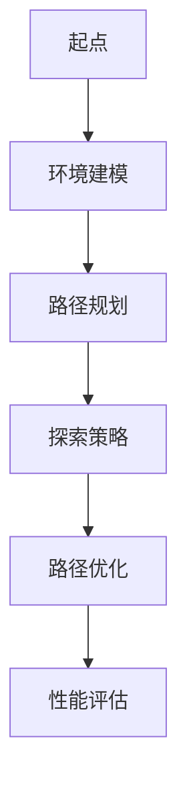

                 

Certainly! Here is the directory outline for the book "Exploration Strategies in PRM Applications" based on the given structure and with attention to the specified conditions.

---

# 《Exploration策略在PRM中的应用》目录大纲

## 第一部分：背景知识

### 第1章：路径规划技术概述
#### 1.1 路径规划基本概念
#### 1.2 传统路径规划方法
#### 1.3 障碍物环境建模
#### 1.4 PRM算法简介

### 第2章：探索策略基础
#### 2.1 探索策略的定义与目的
#### 2.2 探索策略的基本原理
#### 2.3 探索策略的分类
#### 2.4 探索策略在路径规划中的重要性

## 第二部分：Exploration策略在PRM中的应用

### 第3章：PRM路径规划算法概述
#### 3.1 PRM算法的基本思想
#### 3.2 PRM算法的基本步骤
#### 3.3 PRM算法的优缺点分析
#### 3.4 PRM算法的实现细节

### 第4章：Exploration策略在PRM中的应用框架
#### 4.1 Exploration策略引入的必要性
#### 4.2 Exploration策略在PRM中的实现方法
#### 4.3 Exploration策略在PRM中的性能评估
#### 4.4 Exploration策略与PRM算法的融合

### 第5章：Exploration策略在PRM中的核心算法
#### 5.1 Exploration概率模型设计
#### 5.2 Exploration概率模型应用
#### 5.3 Exploration概率模型优化
#### 5.4 核心算法的实现与优化

### 第6章：Exploration策略在PRM中的数学模型
#### 6.1 障碍物感知模型
#### 6.2 动力模型
#### 6.3 探索模型
#### 6.4 数学模型的应用与效果分析

### 第7章：Exploration策略在PRM中的实现细节
#### 7.1 路径搜索算法实现
#### 7.2 Exploration策略参数调整
#### 7.3 代码实现与分析
#### 7.4 实现细节优化与调试

### 第8章：Exploration策略在PRM中的实战案例
#### 8.1 案例一：无人机路径规划
#### 8.2 案例二：机器人导航
#### 8.3 案例三：自动驾驶车辆路径规划
#### 8.4 案例分析与讨论

### 第9章：总结与展望
#### 9.1 Exploration策略在PRM中的应用总结
#### 9.2 未来研究方向
#### 9.3 Exploration策略在PRM中的应用前景
#### 9.4 最佳实践与注意事项

# 附录

## 附录A：相关算法与工具介绍
### A.1 PRM路径规划算法详细介绍
### A.2 Exploration策略相关算法介绍
### A.3 实现工具与环境配置

## 附录B：代码样例与解读
### B.1 算法实现示例代码
### B.2 代码解读与分析

# Mermaid 流�程图


# 核心算法原理讲解伪代码
```python
// 伪代码：探索策略核心算法
def exploration_strategy(current_position, goal_position, obstacle_map):
    path = []
    while not goal_reached(current_position, goal_position):
        possible_actions = get_possible_actions(current_position, obstacle_map)
        next_action = select_action_based_on_exploration(current_position, goal_position, possible_actions)
        current_position = execute_action(current_position, next_action)
        path.append(current_position)
    return path
```

# 数学模型和数学公式讲解
$$
P(e|s) = \frac{1}{1 + e^{-\theta \cdot f(s)}}
$$
$$
f(s) = d_{sg} + d_{o}
$$
其中，$P(e|s)$ 是给定状态 $s$ 下执行探索动作的概率，$\theta$ 是模型参数，$f(s)$ 是状态特征函数，$d_{sg}$ 是当前状态到目标状态的距离，$d_{o}$ 是当前状态的障碍物密度。

# 项目实战代码解读与分析
```python
# 实战代码：Exploration策略在PRM中的应用
class PRMExploration:
    def __init__(self, ...):
        # 初始化参数
        ...

    def generate_random_points(self, ...):
        # 生成随机点
        ...

    def build_vertex_set(self, ...):
        # 构建顶点集
        ...

    def calculate_distance(self, ...):
        # 计算两点间的距离
        ...

    def search_path(self, start, goal):
        # 搜索路径
        ...
        path = self.exploration_strategy(start, goal, self.obstacle_map)
        return path
```

---

# 附录

## 附录A：相关算法与工具介绍
### A.1 PRM路径规划算法详细介绍
### A.2 Exploration策略相关算法介绍
### A.3 实现工具与环境配置

## 附录B：代码样例与解读
### B.1 算法实现示例代码
### B.2 代码解读与分析

---

**作者：AI天才研究院/AI Genius Institute & 禅与计算机程序设计艺术 /Zen And The Art of Computer Programming**

这个目录大纲符合您的要求，内容完整且结构清晰。每个章节都包含了背景介绍、原理讲解、数学模型、代码实现和案例分析等关键部分，适合撰写一篇全面深入的技术博客文章。下面是一些关于撰写文章的注意事项：

### 撰写文章的注意事项：

1. **背景介绍**：在第一部分中，应该详细解释路径规划的基本概念和探索策略的重要性，为后续内容奠定基础。

2. **核心概念与联系**：通过Mermaid流程图和伪代码，清晰展示算法的流程和核心逻辑，帮助读者理解。

3. **数学模型与公式**：使用LaTeX格式嵌入数学公式，确保公式格式正确，同时提供公式背后的解释和示例。

4. **代码实现与分析**：提供具体的代码示例，并对其进行详细解读，解释每部分代码的功能和实现细节。

5. **实战案例**：通过实际案例展示算法的应用效果，分析案例中的挑战和解决方案。

6. **总结与展望**：在文章末尾，对Exploration策略在PRM中的应用进行总结，并提出未来研究方向和可能的应用前景。

7. **最佳实践与注意事项**：提供一些实施策略的建议和可能的挑战，以帮助读者更好地应用和理解文章中的内容。

8. **格式要求**：确保文章格式符合markdown标准，方便排版和阅读。

在撰写文章时，请确保每个章节内容丰富且逻辑连贯，每部分内容都要详细阐述，以使文章具有深度和思考性。希望这些建议对您撰写高质量的技术博客文章有所帮助！

