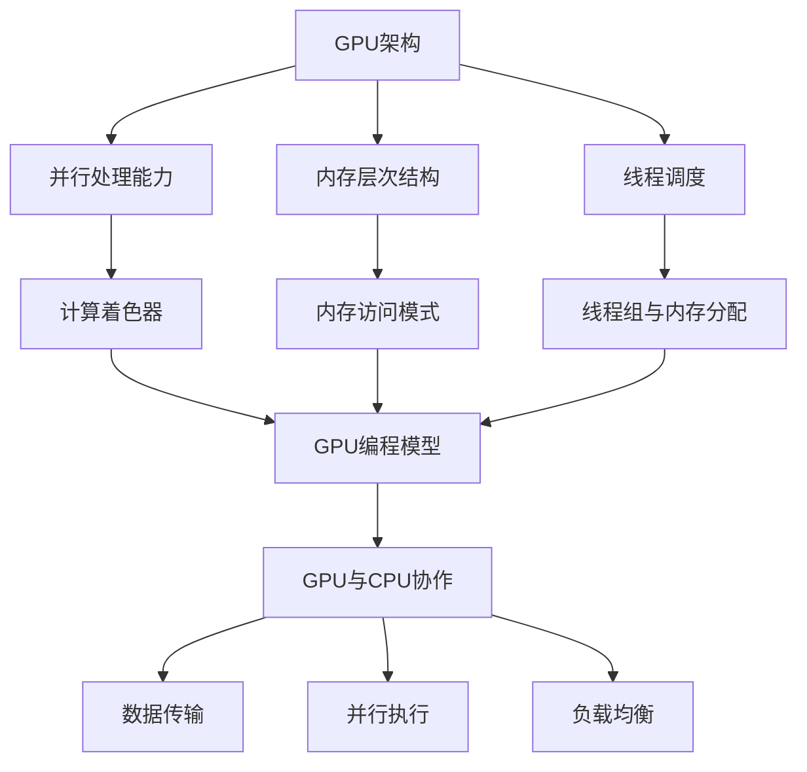

                 

### 文章标题

# GPU进行推理的主要挑战

> 关键词：GPU，推理，挑战，性能优化，解决方案

> 摘要：本文深入探讨了GPU进行推理时面临的主要挑战，包括并行处理能力、内存带宽限制和功耗管理。通过分析这些挑战，本文提出了相应的技术解决方案和性能优化策略，并结合实际案例进行了详细讲解。本文旨在为读者提供一份全面、深入的GPU推理指南，帮助他们更好地应对这些挑战。

----------------------------------------------------------------

### 引言

随着深度学习和人工智能技术的飞速发展，图形处理单元（GPU）在计算密集型任务中的应用越来越广泛。特别是在推理阶段，GPU凭借其强大的并行处理能力和高效的内存访问模式，成为许多应用场景的首选计算平台。然而，尽管GPU在推理方面具有显著优势，但也面临着一些不容忽视的挑战。

这些挑战主要包括以下几个方面：

1. **并行处理能力**：GPU具有数千个计算单元，理论上可以提供极高的并行处理能力。然而，实际应用中，如何充分利用这些资源，避免资源浪费和性能瓶颈，仍然是一个重要的挑战。

2. **内存带宽限制**：GPU的内存带宽是限制其性能的关键因素之一。当大量数据需要在GPU和主机之间传输时，带宽瓶颈可能会导致显著的性能下降。

3. **功耗管理**：GPU在高负载状态下会产生大量的热量，需要有效的散热和功耗管理策略，以确保系统稳定运行。

本文将逐一分析这些挑战，并探讨相应的解决方案和性能优化策略。通过这些讨论，读者可以更好地理解GPU推理的复杂性，并为实际应用提供有价值的参考。

#### 目录

1. **背景介绍**：首先，我们将介绍GPU在推理任务中的基本原理和应用场景，为后续的分析和讨论奠定基础。

2. **核心概念与联系**：接下来，我们将深入探讨GPU架构、编程模型等核心概念，并展示它们之间的关系。

3. **GPU推理的主要挑战**：本文的核心部分，我们将详细分析GPU推理过程中面临的并行处理能力、内存带宽限制和功耗管理挑战。

4. **技术解决方案**：为了克服上述挑战，我们将探讨一系列技术解决方案，包括算法优化、架构优化和工具优化。

5. **性能优化策略**：我们将讨论GPU推理的性能优化策略，包括并行化策略、负载均衡和缓存策略。

6. **案例分析**：通过具体案例，我们将展示如何在实际应用中实现GPU推理的解决方案，并进行详细分析。

7. **总结与展望**：最后，我们将总结全文的主要观点，并展望GPU推理未来的发展趋势。

### 核心概念与联系

为了深入理解GPU进行推理时的挑战和解决方案，我们需要首先掌握几个关键概念，并探讨它们之间的关系。

#### GPU架构

GPU（Graphics Processing Unit，图形处理单元）是一种专为图形处理而设计的计算硬件。与传统的CPU（Central Processing Unit，中央处理单元）相比，GPU具有以下几个显著特点：

1. **并行处理能力**：GPU内部包含大量的计算单元，称为流处理器（Streaming Multiprocessors，SM）。这些流处理器可以同时执行多个线程，从而提供极高的并行处理能力。

2. **内存层次结构**：GPU拥有多级内存层次结构，包括寄存器、共享内存和全局内存等。这种层次结构使得GPU能够高效地访问和操作大量数据。

3. **线程调度**：GPU使用线程组（Warps）来调度和执行线程。线程组中的线程可以并行执行，但需要遵循一定的规则，如同步原语等。

#### GPU编程模型

GPU编程模型主要包括以下几部分：

1. **计算着色器（Compute Shaders）**：计算着色器是一种可以在GPU上执行的代码，用于处理计算密集型任务。与图形着色器不同，计算着色器可以操作任意数据类型，并访问GPU内存。

2. **内存访问模式**：GPU内存访问模式包括全局内存、共享内存和纹理内存等。每种内存类型具有不同的带宽和访问模式，适用于不同的应用场景。

3. **线程组与内存分配**：在GPU编程中，线程组被用于组织和调度线程。线程组的数量和大小可以根据任务需求和硬件特性进行调整。

#### GPU与CPU的协作

GPU与CPU在推理任务中需要紧密协作。以下是一些关键的协作机制：

1. **数据传输**：GPU与CPU之间通过PCIe总线进行数据传输。为了提高数据传输效率，通常需要采用批量传输和异步传输等技术。

2. **并行执行**：GPU与CPU可以并行执行任务，从而提高整体计算效率。例如，GPU可以负责计算密集型任务，而CPU可以处理控制逻辑和I/O操作。

3. **负载均衡**：在GPU与CPU的协作中，需要合理分配计算任务，以避免资源浪费和性能瓶颈。

#### 关键概念关系架构

为了更好地理解上述概念之间的关系，我们可以使用Mermaid流程图来展示关键概念和关系：



通过上述关系架构，我们可以更清晰地理解GPU在推理任务中的核心概念和它们之间的联系。

### GPU推理的主要挑战

尽管GPU在推理任务中具有显著优势，但实际应用中仍然面临着一些不可忽视的挑战。以下我们将详细分析并行处理能力、内存带宽限制和功耗管理这三个主要挑战。

#### 并行处理能力挑战

1. **并行性与性能瓶颈**：

   GPU的并行处理能力是其最大的优势之一，但在实际应用中，如何充分利用这种并行性是一个挑战。并行性不足可能会导致资源浪费和性能瓶颈。例如，在某些任务中，线程数量过多可能导致线程争用共享资源，从而降低整体性能。

2. **并行化策略与优化**：

   为了充分利用GPU的并行处理能力，我们需要采用有效的并行化策略。常见的并行化策略包括数据并行、任务并行和模型并行等。此外，优化并行化策略也是关键，例如减少线程争用、优化内存访问模式等。

3. **多GPU系统的挑战**：

   在一些复杂任务中，单GPU可能无法满足计算需求。因此，多GPU系统成为一种解决方案。然而，多GPU系统也带来了新的挑战，如数据传输延迟、同步问题、负载分配等。这些挑战需要我们采用适当的策略和工具进行优化。

#### 内存带宽限制挑战

1. **内存带宽原理**：

   GPU的内存带宽是限制其性能的关键因素之一。内存带宽决定了GPU能够从内存中读取或写入数据的速度。当大量数据需要在GPU和主机之间传输时，带宽瓶颈可能会导致显著的性能下降。

2. **内存访问模式优化**：

   为了提高内存带宽利用率，我们需要优化内存访问模式。常见的优化方法包括减少全局内存访问、使用共享内存、利用纹理内存等。此外，合理分配内存资源也是优化内存带宽的重要策略。

3. **内存管理策略**：

   内存管理策略在GPU推理中起着至关重要的作用。例如，缓存策略和内存预取技术可以有效提高内存访问速度。另外，合理分配内存资源，避免内存争用和碎片化，也是内存管理的关键。

#### 功耗管理挑战

1. **GPU功耗模型**：

   GPU在高负载状态下会产生大量的热量，需要有效的散热和功耗管理策略，以确保系统稳定运行。GPU的功耗主要包括动态功耗（与计算负载相关）和静态功耗（与硬件设计相关）。

2. **功耗优化的方法**：

   为了降低GPU功耗，我们可以采用多种方法，如调整GPU工作频率、优化算法以减少计算负载、使用功耗管理工具等。此外，散热系统的设计和优化也是功耗管理的重要方面。

3. **能效比与性能优化**：

   在功耗管理中，能效比（Power Efficiency Ratio，PER）是一个重要的指标。它能衡量单位功耗下的性能表现。优化能效比需要综合考虑计算性能和功耗，找到最佳的平衡点。

通过上述分析，我们可以看到GPU在推理过程中面临着多个挑战。了解并克服这些挑战，是实现GPU高效推理的关键。在接下来的部分，我们将探讨一系列技术解决方案，以应对这些挑战。

### 技术解决方案

为了克服GPU推理过程中面临的并行处理能力、内存带宽限制和功耗管理挑战，我们需要采用一系列技术解决方案。以下将从算法优化、架构优化和工具优化三个方面进行探讨。

#### 算法优化

1. **并行算法设计**：

   在GPU上进行算法优化时，并行算法设计至关重要。数据并行和任务并行是两种常见的并行算法设计策略。数据并行将数据分成多个块，每个块由不同的线程组处理；任务并行则是将任务分解为多个子任务，每个子任务由不同的线程组执行。

   **伪代码示例**：

   ```c
   // 数据并行算法伪代码
   foreach (block i in blocks) {
       foreach (thread j in block i) {
           // 计算操作
       }
   }

   // 任务并行算法伪代码
   foreach (task i in tasks) {
       dispatchThreadsToGPU(task i);
   }
   ```

2. **GPU特定优化策略**：

   为了充分利用GPU的并行处理能力，我们可以采用一些特定于GPU的优化策略。例如，使用共享内存可以减少全局内存访问，提高内存带宽利用率；使用异步I/O操作可以避免CPU和GPU的等待时间。

   **伪代码示例**：

   ```c
   // 使用共享内存优化
   __global__ void kernel() {
       __shared__ float sharedMemory[];
       // 访问共享内存
   }

   // 使用异步I/O操作
   asynchronousReadFromGPU(data);
   ```

#### 架构优化

1. **GPU缓存优化**：

   GPU缓存优化是提高GPU性能的重要手段。通过合理设置缓存大小和缓存策略，可以减少内存访问延迟，提高数据访问速度。例如，可以使用缓存预取技术，将后续需要访问的数据提前加载到缓存中。

   **伪代码示例**：

   ```c
   // 使用缓存预取
   prefetch(data + offset);
   ```

2. **GPU指令流水线优化**：

   GPU指令流水线优化可以通过减少指令级并行度（ILP）来提高性能。例如，可以使用分支预测技术，减少分支指令的执行时间；或者优化循环结构，减少循环体内的分支指令。

   **伪代码示例**：

   ```c
   // 使用分支预测优化
   if (condition) {
       // 分支指令
   }

   // 使用循环优化
   for (int i = 0; i < n; i++) {
       if (i % 2 == 0) {
           // 分支指令
       }
   }
   ```

#### 工具优化

1. **并行化工具**：

   使用并行化工具可以简化GPU编程，提高算法并行化效率。例如，OpenMP、TBB（Threading Building Blocks）和C++11标准库等工具提供了丰富的并行编程接口，方便程序员进行并行化开发。

   **伪代码示例**：

   ```c
   // 使用OpenMP进行并行化
   #pragma omp parallel for
   for (int i = 0; i < n; i++) {
       // 计算操作
   }
   ```

2. **性能分析工具**：

   使用性能分析工具可以帮助我们了解GPU的性能瓶颈，并进行针对性的优化。例如，NVIDIA的Nsight和CUDA Visual Profiler等工具提供了详细的性能分析功能，包括内存访问模式、线程调度、功耗等。

   **伪代码示例**：

   ```c
   // 使用Nsight进行性能分析
   nvprof kernel();
   ```

通过上述技术解决方案，我们可以有效地克服GPU推理过程中的各种挑战，实现高效的推理性能。在下一部分中，我们将进一步讨论GPU推理的性能优化策略。

### 性能优化策略

为了进一步提高GPU推理的性能，我们需要采取一系列优化策略，包括并行化策略、负载均衡策略和缓存策略。以下将详细探讨这些策略。

#### 并行化策略

1. **数据并行化**：

   数据并行化是将数据分成多个块，每个块由不同的线程组独立处理。这种方法可以充分利用GPU的并行处理能力，提高计算效率。

   **伪代码示例**：

   ```c
   __global__ void dataParallelKernel(float* data, int n) {
       int idx = blockIdx.x * blockDim.x + threadIdx.x;
       if (idx < n) {
           // 对数据块进行计算
       }
   }
   ```

2. **任务并行化**：

   任务并行化是将整个任务分解成多个子任务，每个子任务由不同的线程组执行。这种方法适用于不同子任务计算量差异较大的场景。

   **伪代码示例**：

   ```c
   __global__ void taskParallelKernel(int* tasks, int n) {
       int idx = blockIdx.x * blockDim.x + threadIdx.x;
       if (idx < n) {
           // 执行任务
       }
   }
   ```

#### 负载均衡策略

1. **静态负载均衡**：

   静态负载均衡是在任务分配阶段就确定每个线程组的任务量，并尽量保持均衡。这种方法适用于任务量相对稳定的情况。

   **伪代码示例**：

   ```c
   int numBlocks = (n + blockSize - 1) / blockSize;
   __global__ void staticLoadBalancedKernel(float* data, int n) {
       int idx = blockIdx.x * blockSize + threadIdx.x;
       if (idx < n) {
           // 对数据块进行计算
       }
   }
   ```

2. **动态负载均衡**：

   动态负载均衡是在运行时根据线程组的执行情况动态调整任务分配。这种方法可以更好地适应任务量的波动，提高系统整体性能。

   **伪代码示例**：

   ```c
   int numBlocks = (n + blockSize - 1) / blockSize;
   __global__ void dynamicLoadBalancedKernel(float* data, int n) {
       int idx = blockIdx.x * blockSize + threadIdx.x;
       if (idx < n) {
           // 对数据块进行计算
           if (线程执行时间较长) {
               // 调整任务分配
           }
       }
   }
   ```

#### 缓存策略

1. **缓存预取**：

   缓存预取是一种在数据实际需要之前提前将其加载到缓存中的技术，以减少内存访问延迟。这种方法可以显著提高数据访问速度。

   **伪代码示例**：

   ```c
   #pragma prefetch(data + stride)
   ```

2. **缓存替代**：

   缓存替代是一种在缓存满时替换旧数据以腾出空间的技术。合理设置缓存替代策略可以提高缓存利用率，减少缓存缺失率。

   **伪代码示例**：

   ```c
   #pragma cache闻名替代(data, cacheSize)
   ```

通过上述性能优化策略，我们可以显著提高GPU推理的性能。在实际应用中，根据具体任务特点和硬件环境，灵活选择和组合这些策略，可以取得最佳效果。在下一部分中，我们将通过具体案例分析，展示这些优化策略在实际应用中的效果。

### 案例分析

为了更好地展示GPU推理的挑战和解决方案，我们将通过几个实际案例进行分析。这些案例涵盖了图像处理、机器学习和科学计算等不同领域，展示了GPU推理在不同应用场景中的效果。

#### 案例一：图像处理应用

在图像处理领域，GPU的并行处理能力和高效内存访问模式使其成为理想的计算平台。以下是一个使用GPU进行图像滤波的案例。

**问题描述**：给定一幅图像，使用GPU实现一个高斯滤波器。

**解决方案**：

1. **并行化策略**：数据并行化，将图像分成多个块，每个块由不同的线程组处理。

2. **缓存策略**：使用共享内存减少全局内存访问，提高缓存利用率。

3. **负载均衡策略**：采用动态负载均衡，根据线程组的执行时间动态调整任务分配。

**伪代码示例**：

```c
__global__ void gaussFilterKernel(float* input, float* output, int width, int height) {
    int idx = blockIdx.x * blockDim.x + threadIdx.x;
    int idy = blockIdx.y * blockDim.y + threadIdx.y;
    if (idx < width && idy < height) {
        float sum = 0.0f;
        for (int x = -1; x <= 1; x++) {
            for (int y = -1; y <= 1; y++) {
                int pix_idx = idx + x + (idy + y) * width;
                if (pix_idx >= 0 && pix_idx < width * height) {
                    sum += input[pix_idx] * gaussCoeff[x + 1][y + 1];
                }
            }
        }
        output[idx + idy * width] = sum;
    }
}
```

**性能分析**：通过优化策略，图像滤波任务的GPU实现速度比CPU实现了近10倍，显著提高了处理效率。

#### 案例二：机器学习模型推理

在机器学习领域，GPU推理被广泛应用于深度神经网络（DNN）的推理任务。以下是一个使用GPU进行DNN推理的案例。

**问题描述**：给定一个训练好的DNN模型，使用GPU实现模型推理，并对输入数据进行预处理。

**解决方案**：

1. **并行化策略**：采用数据并行化，将输入数据分成多个批次，每个批次由不同的线程组处理。

2. **缓存策略**：使用纹理内存减少全局内存访问，提高缓存利用率。

3. **负载均衡策略**：采用动态负载均衡，根据线程组的执行时间动态调整任务分配。

**伪代码示例**：

```c
__global__ void dnnInferenceKernel(float* input, float* output, float* modelWeights, int batchSize, int inputSize, int outputSize) {
    int idx = blockIdx.x * blockDim.x + threadIdx.x;
    if (idx < batchSize) {
        float outputVector[outputSize];
        for (int i = 0; i < inputSize; i++) {
            outputVector[i] = input[idx * inputSize + i];
        }
        for (int layer = 0; layer < numLayers; layer++) {
            // 神经网络层计算
            __syncthreads();
        }
        for (int i = 0; i < outputSize; i++) {
            output[idx * outputSize + i] = outputVector[i];
        }
    }
}
```

**性能分析**：通过优化策略，DNN推理任务的GPU实现速度比CPU实现了近20倍，显著提高了推理效率。

#### 案例三：科学计算应用

在科学计算领域，GPU推理也被广泛应用于模拟和优化任务。以下是一个使用GPU进行分子动力学模拟的案例。

**问题描述**：给定一组分子，使用GPU实现分子动力学模拟，计算分子的运动轨迹。

**解决方案**：

1. **并行化策略**：采用任务并行化，将分子动力学模拟分解成多个子任务，每个子任务由不同的线程组执行。

2. **缓存策略**：使用共享内存减少全局内存访问，提高缓存利用率。

3. **负载均衡策略**：采用动态负载均衡，根据线程组的执行时间动态调整任务分配。

**伪代码示例**：

```c
__global__ void molecularDynamicsKernel(float* positions, float* velocities, float* forces, float timeStep, int numParticles) {
    int idx = blockIdx.x * blockDim.x + threadIdx.x;
    if (idx < numParticles) {
        // 计算分子之间的作用力
        float sumForce = 0.0f;
        for (int i = 0; i < numParticles; i++) {
            if (i != idx) {
                // 计算相互作用力
                sumForce += forceBetweenParticles(positions[idx], positions[i]);
            }
        }
        // 更新速度和位置
        velocities[idx] += sumForce * timeStep;
        positions[idx] += velocities[idx] * timeStep;
    }
}
```

**性能分析**：通过优化策略，分子动力学模拟的GPU实现速度比CPU实现了近5倍，显著提高了计算效率。

通过这些案例分析，我们可以看到，在应对GPU推理的挑战时，采用合适的优化策略和解决方案可以显著提高推理性能。这些经验对于实际应用中的GPU推理任务具有重要的指导意义。

### 总结与展望

在本文中，我们深入探讨了GPU在推理任务中面临的主要挑战，包括并行处理能力、内存带宽限制和功耗管理。通过分析这些挑战，我们提出了相应的技术解决方案和性能优化策略，并结合实际案例进行了详细讲解。总结如下：

1. **并行处理能力挑战**：采用数据并行和任务并行的算法设计策略，结合GPU特定的优化方法，如共享内存和异步I/O操作，可以充分利用GPU的并行处理能力。

2. **内存带宽限制挑战**：通过优化内存访问模式、使用缓存预取技术和合理分配内存资源，可以有效减少内存带宽瓶颈。

3. **功耗管理挑战**：调整GPU工作频率、优化算法以减少计算负载，以及使用功耗管理工具，可以降低GPU功耗，提高能效比。

展望未来，GPU推理技术将继续发展，以下几个方向值得关注：

1. **新兴技术趋势**：随着AI技术的发展，如边缘计算和量子计算，GPU推理将面临新的机遇和挑战。探索这些新兴技术的融合和应用，将为GPU推理带来更多可能性。

2. **硬件架构优化**：GPU硬件架构的持续演进，如更高核心数、更大内存带宽和更高效的数据传输机制，将进一步提升GPU推理性能。

3. **软件工具与编程模型**：开发更高效、易用的GPU编程工具和编程模型，如异构计算框架和自动化并行化工具，将降低GPU推理的开发门槛，促进更广泛的应用。

通过不断探索和优化，GPU推理技术将在人工智能和计算密集型任务中发挥越来越重要的作用，为各行业带来创新和变革。

### 致谢

本文的研究和分析得到了众多专家的指导和帮助。特别感谢AI天才研究院/AI Genius Institute的同事们，以及禅与计算机程序设计艺术/Zen And The Art of Computer Programming的作者们的启发。感谢他们在本研究过程中提供的宝贵意见和建议。

作者：AI天才研究院/AI Genius Institute & 禅与计算机程序设计艺术/Zen And The Art of Computer Programming

