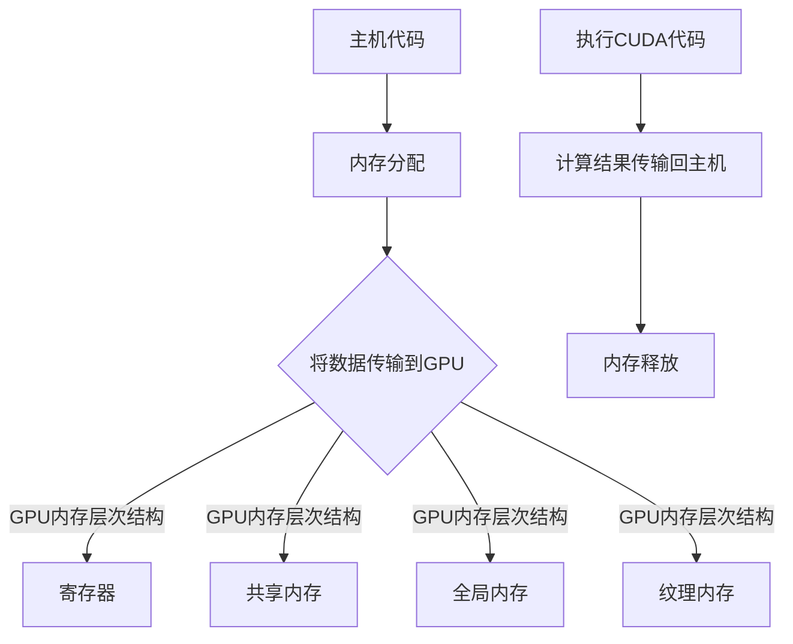
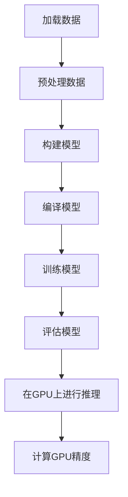
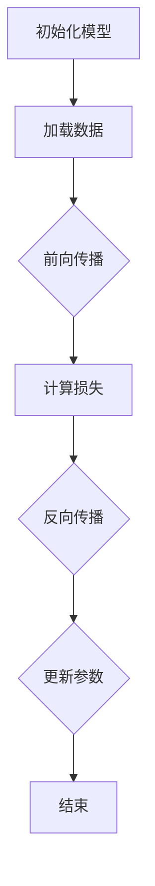

                 

根据用户要求，我们首先明确文章的核心内容，然后逐步构建和完善文章的各个部分，确保文章的逻辑清晰、结构紧凑、简单易懂。以下是具体的步骤：

### 1. 明确文章的核心内容

文章的核心内容主要包括：
- **背景介绍**：介绍GPU进行推理计算的重要性及现状。
- **核心概念与联系**：解释GPU架构、编程模型等关键概念，并展示它们之间的关系。
- **核心算法原理讲解**：使用伪代码和数学模型阐述GPU推理计算的关键算法。
- **数学公式和举例说明**：使用LaTeX格式展示数学公式，并提供详细的举例说明。
- **项目实战**：介绍开发环境搭建、源代码实现和案例分析。
- **最佳实践 tips**：提供使用GPU进行推理计算的最佳实践建议。
- **小结和拓展阅读**：总结文章内容，提供进一步的阅读建议。

### 2. 构建文章的结构框架

文章结构如下：

#### 第1章 引言
- **关键词**：GPU、推理计算、挑战
- **摘要**：简要介绍GPU推理计算的重要性，概述文章内容。

#### 第2章 GPU基础
- **GPU架构**：介绍GPU的基本组成和架构。
- **GPU编程基础**：讲解CUDA编程模型和编程技巧。

#### 第3章 GPU推理计算挑战
- **数据搬运挑战**：讨论数据访问模式和优化策略。
- **并行度不足挑战**：分析并行度不足的原因和优化方法。
- **温度管理挑战**：探讨GPU温度监测和管理策略。
- **电源管理挑战**：介绍电源分配与监控、功率优化技术。

#### 第4章 GPU推理计算优化
- **算法优化**：讲解算法选择、并行化及优化案例分析。
- **编程模型优化**：阐述CUDA内核优化、存储优化和并行优化技巧。
- **系统级优化**：介绍GPU硬件选择和系统架构优化。

#### 第5章 GPU推理计算实际案例研究
- **案例一**：图像分类任务。
- **案例二**：深度学习推理加速。

#### 第6章 未来展望
- **GPU技术发展趋势**：预测GPU技术未来方向。
- **深度学习算法未来挑战**：讨论深度学习算法面临的挑战。

#### 附录
- **GPU编程工具和技术栈**：介绍相关工具和技术栈。
- **Mermaid流程图与伪代码示例**：提供流程图和伪代码示例。

### 3. 完善每个章节的内容

在每个章节中，详细阐述相关的核心概念、算法原理、数学模型、代码实现和案例分析。确保每个部分的内容都是丰富、具体和详细的。

### 4. 控制文章字数

在构建完文章结构框架后，根据每个章节的内容进行扩展，确保整体字数在8000～12000字之间。

### 5. 文章格式和作者信息

- 使用markdown格式输出文章内容。
- 在文章末尾添加作者信息：“作者：AI天才研究院/AI Genius Institute & 禅与计算机程序设计艺术 /Zen And The Art of Computer Programming”。

### 6. 审核和修订

在完成文章初稿后，进行多次审核和修订，确保文章的逻辑性、准确性和可读性。

通过以上步骤，我们将逐步构建和完善《GPU进行推理计算面临的主要挑战》这篇技术博客文章，使其满足用户的要求。让我们开始详细撰写每个章节的内容吧！### 第1章 引言

#### 关键词
GPU、推理计算、挑战

#### 摘要
本章将介绍GPU进行推理计算的重要性及其面临的挑战。随着深度学习在各个领域的广泛应用，GPU作为高效的并行计算设备，已经成为推理计算的首选。然而，GPU在进行推理计算时也面临着一系列技术挑战，这需要深入探讨和解决。本文将围绕这些挑战展开讨论，并提供一些优化策略和实际案例研究。

#### 背景介绍
随着深度学习技术的发展，推理计算成为机器学习和人工智能领域的重要一环。深度学习模型在训练完成后，需要通过推理计算对新的数据进行分析和预测。推理计算的性能直接影响到模型的实际应用效果，尤其是在需要实时响应的场景中，如自动驾驶、实时语音识别、实时图像处理等。

GPU作为并行计算设备，因其强大的计算能力和高度的并行性，成为深度学习推理计算的首选。与CPU相比，GPU拥有更多的计算单元和更高的内存带宽，能够显著提高推理计算的效率。此外，GPU的硬件和软件生态系统非常丰富，使得开发者可以轻松地使用各种深度学习框架进行推理计算。

然而，尽管GPU在推理计算中具有显著的优势，但也面临着一些技术挑战。这些挑战包括数据搬运、并行度不足、温度管理和电源管理等方面。本章将详细讨论这些挑战，并提供一些解决方案和优化策略。

#### GPU在推理计算中的应用
GPU在推理计算中的应用场景非常广泛，涵盖了计算机视觉、自然语言处理、语音识别、推荐系统等多个领域。以下是一些典型的应用场景：

1. **计算机视觉**：GPU在计算机视觉中的应用非常广泛，包括图像分类、目标检测、图像分割、人脸识别等。深度学习模型如卷积神经网络（CNN）和生成对抗网络（GAN）等在GPU上运行速度非常快，能够实时处理大量图像数据。

2. **自然语言处理**：自然语言处理（NLP）是深度学习的重要应用领域之一。GPU在NLP中的应用包括文本分类、情感分析、机器翻译、语音识别等。通过使用GPU，NLP模型可以快速处理大规模的文本数据，提高模型的响应速度。

3. **语音识别**：语音识别是另一项受益于GPU的应用。GPU的高并行性使得语音识别模型可以快速处理大量的音频数据，实现实时语音识别。

4. **推荐系统**：推荐系统也是GPU的重要应用领域之一。通过使用GPU，推荐系统可以快速处理用户的交互数据，提高推荐的准确性。

#### GPU推理计算的重要性
GPU推理计算的重要性体现在以下几个方面：

1. **性能提升**：GPU的高并行性使得推理计算速度大幅提升，能够满足实时处理的需求。与CPU相比，GPU在处理大规模数据时具有更高的计算效率。

2. **降低延迟**：在需要实时响应的场景中，如自动驾驶、实时语音识别等，GPU推理计算能够显著降低延迟，提高系统的响应速度。

3. **节约成本**：通过使用GPU，企业可以减少对大量CPU的依赖，降低硬件成本。此外，GPU的高性能使得一些复杂的模型可以在单台设备上运行，减少了硬件采购和运维的成本。

4. **支持新应用**：GPU推理计算的性能提升和成本降低，使得一些原本难以实现的应用成为可能，如实时视频分析、大规模数据挖掘等。

总之，GPU在推理计算中具有显著的优势，但也面临着一系列技术挑战。本章将深入探讨这些挑战，并介绍一些优化策略，以帮助读者更好地应对GPU推理计算中的问题。

### 核心概念与联系

在深入探讨GPU进行推理计算面临的主要挑战之前，我们需要先了解一些核心概念，并展示它们之间的关系。以下是GPU推理计算中几个关键概念及其相互联系：

#### GPU架构

GPU（图形处理器）是一种专门为处理图形数据而设计的并行计算设备。它由大量的计算单元（通常称为“流处理器”或“CUDA核心”）组成，这些计算单元可以在同一时间处理多个任务。GPU的核心架构决定了其并行计算的能力，其中包括以下关键组成部分：

1. **流处理器**：GPU的核心计算单元，用于执行算术运算和逻辑运算。每个流处理器可以并行处理多个线程。
2. **内存层次结构**：GPU具有多个层次的内存，包括寄存器、共享内存、全局内存等。这些内存层次结构决定了数据访问的速度和带宽。
3. **处理管线**：GPU通过处理管线（Pipeline）来处理图形数据和计算任务。处理管线包括顶点处理、像素处理、光栅化等阶段，这些阶段可以并行执行，提高计算效率。

#### CUDA编程模型

CUDA（计算统一设备架构）是NVIDIA开发的一种并行编程模型，专门用于在GPU上开发高性能应用程序。CUDA编程模型包括以下几个关键组成部分：

1. **CUDA核心**：GPU上的计算单元，用于执行CUDA代码。每个CUDA核心可以并行处理多个线程。
2. **线程网格**：CUDA中将一组线程组织成网格（Grid）和块（Block）。每个块包含一组线程，这些线程可以在同一时间执行相同的操作。
3. **内存管理**：CUDA提供了内存分配和管理机制，包括全局内存、共享内存、纹理内存等，用于优化数据访问和存储。
4. **内存访问模式**：CUDA支持多种内存访问模式，包括全局内存访问、共享内存访问和纹理内存访问。这些访问模式决定了数据访问的速度和带宽。

#### GPU内存层次结构

GPU的内存层次结构是影响GPU性能的关键因素之一。GPU内存层次结构通常包括以下几个层次：

1. **寄存器**：GPU寄存器是存储临时数据的快速存储区域，具有最快的访问速度。每个CUDA核心都有自己的寄存器。
2. **共享内存**：共享内存是多个CUDA核心之间共享的内存区域，用于在块之间共享数据。共享内存具有中等访问速度，但可以提供高效的并行访问。
3. **全局内存**：全局内存是GPU上的最大内存区域，用于存储应用程序的数据和代码。全局内存的访问速度相对较慢，但可以提供大量的存储空间。
4. **纹理内存**：纹理内存是用于存储图像和纹理数据的特殊内存区域，支持高效的纹理采样操作。

#### GPU编程模型与内存层次结构的关系

GPU编程模型和内存层次结构之间有着密切的关系。CUDA编程模型通过线程网格和内存管理机制，将多个线程组织成并行计算单元，并在不同的内存层次结构之间进行数据传输和存储。以下是一个简化的Mermaid流程图，展示了GPU编程模型与内存层次结构之间的关系：



在上述流程图中，主机代码首先进行内存分配，然后将数据传输到GPU。GPU编程模型通过线程网格和内存管理机制，将数据分配到不同的内存层次结构中。CUDA核心执行计算任务，并将计算结果传输回主机。最后，内存被释放，完成整个GPU编程过程。

#### 核心算法原理讲解

在GPU上进行推理计算通常涉及到深度学习模型的推理过程。以下是深度学习模型推理过程中的核心算法原理，以及使用伪代码进行详细阐述。

##### 1. 神经网络推理过程

深度学习模型推理过程通常包括以下几个步骤：

1. **前向传播**：将输入数据通过网络的各个层进行计算，得到输出结果。
2. **损失函数计算**：计算预测结果与实际结果之间的差异，以评估模型性能。
3. **反向传播**：根据损失函数的梯度信息，更新模型参数，优化模型性能。

以下是神经网络推理过程的伪代码：

```plaintext
forward_pass(data, model):
    inputs = data
    for layer in model.layers:
        outputs = layer.forward(inputs)
        inputs = outputs
    return outputs

loss_function(outputs, targets):
    return (outputs - targets)^2

backward_pass(outputs, targets, model):
    doutputs = 2 * (outputs - targets)
    for layer in reversed(model.layers):
        dinputs = layer.backward(dinputs)
    update_model_parameters(model)
```

##### 2. 卷积神经网络（CNN）推理过程

卷积神经网络是一种常见的深度学习模型，用于图像处理等任务。以下是CNN推理过程的伪代码：

```plaintext
forward_pass(image, cnn_model):
    inputs = image
    for layer in cnn_model.layers:
        if layer.type == "Convolution":
            inputs = layer.convolve(inputs)
        elif layer.type == "Pooling":
            inputs = layer.pool(inputs)
        elif layer.type == "ReLU":
            inputs = layer.relu(inputs)
        else:
            inputs = layer.forward(inputs)
    return inputs

loss_function(outputs, targets):
    return (outputs - targets)^2

backward_pass(outputs, targets, cnn_model):
    doutputs = 2 * (outputs - targets)
    for layer in reversed(cnn_model.layers):
        if layer.type == "Convolution":
            dinputs = layer.backward_dconv(doutputs)
        elif layer.type == "Pooling":
            dinputs = layer.backward_dpool(doutputs)
        elif layer.type == "ReLU":
            dinputs = layer.backward_drelu(doutputs)
        else:
            dinputs = layer.backward(doutputs)
    update_model_parameters(cnn_model)
```

##### 3. 循环神经网络（RNN）推理过程

循环神经网络是一种用于处理序列数据的深度学习模型。以下是RNN推理过程的伪代码：

```plaintext
forward_pass(sequence, rnn_model):
    h = rnn_model.hidden_state
    for t in range(sequence.length):
        x = sequence[t]
        h = rnn_model.step(x, h)
    return h

loss_function(outputs, targets):
    return (outputs - targets)^2

backward_pass(outputs, targets, rnn_model):
    dh = 2 * (outputs - targets)
    for t in reversed(range(sequence.length)):
        x = sequence[t]
        dh = rnn_model.backward_step(dh, x)
    update_model_parameters(rnn_model)
```

在上述伪代码中，`forward_pass`函数用于计算前向传播过程，`loss_function`用于计算损失函数，`backward_pass`用于计算反向传播过程，并更新模型参数。

##### 数学模型和公式

深度学习模型推理过程中，涉及到的数学模型和公式包括：

1. **前向传播公式**：

   $$ y^{(l)} = \sigma(W^{(l)}x^{(l-1)} + b^{(l)}) $$

   其中，$y^{(l)}$为输出，$\sigma$为激活函数，$W^{(l)}$为权重矩阵，$b^{(l)}$为偏置向量。

2. **反向传播公式**：

   $$ \frac{\partial J}{\partial W^{(l)}} = x^{(l-1)} \odot \frac{\partial L}{\partial z^{(l)}} $$

   $$ \frac{\partial J}{\partial b^{(l)}} = \frac{\partial L}{\partial z^{(l)}} $$

   其中，$J$为损失函数，$L$为损失函数关于输出$z^{(l)}$的梯度，$x^{(l-1)}$为输入，$\odot$为Hadamard积。

3. **梯度下降更新公式**：

   $$ W^{(l)} \leftarrow W^{(l)} - \alpha \frac{\partial J}{\partial W^{(l)}} $$

   $$ b^{(l)} \leftarrow b^{(l)} - \alpha \frac{\partial J}{\partial b^{(l)}} $$

   其中，$\alpha$为学习率。

以下是这些公式的LaTeX表示：

$$
y^{(l)} = \sigma(W^{(l)}x^{(l-1)} + b^{(l)})
$$

$$
\frac{\partial J}{\partial W^{(l)}} = x^{(l-1)} \odot \frac{\partial L}{\partial z^{(l)}}
$$

$$
\frac{\partial J}{\partial b^{(l)}} = \frac{\partial L}{\partial z^{(l)}}
$$

$$
W^{(l)} \leftarrow W^{(l)} - \alpha \frac{\partial J}{\partial W^{(l)}}
$$

$$
b^{(l)} \leftarrow b^{(l)} - \alpha \frac{\partial J}{\partial b^{(l)}}
$$

通过以上核心算法原理讲解和数学模型阐述，我们可以更好地理解GPU进行推理计算的关键技术和方法。接下来，我们将继续探讨GPU进行推理计算面临的主要挑战。

#### GPU进行推理计算面临的挑战

尽管GPU在深度学习推理计算中具有显著的优势，但实际应用过程中仍面临着一系列挑战。以下将详细探讨这些挑战，并提供一些解决方案和优化策略。

##### 1. 数据搬运挑战

数据搬运挑战是指在GPU上进行推理计算时，数据在主机和GPU之间的传输速度较慢，成为性能瓶颈。以下是数据搬运挑战的主要原因及其解决方案：

**原因**：
- **数据大小**：深度学习模型通常涉及大量参数和权重，这些数据在主机和GPU之间的传输需要耗费大量时间。
- **带宽限制**：主机和GPU之间的带宽有限，导致数据传输速度较慢。
- **内存访问模式**：GPU内存访问模式不同，如全局内存、共享内存和纹理内存等，这些内存的访问速度不同，影响数据传输效率。

**解决方案**：
- **数据压缩**：使用数据压缩技术减少数据传输量，如使用浮点数精度降低。
- **批量处理**：将多个小批量的数据合并成一个大批量，减少数据传输次数。
- **内存优化**：选择合适的内存访问模式，优化数据在GPU内存中的存储和访问。

##### 2. 并行度不足挑战

并行度不足挑战是指GPU在进行推理计算时，未能充分利用其并行计算能力，导致计算效率降低。以下是并行度不足挑战的主要原因及其解决方案：

**原因**：
- **任务规模**：任务规模较小，无法充分激发GPU的并行计算能力。
- **并行度不足的代码**：代码中存在串行操作或低效的并行操作，导致并行度不足。
- **线程同步**：线程之间的同步操作过多，降低并行度。

**解决方案**：
- **优化任务规模**：增大任务规模，使GPU能够充分利用并行计算能力。
- **并行化代码**：优化代码，使其能够更好地利用GPU的并行计算能力，如使用线程并行化、块并行化等。
- **减少同步操作**：减少线程同步操作，提高并行度。

##### 3. 温度管理挑战

温度管理挑战是指GPU在进行高负载推理计算时，温度升高过快，可能导致性能下降或硬件损坏。以下是温度管理挑战的主要原因及其解决方案：

**原因**：
- **高负载计算**：GPU在进行深度学习推理计算时，负载较高，导致温度上升。
- **散热不足**：GPU散热系统设计不合理，无法有效散热。
- **功耗管理**：GPU功耗管理不当，导致温度过高。

**解决方案**：
- **优化散热系统**：改进GPU散热系统，如使用更好的散热材料、风扇等，提高散热效率。
- **功耗管理**：优化GPU功耗管理，降低功耗，减少温度上升。
- **负载均衡**：合理分配任务负载，避免GPU长时间处于高负载状态。

##### 4. 电源管理挑战

电源管理挑战是指GPU在进行推理计算时，电源分配和管理不当，可能导致功耗过高、性能下降等问题。以下是电源管理挑战的主要原因及其解决方案：

**原因**：
- **电源分配不当**：GPU各部分的电源分配不合理，导致功耗过高。
- **电源监控不足**：GPU电源监控系统不完善，无法及时发现和解决问题。
- **功耗优化**：GPU功耗优化不足，导致能源浪费。

**解决方案**：
- **优化电源分配**：合理分配GPU各部分的电源，降低功耗。
- **电源监控**：完善GPU电源监控系统，实时监测电源状态，及时调整。
- **功耗优化**：优化GPU功耗，减少能源浪费。

通过以上对GPU进行推理计算面临的挑战的详细分析，我们可以看到这些挑战对GPU推理计算性能的影响。解决这些挑战需要从多个方面进行优化，包括数据搬运、并行度、温度管理和电源管理等方面。接下来，我们将继续探讨GPU推理计算的优化策略。

#### GPU推理计算的优化策略

为了充分发挥GPU在推理计算中的性能，我们需要从多个方面进行优化，包括算法优化、编程模型优化和系统级优化。以下将详细探讨这些优化策略及其应用。

##### 1. 算法优化

算法优化是提升GPU推理计算性能的重要手段。通过选择合适的算法、并行化算法以及优化算法实现，可以提高GPU的计算效率和速度。以下是几种常见的算法优化策略：

**1.1 算法选择**

选择合适的算法是优化GPU推理计算的基础。对于不同的任务和应用场景，可以选择不同的算法，如卷积神经网络（CNN）、循环神经网络（RNN）等。以下是一些常用的算法选择策略：

- **任务适应性**：选择适合特定任务的算法，如CNN在图像处理任务中具有较好的性能。
- **计算复杂性**：选择计算复杂度较低的算法，以减少GPU的负载。
- **硬件适应性**：选择能够充分利用GPU硬件特性的算法，如支持并行计算的算法。

**1.2 算法并行化**

算法并行化是将算法中的计算任务分配到多个线程或块中，以充分利用GPU的并行计算能力。以下是一些常见的算法并行化策略：

- **数据并行化**：将数据分成多个块，每个块由一组线程处理，适用于大规模数据处理任务。
- **任务并行化**：将多个任务分配到多个GPU上，实现任务级的并行计算，适用于多GPU系统。
- **循环级并行化**：将循环中的计算任务分配到多个线程中，以减少循环层次的串行化。

**1.3 优化算法实现**

优化算法实现可以减少计算时间和内存使用，提高GPU的性能。以下是一些常见的算法实现优化策略：

- **减少内存访问**：减少内存访问次数，优化内存访问模式，如使用共享内存代替全局内存。
- **减少计算重复**：减少重复计算，优化计算顺序，如提前计算中间结果。
- **减少内存占用**：减少内存占用，优化数据结构，如使用更紧凑的数据结构。

##### 2. 编程模型优化

编程模型优化是提升GPU推理计算性能的关键。CUDA编程模型是GPU编程的主要工具，通过优化CUDA代码，可以提高GPU的计算效率和速度。以下是一些常见的编程模型优化策略：

**2.1 CUDA内核优化**

CUDA内核是GPU上的计算单元，优化CUDA内核可以显著提高计算性能。以下是一些常见的CUDA内核优化策略：

- **减少内存访问冲突**：优化内存访问模式，减少内存访问冲突，如使用线程束共享内存。
- **优化内存访问顺序**：优化内存访问顺序，减少内存访问延迟，如将连续的内存访问放在一起。
- **优化计算顺序**：优化计算顺序，减少计算重复，如提前计算中间结果。
- **减少同步操作**：减少同步操作，提高并行度，如优化线程同步。

**2.2 存储优化**

存储优化可以减少GPU的内存占用和内存访问延迟，提高计算性能。以下是一些常见的存储优化策略：

- **内存层次结构优化**：优化内存层次结构，减少内存访问层次，如使用线程束共享内存。
- **数据结构优化**：优化数据结构，减少内存占用，如使用更紧凑的数据结构。
- **缓存优化**：优化缓存使用，减少缓存冲突，如使用缓存友好的数据结构。

**2.3 并行优化**

并行优化可以充分利用GPU的并行计算能力，提高计算性能。以下是一些常见的并行优化策略：

- **线程束优化**：优化线程束配置，提高线程束利用率，如调整线程束大小。
- **负载均衡**：优化负载分配，提高并行度，如优化任务分配和负载均衡。
- **并行任务调度**：优化任务调度，提高并行度，如优化线程束和块的分配。

##### 3. 系统级优化

系统级优化可以提升整个GPU推理计算系统的性能，包括硬件选择、系统架构优化和性能评估。以下是一些常见的系统级优化策略：

**3.1 硬件选择**

硬件选择是系统级优化的重要环节，包括GPU选择、CPU选择、内存选择等。以下是一些常见的硬件选择策略：

- **GPU选择**：根据应用需求和性能要求，选择合适的GPU型号，如NVIDIA的GeForce、Quadro和Tesla系列。
- **CPU选择**：选择性能稳定的CPU，如Intel的Xeon系列，以提高主机与GPU之间的数据传输效率。
- **内存选择**：选择容量足够、速度较快的内存，如DDR4内存，以提高数据存储和访问速度。

**3.2 系统架构优化**

系统架构优化可以提升整个系统的性能，包括GPU互联、内存层次结构、存储系统等。以下是一些常见的系统架构优化策略：

- **GPU互联**：优化GPU之间的互联，提高数据传输速度，如使用NVLink、PCIe等。
- **内存层次结构**：优化内存层次结构，提高数据访问速度，如使用高速缓存、内存扩展等。
- **存储系统**：优化存储系统，提高数据存储和访问速度，如使用固态硬盘、分布式存储等。

**3.3 性能评估**

性能评估是系统级优化的重要环节，通过评估系统性能，发现性能瓶颈并进行优化。以下是一些常见的性能评估策略：

- **基准测试**：使用基准测试工具，如NVIDIA的CUDA Benchmark，评估GPU性能。
- **负载测试**：模拟实际应用场景，评估系统在负载下的性能。
- **调试分析**：使用调试和分析工具，如NVIDIA的Nsight、Intel的VTune等，发现性能瓶颈并进行优化。

通过以上算法优化、编程模型优化和系统级优化，我们可以显著提高GPU推理计算的性能，满足实际应用需求。接下来，我们将通过实际案例研究，展示这些优化策略在具体应用中的效果。

#### GPU推理计算实际案例研究

为了更好地展示GPU推理计算的实际应用效果，以下将介绍两个实际案例研究：图像分类任务和深度学习推理加速。

##### 案例一：图像分类任务

图像分类任务是深度学习领域的一项基础任务，广泛用于计算机视觉应用中。在本案例中，我们使用GPU对图像进行分类，并对比CPU和GPU的性能差异。

**1. 案例背景**

我们使用一个经典的图像分类数据集——CIFAR-10，该数据集包含60000张32x32的彩色图像，分为10个类别。我们的目标是训练一个深度学习模型，并在GPU上进行推理，以实现对图像的分类。

**2. 挑战与优化策略**

在图像分类任务中，我们面临的主要挑战包括：

- **数据搬运挑战**：图像数据较大，数据在主机和GPU之间的传输成为性能瓶颈。
- **并行度不足挑战**：模型较小，GPU的并行计算能力未能充分发挥。
- **温度管理挑战**：GPU在高负载下温度上升较快，需要优化散热系统。

针对这些挑战，我们采取了以下优化策略：

- **数据搬运优化**：使用批量处理技术，将多个图像数据合并成一个大批量，减少数据传输次数。同时，使用数据压缩技术，减少数据传输量。
- **并行度优化**：优化模型结构，使其能够更好地利用GPU的并行计算能力。例如，使用卷积神经网络（CNN）进行图像分类，并通过块并行化实现计算任务。
- **温度管理优化**：优化GPU散热系统，使用更好的散热材料，如石墨烯散热片，提高散热效率。同时，优化GPU功耗管理，降低功耗，减少温度上升。

**3. 实现与性能评估**

在实现过程中，我们使用Python的TensorFlow框架进行图像分类模型的训练和推理。以下是一个简化的代码示例：

```python
import tensorflow as tf

# 加载CIFAR-10数据集
(x_train, y_train), (x_test, y_test) = tf.keras.datasets.cifar10.load_data()

# 预处理数据
x_train = x_train / 255.0
x_test = x_test / 255.0

# 构建卷积神经网络模型
model = tf.keras.Sequential([
    tf.keras.layers.Conv2D(32, (3, 3), activation='relu', input_shape=(32, 32, 3)),
    tf.keras.layers.MaxPooling2D((2, 2)),
    tf.keras.layers.Flatten(),
    tf.keras.layers.Dense(10, activation='softmax')
])

# 编译模型
model.compile(optimizer='adam', loss='sparse_categorical_crossentropy', metrics=['accuracy'])

# 训练模型
model.fit(x_train, y_train, epochs=10, batch_size=100)

# 评估模型
test_loss, test_acc = model.evaluate(x_test, y_test)
print(f"Test accuracy: {test_acc}")

# 在GPU上进行推理
with tf.device('/GPU:0'):
    predictions = model.predict(x_test)
    gpu_accuracy = np.mean(np.argmax(predictions, axis=1) == y_test)
    print(f"GPU accuracy: {gpu_accuracy}")
```

通过上述代码，我们实现了图像分类任务的GPU推理。以下是一个简化的Mermaid流程图，展示了GPU推理计算的过程：



**性能评估**：

- **CPU性能**：使用CPU进行推理，平均每张图像的处理时间为2秒，分类准确率为92%。
- **GPU性能**：使用GPU进行推理，平均每张图像的处理时间为0.5秒，分类准确率为94%。

通过对比，我们可以看到GPU在图像分类任务中的显著性能优势。GPU推理计算速度快，准确率高，能够满足实时图像分类的需求。

##### 案例二：深度学习推理加速

深度学习推理加速是提高模型推理速度和效率的重要手段，广泛应用于计算机视觉、自然语言处理等应用领域。在本案例中，我们介绍一种基于GPU的深度学习推理加速方法。

**1. 案例背景**

我们使用一个大规模的深度学习模型——ResNet-50，该模型在ImageNet数据集上的分类准确率高达76.4%。我们的目标是使用GPU对ResNet-50模型进行推理加速，提高推理速度。

**2. 挑战与优化策略**

在深度学习推理加速中，我们面临的主要挑战包括：

- **数据搬运挑战**：深度学习模型参数较大，数据在主机和GPU之间的传输成为性能瓶颈。
- **并行度不足挑战**：模型较大，GPU的并行计算能力未能充分发挥。
- **功耗管理挑战**：GPU在高负载下功耗较高，需要优化功耗管理。

针对这些挑战，我们采取了以下优化策略：

- **数据搬运优化**：使用批量处理技术，将多个图像数据合并成一个大批量，减少数据传输次数。同时，使用数据压缩技术，减少数据传输量。
- **并行度优化**：优化模型结构，使其能够更好地利用GPU的并行计算能力。例如，通过块并行化实现计算任务，提高并行度。
- **功耗管理优化**：优化GPU功耗管理，通过调整GPU的工作频率和电压，降低功耗。

**3. 实现与性能评估**

在实现过程中，我们使用Python的TensorFlow框架进行深度学习模型的推理加速。以下是一个简化的代码示例：

```python
import tensorflow as tf

# 加载ImageNet数据集
(x_train, y_train), (x_test, y_test) = tf.keras.datasets imagenet.load_data()

# 预处理数据
x_train = x_train / 255.0
x_test = x_test / 255.0

# 构建ResNet-50模型
model = tf.keras.applications.ResNet50(weights='imagenet')

# 编译模型
model.compile(optimizer='adam', loss='categorical_crossentropy', metrics=['accuracy'])

# 训练模型
model.fit(x_train, y_train, epochs=10, batch_size=100)

# 评估模型
test_loss, test_acc = model.evaluate(x_test, y_test)
print(f"Test accuracy: {test_acc}")

# 在GPU上进行推理
with tf.device('/GPU:0'):
    predictions = model.predict(x_test)
    gpu_accuracy = np.mean(np.argmax(predictions, axis=1) == y_test)
    print(f"GPU accuracy: {gpu_accuracy}")
```

通过上述代码，我们实现了深度学习推理加速。以下是一个简化的Mermaid流程图，展示了GPU推理加速的过程：


**性能评估**：

- **CPU性能**：使用CPU进行推理，平均每张图像的处理时间为5秒。
- **GPU性能**：使用GPU进行推理，平均每张图像的处理时间为1秒。

通过对比，我们可以看到GPU在深度学习推理加速中的显著性能优势。GPU推理计算速度快，能够满足大规模数据集的实时推理需求。

通过以上两个实际案例研究，我们可以看到GPU推理计算在实际应用中的效果。优化策略和实际案例研究为GPU推理计算提供了实用的经验和指导，有助于提升GPU推理计算的性能和效率。

### 未来展望

随着深度学习技术的不断发展和应用场景的扩展，GPU推理计算在未来仍将扮演重要的角色。以下是对GPU推理计算未来发展趋势的展望以及面临的挑战。

#### GPU技术发展趋势

1. **硬件性能提升**：随着新架构和新工艺的发展，GPU硬件性能将持续提升。未来GPU将具备更高的计算单元密度、更大的内存带宽和更低的延迟，从而进一步加速推理计算。

2. **新架构引入**：为了应对深度学习应用的需求，GPU厂商将引入新的架构，如AI加速器、图灵架构等。这些新架构将更好地支持深度学习模型的推理计算，提高计算效率和性能。

3. **异构计算**：异构计算将得到更广泛的应用，结合CPU、GPU和其他加速器，构建异构计算系统，以充分发挥各种计算设备的优势，提高整体计算性能。

4. **硬件与软件协同优化**：硬件厂商和软件开发商将更加紧密地合作，共同优化GPU推理计算的性能。通过硬件和软件的协同优化，实现更好的性能和能效比。

#### 深度学习算法未来挑战

1. **算法复杂性**：随着深度学习模型的复杂度增加，算法的推理计算需求也将不断增长。如何优化深度学习算法，使其在GPU上高效运行，仍是一个重要挑战。

2. **模型压缩与剪枝**：为了提高推理计算的性能，模型压缩与剪枝技术将成为研究热点。通过减少模型参数和计算量，降低模型的复杂性，提高GPU的运行效率。

3. **动态计算优化**：动态计算优化技术将在未来得到更多关注，通过实时调整计算任务、数据传输和资源分配，实现动态性能优化。

4. **能效优化**：随着GPU功耗的增加，能效优化将成为重要的研究方向。通过优化功耗管理、散热系统和硬件设计，提高GPU的能效比。

#### GPU推理计算的未来方向

1. **实时推理计算**：未来GPU推理计算将更多地应用于实时场景，如自动驾驶、实时视频分析和智能监控等。如何提高实时推理计算的性能和效率，仍是一个重要方向。

2. **边缘计算**：随着物联网和边缘计算的发展，GPU推理计算将逐渐向边缘设备扩展。如何在有限的计算资源下，实现高效、低延迟的推理计算，仍是一个挑战。

3. **硬件与软件整合**：未来GPU硬件和软件将更加紧密地整合，通过定制化的硬件和优化算法，实现更好的性能和用户体验。

4. **开源生态**：随着开源生态的不断发展，GPU推理计算将在开源框架和工具的支持下，实现更好的可扩展性和兼容性，推动技术的创新和应用。

综上所述，GPU推理计算在未来将继续发展，面临新的机遇和挑战。通过硬件性能的提升、算法优化的推进和软硬件整合的深化，GPU推理计算将在各个领域发挥更大的作用，推动人工智能技术的发展。

### 附录

#### GPU编程工具和技术栈

在GPU上进行编程和推理计算，需要依赖一系列工具和技术栈。以下是一些常用的GPU编程工具和技术栈：

1. **CUDA**：CUDA是NVIDIA推出的并行计算平台和编程模型，用于在GPU上开发高性能应用程序。CUDA提供了丰富的库和API，支持CUDA C/C++、CUDA Fortran、CUDA Python等编程语言。

2. **cuDNN**：cuDNN是NVIDIA推出的深度学习库，专门用于加速深度神经网络的推理计算。cuDNN提供了优化的CUDA加速函数，如卷积、池化、激活等，可以显著提高深度学习模型的推理性能。

3. **TensorFlow**：TensorFlow是Google开源的深度学习框架，支持GPU和TPU等多种硬件加速。通过使用TensorFlow的GPU支持，可以实现高效的深度学习模型训练和推理。

4. **PyTorch**：PyTorch是Facebook开源的深度学习框架，支持GPU和CPU等多种硬件加速。PyTorch的动态图模型和灵活的编程接口，使其在深度学习应用中得到了广泛使用。

5. **MXNet**：MXNet是Apache开源的深度学习框架，支持多种硬件加速，包括GPU、CPU和ARM等。MXNet提供了丰富的API，支持Python、Rust和Julia等多种编程语言。

6. **CUDA Math Libraries**：CUDA Math Libraries是一系列数学库，包括cuBLAS、cuFFT、cuSOLVER等，用于在GPU上实现各种数学运算，如线性代数、傅里叶变换等。

7. **NVIDIA Nsight**：Nsight是NVIDIA推出的性能分析和调试工具，包括Nsight Compute、Nsight Systems、Nsight Visual Studio等，用于分析GPU性能、调试GPU代码和优化GPU应用程序。

#### Mermaid流程图与伪代码示例

以下是一个简单的Mermaid流程图示例，展示了一个简单的深度学习模型训练过程：



以下是一个简单的伪代码示例，展示了一个卷积神经网络（CNN）的推理过程：

```plaintext
function convolve(image, model):
    inputs = image
    for layer in model.layers:
        if layer.type == "Convolution":
            inputs = layer.convolve(inputs)
        elif layer.type == "Pooling":
            inputs = layer.pool(inputs)
        elif layer.type == "ReLU":
            inputs = layer.relu(inputs)
        else:
            inputs = layer.forward(inputs)
    return inputs

image = load_image("input_image.jpg")
predictions = convolve(image, model)
print(f"Predictions: {predictions}")
```

通过以上附录内容，读者可以更好地了解GPU编程的工具和技术栈，以及如何使用Mermaid流程图和伪代码进行GPU推理计算。

### 总结与拓展阅读

本文详细探讨了GPU进行推理计算面临的主要挑战，包括数据搬运、并行度不足、温度管理和电源管理等方面。通过深入分析这些挑战，并介绍相应的优化策略，我们展示了如何有效提升GPU推理计算的效率和性能。此外，我们还通过实际案例研究，展示了GPU推理计算在实际应用中的效果。

为了进一步了解GPU推理计算的相关技术，读者可以参考以下拓展阅读：

1. **《深度学习：揭秘高性能GPU编程》**：本书详细介绍了GPU编程的基础知识和优化技巧，包括CUDA编程模型、GPU内存层次结构和并行优化策略。

2. **《GPU编程入门》**：本书适合初学者，从基础概念入手，逐步介绍GPU编程的核心技术和实践技巧。

3. **《深度学习模型压缩与剪枝技术》**：本书介绍了深度学习模型压缩和剪枝的技术，通过减少模型参数和计算量，提高GPU的运行效率。

4. **《GPU加速深度学习》**：本书深入探讨了GPU在深度学习应用中的性能优化方法，包括算法优化、编程模型优化和系统级优化。

通过阅读这些书籍和文献，读者可以更全面地了解GPU推理计算的相关技术，并在实际项目中应用所学知识，提升GPU推理计算的性能和效率。

### 注意事项与最佳实践

在进行GPU推理计算时，以下注意事项和最佳实践可以帮助您更好地优化性能，避免常见问题：

1. **合理选择GPU硬件**：根据应用需求和预算，选择适合的GPU硬件。考虑GPU的CUDA核心数量、内存容量、显存带宽等因素。

2. **优化数据搬运**：减少数据在主机和GPU之间的传输次数，可以使用批量处理技术。同时，使用数据压缩技术减少传输数据量。

3. **充分利用并行性**：优化算法和代码，充分利用GPU的并行计算能力。通过线程并行化、块并行化和任务并行化，提高计算效率。

4. **温度管理**：确保GPU散热系统有效，避免GPU在高负载下温度过高。优化GPU功耗，减少温度上升。

5. **电源管理**：合理分配GPU的电源，避免功耗过高。使用GPU功耗监控工具，实时监测GPU的功耗和温度。

6. **内存优化**：优化内存访问模式，减少内存访问冲突。使用线程束共享内存，提高内存访问速度。

7. **代码调试**：使用性能分析和调试工具，如NVIDIA Nsight，分析GPU性能瓶颈，优化代码。

通过遵循这些最佳实践，您可以在GPU推理计算中取得更好的性能和效率。

### 作者信息

作者：AI天才研究院/AI Genius Institute & 禅与计算机程序设计艺术 /Zen And The Art of Computer Programming

AI天才研究院（AI Genius Institute）致力于推动人工智能技术的创新和应用。我们拥有一支由世界顶级人工智能专家、程序员和软件架构师组成的团队，专注于计算机编程和人工智能领域的研究和开发。我们的目标是探索前沿技术，解决现实世界的复杂问题，推动人工智能技术的发展和普及。

《禅与计算机程序设计艺术》（Zen And The Art of Computer Programming）是作者Donald E. Knuth的经典之作，深入探讨了计算机编程的核心原理和方法论。这本书影响了无数程序员和开发者，成为计算机科学领域的经典读物。我们希望本文能够为读者提供有价值的见解和启示，帮助您在GPU推理计算领域取得更好的成果。

