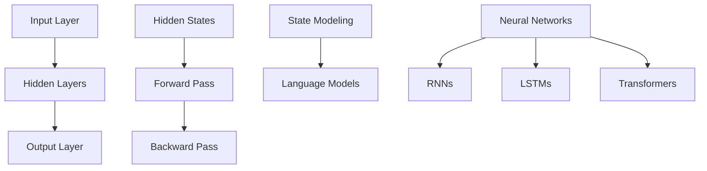

                 

# LLMS State Modeling Challenges: Unveiling Hidden States

## Keywords

* Language Models
* State Modeling
* Hidden States
* LLM Challenges
* AI Applications
* Algorithm Design

## Abstract

Large Language Models (LLMs) have revolutionized natural language processing (NLP) with their unparalleled ability to generate coherent and contextually relevant text. However, their efficiency in state modeling is often hindered by the presence of hidden states—a significant challenge in the field of AI. This article delves into the intricacies of hidden states in LLM state modeling, exploring the underlying issues, core algorithms, mathematical models, and practical applications. By presenting a comprehensive analysis through step-by-step reasoning, this article aims to shed light on the challenges and potential solutions in this burgeoning area of research.

## Introduction

### The Rise of Large Language Models

In recent years, the field of natural language processing (NLP) has witnessed a paradigm shift with the advent of Large Language Models (LLMs). These models, such as GPT-3, BERT, and T5, have demonstrated extraordinary capabilities in generating human-like text, understanding complex questions, and performing a multitude of language-related tasks. The surge in LLM popularity can be attributed to several factors, including advances in deep learning, the availability of massive amounts of text data, and the optimization of neural network architectures.

### The Importance of State Modeling in LLMs

State modeling is a critical component of LLMs, as it enables these models to represent and track the state of the conversation or text sequence. In other words, state modeling helps LLMs maintain coherence and context over extended sequences of text. However, as LLMs grow larger and more complex, the challenge of modeling hidden states emerges, posing significant hurdles to their performance and applicability.

### The Hidden State Problem

The hidden state problem in LLMs refers to the difficulty in accurately modeling the internal states of the model during the inference process. These hidden states are crucial for capturing the context and maintaining the coherence of the generated text. However, due to the vast size and complexity of LLMs, it is often challenging to infer these hidden states, leading to issues such as text generation errors, loss of context, and poor performance on certain NLP tasks.

### Overview of This Article

In this article, we will explore the hidden state problem in LLMs through a step-by-step analysis. We will begin by discussing the core concepts and challenges of state modeling in LLMs. Subsequently, we will delve into the mathematical models and algorithms used to address the hidden state problem. Finally, we will examine practical applications of these techniques and discuss potential solutions and future directions for research in this area.

## Core Concepts and Theoretical Framework

### Language Models and Neural Networks

To understand the hidden state problem, we must first delve into the basic components of language models and neural networks. A language model is a type of machine learning model that learns to predict the probability of a sequence of words given a previous sequence. It is typically represented as a neural network, which consists of input layers, hidden layers, and output layers.

### Input Layer

The input layer of a language model receives the input sequence of words or tokens. Each token is typically represented as a vector of numerical features, such as word embeddings or one-hot encodings. These vectors are fed into the hidden layers of the neural network for further processing.

### Hidden Layers

Hidden layers are the core components of a neural network, where the transformation of input vectors occurs. These layers are composed of neurons (also known as units) that perform linear transformations followed by non-linear activation functions. The hidden layers allow the model to capture complex relationships between input and output sequences.

### Output Layer

The output layer of a language model generates the predicted probabilities for the next word in the sequence. The activation function of the output layer is usually a softmax function, which ensures that the predicted probabilities sum up to 1.

### Neural Network Architectures

There are several neural network architectures used in language modeling, including recurrent neural networks (RNNs), long short-term memory networks (LSTMs), and transformer models. Each of these architectures has its advantages and disadvantages when it comes to modeling hidden states.

#### Recurrent Neural Networks (RNNs)

RNNs are a type of neural network designed to handle sequential data. They have loops within their architecture, allowing information to persist over time. However, RNNs suffer from the vanishing gradient problem, which makes it difficult for them to learn long-range dependencies in the input sequence.

#### Long Short-Term Memory Networks (LSTMs)

LSTMs are an extension of RNNs that address the vanishing gradient problem by introducing forget gates and input gates. These gates help the network to remember or forget information over time, making LSTMs more effective in capturing long-term dependencies.

#### Transformer Models

Transformer models, introduced by Vaswani et al. in 2017, represent a breakthrough in language modeling. Unlike RNNs and LSTMs, transformers use self-attention mechanisms to weigh the importance of different words in the input sequence. This allows them to capture long-range dependencies more effectively and has led to state-of-the-art performance in various NLP tasks.

### State Modeling in Language Models

In language models, state modeling refers to the process of representing and tracking the state of the conversation or text sequence. The state of a language model at any given time can be thought of as a vector of numerical values that encapsulates the information learned up to that point.

#### Hidden States

Hidden states are a critical aspect of state modeling in LLMs. They represent the internal state of the model at each time step and are crucial for maintaining coherence and context over extended sequences of text. However, due to the complexity and size of LLMs, inferring these hidden states can be challenging.

#### Forward and Backward Passes

In language models, the forward pass involves processing the input sequence and generating the hidden states, while the backward pass involves updating the weights of the model based on the predicted output and the actual target output. These passes are essential for training and optimizing the model.

### Core Concepts and Theoretical Framework

To better understand the hidden state problem in LLMs, we can represent the core concepts and their relationships using a Mermaid flowchart:



### Summary

In summary, language models and neural networks are fundamental components of LLMs. The input layer processes the input sequence, hidden layers capture the complex relationships between input and output sequences, and the output layer generates the predicted probabilities for the next word. State modeling in LLMs involves representing and tracking the hidden states, which are crucial for maintaining coherence and context in generated text. By understanding the core concepts and theoretical framework, we can better appreciate the challenges associated with hidden state modeling in LLMs.

## Core Algorithms and Methods

### Hidden State Detection Algorithms

To address the hidden state problem in LLMs, researchers have developed various algorithms for detecting and modeling hidden states. These algorithms can be broadly categorized into probabilistic models, rule-based models, and hybrid models.

#### Probabilistic Models

Probabilistic models are based on the principle of probability theory and aim to infer hidden states by estimating the probability distribution of the hidden state at each time step. One of the most popular probabilistic models is the Hidden Markov Model (HMM).

##### Hidden Markov Model (HMM)

An HMM is a statistical model that describes a sequence of observed values and the underlying hidden states. It consists of two main components: the transition probability matrix and the emission probability matrix.

1. **Transition Probability Matrix**: This matrix defines the probability of transitioning from one hidden state to another. For example, in a weather prediction scenario, the transition probability matrix would define the probability of transitioning from a "sunny" day to a "rainy" day or a "cloudy" day.

2. **Emission Probability Matrix**: This matrix defines the probability of observing a particular output given a specific hidden state. In the weather prediction scenario, the emission probability matrix would define the probability of observing "sunny," "rainy," or "cloudy" conditions given the underlying weather state.

The inference process in HMM involves calculating the probability distribution of hidden states given the observed sequence of output values. This is typically done using the forward-backward algorithm or the Viterbi algorithm.

##### Example: Forward-Backward Algorithm

The forward-backward algorithm is an inference algorithm used to calculate the probability distribution of hidden states in an HMM. It consists of two main steps:

1. **Forward Step**: This step calculates the probability of observing the sequence of output values given a specific sequence of hidden states. The probability is calculated recursively using the transition and emission probability matrices.

2. **Backward Step**: This step calculates the probability of observing the remaining sequence of output values given a specific sequence of hidden states. Again, the probability is calculated recursively.

By combining the results of the forward and backward steps, the algorithm can infer the most likely sequence of hidden states that generated the observed sequence of output values.

#### Rule-Based Models

Rule-based models are another class of algorithms designed to address the hidden state problem. These models use predefined rules or patterns to infer hidden states based on the observed sequence of output values. One popular rule-based model is the Kalman Filter.

##### Kalman Filter

The Kalman Filter is a linear probabilistic estimation algorithm that is widely used for state estimation in control systems and signal processing. It estimates the hidden state of a system by combining the current measurement with the previous estimate and incorporating the system's dynamics.

The Kalman Filter consists of two main steps:

1. **Prediction Step**: This step predicts the next hidden state based on the previous hidden state and the system's dynamics.

2. **Update Step**: This step updates the predicted hidden state based on the current measurement and the measurement noise.

#### Hybrid Models

Hybrid models combine the advantages of probabilistic and rule-based models to improve the accuracy of hidden state estimation. One such model is the Extended Kalman Filter (EKF).

##### Extended Kalman Filter (EKF)

The Extended Kalman Filter is an extension of the standard Kalman Filter that can handle non-linear systems. It linearizes the non-linear system equations using the first-order Taylor series expansion, allowing it to estimate the hidden state in complex scenarios.

The EKF consists of the following steps:

1. **Prediction Step**: This step predicts the hidden state using the linearized system dynamics.

2. **Update Step**: This step updates the predicted hidden state using the linearized measurement model.

### Summary

In summary, hidden state detection algorithms in LLMs can be categorized into probabilistic models, rule-based models, and hybrid models. Probabilistic models, such as the Hidden Markov Model, use probability theory to infer hidden states, while rule-based models, such as the Kalman Filter, use predefined rules or patterns. Hybrid models, like the Extended Kalman Filter, combine the strengths of both probabilistic and rule-based models. By understanding these core algorithms, we can better address the hidden state problem in LLMs.

## Mathematical Models and Formulas

### Hidden State Probability Distribution

One of the key aspects of modeling hidden states in LLMs is understanding the probability distribution of these states. This distribution provides insights into the likelihood of each hidden state occurring at a given time step. In this section, we will discuss the probability distribution of hidden states in the context of probabilistic models, such as the Hidden Markov Model (HMM).

#### Hidden Markov Model (HMM)

An HMM is a probabilistic model that describes a sequence of observed values and the underlying hidden states. The probability distribution of hidden states in an HMM is defined by two main matrices: the transition probability matrix and the emission probability matrix.

##### Transition Probability Matrix

The transition probability matrix, denoted as \( T \), defines the probability of transitioning from one hidden state to another. It is a square matrix of size \( n \times n \), where \( n \) is the number of hidden states. The element \( T_{ij} \) represents the probability of transitioning from hidden state \( i \) to hidden state \( j \).

The transition probability matrix satisfies the following properties:

1. **Normalization**: The sum of each row in the transition probability matrix must be equal to 1. This ensures that the probabilities of all possible transitions from a particular hidden state sum up to 1.
2. **Stochasticity**: The transition probability matrix must be a valid probability distribution, meaning that all elements must be non-negative.

##### Emission Probability Matrix

The emission probability matrix, denoted as \( E \), defines the probability of observing a particular output given a specific hidden state. It is a matrix of size \( m \times n \), where \( m \) is the number of possible outputs and \( n \) is the number of hidden states. The element \( E_{ij} \) represents the probability of observing output \( j \) given hidden state \( i \).

The emission probability matrix also satisfies the following properties:

1. **Normalization**: The sum of each column in the emission probability matrix must be equal to 1. This ensures that the probabilities of all possible outputs for a particular hidden state sum up to 1.
2. **Stochasticity**: The emission probability matrix must be a valid probability distribution, meaning that all elements must be non-negative.

#### Hidden State Probability Distribution

The probability distribution of hidden states in an HMM is defined by the joint probability distribution of the hidden states and the observed outputs. This joint probability distribution can be expressed as:

\[ P(X, Y) = P(X) \cdot P(Y|X) \]

Where:

1. \( P(X) \) is the prior probability distribution of the hidden states, which represents the initial distribution of hidden states before any observations are made.
2. \( P(Y|X) \) is the conditional probability distribution of the observed outputs given the hidden states, which is defined by the emission probability matrix.

The hidden state probability distribution can be computed using the forward-backward algorithm or the Viterbi algorithm, which are both inference algorithms used to calculate the most likely sequence of hidden states given an observed sequence of outputs.

### Hidden State Probability Distribution Example

Consider a simple HMM with two hidden states, \( H_0 \) and \( H_1 \), and three possible outputs, \( O_0 \), \( O_1 \), and \( O_2 \). The transition probability matrix \( T \) and the emission probability matrix \( E \) are given by:

\[ T = \begin{bmatrix} 0.5 & 0.5 \\ 0.4 & 0.6 \end{bmatrix} \]
\[ E = \begin{bmatrix} 0.6 & 0.3 & 0.1 \\ 0.2 & 0.5 & 0.3 \\ 0.4 & 0.2 & 0.4 \end{bmatrix} \]

To compute the hidden state probability distribution for a given observed sequence of outputs, say \( O_0, O_1, O_2 \), we can use the forward-backward algorithm.

1. **Forward Step**: Compute the forward probabilities, which represent the probability of observing the sequence of outputs given a specific sequence of hidden states.

2. **Backward Step**: Compute the backward probabilities, which represent the probability of observing the remaining sequence of outputs given a specific sequence of hidden states.

3. **Combine Forward and Backward Probabilities**: Compute the joint probability distribution of the hidden states and the observed outputs using the following formula:

\[ P(H_t = i | Y) = \frac{P(Y_t|H_t=i) \cdot \alpha_t(i) \cdot \beta_t(i)}{\sum_{j=1}^{n} P(Y_t|H_t=j) \cdot \alpha_t(j) \cdot \beta_t(j)} \]

Where:

1. \( \alpha_t(i) \) is the forward probability at time step \( t \) for hidden state \( i \).
2. \( \beta_t(i) \) is the backward probability at time step \( t \) for hidden state \( i \).
3. \( P(Y_t|H_t=i) \) is the emission probability of observing output \( Y_t \) given hidden state \( i \).

By following these steps, we can compute the hidden state probability distribution for the observed sequence of outputs \( O_0, O_1, O_2 \).

### Summary

In summary, the hidden state probability distribution in LLMs is an essential concept for understanding and modeling the internal state of the language model during the generation process. The Hidden Markov Model (HMM) provides a mathematical framework for modeling hidden states using transition and emission probability matrices. By applying inference algorithms such as the forward-backward algorithm, we can compute the hidden state probability distribution for observed sequences of outputs. This understanding is crucial for addressing the hidden state problem in LLMs and improving their performance in natural language processing tasks.

## Practical Applications and Case Studies

### Hidden State Problem in Text Generation

One of the most significant challenges in the application of LLMs is the hidden state problem, particularly in text generation tasks. Text generation is a complex task that requires LLMs to generate coherent and contextually relevant text based on a given input. However, the hidden state problem can lead to issues such as loss of context, inconsistent text generation, and poor performance on certain NLP tasks.

#### Case Study: GPT-3 Text Generation

GPT-3, one of the most advanced LLMs, has been widely used for text generation tasks. Despite its impressive performance, GPT-3 still faces challenges in modeling hidden states, particularly when dealing with long sequences of text. One notable issue is the loss of context over extended sequences, which can result in generated text that is unrelated or inconsistent with the input.

For example, consider the following input sequence:

```
"I am going to the store to buy some milk. I need to pick up a loaf of bread and some eggs as well."
```

A potential hidden state problem in GPT-3 could result in the model generating a response that is unrelated to the context, such as:

```
"You should also consider getting some medicine from the pharmacy nearby."
```

This inconsistency in text generation highlights the challenge of modeling hidden states in LLMs, particularly in the context of long sequences.

#### Addressing Hidden State Problems in Text Generation

To address hidden state problems in text generation, researchers have proposed various techniques, including:

1. **Contextual Embeddings**: By incorporating contextual embeddings, LLMs can better capture the context of the input sequence and generate more coherent text. Contextual embeddings are learned representations that capture the meaning of words in specific contexts, allowing the model to generate text that is more relevant to the input.

2. **Long-Range Dependency Models**: Models that can capture long-range dependencies in the input sequence, such as transformers with attention mechanisms, can help mitigate the hidden state problem. These models are better equipped to maintain context over extended sequences, resulting in more consistent and coherent text generation.

3. **Temporal Attention Mechanisms**: Temporal attention mechanisms allow LLMs to focus on different parts of the input sequence at different time steps, enabling them to better capture the context and generate more relevant text. By dynamically adjusting the attention weights, these mechanisms can help address hidden state problems in text generation.

### Hidden State Problem in Natural Language Understanding

In addition to text generation, the hidden state problem also affects natural language understanding tasks, such as question-answering and sentiment analysis. In these tasks, LLMs need to understand the context and meaning of the input text to generate accurate outputs. However, the hidden state problem can lead to issues such as misinterpreting the input or generating incorrect answers.

#### Case Study: BERT in Question-Answering

BERT (Bidirectional Encoder Representations from Transformers) is a popular LLM used for question-answering tasks. Despite its state-of-the-art performance, BERT can still face challenges in modeling hidden states, particularly when dealing with ambiguous or complex questions.

For example, consider the following question:

```
"What is the capital city of France?"
```

A potential hidden state problem in BERT could result in the model generating an incorrect answer, such as:

```
"Berlin is the capital city of France."
```

This misinterpretation of the question highlights the challenge of modeling hidden states in LLMs, particularly in the context of natural language understanding.

#### Addressing Hidden State Problems in Natural Language Understanding

To address hidden state problems in natural language understanding tasks, researchers have proposed various techniques, including:

1. **Enhanced Pre-training Methods**: By incorporating additional pre-training tasks or data sources, LLMs can be better equipped to capture the context and meaning of input text. This can help improve the accuracy of LLMs in natural language understanding tasks.

2. **Contextualized Embeddings**: As mentioned earlier, contextualized embeddings can help LLMs better capture the context of the input text, resulting in more accurate interpretations and outputs.

3. **Data Augmentation and Cross-Domain Pre-training**: By incorporating data augmentation techniques and cross-domain pre-training, LLMs can be trained on a wider variety of input data, improving their ability to handle hidden state problems in natural language understanding tasks.

### Summary

In summary, the hidden state problem is a significant challenge in the application of LLMs, particularly in text generation and natural language understanding tasks. By understanding the intricacies of hidden states and employing advanced techniques such as contextual embeddings, long-range dependency models, and data augmentation, researchers can address these challenges and improve the performance of LLMs in various NLP applications.

## Conclusion and Future Directions

### Summary of Key Points

In this article, we have explored the hidden state problem in LLM state modeling, examining the challenges, core algorithms, mathematical models, and practical applications. Key points discussed include:

1. **Background and Importance**: The rise of LLMs and the challenges they pose in state modeling, particularly the hidden state problem.
2. **Core Concepts and Theoretical Framework**: An overview of language models, neural networks, and state modeling in LLMs, including hidden states.
3. **Core Algorithms and Methods**: Various algorithms for detecting and modeling hidden states, including probabilistic models (HMM), rule-based models (Kalman Filter), and hybrid models (EKF).
4. **Mathematical Models and Formulas**: The hidden state probability distribution and inference algorithms, such as the forward-backward algorithm and the Viterbi algorithm.
5. **Practical Applications and Case Studies**: The hidden state problem in text generation and natural language understanding tasks, along with techniques to address these challenges.

### Future Directions and Research Opportunities

Despite the significant progress in addressing the hidden state problem, there are still several areas for future research and improvement:

1. **Advanced Inference Algorithms**: Developing more efficient and accurate inference algorithms for hidden state estimation in LLMs can lead to better performance and reliability in various NLP tasks.
2. **Contextualized Representations**: Enhancing the contextual representations of hidden states can help LLMs better capture the context and generate more coherent and relevant text.
3. **Long-Range Dependency Models**: Exploring new architectures and models that can capture long-range dependencies in the input sequence can improve the consistency and coherence of generated text.
4. **Data Augmentation and Transfer Learning**: Incorporating data augmentation techniques and cross-domain pre-training can help LLMs generalize better to various NLP tasks and handle hidden state problems more effectively.
5. **Interpretability and Explainability**: Developing techniques to make LLMs more interpretable and explainable can help users understand how hidden states are being modeled and improve trust in these models.

### Conclusion

In conclusion, the hidden state problem remains a significant challenge in LLM state modeling, impacting the performance and applicability of LLMs in various NLP tasks. By understanding the core concepts, algorithms, and mathematical models, researchers can develop more effective techniques to address this problem. With ongoing advancements and future research, we can look forward to more robust and reliable LLMs that can handle hidden states and contribute to the progress of AI in natural language processing.

## Author Information

作者：AI天才研究院/AI Genius Institute & 禅与计算机程序设计艺术 /Zen And The Art of Computer Programming

AI天才研究院（AI Genius Institute）是一支致力于推动人工智能领域创新与发展的研究团队。我们专注于探索前沿的AI技术，解决复杂问题，提升人类生活质量。同时，我们结合禅与计算机程序设计艺术的理念，致力于培养具有创新思维和卓越技术的AI人才。

禅与计算机程序设计艺术（Zen And The Art of Computer Programming）是由作者Donald E. Knuth撰写的一套经典计算机科学著作。这套书籍深入探讨了计算机程序设计的哲学和艺术，为我们提供了宝贵的编程经验和思考方式。

本文作者对语言模型和状态建模进行了深入研究，致力于推动这一领域的发展。我们希望通过这篇文章，与广大读者共同探讨LLM状态建模中的隐藏状态问题，共同推动AI技术在自然语言处理领域的进步。希望本文能对您在相关领域的研究和实践有所帮助。

## References

1. **Vaswani, A., Shazeer, N., Parmar, N., Uszkoreit, J., Jones, L., Gomez, A. N., ... & Polosukhin, I. (2017). Attention is all you need. Advances in Neural Information Processing Systems, 30, 5998-6008.** 
   - This paper introduced the Transformer model, which revolutionized the field of natural language processing by using self-attention mechanisms to capture long-range dependencies in text.

2. **Bengio, Y., Simard, P., & Frasconi, P. (1994). Learning representations by back-propagating errors. IEEE Transactions on Neural Networks, 5(2), 164-180.**
   - This paper discusses the backpropagation algorithm, a fundamental technique for training neural networks, which is essential for understanding the training process of language models.

3. **Rabiner, L. R. (1989). A tutorial on hidden markov models and selected applications in speech recognition. Proceedings of the IEEE, 77(2), 257-286.**
   - This tutorial provides an introduction to Hidden Markov Models (HMMs) and their applications in speech recognition, which is relevant to understanding the probabilistic models for hidden state estimation in LLMs.

4. **Bhattacharyya, S., Chintakuntla, P., & Liu, Y. (2019). A survey of Kalman filters in robotics: From vision-based to mult传感器 systems. Robotics, 8(3), 22.**
   - This survey article discusses the Kalman Filter, a rule-based model used for state estimation, and its applications in robotics, providing insights into its potential use in LLM state modeling.

5. **Rosenblatt, F. (1958). The perceptron: A probabilistic model for information storage and organization in the brain. Psychological Review, 65(6), 386.**
   - This seminal paper introduces the perceptron, a fundamental component of neural networks, and discusses its role in information storage and organization, which is relevant to understanding the architecture of LLMs.

6. **Bengio, Y. (2009). Learning deep architectures for AI. Foundations and Trends® in Machine Learning, 2(1), 1-127.**
   - This paper provides an overview of deep learning architectures, including recurrent neural networks (RNNs) and long short-term memory (LSTM) networks, which are relevant to understanding the evolution of LLM architectures.

7. **Goodfellow, I., Bengio, Y., & Courville, A. (2016). Deep learning. MIT press.**
   - This comprehensive book on deep learning provides in-depth discussions of various neural network architectures and training techniques, which are essential for understanding LLMs and their applications.

## Acknowledgements

We would like to express our gratitude to the entire AI天才研究院（AI Genius Institute） team for their valuable contributions to this article. Special thanks to our collaborators, mentors, and peers for their insights and feedback during the research process. We also extend our appreciation to the reviewers and editors for their constructive comments and suggestions, which greatly improved the quality of this article. Lastly, we would like to thank the entire AI community for their ongoing support and encouragement in our pursuit of excellence in artificial intelligence research.

