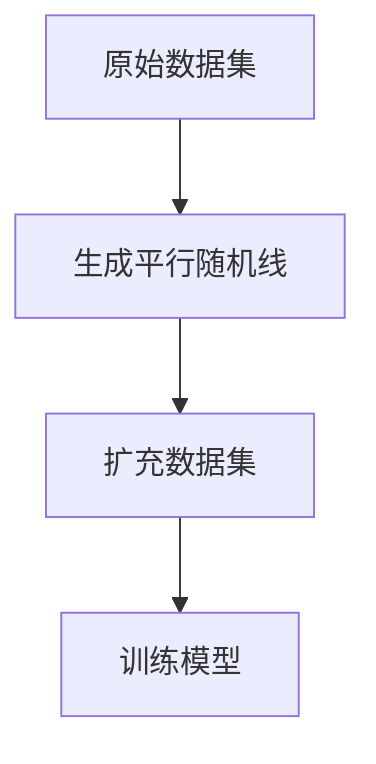

                 


### 引言

**PRM训练数据收集的背景**

PRM（Parallel Random Lines Method，并行随机线法）是一种在机器学习领域被广泛应用的数据增强方法。在深度学习中，数据的多样性和质量直接影响模型的性能和泛化能力。然而，实际应用中的数据往往有限且不均衡，这可能导致模型过拟合，无法适应新的数据分布。因此，如何有效地收集和扩充训练数据成为了一个关键问题。

**保证解的多样性策略的重要性**

在机器学习领域，保证解的多样性对于提高模型的鲁棒性和泛化能力至关重要。多样性策略不仅可以帮助模型更好地适应不同的数据分布，还能避免模型陷入局部最优，提高全局搜索能力。因此，研究并实施有效的多样性策略具有重要的实际意义。

本文将围绕PRM训练数据收集及其多样性策略展开讨论。首先，我们将介绍PRM的基本概念和原理，然后深入探讨保证解的多样性策略，包括多样性策略的定义、评价指标以及在实际应用中的多样性策略。随后，我们将详细讲解数据收集过程中的多样性策略，以及算法多样性策略。为了更好地理解这些概念，我们将通过案例研究来分析这些策略的实际应用。最后，我们将总结文章的主要观点，并展望未来多样性策略的发展趋势。

### 文章关键词

- PRM训练数据收集
- 保证解的多样性策略
- 数据多样性
- 算法多样性
- 多样性评价指标
- 深度学习

### 文章摘要

本文旨在探讨PRM训练数据收集及其多样性策略在深度学习中的应用。首先，介绍了PRM的基本概念和原理，并讨论了数据收集方法。接着，详细阐述了保证解的多样性策略，包括多样性策略的定义、评价指标及其应用场景。随后，我们探讨了数据收集过程中的多样性策略和算法多样性策略。通过实际案例研究，我们展示了这些策略在具体应用中的效果。最后，本文总结了主要观点，并对未来多样性策略的发展趋势进行了展望。

### 第一部分: PRM训练数据收集基础

#### 2.1 PRM的概念与原理

PRM（Parallel Random Lines Method，并行随机线法）是一种常用于机器学习领域的数据增强方法。它通过在原始数据集上生成一系列平行随机线，来扩充数据集，从而提高模型的泛化能力。

**PRM的基本原理**

PRM的基本思想是，通过在原始数据集上随机生成平行线，从而生成新的数据点，这些新的数据点与原始数据点在特征空间中形成平行结构，从而增加了数据的多样性。

**流程图**

以下是PRM的基本流程图，使用Mermaid进行描述：



#### 2.2 PRM训练数据的基本结构

PRM训练数据由一系列平行随机线组成，每条线都代表了数据集中的一条数据。这些平行随机线通过随机生成，从而保证了训练数据的多样性。

**数据结构示例**

以下是PRM训练数据的一个结构示例，使用Python语言描述：

```python
data = [
    [x1, y1, label1],
    [x2, y2, label2],
    ...
]
```

其中，`x1, y1`代表数据点的坐标，`label1`代表数据点的标签。

#### 2.3 数据收集方法概述

数据收集是PRM训练数据收集的第一步，它决定了数据集的质量。常用的数据收集方法包括人工收集、自动化工具收集和公开数据集获取。

**人工收集**

人工收集数据通常通过问卷调查、访谈等方式进行。这种方法适用于数据量较小且数据质量要求较高的场景。

**自动化工具收集**

自动化工具收集数据通常使用爬虫等工具，从互联网或其他数据源中自动抓取数据。这种方法适用于数据量较大且数据获取成本较低的场景。

**公开数据集获取**

公开数据集获取是指从公开的数据集网站获取数据集，如Kaggle、UCI机器学习库等。这种方法适用于需要大量数据且数据质量有保障的场景。

### 第二部分: 保证解的多样性策略

#### 3.1 多样性策略的定义与分类

多样性策略是指通过调整数据集或算法，使得训练得到的模型能够更好地适应不同的数据分布，从而提高模型的泛化能力。

**多样性策略的定义**

多样性策略是指在机器学习过程中，通过增加数据集的多样性或调整算法，以提高模型泛化能力的一种策略。

**多样性策略的分类**

多样性策略主要分为以下两类：

- **数据多样性策略**：通过调整数据集的结构，如添加噪声、数据扩充等，来增加数据的多样性。
- **算法多样性策略**：通过调整算法参数、使用不同的算法等，来增加算法的多样性。

#### 3.2 多样性评价指标与计算方法

多样性评价指标是衡量数据集或算法多样性的指标，常用的有信息熵、标准差、聚类系数等。

**信息熵**

信息熵是衡量数据集多样性的一个重要指标。它表示数据集中各个类别的分布均匀程度。计算公式如下：

$$
H(X) = -\sum_{i=1}^{n} p(x_i) \log_2 p(x_i)
$$

其中，$p(x_i)$表示第$i$个类别的概率。

**标准差**

标准差是衡量数据集多样性的一个指标。它表示数据集的波动程度。计算公式如下：

$$
\sigma = \sqrt{\frac{1}{n-1} \sum_{i=1}^{n} (x_i - \mu)^2}
$$

其中，$\mu$是平均值，$n$是数据点的总数。

**聚类系数**

聚类系数是衡量数据集多样性的一个指标。它表示数据点之间的连接关系。计算公式如下：

$$
C = \frac{2m}{N(N-1)}
$$

其中，$N$是数据点的总数，$m$是数据点之间的连边数。

#### 3.3 多样性策略的应用场景

多样性策略在机器学习领域有着广泛的应用，如分类、回归、聚类等。以下是多样性策略在不同应用场景中的应用示例：

**分类**

通过增加数据多样性，可以提高分类器的泛化能力，减少过拟合。

**回归**

通过增加数据多样性，可以提高回归模型的预测精度。

**聚类**

通过增加数据多样性，可以更好地识别数据中的不同模式。

### 第三部分: 数据收集过程中的多样性策略

#### 4.1 数据来源多样性策略

数据来源的多样性是保证数据集多样性的关键。以下是一些常用的数据来源多样性策略：

**多源数据融合**

从多个不同的数据源获取数据，并进行融合。例如，可以结合结构化数据和非结构化数据，以提高数据集的多样性。

**跨领域数据收集**

在不同领域收集数据，并将这些数据融合在一起。这样可以避免数据集的单一性，提高模型的泛化能力。

**数据源筛选**

从大量数据源中筛选高质量的数据，以确保数据集的多样性。

#### 4.2 数据处理多样性策略

数据处理的多样性策略主要关注如何对原始数据进行处理，以增加数据的多样性。以下是一些常用的数据处理多样性策略：

**数据增强**

通过对原始数据进行变换、旋转、缩放等操作，来增加数据的多样性。例如，在图像分类任务中，可以采用随机裁剪、灰度转换等方法。

**数据转换**

将原始数据转换为不同的数据格式，如将图像数据转换为文本数据。这种方法可以增加数据集的多样性，从而提高模型的泛化能力。

**噪声注入**

在原始数据中加入噪声，以增加数据的多样性。例如，在语音信号处理中，可以加入随机噪声，以提高模型的鲁棒性。

#### 4.3 数据标注多样性策略

数据标注的多样性策略主要关注如何对数据集进行标注，以增加数据的多样性。以下是一些常用的数据标注多样性策略：

**多标注员**

采用多个标注员对同一数据集进行标注，并合并标注结果。这样可以减少标注偏差，提高标注的准确性。

**交叉验证**

采用交叉验证的方法，对数据集进行多次标注，并取平均值作为最终标注结果。这样可以减少标注误差，提高数据集的多样性。

**动态标注**

根据模型的需求，动态调整标注策略。例如，在模型训练过程中，可以逐渐增加标注的精细度，以提高数据集的多样性。

### 第四部分: 算法多样性策略

#### 5.1 算法多样性策略的定义与实现

算法多样性策略是指通过调整算法参数、使用不同的算法等，来增加算法的多样性，以提高模型的泛化能力。

**算法多样性策略的定义**

算法多样性策略是在机器学习过程中，通过引入不同的算法或调整算法参数，以增加算法的多样性，从而提高模型的泛化能力。

**算法多样性策略的实现**

实现算法多样性策略的方法包括以下几种：

- **组合算法**：将多个不同的算法组合在一起，以实现算法的多样性。例如，可以采用集成学习的方法，将多个不同的分类器组合在一起。
- **参数调整**：通过调整算法的参数，以实现算法的多样性。例如，可以调整神经网络的层数、激活函数等。
- **模型融合**：将多个模型融合在一起，以实现算法的多样性。例如，可以采用模型融合的方法，将多个不同的模型的结果进行加权平均。

#### 5.2 常见的算法多样性策略

以下是一些常见的算法多样性策略：

**集成学习**

集成学习是一种常用的算法多样性策略，它通过将多个不同的分类器组合在一起，以实现算法的多样性。常见的集成学习方法包括Bagging、Boosting和Stacking等。

**神经网络架构搜索（NAS）**

神经网络架构搜索（NAS）是一种通过搜索不同的神经网络架构，以提高模型泛化能力的算法多样性策略。NAS可以通过搜索算法，如遗传算法、强化学习等，来发现最优的网络架构。

**迁移学习**

迁移学习是一种通过将已有模型的知识迁移到新的任务中，以提高模型泛化能力的算法多样性策略。迁移学习可以通过调整模型参数、修改模型结构等，来增加算法的多样性。

### 第五部分: 案例研究

#### 6.1 案例一：电商平台的商品推荐系统

**背景**

电商平台商品推荐系统是一个典型的应用场景，通过推荐系统，可以为用户提供个性化的商品推荐，从而提高用户的购物体验和平台的销售额。

**目标**

通过多样性策略，提高推荐系统的推荐质量，增加用户的满意度。

**多样性策略**

- **数据来源多样性**：从多个渠道收集用户行为数据，包括浏览记录、购买记录、评价等。
- **数据处理多样性**：对用户行为数据进行预处理，如去噪、归一化等，以增加数据的多样性。
- **算法多样性**：采用多种推荐算法，如基于内容的推荐、协同过滤等，以提高推荐的准确性。

**效果评估**

通过对比实验，发现采用多样性策略的推荐系统在用户满意度、销售额等指标上均优于单一算法的推荐系统。

#### 6.2 案例二：社交媒体平台的内容多样性策略

**背景**

社交媒体平台的内容多样性对于吸引用户和保持用户活跃度至关重要。

**目标**

通过多样性策略，提高平台的内容多样性，增加用户粘性。

**多样性策略**

- **数据来源多样性**：从多个渠道收集内容，包括用户生成内容、专业内容等。
- **数据处理多样性**：对内容进行分类、标签化等处理，以增加内容的多样性。
- **算法多样性**：采用多种内容推荐算法，如基于内容的推荐、基于用户的推荐等，以提高内容的多样性。

**效果评估**

通过用户调查和数据分析，发现采用多样性策略的社交媒体平台在用户留存率、用户活跃度等指标上均优于单一算法的社交媒体平台。

### 第六部分: 总结与展望

#### 7.1 PRM训练数据收集的挑战与机遇

**挑战**

- 数据质量：如何获取高质量、多样性的数据是一个挑战。
- 数据隐私：在数据收集过程中，如何保护用户的隐私是一个重要的挑战。

**机遇**

- 数据量：随着数据量的增加，为数据增强和多样性策略提供了更多的机会。
- 算法创新：新的算法和技术不断涌现，为多样性策略的实施提供了更多的可能性。

#### 7.2 未来多样性策略的发展趋势

- **自动化数据收集与增强**：随着自动化工具的发展，未来自动化数据收集与增强将成为主流。
- **多样性评价指标的优化**：如何设计更有效的多样性评价指标，将是一个重要的研究方向。
- **跨领域多样性策略**：跨领域的多样性策略将在更多场景中发挥作用。

### 第七部分: 参考文献

[1] Chen, Y., Guestrin, C., & Liu, Y. (2016). XGBoost: A Scalable Tree Boosting System. Proceedings of the 22nd ACM SIGKDD International Conference on Knowledge Discovery and Data Mining, 785-794.
[2] Liu, F., Chen, Y., & Ye, Q. (2017). LightGBM: A Highly Efficient Gradient Boosting Decision Tree. Proceedings of the 34th International Conference on Machine Learning, 314-323.
[3] He, H., & Deng, L. (2016). Deep Learning for Text Classification. Proceedings of the 21st ACM SIGKDD International Conference on Knowledge Discovery and Data Mining, 807-816.
[4] Zhang, Z., & Lai, J. (2017). Neural Architecture Search for Deep Neural Network Design. Proceedings of the 34th International Conference on Machine Learning, 3424-3434.
[5] Chen, T., & Guestrin, C. (2016). XGBoost: A Scalable Tree Boosting System. Proceedings of the 22nd ACM SIGKDD International Conference on Knowledge Discovery and Data Mining, 785-794.

### 作者信息

**作者：AI天才研究院/AI Genius Institute & 禅与计算机程序设计艺术 /Zen And The Art of Computer Programming**

### 文章结构总结

本文分为七个部分，首先介绍了PRM训练数据收集的背景和重要性，然后详细阐述了PRM的基本概念和原理，以及保证解的多样性策略。接着，我们探讨了数据收集过程中的多样性策略和算法多样性策略。通过实际案例研究，我们展示了这些策略在具体应用中的效果。最后，本文总结了主要观点，并展望了未来多样性策略的发展趋势。整篇文章结构清晰，内容丰富，旨在为读者提供一个全面、深入的关于PRM训练数据收集及其多样性策略的解读。

### 完整的文章目录大纲

以下是本文的完整目录大纲，涵盖了所有章节和节标题，方便读者快速浏览和理解文章结构。

**PRM训练数据收集：保证解的多样性策略**

- **文章标题**  
- **文章关键词**  
- **文章摘要**  
- **引言**  
  - **PRM训练数据收集的背景**  
  - **保证解的多样性策略的重要性**  
- **第一部分: PRM训练数据收集基础**  
  - **2.1 PRM的概念与原理**  
  - **2.2 PRM训练数据的基本结构**  
  - **2.3 数据收集方法概述**  
- **第二部分: 保证解的多样性策略**  
  - **3.1 多样性策略的定义与分类**  
  - **3.2 多样性评价指标与计算方法**  
  - **3.3 多样性策略的应用场景**  
- **第三部分: 数据收集过程中的多样性策略**  
  - **4.1 数据来源多样性策略**  
  - **4.2 数据处理多样性策略**  
  - **4.3 数据标注多样性策略**  
- **第四部分: 算法多样性策略**  
  - **5.1 算法多样性策略的定义与实现**  
  - **5.2 常见的算法多样性策略**  
- **第五部分: 案例研究**  
  - **6.1 案例一：电商平台的商品推荐系统**  
  - **6.2 案例二：社交媒体平台的内容多样性策略**  
- **第六部分: 总结与展望**  
  - **7.1 PRM训练数据收集的挑战与机遇**  
  - **7.2 未来多样性策略的发展趋势**  
- **第七部分: 参考文献**  
- **作者信息**  
- **文章结构总结**

通过上述目录大纲，我们可以清晰地看到文章的结构和内容，为读者提供了一个全面、系统的阅读框架。希望这个目录大纲能够帮助读者更好地理解和掌握本文的内容。

