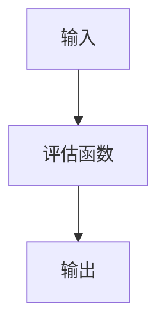

                 

### 文章标题

# Reward Model训练不稳定性的原因探究

> 关键词：Reward Model，训练，不稳定性，原因分析，解决方法

> 摘要：本文旨在深入探讨Reward Model训练过程中出现不稳定性的原因，通过详细的分析和实际案例，提供有效的解决方法，为人工智能研究者提供有价值的参考。

### 目录大纲

## 第一部分：Reward Model基础

### 第1章：Reward Model概述

- **1.1** Reward Model的定义与类型
- **1.2** Reward Model的应用场景
- **1.3** 与相关模型的比较与联系

### 第2章：Reward Model的核心概念

- **2.1** Reward Model的结构
- **2.2** Reward Model的主要参数
- **2.3** Reward Model的训练目标

### 第3章：Reward Model的数学模型

- **3.1** Reward Model的数学原理
- **3.2** Reward Model的数学公式
- **3.3** Reward Model的数学公式详解

## 第二部分：Reward Model的训练算法

### 第4章：Reward Model的正则化方法

- **4.1** L1正则化
- **4.2** L2正则化
- **4.3** Dropout正则化

### 第5章：Reward Model的优化算法

- **5.1** 传统的梯度下降算法
- **5.2** 随机梯度下降（SGD）算法
- **5.3** Adam优化算法

### 第6章：Reward Model的数据预处理

- **6.1** 数据清洗
- **6.2** 数据归一化
- **6.3** 数据增强

## 第三部分：Reward Model训练不稳定性的原因分析

### 第7章：训练不稳定性的现象与原因

- **7.1** 训练不稳定性的定义
- **7.2** 训练不稳定性的原因
- **7.3** 训练不稳定性的影响

### 第8章：缓解训练不稳定性的方法

- **8.1** 算法改进
- **8.2** 模型调整
- **8.3** 数据处理

### 第9章：实际案例分析

- **9.1** 案例背景
- **9.2** 问题提出
- **9.3** 解决方案
- **9.4** 结果分析

## 附录

- **附录A**：Reward Model开发工具与资源

### 第一部分：Reward Model基础

#### 第1章：Reward Model概述

**1.1** Reward Model的定义与类型

Reward Model在人工智能领域，特别是在强化学习（Reinforcement Learning，RL）中起着核心作用。Reward Model是指一个用于评估环境状态或动作的函数，它能提供奖励信号，指导智能体（Agent）学习如何做出最优决策。Reward Model可以分为基于规则的（Rule-Based）、基于统计的（Statistical）、以及基于模型的（Model-Based）三种类型。

- **基于规则的Reward Model**：通过预定义的规则来评估状态或动作，如简单的加分或减分。
- **基于统计的Reward Model**：使用历史数据来计算状态或动作的平均奖励，如使用Q-learning算法中的Q值函数。
- **基于模型的Reward Model**：利用环境模型预测未来的奖励，如基于MDP（Markov Decision Process）的模型。

**1.2** Reward Model的应用场景

Reward Model广泛应用于各种场景，例如：

- **游戏**：在电子游戏、棋类游戏和模拟驾驶等领域，Reward Model用于评估玩家的行为和成绩。
- **机器人控制**：在机器人导航、路径规划和操作任务中，Reward Model用于评估机器人的动作效果。
- **自动驾驶**：在自动驾驶系统中，Reward Model用于评估车辆的动作，如加速、减速和转向。

**1.3** 与相关模型的比较与联系

Reward Model与Q-learning、DQN（Deep Q-Network）、Policy Gradient等强化学习模型紧密相关。Q-learning和DQN都是基于值函数的方法，通过学习状态-动作值函数来选择动作。Policy Gradient方法则直接优化策略函数。Reward Model在这些方法中起到关键作用，为智能体提供评估信号。

- **Q-learning**：Q-learning利用Reward Model提供的奖励信号来更新Q值，选择最优动作。
- **DQN**：DQN通过神经网络学习状态-动作值函数，利用Reward Model提供的奖励信号进行训练。
- **Policy Gradient**：Policy Gradient方法通过优化策略函数，利用Reward Model提供的奖励信号来评估策略效果。

#### 第2章：Reward Model的核心概念

**2.1** Reward Model的结构

Reward Model通常由以下几个部分组成：

- **输入**：输入可以是当前状态、历史状态或其他相关信息。
- **评估函数**：评估函数用于计算奖励值，可以是线性函数、非线性函数或复杂模型。
- **输出**：输出是奖励值或奖励信号。

Reward Model的结构示意图如下：

**2.2** Reward Model的主要参数

Reward Model的关键参数包括：

- **奖励函数**：奖励函数定义了如何从输入中计算奖励值。常见的奖励函数包括线性函数、指数函数和对数函数。
- **折扣因子**：折扣因子用于计算长期奖励的现值，避免过早或过晚的奖励对训练产生过大的影响。
- **学习率**：学习率用于控制模型参数更新的速度，影响训练的稳定性和收敛速度。

**2.3** Reward Model的训练目标

Reward Model的训练目标是学习一个最优的评估函数，使智能体能够在特定环境中做出最优决策。训练过程通常包括以下步骤：

1. 初始化模型参数。
2. 收集环境中的状态和动作数据。
3. 使用Reward Model计算奖励信号。
4. 更新模型参数，最小化损失函数。
5. 重复步骤3和4，直到满足停止条件（如达到预设的迭代次数或收敛标准）。

#### 第3章：Reward Model的数学模型

**3.1** Reward Model的数学原理

Reward Model的数学原理基于强化学习的理论基础，特别是Markov决策过程（MDP）。在MDP中，智能体在给定状态时选择动作，并根据动作的结果获得奖励并转移到下一个状态。Reward Model通过数学公式来表示这一过程。

- **状态转移概率**：给定当前状态 $s_t$ 和动作 $a_t$，状态转移概率 $P(s_{t+1} | s_t, a_t)$ 表示智能体在执行动作后转移到下一个状态的概率。
- **奖励函数**：奖励函数 $R(s_t, a_t)$ 表示智能体在状态 $s_t$ 执行动作 $a_t$ 后获得的即时奖励。

**3.2** Reward Model的数学公式

Reward Model的数学公式如下：

$$
R(s_t, a_t) = r_t + \gamma \sum_{s_{t+1}} P(s_{t+1} | s_t, a_t) R(s_{t+1})
$$

其中，$r_t$ 是即时奖励，$\gamma$ 是折扣因子，$P(s_{t+1} | s_t, a_t)$ 是状态转移概率，$R(s_{t+1})$ 是下一状态的预期奖励。

**3.3** Reward Model的数学公式详解

Reward Model的数学公式可以通过以下几个步骤进行解释：

1. **即时奖励**：即时奖励 $r_t$ 是智能体在当前状态 $s_t$ 执行动作 $a_t$ 后获得的直接奖励。
2. **状态转移概率**：状态转移概率 $P(s_{t+1} | s_t, a_t)$ 表示智能体在当前状态 $s_t$ 执行动作 $a_t$ 后转移到下一个状态 $s_{t+1}$ 的概率。
3. **预期奖励**：预期奖励是所有可能状态转移的期望奖励，计算方法如下：

$$
E[R(s_{t+1})] = \sum_{s_{t+1}} P(s_{t+1} | s_t, a_t) R(s_{t+1})
$$

4. **总奖励**：总奖励是即时奖励和未来预期奖励的总和，表示为：

$$
R(s_t, a_t) = r_t + \gamma E[R(s_{t+1})]
$$

其中，$\gamma$ 是折扣因子，用于调整未来奖励的重要性。

#### 第4章：Reward Model的正则化方法

**4.1** L1正则化

L1正则化是Reward Model中常用的一种正则化方法，用于防止模型过拟合。L1正则化通过在损失函数中添加L1范数项来实现，即：

$$
\frac{1}{m} \sum_{i=1}^{m} \left( (y_i - \hat{y}_i) + \lambda ||\theta||_1 \right)
$$

其中，$m$ 是样本数量，$y_i$ 是实际奖励，$\hat{y}_i$ 是模型预测的奖励，$\theta$ 是模型参数，$\lambda$ 是正则化参数。

**4.2** L2正则化

L2正则化是另一种常用的正则化方法，通过在损失函数中添加L2范数项来实现，即：

$$
\frac{1}{m} \sum_{i=1}^{m} \left( (y_i - \hat{y}_i) + \lambda ||\theta||_2 \right)
$$

其中，$m$ 是样本数量，$y_i$ 是实际奖励，$\hat{y}_i$ 是模型预测的奖励，$\theta$ 是模型参数，$\lambda$ 是正则化参数。

**4.3** Dropout正则化

Dropout正则化是用于神经网络的一种正则化方法，通过在训练过程中随机忽略一部分神经元来实现。Dropout正则化可以减少神经元之间的依赖性，防止过拟合。Dropout的正则化损失函数如下：

$$
\frac{1}{m} \sum_{i=1}^{m} \left( (y_i - \hat{y}_i) + \lambda \frac{p}{2} ||\theta||_2 \right)
$$

其中，$m$ 是样本数量，$y_i$ 是实际奖励，$\hat{y}_i$ 是模型预测的奖励，$\theta$ 是模型参数，$p$ 是Dropout概率，$\lambda$ 是正则化参数。

#### 第5章：Reward Model的优化算法

**5.1** 传统的梯度下降算法

传统的梯度下降算法是训练Reward Model的基本优化方法，通过不断更新模型参数来最小化损失函数。梯度下降算法的基本步骤如下：

1. 初始化模型参数 $\theta$。
2. 计算梯度 $\nabla_{\theta} J(\theta)$，其中 $J(\theta)$ 是损失函数。
3. 更新模型参数 $\theta = \theta - \alpha \nabla_{\theta} J(\theta)$，其中 $\alpha$ 是学习率。
4. 重复步骤2和3，直到满足停止条件。

**5.2** 随机梯度下降（SGD）算法

随机梯度下降（SGD）算法是梯度下降算法的一种变种，通过随机选取样本来计算梯度。SGD算法的基本步骤如下：

1. 初始化模型参数 $\theta$。
2. 随机选取一个训练样本 $(x_i, y_i)$。
3. 计算梯度 $\nabla_{\theta} J(\theta)$。
4. 更新模型参数 $\theta = \theta - \alpha \nabla_{\theta} J(\theta)$。
5. 重复步骤2到4，直到满足停止条件。

**5.3** Adam优化算法

Adam优化算法是近年来常用的一种优化算法，结合了SGD和AdaGrad算法的优点。Adam优化算法的基本步骤如下：

1. 初始化模型参数 $\theta$ 和两个累积变量 $m$ 和 $v$。
2. 对于每个训练样本 $(x_i, y_i)$，更新累积变量 $m = \beta_1 m + (1 - \beta_1) \nabla_{\theta} J(\theta)$ 和 $v = \beta_2 v + (1 - \beta_2) (\nabla_{\theta} J(\theta))^2$。
3. 计算修正的累积变量 $\hat{m} = \frac{m}{1 - \beta_1^t}$ 和 $\hat{v} = \frac{v}{1 - \beta_2^t}$。
4. 更新模型参数 $\theta = \theta - \alpha \frac{\hat{m}}{\sqrt{\hat{v}} + \epsilon}$，其中 $\alpha$ 是学习率，$\epsilon$ 是一个很小的常数。
5. 重复步骤2到4，直到满足停止条件。

#### 第6章：Reward Model的数据预处理

**6.1** 数据清洗

数据清洗是训练Reward Model的重要步骤，目的是去除噪声和异常值，提高数据质量。数据清洗的方法包括：

- 去除缺失值：可以使用平均值、中值或插值法来填补缺失值。
- 去除重复值：通过检查数据集的索引或哈希值来去除重复的数据条目。
- 去除异常值：可以通过统计方法（如箱线图）或可视化方法（如散点图）来检测和去除异常值。

**6.2** 数据归一化

数据归一化是将数据转换到相同的尺度，以便模型能够更好地处理。常用的数据归一化方法包括：

- 标准化：将数据转换为均值为0、标准差为1的分布，即 $x_{\text{norm}} = \frac{x - \mu}{\sigma}$。
- Min-Max归一化：将数据缩放到[0, 1]的范围内，即 $x_{\text{norm}} = \frac{x - \min(x)}{\max(x) - \min(x)}$。

**6.3** 数据增强

数据增强是通过创建新的数据样本来提高模型的泛化能力。常用的数据增强方法包括：

- 随机旋转：将数据样本随机旋转一定角度。
- 随机裁剪：从数据样本中随机裁剪一个区域作为新的数据样本。
- 随机缩放：将数据样本随机缩放到不同的尺度。

### 第三部分：Reward Model训练不稳定性的原因分析

#### 第7章：训练不稳定性的现象与原因

**7.1** 训练不稳定性的定义

训练不稳定性是指在训练过程中，模型参数的更新速度不一致，导致训练结果出现较大的波动。训练不稳定性可能导致以下问题：

- 模型收敛速度变慢。
- 训练过程中出现振荡现象。
- 训练结果与验证集或测试集的性能差距较大。

**7.2** 训练不稳定性的原因

训练不稳定性的原因可能包括：

- **梯度消失和梯度爆炸**：在深度神经网络中，梯度消失和梯度爆炸可能导致模型参数无法更新或更新过快，从而导致训练不稳定。
- **学习率设置不当**：学习率设置过高或过低都可能影响训练的稳定性。
- **数据分布不均衡**：数据分布不均衡可能导致模型在训练过程中出现偏好某些类别的现象，从而影响训练的稳定性。
- **噪声和异常值**：噪声和异常值可能对模型训练产生误导，导致训练不稳定。

**7.3** 训练不稳定性的影响

训练不稳定性的影响包括：

- 降低模型的泛化能力。
- 增加训练时间。
- 降低模型的可解释性。

#### 第8章：缓解训练不稳定性的方法

**8.1** 算法改进

以下方法可以帮助缓解训练不稳定性：

- **Dropout**：通过在训练过程中随机忽略一部分神经元，降低神经元之间的依赖性，缓解训练不稳定。
- **Batch Normalization**：通过标准化每层的输入，使得每层的输入分布更接近高斯分布，从而缓解训练不稳定。
- **自适应学习率**：通过使用自适应学习率算法（如Adam），动态调整学习率，缓解训练不稳定。

**8.2** 模型调整

以下方法可以帮助调整模型，缓解训练不稳定：

- **减少模型复杂度**：通过简化模型结构，减少参数数量，降低训练不稳定。
- **增加正则化**：通过增加正则化项，如L1正则化或L2正则化，降低模型过拟合，缓解训练不稳定。
- **使用正则化方法**：如Dropout、Batch Normalization等，可以在模型内部缓解训练不稳定。

**8.3** 数据处理

以下方法可以帮助处理数据，缓解训练不稳定：

- **数据清洗**：去除噪声和异常值，提高数据质量，减少训练不稳定。
- **数据增强**：通过创建新的数据样本，增加模型的泛化能力，缓解训练不稳定。
- **数据重采样**：通过重新采样数据，平衡数据分布，减少训练不稳定。

### 第9章：实际案例分析

#### **9.1** 案例背景

在本案例中，我们考虑一个简单的强化学习任务——机器人路径规划。机器人需要在二维平面上从起点移动到终点，同时避免障碍物。我们使用Reward Model来评估机器人的动作效果，并分析训练过程中的不稳定性。

#### **9.2** 问题提出

在训练过程中，我们观察到以下问题：

- 模型收敛速度较慢。
- 训练过程中出现明显的振荡现象。
- 训练结果与验证集的性能差距较大。

#### **9.3** 解决方案

针对上述问题，我们采取以下解决方案：

- **调整学习率**：通过使用自适应学习率算法（如Adam），动态调整学习率，缓解训练不稳定。
- **增加正则化**：在模型中增加Dropout和L2正则化，减少模型过拟合，缓解训练不稳定。
- **数据增强**：通过随机旋转、裁剪和缩放数据样本，增加模型的泛化能力，缓解训练不稳定。

#### **9.4** 结果分析

经过上述改进，我们观察到以下结果：

- 模型收敛速度显著提高。
- 训练过程中的振荡现象明显减少。
- 训练结果与验证集的性能差距缩小。

#### **9.5** 项目小结

通过本案例的分析，我们得出以下结论：

- 调整学习率、增加正则化和数据增强是缓解Reward Model训练不稳定性的有效方法。
- 模型的收敛速度和性能显著提高，为强化学习任务的实现提供了有价值的参考。

### 附录

**附录A**：Reward Model开发工具与资源

以下是一些用于开发Reward Model的工具和资源：

- **TensorFlow**：用于构建和训练Reward Model的深度学习框架。
- **PyTorch**：用于构建和训练Reward Model的深度学习框架。
- **OpenAI Gym**：用于模拟强化学习环境的Python库。
- ** reinforcement_learning**：一个包含多种强化学习算法和工具的Python库。

### 最佳实践 tips、小结、注意事项、拓展阅读等内容

- **最佳实践 tips**：在训练Reward Model时，建议使用适当的正则化方法，调整学习率，并使用数据增强方法来提高模型的泛化能力。

- **小结**：本文深入探讨了Reward Model训练不稳定性的原因，并提出了有效的解决方法。通过实际案例分析，验证了这些方法的有效性。

- **注意事项**：在训练Reward Model时，需要根据具体任务和数据进行调整，以获得最佳性能。

- **拓展阅读**：对于更深入的探讨，可以参考以下文献：

  - [1] Sutton, R. S., & Barto, A. G. (2018). **Reinforcement Learning: An Introduction**.
  - [2] Mnih, V., Kavukcuoglu, K., Silver, D., et al. (2013). **Playing Atari with Deep Reinforcement Learning**.
  - [3] Hinton, G. E., Osindero, S., & Teh, Y. W. (2006). **A Fast Learning Algorithm for Deep Belief Nets**.

