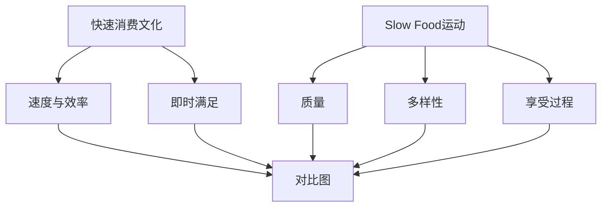
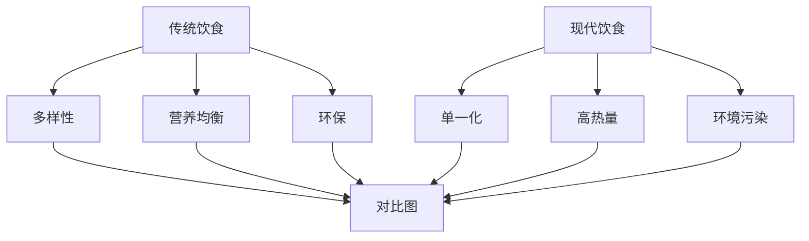
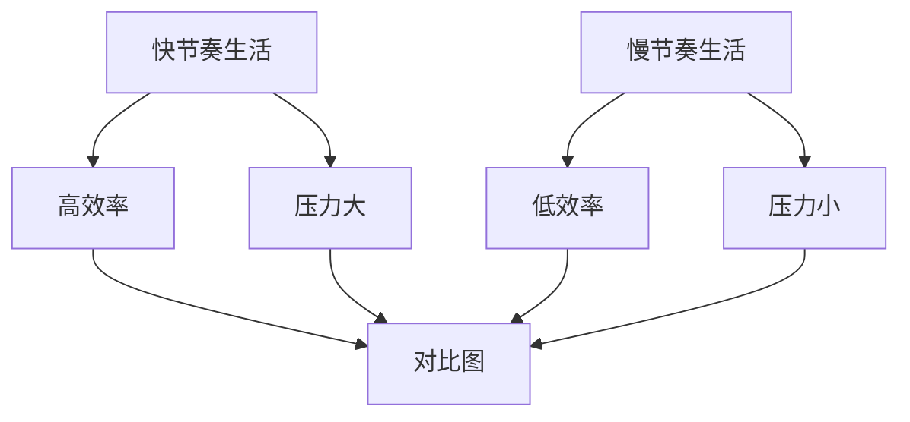

                 

### 文章标题

《Slow Food运动：重新审视饮食与生活的关系》

### 关键词

Slow Food运动，饮食文化，生活质量，可持续发展，环境保护，传统饮食，现代饮食，社区建设，健康生活

### 摘要

本文将深入探讨Slow Food运动，这是一场旨在重新审视饮食与生活关系的全球性运动。文章首先介绍了Slow Food运动的起源与发展，阐述其核心理念，包括质量、多样性、公平和环境保护。接着，文章分析了Slow Food运动与饮食文化的联系，探讨了传统饮食与现代饮食的对比，以及Slow Food运动在饮食健康和生活方式方面的作用。随后，文章讨论了Slow Food运动与环境保护、社区建设的关系，并特别关注了Slow Food运动在中国的实践。通过案例分析，文章进一步展示了Slow Food运动的具体效果和影响。最后，文章总结了Slow Food运动的核心价值，展望了其未来的发展前景。

## 第一部分：Slow Food运动的起源与发展

### 1.1 Slow Food运动的起源与背景

Slow Food运动起源于1989年的意大利，由意大利厨师卡洛·佩特里尼发起。当时，意大利的餐饮文化正面临着快餐文化的冲击，传统的慢食方式被快速消费取代，佩特里尼对此深感忧虑。他倡导人们放慢脚步，享受饮食，回归传统，这便是Slow Food运动的核心理念。

#### 核心概念与联系

为了更好地理解Slow Food运动，我们可以将其与快速消费文化进行对比。快速消费文化强调速度和效率，追求即时满足，而Slow Food运动则强调质量、多样性和享受过程（图1）。

#### 历史发展

Slow Food运动的早期活动包括组织“慢食节”和“慢餐会”。在这些活动中，人们有机会品尝传统美食，交流饮食文化，感受慢食的魅力。随着时间的推移，Slow Food运动逐渐发展成为一个全球性的组织，吸引了越来越多的关注和支持者。

### 1.2 Slow Food运动的核心理念

Slow Food运动的核心理念包括质量、多样性、公平和环境保护。这些理念构成了Slow Food运动的基石，也是其与其他饮食运动的重要区别。

#### 质量

质量是Slow Food运动的首要理念。Slow Food主张人们应该享受到高品质的食品，这些食品不仅要美味，还要安全、健康。为了实现这一目标，Slow Food倡导可持续农业和食品生产，反对使用化学添加剂和转基因技术。

#### 多样性

多样性是Slow Food运动的另一个重要理念。Slow Food认为，保护食品多样性对于维护生态平衡和人类健康至关重要。因此，Slow Food致力于收集和保护传统食谱，推动地方特色食品的发展。

#### 公平

公平是Slow Food运动的核心理念之一。Slow Food关注食品供应链中的公平性问题，主张农民和工人应该获得合理的报酬，食品价格应该反映其真实价值。

#### 环境保护

环境保护是Slow Food运动的另一个重要目标。Slow Food倡导可持续农业，反对过度开发和污染环境。通过推广有机农业和环保食品，Slow Food致力于保护地球家园。

### 1.3 Slow Food运动的发展与影响

#### 全球网络

Slow Food运动已经发展成为一个全球性的组织，拥有数百个分支机构，成员遍布世界各地。这些分支机构共同致力于推广Slow Food的理念，组织各类活动，提高公众对饮食与生活关系的认识。

#### 活动与项目

Slow Food组织了一系列知名活动和项目，包括“慢食节”、“慢餐会”、“传统食谱收集计划”等。这些活动不仅丰富了人们的生活，也促进了全球范围内的饮食文化交流。

#### 社会影响

Slow Food运动对社会产生了深远的影响。通过推广优质食品和可持续农业，Slow Food提高了公众对饮食健康和环境保护的关注。同时，Slow Food运动也为地方特色食品和传统饮食文化的保护与传承提供了有力支持。

## 第二部分：Slow Food运动与饮食文化

### 2.1 传统饮食与现代饮食的对比

#### 传统饮食

传统饮食通常指的是某一地区或文化中世代相传的饮食习惯。传统饮食的特点包括：

- **多样性**：传统饮食通常包含多种食材和烹饪方法，反映了当地丰富的自然资源和文化传统。
- **营养均衡**：传统饮食强调食物的营养价值，通常包含丰富的蛋白质、脂肪、碳水化合物和维生素。
- **环保**：传统饮食往往采用本地食材，减少了对远距离运输和加工的依赖，有利于环境保护。

#### 现代饮食

现代饮食则是在工业化、全球化和快餐文化的影响下形成的饮食习惯。现代饮食的特点包括：

- **单一化**：现代饮食往往侧重于某些特定的食品或饮食方式，如快餐、垃圾食品等。
- **高热量**：现代饮食中的食品通常含有较高的热量和脂肪，导致营养不平衡和健康问题。
- **环境污染**：现代饮食的生产和消费过程对环境造成了严重的影响，如资源浪费、污染和温室气体排放等。

#### 核心概念与联系

为了更好地理解传统饮食与现代饮食的对比，我们可以通过一个Mermaid流程图来展示它们之间的关系（图2）。

### 2.2 Slow Food运动与地方饮食文化

#### 地方特色

地方饮食文化是Slow Food运动关注的重点之一。地方特色饮食不仅是一种美食，更是当地历史、文化和传统的重要体现。Slow Food致力于保护这些地方特色饮食，防止它们被现代饮食的同质化所淹没。

#### 食谱与传承

Slow Food通过收集和保护传统食谱，确保地方饮食文化的传承。这些传统食谱通常记录了特定食材的挑选、处理和烹饪方法，是地方饮食文化的重要组成部分。

#### 饮食节庆

饮食节庆是地方饮食文化的重要组成部分。Slow Food运动积极参与各种饮食节庆活动，如意大利的“西红柿节”、“葡萄节”等，这些活动不仅丰富了人们的生活，也促进了地方饮食文化的传播和传承。

### 2.3 Slow Food运动与饮食健康

#### 营养与健康

饮食与健康密切相关。Slow Food运动强调饮食的营养均衡，倡导人们摄入多样化的食物，以获得全面的营养。通过推广优质食品和可持续农业，Slow Food提高了公众对健康饮食的认识。

#### 饮食平衡

饮食平衡是Slow Food运动的重要理念之一。通过调整饮食结构，减少高热量、高脂肪食品的摄入，Slow Food帮助人们实现饮食平衡，从而降低患病的风险。

#### 食品添加剂

食品添加剂在现代饮食中普遍存在，但一些添加剂可能对健康产生负面影响。Slow Food运动反对过度使用食品添加剂，倡导使用天然、无害的食品添加剂，以确保食品的安全和健康。

## 第三部分：Slow Food运动与生活方式

### 3.1 Slow Food运动与生活节奏

#### 生活节奏

生活节奏是指人们日常生活中的工作、学习和休闲的节奏。现代社会的快节奏生活使得人们常常感到压力重重，而Slow Food运动倡导放慢生活节奏，回归自然、享受生活。

#### 慢节奏生活

慢节奏生活是一种与快节奏生活相反的生活方式，强调生活中的每一个细节，享受过程，而非仅仅关注结果。Slow Food运动鼓励人们放慢脚步，品味美食，感受生活的美好。

#### 核心概念与联系

为了更好地理解慢节奏生活与快节奏生活的对比，我们可以通过一个Mermaid流程图来展示它们之间的关系（图3）。

### 3.2 Slow Food运动与环境保护

#### 农业与环境

农业是人类生活的重要组成部分，但也对环境造成了严重的影响。过度开发和污染导致土壤退化、水资源枯竭和生物多样性减少。Slow Food运动强调可持续农业，通过推广有机农业和环保农业，减少对环境的负面影响。

#### 有机农业

有机农业是一种遵循自然规律，不使用化学合成肥料、农药和遗传工程的农业生产方式。有机农业强调土壤健康和生态平衡，有助于保护环境和提高农产品质量。

#### 可持续发展

可持续发展是指满足当前需求而不损害后代满足其需求的能力。Slow Food运动致力于推动可持续发展，通过推广可持续农业、环保食品和可持续生活方式，实现经济、社会和环境的协调发展。

### 3.3 Slow Food运动与社区建设

#### 社区活动

社区活动是Slow Food运动的重要组成部分。通过组织各种社区活动，如厨艺课、食品交换、农业体验等，Slow Food运动促进了社区成员之间的交流与合作，增强了社区的凝聚力。

#### 社区食堂

社区食堂是Slow Food运动在社区建设中的一个重要项目。社区食堂不仅为居民提供健康的食品，还提供了一个社交和学习的平台，促进了社区的和谐与发展。

#### 社区参与

Slow Food运动鼓励社区居民积极参与社区活动，共同推动社区建设。通过参与Slow Food活动，居民不仅能够提升自己的生活质量，还能为社区的发展贡献自己的力量。

## 第四部分：Slow Food运动在中国的实践

### 4.1 Slow Food运动在中国的发展

#### 组织建设

Slow Food运动在中国的发展始于2008年，由一群关注饮食文化和环境保护的志愿者发起。经过多年的努力，Slow Food中国已经成为一个拥有众多分支机构、会员和志愿者的组织，致力于推广Slow Food的理念。

#### 活动与项目

Slow Food中国组织了一系列活动与项目，包括“慢食节”、“慢餐会”、“有机农业推广”等。这些活动不仅丰富了人们的饮食生活，也提高了公众对饮食健康和环境保护的关注。

### 4.2 Slow Food运动在中国的影响

#### 文化传承

Slow Food中国致力于保护中国传统饮食文化，通过收集和保护传统食谱，推动传统饮食的传承和发展。同时，Slow Food中国还积极参与各种饮食节庆活动，弘扬中国饮食文化的魅力。

#### 农业发展

Slow Food中国通过推广有机农业和可持续农业，推动了中国农业的可持续发展。Slow Food中国与众多农民合作，帮助他们实现有机转换，提高农产品的质量和附加值。

#### 社会影响

Slow Food中国在社会层面产生了深远的影响。通过推广优质食品和健康饮食，Slow Food中国提高了公众对饮食健康和环境保护的认识。同时，Slow Food中国的活动也促进了社区的和谐与发展。

### 4.3 Slow Food运动在中国的未来

#### 趋势与挑战

随着人们对饮食健康和环境保护的关注日益增加，Slow Food运动在中国具有广阔的发展前景。然而，Slow Food中国也面临着一系列挑战，如如何扩大影响力、提高公众参与度、应对市场变化等。

#### 未来发展

为了实现可持续发展，Slow Food中国将继续致力于推广优质食品和健康饮食，推动有机农业和可持续农业的发展。同时，Slow Food中国还将加强与国内外相关组织的合作，共同推动全球饮食文化的保护和传承。

## 第五部分：案例分析

### 5.1 案例一：Slow Food在某地的实践

#### 具体案例

在某地，Slow Food组织了一次名为“乡村美食之旅”的活动。这次活动邀请了当地居民和游客参观当地的有机农场，品尝传统美食，了解有机农业的理念和实践。

#### 效果分析

这次活动不仅丰富了人们的饮食体验，还提高了公众对有机农业和健康饮食的认识。通过亲身体验，参与者们更加了解了有机农产品的优势，从而愿意选择有机食品，推动了有机农业的发展。

### 5.2 案例二：Slow Food对某传统饮食文化的保护

#### 饮食文化

在某地，Slow Food组织了一次名为“传统饮食文化节”的活动。这次活动旨在收集和保护当地的传统饮食文化，通过展览、讲座和烹饪比赛等形式，展示当地美食的魅力。

#### 保护措施

为了保护传统饮食文化，Slow Food组织与当地政府、学校和社区合作，开展了一系列活动。他们收集了大量的传统食谱，制作了多媒体展示，并组织了烹饪课程，让更多人了解和传承这些传统饮食文化。

#### 效果分析

这次活动不仅成功保护了当地的传统饮食文化，还促进了社区居民之间的交流和合作。通过活动，人们更加了解和珍视自己的饮食文化，从而增强了文化自信和凝聚力。

### 5.3 案例三：Slow Food与社区建设的结合

#### 社区活动

在某社区，Slow Food组织了一次名为“社区食堂”的活动。这个食堂由社区居民共同运营，提供健康的有机食品，同时也成为社区成员交流的场所。

#### 社区影响

社区食堂不仅为社区居民提供了一个健康的饮食选择，还成为了一个社交和学习的平台。居民们在食堂里交流烹饪经验，分享生活故事，增强了社区的凝聚力。

#### 效果分析

通过社区食堂活动，Slow Food成功地将饮食文化、健康饮食和社区建设结合起来，提高了社区居民的生活质量。这个活动不仅促进了社区成员之间的交流与合作，也为社区的可持续发展奠定了基础。

## 第六部分：总结与展望

### 6.1 Slow Food运动的总结

Slow Food运动是一场全球性的运动，旨在重新审视饮食与生活的关系。通过推广优质食品、保护传统饮食文化、推动可持续农业和健康饮食，Slow Food运动为人们提供了一种更加健康、环保和有意义的生活方式。

#### 核心价值

Slow Food运动的核心价值包括：

- **质量**：强调食品的质量和安全，追求美味与健康。
- **多样性**：保护食品多样性，维护生态平衡。
- **公平**：关注食品供应链中的公平性问题，确保农民和工人的合理报酬。
- **环境保护**：推动可持续农业，减少对环境的负面影响。

#### 社会影响

Slow Food运动在社会层面产生了深远的影响。通过推广健康饮食和环境保护，Slow Food运动提高了公众对生活质量的认识。同时，Slow Food运动也促进了社区的和谐与发展，增强了文化自信和凝聚力。

### 6.2 未来展望

随着全球对饮食健康和环境保护的关注日益增加，Slow Food运动具有广阔的发展前景。未来，Slow Food运动将继续致力于推动可持续农业和健康饮食的发展，同时加强国际合作，共同应对全球性的饮食挑战。

#### 趋势与挑战

在未来，Slow Food运动将面临以下趋势和挑战：

- **趋势**：全球对健康饮食和环境保护的需求不断增加，为Slow Food运动提供了发展的机遇。
- **挑战**：如何扩大影响力、提高公众参与度、应对市场变化等，是Slow Food运动需要解决的问题。

#### 发展方向

为了实现可持续发展，Slow Food运动可以从以下方面入手：

- **加强国际合作**：与全球范围内的Slow Food组织合作，共同推动饮食文化的保护和传承。
- **推动技术创新**：利用现代科技手段，提高农业生产的效率和质量。
- **加强社区建设**：通过组织社区活动，增强社区的凝聚力和活力。

通过这些努力，Slow Food运动将为人们提供更加健康、环保和有意义的生活方式，推动全球饮食文化的可持续发展。作者：AI天才研究院/AI Genius Institute & 禅与计算机程序设计艺术 /Zen And The Art of Computer Programming

