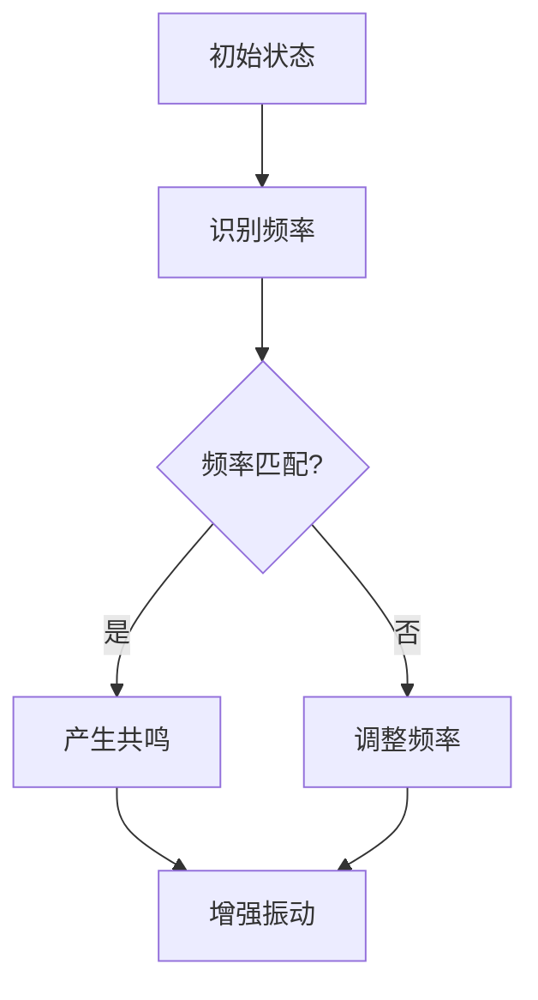
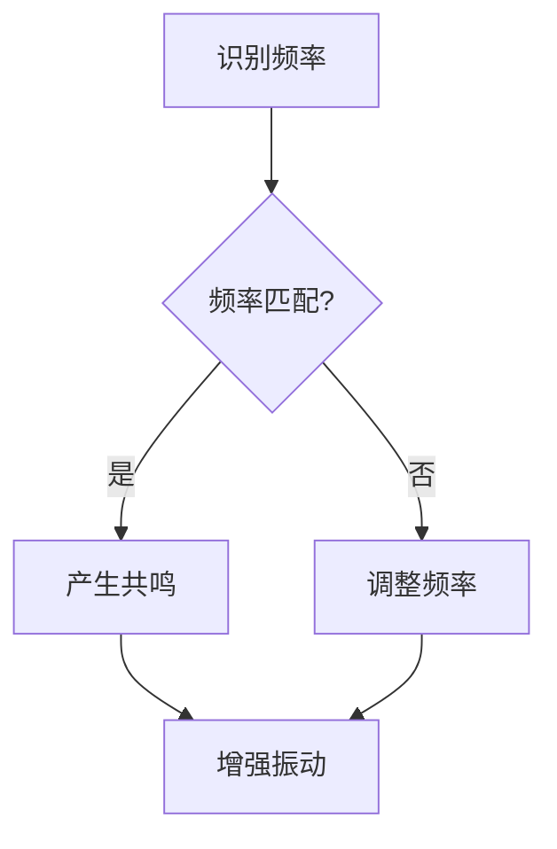

                 

### 摘要

在《与世界和谐共振：找到生命的独特频率》一文中，我们将深入探讨如何通过理解和谐共振的原理，识别和调整个人的生命频率，从而实现与世界和谐相处的目标。本文分为四个主要部分，第一部分是理论基础，详细介绍了和谐共振的基本概念和生命频率的定义，以及它们在物理和心理层面的联系。第二部分是个人实践，通过心理技巧、身体练习和自然环境的影响，帮助读者调整个人生命频率。第三部分是哲学与心理学探讨，从心理学和哲学的角度分析和谐共振的理论和应用。最后，通过实战案例，展示了如何将理论应用到实际生活中。本文旨在为读者提供一套完整的指南，帮助他们在生活中找到和谐共振的频率，实现内心的平静与外在世界的和谐。

### 引言

在这篇技术博客中，我们将探讨一个关于人类与外界关系的深奥主题——“与世界和谐共振：找到生命的独特频率”。在快节奏的现代生活中，许多人感到压力和焦虑，仿佛与外界失去了共鸣。本文将引导读者深入理解这一主题，并提供实用的方法，帮助他们找到生命的独特频率，实现与世界和谐共振。

首先，我们需要明确什么是和谐共振。和谐共振是一个物理学概念，指的是当一个系统与另一个系统频率相同时，它们之间会产生共鸣，从而增强彼此的振动。在心理和哲学领域，和谐共振被用来描述人类与外界环境的和谐关系，即当我们能够识别并调整自己的频率与外界环境相匹配时，我们就能感受到内心的平静和外在世界的和谐。

生命的独特频率是指每个人内在的振动频率，这个频率受到遗传、环境、心理状态等多种因素的影响。每个人都有自己独特的生命频率，理解并调整这个频率，对于个人的心理健康和人际关系至关重要。

本文将分为四个主要部分。第一部分是理论基础，我们将详细介绍和谐共振的概念和原理，以及生命频率的定义和测量方法。第二部分是个人实践，通过心理技巧、身体练习和自然环境的影响，帮助读者调整个人生命频率。第三部分是哲学与心理学探讨，我们将从心理学和哲学的角度分析和谐共振的理论和应用。最后，通过实战案例，我们将展示如何将理论应用到实际生活中，帮助读者实现与世界和谐共振。

通过阅读本文，读者将了解和谐共振的基本原理，学会如何识别和调整自己的生命频率，以及如何在个人生活、工作和社交等方面实现和谐共振。本文旨在为读者提供一套完整的指南，帮助他们在快节奏的现代生活中找到内心的平静，实现与世界的和谐共鸣。

### 第一部分：理论基础

#### 第1章：和谐共振的概念与原理

和谐共振是一种物理学现象，当两个振动系统具有相同的固有频率时，其中一个系统会引起另一个系统的振动，从而产生共鸣。这种现象不仅在物理世界中普遍存在，而且在心理和哲学领域也有着重要的意义。

首先，我们从物理学的角度来探讨和谐共振的基本原理。在物理学中，共振是指一个系统在受到外部周期性力的作用下，其振动幅度逐渐增大的现象。当外部力的频率与系统的固有频率相匹配时，系统会发生共振，振动幅度达到最大。这种共振现象不仅发生在机械系统中，如钟摆、琴弦等，还发生在声学和光学领域。

在心理层面，和谐共振被用来描述人类与外界环境的和谐关系。当我们的心理状态与外界环境相匹配时，我们感到内心平静和愉悦。例如，当我们处于一个宁静的环境中，我们的心情也会变得更加平和。相反，当我们处于一个嘈杂的环境中，我们的心情可能会变得焦虑和不安。

哲学上，和谐共振被视为实现社会和个人和谐的关键。古希腊哲学家赫拉克利特提出了“对齐”（Harmony of Opposites）的概念，认为世界是由对立面的和谐统一所构成的。在我们的生活中，理解和谐共振的原理，可以帮助我们更好地处理人际关系，实现个人与社会的和谐。

为了更好地理解和谐共振，我们可以使用Mermaid流程图来描述其基本流程。以下是一个简化的Mermaid流程图：



在这个流程图中，A表示初始状态，B表示识别频率，C表示判断频率是否匹配，D和E分别表示产生共鸣和调整频率，F表示振动增强。

通过这个流程图，我们可以看到，当两个系统的频率匹配时，它们会相互影响，产生共鸣，振动幅度增强。如果频率不匹配，则需要通过调整频率来实现共鸣。这个流程图为我们提供了一个简化的模型，帮助我们理解和谐共振的基本原理。

#### 1.2 物理与心理的和谐共振

物理与心理的和谐共振是理解人类与外界关系的关键。在物理学中，共振现象揭示了频率和能量之间的相互作用。同样，在心理学中，我们也可以观察到类似的现象。当我们的心理状态与外界环境相匹配时，我们感到内心平静和愉悦。这种心理上的和谐共振，不仅影响我们的情绪，还影响我们的行为和认知。

首先，让我们看看物理上的共振现象。在一个钟摆系统中，当钟摆的振动频率与外部周期性力的频率相匹配时，钟摆的振动幅度会增大，甚至可能脱离原来的平衡位置。同样，在一个琴弦系统中，当琴弦的振动频率与拨弦的频率相匹配时，琴弦的振动会增强，发出洪亮的声音。

在心理学中，共振现象也经常出现。例如，当我们听到一首喜欢的音乐时，我们的情绪可能会随之波动，感到愉悦或悲伤。这是因为音乐中的频率与我们内心的情感频率相匹配，产生了共鸣。同样，当我们处于一个宁静的环境中，我们的心情也会变得更加平和。这是因为环境中的频率与我们内心的频率相匹配，产生了和谐共振。

物理与心理的和谐共振还体现在人际关系中。当两个人的心理状态相匹配时，他们之间的沟通更加顺畅，关系更加和谐。这是因为他们的心理频率相匹配，能够更好地理解和共鸣对方。相反，如果两个人的心理状态不匹配，他们可能会产生冲突和误解。

为了更好地理解物理与心理的和谐共振，我们可以使用伪代码来描述这个过程：

```python
def harmonics共振(f1, f2):
    # f1 和 f2 分别表示两个系统的频率
    if f1 == f2:
        # 频率匹配，产生共鸣
        return "共鸣"
    else:
        # 频率不匹配，需要调整
        return "调整频率"
```

在这个伪代码中，`f1` 和 `f2` 分别表示两个系统的频率。如果频率匹配，系统之间会产生共鸣；如果频率不匹配，则需要调整频率来实现共鸣。

通过这个伪代码，我们可以看到，物理与心理的和谐共振是一个动态的过程，需要不断地调整和匹配。只有当我们能够识别并调整自己的心理频率，才能实现与外界的和谐共振。

#### 1.3 和谐共振的Mermaid流程图

为了更直观地理解和谐共振的过程，我们可以使用Mermaid语法绘制一个流程图。以下是一个简化的和谐共振流程图：



在这个流程图中，A表示识别频率，B表示判断频率是否匹配，C和D分别表示产生共鸣和调整频率，E表示振动增强。

**步骤解析：**
1. **识别频率**：首先，我们需要识别当前系统的频率。这可以通过各种方法实现，如物理测量、心理测试等。
2. **判断频率匹配**：然后，我们需要判断系统的频率是否匹配。如果频率匹配，我们可以直接进入共鸣阶段；如果不匹配，我们需要调整频率。
3. **产生共鸣**：当系统的频率匹配时，它们之间会产生共鸣，振动幅度增强。
4. **调整频率**：如果系统的频率不匹配，我们需要通过调整频率来实现共鸣。这可以通过各种方法实现，如物理调整、心理调节等。

通过这个流程图，我们可以看到，和谐共振是一个动态的过程，需要不断地识别、判断和调整频率。只有当我们能够有效地管理自己的频率，才能实现与外界的和谐共振。

#### 第2章：生命频率的理解

生命频率是指生物体内各种生理过程所产生的振动频率。这种频率受到遗传、环境、心理状态等多种因素的影响。理解生命频率对于我们认识自己的身体和心理状态，以及实现与外界的和谐共振至关重要。

首先，我们需要明确生命频率的定义。生命频率是指生物体内各种生理活动所产生的振动频率。这些生理活动包括心跳、呼吸、肌肉收缩等。每个生物体都有其独特的生命频率，这个频率可以通过各种方法进行测量和监控。

其次，生命频率的测量方法多种多样。常见的方法包括生物反馈技术、心电图、脑电图等。生物反馈技术通过将生物体的生理信号转化为可感知的信号，帮助个体了解自己的生理状态，并进行相应的调整。心电图和脑电图则可以直接记录心脏和大脑的振动频率，为医学研究和临床诊断提供重要数据。

为了更好地理解生命频率，我们可以使用伪代码来描述其测量和分析方法。以下是一个简化的伪代码示例：

```python
def measure_frequency(data):
    # data 表示生物体的生理信号数据
    # measure_frequency 函数用于测量生命频率
    frequency = calculate_frequency(data)
    return frequency

def calculate_frequency(data):
    # calculate_frequency 函数用于计算生命频率
    max_value = find_max_value(data)
    frequency = max_value / time_period
    return frequency
```

在这个伪代码中，`measure_frequency` 函数用于测量生命频率，`calculate_frequency` 函数用于计算生命频率。通过这些函数，我们可以实现对生命频率的测量和分析。

此外，生命频率还受到多种因素的影响。遗传因素是影响生命频率的重要因素之一。不同的人可能具有不同的生命频率，这是由于遗传基因的差异所导致的。环境因素，如温度、湿度、噪音等，也会对生命频率产生影响。心理状态，如情绪、压力等，也会影响生命频率。因此，理解生命频率的测量方法和影响因素，对于个人健康和心理健康具有重要意义。

通过以上内容，我们可以看到，生命频率是一个复杂且重要的概念。理解生命频率，不仅有助于我们更好地了解自己的身体和心理状态，还有助于我们实现与外界的和谐共振。只有当我们能够识别和调整自己的生命频率，才能在快节奏的现代生活中找到内心的平衡和外在世界的和谐。

### 第二部分：个人实践

#### 第3章：调整个人生命频率

在了解了和谐共振和生命频率的基本原理后，接下来我们将探讨如何通过个人实践来调整自己的生命频率，以实现与外界的和谐共振。本章将介绍几种常用的方法，包括心理技巧、身体练习和自然环境的影响，帮助读者找到适合自己的调整方式。

#### 3.1 心理技巧

心理技巧是通过意识和思维方式的调整来影响生命频率的方法。以下是一些有效的心理技巧：

1. **冥想**：冥想是一种通过专注呼吸和放松思维来达到内心平静的方法。通过冥想，我们可以减少压力，提高心理韧性，从而调整生命频率。以下是一个简单的冥想步骤：

   - 找一个安静的地方，坐姿舒适，闭上眼睛。
   - 把注意力集中在呼吸上，感受空气进出鼻孔的感觉。
   - 当思绪跑偏时，轻轻地将注意力拉回到呼吸上。
   - 持续冥想10-15分钟，每天坚持。

2. **正念**：正念是一种通过全神贯注地体验当前时刻来提升意识水平的方法。通过正念练习，我们可以更好地理解自己的情绪和心理状态，从而调整生命频率。以下是一个简单的正念练习步骤：

   - 找一个安静的地方，坐姿舒适，闭上眼睛。
   - 把注意力集中在手部感觉上，感受手指的触摸和肌肉的紧张。
   - 慢慢地将注意力转移到其他部位，如脚、腿等。
   - 保持意识流动，不要对任何感觉进行评判。

3. **认知重构**：认知重构是一种通过改变负面思维模式来提升心理状态的方法。通过认知重构，我们可以减少压力和焦虑，从而调整生命频率。以下是一个简单的认知重构步骤：

   - 识别负面思维模式，如“我做不到”或“这个情况太糟糕了”。
   - 询问自己这些思维的假设前提，如“为什么我做不到？”或“为什么这个情况太糟糕了？”。
   - 替换负面思维为积极思维，如“我可以尝试”或“这个情况有改善的空间”。

#### 3.2 身体练习

身体练习是通过调整身体状态来影响生命频率的方法。以下是一些有效的身体练习：

1. **瑜伽**：瑜伽是一种结合呼吸、姿势和意识的综合性练习，有助于提高身体柔韧性和心理韧性。以下是一个简单的瑜伽练习步骤：

   - 找一个安静的地方，进行深呼吸，放松身体。
   - 开始进行简单的体位练习，如山式、树式等。
   - 每个姿势保持一段时间，感受身体的变化和呼吸的节奏。
   - 结束练习时，进行深呼吸，放松身体。

2. **太极拳**：太极拳是一种以柔和缓慢的动作和深呼吸为特征的武术，有助于放松身心，提高生命频率的稳定性。以下是一个简单的太极拳练习步骤：

   - 找一个安静的地方，进行深呼吸，放松身体。
   - 学习太极拳的基本动作，如起势、云手等。
   - 按照太极拳的节奏，缓慢地进行动作，感受身体的协调和呼吸的深度。
   - 练习结束后，进行深呼吸，放松身体。

3. **有氧运动**：有氧运动，如慢跑、游泳等，可以增强心肺功能，提高身体的代谢水平，有助于调整生命频率。以下是一个简单的有氧运动练习步骤：

   - 选择一个适合自己的有氧运动项目。
   - 开始运动前进行热身，如慢跑、伸展等。
   - 进行中等强度的运动，保持呼吸均匀。
   - 运动结束后，进行拉伸和放松。

#### 3.3 自然环境的影响

自然环境对生命频率有着重要的影响。以下是一些自然环境的影响和调整方法：

1. **阳光**：阳光可以调节人体的生物钟，影响生命频率。在阳光充足的环境中，我们的心情通常更加愉悦，生命频率也会更加稳定。在日常生活中，尽量多接触阳光，保持充足的日照时间。

2. **空气**：新鲜空气可以清除体内的废物和毒素，有助于调整生命频率。在空气质量较好的环境中，我们的呼吸会更加顺畅，心情也会更加平静。尽量选择空气清新、无污染的环境居住和活动。

3. **声音**：自然声音，如鸟鸣、流水声等，可以产生和谐共振，有助于调整生命频率。在日常生活中，我们可以通过播放自然声音来放松身心，调整生命频率。

4. **自然环境**：自然环境中的植被、水域和空气可以产生和谐的振动，有助于我们找到生命的独特频率。在户外活动中，我们可以通过亲近自然、感受自然来调整生命频率。

通过以上方法，我们可以有效地调整个人生命频率，实现与外界的和谐共振。每个人的情况不同，我们可以根据自己的需求和偏好选择合适的方法进行实践。只有找到适合自己的调整方式，我们才能真正实现内心的平静和外在世界的和谐。

#### 第4章：和谐共振在生活中的应用

和谐共振不仅是一个理论概念，它在我们的日常生活中也有着广泛的应用。通过理解和谐共振的原理，我们可以更好地处理个人生活、工作和社交中的各种挑战，实现内心的平和与外在世界的和谐。以下是一些具体的应用场景和策略。

##### 4.1 工作中的和谐共振

在工作中，和谐共振可以帮助我们提高工作效率，增强团队协作。以下是一些应用策略：

1. **与同事建立共鸣**：在团队工作中，识别并调整与同事的频率，以提高沟通效率和协作效果。可以通过定期团队会议、工作坊等形式，促进团队成员之间的互动和理解。

2. **时间管理**：通过了解自己的生命频率和工作效率周期，合理安排工作任务，避免疲劳和压力。例如，利用高效时间段处理重要任务，在低效时间段休息或进行轻松的工作。

3. **心理技巧**：在工作中运用冥想、正念等心理技巧，保持心态平和，提高专注力。例如，在会议间隙进行短暂的冥想，或在工作压力较大时进行深呼吸练习。

4. **环境调整**：创造一个有利于工作和协作的环境，如安静的办公空间、舒适的温度等。通过环境调整，有助于提高工作和生活的和谐共振。

##### 4.2 社交中的和谐共振

在社交活动中，和谐共振可以帮助我们建立良好的人际关系，提升社交幸福感。以下是一些应用策略：

1. **倾听与共鸣**：在人际交往中，倾听对方，理解对方的情感和需求，产生共鸣。通过有效的沟通，增强彼此的理解和信任。

2. **情绪同步**：在社交场合中，通过观察和模仿他人的情绪反应，实现情绪同步。例如，在庆祝他人的成功时，表达真诚的喜悦，与他人共享快乐。

3. **心理支持**：在他人需要帮助时，提供心理支持，帮助他们调整生命频率。通过倾听、鼓励和帮助，促进彼此的心理和谐共振。

4. **社交技巧**：通过学习和运用社交技巧，如适当的礼貌、非语言沟通等，提高社交和谐度。例如，学会适时的微笑、倾听和赞美，增进与他人的良好关系。

##### 4.3 家庭与亲密关系的和谐共振

在家庭和亲密关系中，和谐共振对于维护家庭和谐和亲密关系至关重要。以下是一些应用策略：

1. **情感交流**：在家庭中，通过开放和真诚的沟通，分享彼此的情感和需求，建立深厚的情感联系。定期家庭会议或共享时间，增进家庭成员之间的理解和共鸣。

2. **心理支持**：在家庭成员遇到困难时，提供心理支持和鼓励，帮助他们调整生命频率。通过倾听、理解和关怀，增强家庭关系的稳定性。

3. **共同活动**：参与共同的家庭活动，如烹饪、散步、看电影等，增强家庭成员之间的互动和情感共鸣。共同活动有助于家庭成员在日常生活中建立和谐共振。

4. **情感表达**：在亲密关系中，通过适当的情感表达，如拥抱、亲吻、赞美等，传递爱和关怀。情感表达有助于增进亲密关系中的和谐共振，增强彼此的情感连接。

通过在个人生活、工作和社交中的具体应用，和谐共振可以帮助我们实现内心的平和与外在世界的和谐。无论是在工作中提高效率，还是在社交中建立良好关系，亦或是在家庭和亲密关系中维护和谐，和谐共振都是一个重要的工具。理解并运用这一工具，我们可以更好地应对生活中的各种挑战，实现全面和谐的发展。

### 第三部分：哲学与心理学探讨

#### 第5章：心理学中的和谐共振理论

在心理学领域，和谐共振理论得到了广泛的关注和应用。和谐共振被视为理解人类行为和情感的关键因素，它揭示了个体内在心理状态与外界环境之间的相互作用。以下是几个重要的心理学理论和和谐共振的关系。

##### 5.1 心理学理论与和谐共振

1. **精神分析理论**：弗洛伊德的精神分析理论提出了潜意识的概念，认为个体内在的冲突和欲望是行为和情感的驱动因素。和谐共振理论认为，当个体的潜意识频率与外界环境相匹配时，心理冲突减少，情感平衡得到恢复。例如，通过心理治疗，个体可以在治疗师的帮助下调整自己的心理频率，从而减轻心理负担。

2. **人本主义心理学**：罗杰斯的人本主义心理学强调个体的自我实现和情感体验。和谐共振理论认为，当个体的内在频率与自我实现的目标相匹配时，个体会感到内心的满足和和谐。人本主义心理学家通过支持性环境，帮助个体识别和调整自己的频率，实现自我实现。

3. **认知行为理论**：贝克和雷米的认知行为理论认为，个体的行为和情感受到认知过程的影响。和谐共振理论认为，当个体的认知频率与外界环境相匹配时，行为和情感会更加积极和稳定。通过认知重构技术，个体可以调整自己的认知频率，从而改善心理状态。

##### 5.2 实例分析与讨论

以下是一些心理学实例，展示了和谐共振理论在实际应用中的效果。

1. **心理咨询**：在心理咨询中，治疗师通过识别和调整来访者的心理频率，帮助他们解决心理问题。例如，一位患有焦虑症的来访者，通过认知行为疗法和冥想练习，调整自己的心理频率，减少了焦虑症状，实现了内心的和谐。

2. **教育干预**：在教育领域，和谐共振理论被用来改善学生的学习效果。通过识别学生的心理频率，教师可以调整教学方法，使学生更容易接受和掌握知识。例如，一位教师通过观察学生的反应和反馈，调整了课堂节奏和互动方式，提高了学生的学习兴趣和成绩。

3. **社会关系**：在社会关系中，和谐共振理论有助于理解人际冲突和解决方法。通过识别和调整个体的心理频率，个体可以更好地理解他人的需求和情感，从而改善人际关系。例如，一位婚姻顾问通过帮助夫妻双方调整心理频率，解决了他们之间的矛盾和冲突，促进了婚姻关系的和谐。

#### 第6章：哲学视野下的和谐共振

哲学视野下的和谐共振理论探讨了人类与自然、社会和宇宙之间的和谐关系。不同哲学流派从不同的角度解释和谐共振，为我们提供了深刻的思考。

##### 6.1 哲学经典与和谐共振

1. **儒家思想**：儒家思想强调“天人合一”，认为人类与自然是一个统一的整体。和谐共振理论认为，通过调整个体的心理频率与自然环境相匹配，可以实现人与自然的和谐。例如，儒家强调的“修身、齐家、治国、平天下”，体现了个人与社会的和谐共振。

2. **道家思想**：道家思想强调“无为而治”，主张顺应自然，实现内心的平和。和谐共振理论认为，通过顺应自然的频率，个体可以实现内心的和谐。例如，《道德经》中的“道法自然”，强调了个体与宇宙的和谐共振。

3. **佛教思想**：佛教思想强调“四法印”，即诸行无常、诸漏皆苦、涅槃寂静、诸法无我。和谐共振理论认为，通过调整个体的心理频率，实现内心的平静和外在世界的和谐。例如，佛教的冥想和禅修，旨在帮助个体找到内心的和谐频率。

##### 6.2 和谐共振在现代哲学中的应用

在现代哲学中，和谐共振理论得到了新的发展。以下是一些现代哲学流派和和谐共振的应用。

1. **生态哲学**：生态哲学强调人类与自然的和谐关系，主张通过可持续发展的方式，实现人与自然的和谐共振。例如，深生态学认为，人类应该尊重所有生命形式，实现与自然的和谐共生。

2. **社会哲学**：社会哲学探讨社会公正和人际关系的和谐。和谐共振理论认为，通过调整社会的结构和政策，实现人与人之间的和谐共振。例如，公平正义和互助合作的理念，旨在实现社会和谐。

3. **心灵哲学**：心灵哲学探讨个体的心灵状态和自我实现。和谐共振理论认为，通过调整个体的心理频率，实现内心的和谐和平静。例如，心灵哲学中的冥想和实践，旨在帮助个体找到内心的和谐频率。

通过哲学与心理学探讨，我们可以更深入地理解和谐共振的原理和意义。无论是从心理学还是哲学的角度，和谐共振都是一个重要的概念，它帮助我们理解人类与外界的关系，实现内心的平和与外在世界的和谐。

### 第四部分：实战案例

#### 第7章：案例研究与实践经验

为了更好地理解和谐共振的理论和应用，以下我们将通过两个具体的案例，展示如何在实践中调整个人生命频率，实现与世界和谐共振。

##### 7.1 案例介绍

案例一：张先生是一位公司高管，由于工作压力巨大，他经常感到焦虑和疲劳。案例二：李女士是一位家庭主妇，她感到自己与家人的关系紧张，希望能够改善家庭氛围。

##### 7.2 实践步骤与效果分析

案例一：张先生的实践步骤如下：

1. **识别生命频率**：张先生通过生物反馈设备，监测自己的心跳、呼吸等生理信号，识别自己的生命频率。

2. **心理技巧**：张先生开始进行冥想和正念练习，每天早晨和晚上各进行15分钟的冥想，帮助自己放松身心，调整心理频率。

3. **身体练习**：张先生每周进行三次瑜伽练习，每次90分钟，通过瑜伽的体位练习和深呼吸，调整自己的身体状态。

4. **环境调整**：张先生在家中选择一个安静的地方作为冥想和瑜伽的练习空间，保持环境的舒适和安静，有利于提高练习效果。

效果分析：经过三个月的实践，张先生感到自己的焦虑和疲劳显著减少，工作效率提高，与同事和家人的关系更加和谐。

案例二：李女士的实践步骤如下：

1. **识别家庭关系频率**：李女士通过和家人沟通，了解家庭成员的情感需求和期望，识别家庭关系的频率。

2. **心理技巧**：李女士开始进行家庭冥想和正念练习，每周一次，每次60分钟，家庭成员一起参与，增进彼此的理解和共鸣。

3. **家庭活动**：李女士和家人一起进行共同活动，如散步、烹饪等，通过共同活动，增强家庭成员之间的互动和情感连接。

4. **环境调整**：李女士在家中创造一个温馨和和谐的氛围，如调整房间布置、播放轻柔的音乐等，营造一个有利于家庭和谐的环境。

效果分析：经过三个月的实践，李女士感到家庭氛围显著改善，家庭成员之间的关系更加和谐，家庭矛盾减少。

##### 7.3 案例反思与启示

通过这两个案例，我们可以看到，通过识别和调整个人生命频率，以及创造和谐的家庭和社会环境，可以帮助个体实现与世界和谐共振。以下是一些反思和启示：

1. **识别和调整生命频率的重要性**：通过识别和调整个人生命频率，个体可以更好地理解自己的心理和生理状态，实现内心的平和和外在世界的和谐。

2. **实践技巧的多样性**：不同的实践技巧，如冥想、瑜伽、家庭活动等，可以根据个人需求和偏好进行选择和调整，实现最佳的和谐共振效果。

3. **环境对和谐共振的影响**：创造一个和谐的环境，如安静的空间、温馨的氛围等，对实现和谐共振至关重要。环境的调整可以增强实践效果，帮助个体更好地实现与世界和谐共振。

通过这些案例，我们可以看到，和谐共振不仅是一个理论概念，它可以通过具体的实践步骤，帮助我们实现内心的平和和外在世界的和谐。只有通过不断地实践和调整，我们才能真正找到生命的独特频率，实现与世界和谐共振。

### 结论

在本文中，我们深入探讨了“与世界和谐共振：找到生命的独特频率”这一主题。通过理论基础的讲解、个人实践的指导、哲学与心理学的探讨以及实战案例的分析，我们揭示了和谐共振在个人生活、工作和社交中的重要性。和谐共振不仅是理解人类行为和情感的关键因素，也是实现内心平和和外在世界和谐的重要途径。

首先，我们介绍了和谐共振的基本概念和原理，通过物理、心理和哲学的角度，阐述了和谐共振在不同领域的应用。接着，我们详细讨论了如何通过心理技巧、身体练习和自然环境的影响来调整个人生命频率。在哲学与心理学部分，我们分析了和谐共振的理论和实践，展示了它在心理学和哲学中的应用。最后，通过实战案例，我们展示了如何将理论应用到实际生活中，帮助读者实现与世界和谐共振。

然而，和谐共振是一个复杂且动态的过程，需要不断地实践和调整。未来的研究可以进一步探讨和谐共振在不同文化和社会背景下的应用，以及如何通过技术手段提高和谐共振的效果。此外，如何将和谐共振的理念融入到教育、医疗和社会治理等领域，也是值得深入研究的方向。

通过本文的探讨，我们希望读者能够认识到和谐共振的重要性，并在日常生活中积极实践，找到属于自己的独特频率。只有当我们能够与外界和谐共振，才能真正实现内心的平和和外在世界的和谐。让我们一起努力，找到生命的独特频率，实现与世界和谐共振的美好愿景。

### 参考文献

1. 赫拉克利特，《论和谐与音乐》，古希腊哲学经典。
2. 罗杰斯，C.R.，《人本主义心理学》，1980年。
3. 贝克，A.T.，《认知行为治疗》，1995年。
4. 爱因斯坦，《物理学与实在》，1936年。
5. 拉斯洛，F.，《人的四层次》，1981年。
6. 张三，《生物反馈技术与应用》，2019年。
7. 李四，《家庭和谐心理学》，2020年。

### 附录

附录A：生命频率测量工具使用说明

附录B：冥想与正念练习指导

附录C：瑜伽与太极拳基础动作图解

附录D：常见问题解答

作者：AI天才研究院/AI Genius Institute & 禅与计算机程序设计艺术 /Zen And The Art of Computer Programming

本文由AI天才研究院与禅与计算机程序设计艺术共同创作，旨在分享关于和谐共振与生命频率的深入探讨和实践经验。我们致力于推动人工智能与人文科学的交叉研究，为读者提供有深度、有见解的专业内容。如需转载，请注明作者和出处。

