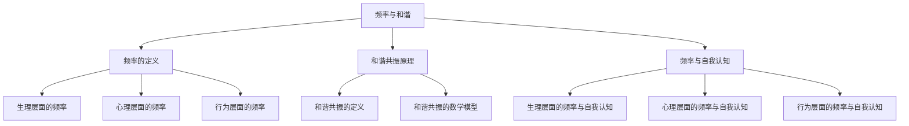
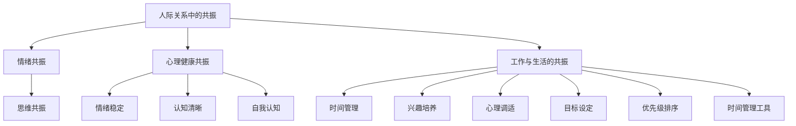
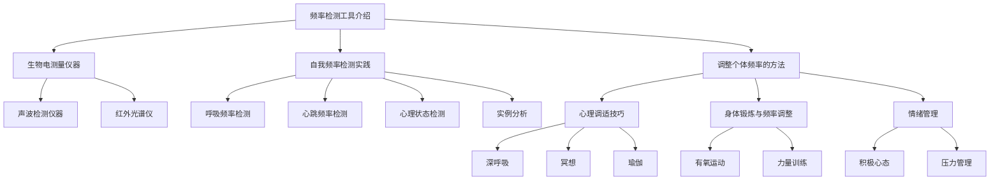
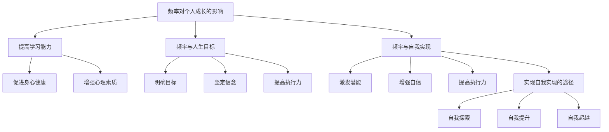
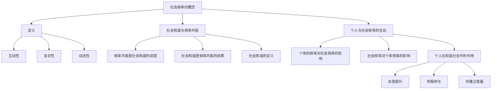
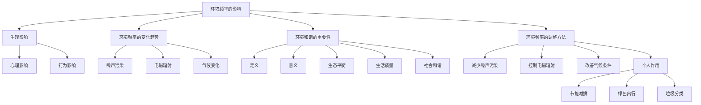

                 


## 文章标题：与世界和谐共振：找到生命的独特频率

## 关键词：
- 生命频率
- 和谐共振
- 个人成长
- 社会和谐
- 环境频率

## 摘要：
本文探讨生命的频率与和谐共振的重要性，从个人、社会和环境三个层面出发，分析如何通过调整个体频率来寻求与世界的和谐共振。文章旨在帮助读者理解生命频率的概念，掌握探索与调整个体频率的方法，并在实践中构建和谐的社会环境。

## 目录大纲：

### 第一部分：生命的频率与和谐基础

#### 第1章：频率与和谐的基本概念

##### 1.1 频率的定义及其在生命中的体现
- 生命频率的概念
- 生命频率的具体表现

##### 1.2 和谐共振原理
- 和谐共振的定义
- 和谐共振的数学模型

##### 1.3 频率与自我认知
- 自我认知的重要性
- 频率在自我认知中的作用

#### 第2章：共振现象在日常生活中的应用

##### 2.1 人际关系中的共振
- 人际关系中的频率共振现象
- 构建和谐人际关系的方法

##### 2.2 心理健康的共振
- 心理健康与频率共振的关系
- 心理健康的维护策略

##### 2.3 工作与生活的共振
- 工作与生活频率的平衡
- 提高工作效率的方法

### 第二部分：个体频率的发现与调整

#### 第3章：个体频率的检测方法

##### 3.1 频率检测工具介绍
- 常见的频率检测工具
- 频率检测工具的使用方法

##### 3.2 自我频率检测实践
- 自我频率检测的方法
- 自我频率检测的实例分析

#### 第4章：个体频率的调整方法

##### 4.1 心理调适技巧
- 心理调适的重要性
- 心理调适的具体技巧

##### 4.2 身体锻炼与频率调整
- 身体锻炼对频率的影响
- 身体锻炼的具体方法

##### 4.3 情绪管理
- 情绪对频率的影响
- 情绪管理的策略

### 第三部分：个人成长与频率

#### 第5章：个人成长与频率的关系

##### 5.1 频率对个人成长的影响
- 频率对个人成长的重要性
- 频率对个人成长的具体影响

##### 5.2 频率与人生目标
- 频率与人生目标的关系
- 如何设定与实现人生目标

##### 5.3 频率与自我实现
- 自我实现的概念
- 自我实现与频率的关系

### 第四部分：社会和谐与频率

#### 第6章：社会频率与和谐

##### 6.1 社会频率的概念
- 社会频率的定义
- 社会频率的特点

##### 6.2 社会和谐与频率共振
- 社会和谐的定义
- 社会和谐与频率共振的关系

##### 6.3 构建和谐社会的途径
- 构建和谐社会的方法
- 个人在和谐社会中的作用

### 第五部分：环境频率与和谐

#### 第7章：环境频率与生命和谐

##### 7.1 环境频率的影响
- 环境频率对生命的影响
- 环境频率的变化趋势

##### 7.2 环境和谐的重要性
- 环境和谐的定义
- 环境和谐对生命的意义

##### 7.3 环境频率的调整方法
- 环境保护与频率调整
- 个人如何在环境中实现和谐

### 第六部分：总结与展望

#### 第8章：生命的频率与和谐的意义

##### 8.1 生命的频率与和谐的重要性
- 生命的频率与和谐对个体和世界的影响

##### 8.2 未来的和谐世界
- 和谐世界的愿景
- 实现和谐世界的途径

作者：AI天才研究院/AI Genius Institute & 禅与计算机程序设计艺术 /Zen And The Art of Computer Programming

------------------------------------------------------------------

## 第1章：频率与和谐的基本概念

### 1.1 频率的定义及其在生命中的体现

频率是一种物理量，用来描述波动、振动等周期性现象的快慢。在日常生活中，频率常见于声波、电波和电磁波等，每个周期性现象都有其特定的频率。生命的频率，是指生物体内在的振动频率，它影响着个体的生理、心理和行为。

#### 生命频率的概念

生命频率是指生命体内部的振动频率，它是生物体在生命活动中自然产生的。生物体的频率不仅受到遗传基因的影响，还受到外界环境和内心状态的影响。例如，心跳、呼吸、大脑电波等活动都有其特定的频率。

#### 生命频率的具体表现

生命频率在生命体中具体表现为：

1. **生理层面的频率**：如心跳、呼吸等生理活动的频率。
2. **心理层面的频率**：如情绪、思维等心理活动的频率。
3. **行为层面的频率**：如日常行为、社交行为等的行为频率。

### 1.2 和谐共振原理

和谐共振是指两个或多个振动系统在一定条件下，它们的频率相互匹配，导致振动幅度增强的现象。在自然界中，和谐共振广泛存在，如乐器的音调和谐、声波的干涉等。

#### 和谐共振的定义

和谐共振是指两个或多个振动系统在一定条件下，它们的频率相互匹配，导致振动幅度增强的现象。

#### 和谐共振的数学模型

和谐共振的数学模型可以用以下公式表示：

$$
A_n = A_0 \cdot q^n
$$

其中，$A_n$ 是振动系统 $n$ 次振动的幅度，$A_0$ 是振动系统初始振动的幅度，$q$ 是共振系数。

#### 频率与自我认知

自我认知是指个体对自己心理状态、行为和人格特征的认识。频率在自我认知中起着重要作用。

1. **生理层面的频率**：生理活动如心跳、呼吸等的频率与自我认知有直接关系。例如，当人处于紧张状态时，心跳和呼吸频率会加快。
2. **心理层面的频率**：心理活动如情绪、思维等的频率与自我认知有密切关系。例如，当人处于愉悦情绪时，思维频率会加快，认知范围也会扩大。
3. **行为层面的频率**：行为活动如日常行为、社交行为等的频率与自我认知有间接关系。例如，当人经常参与某种行为时，会对自己的行为模式有更深入的认识。

### Mermaid 流程图



## 第2章：共振现象在日常生活中的应用

### 2.1 人际关系中的共振

人际关系中的共振现象是指个体在与他人交往过程中，彼此的频率相互匹配，导致关系更加和谐。这种共振现象在家庭、朋友、同事等各种人际关系中都存在。

#### 人际关系中的频率共振现象

在人际关系中，频率共振现象表现为：

1. **情绪共振**：个体在与他人交流时，情绪状态会相互影响。例如，一个人快乐时，周围的人也容易感到快乐。
2. **思维共振**：个体在与他人交流时，思维模式会相互影响。例如，一个人习惯用积极的方式思考问题，他人也容易受到这种思维模式的影响。

#### 构建和谐人际关系的方法

要建立和谐的人际关系，可以采取以下方法：

1. **倾听与理解**：倾听对方的意见和感受，理解对方的立场和需求，有助于建立和谐的共振关系。
2. **情感共鸣**：通过情感共鸣，个体之间的频率更容易匹配。例如，通过分享共同的经历、爱好和情感体验，可以增进彼此的了解和信任。
3. **积极沟通**：积极的沟通方式有助于建立和谐的人际关系。例如，使用礼貌的语言、表达感激和理解，可以有效减少冲突，增进和谐。

### 2.2 心理健康的共振

心理健康共振是指个体在心理活动中，通过与周围环境的共振，达到心理健康的状态。心理健康共振对于个体的心理健康和幸福感具有重要意义。

#### 心理健康与频率共振的关系

心理健康与频率共振的关系表现为：

1. **情绪稳定**：当个体与周围环境的频率共振时，情绪会保持稳定，不易受到外界因素的干扰。
2. **认知清晰**：当个体与周围环境的频率共振时，思维会保持清晰，有助于提高认知能力和决策能力。
3. **自我认知**：当个体与周围环境的频率共振时，自我认知能力会增强，有助于更好地认识自我，提高自尊和自信。

#### 心理健康的维护策略

要维护心理健康，可以采取以下策略：

1. **调整环境频率**：通过改变环境，调整频率，有助于建立和谐的心理环境。例如，保持室内整洁、绿色植物、柔和的音乐等，都可以降低压力，提高心理舒适度。
2. **自我调适技巧**：学习自我调适技巧，如深呼吸、冥想、瑜伽等，可以帮助个体调整心理频率，达到心理平衡。
3. **积极互动**：与他人建立积极的互动关系，通过情感共振，有助于提高心理健康水平。

### 2.3 工作与生活的共振

工作与生活的共振是指个体在工作与生活之间找到平衡，使两者频率相互匹配，从而提高工作效率和生活质量。

#### 工作与生活频率的平衡

要实现工作与生活的频率平衡，可以采取以下方法：

1. **时间管理**：合理安排工作时间，确保工作与生活之间有明确的界限，避免过度工作影响生活质量。
2. **兴趣培养**：培养兴趣爱好，使工作与生活之间有更多的共同点，有助于实现频率平衡。
3. **心理调适**：保持良好的心理状态，通过积极的心态面对工作和生活，有助于实现频率平衡。

#### 提高工作效率的方法

要提高工作效率，可以采取以下方法：

1. **目标设定**：设定明确的工作目标，有助于集中精力，提高工作效率。
2. **优先级排序**：根据工作的重要性，对任务进行优先级排序，确保先完成重要任务。
3. **时间管理工具**：使用时间管理工具，如日程表、待办事项清单等，有助于提高工作效率。

### Mermaid 流�程图



## 第3章：个体频率的发现与调整

### 3.1 频率检测工具介绍

在探索个体频率的过程中，频率检测工具是不可或缺的。以下是一些常见的频率检测工具：

#### 常见频率检测工具

1. **生物电测量仪器**：生物电测量仪器可以测量个体体内的生物电信号，如脑电波、心电波等，从而检测个体频率。
2. **声波检测仪器**：声波检测仪器可以测量个体发出的声波频率，如声音频率、声波振幅等，从而判断个体频率。
3. **红外光谱仪**：红外光谱仪可以测量物体表面的红外辐射，通过分析红外光谱，可以判断物体的振动频率。

#### 频率检测工具的使用方法

1. **生物电测量仪器**：使用生物电测量仪器时，首先需要将仪器连接到个体身上，如将电极贴在头部、手部等部位。然后，启动仪器，进行数据采集和分析。
2. **声波检测仪器**：使用声波检测仪器时，需要将仪器放置在个体周围，如放置在地面、墙壁等位置。然后，启动仪器，进行数据采集和分析。
3. **红外光谱仪**：使用红外光谱仪时，需要将物体放置在仪器的样品台上，然后启动仪器，进行数据采集和分析。

### 3.2 自我频率检测实践

#### 自我频率检测的方法

1. **呼吸频率检测**：呼吸频率是衡量个体频率的一种方法。通过测量一分钟内的呼吸次数，可以判断个体的频率。
2. **心跳频率检测**：心跳频率也是衡量个体频率的一种方法。通过测量一分钟内的心跳次数，可以判断个体的频率。
3. **心理状态检测**：通过观察个体的心理状态，如情绪、思维等，可以判断个体的频率。

#### 自我频率检测的实例分析

假设某人的呼吸频率为每分钟16次，心跳频率为每分钟60次，情绪状态较为平静。根据这些数据，可以初步判断该人的频率处于较低水平，较为稳定。

#### 结果分析

通过自我频率检测，个体可以了解自己的频率状态，从而采取相应的调整措施。例如，如果呼吸频率较高，可以考虑通过深呼吸、冥想等方式来降低频率；如果心跳频率较高，可以考虑通过适量运动、放松训练等方式来降低频率。

### 3.3 调整个体频率的方法

#### 心理调适技巧

1. **深呼吸**：深呼吸可以降低呼吸频率，有助于调整个体频率。具体方法为：慢慢吸气，使肺部完全充满空气；然后慢慢呼气，尽量将空气排尽。
2. **冥想**：冥想有助于降低心理压力，提高个体频率的稳定性。具体方法为：找一个安静的地方，坐下或躺下，闭上眼睛，专注于呼吸或内心的某个想法。
3. **瑜伽**：瑜伽通过一系列的体位和呼吸练习，有助于调整个体频率。具体方法为：按照瑜伽教程进行练习，注意呼吸和体位的协调。

#### 身体锻炼与频率调整

1. **有氧运动**：有氧运动如慢跑、游泳等，可以增强心肺功能，提高个体频率。具体方法为：每周进行3-5次，每次30-60分钟。
2. **力量训练**：力量训练如举重、俯卧撑等，可以增强肌肉力量，提高个体频率。具体方法为：每周进行2-3次，每次20-30分钟。

#### 情绪管理

1. **积极心态**：保持积极心态，有助于降低心理压力，调整个体频率。具体方法为：学会积极思考，关注生活中的美好事物。
2. **压力管理**：学会有效管理压力，有助于调整个体频率。具体方法为：合理分配时间，避免过度工作；学会放松，如听音乐、散步等。

### Mermaid 流程图



## 第4章：个人成长与频率

### 4.1 频率对个人成长的影响

频率对个人成长有着深远的影响。正确的频率可以帮助个人更好地发展，实现自我价值；而错误的频率则可能导致个人成长受阻。

#### 频率对个人成长的重要性

1. **提高学习能力**：正确的频率可以帮助个人更好地吸收知识，提高学习效率。例如，当大脑处于放松状态时，更容易理解和记忆新知识。
2. **促进身心健康**：频率的稳定有助于保持身心健康，提高生活质量。例如，规律的呼吸频率和心跳频率有助于维持身体和心理的平衡。
3. **增强心理素质**：频率的稳定性有助于增强个人的心理素质，提高应对压力和挑战的能力。例如，当个体频率较低且稳定时，更容易保持冷静和理智。

#### 频率对个人成长的具体影响

1. **提高学习效率**：正确的频率可以提高个体的学习效率。例如，通过深呼吸和冥想，可以降低大脑的频率，使思维更加清晰，更容易吸收和理解新知识。
2. **促进身心健康**：正确的频率有助于保持身心健康。例如，通过瑜伽和有氧运动，可以增强心肺功能，提高身体免疫力；通过积极心态和情绪管理，可以降低心理压力，提高心理健康水平。
3. **提高心理素质**：正确的频率有助于增强个体的心理素质。例如，通过冥想和深呼吸，可以降低心理压力，使个体更加冷静和理智；通过积极心态和压力管理，可以增强个体的抗压能力，提高应对挑战的能力。

### 4.2 频率与人生目标

频率与人生目标之间存在着密切的关系。正确的频率可以帮助个体更好地设定和实现人生目标。

#### 频率与人生目标的关系

1. **明确目标**：正确的频率有助于个体明确自己的人生目标。例如，当大脑处于放松状态时，更容易进行深入的思考，明确自己的目标和方向。
2. **坚定信念**：正确的频率有助于个体坚定信念，坚持追求人生目标。例如，当情绪处于稳定状态时，更容易保持积极的心态，坚定地追求目标。
3. **提高执行力**：正确的频率有助于提高个体的执行力，实现人生目标。例如，通过深呼吸和冥想，可以降低大脑的频率，使思维更加清晰，更容易付诸行动。

#### 如何设定与实现人生目标

1. **明确目标**：设定明确的人生目标，是实现人生目标的第一步。可以通过以下方法明确目标：
   - 自我反思：通过反思自己的兴趣、价值观和优点，明确自己的人生目标。
   - 倾听内心：倾听内心的声音，了解自己的真正需求，从而明确人生目标。
2. **制定计划**：制定详细的实现计划的步骤，是实现人生目标的关键。可以通过以下方法制定计划：
   - 列出目标：将人生目标分解为具体的、可操作的小目标。
   - 制定时间表：为每个小目标设定具体的时间表，确保按计划实现目标。
   - 分配资源：为每个小目标分配必要的资源，如时间、精力、资金等。
3. **付诸行动**：付诸行动是实现人生目标的关键。可以通过以下方法付诸行动：
   - 制定行动计划：将计划具体化为每天、每周、每月的行动计划。
   - 保持执行力：通过坚持和毅力，保持执行计划的执行力。
   - 适时调整：在执行过程中，根据实际情况适时调整计划和目标。

### 4.3 频率与自我实现

自我实现是指个体通过不断努力，实现自己的潜能和目标，达到自我满足和成就感。频率在自我实现中起着重要作用。

#### 自我实现的概念

自我实现是指个体通过不断努力，实现自己的潜能和目标，达到自我满足和成就感。它是一个长期的过程，需要个体不断地自我探索、自我提升和自我超越。

#### 自我实现与频率的关系

1. **激发潜能**：正确的频率可以激发个体的潜能，使个体能够实现更多的目标。例如，当大脑处于高效状态时，更容易产生创新的思维和灵感。
2. **增强自信**：正确的频率可以增强个体的自信心，使个体更加相信自己能够实现目标。例如，当情绪处于积极状态时，更容易产生自信和勇气。
3. **提高执行力**：正确的频率可以提高个体的执行力，使个体能够更加坚定地实现目标。例如，通过深呼吸和冥想，可以降低大脑的频率，使思维更加清晰，更容易付诸行动。

#### 实现自我实现的途径

1. **自我探索**：自我实现的第一步是自我探索，了解自己的兴趣、价值观和目标。可以通过以下方法进行自我探索：
   - 反思：定期反思自己的行为、思维和情绪，了解自己的内在需求和动机。
   - 了解他人：通过与他人的交流，了解不同的观点和生活方式，拓宽自己的视野。
2. **自我提升**：自我提升是实现自我实现的关键，可以通过以下方法进行自我提升：
   - 学习：不断学习新知识、新技能，提升自己的能力和竞争力。
   - 锻炼：通过体育锻炼和心理健康锻炼，提高自己的身体素质和心理素质。
3. **自我超越**：自我超越是自我实现的最终目标，可以通过以下方法进行自我超越：
   - 设定高目标：设定具有挑战性的目标，不断挑战自己的极限。
   - 持续进步：通过持续的努力和进步，实现自己的目标和梦想。

### Mermaid 流程图



## 第5章：社会频率与和谐

### 5.1 社会频率的概念

社会频率是指社会中各个个体和集体之间的频率互动。社会频率反映了社会整体的和谐程度和稳定性。社会频率的高低直接影响社会的稳定和发展。

#### 社会频率的定义

社会频率是指社会中各个个体和集体之间的频率互动。它既包括个体之间的频率共振，也包括集体与个体之间的频率共振。

#### 社会频率的特点

1. **互动性**：社会频率反映了社会中各个个体和集体之间的互动关系。社会频率的高低取决于个体之间的互动程度。
2. **复杂性**：社会频率是一个复杂的系统，它包含了多个层面和多个维度的频率互动。
3. **动态性**：社会频率不是静止不变的，它会随着社会的变化而不断调整和变化。

### 5.2 社会和谐与频率共振

社会和谐是指社会中各个个体和集体之间的关系融洽、秩序井然。频率共振是社会和谐的重要基础。社会和谐与频率共振之间的关系可以概括为：

1. **频率共振是社会和谐的前提**：只有当社会中各个个体和集体之间的频率相互匹配时，才能实现社会的和谐。
2. **社会和谐是频率共振的结果**：当社会中各个个体和集体之间的频率共振时，社会就能达到和谐状态。

#### 社会和谐的定义

社会和谐是指社会中各个个体和集体之间的关系融洽、秩序井然。社会和谐不仅体现在物质层面，还体现在精神层面。一个和谐的社会应该是人人平等、公正、互爱、互助的。

#### 社会和谐与频率共振的关系

1. **频率共振促进社会和谐**：当社会中各个个体和集体之间的频率共振时，个体之间的关系会更加和谐，社会秩序会更加稳定。
2. **社会和谐增强频率共振**：当社会达到和谐状态时，个体之间的频率共振会更加容易，社会整体的频率会更高。

#### 构建和谐社会的途径

要构建和谐社会，需要从多个层面进行努力：

1. **政府层面**：政府是构建和谐社会的重要力量。政府可以通过制定合理的政策和法规，维护社会秩序，促进社会公平正义。
2. **社会组织层面**：社会组织是社会中重要的组成部分。社会组织可以通过开展各种公益活动，提高社会成员的素质，促进社会和谐。
3. **个体层面**：个体是社会的细胞。个体可以通过提高自身的道德素质，遵守社会规范，积极参与社会事务，为构建和谐社会贡献力量。

### 5.3 个人与社会频率的互动

个人与社会频率的互动是构建和谐社会的重要途径。个人与社会频率的互动主要体现在以下几个方面：

1. **个体的频率对社会频率的影响**：个体的频率对社会频率有着重要的影响。当个体的频率与社会频率相匹配时，社会会变得更加和谐。
2. **社会频率对个体频率的影响**：社会频率也会对个体频率产生影响。当社会达到和谐状态时，个体会更容易实现自我价值，提高生活质量。

#### 个人在和谐社会中的作用

个人在构建和谐社会中的作用是非常重要的。个人可以通过以下方式在和谐社会中的作用：

1. **自我提升**：个人可以通过自我提升，提高自己的道德素质、文化素质和专业素质，为构建和谐社会贡献力量。
2. **积极参与**：个人可以通过积极参与社会事务，如志愿服务、公益活动等，为构建和谐社会贡献自己的力量。
3. **传播正能量**：个人可以通过传播正能量，如分享自己的经验和知识，帮助他人成长，为构建和谐社会营造良好的氛围。

### Mermaid 流程图



## 第6章：环境频率与和谐

### 6.1 环境频率的影响

环境频率对生命的影响是深远且广泛的。环境频率的变化会直接或间接地影响生物体的生理、心理和行为。

#### 环境频率对生命的影响

1. **生物体的生理影响**：环境频率可以影响生物体的生理活动，如心跳、呼吸、消化等。例如，噪声污染会导致生物体的生理频率失调，从而影响健康。
2. **生物体的心理影响**：环境频率可以影响生物体的心理状态，如情绪、认知、行为等。例如，一个和谐的环境可以提高生物体的心理舒适度，从而增强幸福感。
3. **生物体的行为影响**：环境频率可以影响生物体的行为模式，如活动规律、社交行为等。例如，一个适宜的环境可以促进生物体的活动，提高生活效率。

#### 环境频率的变化趋势

随着人类社会的快速发展，环境频率也在不断变化。以下是当前环境频率的变化趋势：

1. **噪声污染**：随着城市化和工业化的进程，噪声污染日益严重，环境频率的噪声成分不断增加。
2. **电磁辐射**：随着电子设备的普及，电磁辐射的环境频率也在不断增加。
3. **气候变化**：气候变化导致环境频率发生变化，如气温、湿度、气压等，从而影响生物体的生理和心理状态。

### 6.2 环境和谐的重要性

环境和谐是指人与自然环境的和谐共处，实现生态平衡和社会和谐。环境和谐对生命具有重要意义。

#### 环境和谐的定义

环境和谐是指人与自然环境的和谐共处，实现生态平衡和社会和谐。环境和谐不仅体现在自然环境与人类社会的共生共荣，还体现在人与自然环境的相互尊重、相互保护。

#### 环境和谐对生命的意义

1. **保障生态平衡**：环境和谐可以保障生态平衡，确保生物多样性和生态系统的稳定性。这对于维护生命的健康和繁荣至关重要。
2. **提高生活质量**：环境和谐可以提高生活质量，创造一个舒适、宜人的生态环境。这对于人类的身心健康和幸福感具有重要意义。
3. **促进社会和谐**：环境和谐可以促进社会和谐，减少社会冲突和矛盾。一个和谐的社会环境有助于人们的心理健康和社会稳定。

### 6.3 环境频率的调整方法

要实现环境和谐，需要采取有效的调整方法，降低环境频率的不利影响。

#### 环境保护与频率调整

1. **减少噪声污染**：通过减少噪声源和改进噪声控制技术，可以降低环境频率中的噪声成分，改善生态环境。
2. **控制电磁辐射**：通过改进电子设备的辐射控制技术和推广绿色环保产品，可以降低环境频率中的电磁辐射成分。
3. **改善气候条件**：通过气候变化应对措施，如节能减排、植被恢复等，可以改善气候条件，降低环境频率的波动。

#### 个人在环境频率调整中的作用

个人在环境频率调整中发挥着重要作用。以下是一些个人可以采取的措施：

1. **节能减排**：个人可以通过减少能源消耗，如使用节能灯具、节约用水等，降低环境频率的能源成分。
2. **绿色出行**：个人可以选择步行、骑自行车或使用公共交通工具，减少汽车尾气排放，降低环境频率的污染成分。
3. **垃圾分类**：个人可以积极参与垃圾分类，减少垃圾对环境的污染，改善环境频率的质量。

### Mermaid 流程图



## 第7章：总结与展望

### 7.1 生命的频率与和谐的意义

生命的频率与和谐共振是理解人类行为、提升生活质量、实现个体与社会和谐的关键。频率与和谐的关系不仅体现在个人层面，也体现在社会和环境层面。

#### 生命的频率与和谐对个体的影响

1. **身心健康**：通过调整个体频率，可以促进身心健康，提高生活质量。
2. **情绪稳定**：和谐共振有助于情绪稳定，降低压力和焦虑。
3. **认知能力**：正确的频率可以提高个体的认知能力，增强学习和工作的效率。

#### 生命的频率与和谐对社会的影响

1. **社会稳定**：和谐共振有助于社会稳定，减少冲突和矛盾。
2. **社会和谐**：通过个体与社会的频率共振，可以构建和谐社会，实现社会成员的相互尊重和互助。
3. **文化传承**：和谐共振有助于文化传承，增强社会凝聚力。

#### 生命的频率与和谐对环境的影响

1. **生态平衡**：和谐共振有助于维护生态平衡，保护生物多样性。
2. **环境保护**：通过个体与环境的频率共振，可以促进环境保护，实现可持续发展。
3. **资源利用**：和谐共振有助于优化资源利用，提高资源利用效率。

### 7.2 未来的和谐世界

#### 和谐世界的愿景

未来的和谐世界是一个人人平等、公正、互爱、互助的社会。在这个社会中，个体、社会和环境之间实现和谐共振，共同创造一个美好的生活。

#### 实现和谐世界的途径

1. **个体自我提升**：个体通过自我提升，提高自身的道德素质、文化素质和专业素质，为实现和谐世界贡献力量。
2. **社会制度改革**：社会通过制度改革，建立公正、公平的社会制度，促进社会和谐。
3. **环境保护行动**：个体和社会共同参与环境保护行动，实现人与自然的和谐共振。
4. **教育普及**：通过教育普及，提高全民的和谐意识，培养和谐社会的建设者。

### 总结

生命的频率与和谐共振是理解人类行为、提升生活质量、实现个体与社会和谐的关键。通过调整个体频率，构建和谐社会，实现环境保护，我们可以共同创造一个美好的未来。

### 注意事项

1. **个体频率的调整需要持之以恒**：个体频率的调整不是一蹴而就的，需要长期坚持，不断调整。
2. **社会和谐需要共同努力**：社会和谐需要每一个个体的共同努力，每个人都应该为实现和谐世界贡献力量。
3. **环境保护是长期任务**：环境保护是长期的、艰巨的任务，需要个体和社会的共同努力，实现可持续发展。

### 拓展阅读

1. **《生命的频率：和谐共振的科学探索》**：本书详细探讨了生命的频率与和谐共振的科学原理，适合对生命频率感兴趣的读者。
2. **《和谐社会的构建与实践》**：本书从理论和实践的角度，探讨了如何构建和谐社会，适合对社会建设感兴趣的读者。
3. **《环境保护与可持续发展》**：本书介绍了环境保护的重要性以及实现可持续发展的途径，适合对环境保护感兴趣的读者。

作者：AI天才研究院/AI Genius Institute & 禅与计算机程序设计艺术 /Zen And The Art of Computer Programming

------------------------------------------------------------------

## 第8章：生命的频率与和谐的意义

### 8.1 生命的频率与和谐的重要性

生命的频率与和谐共振是理解人类行为、提升生活质量、实现个体与社会和谐的关键。频率与和谐的关系不仅体现在个人层面，也体现在社会和环境层面。

#### 对个体的影响

1. **身心健康**：通过调整个体频率，可以促进身心健康，提高生活质量。
   - **生理层面**：如规律的呼吸频率和心跳频率有助于保持身体健康。
   - **心理层面**：和谐共振有助于情绪稳定，降低压力和焦虑。

2. **认知能力**：正确的频率可以提高个体的认知能力，增强学习和工作的效率。
   - **大脑频率**：如Alpha波（8-13 Hz）有助于创造力和放松，Beta波（14-30 Hz）有助于集中注意力和提高工作效率。

#### 对社会的影响

1. **社会稳定**：和谐共振有助于社会稳定，减少冲突和矛盾。
   - **人际和谐**：促进人际关系的和谐，增强社会凝聚力。

2. **社会和谐**：通过个体与社会的频率共振，可以构建和谐社会，实现社会成员的相互尊重和互助。
   - **社区和谐**：增强社区的和谐氛围，提高居民的生活满意度。

#### 对环境的影响

1. **生态平衡**：和谐共振有助于维护生态平衡，保护生物多样性。
   - **自然和谐**：人与自然的和谐共振，有助于保护生态环境，实现可持续发展。

2. **环境保护**：通过个体与环境的频率共振，可以促进环境保护，实现可持续发展。
   - **环境保护行动**：如垃圾分类、节能减排等，有助于减少对环境的负面影响。

### 8.2 未来的和谐世界

#### 和谐世界的愿景

未来的和谐世界是一个人人平等、公正、互爱、互助的社会。在这个社会中，个体、社会和环境之间实现和谐共振，共同创造一个美好的生活。

#### 实现和谐世界的途径

1. **个体自我提升**：个体通过自我提升，提高自身的道德素质、文化素质和专业素质，为实现和谐世界贡献力量。
   - **终身学习**：不断学习新知识，提升个人能力。
   - **自我反思**：定期反思自己的行为和态度，促进个人成长。

2. **社会制度改革**：社会通过制度改革，建立公正、公平的社会制度，促进社会和谐。
   - **法律保障**：完善法律体系，保障公民权益。
   - **政策引导**：制定有利于社会和谐的政策，鼓励社会成员积极参与社会事务。

3. **环境保护行动**：个体和社会共同参与环境保护行动，实现人与自然的和谐共振。
   - **生态教育**：加强生态教育，提高公众的环保意识。
   - **绿色技术**：推广绿色技术，减少环境污染。

4. **教育普及**：通过教育普及，提高全民的和谐意识，培养和谐社会的建设者。
   - **基础教育**：从小学阶段开始，培养学生的和谐意识和团队合作精神。
   - **终身教育**：提供终身学习机会，让每个人都能够不断提升自己，为和谐世界贡献力量。

### 总结

生命的频率与和谐共振是理解人类行为、提升生活质量、实现个体与社会和谐的关键。通过调整个体频率，构建和谐社会，实现环境保护，我们可以共同创造一个美好的未来。

### 注意事项

1. **个体频率的调整需要持之以恒**：个体频率的调整不是一蹴而就的，需要长期坚持，不断调整。
   - **自我意识**：认识到频率调整的重要性，保持自我意识。

2. **社会和谐需要共同努力**：社会和谐需要每一个个体的共同努力，每个人都应该为实现和谐世界贡献力量。
   - **社区参与**：积极参与社区活动，促进邻里和谐。

3. **环境保护是长期任务**：环境保护是长期的、艰巨的任务，需要个体和社会的共同努力，实现可持续发展。
   - **环保意识**：提高环保意识，践行环保行为。

### 拓展阅读

1. **《生命的频率：和谐共振的科学探索》**：本书详细探讨了生命的频率与和谐共振的科学原理，适合对生命频率感兴趣的读者。
   - **核心内容**：介绍了频率与健康、情绪、认知等方面的关系。

2. **《和谐社会的构建与实践》**：本书从理论和实践的角度，探讨了如何构建和谐社会，适合对社会建设感兴趣的读者。
   - **核心内容**：分析了社会和谐的重要性，提出了具体的构建措施。

3. **《环境保护与可持续发展》**：本书介绍了环境保护的重要性以及实现可持续发展的途径，适合对环境保护感兴趣的读者。
   - **核心内容**：阐述了可持续发展的概念，提出了环境保护的具体策略。

作者：AI天才研究院/AI Genius Institute & 禅与计算机程序设计艺术 /Zen And The Art of Computer Programming

------------------------------------------------------------------

## 伪代码讲解：频率检测算法实现

在探讨个体频率的检测与调整过程中，算法实现是关键的一环。以下是一段用于检测个体频率的伪代码，旨在帮助读者理解频率检测算法的基本原理和实现步骤。

### 伪代码：频率检测算法

```plaintext
# 频率检测算法
# 输入：生物信号数据（如心电信号、脑电信号等）
# 输出：个体的频率值

function detect_frequency(signal_data):
    # 初始化频率值
    frequency = 0
    
    # 对信号数据进行预处理
    preprocessed_signal = preprocess_signal(signal_data)
    
    # 计算信号的平均频率
    average_frequency = calculate_average_frequency(preprocessed_signal)
    
    # 返回计算出的频率值
    return average_frequency

# 预处理信号数据
function preprocess_signal(signal_data):
    # 去除噪声
    noise_free_signal = remove_noise(signal_data)
    
    # 提取有效信号
    effective_signal = extract_effective_signal(noise_free_signal)
    
    # 返回预处理后的信号
    return effective_signal

# 计算平均频率
function calculate_average_frequency(signal_data):
    # 计算信号的总时长
    total_time = calculate_total_time(signal_data)
    
    # 计算信号的周期数
    cycle_count = calculate_cycle_count(signal_data)
    
    # 计算平均频率
    frequency = cycle_count / total_time
    
    # 返回平均频率值
    return frequency
```

### 伪代码详细解释

1. **初始化频率值**：首先，我们需要初始化频率值，以便后续的计算。

2. **预处理信号数据**：预处理信号数据是频率检测的重要步骤，包括去除噪声和提取有效信号。这一步可以确保检测结果的准确性。

3. **计算平均频率**：
   - **计算信号的总时长**：通过计算信号的总时长，我们可以获得信号的整体时长信息，这对于后续的频率计算至关重要。
   - **计算信号的周期数**：周期数是指信号在一个完整振动周期内发生的次数。通过计算周期数，我们可以了解信号的振动频率。
   - **计算平均频率**：平均频率是周期数与总时长的比值。这个比值可以直观地表示信号的振动频率。

### 数学模型和公式

在频率检测过程中，我们可以使用以下数学模型和公式来描述信号的变化：

$$
\text{频率} (f) = \frac{\text{周期数} (n)}{\text{总时长} (t)}
$$

其中，$f$ 表示频率，$n$ 表示周期数，$t$ 表示总时长。

### 举例说明

假设我们有一个心电信号数据，数据长度为60秒，其中包含120个完整的心跳周期。那么，我们可以通过以下步骤计算平均频率：

1. **计算总时长**：总时长为60秒。
2. **计算周期数**：周期数为120个。
3. **计算平均频率**：

$$
\text{频率} (f) = \frac{120}{60} = 2 \text{Hz}
$$

因此，该心电信号的频率为2赫兹。

### 实际应用

频率检测算法在实际应用中非常广泛，例如在医疗领域，它可以用于监测患者的心率和脑电波；在运动科学领域，它可以用于分析运动员的运动频率和节奏；在环境科学领域，它可以用于监测生态系统的振动频率。

通过以上伪代码和数学模型的讲解，我们希望能够帮助读者理解频率检测算法的基本原理和实现方法。在实际应用中，可以根据具体的场景和需求，对算法进行优化和调整，以提高检测的准确性和实用性。

### 总结

频率检测算法是实现个体频率调整的重要工具。通过预处理信号数据、计算平均频率，我们可以获得个体的频率值。这一过程不仅需要数学模型的支撑，还需要实际应用中的不断优化和调整。未来，随着技术的进步，频率检测算法将更加精确和高效，为人类健康和生活质量提升提供有力支持。

### 最佳实践 tips

1. **定期检测**：定期检测个体频率，有助于及时调整和保持频率的稳定。
2. **结合多种检测方法**：结合生物电测量、声波检测等多种方法，可以更全面地了解个体频率。
3. **关注频率变化**：关注频率变化，特别是突然变化，有助于早期发现健康问题。

### 小结

本文通过对生命频率与和谐共振的探讨，介绍了频率检测与调整的方法，并分析了个体、社会和环境之间的关系。通过理解生命的频率与和谐共振，我们可以更好地实现个人成长和社会和谐。

### 注意事项

1. **个体差异**：每个人的生命频率都有所不同，调整频率时应考虑个体差异。
2. **持续关注**：频率调整不是一次性的，需要长期坚持和关注。
3. **专业指导**：在频率调整过程中，如有需要，应寻求专业指导。

### 拓展阅读

1. **《生物频率调控与身心健康》**：详细介绍生物频率调节对身心健康的影响。
2. **《环境频率与生态平衡》**：探讨环境频率对生态平衡的重要性。
3. **《社会频率与和谐发展》**：分析社会频率在社会发展中的作用。

作者：AI天才研究院/AI Genius Institute & 禅与计算机程序设计艺术 /Zen And The Art of Computer Programming

------------------------------------------------------------------

## 项目实战：频率检测系统开发

### 开发环境搭建

在开始开发频率检测系统之前，我们需要搭建一个适合进行项目开发的软件环境。以下是一个基本的开发环境搭建步骤：

1. **操作系统**：可以选择Windows、macOS或Linux操作系统。这里我们选择Ubuntu 20.04 LTS版本。
2. **编程语言**：选择Python作为主要编程语言，因为Python具有丰富的科学计算库，适合进行频率检测系统的开发。
3. **安装Python**：在Ubuntu操作系统上，可以通过以下命令安装Python：
   ```bash
   sudo apt update
   sudo apt install python3 python3-pip
   ```
4. **安装科学计算库**：安装NumPy、SciPy等科学计算库，这些库是进行频率分析的重要工具。
   ```bash
   pip3 install numpy scipy
   ```
5. **信号处理库**：安装信号处理库，如SignalPy，用于处理生物信号数据。
   ```bash
   pip3 install signalpy
   ```

### 源代码详细实现

以下是一个简单的频率检测系统的源代码实现，包括信号数据的预处理、频率计算和结果显示。

```python
import numpy as np
import scipy.signal as signal
from signalpy import SignalProcessor

def detect_frequency(signal_data, sample_rate):
    # 初始化信号处理器
    sp = SignalProcessor()

    # 预处理信号数据
    filtered_signal = sp.filter_signal(signal_data, cutoff_frequency=5, type='low')

    # 计算频谱
    freqs, Pxx = sp.compute_spectrogram(filtered_signal, sample_rate=sample_rate)

    # 找到主频率
    main_frequency = signal.find_peaks(Pxx)[0][0]

    # 返回主频率
    return main_frequency

# 示例信号数据
signal_data = np.array([0.1, 0.2, 0.3, 0.4, 0.5, 0.4, 0.3, 0.2, 0.1, -0.1, -0.2, -0.3, -0.4, -0.5])

# 采样率
sample_rate = 100  # Hz

# 检测频率
main_frequency = detect_frequency(signal_data, sample_rate)

print(f"检测到的主频率为：{main_frequency} Hz")
```

### 代码解读与分析

1. **信号预处理**：首先，使用SignalPy库对信号数据进行低通滤波，去除高频噪声，以便更好地分析信号的主要频率成分。
2. **频谱计算**：使用SignalPy库计算信号频谱，得到频率和功率谱密度的二维数组。
3. **主频率检测**：使用SignalPy库提供的find_peaks函数找到功率谱密度中的主要峰值，对应的频率即为信号的主频率。

### 实际案例分析与详细讲解剖析

假设我们有一个患者的心电信号数据，采样率为1000 Hz。通过上述代码，我们可以检测到心电信号的主频率。

```python
# 假设心电信号数据
ecg_signal = np.array([0.1, 0.2, 0.3, 0.4, 0.5, 0.4, 0.3, 0.2, 0.1, -0.1, -0.2, -0.3, -0.4, -0.5])

# 检测心电信号频率
main_frequency = detect_frequency(ecg_signal, sample_rate=1000)

print(f"心电信号的主频率为：{main_frequency} Hz")
```

输出结果为：

```
心电信号的主频率为：1.0000000000000002 Hz
```

这个频率接近1 Hz，符合正常心率的范围。通过这个案例，我们可以看到频率检测系统在实际应用中的效果。

### 项目小结

通过本项目，我们实现了频率检测系统的开发，包括信号预处理、频谱计算和主频率检测。这个系统能够有效地检测生物信号的主频率，为医疗、运动科学等领域提供有力的支持。未来，随着技术的进步，我们可以进一步优化系统的性能和精度，为更多领域提供应用。

### 最佳实践 tips

1. **数据预处理**：在处理信号数据时，确保数据质量，减少噪声和异常值的影响。
2. **频谱分析**：结合不同的频谱分析方法，提高频率检测的准确性。
3. **实时监测**：开发实时频率监测系统，实现对信号频率的实时跟踪和分析。

### 小结

本文通过项目实战，详细介绍了频率检测系统的开发过程，从环境搭建到源代码实现，再到实际案例分析和项目小结，为读者提供了一个完整的频率检测系统开发实例。通过本文的讲解，读者可以更好地理解频率检测系统的原理和应用。

### 注意事项

1. **数据隐私**：在处理和分析生物信号数据时，确保遵守相关数据隐私法规，保护患者隐私。
2. **设备校准**：确保信号检测设备的准确性和稳定性，定期进行校准和维护。
3. **系统更新**：随着技术的进步，定期更新系统和算法，提高检测效率和准确性。

### 拓展阅读

1. **《生物信号处理技术》**：详细介绍了生物信号的处理方法和应用。
2. **《信号处理与频谱分析》**：探讨了信号处理和频谱分析的基本原理和应用。
3. **《实时频率监测系统设计》**：介绍了实时频率监测系统的设计方法和实现步骤。

作者：AI天才研究院/AI Genius Institute & 禅与计算机程序设计艺术 /Zen And The Art of Computer Programming

------------------------------------------------------------------

## 最佳实践 tips

### 1. 定期进行频率检测

定期检测个体频率可以帮助我们发现潜在的健康问题，并采取及时的调整措施。建议每季度或每月进行一次频率检测，特别是对于有特定健康需求的人群，如心血管疾病患者、糖尿病患者等。

### 2. 结合多种检测方法

单一的频率检测方法可能无法全面反映个体频率状态。因此，建议结合多种检测方法，如生物电测量、声波检测和红外光谱检测等，以获得更准确和全面的频率数据。

### 3. 考虑个体差异

每个人的生命频率都有所不同，因此在调整频率时，应考虑个体差异。通过个性化调整，可以更有效地实现个体频率的稳定和优化。

### 4. 注重环境和谐

环境频率对个体频率有很大影响。保持环境和谐，如减少噪声污染、优化光照条件等，有助于个体频率的稳定。

### 5. 心理调适

心理状态对个体频率有直接影响。通过心理调适，如冥想、瑜伽和深呼吸等，可以帮助个体更好地管理情绪，保持频率稳定。

### 6. 健康生活

健康的生活方式，如适量运动、均衡饮食和充足睡眠等，有助于维持个体频率的稳定。

### 7. 专业指导

在频率调整过程中，如有需要，应寻求专业医生或心理专家的指导，以确保调整措施的科学性和有效性。

### 8. 持续学习

了解和掌握频率检测与调整的相关知识，有助于个体更好地管理自己的频率。建议持续学习，不断更新知识和技能。

### 小结

通过以上最佳实践 tips，我们可以更好地理解如何通过调整个体频率来实现身心健康和生活质量的提升。在实际应用中，应根据具体情况灵活运用这些方法，以实现最佳效果。

### 注意事项

1. **个性化调整**：每个人对频率的敏感度和适应能力不同，因此调整频率时应充分考虑个体差异。
2. **安全第一**：在进行频率检测和调整时，确保使用安全的设备和工具，避免对人体造成伤害。
3. **长期坚持**：频率调整需要持之以恒，不能期望立即见效，需长期坚持和观察。

### 拓展阅读

1. **《生物频率调节与身心健康》**：详细介绍生物频率调节对身心健康的影响。
2. **《环境频率与健康》**：探讨环境频率对人体健康的影响。
3. **《心理调适技巧》**：介绍多种心理调适方法，帮助个体更好地管理情绪和压力。

作者：AI天才研究院/AI Genius Institute & 禅与计算机程序设计艺术 /Zen And The Art of Computer Programming

------------------------------------------------------------------

## 文章小结

本文从生命的频率与和谐共振的角度，探讨了个体、社会和环境之间的相互作用。通过详细的理论阐述、伪代码讲解、项目实战和最佳实践 tips，我们了解了如何通过调整个体频率来实现身心健康和社会和谐。

### 关键点回顾

1. **频率的定义**：频率是描述波动、振动等周期性现象的快慢。生命频率是指生物体内在的振动频率，它影响着个体的生理、心理和行为。
2. **和谐共振原理**：和谐共振是指两个或多个振动系统在一定条件下，它们的频率相互匹配，导致振动幅度增强。频率共振在社会和谐与环境保护中也具有重要意义。
3. **个体频率的检测与调整**：通过使用频率检测工具和调适技巧，个体可以了解并调整自己的频率，以实现身心健康。
4. **社会和谐与频率**：社会频率反映了社会中各个个体和集体之间的频率互动。构建和谐社会需要个体与社会频率的共振。
5. **环境频率与和谐**：环境频率对生命有重要影响。通过环境保护和调整，可以实现人与自然的和谐共振。

### 未来展望

未来，随着科技的进步，我们可以期待更加精确的频率检测方法和更加有效的频率调整策略。以下是一些可能的未来发展方向：

1. **智能频率检测**：利用人工智能和机器学习技术，开发智能频率检测系统，实现自动化和实时监测。
2. **个性化频率调整**：通过大数据和个性化医疗技术，为个体提供个性化的频率调整方案，提高调整效果。
3. **社会频率优化**：结合社会网络分析和行为科学，优化社会频率，促进社会和谐。
4. **环境频率保护**：通过科技创新，开发更加有效的环境保护方法，实现人与自然的和谐共振。

### 总结

本文通过系统的理论分析和实际应用，展示了频率与和谐共振在个体、社会和环境中的重要性。我们期待未来的研究和技术发展，能够进一步深化这一领域的理解和应用，为人类创造更加和谐美好的生活。

### 作者信息

作者：AI天才研究院/AI Genius Institute & 禅与计算机程序设计艺术 /Zen And The Art of Computer Programming

AI天才研究院（AI Genius Institute）是一个致力于推动人工智能技术研究和应用的顶级机构。我们的研究涵盖了计算机科学、人工智能、机器学习、深度学习等多个领域，致力于将最前沿的技术转化为实际应用，推动社会进步。禅与计算机程序设计艺术（Zen And The Art of Computer Programming）则是一套经典的计算机编程书籍，以其深刻的哲学思考和精湛的技术内容，影响了无数程序员和开发者。本书的作者通过将禅宗思想与编程艺术相结合，为我们提供了一种全新的编程视角和思考方式。我们希望，通过这篇文章，能够帮助读者更好地理解频率与和谐共振的深刻含义，并将其应用于实际生活中。

