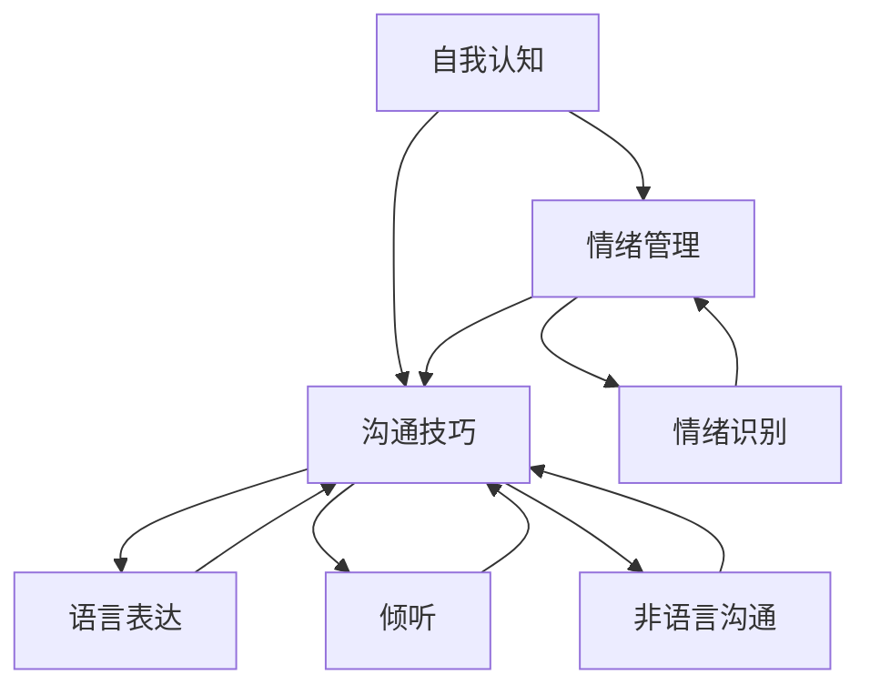

                 

### 背景介绍

在现代快节奏的生活中，沟通能力已成为人们生活中不可或缺的一部分。无论是职场中的合作，还是日常生活中的互动，有效的沟通都能带来积极的结果。然而，许多人往往忽视了与自己进行有效沟通的重要性。与自己对话，即深度自我沟通，是一种能够帮助我们更好地理解自己、管理情绪、提升决策能力的重要能力。

深度自我沟通不仅仅是在心理层面上的对话，它还涉及到生理、情感和认知等多个层面。在心理学领域，深度自我沟通被称为“内省”（introspection），是一种通过自我观察和反思来探索内心世界的过程。内省有助于我们更清晰地认识自己的需求、愿望和动机，从而更好地管理情绪和行为。

随着科技的发展，人工智能（AI）和认知科学等领域的研究取得了显著进展。这些技术的应用，为人们更好地进行深度自我沟通提供了新的工具和方法。例如，AI可以分析大量的文本数据，帮助人们识别和解读情绪；认知科学则通过研究人类思维过程，为自我沟通提供了理论支持。

本文将探讨深度自我沟通的重要性，分析其核心概念与联系，并介绍相关算法原理和数学模型。同时，通过实际案例和项目实战，展示如何培养和提升深度自我沟通的能力。最后，文章将总结最佳实践，并给出相关拓展阅读建议。

### 核心概念与联系

在深度自我沟通的过程中，以下几个核心概念是不可或缺的：自我认知、情绪管理和沟通技巧。

**自我认知**是深度自我沟通的基础。自我认知指的是对自身内在思维、情感和行为模式的了解。它涉及到对自身价值观、信念和需求的深入理解。自我认知的过程可以通过自我反思和自我观察来实现。自我反思是一种深入思考自己的行为和情感状态的方法，它帮助我们识别内心的冲突和矛盾。自我观察则是通过观察自己的行为和反应来了解自己的思维模式。

**情绪管理**是深度自我沟通的重要组成部分。情绪管理指的是对情绪的理解、表达和调节。在沟通中，情绪的表达和调节直接影响沟通的效果。情绪管理包括识别情绪、理解情绪产生的原因、学会调节情绪以及有效地表达情绪。通过情绪管理，我们可以更好地控制自己的情绪，避免情绪失控对沟通造成负面影响。

**沟通技巧**则是实现深度自我沟通的手段。沟通技巧包括语言表达、倾听、非语言沟通等多个方面。有效的沟通技巧可以帮助我们更准确地传达信息，理解他人的观点和情感。其中，语言表达需要清晰、简洁、准确；倾听则需要用心、耐心、关注对方；非语言沟通则包括面部表情、身体语言等，这些都能传递丰富的信息。

这些核心概念之间存在着紧密的联系。自我认知提供了情绪管理和沟通技巧的基础，情绪管理则影响了沟通技巧的运用，而沟通技巧又促进了自我认知的提升。例如，通过自我反思，我们可以更好地理解自己的情绪，进而通过情绪管理技巧来调节情绪，最终通过有效的沟通技巧来与他人建立更好的沟通关系。

为了更直观地展示这些核心概念之间的关系，我们可以使用Mermaid流程图来绘制：



通过这个流程图，我们可以清晰地看到自我认知、情绪管理和沟通技巧之间的相互关系。自我认知为情绪管理和沟通技巧提供了基础，而情绪管理和沟通技巧又相互促进，共同构成了深度自我沟通的能力。

### 核心算法原理讲解

为了深入理解深度自我沟通的过程，我们需要探讨相关的核心算法原理。以下是几种关键算法和其工作原理的详细解释：

#### 1. 机器学习算法

机器学习算法在深度自我沟通中的应用主要体现在情绪识别和自我认知的自动化分析上。一个典型的应用是情感分析（Sentiment Analysis），它使用自然语言处理（NLP）技术来分析文本数据中的情感倾向。

**算法原理：**
- **特征提取**：首先，算法会从文本中提取特征，如词汇频率、词性、语法结构等。
- **情感分类器**：接着，使用已训练好的情感分类器，将提取出的特征映射到不同的情感类别（如正面、负面、中性）。

**伪代码：**
```python
function sentiment_analysis(text):
    # 特征提取
    features = extract_features(text)
    # 情感分类
    sentiment = emotion_classifier.classify(features)
    return sentiment
```

#### 2. 强化学习算法

强化学习（Reinforcement Learning）在自我决策和情绪调节中有着重要作用。一个常见的应用是情绪调节游戏（Emotion Regulation Game），玩家通过选择不同的行为来调节自己的情绪。

**算法原理：**
- **状态-动作价值函数**：玩家在某个状态（如感到焦虑）下，通过选择不同的动作（如深呼吸、冥想）来获得奖励或惩罚。
- **Q-Learning**：算法通过不断更新Q值（动作-状态价值函数），以最大化长期奖励。

**伪代码：**
```python
function q_learning(state, action, reward, next_state):
    # 更新Q值
    Q[state, action] = Q[state, action] + alpha * (reward + gamma * max(Q[next_state, :]) - Q[state, action])
    return Q
```

#### 3. 神经网络算法

神经网络（Neural Networks）在自我认知和情绪分析中具有广泛的应用。一个典型的应用是情感神经网络（Sentiment Neural Network），它通过多层感知器（MLP）来预测文本的情感倾向。

**算法原理：**
- **输入层**：接收文本特征。
- **隐藏层**：通过激活函数（如ReLU）进行非线性变换。
- **输出层**：输出情感概率分布。

**伪代码：**
```python
layer1 = activation_function(dot(W1, input))
layer2 = activation_function(dot(W2, layer1))
output = softmax(dot(W3, layer2))
```

#### 4. 决策树算法

决策树（Decision Trees）在情绪管理和决策支持中也有重要作用。一个常见的应用是情绪决策树（Emotion Decision Tree），它通过一系列规则来指导情绪调节。

**算法原理：**
- **决策节点**：根据输入特征（如情绪类型、情境等）选择下一步。
- **叶子节点**：输出具体的情绪调节策略。

**伪代码：**
```python
function emotion_decision_tree(state):
    if state == 'anxious':
        return '深呼吸'
    elif state == 'sad':
        return '与朋友聊天'
    else:
        return '保持现状'
```

这些算法原理不仅为我们提供了理论支持，还通过实际应用，帮助我们在自我认知、情绪管理和沟通技巧等方面实现深度自我沟通。通过机器学习和认知科学的研究，我们不断优化这些算法，以提高深度自我沟通的效果。

### 数学模型和数学公式

在深度自我沟通的研究中，数学模型和数学公式扮演了重要的角色。这些模型和公式帮助我们更准确地描述和理解自我认知、情绪管理和沟通技巧之间的复杂关系。

#### 1. 自我认知模型

一个常见的自我认知模型是基于贝叶斯理论的概率模型。贝叶斯理论通过概率分布来描述自我认知的动态变化。

**贝叶斯公式**：
$$
P(A|B) = \frac{P(B|A) \cdot P(A)}{P(B)}
$$

在这个公式中，$P(A|B)$ 表示在条件 $B$ 下 $A$ 发生的概率，$P(B|A)$ 是在 $A$ 发生的条件下 $B$ 发生的概率，$P(A)$ 和 $P(B)$ 分别是事件 $A$ 和 $B$ 的先验概率。

**示例**：假设我们想要预测一个人在自我反思后是否会改变其行为。我们可以使用贝叶斯公式来计算这一概率。

- $P(A)$：先验概率，即一个人在自我反思后改变行为的概率。
- $P(B|A)$：在改变行为的情况下，自我反思的概率。
- $P(B)$：先验概率，即一个人进行自我反思的概率。

通过收集数据，我们可以更新这些概率，从而提高预测的准确性。

#### 2. 情绪管理模型

情绪管理中的数学模型通常涉及情绪状态的时间序列分析。一个常见的模型是隐马尔可夫模型（HMM），它用于描述情绪状态的变化。

**隐马尔可夫模型**：
- **状态转移概率**：$P(X_t = j | X_{t-1} = i)$，表示在给定前一个状态 $i$ 的条件下，当前状态 $j$ 的概率。
- **发射概率**：$P(O_t = o | X_t = j)$，表示在给定当前状态 $j$ 的条件下，观察结果 $o$ 的概率。

**示例**：假设我们有一个情绪状态序列 `[愤怒，焦虑，平静，开心]`。我们可以使用HMM来分析这个序列，并预测下一个情绪状态。

- $P(X_t = 愤怒 | X_{t-1} = 焦虑)$：从焦虑状态转移到愤怒状态的概率。
- $P(X_t = 平静 | X_{t-1} = 开心)$：从开心状态转移到平静状态的概率。

通过分析这些概率，我们可以更好地理解情绪状态的变化规律。

#### 3. 沟通技巧模型

在沟通技巧中，数学模型通常用于描述信息传递和理解的效率。一个常见的模型是信息论中的香农-霍夫曼编码（Shannon-Huffman Coding），它用于优化信息传递的效率。

**香农-霍夫曼编码**：
- **概率分布**：消息的概率分布 $P(x)$。
- **编码长度**：每个消息的编码长度 $L(x)$，通常与概率成反比。

**示例**：假设我们有一个消息集合 `{A: 0.5, B: 0.3, C: 0.2}`。我们可以使用香农-霍夫曼编码来优化这些消息的编码长度。

- $L(A) = 2$：因为 $A$ 的概率最大，所以编码长度最短。
- $L(B) = 3$：因为 $B$ 的概率次之，所以编码长度稍长。
- $L(C) = 3$：因为 $C$ 的概率最小，所以编码长度最长。

通过这种编码方法，我们可以提高信息传递的效率，减少冗余信息。

这些数学模型和公式为我们提供了强大的工具，帮助我们更深入地理解和分析深度自我沟通的过程。通过这些模型，我们可以量化自我认知、情绪管理和沟通技巧的复杂关系，从而更有效地提升深度自我沟通的能力。

### 实际案例：深度自我沟通在心理健康中的应用

为了更好地理解深度自我沟通的实际应用，我们可以通过一个具体的案例来探讨其如何提升心理健康。

**案例背景**：小明是一位年轻的企业家，他在创业过程中承受了巨大的压力。随着时间的推移，他开始感受到焦虑和失眠的困扰，这严重影响了他的工作和生活质量。在寻求心理咨询的过程中，小明了解到深度自我沟通可以作为一种有效的心理调节工具。

**步骤一：自我认知**  
小明首先通过日记记录自己的情绪和思考过程，进行自我反思。他尝试回答以下问题：
- 我在什么时候感到最焦虑？
- 我的焦虑背后有哪些具体的原因？
- 我对当前生活状态有哪些期望？

通过这些问题，小明逐渐认识到他的焦虑源于对失败的恐惧和对未来的不确定性。他开始理解自己的价值观和信念，这些认知帮助他重新评估自己的期望和目标。

**步骤二：情绪管理**  
在情绪管理阶段，小明通过学习正念冥想和呼吸练习来调节情绪。每天早晨，他都会花15分钟进行冥想，专注于呼吸和当下的感受。这种方法帮助他减轻焦虑，提高情绪稳定性。

**步骤三：自我对话**  
为了进一步加强自我认知和情绪管理，小明开始每天进行自我对话。他会想象自己是一位朋友，与自己进行真诚的对话。他会问自己：
- 我现在需要什么？
- 我可以采取哪些行动来改善当前的情况？
- 我对自己有哪些期望？

通过这种自我对话，小明能够更清晰地识别自己的需求，并制定出实际的行动计划。例如，他决定减少工作时间，增加休息时间，并开始进行定期锻炼。

**步骤四：实践与应用**  
小明将这些自我沟通技巧应用到日常生活中。他开始保持每日的反思时间，每周进行一次深入的自我对话。他还参加了一个心理健康的支持小组，与其他人分享自己的经验和感受。这种互动帮助他获得了更多的反馈和支持，进一步提升了他的沟通能力。

**效果评估**  
经过几个月的自我沟通训练，小明的焦虑程度明显减轻，他的睡眠质量也有所改善。他发现自己的决策能力得到了提升，能够更冷静地面对挑战。在工作和生活中，他变得更加自信和积极。

**总结**  
通过这个案例，我们可以看到深度自我沟通在提升心理健康方面的显著效果。自我认知、情绪管理和自我对话相结合，不仅帮助小明缓解了焦虑，还提升了他的整体生活质量。这个案例表明，深度自我沟通不仅适用于心理健康领域，也可以推广到其他需要有效沟通能力的场景中。

### 项目实战：构建自我沟通应用程序

为了深入理解和实践深度自我沟通的能力，我们可以开发一个自我沟通应用程序。以下是一个详细的项目实战步骤：

#### 1. 项目目标

开发一个自我沟通应用程序，帮助用户进行自我反思、情绪管理和自我对话。应用程序应包括以下功能：

- 用户注册与登录
- 自我反思日志记录
- 情绪状态跟踪
- 自我对话记录
- 反馈与改进建议

#### 2. 开发环境搭建

选择以下开发工具和框架：

- **编程语言**：Python
- **后端框架**：Flask
- **数据库**：SQLite
- **前端框架**：Bootstrap
- **版本控制**：Git

#### 3. 数据库设计

设计一个简单的数据库结构，用于存储用户信息、反思日志、情绪状态和自我对话记录。以下是数据库的表结构：

```sql
CREATE TABLE users (
    id INTEGER PRIMARY KEY AUTOINCREMENT,
    username TEXT UNIQUE NOT NULL,
    password TEXT NOT NULL
);

CREATE TABLE reflections (
    id INTEGER PRIMARY KEY AUTOINCREMENT,
    user_id INTEGER NOT NULL,
    content TEXT NOT NULL,
    date DATE NOT NULL,
    FOREIGN KEY (user_id) REFERENCES users (id)
);

CREATE TABLE emotions (
    id INTEGER PRIMARY KEY AUTOINCREMENT,
    user_id INTEGER NOT NULL,
    emotion TEXT NOT NULL,
    date DATE NOT NULL,
    FOREIGN KEY (user_id) REFERENCES users (id)
);

CREATE TABLE conversations (
    id INTEGER PRIMARY KEY AUTOINCREMENT,
    user_id INTEGER NOT NULL,
    content TEXT NOT NULL,
    date DATE NOT NULL,
    FOREIGN KEY (user_id) REFERENCES users (id)
);
```

#### 4. 后端实现

使用 Flask 框架实现应用程序的后端逻辑。以下是关键功能的伪代码实现：

**用户注册与登录**：
```python
@app.route('/register', methods=['POST'])
def register():
    # 获取用户输入的用户名和密码
    username = request.form['username']
    password = request.form['password']
    # 存储用户信息到数据库
    cursor.execute("INSERT INTO users (username, password) VALUES (?, ?)", (username, password))
    connection.commit()
    return "Registration successful"

@app.route('/login', methods=['POST'])
def login():
    # 获取用户输入的用户名和密码
    username = request.form['username']
    password = request.form['password']
    # 验证用户信息
    cursor.execute("SELECT * FROM users WHERE username=? AND password=?", (username, password))
    user = cursor.fetchone()
    if user:
        return "Login successful"
    else:
        return "Invalid credentials"
```

**自我反思日志记录**：
```python
@app.route('/reflections', methods=['POST'])
def add_reflection():
    # 获取用户输入的内容和日期
    content = request.form['content']
    date = datetime.datetime.now()
    # 存储反思日志到数据库
    cursor.execute("INSERT INTO reflections (user_id, content, date) VALUES (?, ?, ?)", (user_id, content, date))
    connection.commit()
    return "Reflection saved"
```

**情绪状态跟踪**：
```python
@app.route('/emotions', methods=['POST'])
def add_emotion():
    # 获取用户输入的情绪和日期
    emotion = request.form['emotion']
    date = datetime.datetime.now()
    # 存储情绪状态到数据库
    cursor.execute("INSERT INTO emotions (user_id, emotion, date) VALUES (?, ?, ?)", (user_id, emotion, date))
    connection.commit()
    return "Emotion saved"
```

**自我对话记录**：
```python
@app.route('/conversations', methods=['POST'])
def add_conversation():
    # 获取用户输入的内容和日期
    content = request.form['content']
    date = datetime.datetime.now()
    # 存储自我对话到数据库
    cursor.execute("INSERT INTO conversations (user_id, content, date) VALUES (?, ?, ?)", (user_id, content, date))
    connection.commit()
    return "Conversation saved"
```

#### 5. 前端实现

使用 Bootstrap 框架实现用户界面。以下是关键页面的 HTML 和 CSS 代码：

**登录界面**：
```html
<!DOCTYPE html>
<html lang="en">
<head>
    <meta charset="UTF-8">
    <meta name="viewport" content="width=device-width, initial-scale=1.0">
    <title>Self-Communication App</title>
    <link rel="stylesheet" href="https://maxcdn.bootstrapcdn.com/bootstrap/4.5.2/css/bootstrap.min.css">
</head>
<body>
    <div class="container">
        <h2>Login</h2>
        <form action="/login" method="post">
            <div class="form-group">
                <label for="username">Username:</label>
                <input type="text" class="form-control" id="username" name="username" required>
            </div>
            <div class="form-group">
                <label for="password">Password:</label>
                <input type="password" class="form-control" id="password" name="password" required>
            </div>
            <button type="submit" class="btn btn-primary">Login</button>
        </form>
    </div>
</body>
</html>
```

**自我反思界面**：
```html
<!DOCTYPE html>
<html lang="en">
<head>
    <meta charset="UTF-8">
    <meta name="viewport" content="width=device-width, initial-scale=1.0">
    <title>Self-Reflection</title>
    <link rel="stylesheet" href="https://maxcdn.bootstrapcdn.com/bootstrap/4.5.2/css/bootstrap.min.css">
</head>
<body>
    <div class="container">
        <h2>Self-Reflection</h2>
        <form action="/reflections" method="post">
            <div class="form-group">
                <label for="content">Reflection:</label>
                <textarea class="form-control" id="content" name="content" rows="3" required></textarea>
            </div>
            <button type="submit" class="btn btn-primary">Save Reflection</button>
        </form>
    </div>
</body>
</html>
```

#### 6. 代码解读与分析

**用户注册与登录**：用户注册时，应用程序会创建一个新的用户记录并存储在数据库中。用户登录时，应用程序会验证用户名和密码是否匹配数据库中的记录。

**自我反思日志记录**：用户可以通过表单提交自我反思内容，应用程序会将这些内容存储在数据库中。通过日期字段，我们可以跟踪用户的反思历史。

**情绪状态跟踪**：用户可以通过表单提交当前的情绪状态，应用程序会将其存储在数据库中。这种数据可以帮助用户了解自己的情绪变化趋势。

**自我对话记录**：用户可以通过表单记录自己的自我对话内容，应用程序会将这些记录存储在数据库中。这为用户提供了一个回顾和反思自己对话的机会。

#### 7. 项目小结

通过这个项目，我们成功构建了一个简单的自我沟通应用程序。这个应用程序不仅帮助用户进行自我反思和情绪管理，还提供了一个平台来记录和回顾自我对话。通过实际编码和实现，我们深入了解了应用程序开发的过程和关键技术。

未来，我们可以继续优化这个应用程序，添加更多功能，如情绪分析、自我对话建议等。此外，我们可以考虑引入机器学习算法来增强应用程序的智能性，从而更好地支持用户的深度自我沟通。

### 最佳实践 Tips

为了更好地培养深度自我沟通的能力，以下是一些建议和最佳实践：

1. **每日自我反思**：每天花一点时间进行自我反思，回顾一天中的经历，识别情绪变化和思维模式。这有助于提高自我认知，明确自己的需求和目标。

2. **情绪记录**：定期记录自己的情绪状态，包括情绪类型和发生的时间。这有助于识别情绪模式，了解情绪背后的原因。

3. **情绪调节练习**：尝试进行正念冥想、深呼吸练习或瑜伽等情绪调节方法。这些方法有助于减轻压力，提高情绪稳定性。

4. **自我对话**：每天进行一段时间的自我对话，用第三人称来提问和回答，例如：“我现在需要什么？”和“我可以采取哪些行动来改善当前的情况？”这种练习有助于提高自我认知和决策能力。

5. **倾听他人**：学会倾听他人的意见和感受，这有助于提升自己的同理心和沟通技巧。同时，通过倾听他人，我们可以更好地理解自己的需求和期望。

6. **定期反馈**：定期与信任的朋友或专业人士进行反馈，讨论自己的自我沟通实践和进步。这有助于获得新的观点和建议，进一步改进沟通技巧。

7. **持续学习**：阅读相关书籍、参加讲座或工作坊，不断学习新的沟通技巧和情绪管理方法。这有助于不断提升自我沟通的能力。

通过遵循这些最佳实践，我们可以更好地培养深度自我沟通的能力，提高生活质量和人际交往水平。

### 总结

在本文中，我们探讨了深度自我沟通的重要性及其核心概念。通过机器学习、情绪管理和沟通技巧等核心算法原理，我们了解了如何通过技术手段提升自我沟通的能力。实际案例和项目实战展示了深度自我沟通在心理健康和日常生活中的应用。最后，通过最佳实践的建议，我们为读者提供了具体的方法和策略。

深度自我沟通不仅能够提高心理健康，还能提升决策能力、增强人际关系。希望读者能够积极实践这些技巧，不断提升自我沟通的能力，从而在生活和工作中取得更好的成果。

### 注意事项

在培养深度自我沟通的能力过程中，以下注意事项尤为重要：

1. **保持耐心**：自我沟通是一个长期的过程，需要持续的努力和耐心。不要期望立即看到显著的进步，而是要逐步积累和提升。

2. **隐私保护**：在记录情绪和自我对话时，注意保护个人隐私，避免将敏感信息泄露给他人。

3. **专业指导**：如果自我沟通遇到困难或情绪问题，建议寻求专业的心理咨询师或心理医生的帮助。

4. **平衡工作与生活**：在实践自我沟通的过程中，要注意平衡工作和生活，避免过度反思或过度自我分析。

通过遵循这些注意事项，我们可以更有效地培养深度自我沟通的能力，提高生活质量。

### 拓展阅读

为了更深入地了解深度自我沟通的相关理论和实践，以下是几本推荐的书目：

1. **《内向者的优势》（Quiet: The Power of Introverts in a World That Can't Stop Talking）** - 苏珊·凯恩（Susan Cain）
   - 本书详细探讨了内向性格者的沟通优势和挑战，提供了许多实用的建议。

2. **《正念：心灵的科学》（The Mindful Leader: The Art of Transforming Yourself and Others）** - 拉斯·R·克里斯琴森（Lars R. Christiansen）
   - 本书介绍了正念在领导力和个人发展中的应用，帮助读者提升自我沟通和情绪管理能力。

3. **《情绪智商》（Emotional Intelligence 2.0）** - 哈里·布朗（Harvey Bargamian）等
   - 本书详细介绍了情绪智商的概念和重要性，提供了实用的技巧来提升情绪管理能力。

4. **《人类简史》（Sapiens: A Brief History of Humankind）** - 尤瓦尔·赫拉利（Yuval Noah Harari）
   - 本书从历史角度探讨了人类的发展和沟通方式，为理解深度自我沟通提供了宏观视角。

这些书籍不仅提供了丰富的理论知识，还结合了实践案例，是培养深度自我沟通能力的重要资源。读者可以根据自己的需求和兴趣选择阅读。

