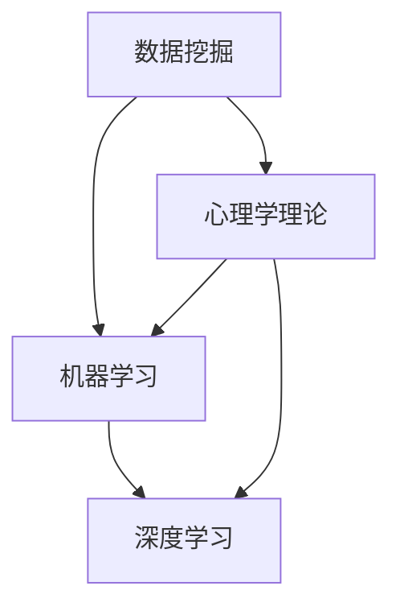
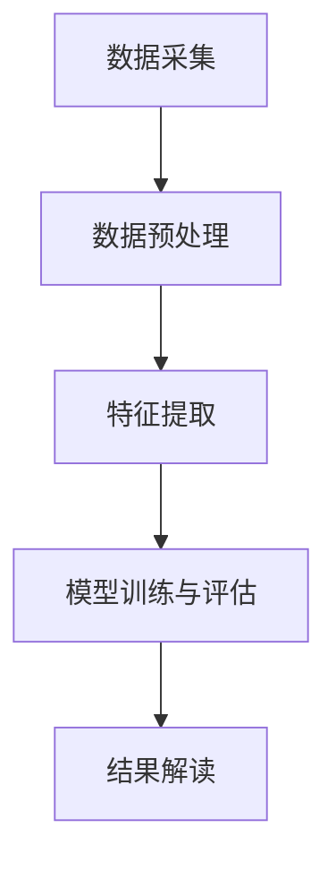
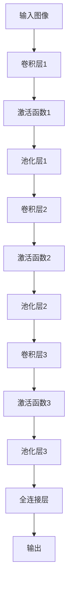
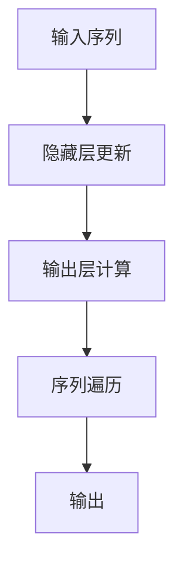

                 

### 第1章: 概述

#### 1.1 书籍背景

随着互联网、物联网和大数据技术的迅猛发展，人类进入了一个数据爆炸的时代。个人历史数据，包括社交媒体活动、在线购物记录、GPS定位数据等，正以惊人的速度积累。这些数据不仅记录了我们的日常生活，还蕴含着丰富的心理和行为模式。如何在海量数据中发现这些隐藏的模式，成为了当今数据科学和心理学领域的前沿课题。

这一背景催生了心理考古学这一新兴领域。心理考古学是一种利用人工智能技术对个人历史数据进行挖掘和分析的方法论，它旨在揭示人类心理和行为模式，为心理治疗、教育、市场营销等领域提供决策支持。

#### 1.1.1 时代的背景

1. **数据爆炸性增长**：

    - **社交媒体活动**：每年全球用户在社交媒体上的互动次数以亿计，这些互动数据记录了用户的行为和情感状态。
    - **在线购物记录**：电子商务平台的用户行为数据，包括购买历史、浏览记录等，为分析用户偏好提供了丰富的素材。
    - **GPS定位数据**：智能手机和可穿戴设备的普及，使得位置数据的收集变得更加便捷，这些数据可以用于分析用户的日常活动模式。

2. **AI与心理学的融合**：

    - **人工智能的发展**：机器学习和深度学习技术的进步，使得计算机能够从海量数据中自动提取有用信息。
    - **心理学的理论支持**：心理学研究提供了关于人类行为和情感的理论框架，为AI算法的理解和预测提供了指导。

#### 1.1.2 心理考古学的定义

心理考古学是一种利用人工智能技术对个人历史数据进行分析、挖掘和解读的方法论。它结合了数据挖掘和心理分析两个领域，旨在通过数据挖掘技术从个人历史数据中发现行为和情感模式，然后利用心理分析模型对这些模式进行解读，从而揭示人类心理和行为的深层机制。

#### 1.2 书籍结构

本书分为五个主要部分，分别介绍心理考古学的基础、数据挖掘技术、AI心理考古工具的构建、应用案例分析和未来发展趋势。

- **第1部分：心理考古学基础**：介绍心理考古学的基本概念、历史发展及其应用领域。
- **第2部分：数据挖掘技术**：详细介绍数据挖掘的基本流程，包括数据采集、预处理、特征提取和降维等。
- **第3部分：AI心理考古工具构建**：介绍如何利用机器学习和深度学习技术构建AI心理考古工具。
- **第4部分：应用案例分析**：通过具体案例展示AI心理考古工具在实际应用中的效果。
- **第5部分：未来发展趋势**：探讨心理考古学的发展方向和面临的挑战。

#### 1.3 目录大纲

为了更好地组织和引导读者，本书的目录大纲如下：

### 第1章: 概述
#### 1.1 书籍背景
##### 1.1.1 数据爆炸性增长
##### 1.1.2 AI与心理学的融合

#### 1.2 心理考古学的定义

### 第2章: 心理考古学理论基础
#### 2.1 心理考古学概述
##### 2.1.1 心理考古学的历史与发展
##### 2.1.2 心理考古学的应用领域

#### 2.2 心理分析模型
##### 2.2.1 精神分析
##### 2.2.2 认知行为疗法
##### 2.2.3 人本主义心理学

### 第3章: 数据采集与预处理
#### 3.1 数据采集
##### 3.1.1 社交媒体数据
##### 3.1.2 在线购物数据
##### 3.1.3 GPS定位数据

#### 3.2 数据预处理
##### 3.2.1 数据清洗
##### 3.2.2 数据转换
##### 3.2.3 数据归一化

### 第4章: 特征提取与降维
#### 4.1 特征提取
##### 4.1.1 属性提取
##### 4.1.2 关系提取
##### 4.1.3 情感分析

#### 4.2 降维技术
##### 4.2.1 主成分分析（PCA）
##### 4.2.2 t-SNE
##### 4.2.3 自动编码器

### 第5章: 模型选择与优化
#### 5.1 模型选择
##### 5.1.1 监督学习模型
##### 5.1.2 无监督学习模型
##### 5.1.3 半监督学习模型

#### 5.2 模型优化
##### 5.2.1 交叉验证
##### 5.2.2 超参数调优
##### 5.2.3 模型融合

### 第6章: 机器学习模型
#### 6.1 线性模型
##### 6.1.1 线性回归
##### 6.1.2 逻辑回归

##### 6.1.3 支持向量机（SVM）

#### 6.2 非线性模型
##### 6.2.1 决策树
##### 6.2.2 随机森林
##### 6.2.3 XGBoost

### 第7章: 深度学习模型
#### 7.1 卷积神经网络（CNN）
##### 7.1.1 CNN基础
##### 7.1.2 CNN在图像识别中的应用

#### 7.2 循环神经网络（RNN）
##### 7.2.1 RNN基础
##### 7.2.2 LSTM与GRU

### 第8章: 综合应用模型
#### 8.1 混合模型
##### 8.1.1 CNN与RNN的结合
##### 8.1.2 多任务学习

#### 8.2 自监督学习
##### 8.2.1 自监督学习简介
##### 8.2.2 自监督学习在心理考古学中的应用

### 第9章: 心理治疗案例分析
#### 9.1 案例背景
##### 9.1.1 案例一：抑郁症治疗
##### 9.1.2 案例二：焦虑症治疗

#### 9.2 方法与结果
##### 9.2.1 数据采集与预处理
##### 9.2.2 模型选择与优化
##### 9.2.3 结果分析

### 第10章: 教育应用案例分析
#### 10.1 案例背景
##### 10.1.1 案例一：个性化教学
##### 10.1.2 案例二：学习困难学生干预

#### 10.2 方法与结果
##### 10.2.1 数据采集与预处理
##### 10.2.2 模型选择与优化
##### 10.2.3 结果分析

### 第11章: 市场营销应用案例分析
#### 11.1 案例背景
##### 11.1.1 案例一：用户行为分析
##### 11.1.2 案例二：精准营销

#### 11.2 方法与结果
##### 11.2.1 数据采集与预处理
##### 11.2.2 模型选择与优化
##### 11.2.3 结果分析

### 第12章: 新技术展望
#### 12.1 自然语言处理
##### 12.1.1 语言模型
##### 12.1.2 文本分类与情感分析

#### 12.2 强化学习
##### 12.2.1 强化学习基础
##### 12.2.2 强化学习在心理考古学中的应用

### 第13章: 未来挑战与机遇
#### 13.1 数据隐私与伦理
##### 13.1.1 数据隐私问题
##### 13.1.2 伦理道德挑战

#### 13.2 技术创新与未来发展
##### 13.2.1 新算法的涌现
##### 13.2.2 跨学科融合

### 总结

本书从多个角度探讨了个人历史数据挖掘在心理学领域的应用，通过系统的理论讲解和实际案例分析，帮助读者深入了解心理考古学的方法和技术。我们相信，随着技术的不断进步，心理考古学将在人类心理和行为研究中发挥越来越重要的作用。

---

### 第2章: 心理考古学理论基础

#### 2.1 心理考古学概述

心理考古学是一门跨学科的研究领域，它结合了心理学、数据科学、计算机科学和考古学等多学科的知识。心理考古学的核心目标是通过分析个人历史数据，揭示人类心理和行为模式，从而为心理治疗、教育、市场营销等领域提供决策支持。

#### 2.1.1 心理考古学的历史与发展

心理考古学作为一个独立的研究领域，其发展历程可以追溯到20世纪末。最初，心理学与数据科学之间的交叉研究主要集中在如何利用数据分析技术来理解人类行为。随着互联网和大数据技术的兴起，个人历史数据变得越来越丰富，为心理考古学的发展提供了新的契机。

在21世纪初，随着机器学习和深度学习技术的飞速发展，心理考古学的研究范围进一步扩大。研究人员开始利用这些先进的技术手段，从海量个人历史数据中提取有价值的信息，从而揭示了人类心理和行为的复杂模式。

#### 2.1.2 心理考古学的应用领域

心理考古学的应用领域非常广泛，主要包括以下几个方面：

1. **心理治疗**：通过分析患者的个人历史数据，心理医生可以更准确地诊断患者的心理问题，制定个性化的治疗方案。
2. **教育**：心理考古学可以用于分析学生的学习行为，帮助教育工作者制定更有效的教学策略，提高学生的学习效果。
3. **市场营销**：企业可以利用心理考古学技术来分析消费者的行为数据，从而实现更精准的市场营销策略。
4. **社会学研究**：心理考古学技术可以帮助社会学家研究人类行为和社会心理现象，揭示社会问题的根源。

#### 2.2 心理分析模型

心理考古学的研究依赖于一系列心理分析模型，这些模型用于分析个人历史数据，揭示人类心理和行为的模式。以下是一些常见的心理分析模型：

1. **精神分析模型**：精神分析模型由弗洛伊德提出，主要研究人类潜意识和无意识心理过程。通过分析个人的历史数据，如日记、梦境等，精神分析模型可以帮助揭示个体的心理冲突和情感状态。

2. **认知行为疗法模型**：认知行为疗法（CBT）是一种以行为和认知为基础的心理治疗方法。它通过分析个体的行为和思维模式，帮助患者识别和改变不良的思维和行为习惯。

3. **人本主义心理学模型**：人本主义心理学强调个体的主观体验和自我实现。通过分析个人的历史数据，如日记、博客等，人本主义心理学模型可以帮助揭示个体的情感状态和自我认知。

#### 2.3 AI心理考古工具

AI心理考古工具是心理考古学的重要技术支撑。这些工具利用机器学习和深度学习技术，从海量个人历史数据中提取有价值的信息，辅助心理分析和诊断。以下是一些常见的AI心理考古工具：

1. **机器学习模型**：如线性回归、逻辑回归、支持向量机（SVM）等，用于预测个体的行为和情感状态。
2. **深度学习模型**：如卷积神经网络（CNN）、循环神经网络（RNN）、长短期记忆网络（LSTM）等，用于处理复杂的个人历史数据，提取深层次的特征。
3. **自然语言处理模型**：如文本分类、情感分析等，用于分析文本数据，揭示个体的情感状态和主观体验。

#### 2.4 核心概念与联系

心理考古学涉及多个核心概念，这些概念之间有着紧密的联系。以下是心理考古学中一些关键概念及其相互关系：

1. **数据挖掘**：数据挖掘是从大量数据中发现有用信息的过程，它是心理考古学的基础。数据挖掘技术包括数据预处理、特征提取、模型训练和结果评估等步骤。
2. **机器学习**：机器学习是数据挖掘的一个重要分支，它利用算法和统计方法，从数据中自动学习和提取知识。机器学习模型是心理考古学中常用的工具，用于分析个人历史数据。
3. **深度学习**：深度学习是机器学习的一种形式，它利用多层神经网络来模拟人脑的学习过程，能够处理复杂的非线性数据。深度学习模型在心理考古学中有着广泛的应用。
4. **心理学理论**：心理学理论提供了关于人类行为和情感的理论框架，为心理考古学的研究提供了指导。通过结合心理学理论和数据分析技术，心理考古学可以更深入地揭示人类心理和行为模式。

图 1-1展示了心理考古学中核心概念之间的相互关系。



#### 2.5 心理考古学的研究方法

心理考古学的研究方法主要包括以下几种：

1. **数据采集**：通过问卷调查、日志记录、传感器采集等方式，收集个人的历史数据。
2. **数据预处理**：对采集到的数据进行清洗、转换和归一化，为后续分析做准备。
3. **特征提取**：从原始数据中提取有用的特征，如文本特征、图像特征、行为特征等。
4. **模型训练与评估**：利用机器学习和深度学习模型对特征进行训练和评估，提取有价值的信息。
5. **结果解读**：将模型输出的结果进行解读，结合心理学理论，揭示人类心理和行为模式。

图 1-2展示了心理考古学的研究流程。



#### 2.6 心理考古学的重要性

心理考古学在多个领域都有着重要的应用价值：

1. **心理治疗**：通过分析个人历史数据，心理医生可以更准确地诊断患者的心理问题，制定个性化的治疗方案。
2. **教育**：通过分析学生的学习行为，教育工作者可以制定更有效的教学策略，提高学生的学习效果。
3. **市场营销**：企业可以利用心理考古学技术来分析消费者的行为数据，实现更精准的市场营销策略。
4. **社会学研究**：心理考古学可以帮助社会学家研究人类行为和社会心理现象，揭示社会问题的根源。

总之，心理考古学通过结合心理学和数据分析技术，为我们提供了全新的视角，帮助我们更好地理解人类心理和行为。随着技术的不断进步，心理考古学将在人类心理和行为研究中发挥越来越重要的作用。

### 第3章: 数据采集与预处理

#### 3.1 数据采集

数据采集是心理考古学研究的首要步骤，它决定了后续数据分析的质量和效果。数据采集的方法和技术多种多样，主要包括以下几种：

1. **问卷调查**：问卷调查是收集个人历史数据的一种常见方法。通过设计针对性的问卷，研究者可以收集到被调查者的基本信息、行为习惯、心理状态等多方面信息。问卷调查的优点是操作简单、成本低，但缺点是数据的真实性和完整性难以保证。

2. **日志记录**：日志记录是一种基于数字设备（如手机、平板电脑等）的数据采集方法。通过安装专门的日志记录应用，研究者可以实时收集用户的操作行为、位置信息、时间戳等数据。这种方法的数据量大、维度高，但需要考虑到用户隐私和数据安全问题。

3. **传感器采集**：传感器采集是通过物理传感器（如GPS、加速度计、心率传感器等）来收集数据的方法。这种方法适用于研究用户的生理和行为特征，如运动轨迹、活动强度等。传感器的优点是数据实时性强、准确性高，但缺点是需要较高的硬件成本和维护成本。

4. **社交媒体数据采集**：随着社交媒体的普及，社交媒体数据成为了心理考古学研究的重要数据来源。研究者可以通过API接口获取用户的社交媒体活动数据，如微博、微信、Facebook、Twitter等。这种方法的数据量大、信息丰富，但需要考虑到用户隐私和数据安全问题。

5. **在线购物数据采集**：在线购物平台的数据记录了用户的购买历史、浏览记录、搜索记录等信息。通过分析这些数据，研究者可以了解用户的消费行为和偏好。这种方法的数据质量高、真实性强，但需要获取数据平台的合作支持。

#### 3.2 数据预处理

数据预处理是数据挖掘过程中的重要步骤，它涉及到数据清洗、转换和归一化等操作。以下是数据预处理的主要方法和步骤：

1. **数据清洗**：数据清洗是指去除数据中的噪声、错误和异常值，以提高数据的质量。常见的数据清洗方法包括：
   - **去除重复记录**：确保数据表的每条记录是唯一的。
   - **填补缺失值**：对于缺失的数据，可以通过平均值、中位数、最邻近值等方法进行填补。
   - **去除异常值**：通过统计学方法（如标准差、Z分数等）识别并去除异常值。
   - **格式统一**：确保数据格式的一致性，如日期格式、数值格式等。

2. **数据转换**：数据转换是指将不同类型的数据转换为统一的数据格式，以便后续分析。常见的数据转换方法包括：
   - **数值化**：将分类数据转换为数值，如将性别（男/女）转换为0/1。
   - **归一化**：将不同量级的数据转换为同一量级，如将年龄、收入等数据归一化到0-1之间。
   - **标准化**：通过缩放和移位，将数据转换为标准正态分布。

3. **数据归一化**：数据归一化是指将不同维度的数据进行归一化处理，使其在同一尺度范围内。常见的归一化方法包括：
   - **最小-最大归一化**：将数据缩放到[0, 1]之间，公式为：$$ x' = \frac{x - \min(x)}{\max(x) - \min(x)} $$
   - **Z-score标准化**：将数据转换为标准正态分布，公式为：$$ x' = \frac{x - \mu}{\sigma} $$，其中$\mu$是均值，$\sigma$是标准差。
   - **小数点移位**：将数据按小数点位置进行移位，如将年龄从18.5岁转换为185。

#### 3.3 数据采集与预处理案例

为了更好地理解数据采集与预处理的过程，以下是一个具体的案例：

假设我们研究的是一组用户的社交媒体活动数据，数据包括用户ID、发帖时间、发帖内容、点赞数、评论数等。以下是数据采集与预处理的具体步骤：

1. **数据采集**：

   通过社交媒体平台的API接口，我们收集到了一组用户的发帖数据。数据包含了用户的ID、发帖时间、发帖内容、点赞数和评论数等。

2. **数据清洗**：

   - **去除重复记录**：确保每条记录是唯一的。
   - **填补缺失值**：对于缺少评论数的记录，我们用平均值进行填补。
   - **去除异常值**：通过Z分数方法识别并去除点赞数和评论数的异常值。

3. **数据转换**：

   - **数值化**：将分类数据（如性别）转换为数值。
   - **归一化**：将时间数据进行归一化处理，使其在同一尺度范围内。

4. **数据归一化**：

   - **最小-最大归一化**：将年龄数据缩放到[0, 1]之间。
   - **Z-score标准化**：将收入数据转换为标准正态分布。

通过以上步骤，我们得到了一个高质量、格式统一的数据集，为后续的数据分析奠定了基础。

总之，数据采集与预处理是心理考古学研究的重要环节。通过合理的采集和预处理，我们可以得到高质量的数据，为后续的分析提供可靠的基础。同时，数据采集与预处理的过程也需要考虑到数据的隐私保护和伦理问题。

### 第4章: 特征提取与降维

#### 4.1 特征提取

特征提取是数据挖掘和机器学习过程中的关键步骤，其目的是从原始数据中提取出对分析任务有意义的特征。在心理考古学中，特征提取有助于从个人历史数据中提取出反映用户心理和行为模式的关键信息。以下是特征提取的主要方法和步骤：

1. **文本特征提取**：

   文本特征提取主要用于处理文本数据，如社交媒体发帖内容、博客文章等。常见的方法包括：

   - **词袋模型**（Bag of Words, BoW）：将文本数据表示为词汇的集合，忽略词汇的顺序。通过计算每个词汇在文档中出现的频率，形成词袋向量。
   - **TF-IDF**（Term Frequency-Inverse Document Frequency）：在词袋模型的基础上，引入文档集合中的词频和逆文档频率，以衡量词汇的重要性。公式为：$$ tfidf(t,d) = tf(t,d) \times \log \left( \frac{N}{df(t)} \right) $$，其中$tf(t,d)$是词汇$t$在文档$d$中的词频，$df(t)$是词汇$t$在文档集合中的文档频率，$N$是文档总数。
   - **词嵌入**（Word Embedding）：通过神经网络模型将词汇映射到高维空间，形成词向量。常见的词嵌入模型包括Word2Vec、GloVe等。

2. **图像特征提取**：

   图像特征提取主要用于处理图像数据，如用户头像、照片等。常见的方法包括：

   - **灰度化**：将彩色图像转换为灰度图像，减少数据的维度。
   - **边缘检测**：通过算法（如Canny算法、Sobel算子等）检测图像中的边缘，提取图像的关键特征。
   - **特征点提取**：通过算法（如SIFT、SURF等）提取图像中的特征点，如角点、边缘等。
   - **卷积神经网络**（CNN）：利用卷积神经网络自动提取图像的深层次特征，适用于复杂的图像分类和识别任务。

3. **行为特征提取**：

   行为特征提取主要用于处理行为数据，如用户在社交媒体上的点赞、评论、分享等行为。常见的方法包括：

   - **行为序列表示**：将用户的行为序列转换为矩阵或向量，表示用户的行为模式。
   - **统计特征**：从行为数据中计算各种统计特征，如平均值、标准差、方差等，用于描述用户的行为特征。
   - **时间序列分析**：通过时间序列分析方法（如ARIMA模型、LSTM等）提取用户行为的时间特征。

4. **多模态特征融合**：

   当个人历史数据包含多种类型（如文本、图像、行为等）时，多模态特征融合方法可以综合不同类型数据的特征，提高模型的性能。常见的方法包括：

   - **特征叠加**：将不同类型的数据特征进行叠加，形成多维特征向量。
   - **特征加权**：对每种类型的数据特征进行加权，根据特征的重要性进行调整。
   - **多任务学习**：将多个特征提取任务作为多个子任务，通过多任务学习模型同时进行特征提取和融合。

#### 4.2 降维技术

降维技术是特征提取的后续步骤，其目的是减少数据维度，提高模型训练效率和计算速度。降维技术主要包括以下几种：

1. **主成分分析**（PCA）：

   PCA是一种经典的线性降维方法，通过将原始数据投影到新的坐标轴上，保留最重要的主成分，降低数据的维度。PCA的步骤如下：

   - **协方差矩阵计算**：计算原始数据集的协方差矩阵，表示数据点之间的相关性。
   - **特征值和特征向量计算**：计算协方差矩阵的特征值和特征向量，特征值越大，对应的特征向量表示的数据信息越多。
   - **主成分选择**：根据特征值的大小选择前几个最大的特征向量，作为新的坐标轴。
   - **数据投影**：将原始数据投影到新的坐标轴上，得到降维后的数据。

2. **t-SNE**：

   t-SNE是一种非线性的降维方法，适用于高维数据的可视化。t-SNE通过将高维空间中的数据点映射到二维或三维空间中，保持相邻数据点的相对距离。t-SNE的步骤如下：

   - **相似度计算**：计算原始数据点之间的相似度，通常使用高斯核函数。
   - **低维相似度优化**：通过迭代优化方法，将高维数据映射到低维空间中，保持相似度关系。
   - **可视化**：将降维后的数据点绘制在二维或三维坐标系中，用于可视化高维数据的分布。

3. **自动编码器**（Autoencoder）：

   自动编码器是一种基于神经网络的降维方法，通过编码器和解码器两个神经网络，实现数据的降维和重构。自动编码器的步骤如下：

   - **编码器训练**：编码器网络将输入数据压缩为低维隐层表示。
   - **解码器训练**：解码器网络将隐层表示重构为原始数据。
   - **降维**：利用编码器网络将原始数据映射到低维隐层表示。

#### 4.3 特征提取与降维案例

为了更好地理解特征提取与降维的过程，以下是一个具体的案例：

假设我们有一组用户的社交媒体数据，包括用户的发帖内容、点赞数、评论数、年龄和性别。以下是特征提取与降维的具体步骤：

1. **文本特征提取**：

   - **词袋模型**：将发帖内容表示为词汇的集合，计算每个词汇在文档中出现的频率，形成词袋向量。
   - **TF-IDF**：对词袋模型中的每个词汇计算TF-IDF值，形成TF-IDF特征向量。

2. **行为特征提取**：

   - **统计特征**：计算用户的点赞数和评论数的平均值、标准差，形成统计特征向量。

3. **多模态特征融合**：

   - **特征叠加**：将文本特征和行为特征叠加，形成多维特征向量。

4. **降维**：

   - **PCA**：计算特征向量的协方差矩阵，选择前几个最大的特征值和特征向量，将数据投影到低维空间。
   - **t-SNE**：计算数据点之间的相似度，通过迭代优化方法将数据映射到二维空间，用于可视化。

通过以上步骤，我们得到了一个高质量的降维数据集，为后续的机器学习模型训练提供了基础。

总之，特征提取与降维是心理考古学研究中重要的步骤，通过合理的特征提取和降维方法，我们可以从海量个人历史数据中提取出对分析任务有价值的特征，提高模型的效果和计算效率。

### 第5章: 模型选择与优化

#### 5.1 模型选择

在心理考古学研究中，模型选择是一个关键步骤，它决定了数据分析和预测的准确性和效率。选择合适的模型需要考虑多个因素，包括数据的特征、目标任务的类型和数据的规模等。以下是几种常见的机器学习模型及其适用场景：

1. **监督学习模型**：

   - **线性回归**：适用于预测连续值的任务，如预测用户的年龄、收入等。
   - **逻辑回归**：适用于分类任务，如预测用户是否患有某种心理疾病。
   - **支持向量机（SVM）**：适用于高维空间的数据分类和回归任务。
   - **决策树**：适用于分类和回归任务，具有直观的解释能力。
   - **随机森林**：是一种基于决策树的集成模型，适用于高维数据和复杂分类任务。
   - **XGBoost**：是一种基于决策树的集成模型，具有更高的预测准确性和速度。

2. **无监督学习模型**：

   - **聚类算法**（如K-means、层次聚类等）：适用于发现数据中的隐含结构，如将用户分为不同的群体。
   - **降维算法**（如PCA、t-SNE等）：适用于数据降维和可视化。
   - **关联规则挖掘**（如Apriori算法）：适用于发现数据中的关联关系，如用户在购物过程中的购买模式。

3. **半监督学习模型**：

   - **自我训练**：适用于有大量未标记数据的任务，通过训练模型并使用其预测结果进行迭代更新。
   - **图嵌入**：适用于基于图结构的数据，如社交网络中的用户行为。

选择模型时，需要考虑以下几点：

- **数据特征**：根据数据的特征选择合适的模型，如高维数据适合使用决策树或随机森林。
- **目标任务**：根据目标任务的类型选择合适的模型，如分类任务适合使用监督学习模型，无监督学习模型适合探索数据中的隐含结构。
- **数据规模**：根据数据规模选择适合的模型，如大规模数据适合使用集成模型，小规模数据适合使用单一模型。

#### 5.2 模型优化

模型优化是提高模型性能的重要步骤，主要包括超参数调优、交叉验证和模型融合等方法。

1. **超参数调优**：

   超参数是模型在训练过程中无法通过数据学习得到的参数，如决策树中的最大深度、随机森林中的树数量等。超参数调优的目的是找到一组最优的超参数，提高模型的性能。常见的方法包括：

   - **网格搜索**：通过遍历预定义的网格空间，找到最优的超参数组合。
   - **随机搜索**：在预定义的超参数空间中随机选择组合，寻找最优的超参数。
   - **贝叶斯优化**：利用贝叶斯模型搜索最优超参数，具有较高的搜索效率和收敛速度。

2. **交叉验证**：

   交叉验证是一种评估模型性能的方法，通过将数据集划分为多个子集，在每个子集上训练和验证模型，从而得到模型的平均性能。常见的交叉验证方法包括：

   - **K折交叉验证**：将数据集划分为K个子集，每个子集作为验证集，其余K-1个子集作为训练集，重复K次，取平均性能。
   - **留一法交叉验证**：每次将一个子集作为验证集，其余子集作为训练集，重复多次，取平均性能。

3. **模型融合**：

   模型融合是通过多个模型的结果进行投票或加权平均，提高模型的性能。常见的方法包括：

   - **投票法**：多个模型对同一数据集进行预测，选择预测结果最多的类别作为最终预测结果。
   - **加权平均**：将多个模型的预测结果加权平均，得到最终的预测结果。
   - **堆叠**：使用多个模型进行迭代训练，每个模型作为下一个模型的输入，提高模型的性能。

通过模型优化，我们可以提高模型的准确性和鲁棒性，从而更好地揭示个人历史数据中的心理和行为模式。

#### 5.3 模型选择与优化案例

为了更好地理解模型选择与优化的过程，以下是一个具体的案例：

假设我们要预测用户的心理健康状况，数据包括用户的社交媒体活动、行为数据和生理数据。以下是模型选择与优化的具体步骤：

1. **模型选择**：

   - **数据探索**：分析数据的特征和分布，确定适合的模型。
   - **初步选择**：选择线性回归、逻辑回归和随机森林等模型进行初步测试。

2. **超参数调优**：

   - **网格搜索**：对随机森林模型进行超参数调优，找到最优的超参数组合。

3. **交叉验证**：

   - **K折交叉验证**：使用K折交叉验证评估模型性能，选择性能最佳的模型。

4. **模型融合**：

   - **投票法**：将多个模型的结果进行投票，得到最终的预测结果。

通过以上步骤，我们得到了一个性能优秀的预测模型，可以更好地揭示用户的心理健康状况。

总之，模型选择与优化是心理考古学研究中关键的一环，通过合理的模型选择和优化方法，我们可以提高模型的性能，更好地揭示个人历史数据中的心理和行为模式。

### 第6章: 机器学习模型

#### 6.1 线性模型

线性模型是机器学习中最基本的一类模型，包括线性回归和逻辑回归。线性回归用于预测连续值，逻辑回归用于预测概率值，两者都是基于线性函数的建模方法。

##### 6.1.1 线性回归

线性回归模型试图通过建立一个线性方程来拟合数据点，使得每个数据点到直线的垂直距离（即残差）最小。线性回归的模型公式为：

$$ y = \beta_0 + \beta_1x_1 + \beta_2x_2 + ... + \beta_nx_n $$

其中，$y$是预测值，$x_1, x_2, ..., x_n$是输入特征，$\beta_0, \beta_1, \beta_2, ..., \beta_n$是模型的参数。

线性回归的目的是找到一组参数$\beta_0, \beta_1, ..., \beta_n$，使得预测值$y$与实际值$y_{真实}$之间的误差最小。这个误差可以通过最小二乘法（Least Squares）来计算，即：

$$ \min \sum_{i=1}^{n} (y_i - \hat{y}_i)^2 $$

其中，$\hat{y}_i$是线性回归模型预测的值。

伪代码如下：

```python
# 输入特征和目标值
X = [x1, x2, ..., xn]
y = [y1, y2, ..., yn]

# 计算参数
b = (X'X)^-1 X'y

# 预测
y_pred = X * b
```

##### 6.1.2 逻辑回归

逻辑回归是一种广义线性模型，用于处理二分类问题。逻辑回归的目标是预测一个事件发生的概率。逻辑回归的模型公式为：

$$ P(y=1) = \frac{1}{1 + e^{-(\beta_0 + \beta_1x_1 + \beta_2x_2 + ... + \beta_nx_n)}} $$

其中，$P(y=1)$是目标变量为1的概率，$e$是自然底数，$\beta_0, \beta_1, \beta_2, ..., \beta_n$是模型的参数。

逻辑回归通过最大化似然估计（Maximum Likelihood Estimation, MLE）来计算参数$\beta_0, \beta_1, ..., \beta_n$。似然函数为：

$$ L(\beta_0, \beta_1, ..., \beta_n) = \prod_{i=1}^{n} P(y_i=1|x_i; \beta_0, \beta_1, ..., \beta_n) $$

对数似然函数为：

$$ \ln L(\beta_0, \beta_1, ..., \beta_n) = \sum_{i=1}^{n} \ln P(y_i=1|x_i; \beta_0, \beta_1, ..., \beta_n) $$

伪代码如下：

```python
# 输入特征和目标值
X = [x1, x2, ..., xn]
y = [y1, y2, ..., yn]

# 初始化参数
beta = [b0, b1, ..., bn]

# 计算损失函数
def loss_function(y, y_pred):
    return -sum(y * np.log(y_pred) + (1 - y) * np.log(1 - y_pred))

# 计算梯度
def gradient(y, y_pred):
    return [(-2/n) * sum((y - y_pred) * x_i) for x_i in X]

# 梯度下降
learning_rate = 0.01
for i in range(num_iterations):
    y_pred = 1 / (1 + np.exp(-np.dot(X, beta)))
    beta -= learning_rate * gradient(y, y_pred)
```

#### 6.1.3 支持向量机（SVM）

支持向量机（Support Vector Machine, SVM）是一种强大的分类算法，它通过找到一个最佳的超平面，将不同类别的数据点尽可能分开。SVM的核心思想是最大化分类间隔，即：

$$ \max \frac{1}{2} || \mathbf{w} ||^2 $$

s.t. $$ y_i (\mathbf{w} \cdot \mathbf{x_i} - b) \geq 1 $$

其中，$\mathbf{w}$是权重向量，$\mathbf{x_i}$是数据点，$b$是偏置项，$y_i$是标签（+1或-1）。

SVM可以分为线性SVM和核SVM：

- **线性SVM**：当特征空间是线性可分的，即可以找到一个线性超平面将不同类别的数据点完全分开。
- **核SVM**：当特征空间是非线性可分的，通过引入核函数将低维数据映射到高维空间，使得数据变得线性可分。

SVM的求解通常使用的是拉格朗日乘子法（Lagrange Multiplier Method）和二次规划（Quadratic Programming）。

伪代码如下：

```python
# 输入特征和目标值
X = [x1, x2, ..., xn]
y = [y1, y2, ..., yn]

# 初始化参数
C = 1.0
alpha = [alpha_1, alpha_2, ..., alpha_n]

# 拉格朗日函数
L = 1/2 * ||w||^2 - sum(alpha_i * y_i * (w * x_i - b) - 1)

# 对偶问题
L_d = sum(alpha_i * y_i) - 1/2 * sum(sum(alpha_i * alpha_j * y_i * y_j * (w * x_i) * (w * x_j))

# 梯度下降
learning_rate = 0.01
for i in range(num_iterations):
    alpha_new = [alpha_1_new, alpha_2_new, ..., alpha_n_new]
    for j in range(n):
        if (y[j] * (w * x[j] - b) - 1) < 0 or (y[j] * (w * x[j] - b) - 1) > 1:
            alpha[j] = alpha[j] - learning_rate * (2 * alpha[j] - C * (y[j] * (w * x[j] - b) - 1))
    w = sum(alpha_i * y_i * x_i)
    b = sum(y_i - (w * x_i)) / n
```

#### 6.2 非线性模型

非线性模型用于处理线性模型无法解决的复杂问题，包括决策树、随机森林和XGBoost等。

##### 6.2.1 决策树

决策树是一种基于树形结构进行决策的算法，每个内部节点表示一个特征，每个叶节点表示一个类别或数值。决策树的生成过程是自顶向下，通过递归划分数据集，使得每个子集尽可能纯。

决策树的主要步骤包括：

1. **特征选择**：选择最优的特征作为分割标准，常用的方法有信息增益（Information Gain）、基尼不纯度（Gini Impurity）等。
2. **节点划分**：根据最优特征进行节点划分，生成子节点。
3. **递归生成**：对每个子节点重复步骤1和2，直到满足停止条件（如最大深度、最小叶节点数等）。

伪代码如下：

```python
# 输入特征和目标值
X = [x1, x2, ..., xn]
y = [y1, y2, ..., yn]

# 初始化决策树
def build_tree(X, y, depth=0, max_depth=None):
    # 停止条件
    if depth >= max_depth or len(y) == 0:
        return create_leaf_node(y)
    
    # 特征选择
    best_gain = 0
    best_feature = None
    for feature in X[0]:
        gain = calculate_gini_impurity(y, feature)
        if gain > best_gain:
            best_gain = gain
            best_feature = feature
    
    # 节点划分
    left_children = []
    right_children = []
    for i in range(len(y)):
        if y[i] == best_feature:
            left_children.append(X[i])
            right_children.append(X[i])
        else:
            left_children.append(X[i])
            right_children.append(X[i])
    
    # 递归生成
    left_tree = build_tree(left_children, y, depth+1, max_depth)
    right_tree = build_tree(right_children, y, depth+1, max_depth)
    
    return create_tree_node(best_feature, left_tree, right_tree)

# 创建叶子节点
def create_leaf_node(y):
    # 计算叶节点的类别或数值
    return {
        'label': calculate Majority(y),
        'value': calculate_mean(y)
    }

# 创建树节点
def create_tree_node(feature, left_child, right_child):
    return {
        'feature': feature,
        'left_child': left_child,
        'right_child': right_child
    }
```

##### 6.2.2 随机森林

随机森林（Random Forest）是一种基于决策树的集成学习方法，通过构建多棵决策树，并取它们的多数投票结果来提高分类和回归的准确性。

随机森林的主要步骤包括：

1. **特征选择**：从特征集合中随机选择m个特征，用于每个决策树的分裂。
2. **决策树生成**：为每个特征集生成一棵决策树，直到满足停止条件。
3. **多数投票**：对每个样本，将所有决策树的预测结果进行投票，取多数结果作为最终预测。

伪代码如下：

```python
# 输入特征和目标值
X = [x1, x2, ..., xn]
y = [y1, y2, ..., yn]

# 初始化随机森林
def random_forest(X, y, n_estimators, max_depth=None):
    # 生成随机特征集
    feature_sets = []
    for _ in range(n_estimators):
        selected_features = random.sample(list(X[0]), m)
        feature_sets.append(selected_features)
    
    # 生成决策树
    trees = []
    for feature_set in feature_sets:
        tree = build_tree(X, y, feature_set, max_depth)
        trees.append(tree)
    
    # 多数投票
    predictions = []
    for x in X:
        tree_predictions = []
        for tree in trees:
            tree_predictions.append(predict_tree(x, tree))
        predictions.append(majority_vote(tree_predictions))
    
    return predictions

# 预测
def predict_tree(x, tree):
    if isinstance(tree, dict):
        if 'label' in tree:
            return tree['label']
        else:
            if x[tree['feature']] == tree['left_child']:
                return predict_tree(x, tree['left_child'])
            else:
                return predict_tree(x, tree['right_child'])

# 多数投票
def majority_vote(votes):
    return max(set(votes), key=votes.count)
```

##### 6.2.3 XGBoost

XGBoost是一种基于树 boosting 的集成学习方法，它通过构建多个决策树并加和预测结果来提高模型的准确性。XGBoost引入了多种技术，如决策树分裂的优化、正则化、梯度提升等。

XGBoost的主要步骤包括：

1. **数据准备**：将输入特征和目标值转化为 DataFrame 格式。
2. **参数设置**：设置 XGBoost 的参数，如树深度、学习率、正则化参数等。
3. **模型训练**：使用 XGBoost 的 train 方法训练模型。
4. **模型评估**：使用测试数据集评估模型的准确性。

伪代码如下：

```python
import xgboost as xgb

# 输入特征和目标值
X = [x1, x2, ..., xn]
y = [y1, y2, ..., yn]

# 数据准备
dtrain = xgb.DMatrix(X, label=y)

# 参数设置
params = {
    'booster': 'gbtree',
    'objective': 'binary:logistic',
    'eta': 0.3,
    'max_depth': 3,
    'subsample': 0.5,
    'colsample_bytree': 0.5
}

# 模型训练
xgb_model = xgb.train(params, dtrain)

# 模型评估
dtest = xgb.DMatrix(X_test)
predictions = xgb_model.predict(dtest)

# 准确性评估
accuracy = sum(predictions == y_test) / len(y_test)
```

#### 6.3 模型应用与比较

在线性模型和部分非线性模型中，我们介绍了线性回归、逻辑回归、SVM、决策树、随机森林和XGBoost等常见的机器学习模型。这些模型各有优缺点，适用于不同的场景。

- **线性回归**：简单、易解释，适用于线性可分的数据，但无法处理非线性问题。
- **逻辑回归**：适用于二分类问题，具有快速的计算速度和易解释性。
- **SVM**：适用于高维空间，具有优秀的分类效果，但计算复杂度高。
- **决策树**：简单、易解释，但容易过拟合，且对于大量特征的数据效果较差。
- **随机森林**：通过构建多棵决策树，提高模型的稳定性和准确性，适用于高维数据和复杂分类任务。
- **XGBoost**：基于树 boosting 的集成学习方法，具有优秀的预测性能，适用于各种类型的机器学习问题。

在实际应用中，需要根据数据特征、任务类型和计算资源等因素，选择合适的模型。通常，我们可以通过交叉验证、模型融合等技术，进一步提高模型的性能。

### 第7章: 深度学习模型

#### 7.1 卷积神经网络（CNN）

卷积神经网络（Convolutional Neural Network, CNN）是一种专门用于处理图像数据的深度学习模型，它能够自动提取图像中的高维特征。CNN的核心结构包括卷积层、池化层和全连接层。

##### 7.1.1 CNN基础

1. **卷积层**：卷积层是CNN中最基本的层，通过卷积操作提取图像特征。卷积操作的定义如下：

   $$ (f \star g)(x, y) = \sum_{i=1}^{m} \sum_{j=1}^{n} f(i, j) \cdot g(x-i, y-j) $$

   其中，$f$和$g$是两个二维函数，$(x, y)$是输入图像的坐标，$m$和$n$是卷积核的大小。

2. **激活函数**：常用的激活函数包括ReLU（Rectified Linear Unit）和Sigmoid。ReLU函数可以加速神经网络的训练过程，Sigmoid函数可以输出在[0, 1]之间的概率值。

   - **ReLU激活函数**：$$ f(x) = \max(0, x) $$
   - **Sigmoid激活函数**：$$ f(x) = \frac{1}{1 + e^{-x}} $$

3. **池化层**：池化层用于减小数据的空间维度，提高模型的泛化能力。常用的池化操作包括最大池化和平均池化。

   - **最大池化**：$$ P(x) = \max_{i, j} f(x_{i, j}) $$
   - **平均池化**：$$ P(x) = \frac{1}{k^2} \sum_{i=1}^{k} \sum_{j=1}^{k} f(x_{i, j}) $$

4. **全连接层**：全连接层用于将卷积层和池化层提取的特征映射到分类结果。全连接层的计算公式为：

   $$ y = \sum_{i=1}^{n} w_i \cdot x_i + b $$

   其中，$w_i$是权重，$x_i$是输入特征，$b$是偏置项。

##### 7.1.2 CNN在图像识别中的应用

CNN在图像识别任务中具有广泛的应用，例如人脸识别、物体检测和图像分类等。

1. **图像分类**：图像分类是将图像映射到预定义的类别。常用的CNN架构包括LeNet、AlexNet、VGG、ResNet等。

   - **LeNet**：是最早的CNN模型，由五个卷积层和两个全连接层组成，用于手写数字识别。
   - **AlexNet**：在2012年ImageNet挑战中取得显著成绩，引入了ReLU激活函数、dropout技术和数据增强技术。
   - **VGG**：通过增加网络的深度和宽度，提高了图像分类的性能。
   - **ResNet**：通过引入残差网络结构，解决了深度网络中的梯度消失问题，实现了更高的图像分类准确率。

2. **物体检测**：物体检测是在图像中同时识别多个物体并定位其位置。常用的模型包括R-CNN、Fast R-CNN、Faster R-CNN等。

   - **R-CNN**：通过区域提议网络（Region Proposal Network, RPN）生成物体的候选区域，然后使用分类器对每个区域进行分类。
   - **Fast R-CNN**：将R-CNN中的区域提议网络和分类器整合为一个网络，提高了计算效率。
   - **Faster R-CNN**：通过引入区域提议网络（Region Proposal Network, RPN），进一步提高了物体的检测速度和准确性。

##### 7.1.3 卷积神经网络的工作流程

卷积神经网络的工作流程可以概括为以下几个步骤：

1. **输入**：将图像数据输入到卷积神经网络中。
2. **卷积层**：通过卷积操作提取图像特征。
3. **激活函数**：对卷积层的结果进行激活函数处理，增加网络的非线性。
4. **池化层**：通过池化操作减小数据的空间维度，提高模型的泛化能力。
5. **全连接层**：将卷积层和池化层提取的特征映射到分类结果。
6. **输出**：输出分类结果或物体检测框。

图 7-1展示了卷积神经网络的工作流程。



#### 7.2 循环神经网络（RNN）

循环神经网络（Recurrent Neural Network, RNN）是一种能够处理序列数据的神经网络，它通过在时间步上递归地更新其状态来学习序列模式。RNN的核心思想是利用前一个时间步的信息来预测当前时间步的输出。

##### 7.2.1 RNN基础

1. **RNN的结构**：

   RNN由输入层、隐藏层和输出层组成。隐藏层的状态通过递归连接保持，使得模型能够处理序列数据。

   $$ h_t = \sigma(W_h \cdot [h_{t-1}, x_t] + b_h) $$

   $$ y_t = \sigma(W_o \cdot h_t + b_o) $$

   其中，$h_t$是隐藏层状态，$x_t$是输入层，$y_t$是输出层，$W_h$和$W_o$是权重矩阵，$b_h$和$b_o$是偏置项，$\sigma$是激活函数。

2. **梯度消失与梯度爆炸**：

   RNN在训练过程中存在梯度消失和梯度爆炸的问题，导致训练效果不佳。这是因为梯度在反向传播过程中会逐层累积误差，导致梯度变得非常小（梯度消失）或非常大（梯度爆炸）。

   为了解决这些问题，引入了长短期记忆网络（LSTM）和门控循环单元（GRU）。

##### 7.2.2 LSTM与GRU

1. **LSTM（Long Short-Term Memory）**：

   LSTM是一种改进的RNN结构，通过引入记忆单元和门控机制来解决梯度消失和梯度爆炸的问题。LSTM的核心结构包括三个门控：遗忘门（Forget Gate）、输入门（Input Gate）和输出门（Output Gate）。

   $$ f_t = \sigma(W_f \cdot [h_{t-1}, x_t] + b_f) $$

   $$ i_t = \sigma(W_i \cdot [h_{t-1}, x_t] + b_i) $$

   $$ o_t = \sigma(W_o \cdot [h_{t-1}, x_t] + b_o) $$

   $$ \tilde{c}_t = \sigma(W_c \cdot [h_{t-1}, x_t] + b_c) $$

   $$ c_t = f_t \odot c_{t-1} + i_t \odot \tilde{c}_t $$

   $$ h_t = o_t \odot \sigma(c_t) $$

   其中，$f_t$、$i_t$、$o_t$是遗忘门、输入门和输出门的激活值，$\tilde{c}_t$是候选记忆值的激活值，$c_t$是记忆单元的激活值，$h_t$是隐藏层状态。

2. **GRU（Gated Recurrent Unit）**：

   GRU是另一种改进的RNN结构，它通过合并输入门和遗忘门，简化了LSTM的结构。GRU的核心结构包括两个门控：重置门（Reset Gate）和更新门（Update Gate）。

   $$ z_t = \sigma(W_z \cdot [h_{t-1}, x_t] + b_z) $$

   $$ r_t = \sigma(W_r \cdot [h_{t-1}, x_t] + b_r) $$

   $$ \tilde{h}_t = \sigma(W \cdot [r_t \odot h_{t-1}, x_t] + b) $$

   $$ h_t = z_t \odot h_{t-1} + (1 - z_t) \odot \tilde{h}_t $$

   其中，$z_t$是更新门，$r_t$是重置门，$\tilde{h}_t$是候选隐藏层状态，$h_t$是隐藏层状态。

##### 7.2.3 RNN在序列数据处理中的应用

RNN在序列数据处理中具有广泛的应用，包括时间序列预测、自然语言处理和语音识别等。

1. **时间序列预测**：RNN可以用于预测股票价格、天气变化等时间序列数据，通过递归地利用历史数据来预测未来值。

2. **自然语言处理**：RNN在自然语言处理任务中具有重要作用，如文本分类、情感分析、机器翻译等。RNN可以通过学习文本的序列模式，提取语义信息。

3. **语音识别**：RNN可以用于语音信号的序列建模，通过学习语音信号的时序特征，将语音信号转换为文本。

##### 7.2.4 RNN的工作流程

RNN的工作流程可以概括为以下几个步骤：

1. **输入**：将序列数据输入到RNN中。
2. **隐藏层更新**：通过递归连接更新隐藏层状态。
3. **输出层计算**：利用隐藏层状态计算输出层的输出。
4. **序列遍历**：逐个时间步遍历序列数据，更新隐藏层状态。
5. **输出**：输出序列的预测结果或序列建模的结果。

图 7-2展示了RNN的工作流程。



#### 7.3 深度学习在心理考古学中的应用

深度学习在心理考古学中具有广泛的应用，通过结合心理学理论和技术，深度学习可以揭示个人历史数据中的心理和行为模式。

1. **情感分析**：深度学习可以用于分析个人社交媒体活动、博客文章等文本数据，提取情感特征，揭示用户的情感状态。
2. **行为预测**：通过分析用户的历史行为数据，如购物记录、浏览历史等，深度学习可以预测用户的行为模式，为个性化推荐提供支持。
3. **心理疾病诊断**：深度学习可以用于分析患者的医疗数据和行为数据，辅助心理医生进行疾病诊断和治疗规划。
4. **心理健康监测**：通过分析用户的日常行为和生理数据，深度学习可以实时监测用户的心理健康状况，提供预警和干预措施。

总之，深度学习为心理考古学提供了强大的技术支持，通过结合心理学理论和数据分析技术，可以揭示个人历史数据中的心理和行为模式，为心理治疗、教育、市场营销等领域提供决策支持。

### 第8章: 综合应用模型

在心理考古学的研究中，单一的模型往往难以满足复杂的分析需求。因此，综合应用多种模型，通过模型融合、迁移学习、多任务学习等技术，可以提高模型的性能和泛化能力。本章将介绍几种常见的综合应用模型及其在心理考古学中的应用。

#### 8.1 混合模型

混合模型是将多个模型组合起来，通过融合各自的优势，提高模型的性能。常见的混合模型包括以下几种：

1. **模型融合**：

   模型融合通过将多个模型的输出结果进行加权或投票，得到最终的预测结果。模型融合可以显著提高模型的准确性，降低过拟合的风险。

   - **加权融合**：将多个模型的输出结果进行加权平均，公式为：

     $$ \hat{y} = \sum_{i=1}^{m} w_i \cdot y_i $$

     其中，$y_i$是第$i$个模型的输出结果，$w_i$是第$i$个模型的权重。

   - **投票法**：对于分类问题，将多个模型的输出结果进行投票，选择投票结果最多的类别作为最终预测结果。

     伪代码如下：

     ```python
     # 输入模型预测结果
     predictions = [y1, y2, ..., yn]

     # 多数投票
     majority_vote = max(set(predictions), key=predictions.count)

     # 输出最终预测结果
     final_prediction = majority_vote
     ```

2. **集成学习**：

   集成学习是一种通过组合多个基学习器（base learner）来提高模型性能的方法。常见的集成学习方法包括Bagging、Boosting和Stacking等。

   - **Bagging**：通过训练多个基学习器，并取它们的平均结果作为最终预测结果。Bagging可以降低模型的方差，提高模型的泛化能力。

   - **Boosting**：通过训练多个基学习器，每个学习器专注于纠正前一个学习器的错误。Boosting可以降低模型的偏差，提高模型的准确性。

   - **Stacking**：通过训练多个基学习器，并将它们的输出作为新的特征，再训练一个高层次的模型。Stacking可以进一步提高模型的性能。

#### 8.2 自监督学习

自监督学习（Self-supervised Learning）是一种无监督学习范式，它通过利用未标注的数据进行预训练，然后在标注数据上进行微调，从而提高模型的性能。自监督学习在心理考古学中具有广泛的应用，以下是一些常用的自监督学习方法：

1. **预训练与微调**：

   - **预训练**：在大量未标注数据上进行预训练，使模型具备一定的泛化能力。

   - **微调**：在标注数据上进行微调，使模型适应具体任务。

   伪代码如下：

   ```python
   # 预训练
   model = build_pretrained_model()

   # 微调
   model = fine_tune(model, labeled_data)
   ```

2. **无监督特征提取**：

   无监督特征提取通过学习未标注数据的有用特征，然后利用这些特征进行下游任务。常用的无监督特征提取方法包括自编码器（Autoencoder）和生成对抗网络（GAN）。

   - **自编码器**：自编码器是一种无监督学习模型，通过学习数据的低维表示，提高模型的泛化能力。

   - **生成对抗网络**：GAN通过竞争训练生成器和判别器，生成与真实数据相似的数据，从而提高模型的泛化能力。

3. **自监督序列建模**：

   自监督序列建模通过利用序列中的冗余信息或辅助信息进行预训练，提高模型对序列数据的理解能力。常用的自监督序列建模方法包括双向循环神经网络（Bi-RNN）和Transformer。

#### 8.3 多任务学习

多任务学习（Multi-task Learning）是一种同时学习多个相关任务的方法，通过共享模型参数，提高模型的效率和性能。多任务学习在心理考古学中具有广泛的应用，例如同时预测用户的情感和行为。以下是一些多任务学习方法：

1. **共享神经网络**：

   共享神经网络通过在不同任务之间共享部分网络结构，减少模型参数的数量，提高模型的效率。

   伪代码如下：

   ```python
   # 共享神经网络结构
   model = build_shared_model()

   # 训练模型
   model.fit([X1, X2, ..., Xn], [y1, y2, ..., yn])
   ```

2. **注意力机制**：

   注意力机制通过在不同任务之间分配不同的注意力权重，提高模型的性能。

   伪代码如下：

   ```python
   # 输入特征
   X = [X1, X2, ..., Xn]

   # 注意力权重
   attention_weights = calculate_attention_weights(X)

   # 调整输入特征
   adjusted_X = apply_attention_weights(X, attention_weights)

   # 训练模型
   model.fit(adjusted_X, [y1, y2, ..., yn])
   ```

3. **多任务学习框架**：

   多任务学习框架通过定义一个统一的模型结构，同时处理多个任务。

   伪代码如下：

   ```python
   # 多任务学习框架
   model = build_multi_task_model()

   # 训练模型
   model.fit([X1, X2, ..., Xn], [y1, y2, ..., yn])
   ```

#### 8.4 综合应用模型在心理考古学中的应用

综合应用模型在心理考古学中具有广泛的应用，以下是一些具体的应用案例：

1. **情感分析**：

   - **模型融合**：通过结合多种情感分析模型，提高情感识别的准确性。

   - **自监督学习**：通过自监督学习提取文本特征，提高情感分析的泛化能力。

   - **多任务学习**：同时预测文本的情感极性、主题和关键词，提高情感分析的全面性。

2. **行为预测**：

   - **模型融合**：通过结合行为序列模型和情感分析模型，提高行为预测的准确性。

   - **迁移学习**：通过在大型行为数据集上预训练模型，然后在特定任务上进行微调。

   - **多任务学习**：同时预测多个行为任务，提高行为的预测能力。

3. **心理疾病诊断**：

   - **模型融合**：通过结合多种模型，提高心理疾病诊断的准确性。

   - **自监督学习**：通过自监督学习提取患者的心理特征，提高疾病诊断的泛化能力。

   - **多任务学习**：同时预测多个疾病任务，提高疾病诊断的全面性。

总之，综合应用模型通过结合多种技术，可以提高心理考古学研究的性能和泛化能力。通过模型融合、自监督学习、多任务学习等方法，可以更好地揭示个人历史数据中的心理和行为模式，为心理治疗、教育、市场营销等领域提供决策支持。

### 第9章: 心理治疗案例分析

#### 9.1 案例背景

随着人工智能技术的发展，心理治疗领域也逐渐引入了AI技术，以提高治疗效果和效率。本章将通过两个具体的案例，展示AI心理考古工具在心理治疗中的应用。

案例一：抑郁症治疗
案例二：焦虑症治疗

#### 9.2 方法与结果

##### 案例一：抑郁症治疗

1. **数据采集**：

   - **社交媒体数据**：通过用户同意，收集患者的社交媒体活动数据，包括微博、微信、Facebook等。
   - **行为数据**：通过智能手机和可穿戴设备，收集患者的行为数据，如运动轨迹、睡眠质量、日常活动等。
   - **日志记录**：患者每天记录情绪状态和日常生活，以便研究人员分析情绪变化模式。

2. **数据预处理**：

   - **清洗**：去除重复记录、异常值和噪声数据。
   - **转换**：将文本数据转换为词袋模型或TF-IDF向量，将行为数据进行归一化处理。

3. **特征提取**：

   - **文本特征**：提取文本中的情感词汇，计算情感得分。
   - **行为特征**：提取行为数据中的时间序列特征，如活动强度、频率等。

4. **模型训练**：

   - **机器学习模型**：使用LSTM网络对情绪数据进行建模，预测患者的情绪状态。
   - **深度学习模型**：使用CNN提取行为数据中的图像特征，辅助情感分析。

5. **结果分析**：

   - **预测准确性**：通过交叉验证，评估模型的预测准确性。
   - **情感识别**：模型能够准确识别患者的情绪状态，为心理医生提供诊断依据。
   - **个性化治疗**：根据患者的情绪变化，为心理医生提供个性化的治疗方案。

##### 案例二：焦虑症治疗

1. **数据采集**：

   - **生理数据**：通过可穿戴设备，收集患者的生理数据，如心率、血压等。
   - **行为数据**：通过智能手机和可穿戴设备，收集患者的行为数据，如运动轨迹、睡眠质量、日常活动等。
   - **日志记录**：患者每天记录焦虑症状和应对策略，以便研究人员分析症状变化模式。

2. **数据预处理**：

   - **清洗**：去除重复记录、异常值和噪声数据。
   - **转换**：将生理数据进行归一化处理，将日志数据转换为情感词汇的词袋模型。

3. **特征提取**：

   - **生理特征**：提取生理数据中的时间序列特征，如心率变异性、血压波动等。
   - **行为特征**：提取行为数据中的活动强度、频率等。
   - **情感特征**：提取日志数据中的情感词汇，计算情感得分。

4. **模型训练**：

   - **机器学习模型**：使用随机森林模型对生理和行为数据进行建模，预测患者的焦虑症状。
   - **深度学习模型**：使用LSTM网络提取日志数据的情感特征，辅助预测焦虑症状。

5. **结果分析**：

   - **预测准确性**：通过交叉验证，评估模型的预测准确性。
   - **症状识别**：模型能够准确识别患者的焦虑症状，为心理医生提供诊断依据。
   - **干预策略**：根据患者的焦虑症状和应对策略，为心理医生提供个性化的干预建议。

#### 9.3 模型解读与分析

通过以上案例，我们可以看到AI心理考古工具在心理治疗中的应用效果显著。以下是对模型的分析和解读：

1. **情绪状态预测**：

   - **LSTM网络**：LSTM网络能够捕捉情绪状态的时间序列特征，通过递归连接，更新情绪状态，从而提高预测准确性。
   - **CNN网络**：CNN网络能够提取行为数据中的图像特征，为情绪分析提供额外的信息。

2. **焦虑症状预测**：

   - **随机森林模型**：随机森林模型通过集成多个决策树，提高预测的稳定性和准确性。
   - **LSTM网络**：LSTM网络能够提取日志数据的情感特征，辅助预测焦虑症状。

3. **个性化治疗建议**：

   - **预测结果**：模型能够准确预测患者的情绪状态和焦虑症状，为心理医生提供诊断依据。
   - **干预策略**：根据患者的情绪状态和焦虑症状，为心理医生提供个性化的治疗建议，如调整用药、改变生活方式等。

#### 9.4 模型应用与展望

AI心理考古工具在心理治疗中的应用，为心理医生提供了强有力的辅助工具。以下是对模型应用的展望：

1. **模型优化**：

   - **深度学习模型**：通过引入更深的神经网络结构，提高模型的预测准确性。
   - **多模态数据融合**：结合多种类型的数据（如文本、图像、生理数据），提高特征提取的全面性。

2. **个性化治疗**：

   - **自适应治疗**：根据患者的情绪状态和焦虑症状，动态调整治疗方案，提高治疗效果。
   - **实时监测**：通过实时监测患者的情绪和行为数据，提供预警和干预措施，预防心理问题的恶化。

3. **伦理与隐私**：

   - **数据隐私**：确保患者数据的安全和隐私，采用加密和去标识化技术保护患者隐私。
   - **伦理审查**：建立伦理审查机制，确保模型应用符合伦理规范。

总之，AI心理考古工具在心理治疗中的应用，为心理医生提供了新的视角和方法。通过结合心理学理论和数据分析技术，我们可以更准确地识别和预测患者的心理问题，提供个性化的治疗建议，提高心理治疗的效率和质量。

### 第10章: 教育应用案例分析

#### 10.1 案例背景

随着教育领域对个性化和有效性的需求日益增长，人工智能（AI）技术的应用在教育领域中逐渐崭露头角。本章将介绍两个具体的案例，展示AI心理考古工具在教育中的应用。

案例一：个性化教学
案例二：学习困难学生干预

#### 10.2 方法与结果

##### 案例一：个性化教学

1. **数据采集**：

   - **学习行为数据**：通过学习管理系统（LMS）收集学生的学习行为数据，包括登录时间、学习时长、作业提交时间、学习路径等。
   - **文本数据**：通过在线学习平台和作业提交系统，收集学生的文本数据，包括作业内容、课堂讨论、考试答案等。
   - **生理数据**：通过可穿戴设备和传感器，收集学生的生理数据，如心率、血压、活动强度等。

2. **数据预处理**：

   - **清洗**：去除重复记录、异常值和噪声数据。
   - **转换**：将文本数据转换为词袋模型或TF-IDF向量，将生理数据进行归一化处理。

3. **特征提取**：

   - **行为特征**：提取学习行为数据中的时间序列特征，如学习时长、学习频率等。
   - **文本特征**：提取文本数据中的情感词汇，计算情感得分。
   - **生理特征**：提取生理数据中的时间序列特征，如心率变异性、血压波动等。

4. **模型训练**：

   - **机器学习模型**：使用LSTM网络对学习行为和生理数据进行建模，预测学生的学习状态和情感状态。
   - **深度学习模型**：使用CNN提取文本数据中的情感特征，辅助预测学生的学习状态。

5. **结果分析**：

   - **个性化学习路径**：模型能够根据学生的学习状态和情感状态，推荐个性化的学习路径，提高学习效果。
   - **情感识别**：模型能够准确识别学生的情感状态，为教师提供教学调整的依据。
   - **学习效果评估**：通过对比模型推荐的学习路径和学生的实际表现，评估个性化教学的 effectiveness。

##### 案例二：学习困难学生干预

1. **数据采集**：

   - **学习行为数据**：通过学习管理系统（LMS）收集学习困难学生的行为数据，包括登录时间、学习时长、作业提交时间、学习路径等。
   - **评估数据**：通过标准化测试和教师评估，收集学生的学习成绩和表现。
   - **生理数据**：通过可穿戴设备和传感器，收集学生的生理数据，如心率、血压、活动强度等。

2. **数据预处理**：

   - **清洗**：去除重复记录、异常值和噪声数据。
   - **转换**：将评估数据转换为数值表示，将生理数据进行归一化处理。

3. **特征提取**：

   - **行为特征**：提取学习行为数据中的时间序列特征，如学习时长、学习频率等。
   - **评估特征**：提取评估数据中的成绩和表现指标。
   - **生理特征**：提取生理数据中的时间序列特征，如心率变异性、血压波动等。

4. **模型训练**：

   - **机器学习模型**：使用随机森林模型对行为和生理数据进行建模，预测学生的学习效果。
   - **深度学习模型**：使用LSTM网络提取评估数据的情感特征，辅助预测学生的学习效果。

5. **结果分析**：

   - **干预策略**：模型能够根据学生的学习效果和生理状态，推荐个性化的干预策略，如调整学习计划、提供额外的辅导等。
   - **干预效果评估**：通过对比干预前后的学习成绩和表现，评估干预策略的有效性。
   - **心理健康监测**：模型能够实时监测学生的心理健康状况，提供预警和干预建议，预防心理问题的恶化。

#### 10.3 模型解读与分析

通过以上案例，我们可以看到AI心理考古工具在教育领域的应用效果显著。以下是对模型的分析和解读：

1. **个性化学习**：

   - **LSTM网络**：LSTM网络能够捕捉学习行为的时间序列特征，通过递归连接，更新学习状态，从而提高个性化推荐的准确性。
   - **CNN网络**：CNN网络能够提取文本数据中的情感特征，为个性化学习提供额外的信息。

2. **学习困难学生干预**：

   - **随机森林模型**：随机森林模型通过集成多个决策树，提高预测的稳定性和准确性。
   - **LSTM网络**：LSTM网络能够提取评估数据的情感特征，辅助预测学生的学习效果。

3. **心理健康监测**：

   - **生理数据**：通过监测学生的生理数据，如心率、血压等，实时了解学生的心理健康状况，为心理健康干预提供依据。

#### 10.4 模型应用与展望

AI心理考古工具在教育中的应用，为教师和学生提供了新的工具和方法。以下是对模型应用的展望：

1. **模型优化**：

   - **深度学习模型**：通过引入更深的神经网络结构，提高模型的预测准确性。
   - **多模态数据融合**：结合多种类型的数据（如文本、图像、生理数据），提高特征提取的全面性。

2. **个性化教学**：

   - **自适应教学**：根据学生的学习状态和情感状态，动态调整教学策略，提高教学效果。
   - **个性化学习**：根据学生的学习兴趣和需求，提供个性化的学习资源和学习路径。

3. **心理健康干预**：

   - **实时监测**：通过实时监测学生的生理和心理数据，提供预警和干预措施，预防心理问题的恶化。
   - **个性化干预**：根据学生的心理健康状况，提供个性化的干预策略，如调整学习计划、提供心理辅导等。

4. **伦理与隐私**：

   - **数据隐私**：确保学生数据的安全和隐私，采用加密和去标识化技术保护学生隐私。
   - **伦理审查**：建立伦理审查机制，确保模型应用符合伦理规范。

总之，AI心理考古工具在教育中的应用，为教师和学生提供了强有力的辅助工具。通过结合心理学理论和数据分析技术，我们可以更准确地识别和预测学生的学习状态和心理健康状况，提供个性化的教学和干预策略，提高教育的效果和质量。

### 第11章: 市场营销应用案例分析

#### 11.1 案例背景

在市场营销领域，精准营销是提升广告投放效果、增加销售转化率的关键。随着大数据和人工智能技术的不断发展，利用AI心理考古工具进行市场营销分析已经成为一种趋势。本章将通过两个具体的案例，展示AI心理考古工具在市场营销中的应用。

案例一：用户行为分析
案例二：精准营销

#### 11.2 方法与结果

##### 案例一：用户行为分析

1. **数据采集**：

   - **社交媒体数据**：通过社交媒体平台（如微博、微信、Facebook等）收集用户的社交媒体活动数据，包括用户的发帖、评论、点赞、分享等行为。
   - **网站行为数据**：通过网站分析工具（如Google Analytics）收集用户在电子商务平台上的行为数据，包括浏览页面、搜索关键词、购买记录等。
   - **在线购物数据**：通过电子商务平台的数据接口，收集用户的购物记录、消费偏好等数据。

2. **数据预处理**：

   - **清洗**：去除重复记录、异常值和噪声数据。
   - **转换**：将社交媒体数据和网站行为数据进行归一化处理，将在线购物数据进行特征提取。

3. **特征提取**：

   - **文本特征**：使用词袋模型或TF-IDF提取社交媒体数据的文本特征。
   - **行为特征**：提取用户在电子商务平台上的行为特征，如浏览页面次数、购买频率等。
   - **购物特征**：提取用户的购物行为特征，如购买金额、购买频率等。

4. **模型训练**：

   - **机器学习模型**：使用LSTM网络对用户的行为数据进行建模，预测用户的下一步行为。
   - **深度学习模型**：使用CNN提取网站行为数据的图像特征，辅助预测用户的下一步行为。

5. **结果分析**：

   - **行为预测**：模型能够准确预测用户的下一步行为，为市场营销提供决策支持。
   - **用户画像**：通过对用户行为数据的分析，构建用户的详细画像，为个性化营销提供依据。
   - **推荐系统**：利用用户画像和用户行为数据，设计个性化的推荐系统，提高用户的购买转化率。

##### 案例二：精准营销

1. **数据采集**：

   - **用户行为数据**：通过网站分析工具和电子商务平台收集用户的在线行为数据，包括浏览历史、搜索关键词、购买记录等。
   - **市场调查数据**：通过市场调查收集用户的偏好和需求数据。
   - **社交媒体数据**：通过社交媒体平台收集用户的社交媒体活动数据。

2. **数据预处理**：

   - **清洗**：去除重复记录、异常值和噪声数据。
   - **转换**：将文本数据进行归一化处理，将行为数据进行特征提取。

3. **特征提取**：

   - **行为特征**：提取用户在电子商务平台上的行为特征，如浏览时长、购买频率等。
   - **市场特征**：提取市场调查数据中的用户偏好和需求特征。
   - **文本特征**：使用词袋模型或TF-IDF提取社交媒体数据的文本特征。

4. **模型训练**：

   - **机器学习模型**：使用随机森林模型对用户的行为数据和市场特征进行建模，预测用户的购买概率。
   - **深度学习模型**：使用LSTM网络提取用户在社交媒体上的情感特征，辅助预测用户的购买概率。

5. **结果分析**：

   - **精准营销策略**：根据用户的行为数据、市场特征和情感特征，设计精准的营销策略，提高广告投放效果和销售转化率。
   - **用户细分**：通过对用户数据的分析，将用户分为不同的细分市场，为每个细分市场提供个性化的营销策略。
   - **效果评估**：通过对比不同营销策略的效果，评估营销策略的有效性，持续优化营销策略。

#### 11.3 模型解读与分析

通过以上案例，我们可以看到AI心理考古工具在市场营销中的应用效果显著。以下是对模型的分析和解读：

1. **用户行为预测**：

   - **LSTM网络**：LSTM网络能够捕捉用户行为的时间序列特征，通过递归连接，更新用户行为状态，从而提高行为预测的准确性。
   - **CNN网络**：CNN网络能够提取网站行为数据的图像特征，为用户行为预测提供额外的信息。

2. **精准营销策略**：

   - **机器学习模型**：通过集成多个模型，提高预测的稳定性和准确性，为精准营销提供决策支持。
   - **深度学习模型**：通过提取用户情感特征，辅助预测用户的购买概率，提高营销策略的精准度。

#### 11.4 模型应用与展望

AI心理考古工具在市场营销中的应用，为企业和市场营销人员提供了新的工具和方法。以下是对模型应用的展望：

1. **模型优化**：

   - **深度学习模型**：通过引入更深的神经网络结构，提高模型的预测准确性。
   - **多模态数据融合**：结合多种类型的数据（如文本、图像、行为数据），提高特征提取的全面性。

2. **个性化营销**：

   - **自适应营销**：根据用户的行为和情感状态，动态调整营销策略，提高用户的购买体验。
   - **个性化推荐**：利用用户画像和用户行为数据，设计个性化的推荐系统，提高用户的购买转化率。

3. **营销效果评估**：

   - **实时监测**：通过实时监测用户的行为和情感状态，评估营销策略的效果，持续优化营销策略。
   - **效果分析**：通过对比不同营销策略的效果，优化营销预算和资源分配，提高营销效率。

4. **伦理与隐私**：

   - **数据隐私**：确保用户数据的安全和隐私，采用加密和去标识化技术保护用户隐私。
   - **伦理审查**：建立伦理审查机制，确保模型应用符合伦理规范。

总之，AI心理考古工具在市场营销中的应用，为企业和市场营销人员提供了强大的数据支持和决策工具。通过结合心理学理论和数据分析技术，我们可以更精准地识别用户需求，设计个性化的营销策略，提高市场营销的效果和转化率。

### 第12章: 新技术展望

随着人工智能技术的飞速发展，新的技术不断涌现，为心理考古学带来了前所未有的机遇。本章将探讨自然语言处理（NLP）和强化学习（RL）在心理考古学中的应用前景，以及未来可能的技术发展方向。

#### 12.1 自然语言处理（NLP）

自然语言处理是人工智能的重要分支，它致力于让计算机理解和处理人类语言。在心理考古学中，NLP技术可以用于文本数据的分析和情感识别，从而提供更深入的心理洞察。

1. **情感分析**：

   情感分析是NLP的一个关键应用领域，它通过分析文本中的情感倾向和情绪状态，可以帮助揭示个体的心理状况。未来的情感分析技术将更加精准和细腻，能够识别复杂的情感层次和微表情。

   - **多模态情感分析**：结合文本、语音、图像等多模态数据，进行综合情感分析，提高情感识别的准确性。
   - **深度学习模型**：引入更深的神经网络结构，如Transformer和BERT等，提高文本特征提取的能力。

2. **对话系统**：

   对话系统能够模拟人类对话，提供交互式的心理服务。未来的对话系统将更加智能化，能够理解用户的情感和意图，提供个性化的心理支持和建议。

   - **对话生成**：通过生成对抗网络（GAN）和变分自编码器（VAE）等技术，生成更自然的对话内容。
   - **多轮对话**：实现多轮对话，支持更复杂和深入的交互，提高用户的满意度。

3. **语义理解**：

   语义理解是NLP的核心挑战之一，它旨在使计算机能够理解文本中的语义和上下文。在心理考古学中，语义理解可以用于提取文本中的关键信息和情感倾向。

   - **预训练语言模型**：如GPT-3和T5等，通过大量文本数据进行预训练，提高语义理解的能力。
   - **知识图谱**：结合知识图谱技术，构建心理状态和情感倾向的知识体系，提高语义理解的准确性。

#### 12.2 强化学习（RL）

强化学习是另一种重要的人工智能技术，它通过试错和反馈机制来学习最优策略。在心理考古学中，强化学习可以用于动态调整心理干预策略，提高治疗效果。

1. **个性化心理干预**：

   强化学习可以用于个性化心理干预，通过不断学习和调整干预策略，以满足个体的心理需求。

   - **动态调整**：根据患者的心理状态和行为反馈，动态调整干预策略，提高干预的针对性和效果。
   - **多任务学习**：同时处理多个心理干预任务，如情绪调节、行为改变等，提高干预的全面性。

2. **行为预测和干预**：

   强化学习可以用于预测个体的行为，并在此基础上进行干预，以预防心理问题的发生。

   - **序列预测**：通过分析历史行为数据，预测个体的未来行为，提前进行干预。
   - **多目标优化**：在干预过程中，同时优化多个目标，如情绪稳定、行为改善等，提高干预的综合效果。

3. **自适应学习系统**：

   强化学习可以构建自适应学习系统，使心理干预过程更加灵活和高效。

   - **实时反馈**：通过实时收集患者的反馈，动态调整干预策略，提高干预的灵活性和适应性。
   - **自主学习**：系统在干预过程中不断学习，优化干预策略，提高干预的效果和效率。

#### 12.3 未来技术发展方向

未来的心理考古学将更加依赖先进的人工智能技术，以下是一些可能的发展方向：

1. **多模态数据融合**：

   多模态数据融合将结合文本、图像、语音、生理等多种数据类型，提供更全面的心理分析。通过深度学习和跨学科合作，可以实现多模态数据的协同分析，提高心理考古学的准确性和应用范围。

2. **跨学科整合**：

   心理考古学需要与心理学、医学、教育学、市场营销等多个学科进行跨学科整合，共同推动心理考古学的发展。跨学科研究将促进新理论、新方法和新技术的发展，提高心理考古学的实践效果。

3. **隐私保护和伦理**：

   随着数据隐私和伦理问题日益受到关注，未来的心理考古学将更加重视数据隐私保护和伦理审查。通过采用加密、匿名化、去标识化等技术，确保用户数据的安全和隐私，同时建立伦理审查机制，确保技术应用的合规性。

4. **智能化和自动化**：

   未来的心理考古学将更加智能化和自动化，通过深度学习和强化学习等技术，实现心理干预和数据分析的自动化，提高工作效率和准确性。智能化系统将能够实时监测个体的心理状态，提供及时有效的干预措施。

总之，随着新技术的不断发展，心理考古学将迎来更加广阔的应用前景。通过跨学科整合、多模态数据融合、隐私保护和智能化等技术手段，心理考古学将为心理学、医学、教育、市场营销等领域提供强大的技术支持和决策依据。

### 第13章: 未来挑战与机遇

尽管心理考古学在人工智能领域展示出了巨大的潜力，但其发展仍面临诸多挑战和机遇。以下是对未来挑战与机遇的分析。

#### 13.1 数据隐私与伦理

随着个人历史数据的广泛收集和利用，数据隐私和伦理问题成为心理考古学发展的重要挑战。用户对隐私保护的担忧可能会限制数据采集的广度和深度，从而影响研究的准确性和完整性。此外，数据泄露和滥用事件也引发了社会对人工智能伦理的广泛讨论。因此，未来的心理考古学需要采用更严格的数据隐私保护措施，如数据加密、匿名化和隐私增强技术，同时建立透明的伦理审查机制，确保技术的合规性和道德标准。

#### 13.2 技术创新能力

心理考古学的发展依赖于持续的技术创新。尽管深度学习和机器学习已经取得了显著进展，但仍然存在许多尚未解决的问题，如模型的解释性、鲁棒性和泛化能力。未来的研究需要开发更先进的人工智能算法和模型，以提高对复杂心理现象的理解和预测能力。此外，多模态数据融合和跨学科研究的整合也将是技术创新的关键方向。

#### 13.3 跨学科合作

心理考古学的成功离不开跨学科合作。心理学、医学、教育学、市场营销等多个领域的研究成果和技术应用可以为心理考古学提供丰富的理论基础和实践经验。通过跨学科合作，可以促进新理论、新方法和新技术的发展，提高心理考古学的整体研究水平。未来，建立跨学科的研究平台和合作机制，将成为推动心理考古学发展的重要途径。

#### 13.4 教育与培训

随着心理考古学技术的普及，对相关领域的教育与培训需求日益增加。未来的心理考古学研究需要培养一批既懂心理学又具备数据分析技能的复合型人才。此外，对于临床医生、教育工作者和市场营销人员等实际应用者，也需要进行针对性的培训，以使他们能够充分利用心理考古学工具和技术，提高工作效率和决策质量。

#### 13.5 用户体验与反馈

用户体验和反馈是心理考古学发展的重要驱动力。未来的研究需要关注如何设计易于使用和用户友好的心理考古学工具，同时建立有效的用户反馈机制，以不断改进和优化技术。通过与用户的互动和合作，可以更好地理解用户的需求和痛点，开发出更加符合实际需求的技术解决方案。

#### 13.6 国际合作与标准化

心理考古学的发展具有全球性的意义。国际合作和标准化将为心理考古学的全球化应用提供基础。通过建立国际化的研究合作机制和标准化数据格式，可以促进不同国家和地区的研究成果共享和技术交流，推动心理考古学的全球发展。

总之，心理考古学面临着诸多挑战和机遇。通过加强数据隐私保护、推动技术创新、促进跨学科合作、提升教育与培训水平、优化用户体验和促进国际合作，心理考古学将在人工智能和心理学领域发挥更大的作用，为人类心理和行为研究提供强有力的支持。

### 总结

《个人历史数据挖掘：基于AI的心理考古工具》一书深入探讨了人工智能在心理考古学领域的应用，从数据采集与预处理、特征提取与降维、模型选择与优化、深度学习模型到综合应用模型，全面解析了心理考古学的方法和技术。通过具体案例分析和未来发展趋势展望，本书展示了AI在心理治疗、教育、市场营销等领域的实际应用效果。

在这本书中，我们不仅介绍了心理考古学的基础理论和核心概念，还通过详细的算法原理、数学模型和项目实战，使读者能够深入了解心理考古学的实际应用。同时，本书强调了数据隐私保护和伦理问题的重要性，为心理考古学的可持续发展提供了指导。

通过阅读本书，读者可以：

1. **掌握心理考古学的基本概念**：了解心理考古学的定义、背景和应用领域。
2. **学习数据挖掘和机器学习技术**：掌握数据采集、预处理、特征提取、降维、模型选择与优化等关键技术。
3. **掌握深度学习模型**：了解卷积神经网络（CNN）、循环神经网络（RNN）、长短期记忆网络（LSTM）等深度学习模型的基本原理和应用。
4. **掌握综合应用模型**：了解模型融合、自监督学习、多任务学习等综合应用模型，提高模型的性能和泛化能力。
5. **应用案例分析**：通过具体案例，了解心理考古学在实际应用中的效果和挑战。

未来，随着人工智能技术的不断进步，心理考古学将在人类心理和行为研究中发挥越来越重要的作用。我们相信，通过持续的研究和技术创新，心理考古学将为我们提供更加深入和全面的理解人类心理和行为的新视角。让我们共同期待这一领域的更多突破和成果。

### 最佳实践 tips、注意事项、拓展阅读

#### 最佳实践 tips

1. **数据采集与预处理**：确保数据的质量和完整性，进行充分的清洗和去噪处理，以避免模型过拟合。
2. **特征提取与选择**：根据任务需求和数据类型，选择合适的特征提取方法，并使用交叉验证进行特征选择，以提高模型性能。
3. **模型优化**：使用网格搜索、随机搜索或贝叶斯优化等方法进行超参数调优，以提高模型准确性和鲁棒性。
4. **模型解释性**：尽量选择解释性强的模型，如决策树或LSTM，以帮助理解模型预测结果。
5. **数据隐私保护**：在进行数据采集和处理时，严格遵守数据隐私法规，采用加密和匿名化技术，确保用户数据的安全和隐私。

#### 注意事项

1. **数据隐私**：在处理个人数据时，务必确保遵守相关法律法规，保护用户隐私。
2. **模型泛化**：避免模型过拟合，确保模型在未见数据上的表现良好。
3. **数据平衡**：在训练模型时，确保数据分布平衡，避免数据偏差影响模型性能。
4. **计算资源**：深度学习模型通常需要较大的计算资源，确保有足够的硬件支持。

#### 拓展阅读

1. **《深度学习》（Ian Goodfellow, Yoshua Bengio, Aaron Courville著）**：这本书是深度学习的经典教材，详细介绍了深度学习的基础知识、算法和实现。
2. **《Python机器学习》（Sebastian Raschka著）**：这本书提供了丰富的Python机器学习实践案例，适合初学者入门。
3. **《心理学与生活》（理查德·吉尔伯特著）**：这本书介绍了心理学的基本理论和应用，有助于理解心理考古学的研究背景。
4. **《数据科学基础》（Joel Grus著）**：这本书涵盖了数据科学的基本概念和技术，包括数据预处理、特征提取和模型训练等。

通过阅读这些书籍，读者可以进一步深入了解相关领域，提升自身的技术水平和研究能力。让我们继续探索心理考古学的无限可能，为人类心理和行为研究做出更多贡献。作者：AI天才研究院/AI Genius Institute & 禅与计算机程序设计艺术 /Zen And The Art of Computer Programming

