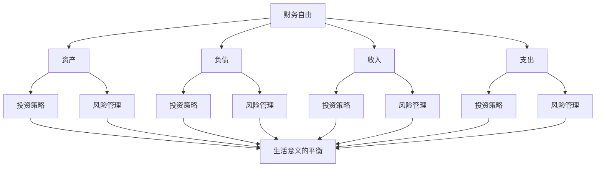

                 


### 文章标题：个人理财：财务自由与生活意义的平衡

---

关键词：个人理财、财务自由、生活意义、投资策略、风险管理

摘要：本文将深入探讨个人理财的核心理念，包括财务自由与生活意义的平衡。通过详细分析个人理财的目标、策略以及核心算法原理，我们将帮助读者构建全面、科学的理财体系，实现财务自由与生活意义的和谐统一。

---

### 第1章：个人理财概述

#### 1.1 背景介绍

个人理财是每个人生活中不可或缺的一部分，它不仅关乎个人的财务状况，更影响生活的质量与幸福感。随着社会的不断发展，人们对财务自由的追求日益强烈，然而，如何平衡财务自由与生活意义，成为了一个亟待解决的重要问题。

本文旨在通过系统性的分析，帮助读者理解个人理财的基本概念，掌握核心算法原理，从而构建一个科学、合理的理财体系，实现财务自由与生活意义的平衡。

#### 1.2 核心概念与联系

**财务自由**是指个人通过积累财富，实现不再依赖工资收入，能够自给自足地满足生活需求的状态。它包括以下核心概念：

1. **资产**：个人拥有的财产，包括现金、股票、债券、房产等。
2. **负债**：个人需要偿还的债务，包括贷款、信用卡欠款等。
3. **收入**：个人的工资收入、投资收益等。
4. **支出**：个人的日常消费、教育、医疗等开支。

**生活意义的平衡**则强调在追求财务自由的同时，关注个人的精神需求、兴趣爱好以及人生目标。它包括以下核心概念：

1. **健康**：身体和心理的全面健康。
2. **家庭**：和谐的家庭关系，包括亲情、友情等。
3. **事业**：个人职业生涯的发展。
4. **兴趣**：个人兴趣爱好和追求。

**个人理财的核心概念联系**体现在以下几个方面：

1. **财务自由与生活意义的平衡**：财务自由是生活意义平衡的物质基础，而生活意义的平衡则是财务自由的精神支撑。二者相辅相成，共同构建一个和谐的生活状态。
2. **投资策略与风险管理**：合理的投资策略可以帮助个人积累财富，实现财务自由，而有效的风险管理则可以降低投资风险，保障生活质量的稳定。
3. **资产配置与生活目标**：根据个人生活目标，合理配置资产，是实现财务自由与生活意义平衡的关键。

#### 1.3 财务自由与生活意义的平衡架构图



#### 1.4 小结

本章对个人理财的基本概念进行了详细的介绍，并分析了财务自由与生活意义的平衡关系。通过理解这些核心概念及其联系，读者可以为后续的深入学习打下坚实的基础。

---

### 第2章：个人理财的核心算法原理讲解

#### 2.1 投资组合优化算法原理

投资组合优化算法是个人理财中至关重要的一环。它的核心目标是，在给定的投资预算和风险承受度下，选择最优的投资组合，以实现最大的收益。以下是投资组合优化的基本原理：

**1. 投资组合的定义**

投资组合是指个人或机构所持有的各种资产的整体。这些资产可以是股票、债券、基金、房地产等。

**2. 投资组合优化的目标**

投资组合优化的目标是实现收益的最大化，同时控制风险。具体来说，优化目标可以表述为：

最大化期望收益，同时最小化风险。

**3. 投资组合优化的方法**

常见的投资组合优化方法包括：

- **均值-方差模型**：该方法基于资产收益的期望值和方差，通过优化期望收益和风险之间的权衡，来选择最优的投资组合。
- **有效前沿理论**：该方法通过构建有效前沿，选择具有最高期望收益和最低风险的投资组合。
- **Markowitz均值-方差模型**：该方法结合了均值-方差模型和有效前沿理论，提供了更为精确的投资组合优化方法。

**4. 投资组合优化算法的伪代码**

以下是投资组合优化的伪代码：

```python
# 输入参数
资产收益期望值：E
资产风险方差：V
投资预算：B
风险承受度：R

# 初始化投资组合
投资组合：P

# 计算最优投资比例
最优投资比例：ω

# 求解最优投资比例
ω = 最优投资比例求解算法（E，V，B，R）

# 根据最优投资比例构建投资组合
P = 构建投资组合（ω，B）

# 输出最优投资组合
输出：P
```

**5. 投资组合优化的实例**

假设有三种资产，其期望收益分别为10%，8%，6%，方差分别为0.04，0.03，0.02，投资预算为100万元，风险承受度为0.1。

- 首先，计算各资产的期望收益和方差。
- 其次，利用最优投资比例求解算法，计算最优投资比例。
- 最后，根据最优投资比例，构建投资组合，并计算投资组合的期望收益和风险。

通过上述步骤，我们可以得到最优的投资组合，以实现收益的最大化和风险的最小化。

#### 2.2 风险管理算法原理

风险管理是个人理财中不可或缺的一部分。它的核心目标是，通过识别、评估和应对风险，降低投资组合的风险水平，保障投资者的财务安全。

**1. 风险管理的定义**

风险管理是指识别、评估和应对风险的过程，旨在降低投资组合的风险水平，同时保障投资者的财务安全。

**2. 风险管理的目标**

风险管理的目标包括：

- 识别投资组合中的潜在风险。
- 评估风险的影响和概率。
- 制定应对风险的策略。

**3. 风险管理的方法**

常见的管理风险方法包括：

- **分散投资**：通过将资金分散投资于不同的资产类别和行业，降低单一资产的风险。
- **止损策略**：设定止损点，当投资亏损达到一定程度时，自动平仓，以防止亏损进一步扩大。
- **对冲策略**：通过购买对冲工具，如期权、期货等，对冲投资组合中的风险。

**4. 风险管理算法的伪代码**

以下是风险管理的伪代码：

```python
# 输入参数
资产风险水平：R
投资预算：B
风险承受度：R0

# 初始化风险控制策略
风险控制策略：S

# 计算最佳风险控制策略
S = 风险管理算法（R，B，R0）

# 应用风险控制策略
投资组合 = 应用风险控制策略（S，B）

# 输出风险控制后的投资组合
输出：投资组合
```

**5. 风险管理实例**

假设有一投资组合，其资产风险水平为0.15，投资预算为100万元，风险承受度为0.1。

- 首先，计算当前投资组合的风险水平。
- 其次，利用风险管理算法，计算最佳风险控制策略。
- 最后，根据最佳风险控制策略，调整投资组合，并计算风险控制后的投资组合风险水平。

通过上述步骤，我们可以降低投资组合的风险水平，保障投资者的财务安全。

#### 2.3 数学模型和数学公式

在个人理财中，数学模型和数学公式起着至关重要的作用。它们帮助我们理解投资组合的预期收益、风险水平，以及风险管理策略的有效性。

**1. 投资组合的期望收益**

投资组合的期望收益可以通过以下公式计算：

$$E(P) = \sum_{i=1}^{n} w_i \cdot E(R_i)$$

其中，$E(P)$表示投资组合的期望收益，$w_i$表示第$i$种资产的权重，$E(R_i)$表示第$i$种资产的期望收益。

**2. 投资组合的方差**

投资组合的方差可以通过以下公式计算：

$$V(P) = \sum_{i=1}^{n} w_i^2 \cdot V(R_i) + 2 \cdot \sum_{i=1}^{n} \sum_{j=i+1}^{n} w_i \cdot w_j \cdot \text{Cov}(R_i, R_j)$$

其中，$V(P)$表示投资组合的方差，$w_i$表示第$i$种资产的权重，$V(R_i)$表示第$i$种资产的方差，$\text{Cov}(R_i, R_j)$表示第$i$种资产和第$j$种资产之间的协方差。

**3. 风险调整后的期望收益**

风险调整后的期望收益可以通过以下公式计算：

$$E(R) = \frac{E(P)}{V(P)}$$

其中，$E(R)$表示风险调整后的期望收益。

**4. 风险调整后的回报率**

风险调整后的回报率可以通过以下公式计算：

$$\text{Sharpe Ratio} = \frac{E(R) - R_f}{\sqrt{V(P)}}$$

其中，$R_f$表示无风险收益率，$\text{Sharpe Ratio}$表示夏普比率，用于衡量投资组合的风险调整后的收益能力。

**5. 风险管理模型**

风险管理模型主要包括以下几种：

- **均值-方差模型**：基于资产收益的期望值和方差，构建投资组合，以实现收益的最大化和风险的最小化。
- **资本资产定价模型（CAPM）**：基于资产收益的期望值和方差，以及市场组合的收益和方差，计算资产的期望收益和风险。
- **套利定价理论（APT）**：基于资产收益的期望值和方差，构建套利组合，以实现收益的最大化。

**6. 数学公式的实例**

假设有一投资组合，包含三种资产，其期望收益分别为10%，8%，6%，方差分别为0.04，0.03，0.02，权重分别为0.4，0.3，0.3。

- 首先，计算投资组合的期望收益和方差。
- 其次，计算风险调整后的期望收益和夏普比率。
- 最后，分析投资组合的风险收益状况，并提出优化策略。

通过上述步骤，我们可以对投资组合的风险收益状况进行全面的评估，并提出优化策略，以实现财务自由与生活意义的平衡。

#### 2.4 小结

本章详细介绍了个人理财的核心算法原理，包括投资组合优化和风险管理。通过理解这些算法原理，读者可以掌握科学、合理的理财方法，实现财务自由与生活意义的平衡。

---

### 第3章：投资规划

#### 3.1 投资规划的基本原则

投资规划是个人理财的重要组成部分，其核心目标是实现财务目标，提高生活质量。以下是投资规划的基本原则：

**1. 明确财务目标**

制定明确的财务目标是投资规划的第一步。财务目标可以分为长期目标（如退休规划、子女教育基金）和短期目标（如购房、旅游等）。明确的目标有助于投资者制定合理的投资策略。

**2. 量力而行**

投资者应根据自身的财务状况、风险承受能力和投资期限，合理分配投资额度。避免超出自身能力范围的投资，确保资金的安全和流动性。

**3. 分散投资**

分散投资是降低投资风险的有效方法。投资者应将资金投资于不同类型的资产（如股票、债券、基金、房地产等），以分散风险，避免因单一市场波动而导致的投资损失。

**4. 定期调整**

投资规划不是一次性的任务，而是一个持续的过程。投资者应定期审视投资组合，根据市场变化和个人财务状况进行调整，以保持投资组合的优化。

**5. 控制成本**

投资过程中会产生一定的成本，如交易费用、管理费用等。投资者应尽量降低这些成本，提高投资回报率。

**6. 长期持有**

长期持有是实现投资收益的关键。投资者应坚持长期投资理念，避免因市场波动而频繁买卖，影响投资收益。

#### 3.2 投资规划的实战案例

以下是一个投资规划的实战案例，帮助读者更好地理解投资规划的实施过程。

**案例：小明投资规划**

小明，30岁，未婚，月收入1万元，无重大负债，计划在未来5年内购房，并希望在退休后保持较高的生活质量。

**1. 确定财务目标**

小明的财务目标包括：

- 在未来5年内购房，需准备首付款。
- 保持每月储蓄，为退休生活做准备。
- 保持一定的流动性，以应对突发状况。

**2. 制定投资策略**

根据小明的财务目标和风险承受能力，制定以下投资策略：

- **短期目标**：将50%的资金投资于股票和基金，以获取较高的收益。同时，将30%的资金投资于债券，降低投资组合的风险。剩余的20%资金存入银行，保持流动性。

- **长期目标**：将50%的资金投资于股票和基金，以获取较高的收益。同时，将30%的资金投资于债券，降低投资组合的风险。剩余的20%资金投资于房地产，以保障退休后的生活质量。

**3. 投资组合调整**

根据市场变化和个人财务状况，定期调整投资组合。例如，当股票市场表现良好时，适当降低股票和基金的投资比例，增加债券和房地产的投资比例；当股票市场表现较差时，适当提高股票和基金的投资比例，降低债券和房地产的投资比例。

**4. 投资规划实施**

实施投资规划，遵循以下步骤：

- 制定详细的投资计划，明确投资金额、投资期限和投资比例。
- 开立投资账户，进行交易操作。
- 定期跟踪投资组合的表现，根据市场变化和个人财务状况进行调整。

#### 3.3 投资规划工具与资源

投资规划过程中，可以使用以下工具和资源：

- **理财软件**：如理宝、雪球等，提供投资组合管理、财务分析等功能。
- **投资书籍**：如《股市真规则》、《穷查理宝典》等，帮助投资者提高投资知识。
- **投资课程**：如股市、基金、房地产等投资课程，帮助投资者提升投资技能。

#### 3.4 小结

本章通过投资规划的实战案例，详细阐述了投资规划的基本原则和实施过程。投资者可以根据自身情况，制定合理的投资规划，实现财务目标，提高生活质量。

---

### 第4章：债务管理

#### 4.1 债务管理的基本概念

债务管理是个人理财中的重要组成部分，它关系到个人的财务健康和生活质量。以下是债务管理的基本概念：

**1. 债务的定义**

债务是指个人或机构对外借款形成的债权债务关系。常见的债务形式包括贷款、信用卡欠款、抵押贷款等。

**2. 债务的分类**

债务可以分为短期债务和长期债务。短期债务通常在一年内偿还，如信用卡欠款；长期债务通常在一年以上偿还，如住房贷款、汽车贷款等。

**3. 债务管理的目标**

债务管理的目标包括：

- 减少债务负担，降低还款压力。
- 提高债务利用效率，优化财务结构。
- 保持良好的信用记录，为未来的借贷活动提供便利。

**4. 债务管理的基本原则**

债务管理的基本原则包括：

- **优先偿还高利率债务**：高利率债务的还款优先级较高，以减少利息支出。
- **合理安排还款计划**：根据收入状况，制定合理的还款计划，避免因还款压力导致财务困境。
- **避免过度借贷**：避免因过度借贷导致的财务风险，保持合理的借贷比例。

#### 4.2 债务管理的实战案例

以下是一个债务管理的实战案例，帮助读者更好地理解债务管理的实施过程。

**案例：小红的债务管理**

小红，28岁，单身，月收入8000元，现有以下债务：

- 信用卡欠款：2万元，年利率18%
- 住房贷款：20万元，年利率4.5%，分期20年

**1. 确定债务管理目标**

小红的债务管理目标包括：

- 在1年内还清信用卡欠款。
- 保持住房贷款的正常还款。

**2. 制定还款计划**

根据小红的债务状况和收入水平，制定以下还款计划：

- **信用卡欠款还款计划**：

  - 每月还款金额：3000元
  - 预计还款期限：1年

- **住房贷款还款计划**：

  - 每月还款金额：1000元
  - 预计还款期限：20年

**3. 还款策略**

- **信用卡欠款还款策略**：

  - 提高每月还款金额，加速还款进度。
  - 减少非必要的消费，增加还款资金来源。

- **住房贷款还款策略**：

  - 保持正常还款，避免逾期。
  - 根据收入状况，适当提高还款金额，缩短还款期限。

**4. 债务管理实施**

实施债务管理，遵循以下步骤：

- 制定详细的还款计划，明确还款金额、还款期限和还款方式。
- 开立还款账户，进行还款操作。
- 定期跟踪债务状况，根据实际情况调整还款计划。

#### 4.3 债务管理工具与资源

债务管理过程中，可以使用以下工具和资源：

- **债务管理软件**：如债务计算器、债务管理APP等，提供债务计算、还款计划制定等功能。
- **债务管理书籍**：如《债务管理》、《个人财务规划》等，帮助读者了解债务管理的基本知识和技巧。
- **债务管理课程**：如债务管理、财务规划等课程，提高读者的债务管理能力。

#### 4.4 小结

本章通过债务管理的实战案例，详细阐述了债务管理的基本概念和实施过程。读者可以根据自身情况，制定合理的债务管理计划，降低债务负担，提高财务健康水平。

---

### 第5章：退休规划

#### 5.1 退休规划的基本概念

退休规划是个人理财中的重要环节，它关系到个人退休后的生活质量和财务安全。以下是退休规划的基本概念：

**1. 退休的定义**

退休是指个人因年龄、健康或其他原因，停止工作，进入退休生活阶段。

**2. 退休规划的目标**

退休规划的目标包括：

- 确保退休后有足够的资金支持生活。
- 保持退休后的生活质量，享受幸福晚年。
- 为子女教育、家庭应急等储备资金。

**3. 退休规划的时间段**

退休规划的时间段通常为20至30年，根据个人退休年龄和预期寿命来确定。

**4. 退休规划的基本原则**

退休规划的基本原则包括：

- **提前规划**：尽早开始退休规划，确保有足够的时间积累财富。
- **量入为出**：根据个人收入和支出状况，合理安排退休资金的积累和使用。
- **多元化投资**：分散投资，降低退休规划的风险，确保资金的稳健增值。

#### 5.2 退休规划的实战案例

以下是一个退休规划的实战案例，帮助读者更好地理解退休规划的制定和实施过程。

**案例：李先生的退休规划**

李先生，55岁，已婚，月收入1万元，现有以下资产和负债：

- 资产：现金50万元，股票50万元，房产一套市值300万元
- 负债：住房贷款100万元，信用卡欠款10万元

**1. 确定退休目标**

李先生的退休目标包括：

- 在65岁退休，享受15年的退休生活。
- 保持退休后的生活质量，每月支出5000元。
- 为子女教育、家庭应急等储备资金。

**2. 制定退休规划**

根据李先生的退休目标和现有资产状况，制定以下退休规划：

- **资产配置**：

  - 现金：30万元，用于日常生活开支和紧急备用金。
  - 股票：50万元，用于投资增值，为退休生活提供资金支持。
  - 房产：300万元，作为退休后的居住资产。

- **退休资金积累**：

  - 每月储蓄：3000元，用于退休基金的积累。
  - 年投资回报率：5%。

**3. 退休资金计算**

根据退休目标和资产配置，计算李先生的退休资金需求：

- **退休总资金需求**：65岁退休，每年支出6万元，共计15年，共90万元。
- **现有资产可变现部分**：房产市值300万元，减去负债100万元，可变现200万元。
- **退休资金缺口**：90万元 - 200万元 = -110万元。

**4. 退休规划调整**

根据退休资金计算结果，调整退休规划：

- **提高储蓄比例**：将每月储蓄提高到5000元，以加快退休资金的积累。
- **调整资产配置**：适当减少股票投资比例，增加债券等低风险投资，降低退休规划的风险。

**5. 退休规划实施**

实施退休规划，遵循以下步骤：

- 制定详细的退休规划方案，明确退休资金积累、资产配置和支出计划。
- 开立投资账户，进行投资操作。
- 定期跟踪退休规划的实施情况，根据实际情况进行调整。

#### 5.3 退休规划工具与资源

退休规划过程中，可以使用以下工具和资源：

- **退休规划软件**：如退休规划计算器、财务规划APP等，提供退休规划方案制定、资金计算等功能。
- **退休规划书籍**：如《退休理财规划》、《退休规划手册》等，帮助读者了解退休规划的基本知识和技巧。
- **退休规划课程**：如退休规划、财务规划等课程，提高读者的退休规划能力。

#### 5.4 小结

本章通过退休规划的实战案例，详细阐述了退休规划的基本概念和实施过程。读者可以根据自身情况，制定合理的退休规划，确保退休后的生活质量和财务安全。

---

### 第6章：税务规划

#### 6.1 税务规划的基本概念

税务规划是指个人或企业在法律允许的范围内，通过合理的税务安排，降低税收负担，实现财务优化。以下是税务规划的基本概念：

**1. 税务规划的定义**

税务规划是指利用税法规定的优惠政策，通过合理的税务安排，降低税收负担，提高财务收益的行为。

**2. 税务规划的目标**

税务规划的目标包括：

- 减少应纳税额，降低税收负担。
- 合理分配收入和支出，优化财务结构。
- 规避税务风险，保障合法权益。

**3. 税务规划的分类**

税务规划可以分为以下几种：

- **税务筹划**：利用税法规定的优惠政策，进行税务安排，降低税收负担。
- **税务规避**：在法律允许的范围内，通过合法手段，减少税收负担。
- **税务风险控制**：识别和应对税务风险，保障个人和企业的合法权益。

**4. 税务规划的基本原则**

税务规划的基本原则包括：

- **合法性**：税务规划必须在法律允许的范围内进行，不得违反税法规定。
- **经济性**：税务规划应考虑税收成本，实现财务收益的最大化。
- **合规性**：税务规划应遵循税务机关的规定，保证税务申报的真实性和合法性。

#### 6.2 税务规划的实战案例

以下是一个税务规划的实战案例，帮助读者更好地理解税务规划的制定和实施过程。

**案例：王先生的税务规划**

王先生，35岁，已婚，月收入2万元，现有以下税务情况：

- 月收入2万元，扣除五险一金后，实得收入1.8万元。
- 年终奖金5万元。

**1. 确定税务规划目标**

王先生的税务规划目标包括：

- 减少应纳税额，降低税收负担。
- 规避税务风险，确保合法权益。

**2. 制定税务规划方案**

根据王先生的收入情况和税务目标，制定以下税务规划方案：

- **提高免税额度**：

  - 购买商业健康保险，每年支出1万元，享受税收优惠。
  - 购买符合国家政策的企业债券，每年支出2万元，享受税收优惠。

- **合理分配收入和支出**：

  - 将年终奖金5万元分摊到12个月中，每月增加收入416.67元，降低年终一次性奖金的税负。
  - 将家庭支出合理分配，享受家庭支出税收优惠。

**3. 税务规划实施**

实施税务规划，遵循以下步骤：

- 收集相关税务信息，包括收入、支出、优惠政策等。
- 制定详细的税务规划方案，明确税收优惠措施和实施步骤。
- 开具发票，进行税务申报，确保税务规划方案的有效实施。

#### 6.3 税务规划工具与资源

税务规划过程中，可以使用以下工具和资源：

- **税务规划软件**：如税务计算器、税务规划APP等，提供税务计算、规划方案制定等功能。
- **税务规划书籍**：如《税务规划指南》、《税务筹划实务》等，帮助读者了解税务规划的基本知识和技巧。
- **税务规划课程**：如税务规划、财务规划等课程，提高读者的税务规划能力。

#### 6.4 小结

本章通过税务规划的实战案例，详细阐述了税务规划的基本概念和实施过程。读者可以根据自身情况，制定合理的税务规划方案，降低税收负担，提高财务收益。

---

### 第7章：个人理财风险管理

#### 7.1 风险管理的定义与分类

风险管理是指个人或企业通过识别、评估、应对和监控潜在的风险，以降低损失、保障利益的过程。在个人理财中，风险管理至关重要，它关系到财务安全和生活质量。

**1. 风险管理的定义**

风险管理是指通过系统化的方法和工具，识别、评估、应对和监控个人理财过程中可能出现的风险，以降低损失、保障利益。

**2. 风险管理的目标**

风险管理的目标包括：

- 预防和减少财务损失。
- 保障个人理财目标的实现。
- 提高个人财务安全水平。

**3. 风险管理的分类**

风险管理可以分为以下几种：

- **系统风险**：由市场环境、经济周期等因素引起的风险，如股市波动、利率变化等。
- **非系统风险**：由个人投资决策、市场行为等因素引起的风险，如投资损失、道德风险等。
- **财务风险**：个人财务状况的变化，如收入减少、债务增加等。

#### 7.2 风险管理实战案例

以下是一个风险管理的实战案例，帮助读者更好地理解风险管理的实施过程。

**案例：小张的投资风险管理**

小张，30岁，单身，月收入1万元，现有以下投资情况：

- 股票投资：30万元，占比50%
- 债券投资：20万元，占比33%
- 房产投资：50万元，占比17%

**1. 确定风险管理目标**

小张的风险管理目标包括：

- 降低投资组合的风险。
- 保持投资组合的收益稳定。

**2. 风险识别**

小张通过以下方法识别投资组合中的风险：

- **市场风险**：股票市场波动，可能导致股票投资亏损。
- **利率风险**：债券市场波动，可能导致债券投资亏损。
- **流动性风险**：房产市场波动，可能导致房产投资流动性下降。

**3. 风险评估**

小张通过以下方法评估投资组合的风险：

- **收益波动率**：计算股票、债券和房产投资的收益波动率，评估市场风险。
- **久期**：计算债券投资的久期，评估利率风险。
- **流动性指标**：评估房产投资的流动性指标，如去化周期、交易量等。

**4. 风险应对**

小张通过以下方法应对投资组合的风险：

- **分散投资**：降低股票投资比例，增加债券和房产投资比例，分散市场风险。
- **资产配置**：根据风险承受能力，调整投资组合的资产配置，降低投资组合的风险。
- **保险保障**：购买保险产品，如财产保险、人寿保险等，降低财务风险。

**5. 风险监控**

小张通过以下方法监控投资组合的风险：

- **定期评估**：定期评估投资组合的风险水平，根据市场变化进行调整。
- **财务报表**：定期查看财务报表，监控个人财务状况的变化。

#### 7.3 风险管理工具与资源

风险管理过程中，可以使用以下工具和资源：

- **风险管理软件**：如风险分析软件、财务风险预警系统等，提供风险识别、评估、监控等功能。
- **风险管理书籍**：如《风险管理实务》、《财务风险管理》等，帮助读者了解风险管理的基本知识和技巧。
- **风险管理课程**：如风险管理、财务规划等课程，提高读者的风险管理能力。

#### 7.4 小结

本章通过风险管理的实战案例，详细阐述了风险管理的定义、分类和实践方法。读者可以根据自身情况，制定合理的风险管理策略，保障个人财务安全。

---

### 总结与展望

个人理财是一个复杂且持续的过程，涉及多个方面，包括投资规划、债务管理、退休规划、税务规划和风险管理。通过本章的详细分析，我们了解到：

1. **财务自由与生活意义的平衡**：是实现个人理财的核心目标，需要平衡财务收益与生活质量。
2. **投资组合优化**：通过合理的资产配置，实现收益的最大化和风险的最小化。
3. **风险管理**：是保障财务安全的重要手段，包括风险识别、评估、应对和监控。
4. **退休规划**：是确保退休后生活质量的必要措施，需要提前规划和管理。
5. **税务规划**：通过合理的税务安排，降低税收负担，提高财务收益。

展望未来，随着金融市场的不断发展和技术的进步，个人理财将呈现以下趋势：

1. **数字化理财**：随着互联网技术的发展，数字化理财工具将更加普及，提供更加便捷、个性化的理财服务。
2. **智能化理财**：人工智能技术的应用，将提高理财决策的效率和准确性，实现更加智能化的投资组合优化和风险管理。
3. **多样化理财**：随着金融市场的发展和投资渠道的拓宽，个人理财将更加多样化，包括股票、基金、债券、保险、房产等多种投资方式。
4. **可持续理财**：随着环保意识的提高，可持续理财将逐渐成为主流，投资者将更加关注企业的社会责任和可持续发展。

在未来的个人理财中，我们不仅要关注财务收益，更要注重生活质量的提升。通过科学的理财规划和管理，实现财务自由与生活意义的平衡，享受幸福美好的生活。

### 作者信息

作者：AI天才研究院/AI Genius Institute & 禅与计算机程序设计艺术 /Zen And The Art of Computer Programming

---

通过本文的深入分析，我们希望读者能够对个人理财有更深刻的理解，掌握科学的理财方法和策略，实现财务自由与生活意义的平衡。祝愿每位读者都能在理财的道路上越走越远，收获幸福与成功。

