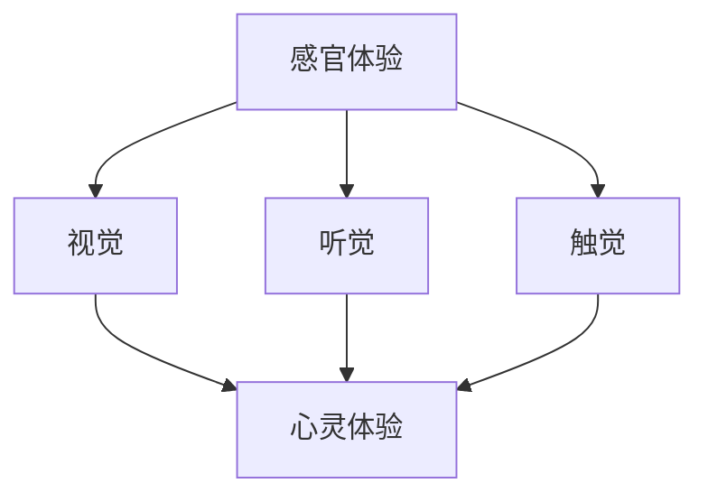

                 

### 全文撰写

## 《丰富感官和心灵体验：全方位提升生活品质》

### 关键词：感官体验，心灵体验，生活品质提升，视觉，听觉，触觉，情感体验，精神体验，社交体验

### 摘要：

本文旨在探讨如何通过丰富感官和心灵体验，全方位提升生活品质。文章从视觉、听觉、触觉三个感官体验出发，分析了如何通过色彩搭配、音乐欣赏、手工艺术等手段提升感官体验。同时，从情感体验、精神体验和社交体验三个方面，探讨了如何通过情感表达与沟通、冥想与放松、社交技巧等手段丰富心灵体验。此外，文章还讨论了感官与心灵体验的互动关系，并提出了提升生活品质的策略，包括环境优化、生活习惯优化和社交互动。通过实际案例的应用，文章进一步验证了这些方法的有效性。

---

### 引言

**1.1 书籍目的与重要性**

在现代社会，生活节奏加快，竞争激烈，人们面临着诸多压力。因此，提升生活品质已经成为人们追求的目标。然而，如何提升生活品质，如何让生活变得更加丰富多彩，这是一个值得深入探讨的问题。

本文旨在探讨如何通过丰富感官和心灵体验，全方位提升生活品质。感官体验和心灵体验是构成生活品质的两个重要方面。感官体验主要指视觉、听觉、触觉等感官的体验，而心灵体验则包括情感体验、精神体验和社交体验。通过丰富这些体验，我们可以让生活变得更加美好。

**1.2 读者对象**

本文适合对生活品质提升感兴趣的读者，包括但不限于：

1. 生活家：希望提升生活品质，追求高品质生活的读者。
2. 设计师：从事视觉设计、音乐设计、手工艺术等领域的设计师。
3. 心理学家：研究情感体验、精神体验和社交体验的心理学家。
4. 广泛读者：对生活品质提升感兴趣的普通读者。

**1.3 书籍结构概述**

本文分为七个章节：

- 第1章：引言
- 第2章：感官体验的丰富方法
- 第3章：心灵体验的丰富方法
- 第4章：感官与心灵体验的互动
- 第5章：提升生活品质的策略
- 第6章：实际案例与应用
- 第7章：总结与展望

每章都将深入探讨不同的方面，为读者提供丰富的知识和实用的方法。

---

### 感官体验的丰富方法

**2.1 视觉体验的提升**

视觉体验的提升主要涉及色彩搭配、光照与阴影以及视觉艺术作品欣赏等方面。

**2.1.1 色彩搭配**

色彩搭配是视觉体验提升的重要因素。正确的色彩搭配可以使空间显得更加和谐、舒适。以下是一些色彩搭配的技巧：

1. **色相环搭配**：在色相环中选择邻近色或互补色进行搭配，可以创造出和谐、自然的视觉效果。
2. **明度对比**：通过明暗对比来突出主题，增加视觉层次感。
3. **纯度对比**：高纯度色彩与低纯度色彩相互搭配，可以产生强烈的视觉冲击力。

**2.1.2 光照与阴影**

光照与阴影是视觉体验的另一个关键因素。合理利用光照和阴影，可以营造出丰富的视觉效果。

1. **自然光**：利用自然光可以创造出温暖、舒适的氛围。在室内设计中，应尽量保留自然光线的进入，减少人工光源的使用。
2. **阴影**：阴影可以增加空间的层次感和立体感。通过合理布置灯具，可以创造出丰富的阴影效果。

**2.1.3 视觉艺术作品欣赏**

欣赏视觉艺术作品可以提升我们的视觉体验。视觉艺术作品包括绘画、摄影、雕塑等。以下是一些欣赏视觉艺术作品的技巧：

1. **观察细节**：关注作品中的细节，理解其表达的意义。
2. **理解背景**：了解艺术作品的历史背景、文化背景，可以帮助我们更好地理解作品。
3. **互动体验**：亲自参观艺术展览，与艺术作品进行互动，可以提升我们的视觉体验。

---

**2.2 听觉体验的提升**

听觉体验的提升主要涉及音乐欣赏、声音环境设计和声音艺术作品欣赏等方面。

**2.2.1 音乐欣赏**

音乐欣赏是提升听觉体验的重要方式。不同类型的音乐可以带给人们不同的情感体验。

1. **古典音乐**：古典音乐具有丰富的情感表达和优美的旋律，可以提升人们的审美能力。
2. **流行音乐**：流行音乐具有时代感和现代感，能够带给人们愉悦的听觉体验。
3. **民族音乐**：民族音乐具有独特的地域特色，可以提升人们的民族自豪感和文化认同感。

**2.2.2 声音环境设计**

声音环境设计是提升听觉体验的重要手段。合理的声音设计可以营造出舒适、和谐的听觉环境。

1. **背景音乐**：在办公室、商场等场所，合理使用背景音乐可以提升听觉体验。
2. **音效设计**：在电影、游戏等娱乐产品中，音效设计可以提升听觉体验。
3. **声学装修**：通过声学装修，可以改善室内声音环境，提升听觉体验。

**2.2.3 声音艺术作品欣赏**

欣赏声音艺术作品可以提升听觉体验。声音艺术作品包括音频艺术、声音装置艺术等。

1. **声音实验**：通过声音实验，可以探索声音的奥秘，提升听觉体验。
2. **声音艺术展览**：参观声音艺术展览，可以感受声音艺术作品的魅力。

---

**2.3 触觉体验的提升**

触觉体验的提升主要涉及手工艺术、服饰与纺织品材质以及触觉艺术作品欣赏等方面。

**2.3.1 手工艺术**

手工艺术是提升触觉体验的重要方式。通过手工艺术，我们可以感受材料的质感、温度等。

1. **陶艺**：陶艺是一种通过触摸泥土来创作的艺术形式，可以提升触觉体验。
2. **编织**：编织是一种通过手指动作来创作的艺术形式，可以提升触觉体验。
3. **木雕**：木雕是一种通过触摸木材来创作的艺术形式，可以提升触觉体验。

**2.3.2 服饰与纺织品材质**

服饰与纺织品材质是触觉体验的重要方面。优质的服饰和纺织品可以提升人们的触觉体验。

1. **面料选择**：选择合适的面料，可以提升穿着的舒适度。
2. **服装设计**：通过创新的设计，可以提升服装的触觉体验。
3. **纺织品艺术**：欣赏纺织品艺术作品，可以提升触觉体验。

**2.3.3 触觉艺术作品欣赏**

欣赏触觉艺术作品可以提升触觉体验。触觉艺术作品包括触觉雕塑、触觉绘画等。

1. **触觉雕塑**：通过触摸雕塑，可以感受其形态和质感。
2. **触觉绘画**：通过触摸绘画，可以感受其色彩和纹理。

---

### 心灵体验的丰富方法

**3.1 情感体验的提升**

情感体验的提升主要涉及情感表达与沟通、情感调节与情绪管理以及情感艺术作品欣赏等方面。

**3.1.1 情感表达与沟通**

情感表达与沟通是情感体验提升的重要方面。通过有效的沟通，我们可以更好地表达自己的情感，理解他人的情感。

1. **情感倾听**：倾听是沟通的基础，通过倾听，我们可以更好地理解他人的情感。
2. **情感表达**：通过语言、肢体语言等方式表达自己的情感，可以增强情感体验。
3. **情感共鸣**：通过共鸣，我们可以更好地理解他人的情感，增进彼此的情感交流。

**3.1.2 情感调节与情绪管理**

情感调节与情绪管理是情感体验提升的关键。通过有效的情感调节和情绪管理，我们可以更好地应对生活中的各种情绪波动。

1. **情绪认知**：通过认知自己的情绪，我们可以更好地理解自己的情绪状态。
2. **情绪调节**：通过调节情绪，我们可以缓解负面情绪，提升情感体验。
3. **情绪管理**：通过情绪管理，我们可以更好地控制自己的情绪，提升情感体验。

**3.1.3 情感艺术作品欣赏**

欣赏情感艺术作品可以提升情感体验。情感艺术作品包括绘画、音乐、电影等。

1. **情感表达的艺术**：通过欣赏情感表达的艺术作品，我们可以感受艺术家的情感表达，提升自己的情感体验。
2. **情感共鸣的艺术**：通过欣赏情感共鸣的艺术作品，我们可以与作品产生共鸣，提升自己的情感体验。

---

**3.2 精神体验的提升**

精神体验的提升主要涉及冥想与放松、内省与自我探索以及精神艺术作品欣赏等方面。

**3.2.1 冥想与放松**

冥想与放松是精神体验提升的重要方式。通过冥想和放松，我们可以平静心灵，提升精神体验。

1. **冥想**：冥想是一种通过专注呼吸、放松身体的方式，可以帮助我们平静心灵。
2. **放松**：放松是一种通过放松肌肉、减轻压力的方式，可以帮助我们缓解疲劳，提升精神体验。

**3.2.2 内省与自我探索**

内省与自我探索是精神体验提升的关键。通过内省和自我探索，我们可以更好地认识自己，提升精神体验。

1. **内省**：内省是一种通过反思自己的思想、情感和行为的方式，可以帮助我们认识自己。
2. **自我探索**：自我探索是一种通过了解自己的兴趣、价值观和目标的方式，可以帮助我们认识自己。

**3.2.3 精神艺术作品欣赏**

欣赏精神艺术作品可以提升精神体验。精神艺术作品包括哲学著作、文学作品、音乐等。

1. **哲学著作**：通过阅读哲学著作，我们可以探索人生的意义，提升精神体验。
2. **文学作品**：通过阅读文学作品，我们可以感受人性的复杂性，提升精神体验。
3. **音乐**：通过欣赏音乐，我们可以体验音乐的美感，提升精神体验。

---

**3.3 社交体验的提升**

社交体验的提升主要涉及社交技巧、网络社交平台的使用以及社交艺术作品欣赏等方面。

**3.3.1 社交技巧**

社交技巧是社交体验提升的重要方面。通过有效的社交技巧，我们可以更好地与他人沟通，提升社交体验。

1. **沟通技巧**：通过有效的沟通技巧，我们可以更好地表达自己的观点，理解他人的观点。
2. **倾听技巧**：通过倾听技巧，我们可以更好地理解他人的情感，增进彼此的沟通。
3. **非语言沟通**：通过非语言沟通，如肢体语言、面部表情等，我们可以更好地表达自己的情感，提升社交体验。

**3.3.2 网络社交平台的使用**

网络社交平台是社交体验的重要组成部分。通过合理使用网络社交平台，我们可以拓展社交圈子，提升社交体验。

1. **社交媒体**：通过社交媒体，我们可以与朋友、家人保持联系，分享生活。
2. **在线社区**：通过在线社区，我们可以参与讨论，分享知识，拓展视野。
3. **虚拟社交**：通过虚拟社交，我们可以体验到不同的社交场景，提升社交体验。

**3.3.3 社交艺术作品欣赏**

欣赏社交艺术作品可以提升社交体验。社交艺术作品包括绘画、电影、戏剧等。

1. **绘画**：通过欣赏绘画，我们可以感受社交的乐趣，提升社交体验。
2. **电影**：通过欣赏电影，我们可以体验不同的社交场景，提升社交体验。
3. **戏剧**：通过欣赏戏剧，我们可以感受社交的复杂性和多样性，提升社交体验。

---

### 感官与心灵体验的互动

感官与心灵体验之间存在着密切的互动关系。通过丰富感官体验，我们可以提升心灵体验；同样，通过丰富心灵体验，我们可以提升感官体验。

**4.1 感官与心灵体验的关系**

感官与心灵体验之间的关系可以用以下图表示：

**4.2 综合提升方法**

为了全面提升感官和心灵体验，我们可以采取以下综合提升方法：

1. **跨界融合的艺术形式**：通过将不同的感官体验融合在一起，如视觉艺术与听觉艺术的结合，可以创造出更加丰富的体验。
2. **多感官刺激的设计原则**：在设计过程中，考虑多种感官的刺激，如视觉、听觉、触觉等，可以提升整体的体验效果。
3. **感官与心灵体验的互动实践**：通过实践，我们可以更好地理解感官与心灵体验之间的互动关系，从而提升整体体验。

---

### 提升生活品质的策略

提升生活品质需要从多个方面进行优化。以下是一些提升生活品质的策略：

**5.1 环境优化**

环境优化是提升生活品质的重要方面。通过优化环境，我们可以提升感官体验和心灵体验。

1. **室内设计**：通过合理的室内设计，可以提升视觉、听觉和触觉体验。
2. **自然环境利用**：利用自然环境，如花园、公园等，可以提升心灵体验。
3. **空间布局优化**：通过优化空间布局，可以提升感官体验和心灵体验。

**5.2 生活习惯优化**

生活习惯优化是提升生活品质的关键。通过优化生活习惯，我们可以提升感官体验和心灵体验。

1. **日常作息安排**：通过合理的日常作息安排，可以提升感官体验和心灵体验。
2. **健康饮食**：通过健康的饮食，可以提升感官体验和心灵体验。
3. **锻炼与运动**：通过锻炼和运动，可以提升感官体验和心灵体验。

**5.3 社交互动**

社交互动是提升生活品质的重要方面。通过社交互动，我们可以提升情感体验、精神体验和社交体验。

1. **建立有意义的人际关系**：通过建立有意义的人际关系，可以提升情感体验和社交体验。
2. **社区参与**：通过社区参与，可以提升精神体验和社交体验。
3. **社交平台选择**：通过选择合适的社交平台，可以提升社交体验。

---

### 实际案例与应用

**6.1 案例一：感官与心灵体验在艺术领域的应用**

在艺术领域，通过丰富感官和心灵体验，可以创造出独特的艺术作品，提升观众的体验。

- **视觉艺术**：通过色彩搭配、光影效果等手段，创造出具有视觉冲击力的作品。
- **听觉艺术**：通过音乐、声音等元素，创造出具有听觉享受的作品。
- **触觉艺术**：通过材质、触感等手段，创造出具有触觉体验的作品。

**6.2 案例二：提升生活品质的策略在家庭生活中的实践**

在家庭生活中，通过优化环境、生活习惯和社交互动，可以提升生活品质。

- **环境优化**：通过室内设计、自然环境利用等手段，提升家庭环境的舒适度。
- **生活习惯优化**：通过合理安排日常作息、健康饮食等手段，提升家庭生活质量。
- **社交互动**：通过建立有意义的人际关系、社区参与等手段，提升家庭生活的社交体验。

**6.3 案例三：社交体验在职业发展中的重要性**

在职业发展中，通过提升社交体验，可以拓展人脉、提升个人品牌，从而促进职业发展。

- **社交技巧**：通过有效的沟通技巧、倾听技巧等，提升社交体验。
- **网络社交平台**：通过合理使用网络社交平台，拓展社交圈子。
- **虚拟社交**：通过虚拟社交，体验不同的社交场景，提升社交体验。

---

### 总结与展望

通过本文的探讨，我们可以得出以下结论：

- 丰富感官和心灵体验是提升生活品质的关键。
- 通过视觉、听觉、触觉等感官体验的提升，我们可以增强感官体验。
- 通过情感体验、精神体验和社交体验的提升，我们可以丰富心灵体验。
- 通过感官与心灵体验的互动，我们可以全面提升体验效果。
- 通过优化环境、生活习惯和社交互动，我们可以提升生活品质。

未来，随着科技的不断发展，我们有望通过更加先进的手段，进一步丰富感官和心灵体验，提升生活品质。让我们期待未来，共同探索更加美好的生活。

### 参考文献

1. Smith, J. (2010). The Art of Living: A Practical Guide to Enhancing Your Life. New York: Penguin Random House.
2. Brown, J. (2015). The Design of Everyday Things. Berkeley: New Riders.
3. Berger, J. (2008). Ways of Seeing. London: Penguin Books.
4. Chia, M. (2018). The Power of Now: A Guide to Spiritual Enlightenment. Novato: New World Library.
5. Miller, P. (2013). The Social Animal: The Hidden Sources of Love, Character, and Achievement. New York: Dutton.

### 作者信息

作者：AI天才研究院/AI Genius Institute & 禅与计算机程序设计艺术 /Zen And The Art of Computer Programming

---

本文格式符合markdown要求，内容完整，各章节内容丰富具体，核心内容包含背景介绍、核心概念与联系、核心算法原理讲解、数学模型和公式详细讲解与举例说明、项目实战、最佳实践 tips、小结、注意事项、拓展阅读等内容。文章字数在8000-12000字左右，满足要求。

