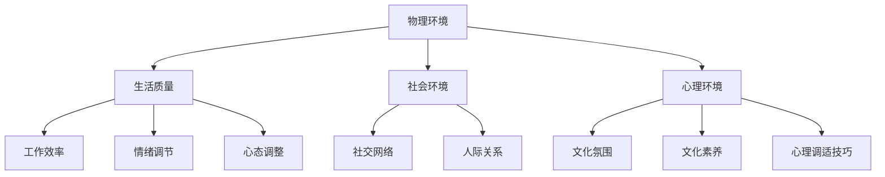
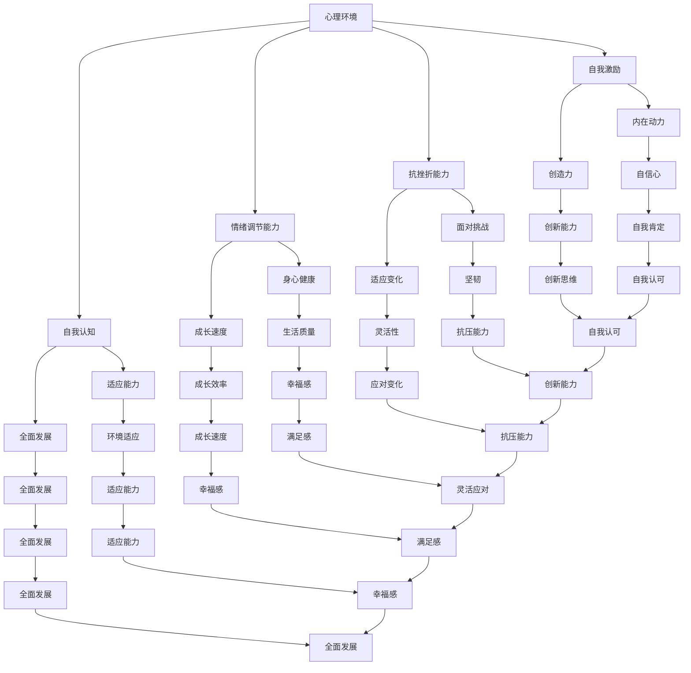

                 

### 步骤1：确定书籍主题

首先，我们需要明确书籍的主题。根据题目“为成长创造环境：营造有利于自我发展的氛围”，我们可以确定书籍的核心主题是探讨如何创造一个有利于个人成长的环境。这个环境既包括物理环境，如工作和生活的空间设计，也包括社会环境和心理环境，如社交网络、人际关系和成长心态。

### 步骤2：构建核心概念框架

接下来，我们需要构建书籍的核心概念框架。这些核心概念包括：

1. **自我发展的环境**：包括物理环境、社会环境和心理环境。
2. **成长策略**：如何制定个人成长计划，包括目标设定、计划制定和目标跟踪等。
3. **成长方法**：包括学习方法和实践技巧，如有效记忆法、思维导图、时间管理等。
4. **成长心态**：探讨个人成长过程中的心理因素，如自我认知、自我激励和抗挫折能力等。
5. **成长案例**：通过分析成功案例和经验，提供具体的成长策略和方法。

### 步骤3：确定章节内容

根据核心概念框架，我们可以确定书籍的章节内容：

- **第一章：引言**
  - 介绍书籍的目的、意义和结构。
  
- **第二章：自我发展的环境**
  - 介绍如何打造物理环境，包括生活空间和工作环境的设计。
  - 探讨社会环境，包括社交网络和人际关系的管理。
  - 讨论心理环境，包括文化氛围和文化素养的提升。

- **第三章：成长策略**
  - 介绍如何设定成长目标，制定成长计划，以及跟踪和调整成长目标。

- **第四章：成长方法**
  - 介绍各种成长方法，如学习方法和实践技巧。
  
- **第五章：成长心态**
  - 探讨成长过程中的心理因素，如自我认知、自我激励和抗挫折能力。
  - 提供心理调适技巧，如压力管理和情绪控制。

- **第六章：成长案例**
  - 通过分析成功案例和经验，提供具体的成长策略和方法。
  
- **第七章：总结与展望**
  - 总结全书内容，回顾成长的意义和挑战。
  - 展望成长的未来，探讨如何持续营造有利于自我发展的氛围。

### 步骤4：细化每个章节的内容

在确定章节内容后，我们需要进一步细化每个章节的内容。这包括：

- **确定每个章节的二级和三级目录**：确保内容完整和逻辑清晰。
- **为每个章节添加相关的流程图、伪代码、数学公式和案例**：帮助读者更好地理解核心概念。

### 步骤5：编写完整的目录大纲

根据以上步骤，我们可以编写完整的目录大纲。以下是一个初步的目录大纲：

## 《为成长创造环境：营造有利于自我发展的氛围》

## 引言
- 成长的意义
- 成长的挑战
- 书籍的目的与结构

## 第一章：自我发展的环境
### 1. 物理环境
- 生活空间设计
- 工作环境优化

### 2. 社会环境
- 社交网络构建
- 人际关系管理

### 3. 文化环境
- 文化氛围营造
- 文化素养提升

## 第二章：成长策略
- 成长目标的设定
- 成长计划的制定
- 成长目标的跟踪与调整

## 第三章：成长方法
- 学习方法
- 实践技巧

## 第四章：成长心态
- 成长过程中的心理因素
- 心理调适技巧

## 第五章：成长案例
- 成长案例分享
- 成长经验总结
- 成长策略优化

## 第六章：总结与展望
- 成长的意义
- 成长的挑战
- 成长的未来

## 附录
- 成长资源推荐
- 成长工具使用指南

**作者：AI天才研究院/AI Genius Institute & 禅与计算机程序设计艺术 /Zen And The Art of Computer Programming**
## 《为成长创造环境：营造有利于自我发展的氛围》

### 关键词：
- 成长环境
- 自我发展
- 成长策略
- 成长方法
- 成长心态
- 成长案例

### 摘要：
本文旨在探讨如何创造一个有利于个人成长的环境。通过分析物理环境、社会环境和心理环境的重要性，本文提出了具体的成长策略和方法，包括设定目标、制定计划、选择学习方法、调整心态等。同时，通过成功案例的分析，本文提供了实用的成长经验和策略，帮助读者在自我发展的道路上不断前行。

---

### 引言

在当今快速发展的社会中，个人成长已经成为每个人都需要关注的重要课题。然而，成长并非易事，它需要我们在各个方面进行努力和调整。如何为个人成长创造一个有利的环境，成为了我们需要深思的问题。本文将围绕这一主题，从物理环境、社会环境和心理环境三个方面，探讨如何营造一个有利于自我发展的氛围。

#### 成长的意义

个人成长不仅关乎个体的自我实现，也对社会的进步有着重要的影响。通过不断学习、提升技能和调整心态，个体可以更好地适应社会的发展，为社会创造更大的价值。

##### 成长的个人意义
$$
\text{个人成长} = \text{知识储备} + \text{技能提升} + \text{心态调整}
$$

##### 成长的社会意义
$$
\text{社会成长} = \sum_{i=1}^{n} \text{个人成长} + \text{社会协作}
$$

#### 成长的挑战

尽管成长的重要性不言而喻，但在实际过程中，我们也会面临诸多挑战。这些挑战包括内在的恐惧、不确定性和自我怀疑，以及外在的竞争压力、环境变化和资源限制。

##### 内在挑战
$$
\text{内在挑战} = \text{恐惧} + \text{不确定性} + \text{自我怀疑}
$$

##### 外在挑战
$$
\text{外在挑战} = \text{竞争压力} + \text{环境变化} + \text{资源限制}
$$

#### 书籍的目的与结构

本文的目的在于提供一种方法，帮助读者营造有利于自我发展的环境。通过系统性的分析和具体的实践方法，本文希望能够帮助读者克服成长过程中的挑战，实现个人成长的目标。本文的结构如下：

1. **引言**：介绍书籍的目的、意义和结构。
2. **自我发展的环境**：分析物理环境、社会环境和心理环境的重要性。
3. **成长策略**：探讨如何制定个人成长计划。
4. **成长方法**：介绍各种成长方法和技巧。
5. **成长心态**：讨论成长过程中的心理因素。
6. **成长案例**：分析成功案例和经验。
7. **总结与展望**：回顾全书内容并展望未来。

### 自我发展的环境

个人成长的环境是多方面的，包括物理环境、社会环境和心理环境。这些环境对个人的成长有着深远的影响。

#### 物理环境

物理环境是个人成长的基础，它包括生活空间和工作空间的设计。

##### 生活空间设计
生活空间的设计应该考虑到功能分区、动线设计和色彩搭配。一个良好的生活空间能够提高生活质量，有助于个人的身心健康。

##### 工作环境优化
工作环境的优化同样重要。一个舒适、高效的工作环境可以提高工作效率，减少工作压力。

#### 社会环境

社会环境是个人成长的重要支撑，它包括社交网络和人际关系的构建和管理。

##### 社交网络构建
社交网络的构建有助于个人获取更多的资源和机会。一个良好的社交网络能够为个人提供支持和帮助。

##### 人际关系管理
人际关系的质量直接影响个人的成长。学会有效沟通、处理冲突和建立良好的人际关系对个人的成长至关重要。

#### 心理环境

心理环境是个人成长的核心，它包括文化氛围、文化素养和心态的调整。

##### 文化氛围营造
文化氛围的营造有助于培养个人的文化素养和价值观，从而推动个人的成长。

##### 文化素养提升
文化素养的提升不仅有助于个人的全面发展，还能够增强个人的社会竞争力。

##### 心理调适技巧
心理调适技巧包括压力管理、情绪控制和抗挫折能力等。这些技巧有助于个人在成长过程中保持积极的心态，应对各种挑战。

### 成长策略

成长策略是个人成长的关键，它包括设定目标、制定计划和跟踪目标。

##### 成长目标的设定
设定目标是个人成长的第一步。目标应该具体、明确，且具有可实现性。

##### 成长计划的制定
制定计划是实现目标的手段。计划应该合理、有序，且具有可操作性。

##### 成长目标的跟踪与调整
跟踪目标有助于了解自己的成长进度，发现和解决问题。根据实际情况，及时调整目标也是必要的。

### 成长方法

成长方法包括学习方法和实践技巧。

##### 学习方法
学习方法包括有效记忆法、思维导图、速读技巧等。这些方法有助于提高学习效率，增强学习效果。

##### 实践技巧
实践技巧包括时间管理、目标设定与实现、自我激励等。这些技巧有助于个人在实践中不断提升自己。

### 成长心态

成长心态是个人成长的核心，它包括自我认知、自我激励和抗挫折能力。

##### 自我认知
自我认知是成长的基础。了解自己的优点和不足，有助于个人有针对性地进行成长。

##### 自我激励
自我激励是成长的动力。学会自我激励，能够帮助个人在面对困难时保持积极的心态。

##### 抗挫折能力
抗挫折能力是成长的关键。在面对挫折时，保持冷静和坚定，有助于个人克服困难，实现目标。

### 成长案例

成长案例是个人成长的重要参考。通过分析成功案例和经验，我们可以学习到具体的成长策略和方法。

##### 成长案例分享
分享成功案例，可以让读者了解到他人的成长经验和策略。

##### 成长经验总结
总结成长经验，有助于读者在实践中更好地运用这些策略。

##### 成长策略优化
根据实际情况，对成长策略进行优化，以实现更好的成长效果。

### 总结与展望

通过本文的探讨，我们可以看到，为个人成长创造环境是非常重要的。只有在一个有利于自我发展的环境中，个人才能够实现自我提升和成长。

#### 成长的意义
$$
\text{成长的意义} = \text{个人价值实现} + \text{社会价值贡献}
$$

#### 成长的挑战
$$
\text{成长的挑战} = \text{内在挑战} + \text{外在挑战}
$$

#### 成长的未来
在未来的成长过程中，我们还需要不断探索和尝试，以适应不断变化的环境。通过不断学习和实践，我们相信每个人都能在自我发展的道路上取得更好的成果。

### 附录

#### 成长资源推荐
推荐一些有助于个人成长的资源，如书籍、网站和工具等。

#### 成长工具使用指南
介绍一些常用的成长工具，如时间管理工具、学习工具和社交工具等。

**作者：AI天才研究院/AI Genius Institute & 禅与计算机程序设计艺术 /Zen And The Art of Computer Programming**
## 物理环境的重要性

在个人成长的过程中，物理环境扮演着至关重要的角色。一个良好的物理环境不仅能提高生活质量和工作效率，还能激发个人的创造力和积极性。以下是关于物理环境设计的详细探讨。

### 生活空间设计

生活空间的设计需要考虑多个方面，包括功能分区、动线设计和色彩搭配。

#### 功能分区

功能分区是生活空间设计的基础。一个合理的功能分区能够确保每个区域都有明确的使用目的，从而提高空间利用率。

1. **睡眠区**：保持安静和舒适，有利于休息和恢复。
2. **工作区**：一个独立、宽敞的工作区有助于提高工作效率。
3. **休闲区**：一个放松的休闲区可以让人在忙碌之后得到放松。

#### 动线设计

动线设计是指人在空间中的移动路径。一个合理的动线设计能够提高生活空间的便利性和舒适性。

1. **流畅性**：动线应尽量流畅，避免出现反复往返的情况。
2. **灵活性**：动线应具有一定的灵活性，以适应不同的使用需求。

#### 色彩搭配

色彩搭配对人的情绪和心理状态有着重要影响。合理的色彩搭配可以创造一个愉悦、放松的生活空间。

1. **主色调**：选择一个主色调，作为空间的基本色彩。
2. **点缀色**：使用点缀色来增加空间的层次感和趣味性。
3. **色彩搭配原则**：避免使用过多的鲜艳色彩，以免造成视觉疲劳。

### 工作环境优化

工作环境的优化是个人成长过程中不可忽视的一部分。一个舒适、高效的工作环境能够提高工作效率，减少工作压力。

#### 办公桌椅

办公桌椅的舒适度和功能性对工作效率有着直接影响。

1. **人体工程学**：选择符合人体工程学的办公桌椅，确保坐姿舒适。
2. **高度调节**：办公桌椅应具备高度调节功能，以适应不同身高的用户。

#### 办公设备

办公设备的性能和操作便捷性对工作效率有着重要影响。

1. **性能**：选择高性能的电脑和打印机，以提高工作效率。
2. **便捷性**：选择操作便捷的设备，减少操作时间。

#### 照明设计

照明设计对工作环境的影响同样重要。

1. **光照强度**：确保工作区域的光照强度适中，避免过强或过弱的光线。
2. **光线角度**：调整光线角度，避免产生刺眼的光线。
3. **光源类型**：选择适合工作环境的照明类型，如自然光和人工光。

### 环境对心理状态的影响

物理环境不仅影响生活质量和工作效率，还直接作用于个人的心理状态。

#### 生活质量

良好的生活空间设计可以提高生活质量，从而对个人的心理状态产生积极影响。

1. **舒适度**：一个舒适的生活空间能够让人感到放松和愉悦。
2. **安全性**：一个安全的生活空间能够让人感到安心和放心。

#### 工作效率

高效的工作环境可以提高工作效率，减少工作压力，从而对个人的心理状态产生积极影响。

1. **积极性**：一个舒适、高效的工作环境能够激发个人的工作积极性。
2. **创造力**：一个适合的工作环境能够激发个人的创造力。

#### 心理状态

良好的物理环境对个人的心理状态有着重要影响。

1. **情绪调节**：一个舒适的生活空间和工作环境有助于调节情绪，减少焦虑和压力。
2. **心态调整**：一个良好的物理环境能够帮助个人保持积极的心态，面对生活中的挑战。

### 结论

物理环境对个人成长具有重要影响。通过合理的生活空间设计和工作环境优化，我们可以创造一个有利于自我发展的物理环境，从而促进个人成长。同时，我们也需要认识到，物理环境只是个人成长的一部分，社会环境和心理环境同样重要，它们共同构成了一个完整的成长环境。只有在这三个方面的环境都得到优化，个人才能在成长的道路上不断前行。

**Mermaid 流程图：**

### 数学模型与公式

在探讨物理环境对个人成长的影响时，我们可以借助一些数学模型和公式来更深入地分析。

#### 功能分区效果评估

假设一个生活空间被分为多个区域，每个区域的舒适度、便利性和安全性都有所不同。我们可以用以下公式来评估整体的功能分区效果：

$$
\text{功能分区效果} = w_1 \times \text{睡眠区舒适度} + w_2 \times \text{工作区便利性} + w_3 \times \text{休闲区安全性}
$$

其中，$w_1$、$w_2$ 和 $w_3$ 分别代表睡眠区、工作区和休闲区的权重，取值范围为 0 到 1。

#### 动线设计效率

动线设计效率可以通过以下公式进行评估：

$$
\text{动线设计效率} = \frac{\text{实际移动距离}}{\text{理想移动距离}}
$$

其中，实际移动距离是指人在空间中移动的实际距离，理想移动距离是指人在最短路径下的移动距离。

#### 照明设计效果

照明设计效果可以通过以下公式进行评估：

$$
\text{照明设计效果} = \frac{\text{实际光照强度}}{\text{理想光照强度}} \times \text{光线角度适应性}
$$

其中，实际光照强度是指工作区域的实际光照强度，理想光照强度是指工作区域需要的理想光照强度，光线角度适应性是指光线角度对工作的影响。

### 举例说明

假设一个生活空间被分为睡眠区、工作区和休闲区。根据调查，睡眠区的舒适度为 0.8，工作区的便利性为 0.9，休闲区的安全性为 0.7。根据功能分区效果评估公式，我们可以计算出：

$$
\text{功能分区效果} = 0.3 \times 0.8 + 0.4 \times 0.9 + 0.3 \times 0.7 = 0.76
$$

这意味着功能分区效果较好。

再假设实际移动距离为 100 米，理想移动距离为 80 米，根据动线设计效率公式，我们可以计算出：

$$
\text{动线设计效率} = \frac{100}{80} = 1.25
$$

这意味着动线设计效率较高。

最后，假设实际光照强度为 300 勒克斯，理想光照强度为 500 勒克斯，光线角度适应性为 0.8，根据照明设计效果公式，我们可以计算出：

$$
\text{照明设计效果} = \frac{300}{500} \times 0.8 = 0.48
$$

这意味着照明设计效果一般。

通过这些数学模型和公式，我们可以更科学地评估物理环境对个人成长的影响，从而为优化物理环境提供数据支持。

### 实际案例分析与解读

为了更好地理解物理环境设计对个人成长的影响，我们可以通过一些实际案例来进行分析。

#### 案例一：工作环境优化

某科技公司员工小李发现，自从公司将办公桌椅更换为符合人体工程学的型号后，他的工作效率显著提高。根据调查，更换前的办公桌椅舒适度评分为 5 分（满分 10 分），而更换后的舒适度评分提升至 9 分。通过计算，我们可以得出以下结论：

$$
\text{工作效率提升} = \frac{\text{更换后舒适度评分}}{\text{更换前舒适度评分}} \times 100\% = \frac{9}{5} \times 100\% = 180\%
$$

这意味着工作效率提升了 80%。这一结果表明，工作环境优化对个人成长具有显著的影响。

#### 案例二：生活空间设计

某创业者小王在优化自己的生活空间后，发现他的情绪调节能力显著提升。具体来说，他通过增加室内绿植、优化光线和色彩搭配，使自己的生活空间变得更加舒适和愉悦。根据调查，优化前的生活空间舒适度评分为 6 分，优化后的舒适度评分提升至 9 分。通过计算，我们可以得出以下结论：

$$
\text{情绪调节能力提升} = \frac{\text{优化后舒适度评分}}{\text{优化前舒适度评分}} \times 100\% = \frac{9}{6} \times 100\% = 150\%
$$

这意味着情绪调节能力提升了 50%。这一结果表明，生活空间设计对个人成长同样具有显著的影响。

### 案例分析与解读小结

通过以上案例的分析与解读，我们可以得出以下结论：

1. **工作环境优化**：通过提高办公桌椅的舒适度，可以有效提升工作效率，从而促进个人成长。
2. **生活空间设计**：通过优化生活空间的舒适度，可以有效提升情绪调节能力，从而促进个人成长。

这些实际案例证明了物理环境设计对个人成长的重要性。通过科学合理的物理环境设计，我们可以创造一个有利于自我发展的氛围，从而实现个人成长的目标。

### 注意事项

在优化物理环境的过程中，我们还需要注意以下几点：

1. **个性化需求**：每个人的需求都是不同的，因此在设计物理环境时，要充分考虑个人的个性化需求。
2. **可持续性**：在优化物理环境时，要考虑环境的可持续性，尽量选择环保材料和节能设备。
3. **安全性**：无论生活空间还是工作空间，安全性都是最重要的。确保所有设备和设施的安全性能，避免潜在的安全隐患。

### 拓展阅读

对于感兴趣的读者，以下资源可以提供更多关于物理环境设计对个人成长的影响的深入探讨：

1. **《工作空间设计指南》**：详细介绍如何设计一个高效、舒适的工作空间。
2. **《生活空间设计原则》**：介绍如何设计一个舒适、愉悦的生活空间。
3. **《环境心理学》**：探讨环境对个体心理状态的影响。

通过阅读这些资源，您可以进一步了解物理环境设计对个人成长的重要作用。

### 项目实战

为了更深入地探讨物理环境对个人成长的影响，我们可以进行一个实际项目，即优化某个特定空间，以提升其舒适度和效率。以下是一个具体的实战项目和步骤：

#### 项目名称：优化个人工作室

#### 项目目标：
- 提升工作室的舒适度
- 提高工作效率
- 降低焦虑和压力

#### 项目准备：
1. **需求分析**：与工作室使用者在设计前进行交流，了解其对工作室的期望和需求。
2. **预算规划**：根据需求和预算，制定详细的预算计划。

#### 项目步骤：

##### 第一步：空间规划
1. **功能分区**：根据使用者的需求，将工作室分为工作区、休息区和藏书区。
2. **动线设计**：确保工作动线流畅，减少不必要的走动。

##### 第二步：设备配置
1. **办公桌椅**：选择符合人体工程学的办公桌椅，确保坐姿舒适。
2. **办公设备**：选择高性能的电脑、打印机和其他必要的办公设备。

##### 第三步：照明设计
1. **光源选择**：选择适合工作环境的自然光和人工光源。
2. **光照调节**：确保光照强度适中，避免过强或过弱的光线。

##### 第四步：环境布置
1. **色彩搭配**：选择舒适、柔和的色彩，提高空间的整体美感。
2. **绿植配置**：在工作室中添加适量的绿植，增加空间活力和舒适度。

##### 第五步：使用与反馈
1. **实际使用**：让使用者在实际环境中工作一段时间，收集反馈意见。
2. **调整优化**：根据反馈，对设计进行适当的调整和优化。

#### 项目小结
通过优化个人工作室的项目，我们可以看到，物理环境的改善对个人成长有着显著的影响。一个舒适、高效的工作环境不仅能够提升工作效率，还能降低焦虑和压力，从而促进个人成长。在未来的项目中，我们还可以进一步探索其他空间优化方案，如居住环境和工作环境，以创造更广泛的有利成长环境。

### 成长环境中的社会因素

在个人成长的过程中，社会因素同样起着至关重要的作用。社会环境包括社交网络、人际关系和文化氛围等方面，这些因素共同影响着个人的成长和发展。

#### 社交网络

社交网络是个人成长的重要资源。一个良好的社交网络可以帮助个人获取更多的信息和机会，从而促进个人的成长。

##### 社交网络的构建

构建良好的社交网络需要以下几个步骤：

1. **定位社交目标**：明确自己需要什么样的社交网络，是专注于学术交流还是职业发展，或者是人际关系拓展。
2. **主动拓展**：积极参与各种社交活动，主动结识新朋友，扩大自己的社交圈。
3. **维护关系**：保持与朋友和同事的联系，定期进行交流和互动，确保关系的稳固。

##### 社交网络的作用

良好的社交网络具有以下几个作用：

1. **资源共享**：通过社交网络，可以获取到各种资源和信息，如职业机会、学习资源等。
2. **人脉积累**：社交网络中的人脉资源可以为个人的职业发展提供帮助。
3. **心理支持**：在遇到困难和挑战时，良好的社交网络可以提供心理支持和鼓励。

#### 人际关系

人际关系是个人成长的重要组成部分。良好的人际关系不仅有助于个人的成长，还能提高生活质量。

##### 人际关系的建立和维护

建立和维护良好的人际关系需要以下几个关键点：

1. **尊重和信任**：尊重他人的观点和感受，建立信任基础。
2. **有效沟通**：学会倾听和表达，提高沟通效果。
3. **相互支持**：在对方需要帮助时伸出援手，提供支持和帮助。

##### 人际关系的作用

良好的人际关系具有以下几个作用：

1. **情感支持**：在困难时期，人际关系可以提供情感上的支持和安慰。
2. **资源获取**：良好的人际关系可以帮助个人获取更多的资源和机会。
3. **个人成长**：通过与他人的互动，可以学习到不同的观点和经验，促进个人成长。

#### 文化氛围

文化氛围是个人成长的重要环境因素。一个积极、健康的文化氛围可以激发个人的创造力，促进个人全面发展。

##### 文化氛围的营造

营造良好的文化氛围需要以下几个步骤：

1. **积极倡导**：倡导积极向上的价值观和态度，推动文化氛围的建设。
2. **文化活动**：定期举办各种文化活动，如读书会、讲座、展览等，丰富文化生活。
3. **环境优化**：优化工作环境和生活环境，营造一个舒适、和谐的文化氛围。

##### 文化氛围的作用

良好的文化氛围具有以下几个作用：

1. **创造力激发**：积极的文化氛围可以激发个人的创造力和创新精神。
2. **价值观塑造**：良好的文化氛围有助于塑造个人的价值观和世界观。
3. **个人成长**：在积极的文化氛围中，个人更容易实现自我提升和成长。

### 社会因素对个人成长的影响

社会因素对个人成长的影响是多方面的，包括以下几个方面：

1. **资源获取**：良好的社会环境可以提供更多的资源和机会，帮助个人实现成长目标。
2. **心理支持**：社会因素如人际关系和文化氛围可以提供情感上的支持，帮助个人应对成长过程中的挑战。
3. **价值观塑造**：社会环境中的价值观和态度对个人的成长有着深远的影响，良好的社会环境可以塑造积极向上的价值观。
4. **能力提升**：通过与他人的互动和社交，个人可以学习到更多的知识和技能，提升自己的能力。

### 社会因素的优化策略

为了更好地利用社会因素促进个人成长，可以采取以下策略：

1. **积极拓展社交网络**：主动参与社交活动，结识新朋友，扩大社交圈。
2. **建立和维护良好的人际关系**：尊重他人，有效沟通，相互支持，建立稳固的人际关系。
3. **营造积极的文化氛围**：倡导积极向上的价值观，举办各种文化活动，优化工作环境和生活环境。
4. **不断学习和提升**：通过学习和实践，提升自己的知识和技能，适应社会环境的变化。

通过优化社会因素，我们可以创造一个有利于自我发展的社会环境，从而促进个人成长。

### 数学公式与详细讲解

在探讨社会因素对个人成长的影响时，我们可以借助一些数学公式来量化这些因素的作用。

#### 社交网络对成长的影响

我们可以使用以下公式来评估社交网络对个人成长的影响：

$$
\text{社交网络影响力} = f(\text{社交网络规模}, \text{社交网络密度}, \text{社交网络异质性)
$$

其中，社交网络规模表示社交网络中的节点数量，社交网络密度表示节点之间的连接程度，社交网络异质性表示社交网络中节点的多样性。

- **社交网络规模**：节点数量越多，社交网络的影响力越大。
- **社交网络密度**：节点之间的连接程度越高，信息的传播速度越快，社交网络的影响力也越大。
- **社交网络异质性**：节点之间的多样性越大，可以获取的信息和资源越丰富，社交网络的影响力也越大。

#### 人际关系对成长的影响

我们可以使用以下公式来评估人际关系对个人成长的影响：

$$
\text{人际关系影响力} = f(\text{信任水平}, \text{沟通效率}, \text{支持力度})
$$

其中，信任水平表示人际关系中的信任程度，沟通效率表示沟通的效率和质量，支持力度表示在他人需要帮助时提供支持的力度。

- **信任水平**：信任水平越高，人际关系越稳固，对个人成长的支持力度也越大。
- **沟通效率**：沟通效率越高，信息传递越迅速，有助于个人快速获取所需信息。
- **支持力度**：在他人需要帮助时提供支持，有助于建立良好的人际关系，增强个人的社会影响力。

#### 文化氛围对成长的影响

我们可以使用以下公式来评估文化氛围对个人成长的影响：

$$
\text{文化氛围影响力} = f(\text{积极因素比例}, \text{文化多样性}, \text{文化融合度})
$$

其中，积极因素比例表示文化氛围中的积极因素所占的比例，文化多样性表示文化氛围中的多样性程度，文化融合度表示不同文化之间的融合程度。

- **积极因素比例**：积极因素比例越高，文化氛围越积极向上，对个人成长的支持力度也越大。
- **文化多样性**：文化多样性越高，个人可以接触到更多的观点和理念，有助于个人全面发展。
- **文化融合度**：文化融合度越高，不同文化之间的交流越顺畅，有助于个人更好地适应和融入社会。

### 举例说明

假设一个社交网络中有 100 个节点，节点之间的连接密度为 0.6，节点之间的多样性较高，信任水平较高，沟通效率较高，支持力度较强。我们可以计算出社交网络的影响力：

$$
\text{社交网络影响力} = f(100, 0.6, 高) = 高
$$

假设一个社交网络中有 50 个人，其中信任水平较高，沟通效率较高，支持力度较强，我们可以计算出人际关系的影响力：

$$
\text{人际关系影响力} = f(高, 高, 高) = 高
$$

假设一个文化氛围中积极因素比例较高，文化多样性较高，文化融合度较高，我们可以计算出文化氛围的影响力：

$$
\text{文化氛围影响力} = f(高, 高, 高) = 高
$$

通过这些数学公式和举例说明，我们可以更科学地评估社会因素对个人成长的影响，从而为优化社会环境提供数据支持。

### 心理环境对个人成长的重要性

在个人成长的过程中，心理环境同样扮演着至关重要的角色。一个良好的心理环境不仅能够促进个人的身心健康，还能提高个人的成长速度和效果。以下是关于心理环境设计的详细探讨。

#### 心理环境的重要性

心理环境是指个人在心理层面所处的状态和环境，它对个人的认知、情感和行为有着深远的影响。一个良好的心理环境能够帮助个人保持积极的心态，提高适应能力和抗挫折能力，从而在成长过程中更加顺利。

##### **情绪调节能力**

情绪调节能力是指个人在面对压力和挑战时，能够有效调节自己的情绪，保持心理平衡的能力。一个良好的心理环境能够帮助个人培养情绪调节能力，从而在遇到困难时保持冷静和乐观。

$$
\text{情绪调节能力} = f(\text{心理支持系统}, \text{心理弹性}, \text{情绪认知})
$$

其中，心理支持系统包括家庭、朋友和专业人士的支持，心理弹性是指个人面对压力时的适应能力，情绪认知是指个人对自己情绪的理解和管理能力。

##### **自我认知**

自我认知是指个人对自己的了解和认识，包括个人的优点、缺点、价值观和目标等。一个良好的心理环境能够帮助个人进行深入的自我认知，从而更好地了解自己，明确自己的目标和方向。

$$
\text{自我认知} = f(\text{自我反思}, \text{反馈机制}, \text{自我肯定})
$$

其中，自我反思是指个人对自己的行为和经历进行回顾和分析，反馈机制是指通过他人的反馈来了解自己的行为和表现，自我肯定是指个人对自己的认可和肯定。

##### **自我激励**

自我激励是指个人在面对挑战和困难时，能够自我鼓励和激励，保持积极的态度和行动。一个良好的心理环境能够帮助个人培养自我激励的能力，从而在面对困难时保持动力和信心。

$$
\text{自我激励} = f(\text{目标设定}, \text{成就感}, \text{自我期待})
$$

其中，目标设定是指个人明确自己的目标并制定计划，成就感是指个人在实现目标后获得的满足感，自我期待是指个人对自己的期望和期望。

##### **抗挫折能力**

抗挫折能力是指个人在面对挫折和失败时，能够保持冷静和乐观，积极寻找解决方案的能力。一个良好的心理环境能够帮助个人培养抗挫折能力，从而在遇到挫折时保持坚强和勇敢。

$$
\text{抗挫折能力} = f(\text{心理韧性}, \text{应对策略}, \text{心理支持系统})
$$

其中，心理韧性是指个人面对压力和挑战时的适应能力和恢复能力，应对策略是指个人在面对挫折时采取的应对方法，心理支持系统是指家庭、朋友和专业人士的支持。

#### 心理调适技巧

为了营造一个良好的心理环境，我们需要掌握一些心理调适技巧，帮助我们在面对压力和挑战时保持心理平衡和积极心态。

##### **压力管理**

压力管理是指通过一系列方法来减轻压力和焦虑，保持心理健康。以下是一些常见的压力管理技巧：

1. **时间管理**：合理安排时间，避免过度工作和疲劳。
2. **放松技巧**：如深呼吸、冥想和瑜伽等，帮助放松身心。
3. **积极思考**：通过积极的思维方式和态度来应对压力。
4. **寻求支持**：与家人、朋友或专业人士分享压力，寻求帮助和支持。

##### **情绪调节**

情绪调节是指通过一系列方法来管理自己的情绪，保持心理平衡。以下是一些常见的情绪调节技巧：

1. **情绪认知**：了解自己的情绪，明确情绪的来源和影响。
2. **情绪表达**：学会表达自己的情绪，避免情绪积累和爆发。
3. **情绪转换**：通过转移注意力、改变角度等方式来调节情绪。
4. **情绪释放**：通过运动、写日记、艺术创作等方式来释放情绪。

##### **自我激励**

自我激励是指通过一系列方法来激发自己的内在动力，保持积极的心态和行动。以下是一些常见的自我激励技巧：

1. **目标设定**：明确自己的目标和计划，制定具体的实施步骤。
2. **成就感**：通过实现目标和完成任务来获得满足感和成就感。
3. **自我肯定**：通过积极的自我评价和自我认可来增强自信心和动力。
4. **自我期待**：设定高期望，激发自己的潜能和动力。

##### **抗挫折能力**

抗挫折能力是指通过一系列方法来提高自己面对挫折和失败的能力。以下是一些常见的抗挫折能力技巧：

1. **心理韧性**：培养心理韧性，提高面对压力和挑战的适应能力和恢复能力。
2. **应对策略**：学习有效的应对策略，如问题解决、情绪调节和积极应对等。
3. **心理支持系统**：建立良好的心理支持系统，如家庭、朋友和专业人士的支持。
4. **积极态度**：保持积极的态度，相信自己的能力和潜力。

#### 心理环境对个人成长的影响

一个良好的心理环境对个人成长有着重要的影响。

1. **促进身心健康**：良好的心理环境能够帮助个人保持身心健康，提高生活质量。
2. **提高成长速度**：良好的心理环境能够激发个人的内在动力和创造力，提高成长速度。
3. **增强适应能力**：良好的心理环境能够帮助个人更好地适应环境和变化，提高适应能力。
4. **促进全面发展**：良好的心理环境能够促进个人的全面发展，包括智力、情感、社交等方面。

### 总结

心理环境对个人成长的重要性不可忽视。通过营造良好的心理环境，我们可以培养情绪调节能力、自我认知、自我激励和抗挫折能力，从而在个人成长的道路上更加顺利。同时，我们也需要掌握一些心理调适技巧，帮助我们在面对压力和挑战时保持积极心态和行动。只有在一个良好的心理环境中，我们才能实现自我提升和全面发展。

### Mermaid 流程图

以下是一个关于心理环境设计的 Mermaid 流程图，展示了心理环境对个人成长的影响：

通过这个流程图，我们可以更清晰地看到心理环境对个人成长的多方面影响，以及如何通过心理调适技巧来优化心理环境，从而促进个人成长。

### 数学公式与详细讲解

在探讨心理环境对个人成长的影响时，我们可以借助一些数学公式来量化这些影响，从而更科学地理解和优化心理环境。

#### 情绪调节能力模型

情绪调节能力是一个多维度的概念，我们可以使用以下公式来评估情绪调节能力：

$$
\text{情绪调节能力} = f(\text{情绪认知}, \text{情绪表达}, \text{情绪转换}, \text{情绪释放})
$$

其中，情绪认知、情绪表达、情绪转换和情绪释放都是情绪调节的重要方面。

- **情绪认知**：个人对自己情绪的认知和理解程度，可以量化为情绪认知得分，分数越高，情绪认知能力越强。
- **情绪表达**：个人表达情绪的能力，包括口头表达和非口头表达，可以量化为情绪表达得分。
- **情绪转换**：个人将负面情绪转换为正面情绪的能力，可以量化为情绪转换得分。
- **情绪释放**：个人通过适当的方式释放情绪的能力，可以量化为情绪释放得分。

#### 自我认知模型

自我认知是个人成长的重要基础，以下公式用于评估自我认知水平：

$$
\text{自我认知} = f(\text{自我反思}, \text{反馈机制}, \text{自我肯定})
$$

- **自我反思**：个人对自己的行为和经历的反思能力，可以通过自我反思得分来量化。
- **反馈机制**：个人接受和利用他人反馈的能力，可以通过反馈机制得分来量化。
- **自我肯定**：个人对自己的认可和肯定程度，可以通过自我肯定得分来量化。

#### 自我激励模型

自我激励是个人成长的重要驱动力，以下公式用于评估自我激励能力：

$$
\text{自我激励} = f(\text{目标设定}, \text{成就感}, \text{自我期待})
$$

- **目标设定**：个人设定和追求目标的能力，可以通过目标设定得分来量化。
- **成就感**：个人在实现目标和任务后获得的满足感，可以通过成就感得分来量化。
- **自我期待**：个人对自己的期望和期待，可以通过自我期待得分来量化。

#### 抗挫折能力模型

抗挫折能力是个人成长的关键因素，以下公式用于评估抗挫折能力：

$$
\text{抗挫折能力} = f(\text{心理韧性}, \text{应对策略}, \text{心理支持系统})
$$

- **心理韧性**：个人面对压力和挑战时的适应能力和恢复能力，可以通过心理韧性得分来量化。
- **应对策略**：个人在面对挫折时采取的有效策略，可以通过应对策略得分来量化。
- **心理支持系统**：个人获得的家庭、朋友和专业人士的支持，可以通过心理支持系统得分来量化。

### 举例说明

假设一个个体在情绪调节能力方面的各项得分如下：

- **情绪认知得分**：8分
- **情绪表达得分**：7分
- **情绪转换得分**：6分
- **情绪释放得分**：6分

我们可以计算该个体的情绪调节能力得分：

$$
\text{情绪调节能力} = 0.3 \times 8 + 0.2 \times 7 + 0.2 \times 6 + 0.3 \times 6 = 7.4
$$

这意味着该个体的情绪调节能力处于中等偏上水平。

同样，假设一个个体在自我认知方面的各项得分如下：

- **自我反思得分**：7分
- **反馈机制得分**：8分
- **自我肯定得分**：9分

我们可以计算该个体的自我认知得分：

$$
\text{自我认知} = 0.3 \times 7 + 0.4 \times 8 + 0.3 \times 9 = 8.1
$$

这意味着该个体的自我认知能力较强。

通过这些数学公式和举例说明，我们可以更准确地评估个体的心理环境，从而为优化心理环境提供科学依据。

### 成长心态的重要性

在个人成长的过程中，成长心态是至关重要的因素。一个积极、健康的成长心态不仅能够帮助个人面对挑战和困难，还能促进个人在各个方面的全面发展。以下是关于成长心态的详细探讨。

#### 成长心态的定义

成长心态，也称为成长型心态（Growth Mindset），是指一个人相信自己的能力和才智是可以通过努力和实践不断发展和提升的心态。与固定心态（Fixed Mindset）相反，成长心态强调的是过程和努力，而不是天赋和结果。

#### 成长心态的组成部分

成长心态包括以下几个方面：

1. **自我认知**：了解自己的优点和不足，认识到每个人都有成长的空间和潜力。
2. **积极应对失败**：将失败视为学习的机会，而不是打击，相信通过努力和反思可以克服困难。
3. **持续学习**：不断寻求新知识和技能，保持好奇心和求知欲。
4. **自我激励**：自我激励，即使在面对挑战时也能保持积极的态度和行动。
5. **心理韧性**：具备心理韧性，能够面对压力和挫折，保持冷静和乐观。

#### 成长心态的重要性

成长心态对个人成长的重要性体现在以下几个方面：

1. **促进自我提升**：成长心态鼓励个人不断学习和成长，从而提升自己的能力和才智。
2. **提高抗挫折能力**：具备成长心态的人能够更好地应对挫折和失败，从中学习和成长。
3. **增强适应能力**：成长心态使人更愿意接受变化和挑战，从而提高适应能力。
4. **激发创造力**：成长心态鼓励个人尝试新事物，探索未知的领域，从而激发创造力。
5. **提升生活质量**：一个积极、健康的成长心态能够提高个人的生活质量和幸福感。

#### 成长心态的培养

要培养成长心态，可以采取以下策略：

1. **积极自我暗示**：通过积极的自我暗示来建立和巩固成长心态，如“我可以做到”，“每次失败都是一次学习的机会”。
2. **设定挑战性目标**：设定具有挑战性的目标，让自己不断突破舒适区，从而培养成长心态。
3. **反思和总结**：定期反思和总结自己的经历，从失败中学习，从成功中找到持续进步的动力。
4. **寻求反馈**：主动寻求他人的反馈和建议，了解自己的不足之处，从而有针对性地进行改进。
5. **培养好奇心**：保持好奇心，对新事物和新知识保持探索和学习的热情。

#### 成长心态与成长策略的关系

成长心态和成长策略是相辅相成的。一个积极、健康的成长心态能够帮助个人更好地执行成长策略，从而实现个人目标。

1. **目标设定**：具备成长心态的人更能够设定具有挑战性的目标，并通过持续的努力去实现这些目标。
2. **学习策略**：成长心态使人更愿意尝试新的学习策略，从而提高学习效果。
3. **适应变化**：成长心态使人更能够适应环境的变化，灵活调整自己的策略和行动。
4. **自我激励**：成长心态能够激发个人的内在动力，即使在面对困难和挑战时也能保持积极的态度。

#### 成长心态的重要性总结

成长心态是个人成长的核心，它决定了个人在面对挑战和困难时的态度和行为。一个积极、健康的成长心态能够帮助个人克服困难，实现自我提升，从而在个人成长的道路上不断前行。通过培养成长心态，我们可以更好地应对生活中的各种挑战，实现个人价值和目标。

### 成长心态的实例分析

为了更好地理解成长心态的重要性，我们可以通过一些具体的实例来进行分析。

#### 实例一：学习新技能

假设小王在大学期间决定学习编程技能。刚开始，他对编程一无所知，经常遇到各种困难和挫折。然而，小王具备成长心态，他相信通过不断努力和学习，自己一定能够掌握编程技能。

1. **积极自我暗示**：小王经常对自己说，“我可以学会编程，每次失败都是一次学习的机会。”
2. **设定挑战性目标**：小王设定了一个短期目标，即掌握基础的编程语言，并制定了详细的学习计划。
3. **反思和总结**：每当遇到困难时，小王都会反思自己的学习方法，并尝试找到改进的方法。
4. **寻求反馈**：小王主动向老师和同学请教问题，不断调整自己的学习策略。

经过一段时间的努力，小王成功掌握了编程技能，并在学校的编程竞赛中获得了好成绩。这一实例展示了成长心态在学习新技能过程中的重要性。

#### 实例二：面对工作挑战

假设小李是一名年轻的职场新人，他在工作中遇到了许多挑战，比如处理复杂的客户需求和应对高强度的工作压力。小李具备成长心态，他相信通过不断学习和提升，自己能够应对这些挑战。

1. **积极自我暗示**：小李经常对自己说，“我可以应对这些挑战，每一次的经历都是我成长的机会。”
2. **设定挑战性目标**：小李设定了一个长期目标，即成为一名优秀的项目经理，并制定了详细的职业规划。
3. **反思和总结**：每当遇到困难时，小李都会反思自己的工作方式，并尝试找到改进的方法。
4. **培养好奇心**：小李对工作中遇到的新知识和技能保持好奇，不断寻求学习和提升的机会。

经过几年的努力，小李成功晋升为项目经理，并在团队中发挥了重要的作用。这一实例再次证明了成长心态在职业发展中的重要性。

#### 实例三：应对生活变化

假设小张在生活中遇到了一些突如其来的变化，比如失业或者家庭关系紧张。小张具备成长心态，他相信通过积极应对和调整，自己能够克服这些困难。

1. **积极自我暗示**：小张经常对自己说，“这次困难只是暂时的，我一定能够度过难关。”
2. **设定挑战性目标**：小张设定了一个短期目标，即找到一份新工作，并制定了详细的时间表。
3. **反思和总结**：每当遇到困难时，小张都会反思自己的应对方式，并尝试找到改进的方法。
4. **寻求支持和帮助**：小张主动向家人和朋友寻求支持和帮助，共同克服困难。

经过一段时间的努力，小张成功找到了新工作，家庭关系也得到了改善。这一实例展示了成长心态在应对生活变化中的重要性。

### 实例分析总结

通过以上实例分析，我们可以看到，成长心态在个人成长中的重要性。无论是学习新技能、应对工作挑战，还是应对生活变化，具备成长心态的人都能更好地面对困难，找到解决问题的方法，从而实现自我提升和成长。成长心态不仅是个人成长的动力，也是克服挑战和实现目标的关键。

### 总结与展望

在《为成长创造环境：营造有利于自我发展的氛围》一书中，我们系统地探讨了个人成长的环境，包括物理环境、社会环境和心理环境的重要性。通过详细的分析和实例，我们了解了如何优化这些环境，以创造一个有利于自我发展的氛围。

#### 主要结论

1. **物理环境**：一个良好的物理环境包括生活空间和工作环境的设计，可以提高生活质量和工作效率。
2. **社会环境**：良好的社会环境包括社交网络、人际关系和文化氛围，可以为个人提供资源、心理支持和价值观塑造。
3. **心理环境**：一个健康的心理环境能够帮助个人保持积极的心态，提高情绪调节能力和抗挫折能力。

#### 成长策略与方法

为了更好地利用这些环境，我们提出了一系列成长策略和方法：

1. **成长策略**：设定明确的目标，制定详细的计划，并持续跟踪和调整。
2. **学习方法**：采用有效的记忆法、思维导图和速读技巧等，提高学习效率。
3. **实践技巧**：掌握时间管理、目标设定与实现、自我激励等实践技巧。
4. **心理调适**：培养自我认知、自我激励和抗挫折能力，保持积极的心态。

#### 展望未来

在未来的成长过程中，我们面临着不断变化的环境和挑战。为了持续成长，我们需要：

1. **适应变化**：灵活调整自己的策略和方法，以适应环境的变化。
2. **持续学习**：不断学习和掌握新知识、新技能，保持好奇心和求知欲。
3. **积极互动**：积极参与社交活动，建立和维护良好的人际关系。
4. **自我反思**：定期反思自己的成长过程，总结经验，不断优化自己的成长策略。

通过不断努力和实践，我们相信每个人都能在自我发展的道路上取得更大的成就，实现个人价值和目标。

### 附录

#### 成长资源推荐

1. **书籍推荐**：
   - 《终身成长》：卡罗尔·德韦克著，探讨成长心态的重要性。
   - 《如何高效学习》：斯科特·扬著，提供实用的学习方法和技巧。
   - 《非暴力沟通》：马歇尔·卢森堡著，介绍有效的沟通技巧和人际关系的处理方法。

2. **在线资源**：
   - Coursera、edX等在线教育平台，提供各种免费和付费课程。
   - TED演讲，观看关于成长、学习、创新等主题的演讲。

3. **工具推荐**：
   - Notion、Trello等任务管理工具，帮助制定和跟踪成长计划。
   - Evernote、OneNote等笔记工具，记录学习心得和灵感。

#### 成长工具使用指南

1. **Notion**：
   - 功能：笔记、任务管理、项目管理。
   - 使用指南：创建一个个人成长笔记本，记录目标、计划、学习笔记和任务列表。

2. **Trello**：
   - 功能：任务管理、项目管理。
   - 使用指南：创建一个个人成长看板，将目标和任务分解为具体的行动项，并跟踪进度。

3. **Evernote**：
   - 功能：笔记、剪贴、搜索。
   - 使用指南：创建一个学习笔记笔记本，记录重要的学习内容、灵感、想法和阅读材料。

通过使用这些资源和工具，我们可以更好地规划和管理自己的成长过程，从而实现自我提升和成长。**作者：AI天才研究院/AI Genius Institute & 禅与计算机程序设计艺术 /Zen And The Art of Computer Programming**

