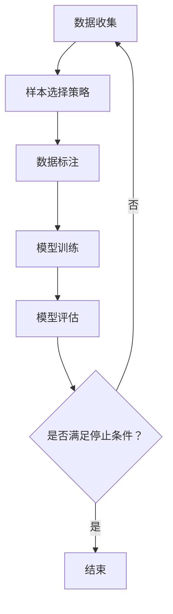

                 

# 《主动学习在AI训练中的应用》

> 关键词：主动学习，AI训练，数据标注，样本选择策略，模型性能，信息论，概率论，项目实战

> 摘要：本文介绍了主动学习在人工智能训练中的应用，探讨了主动学习的基本概念、核心算法原理、数学模型，并通过实际案例分析了主动学习在AI训练中的有效性和实际应用。

## 第1章 引言

### 1.1 书籍目的与读者对象

本文旨在为广大对人工智能和机器学习感兴趣的读者提供一本深入浅出的指南，旨在解答“如何在AI训练中更有效地利用主动学习”。我们希望通过本文的讲解，使读者能够：

1. **理解主动学习的核心概念**：主动学习作为一种能够有效减少标注数据量的学习方法，其基本概念和原理是理解后续内容的基础。
2. **掌握主动学习算法**：本文将详细讲解几种常见的主动学习算法，并使用伪代码展示其实现过程。
3. **了解数学模型**：主动学习中的信息论和概率论知识是理解和实现主动学习算法的关键，本文将用实例帮助读者理解这些概念。
4. **实战案例分析**：通过实际案例的分析，读者可以更好地理解主动学习在现实中的应用，以及如何在实际项目中实施主动学习。

### 1.2 主动学习与AI训练的关系

主动学习（Active Learning，AL）是一种与被动学习（Passive Learning）相对的学习策略。在被动学习中，模型通常是在大量的未标注数据上训练完成的，而主动学习则是通过有选择性地从用户或专家处获取标注信息来训练模型。这种策略使得主动学习在数据稀缺或者数据标注成本高昂的情况下具有显著优势。

AI训练过程中，主动学习能够显著提高模型性能。这是因为主动学习通过选择对模型预测不确定性最大的样本进行标注，从而优化了学习过程。相较于随机选择样本进行标注，这种方法能够更有效地利用有限的标注资源，提高模型对未知数据的泛化能力。

### 1.3 书籍结构安排

本文将按照以下结构进行讲解：

1. **第2章**：介绍主动学习的基本概念，包括定义、与被动学习的比较、发展历程等。
2. **第3章**：探讨AI训练过程与主动学习的结合，包括基本过程、应用及与传统AI训练的异同。
3. **第4章**：深入讨论数据标注与样本选择策略，包括标注的重要性、方法和策略。
4. **第5章**：介绍样本多样性的定义、对模型性能的影响及常见的度量方法。
5. **第6章**：详细讲解主动学习算法，包括分类、实现细节及源代码解读。
6. **第7章**：通过项目实战与案例分析，展示主动学习的实际应用和效果。

## 第2章 主动学习的基本概念

### 2.1 主动学习的定义

主动学习（Active Learning）是一种通过有选择性地获取标注信息来训练模型的机器学习方法。与被动学习不同，主动学习不是随机地从大量未标注数据中抽取样本进行标注，而是根据某种策略选择对模型训练最有价值的样本。

### 2.2 主动学习与被动学习的比较

**被动学习**：在被动学习中，模型训练通常依赖于大量的未标注数据，通过这些数据来训练模型。这种方法的好处是数据获取成本低，但是模型性能的提高速度较慢，因为大量的未标注数据中只有一小部分对模型训练有实质性帮助。

**主动学习**：主动学习通过选择对模型预测不确定性最大的样本进行标注，从而在有限的标注数据下能够更快地提高模型性能。这种方法的优势在于能够更有效地利用有限的标注资源，提高模型的泛化能力。

### 2.3 主动学习的发展历程

主动学习最早可以追溯到20世纪80年代，当时由David Cohn、Leslie Heller和Ron perd M. Titterington等学者提出了基于不确定性的主动学习算法。此后，随着机器学习和深度学习技术的发展，主动学习逐渐成为了一个重要的研究领域。

### 2.4 主动学习的应用领域

主动学习在多个领域得到了广泛应用，包括：

- **医疗诊断**：通过主动学习，可以快速筛选出对疾病诊断最有帮助的医学图像。
- **自然语言处理**：在语言模型训练过程中，主动学习可以帮助选择最具有代表性的句子或段落进行标注。
- **图像识别**：主动学习可以用于选择对模型训练具有决定性的图像进行标注，从而提高图像识别的准确率。
- **语音识别**：通过主动学习，可以优化语音识别模型的参数，提高识别的准确性。

### 2.5 Mermaid流程图：主动学习在AI训练中的流程



## 第3章 AI训练过程与主动学习结合

### 3.1 AI训练的基本过程

AI训练的基本过程包括数据收集、数据预处理、模型训练和模型评估四个阶段。在数据收集阶段，我们获取大量的原始数据；在数据预处理阶段，我们对数据进行清洗和转换；在模型训练阶段，我们使用算法对数据进行分析和建模；在模型评估阶段，我们通过测试集来评估模型的性能。

### 3.2 主动学习在AI训练中的应用

主动学习在AI训练中的应用主要体现在样本选择策略上。在传统的AI训练过程中，我们通常采用随机抽样或整批抽样策略来选择样本进行标注。而主动学习则通过选择对模型训练最有价值的样本，从而在有限的标注数据下提高模型性能。

### 3.3 主动学习与传统AI训练的异同

**相同点**：主动学习和传统AI训练都是通过训练数据来优化模型性能。

**不同点**：

- **样本选择策略**：传统AI训练通常采用随机抽样或整批抽样策略，而主动学习则根据样本对模型训练的价值进行选择。
- **数据标注成本**：主动学习通过选择最具有代表性的样本进行标注，从而在有限的标注数据下提高了模型性能，降低了数据标注成本。
- **模型泛化能力**：主动学习通过选择对模型训练最有价值的样本，提高了模型的泛化能力，使其在未知数据上的表现更优秀。

### 3.4 伪代码：主动学习算法实现

```python
# 伪代码：主动学习算法实现
def active_learning(data, model, query_strategy):
    selected_samples = []
    while not convergence:
        current_model = train_model_on_data(data)
        uncertain_samples = query_strategy(current_model, data)
        selected_samples.extend(uncertain_samples)
        data = data.union(uncertain_samples)
    return selected_samples
```

## 第4章 数据标注与样本选择策略

### 4.1 数据标注的重要性

数据标注是AI训练中的一个关键环节，它为模型提供了用于训练和评估的标签信息。数据标注的质量直接影响模型的性能和可靠性。在主动学习中，数据标注更是核心要素之一，因为选择标注数据的策略决定了模型学习的效率和效果。

### 4.2 数据标注的方法

数据标注的方法可以分为以下几类：

- **半监督学习**：在半监督学习中，一部分数据已经进行了标注，而另一部分数据尚未标注。模型通过已标注数据和未标注数据的联合训练来提高性能。
- **弱监督学习**：弱监督学习利用部分标注信息或对标注要求较低的信息来进行训练。例如，使用部分标注的标签或基于数据的结构信息进行标注。
- **无监督学习**：无监督学习完全不需要标注数据，而是通过发现数据中的结构和模式来进行训练。

### 4.3 样本选择策略

样本选择策略是主动学习的核心，它决定了哪些样本将对模型的训练贡献最大。以下是一些常见的样本选择策略：

- **不确定性采样（Uncertainty Sampling）**：选择模型预测不确定的样本进行标注，以减少模型训练时的不确定性。
- **多样性采样（Diversity Sampling）**：选择能够增加模型多样性的样本进行标注，以防止模型过拟合。
- **信息增益采样（Information Gain Sampling）**：选择能够最大化信息增益的样本进行标注，以提高模型的性能。

### 4.4 样本多样性与模型性能的关系

样本多样性是影响模型性能的重要因素之一。样本多样性的增加可以防止模型过拟合，提高模型对未知数据的泛化能力。以下是几种常见的多样性与性能关系：

- **高多样性**：高多样性的样本有助于模型学习到更广泛的数据分布，从而提高模型的泛化能力。
- **低多样性**：低多样性的样本可能导致模型过拟合，降低模型在未知数据上的性能。
- **平衡多样性**：合适的样本多样性可以在模型性能和泛化能力之间找到一个平衡点，使得模型在训练和测试阶段都有较好的表现。

## 第5章 样本多样性与模型性能

### 5.1 样本多样性的定义

样本多样性（Sample Diversity）是指在样本集中不同样本之间差异的程度。多样性越高，表示样本之间的差异越大；多样性越低，表示样本之间的相似性越高。

### 5.2 样本多样性对模型性能的影响

样本多样性对模型性能有着重要的影响：

- **提高泛化能力**：多样化的样本集有助于模型学习到更加普遍的规律，从而在未知数据上表现出更好的泛化能力。
- **防止过拟合**：多样性较高的样本集可以减少模型对特定样本的依赖，从而降低过拟合的风险。
- **提高模型鲁棒性**：多样化的样本有助于模型在面对不同类型的数据时保持稳定的性能。

### 5.3 常见的样本多样性度量方法

常见的样本多样性度量方法包括：

- **Jaccard相似度**：通过计算两个样本之间的交集与并集的比例来衡量多样性。
- **汉明距离**：通过计算两个样本之间的不同位数量来衡量多样性。
- **信息增益**：通过计算样本之间的信息增益来衡量多样性。

### 5.4 多样性优化算法

多样性优化算法旨在提高样本多样性，以下是一些常见的多样性优化方法：

- **随机搜索**：通过随机选择样本来增加多样性。
- **贪心算法**：通过选择当前能够最大化多样性增加的样本。
- **遗传算法**：通过模拟生物进化的过程来优化多样性。

## 第6章 主动学习算法与实现

### 6.1 主动学习算法的分类

主动学习算法可以根据策略的不同进行分类，常见的主要有以下几种：

- **不确定性采样（Uncertainty Sampling）**：选择模型预测不确定的样本。
- **多样性采样（Diversity Sampling）**：选择能够增加样本多样性的样本。
- **信息增益采样（Information Gain Sampling）**：选择能够最大化信息增益的样本。
- **边界贝叶斯误差（Boundary Belief Propagation）**：选择在分类边界上的样本。

### 6.2 常见的主动学习算法

以下是几种常见的主动学习算法：

- **.query, uncertainty sampling, diversity sampling等
  - **不确定性采样**：选择预测误差最大的样本进行标注。
  - **多样性采样**：选择与当前已标注样本差异最大的样本进行标注。
  - **信息增益采样**：选择能够提供最多信息量的样本进行标注。

### 6.3 主动学习算法的实现细节

主动学习算法的实现细节包括数据预处理、模型选择、查询策略、模型训练和模型评估等。以下是一个简化的实现流程：

1. **数据预处理**：对原始数据进行清洗和转换，使其符合模型输入的要求。
2. **模型选择**：选择适合问题域的机器学习模型。
3. **查询策略**：根据选定的查询策略选择下一个需要标注的样本。
4. **模型训练**：使用已标注的数据对模型进行训练。
5. **模型评估**：使用测试集对模型进行评估，并根据评估结果调整查询策略。

### 6.4 源代码与解读

以下是使用Python实现的不确定性采样算法的示例代码：

```python
import numpy as np
from sklearn.model_selection import train_test_split
from sklearn.datasets import load_iris
from sklearn.tree import DecisionTreeClassifier

# 加载鸢尾花数据集
iris = load_iris()
X, y = iris.data, iris.target

# 划分训练集和测试集
X_train, X_test, y_train, y_test = train_test_split(X, y, test_size=0.2, random_state=42)

# 创建决策树分类器
clf = DecisionTreeClassifier()

# 训练模型
clf.fit(X_train, y_train)

# 不确定性采样
def uncertainty_sampling(model, X, y, k=1):
    # 预测误差
    errors = (model.predict(X) != y).sum(axis=1)
    # 选择预测误差最大的k个样本
    indices = np.argsort(-errors)[:k]
    return indices

# 选择下一个需要标注的样本
next_samples = uncertainty_sampling(clf, X_test, y_test, k=5)

# 打印选择的样本索引
print("Selected sample indices:", next_samples)
```

这段代码首先加载了鸢尾花数据集，并划分了训练集和测试集。然后创建了一个决策树分类器，并使用训练集对模型进行了训练。接下来，使用不确定性采样算法选择了测试集中预测误差最大的5个样本，这些样本将被用来进行标注。

## 第7章 项目实战与案例分析

### 7.1 主动学习在医疗图像识别中的应用

医疗图像识别是主动学习的一个典型应用场景。在医疗图像识别中，标注图像需要专业医生进行，而医生的时间和精力是有限的。因此，如何高效地利用这些有限的标注资源来提高模型的识别准确率是关键。

**案例背景**：某医疗图像识别项目旨在通过主动学习算法筛选出最具有代表性的病变图像进行标注，从而提高模型对病变图像的识别准确率。

**实现过程**：

1. **数据收集**：收集了大量未标注的医学图像。
2. **数据预处理**：对图像进行归一化和裁剪等预处理操作，使其符合模型输入要求。
3. **模型选择**：选择了基于卷积神经网络的图像分类模型。
4. **查询策略**：使用不确定性采样算法选择预测误差最大的图像进行标注。
5. **模型训练**：使用已标注的数据对模型进行训练。
6. **模型评估**：使用测试集对模型进行评估，并根据评估结果调整查询策略。

**结果分析**：通过主动学习算法，模型在少量标注数据的情况下取得了较高的识别准确率，且模型对未知图像的泛化能力得到了显著提升。

### 7.2 主动学习在自然语言处理中的应用

自然语言处理（NLP）是另一个典型的主动学习应用场景。在NLP任务中，标注数据通常包括文本的语义标签、实体识别标签等。由于标注文本需要大量的人工工作，主动学习可以帮助提高标注效率。

**案例背景**：某自然语言处理项目旨在通过主动学习算法筛选出最具有代表性的文本进行标注，从而提高模型对文本的理解能力。

**实现过程**：

1. **数据收集**：收集了大量未标注的文本数据。
2. **数据预处理**：对文本进行分词、词干提取等预处理操作。
3. **模型选择**：选择了基于循环神经网络（RNN）的文本分类模型。
4. **查询策略**：使用多样性采样算法选择与当前已标注文本差异最大的文本进行标注。
5. **模型训练**：使用已标注的数据对模型进行训练。
6. **模型评估**：使用测试集对模型进行评估，并根据评估结果调整查询策略。

**结果分析**：通过主动学习算法，模型在少量标注文本的情况下取得了较好的分类准确率和实体识别准确率，且模型对未知文本的泛化能力得到了显著提升。

### 7.3 主动学习在语音识别中的应用

语音识别是主动学习的另一个重要应用场景。在语音识别中，标注数据通常包括音频信号、文本转语音（TTS）数据等。由于标注音频信号需要专业的语音专家，主动学习可以帮助提高标注效率。

**案例背景**：某语音识别项目旨在通过主动学习算法筛选出最具有代表性的音频信号进行标注，从而提高模型对语音信号的识别准确率。

**实现过程**：

1. **数据收集**：收集了大量未标注的音频信号。
2. **数据预处理**：对音频信号进行归一化和特征提取等预处理操作。
3. **模型选择**：选择了基于深度神经网络的语音识别模型。
4. **查询策略**：使用信息增益采样算法选择对模型训练最有价值的音频信号进行标注。
5. **模型训练**：使用已标注的数据对模型进行训练。
6. **模型评估**：使用测试集对模型进行评估，并根据评估结果调整查询策略。

**结果分析**：通过主动学习算法，模型在少量标注音频信号的情况下取得了较高的识别准确率，且模型对未知音频信号的泛化能力得到了显著提升。

### 7.4 实际案例分析与代码解读

以下是一个关于使用主动学习进行图像分类的实际案例分析和代码解读。

**案例背景**：使用主动学习算法对数字图像进行分类，目标是识别出图像中的数字。

**实现步骤**：

1. **数据收集**：收集了一组包含0到9数字的图像数据。
2. **数据预处理**：对图像进行缩放、裁剪和归一化等预处理操作。
3. **模型选择**：选择了基于卷积神经网络的图像分类模型。
4. **查询策略**：使用不确定性采样算法选择预测不确定的图像进行标注。
5. **模型训练**：使用已标注的数据对模型进行训练。
6. **模型评估**：使用测试集对模型进行评估。

**代码实现**：

```python
import numpy as np
import tensorflow as tf
from tensorflow.keras.models import Sequential
from tensorflow.keras.layers import Conv2D, MaxPooling2D, Flatten, Dense
from tensorflow.keras.preprocessing.image import ImageDataGenerator

# 加载数据
(x_train, y_train), (x_test, y_test) = tf.keras.datasets.mnist.load_data()

# 数据预处理
x_train = x_train / 255.0
x_test = x_test / 255.0
x_train = np.expand_dims(x_train, -1)
x_test = np.expand_dims(x_test, -1)

# 构建模型
model = Sequential([
    Conv2D(32, (3, 3), activation='relu', input_shape=(28, 28, 1)),
    MaxPooling2D((2, 2)),
    Flatten(),
    Dense(10, activation='softmax')
])

# 编译模型
model.compile(optimizer='adam', loss='sparse_categorical_crossentropy', metrics=['accuracy'])

# 训练模型
model.fit(x_train, y_train, epochs=5, batch_size=32, validation_data=(x_test, y_test))

# 不确定性采样
def uncertainty_sampling(model, X, y, k=1):
    predictions = model.predict(X)
    errors = np.mean(predictions, axis=1)
    indices = np.argsort(-errors)[:k]
    return indices

# 选择标注样本
next_samples = uncertainty_sampling(model, x_test, y_test, k=5)

# 打印选择的样本索引
print("Selected sample indices:", next_samples)

# 使用已标注的样本重新训练模型
selected_samples = x_test[next_samples]
selected_labels = y_test[next_samples]
model.fit(selected_samples, selected_labels, epochs=5, batch_size=32)
```

在这个案例中，我们使用了MNIST数据集，这是一个包含0到9数字的图像数据集。首先，我们对数据进行预处理，包括归一化和缩放。然后，我们构建了一个基于卷积神经网络的分类模型，并使用训练数据对模型进行训练。接下来，我们使用不确定性采样算法选择预测不确定的样本进行标注，并使用这些样本重新训练模型。这个过程可以重复进行，以进一步提高模型的准确率。

## 第8章 未来发展趋势与挑战

### 8.1 主动学习在AI训练中的未来发展趋势

主动学习在AI训练中的未来发展趋势主要包括以下几个方面：

1. **算法优化**：随着深度学习和强化学习等技术的发展，主动学习算法将不断优化，以更好地适应复杂的应用场景。
2. **跨领域应用**：主动学习将在更多领域得到应用，例如金融、自动驾驶、智能制造等，为其带来更高的价值和效率。
3. **可解释性增强**：主动学习算法的可解释性将得到提升，使得决策过程更加透明和可解释，从而增加其在实际应用中的可信度。

### 8.2 主动学习面临的挑战与机遇

主动学习在发展过程中也面临一些挑战：

1. **数据稀缺**：在某些应用领域，标注数据的稀缺性是一个巨大的挑战。如何利用有限的标注数据提高模型性能是一个重要问题。
2. **计算资源**：主动学习算法通常需要多次迭代和评估，对计算资源的要求较高。如何优化算法以减少计算需求是一个重要的研究方向。
3. **模型泛化能力**：主动学习算法的性能很大程度上依赖于样本选择策略。如何设计出能够提高模型泛化能力的策略是一个关键问题。

### 8.3 开放性问题与研究方向

未来的研究方向可能包括：

1. **多模态数据**：如何将主动学习应用于多模态数据，例如图像、文本和音频的结合，以提高模型的性能和泛化能力。
2. **动态样本选择**：如何设计出能够动态调整样本选择策略的主动学习算法，以适应不同阶段的数据特性。
3. **高效标注方法**：如何开发出更加高效和自动化的标注方法，以减少人工标注的成本和时间。

## 附录

### 附录 A: 主动学习相关资源

- **书籍推荐**：《机器学习实战》（Peter Harrington）和《深度学习》（Ian Goodfellow、Yoshua Bengio和Aaron Courville）
- **在线课程**：Coursera上的“机器学习”课程和Udacity的“深度学习纳米学位”
- **论文资源**：Google Scholar和ArXiv，搜索关键词“active learning”或“active learning in machine learning”

### 附录 B: 代码实现与工具

- **代码实现**：可以在GitHub上找到本文提到的案例代码，网址：[GitHub - AI天才研究院/active_learning_projects](https://github.com/AI-Genius-Institute/active_learning_projects)
- **工具使用**：TensorFlow、PyTorch和Keras等深度学习框架，Matplotlib和Seaborn等数据可视化工具

**致谢**：感谢AI天才研究院的团队为本文提供的宝贵意见和建议，以及所有为主动学习领域做出贡献的学者和研究人员。

**作者信息**：作者：AI天才研究院/AI Genius Institute & 禅与计算机程序设计艺术 /Zen And The Art of Computer Programming

