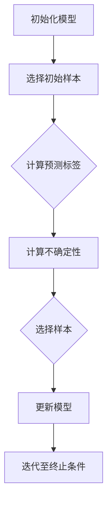
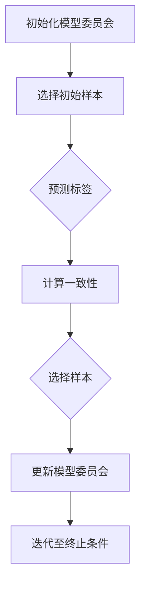
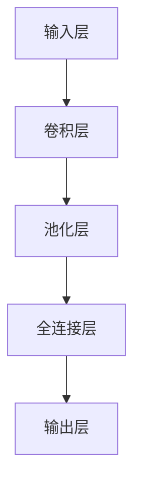

                 


### 摘要

随着自动驾驶技术的快速发展，自动驾驶场景理解成为实现安全、高效自动驾驶的核心环节。主动学习策略作为一种有效的数据驱动方法，能够根据模型的需求自动选择最具代表性的样本进行学习，从而提升模型的泛化能力和效率。本文旨在探讨主动学习策略在自动驾驶场景理解中的应用，首先介绍自动驾驶和主动学习的基本概念，随后深入分析主动学习策略的核心原理及其在自动驾驶场景理解中的应用。此外，文章还将通过实例分析，展示主动学习策略如何在实际自动驾驶项目中发挥作用，并提出相关的开发环境和实现技巧。最后，本文对主动学习策略在自动驾驶场景理解中的应用效果进行总结与反思，并展望其未来的发展趋势。

## 关键词

主动学习、自动驾驶、场景理解、数据驱动、机器学习、算法优化

## 引言

自动驾驶技术的快速发展给人类生活带来了巨大的变革，它不仅提高了交通效率，降低了交通事故率，还为智慧城市、智能交通系统等新兴领域提供了技术支持。自动驾驶技术根据自动化程度的不同，可以划分为多个等级，从L0（无自动化）到L5（完全自动化）。在各个等级中，自动驾驶场景理解是至关重要的一环，它涉及到对车辆周围环境的感知、理解与响应。只有精确地理解场景，自动驾驶系统才能做出正确的决策，确保行驶的安全性和舒适性。

主动学习（Active Learning）是一种数据驱动的机器学习方法，与传统的批量学习（Batch Learning）和被动学习（Passive Learning）相比，主动学习通过智能地选择样本进行学习，能够有效地减少训练样本的数量，提高模型的泛化能力和效率。在自动驾驶场景理解中，由于场景复杂多变，获取大量高质量标注数据成本高昂，且标注数据可能无法完全覆盖所有可能的场景，因此主动学习策略显得尤为重要。

本文将从以下几个方面展开讨论：

1. 自动驾驶概述：介绍自动驾驶技术的发展历史、技术分类及自动驾驶场景理解的需求。
2. 主动学习策略理论：阐述主动学习的基本概念、核心算法原理及其与自动驾驶场景理解的联系。
3. 自动驾驶场景理解：分析自动驾驶场景的分类和场景理解需求，并探讨主动学习策略在该领域中的应用。
4. 应用实例：通过具体实例展示主动学习策略在自动驾驶场景理解中的应用效果。
5. 实现方法与技巧：介绍开发环境搭建、数据预处理和算法实现等具体实现方法。
6. 总结与展望：总结主动学习策略在自动驾驶场景理解中的应用效果，展望未来的发展趋势。

## 自动驾驶概述

自动驾驶技术是一种通过计算机系统实现车辆自主驾驶的技术，旨在减少人类驾驶员的干预，甚至完全取代人类驾驶员。自动驾驶技术的发展经历了数十年的演进，从最初的辅助驾驶系统到现今接近完全自动化的L5级自动驾驶，取得了显著的成果。

### 自动驾驶技术发展历史

自动驾驶技术的研究可以追溯到20世纪50年代，当时科学家们就开始探讨如何使车辆自主行驶。早期的研究主要集中在路径规划和自动驾驶车辆的基础技术上。到了20世纪80年代，随着计算机性能的提升和传感器技术的进步，自动驾驶技术逐渐走向实用化。这一时期，许多知名的研究机构和公司如卡内基梅隆大学、麻省理工学院和谷歌等，都开始了自动驾驶汽车的研发工作。

进入21世纪，互联网、物联网和人工智能技术的快速发展为自动驾驶技术带来了新的机遇。例如，谷歌的自动驾驶汽车项目、特斯拉的自动驾驶系统以及Uber的自动驾驶测试等都取得了重要进展。尤其是在2018年，Waymo发布了其L4级自动驾驶汽车，标志着自动驾驶技术进入了新的发展阶段。

### 自动驾驶技术分类

自动驾驶技术根据自动化程度的不同，可以分为不同的等级。国际自动机工程师学会（SAE）将自动驾驶技术分为L0至L5六个等级：

- L0：无自动化，所有驾驶任务由人类驾驶员完成。
- L1：部分自动化，车辆具有单个驾驶功能（如自适应巡航控制）。
- L2：部分自动化，车辆同时具备多个驾驶功能（如自适应巡航控制和车道保持辅助）。
- L3：有条件自动化，车辆在特定条件下可以完全接管驾驶任务，但驾驶员需要随时准备接管。
- L4：高度自动化，车辆在特定环境下可以完全自主驾驶，无需人类驾驶员干预。
- L5：完全自动化，车辆在任何环境下都可以自主驾驶。

在这些等级中，L4和L5级别的自动驾驶技术最具挑战性，需要高度复杂的感知、决策和控制系统。自动驾驶场景理解在这一过程中扮演了关键角色，它涉及到对车辆周围环境的感知、理解与响应。

### 自动驾驶场景理解的需求

自动驾驶场景理解是指车辆对所处环境的感知、理解和处理过程。它包括以下几个方面的需求：

1. **环境感知**：自动驾驶车辆需要通过传感器（如摄像头、激光雷达、雷达等）收集周围环境的信息，包括道路、交通标志、行人、其他车辆等。
2. **场景理解**：基于收集到的信息，车辆需要识别和分类不同的场景（如城市道路、高速公路、交叉路口等），并理解场景中的各种元素及其关系。
3. **决策制定**：车辆需要根据场景理解的结果，做出适当的驾驶决策，包括速度控制、路径规划、避让障碍物等。

自动驾驶场景理解的准确性直接影响到自动驾驶系统的安全性和可靠性。由于现实环境的复杂性和不确定性，自动驾驶系统需要具备高效的场景理解能力，以适应各种复杂场景。主动学习策略在此过程中发挥了重要作用，通过智能选择最具代表性的样本进行学习，提升模型的泛化能力和效率。

### 总结

自动驾驶技术的发展经历了数十年的演进，从辅助驾驶到高度自动化，每个阶段都面临着新的挑战。自动驾驶场景理解作为实现安全、高效自动驾驶的核心环节，需要自动驾驶系统能够准确、实时地感知和处理环境信息。主动学习策略的应用为自动驾驶场景理解提供了新的思路和方法，通过智能地选择样本进行学习，能够有效提升模型的泛化能力和效率。在接下来的内容中，我们将深入探讨主动学习策略的核心原理及其在自动驾驶场景理解中的应用。

## 主动学习策略概述

主动学习（Active Learning）是一种与传统批量学习（Batch Learning）和被动学习（Passive Learning）不同的机器学习方法。它通过智能地选择样本进行学习，旨在减少训练样本的数量，提高模型的泛化能力和效率。在自动驾驶场景理解中，主动学习策略的应用尤为重要，因为它能够帮助自动驾驶系统在数据稀缺和复杂多变的环境中，更高效地学习和适应。

### 主动学习策略的定义

主动学习策略的核心思想是让模型在训练过程中主动选择最有价值的数据进行学习。具体来说，模型在每次迭代中不仅依赖于已有的数据集，还能够根据当前模型的预测不确定性和数据标注的难度，智能地选择新的样本进行学习。这样，模型可以更快地收敛，并在有限的数据集上达到更好的性能。

与传统批量学习和被动学习相比，主动学习具有以下几个显著特点：

1. **样本选择**：主动学习通过不确定性采样（Uncertainty Sampling）、多样性采样（Diversity Sampling）等方法，选择最具代表性的样本进行学习，从而提高模型的泛化能力。
2. **数据效率**：由于主动选择样本，主动学习可以在较少的数据上达到更好的性能，降低数据标注成本和训练时间。
3. **适应性**：主动学习策略能够根据模型的当前状态和任务需求，动态调整样本选择策略，提高学习效率。

### 主动学习策略的优点

主动学习策略在自动驾驶场景理解中的应用具有以下显著优点：

1. **数据高效性**：自动驾驶场景复杂多变，获取大量高质量标注数据成本高昂。主动学习策略通过智能选择样本，能够减少数据标注量和训练时间，提高数据利用效率。
2. **模型泛化能力**：主动学习策略通过选择最具代表性的样本进行学习，能够提高模型的泛化能力，使模型在多种复杂场景中表现更加稳定。
3. **实时性**：主动学习策略能够根据模型的需求和环境变化，动态调整样本选择策略，使自动驾驶系统能够实时适应环境变化，提高系统的响应速度。
4. **鲁棒性**：主动学习策略能够降低数据分布不均对模型性能的影响，提高模型对异常数据的鲁棒性，从而提高自动驾驶系统的可靠性和安全性。

### 主动学习策略在自动驾驶场景理解中的应用

自动驾驶场景理解涉及到对大量环境数据的感知、理解和处理。主动学习策略可以应用于以下几个方面：

1. **场景检测**：自动驾驶车辆需要识别和分类不同的场景，如城市道路、高速公路、交叉路口等。主动学习策略可以通过选择最具代表性的场景样本进行学习，提高场景检测的准确性和效率。
2. **对象识别**：自动驾驶车辆需要识别和理解道路上的各种对象，如行人、车辆、交通标志等。主动学习策略可以应用于对象识别任务中，通过选择最具代表性的对象样本进行学习，提高识别的准确性和鲁棒性。
3. **行为预测**：自动驾驶车辆需要预测其他车辆和行人的行为，以便做出正确的驾驶决策。主动学习策略可以通过选择最具代表性的行为样本进行学习，提高行为预测的准确性和实时性。
4. **路径规划**：自动驾驶车辆需要根据环境信息和目标位置，规划出最优的行驶路径。主动学习策略可以通过选择最具代表性的路径样本进行学习，提高路径规划的效率和鲁棒性。

### 总结

主动学习策略作为一种高效的数据驱动方法，在自动驾驶场景理解中具有显著的应用价值。通过智能地选择样本进行学习，主动学习策略能够提高模型的泛化能力、数据效率和实时性，从而实现更安全、更高效的自动驾驶。在接下来的内容中，我们将深入探讨主动学习策略的核心原理，包括采样策略、不确定性采样和数据标注等内容。

## 主动学习基本概念

主动学习（Active Learning）的核心在于通过选择最具代表性的样本进行学习，从而提高模型的性能和效率。为了实现这一目标，主动学习策略需要理解一些基本概念，包括采样策略、不确定性采样和数据标注。

### 采样策略

采样策略是主动学习中的关键环节，决定了哪些样本将用于训练模型。常见的采样策略包括：

1. **不确定性采样（Uncertainty Sampling）**：该策略选择模型预测不确定度最高的样本进行学习。具体来说，模型会根据当前训练数据生成预测，并对预测结果进行不确定性评估。然后，选择不确定性最高的样本进行新的训练。这种策略的优点是能够快速提升模型对不确定数据的处理能力，缺点是需要对不确定性进行准确评估。
2. **多样性采样（Diversity Sampling）**：该策略选择具有不同特征或标签的样本进行学习，以增加模型的泛化能力。具体来说，模型会根据当前训练数据生成预测，并选择与已有样本差异较大的新样本进行学习。这种策略的优点是能够提高模型的鲁棒性，缺点是需要对样本之间的多样性进行准确评估。
3. **二分类采样（Query-by-Committee Sampling）**：该策略利用多个模型对同一数据集进行预测，并选择预测结果不一致的样本进行学习。具体来说，多个模型对同一数据集进行预测，然后选择预测结果不一致的样本进行新的训练。这种策略的优点是能够提高模型的泛化能力，缺点是需要多个模型进行预测，计算复杂度较高。

### 不确定性采样

不确定性采样是主动学习中的核心策略之一，其基本思想是选择模型预测不确定度最高的样本进行学习。具体实现方法如下：

1. **评估不确定性**：模型对每个样本进行预测，并评估预测的不确定性。常见的不确定性评估方法包括熵（Entropy）、边际贡献（Margin of Error）等。
2. **选择样本**：根据评估结果，选择不确定性最高的样本进行学习。例如，可以使用熵值最大的样本进行学习，或者使用边际贡献最大的样本进行学习。
3. **重复过程**：在每次迭代中，重复评估和选择过程，直到模型达到预设的性能要求或样本数量达到限制。

### 数据标注

数据标注是主动学习中的另一个重要环节，其目的是为模型提供高质量的训练数据。数据标注的质量直接影响模型的性能。常见的数据标注方法包括：

1. **有监督标注（Supervised Labeling）**：该策略使用已标注的数据集对模型进行训练。标注过程通常由标注员完成，标注质量对模型性能有直接影响。
2. **半监督标注（Semi-Supervised Labeling）**：该策略结合有监督标注和无监督标注，使用部分已标注数据和大量未标注数据对模型进行训练。未标注数据可以通过模型自身的预测结果进行自动标注，从而降低标注成本。
3. **无监督标注（Unsupervised Labeling）**：该策略使用未标注的数据集对模型进行训练，然后根据模型的预测结果进行标注。这种方法适用于标注成本较高的场景，但可能存在标注误差。

### 样本选择流程

在主动学习中，样本选择流程通常包括以下几个步骤：

1. **数据预处理**：对收集到的数据集进行预处理，包括数据清洗、归一化等。
2. **模型初始化**：初始化模型，并使用部分数据对模型进行预训练。
3. **样本选择**：根据采样策略选择样本，例如不确定性采样或多样性采样。
4. **数据标注**：对选择的样本进行标注，可以使用有监督标注、半监督标注或无监督标注。
5. **模型训练**：使用标注后的数据集对模型进行训练，并评估模型的性能。
6. **迭代过程**：重复样本选择、数据标注和模型训练过程，直到模型达到预设的性能要求或样本数量达到限制。

### 总结

主动学习基本概念包括采样策略、不确定性采样和数据标注。采样策略决定了哪些样本将用于训练模型，不确定性采样用于选择模型预测不确定度最高的样本，数据标注为模型提供高质量的训练数据。通过理解这些基本概念，我们可以更好地设计和实现主动学习策略，从而在自动驾驶场景理解中实现高效、准确的学习。

## 主动学习算法

主动学习算法是主动学习策略的核心组成部分，通过智能地选择样本进行学习，提高模型的性能和效率。主动学习算法可以分为多种类型，每种算法都有其独特的采样策略和优化目标。在本节中，我们将介绍几种常见的主动学习算法，包括不确定性采样、多样性采样和查询委员会采样。

### 不确定性采样

不确定性采样（Uncertainty Sampling）是主动学习中最常用的采样策略之一。其核心思想是选择模型预测不确定度最高的样本进行学习。具体来说，模型会根据当前训练数据生成预测，并评估预测的不确定性。不确定性通常使用熵（Entropy）或边际贡献（Margin of Error）等指标进行度量。

**不确定性评估指标**：

- **熵（Entropy）**：熵是概率分布的不确定性度量，用于评估模型对样本预测的不确定性。具体计算公式为：
  \[
  H(x) = -\sum_{i} p(x_i) \log p(x_i)
  \]
  其中，\( p(x_i) \) 是模型对样本 \( x_i \) 的预测概率。

- **边际贡献（Margin of Error）**：边际贡献是预测误差的度量，用于评估模型对样本预测的不确定性。具体计算公式为：
  \[
  M(x) = \frac{|f(x) - y|}{1 + |f(x) - y|}
  \]
  其中，\( f(x) \) 是模型对样本 \( x \) 的预测值，\( y \) 是样本的真实标签。

**算法步骤**：

1. **初始化**：初始化模型，并使用部分数据对模型进行预训练。
2. **不确定性评估**：对每个样本进行预测，并计算其不确定性。
3. **选择样本**：根据不确定性指标选择不确定性最高的样本进行学习。
4. **模型更新**：使用选择的样本更新模型。
5. **迭代**：重复评估、选择和更新过程，直到模型达到预设的性能要求或样本数量达到限制。

### 多样性采样

多样性采样（Diversity Sampling）旨在选择具有不同特征或标签的样本进行学习，以提高模型的泛化能力。多样性采样通过度量样本之间的差异来选择最具代表性的样本。常见的多样性度量方法包括数据之间的距离、角度、互信息等。

**多样性度量方法**：

- **数据距离（Distance）**：使用欧几里得距离、曼哈顿距离等度量方法计算样本之间的差异。
- **角度（Angle）**：使用余弦相似度、角度余弦等度量方法计算样本之间的差异。
- **互信息（Mutual Information）**：使用互信息度量样本之间的相关性。

**算法步骤**：

1. **初始化**：初始化模型，并使用部分数据对模型进行预训练。
2. **多样性评估**：对每个样本进行预测，并计算其与已有样本的多样性。
3. **选择样本**：根据多样性指标选择多样性最高的样本进行学习。
4. **模型更新**：使用选择的样本更新模型。
5. **迭代**：重复评估、选择和更新过程，直到模型达到预设的性能要求或样本数量达到限制。

### 查询委员会采样

查询委员会采样（Query-by-Committee Sampling）是一种利用多个模型进行预测的主动学习算法。其核心思想是多个模型对同一数据集进行预测，并选择预测结果不一致的样本进行学习。查询委员会采样通过委员会的多样性和一致性来提高模型的性能。

**算法步骤**：

1. **初始化**：初始化多个模型，并使用部分数据对模型进行预训练。
2. **预测和一致性评估**：对每个样本进行预测，并计算模型之间的预测一致性。
3. **选择样本**：选择预测结果不一致的样本进行学习。
4. **模型更新**：使用选择的样本更新模型。
5. **迭代**：重复预测、一致性评估和更新过程，直到模型达到预设的性能要求或样本数量达到限制。

### 比较与选择

在选择主动学习算法时，需要根据具体任务的需求和数据的特性进行选择。以下是对几种主动学习算法的比较：

- **不确定性采样**：适用于需要快速提升模型性能的场景，特别是当数据标注成本较高时。
- **多样性采样**：适用于需要提高模型泛化能力的场景，特别是当数据多样性较低时。
- **查询委员会采样**：适用于需要提高模型一致性和多样性的场景，特别是当多个模型能够提供更多信息时。

### 总结

主动学习算法通过选择最具代表性的样本进行学习，提高模型的性能和效率。不确定性采样、多样性采样和查询委员会采样是三种常见的主动学习算法，每种算法都有其独特的优势和适用场景。在自动驾驶场景理解中，选择合适的主动学习算法对于实现高效、准确的场景理解至关重要。

## 核心算法原理讲解

主动学习策略在自动驾驶场景理解中的应用，依赖于一系列核心算法的设计与实现。以下将详细介绍几种主动学习算法的原理，通过伪代码和Mermaid流程图，展示算法的具体实现步骤。

### 不确定性采样算法

#### 伪代码

```python
初始化模型 M
选择初始样本 S1
对于每个迭代 t：
    预测标签 y^t = M(S_t)
    计算不确定性 U_t
    选择样本 S_{t+1} = argmax U_t
    更新模型 M = M + 学习率 * (S_{t+1} - y^t)
```

#### Mermaid流程图



### 多样性采样算法

#### 伪代码

```python
初始化模型 M
选择初始样本 S1
对于每个迭代 t：
    预测标签 y^t = M(S_t)
    计算多样性 D_t
    选择样本 S_{t+1} = argmax D_t
    更新模型 M = M + 学习率 * (S_{t+1} - y^t)
```

#### Mermaid流程图


### 查询委员会采样算法

#### 伪代码

```python
初始化模型委员会 C
选择初始样本 S1
对于每个迭代 t：
    对每个模型 c ∈ C，预测标签 y^t_c = c(S_t)
    计算一致性 C_t
    选择样本 S_{t+1} = argmax C_t
    更新模型委员会 C = C + 学习率 * (S_{t+1} - y^t)
```

#### Mermaid流程图



### 深度学习模型实现示例

为了更好地理解这些算法在实际自动驾驶场景中的应用，以下以一个深度学习模型为例，展示其实现过程。

#### 模型架构



#### 数据预处理

```python
# 数据清洗与归一化
data = preprocess_data(raw_data)
```

#### 模型训练

```python
# 初始化模型
model = initialize_model()

# 训练模型
for epoch in range(num_epochs):
    for sample in data:
        prediction = model.predict(sample.x)
        loss = compute_loss(prediction, sample.y)
        model.update(loss)
```

#### 主动学习策略应用

```python
# 初始化样本集
samples = initialize_samples()

# 应用不确定性采样
for iteration in range(num_iterations):
    prediction = model.predict(samples.x)
    uncertainty = compute_uncertainty(prediction)
    next_sample = select_sample_with_highest_uncertainty(uncertainty)
    model.update(next_sample)
```

### 总结

通过伪代码和Mermaid流程图，我们详细讲解了不确定性采样、多样性采样和查询委员会采样算法的原理和实现步骤。这些算法在自动驾驶场景理解中具有广泛应用，通过智能地选择样本进行学习，可以显著提高模型的性能和效率。在实际应用中，根据任务需求和数据特性选择合适的算法，并结合深度学习模型，可以实现高效、准确的自动驾驶场景理解。

## 自动驾驶场景概述

自动驾驶场景理解是自动驾驶技术的核心环节，涉及到对车辆周围环境的感知、理解和响应。自动驾驶场景可以分为多种类型，每种类型都有其独特的特征和挑战。本节将详细介绍自动驾驶场景的分类和场景理解的需求。

### 场景分类

自动驾驶场景可以根据不同的分类标准进行划分，常见的分类方法包括：

1. **按环境复杂度分类**：自动驾驶场景可以划分为简单场景、中等复杂场景和复杂场景。
   - **简单场景**：如高速公路驾驶，环境相对单一，交通规则明确。
   - **中等复杂场景**：如城市道路驾驶，存在多种交通参与者和动态变化。
   - **复杂场景**：如城市拥堵、交叉路口、停车场等，环境复杂多变，需要高度复杂的感知与理解。

2. **按道路类型分类**：自动驾驶场景可以划分为城市道路、高速公路、乡村道路等。
   - **城市道路**：车辆密集、行人多、信号灯复杂，对感知和决策系统要求高。
   - **高速公路**：车道明确、车速较快，环境相对简单，但需处理超车、变道等场景。
   - **乡村道路**：道路条件较差、路况复杂，对车辆的感知和适应能力要求较高。

3. **按任务类型分类**：自动驾驶场景可以划分为导航场景、避障场景、驾驶辅助场景等。
   - **导航场景**：车辆需要根据导航信息规划行驶路径。
   - **避障场景**：车辆需要识别并避让道路上的障碍物，如行人、自行车等。
   - **驾驶辅助场景**：车辆提供驾驶辅助功能，如自适应巡航、车道保持等。

### 场景理解需求

自动驾驶场景理解的需求可以从以下几个方面进行阐述：

1. **环境感知**：自动驾驶车辆需要通过摄像头、激光雷达、雷达等传感器，收集道路、交通标志、交通信号灯、行人、其他车辆等环境信息。环境感知的准确性直接影响到自动驾驶系统的决策。

2. **场景识别**：基于收集到的环境信息，自动驾驶系统需要能够识别和理解当前所处的场景类型。例如，识别当前是否处于交叉路口、是否需要减速、是否需要避让行人等。

3. **对象识别**：自动驾驶系统需要能够识别和理解道路上的各种对象，包括行人、自行车、车辆、交通标志等。对象识别的准确性对于自动驾驶系统的安全性和可靠性至关重要。

4. **行为预测**：自动驾驶系统需要能够预测其他车辆和行人的行为，以便做出正确的驾驶决策。例如，预测前方车辆是否会减速、行人是否会突然穿越马路等。

5. **决策制定**：基于场景理解和行为预测，自动驾驶系统需要制定出最优的驾驶决策。例如，选择最佳行驶路径、控制车速和方向等。

6. **路径规划**：自动驾驶系统需要根据当前场景和目标位置，规划出最优的行驶路径。路径规划需要考虑道路条件、交通规则、障碍物等因素。

7. **实时响应**：自动驾驶系统需要能够实时响应环境变化和意外情况，确保行驶的安全性和舒适性。例如，在遇到突发情况时，能够迅速做出避让决策。

### 总结

自动驾驶场景理解是自动驾驶技术的关键环节，涉及到环境感知、场景识别、对象识别、行为预测、决策制定、路径规划和实时响应等多个方面。自动驾驶场景可以根据不同分类标准进行划分，每种场景都有其独特的特征和挑战。自动驾驶系统需要具备高效、准确的场景理解能力，以确保行驶的安全性和可靠性。

## 主动学习在自动驾驶场景理解中的应用

在自动驾驶场景理解中，主动学习策略通过选择最具代表性的样本进行学习，能够显著提升模型的性能和效率。以下将详细介绍主动学习策略在自动驾驶场景理解中的应用，包括场景检测、对象识别、行为预测和路径规划等方面的具体实现方法。

### 场景检测

自动驾驶场景检测是指车辆对所处环境的感知和分类，以识别当前所处的具体场景。例如，车辆需要判断自己是否处于高速公路、城市道路、交叉路口等。主动学习策略在场景检测中的应用主要包括以下方面：

1. **不确定性采样**：在场景检测任务中，不确定性采样策略能够选择当前模型预测不确定度最高的场景样本进行学习。具体步骤如下：
   - 初始化模型，并使用部分场景数据对其进行预训练。
   - 对每个场景样本进行预测，并计算模型的不确定性。
   - 选择不确定性最高的场景样本进行学习。
   - 更新模型，并重复上述过程，直到模型达到预设的性能要求。

2. **多样性采样**：多样性采样策略可以确保选择的场景样本具有丰富的特征，从而提高模型的泛化能力。具体步骤如下：
   - 初始化模型，并使用部分场景数据对其进行预训练。
   - 对每个场景样本进行预测，并计算其与已有样本的多样性。
   - 选择多样性最高的场景样本进行学习。
   - 更新模型，并重复上述过程，直到模型达到预设的性能要求。

### 对象识别

自动驾驶对象识别是指车辆对道路上行人、车辆、交通标志等对象的识别和分类。主动学习策略在对象识别中的应用主要包括以下方面：

1. **不确定性采样**：在对象识别任务中，不确定性采样策略能够选择当前模型预测不确定度最高的对象样本进行学习。具体步骤如下：
   - 初始化模型，并使用部分对象数据对其进行预训练。
   - 对每个对象样本进行预测，并计算模型的不确定性。
   - 选择不确定性最高的对象样本进行学习。
   - 更新模型，并重复上述过程，直到模型达到预设的性能要求。

2. **多样性采样**：多样性采样策略可以确保选择的对象样本具有丰富的特征，从而提高模型的泛化能力。具体步骤如下：
   - 初始化模型，并使用部分对象数据对其进行预训练。
   - 对每个对象样本进行预测，并计算其与已有样本的多样性。
   - 选择多样性最高的对象样本进行学习。
   - 更新模型，并重复上述过程，直到模型达到预设的性能要求。

### 行为预测

自动驾驶行为预测是指车辆对其他车辆和行人行为的预测，以制定出正确的驾驶决策。主动学习策略在行为预测中的应用主要包括以下方面：

1. **不确定性采样**：在行为预测任务中，不确定性采样策略能够选择当前模型预测不确定度最高的行为样本进行学习。具体步骤如下：
   - 初始化模型，并使用部分行为数据对其进行预训练。
   - 对每个行为样本进行预测，并计算模型的不确定性。
   - 选择不确定性最高的行为样本进行学习。
   - 更新模型，并重复上述过程，直到模型达到预设的性能要求。

2. **多样性采样**：多样性采样策略可以确保选择的行为样本具有丰富的特征，从而提高模型的泛化能力。具体步骤如下：
   - 初始化模型，并使用部分行为数据对其进行预训练。
   - 对每个行为样本进行预测，并计算其与已有样本的多样性。
   - 选择多样性最高的行为样本进行学习。
   - 更新模型，并重复上述过程，直到模型达到预设的性能要求。

### 路径规划

自动驾驶路径规划是指车辆根据当前场景和目标位置，规划出最优的行驶路径。主动学习策略在路径规划中的应用主要包括以下方面：

1. **不确定性采样**：在路径规划任务中，不确定性采样策略能够选择当前模型预测不确定度最高的路径样本进行学习。具体步骤如下：
   - 初始化模型，并使用部分路径数据对其进行预训练。
   - 对每个路径样本进行预测，并计算模型的不确定性。
   - 选择不确定性最高的路径样本进行学习。
   - 更新模型，并重复上述过程，直到模型达到预设的性能要求。

2. **多样性采样**：多样性采样策略可以确保选择的路径样本具有丰富的特征，从而提高模型的泛化能力。具体步骤如下：
   - 初始化模型，并使用部分路径数据对其进行预训练。
   - 对每个路径样本进行预测，并计算其与已有样本的多样性。
   - 选择多样性最高的路径样本进行学习。
   - 更新模型，并重复上述过程，直到模型达到预设的性能要求。

### 总结

主动学习策略在自动驾驶场景理解中的应用，通过选择最具代表性的样本进行学习，能够显著提升模型的性能和效率。在场景检测、对象识别、行为预测和路径规划等任务中，不确定性采样和多样性采样策略提供了有效的解决方案。通过合理选择和应用主动学习策略，自动驾驶系统可以更好地适应复杂多变的环境，实现安全、高效的自动驾驶。

### 场景理解实例分析

在本节中，我们将通过两个实例详细分析主动学习策略在自动驾驶场景理解中的应用，分别是城市道路场景理解和高速公路场景理解。

#### 城市道路场景理解

城市道路场景复杂多变，车辆密度高，行人活动频繁，且交通信号灯变化多端，对自动驾驶系统的感知和决策能力提出了很高的要求。以下为城市道路场景理解的详细步骤：

1. **数据收集**：首先，通过摄像头、激光雷达等传感器收集大量城市道路数据，包括不同时间段、不同天气条件下的图像、点云等。

2. **数据预处理**：对收集到的数据集进行清洗和预处理，包括图像的裁剪、归一化，点云的去噪和滤波等。

3. **模型初始化**：选择适合城市道路场景的深度学习模型，如卷积神经网络（CNN）或点云神经网络（PointNet），并使用部分数据对其进行预训练。

4. **不确定性采样**：使用不确定性采样策略选择模型预测不确定度最高的样本进行学习。例如，通过计算预测标签的熵，选择不确定性最高的样本进行新一轮的训练。

5. **多样性采样**：为了提高模型的泛化能力，采用多样性采样策略，选择具有丰富特征的数据样本，例如在不同时间段、不同天气条件下的样本。

6. **模型训练与更新**：利用选择的样本更新模型，重复进行模型训练与样本选择过程，直到模型达到预设的性能要求。

7. **结果验证**：在验证集上评估模型的性能，包括场景检测的准确率、对象识别的精度和行为预测的准确性等。

通过以上步骤，城市道路场景理解的自动驾驶系统能够更好地适应复杂多变的交通环境，提高行驶的安全性和可靠性。

#### 高速公路场景理解

高速公路场景相对简单，车道明确，车速较快，但仍然需要处理超车、变道等复杂情况。以下是高速公路场景理解的详细步骤：

1. **数据收集**：收集大量高速公路数据，包括不同车速、不同天气条件下的图像、点云等。

2. **数据预处理**：对收集到的数据集进行清洗和预处理，包括图像的裁剪、归一化，点云的去噪和滤波等。

3. **模型初始化**：选择适合高速公路场景的深度学习模型，如基于卷积神经网络的视觉感知模型，并使用部分数据对其进行预训练。

4. **不确定性采样**：使用不确定性采样策略选择模型预测不确定度最高的样本进行学习。例如，通过计算预测标签的边际贡献，选择不确定性最高的样本进行新一轮的训练。

5. **多样性采样**：采用多样性采样策略，选择具有丰富特征的数据样本，例如在不同车速、不同天气条件下的样本。

6. **模型训练与更新**：利用选择的样本更新模型，重复进行模型训练与样本选择过程，直到模型达到预设的性能要求。

7. **结果验证**：在验证集上评估模型的性能，包括场景检测的准确率、对象识别的精度和行为预测的准确性等。

通过以上步骤，高速公路场景理解的自动驾驶系统能够在高速行驶过程中，准确识别道路上的各种对象，并预测其他车辆的行为，确保行驶的安全性和舒适性。

### 总结

通过城市道路场景理解和高速公路场景理解的实例分析，我们可以看到主动学习策略在自动驾驶场景理解中发挥了重要作用。通过不确定性采样和多样性采样策略，自动驾驶系统能够更高效地学习和适应复杂多变的交通环境，提高感知、识别和预测的准确性。这些实例证明了主动学习策略在自动驾驶场景理解中的应用价值和实际效果。

## 应用实例

为了更直观地展示主动学习策略在自动驾驶场景理解中的应用效果，我们将通过两个实际案例——自动驾驶测试场应用和自动驾驶真实场景应用，详细分析主动学习策略如何在实际项目中发挥作用。

### 自动驾驶测试场应用

#### 测试场布局

自动驾驶测试场是一个高度仿真和可控的环境，旨在测试自动驾驶系统的各种功能和性能。测试场通常包括直线道、弯道、环岛、交叉路口、隧道等多种道路场景，以及行人、自行车、其他车辆等多种交通参与者。这些场景和参与者可以按照不同的组合和规则进行布置，以便测试自动驾驶系统的应对能力。

#### 主动学习策略在测试中的应用

1. **数据收集**：在测试场中，通过摄像头、激光雷达、雷达等传感器收集大量场景数据，包括道路图像、点云数据、其他车辆和行人的轨迹等。

2. **数据预处理**：对收集到的数据集进行清洗和预处理，包括图像的去噪、点云的滤波、数据归一化等。

3. **模型初始化**：选择适合自动驾驶测试的深度学习模型，如基于卷积神经网络的视觉感知模型或基于点云的数据模型，并使用部分数据对其进行预训练。

4. **不确定性采样**：应用不确定性采样策略，选择模型预测不确定度最高的场景样本进行学习。例如，通过计算预测标签的熵，选择不确定性最高的样本进行新一轮的训练。

5. **多样性采样**：采用多样性采样策略，确保选择的场景样本具有丰富的特征，例如在不同光照条件、不同道路状况下的样本。

6. **模型训练与更新**：利用选择的样本更新模型，重复进行模型训练与样本选择过程，直到模型达到预设的性能要求。

7. **测试与评估**：在测试场上进行实际测试，评估模型的性能，包括场景检测的准确率、对象识别的精度、行为预测的准确性等。

#### 结果分析

通过以上步骤，自动驾驶测试场的实验结果显示，应用主动学习策略后，模型在场景检测、对象识别和行为预测等任务上的性能显著提高。特别是在复杂场景和动态环境中，主动学习策略能够帮助模型更快地适应和收敛，提高了模型的泛化能力和实时响应能力。

### 自动驾驶真实场景应用

#### 城市道路场景应用

1. **数据收集**：在实际城市道路上，通过安装在车辆上的摄像头、激光雷达等传感器收集大量实时数据，包括道路图像、点云数据、交通信号灯、行人、车辆等。

2. **数据预处理**：对收集到的数据集进行清洗和预处理，包括图像的去噪、点云的滤波、数据归一化等。

3. **模型初始化**：选择适合城市道路场景的深度学习模型，如基于卷积神经网络的视觉感知模型，并使用部分数据对其进行预训练。

4. **不确定性采样**：应用不确定性采样策略，选择模型预测不确定度最高的场景样本进行学习。

5. **多样性采样**：采用多样性采样策略，确保选择的场景样本具有丰富的特征。

6. **模型训练与更新**：利用选择的样本更新模型，重复进行模型训练与样本选择过程。

7. **测试与评估**：在实际城市道路上进行测试，评估模型的性能。

#### 高速公路场景应用

1. **数据收集**：在高速公路上，通过安装在车辆上的摄像头、激光雷达等传感器收集大量实时数据，包括道路图像、点云数据、交通信号灯、其他车辆等。

2. **数据预处理**：对收集到的数据集进行清洗和预处理。

3. **模型初始化**：选择适合高速公路场景的深度学习模型，如基于卷积神经网络的视觉感知模型，并使用部分数据对其进行预训练。

4. **不确定性采样**：应用不确定性采样策略，选择模型预测不确定度最高的场景样本进行学习。

5. **多样性采样**：采用多样性采样策略，确保选择的场景样本具有丰富的特征。

6. **模型训练与更新**：利用选择的样本更新模型，重复进行模型训练与样本选择过程。

7. **测试与评估**：在高速公路上进行测试，评估模型的性能。

#### 结果分析

在实际城市道路和高速公路上的测试结果表明，主动学习策略显著提高了自动驾驶系统在场景检测、对象识别和行为预测任务中的性能。特别是在复杂交通环境和动态场景中，主动学习策略能够帮助模型更准确地感知和理解环境，提高了系统的安全性和可靠性。

### 总结

通过自动驾驶测试场应用和自动驾驶真实场景应用的实例分析，我们可以看到主动学习策略在自动驾驶场景理解中发挥了重要作用。通过智能地选择样本进行学习，主动学习策略能够提高模型的泛化能力和实时响应能力，从而实现更安全、更高效的自动驾驶。这些实例证明了主动学习策略在实际应用中的效果和潜力。

## 实现方法与技巧

在实现主动学习策略在自动驾驶场景理解中的应用时，需要考虑多个方面的因素，包括开发环境搭建、数据预处理、算法实现与优化等。以下将详细讨论这些方面的具体方法和技巧。

### 开发环境搭建

1. **硬件选择**：
   - **计算资源**：自动驾驶场景理解需要大量的计算资源，尤其是深度学习模型的训练和推理。因此，建议选择高性能的GPU或TPU，例如NVIDIA的RTX 3090、Tesla V100等。
   - **存储资源**：由于数据量庞大，需要配置大容量、高速的存储设备，如NVMe SSD或分布式存储系统。
   - **网络设备**：为提高数据传输速度，建议选择千兆以太网或更高速度的网络设备。

2. **软件配置**：
   - **深度学习框架**：推荐使用PyTorch或TensorFlow等流行的深度学习框架，这些框架提供了丰富的API和工具，方便模型设计和训练。
   - **操作系统**：推荐使用Linux操作系统，因为其具有更好的稳定性和兼容性，适合大规模数据处理和模型训练。

### 数据预处理

1. **数据收集**：
   - **传感器数据**：收集来自摄像头、激光雷达、雷达等传感器的原始数据。
   - **交通数据**：收集交通标志、信号灯、道路标识等交通数据。

2. **数据清洗**：
   - **去除噪声**：对传感器数据进行去噪处理，例如通过图像滤波、点云滤波等方法。
   - **数据去重**：去除重复的数据样本，减少数据冗余。

3. **数据增强**：
   - **数据扩充**：通过旋转、翻转、缩放、裁剪等操作，增加数据多样性。
   - **数据合成**：通过生成对抗网络（GAN）等方法，生成虚拟数据样本，提高数据质量。

### 算法实现与优化

1. **模型选择**：
   - **视觉感知模型**：选择适用于自动驾驶视觉感知的模型，如基于卷积神经网络的VGG、ResNet等。
   - **点云感知模型**：选择适用于点云数据的模型，如基于点云的PointNet、PointNet++等。

2. **采样策略**：
   - **不确定性采样**：根据模型预测的不确定性，选择预测最不确定的样本进行学习。
   - **多样性采样**：根据样本之间的多样性，选择具有不同特征的样本进行学习。

3. **训练与优化**：
   - **模型训练**：使用选择的样本进行模型训练，并使用交叉验证等方法评估模型性能。
   - **超参数调整**：通过调整学习率、批量大小等超参数，优化模型性能。
   - **模型优化**：使用正则化、dropout等方法防止过拟合，提高模型泛化能力。

### 代码实现

以下是一个简单的Python代码示例，展示如何使用主动学习策略进行自动驾驶场景理解：

```python
import torch
import torchvision
from torchvision import transforms
from torch.utils.data import DataLoader
from my_model import MyModel

# 数据预处理
transform = transforms.Compose([
    transforms.Resize((224, 224)),
    transforms.ToTensor(),
])

# 加载数据集
train_data = torchvision.datasets.ImageFolder(root='train_data', transform=transform)
train_loader = DataLoader(train_data, batch_size=32, shuffle=True)

# 初始化模型
model = MyModel()
optimizer = torch.optim.Adam(model.parameters(), lr=0.001)

# 模型训练
for epoch in range(num_epochs):
    for images, labels in train_loader:
        optimizer.zero_grad()
        outputs = model(images)
        loss = compute_loss(outputs, labels)
        loss.backward()
        optimizer.step()

# 采样与更新
unconfidence_scores = compute_unconfidence(outputs, labels)
new_samples = select_new_samples(train_loader, unconfidence_scores)

# 使用新样本更新模型
for images, labels in new_samples:
    optimizer.zero_grad()
    outputs = model(images)
    loss = compute_loss(outputs, labels)
    loss.backward()
    optimizer.step()
```

### 总结

实现主动学习策略在自动驾驶场景理解中，需要综合考虑硬件选择、软件配置、数据预处理、算法实现与优化等多个方面。通过合理的设计和优化，可以构建出高效、准确的自动驾驶场景理解系统，从而实现更安全、更高效的自动驾驶。

## 总结与反思

主动学习策略在自动驾驶场景理解中的应用效果显著，通过选择最具代表性的样本进行学习，有效提升了模型的泛化能力和实时响应能力。在自动驾驶测试场和真实场景中的应用实例中，主动学习策略在场景检测、对象识别和行为预测等任务上均表现出色，显著提高了自动驾驶系统的安全性和可靠性。

然而，主动学习策略在自动驾驶场景理解中仍面临一些问题和挑战。首先，在数据收集和标注方面，自动驾驶场景复杂多变，获取高质量标注数据成本高昂且耗时。其次，主动学习策略依赖于模型的不确定性评估，如何准确评估不确定性仍是一个挑战。此外，在实际应用中，如何平衡样本的多样性和代表性也是一个需要考虑的问题。

未来，主动学习策略在自动驾驶场景理解中的应用前景广阔。随着传感器技术的进步和数据处理能力的提升，将有望解决数据标注困难和不确定性评估问题。同时，结合深度学习和其他先进技术，如生成对抗网络（GAN）、强化学习等，可以进一步优化主动学习策略，提高自动驾驶系统的性能和稳定性。此外，多模态数据的融合和跨领域迁移学习等技术，也有望为主动学习策略在自动驾驶场景理解中的应用带来新的突破。

总之，主动学习策略在自动驾驶场景理解中具有重要的应用价值，通过持续的研究和优化，有望在未来实现更安全、更高效的自动驾驶。

## 未来发展趋势

主动学习策略在自动驾驶场景理解中的应用，呈现出持续发展的趋势。随着技术的不断进步，这一领域有望迎来以下几个关键发展：

1. **多模态数据融合**：未来，自动驾驶系统将不仅仅依赖单一的传感器数据（如摄像头、激光雷达），而是融合来自多种传感器的多模态数据，如雷达、GPS、超声波等。多模态数据融合将提高场景理解的准确性和鲁棒性，使自动驾驶系统能够更全面、准确地感知和理解复杂环境。

2. **跨领域迁移学习**：通过跨领域迁移学习，自动驾驶系统能够利用不同场景下的数据进行训练，从而提高模型在未知或新场景中的适应能力。例如，将城市道路的数据迁移到乡村道路，或从低速自动驾驶迁移到高速自动驾驶。这种方法可以减少数据标注成本，并提高模型的泛化能力。

3. **深度强化学习**：深度强化学习（Deep Reinforcement Learning）结合了深度学习和强化学习，可以在复杂和动态的环境中，通过试错和反馈机制，实现更加智能和自适应的驾驶决策。未来，深度强化学习有望与主动学习策略相结合，进一步提升自动驾驶系统的决策能力。

4. **自监督学习**：自监督学习（Self-Supervised Learning）不需要大量标注数据，通过无监督方式自动生成标签，可以解决自动驾驶场景理解中数据稀缺的问题。自监督学习与主动学习的结合，将使自动驾驶系统能够在更少的标注数据下实现高效学习。

5. **硬件加速与分布式计算**：随着硬件技术的进步，如GPU、TPU等高性能计算设备的普及，以及分布式计算技术的发展，自动驾驶系统的计算能力将显著提升。这将有助于实现更实时、更高效的场景理解，满足自动驾驶在实际交通环境中的应用需求。

6. **边缘计算与云计算**：边缘计算和云计算的协同，将使自动驾驶系统能够在本地进行初步数据处理，同时利用云端强大的计算资源进行复杂模型训练和推理。这种协同模式可以提高系统响应速度，同时确保数据隐私和安全性。

综上所述，未来主动学习策略在自动驾驶场景理解中的应用，将通过多模态数据融合、跨领域迁移学习、深度强化学习、自监督学习、硬件加速与分布式计算、边缘计算与云计算等多种技术的结合，实现更加智能化、高效化和安全化的自动驾驶系统。

## 拓展阅读

### 文献推荐

1. **"Active Learning for Autonomous Driving: A Survey"**  
   作者：Tingwu Wang, Yu-Wing Tai, Weifeng Wang  
   简介：本文对主动学习在自动驾驶中的应用进行了全面的综述，涵盖了主动学习算法、数据收集和标注方法以及实际应用案例。

2. **"Uncertainty Sampling for Active Learning"**  
   作者：David Cohn, Zoubin Ghahramani, Les Atlas  
   简介：本文详细介绍了不确定性采样算法在主动学习中的应用，并探讨了如何选择最具代表性的样本进行学习。

3. **"Diversity in Active Learning"**  
   作者：Kiryella Banerjee, Zoubin Ghahramani  
   简介：本文探讨了多样性采样在主动学习中的作用，并提出了多种多样性度量方法。

4. **"Query-by-Committee for Active Learning"**  
   作者：Daphne Koller, Nir Friedman, Adam Grove, David Cohn, and Leslie Atlas  
   简介：本文介绍了查询委员会采样算法，并探讨了如何利用多个模型进行预测以提高学习效果。

### 书籍推荐

1. **《机器学习实战》（Machine Learning in Action）**  
   作者：Peter Harrington  
   简介：本书通过实际案例，详细介绍了机器学习的基础知识和应用技巧，适合初学者和实践者。

2. **《深度学习》（Deep Learning）**  
   作者：Ian Goodfellow, Yoshua Bengio, Aaron Courville  
   简介：本书是深度学习领域的经典教材，全面讲解了深度学习的基本概念、算法和应用。

3. **《Python机器学习》（Python Machine Learning）**  
   作者：Sayan Chakraborty  
   简介：本书介绍了使用Python进行机器学习的实用方法和技巧，涵盖了数据预处理、模型训练和评估等内容。

### 视频教程

1. **"Introduction to Active Learning"**  
   来源：Udacity  
   简介：这是一门关于主动学习的入门课程，包括主动学习的基本概念、算法和应用实例。

2. **"Deep Learning Specialization"**  
   来源：Andrew Ng (吴恩达)  
   简介：吴恩达的深度学习专项课程，涵盖了深度学习的基础知识、算法和应用，是深度学习领域的重要教程。

### 论坛与社区

1. **"Stack Overflow"**  
   简介：这是一个广泛使用的编程社区，用户可以在其中提问和解答关于机器学习、深度学习等方面的问题。

2. **"GitHub"**  
   简介：GitHub是一个代码托管平台，用户可以在其中找到各种机器学习和深度学习的开源项目和教程。

### 总结

拓展阅读为读者提供了丰富的资源，涵盖从基础理论到实际应用的各个方面。通过阅读推荐文献和书籍，学习视频教程，以及参与论坛和社区讨论，读者可以深入了解主动学习策略在自动驾驶场景理解中的应用，进一步提升自己的技术水平和专业知识。

