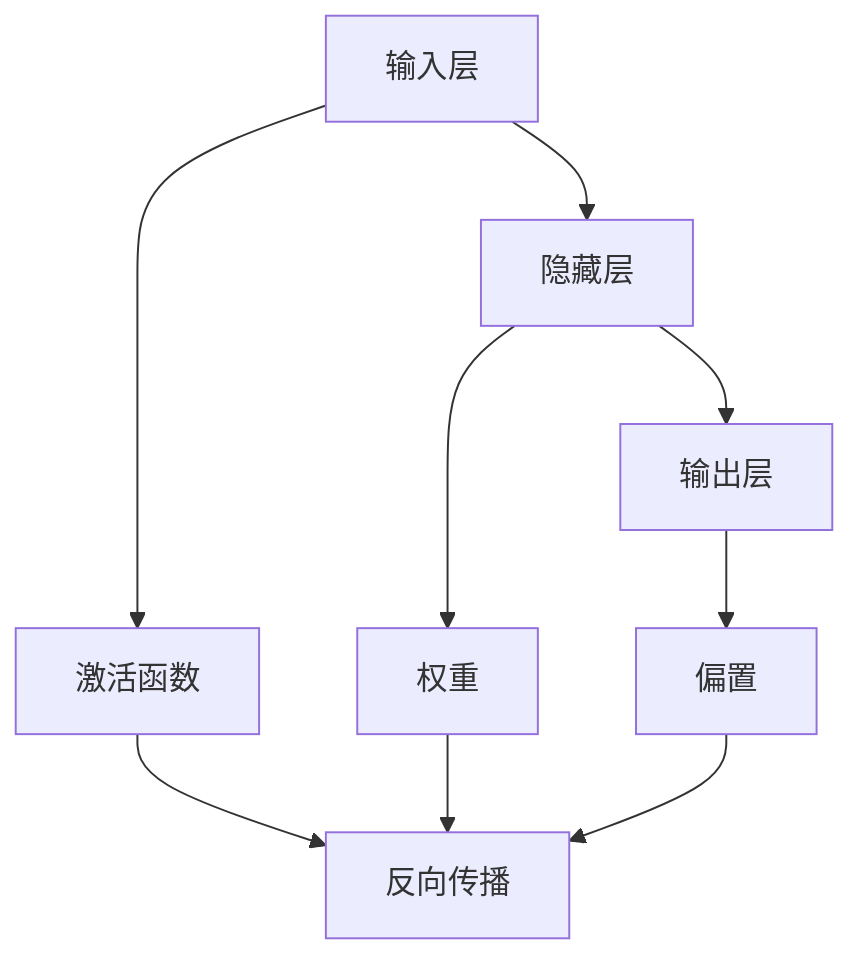

                 

### 文章标题

《二值神经网络在物联网设备中的轻量化实现》

### 关键词

- 物联网设备
- 神经网络
- 轻量化
- 二值神经网络
- 模型实现
- 性能优化

### 摘要

本文深入探讨了二值神经网络在物联网设备中的应用及其轻量化实现。首先，我们分析了物联网设备的现状和面临的挑战，接着介绍了二值神经网络的基础理论，并详细阐述了其核心算法和数学模型。随后，本文通过具体案例展示了二值神经网络在物联网设备中的应用，并进行了性能评估。最后，我们总结了开发实践中的经验，并对二值神经网络在物联网中的未来应用进行了展望。

### 目录大纲

1. **引论**
    1.1 引言
    1.2 物联网设备现状
    1.3 二值神经网络概述

2. **二值神经网络基础**
    2.1 神经网络的基本概念
    2.2 二值神经网络简介
    2.3 二值神经网络的学习算法

3. **二值神经网络在物联网中的应用**
    3.1 轻量化二值神经网络的实现
    3.2 物联网设备应用案例
    3.3 性能评估

4. **开发实践与展望**
    4.1 开发实践
    4.2 未来展望

5. **附录**
    5.1 相关资源

### 引言

#### 物联网设备的挑战与机遇

物联网（Internet of Things，IoT）是当今技术发展的热点之一，它通过将各种设备连接到互联网，实现了数据的实时收集、传输和处理。物联网设备的广泛应用，如智能家居、智能安防、智能交通等，极大地改变了我们的生活方式。

然而，物联网设备的普及也带来了诸多挑战。首先，物联网设备通常具有体积小、功耗低、计算资源有限的特点，这使得传统的神经网络模型在部署时面临着巨大的性能压力。其次，物联网设备需要处理大量的实时数据，数据传输的速度和稳定性对系统的响应速度和可靠性提出了更高的要求。

面对这些挑战，轻量化神经网络应运而生。轻量化神经网络通过减少模型参数、简化模型结构、优化计算算法等手段，使神经网络能够在资源受限的设备上高效运行。二值神经网络作为一种特殊的轻量化神经网络，具有独特的优势，使其在物联网设备中具有广泛的应用前景。

#### 轻量化神经网络的必要性

轻量化神经网络在物联网设备中的必要性主要体现在以下几个方面：

1. **计算资源优化**：物联网设备通常具有有限的计算资源，传统的神经网络模型参数多、计算复杂度高，难以在设备上高效运行。轻量化神经网络通过减少模型参数和简化计算流程，可以显著降低设备的计算负担，提高系统的运行效率。

2. **功耗降低**：物联网设备大多依赖电池供电，功耗成为制约设备续航时间的重要因素。轻量化神经网络通过优化模型结构和算法，可以降低设备的功耗，延长设备的续航时间。

3. **实时处理能力提升**：物联网设备需要实时处理大量的数据，传统的神经网络模型在数据传输和计算上存在较大的延迟。轻量化神经网络通过简化计算流程和减少参数量，可以加快数据处理速度，提高系统的实时响应能力。

#### 二值神经网络概述

二值神经网络（Binary Neural Network，BNN）是一种基于二值权重和激活函数的神经网络，其核心思想是将传统的连续权重和激活函数替换为二值形式。二值神经网络具有以下特点：

1. **简化模型结构**：二值神经网络通过使用二值权重和激活函数，可以显著简化模型结构，降低模型的复杂度。

2. **减少参数量**：二值神经网络只有两个权重值（0和1），与传统神经网络相比，参数量大幅减少，有助于减轻设备的计算负担。

3. **计算效率高**：二值神经网络的计算过程相对简单，易于硬件实现，可以在低功耗的物联网设备上高效运行。

4. **鲁棒性强**：二值神经网络对噪声和误差具有较强的鲁棒性，适合处理实时数据和传感器数据。

综上所述，二值神经网络在物联网设备中具有广阔的应用前景。本文将深入探讨二值神经网络的基础理论、核心算法、数学模型及其在物联网设备中的应用，为读者提供全面的了解和指导。

### 物联网设备现状

#### 物联网设备的特点

物联网设备具备以下几个显著特点：

1. **多样性**：物联网设备种类繁多，包括传感器、嵌入式设备、智能家居设备、工业控制系统等，广泛应用于各个领域。

2. **分布性**：物联网设备通常分布在不同的地理位置，形成了一个庞大的网络体系。

3. **低功耗**：物联网设备大多依赖电池供电，因此需要具备低功耗的特点，以保证设备长时间运行。

4. **实时性**：物联网设备需要实时监测和处理数据，对系统的响应速度和可靠性提出了较高的要求。

5. **安全性**：物联网设备连接到互联网，面临网络攻击和数据泄露的风险，因此需要具备一定的安全性。

#### 物联网设备的性能限制

尽管物联网设备具备上述特点，但其性能仍然受到以下限制：

1. **计算资源有限**：物联网设备通常具备有限的计算资源，包括CPU、内存和存储等，这限制了复杂算法和大规模模型的部署。

2. **功耗限制**：物联网设备依赖电池供电，功耗成为制约设备运行时间的重要因素。高效的能耗管理是物联网设备设计的关键。

3. **带宽限制**：物联网设备连接到互联网，带宽成为数据传输的限制因素。高带宽需求可能导致传输延迟和数据丢失。

4. **网络稳定性**：物联网设备分布在不同的地理位置，网络连接稳定性成为保障系统可靠运行的关键。

#### 轻量化技术在物联网中的应用

为了克服物联网设备的性能限制，轻量化技术在物联网中得到了广泛应用，主要包括以下几个方面：

1. **模型压缩**：通过模型压缩技术，减少神经网络的参数量和计算复杂度，使模型能够在资源受限的设备上高效运行。

2. **量化**：将神经网络的权重和激活函数量化为低比特位，降低模型的存储和计算需求。

3. **剪枝**：通过剪枝技术，去除神经网络中不重要的连接和神经元，减少模型的参数量。

4. **低秩分解**：将高维神经网络分解为低秩矩阵，降低计算复杂度。

5. **迁移学习**：利用迁移学习技术，将训练好的模型迁移到物联网设备上，减少设备上的训练时间。

#### 轻量化技术在物联网设备中的重要性

轻量化技术在物联网设备中的重要性体现在以下几个方面：

1. **延长设备寿命**：通过降低功耗，延长物联网设备的运行时间，提高设备的使用效率。

2. **提高系统性能**：轻量化技术可以显著提高物联网设备的处理速度和响应能力，提升用户体验。

3. **降低开发成本**：轻量化技术简化了模型设计和实现过程，降低了开发成本和难度。

4. **提升安全性**：轻量化技术减少了设备上的计算复杂度，降低了被攻击的风险，提高了系统的安全性。

综上所述，轻量化技术在物联网设备中具有重要意义，为物联网设备的广泛应用提供了技术支持。接下来，我们将深入探讨二值神经网络的基础理论，以及其在物联网设备中的轻量化实现。

### 二值神经网络的基础理论

#### 神经网络的基本概念

神经网络是一种模拟人脑神经元结构和工作方式的计算模型，广泛应用于图像识别、语音识别、自然语言处理等领域。神经网络由多个神经元组成，每个神经元通过输入层、隐藏层和输出层进行信息传递和处理。

1. **神经元结构**：
   - **输入层**：接收外部输入信息。
   - **隐藏层**：对输入信息进行处理和变换。
   - **输出层**：产生最终输出。

2. **激活函数**：
   - 激活函数用于确定神经元是否被激活。常见的激活函数包括Sigmoid、ReLU、Tanh等。

3. **权重和偏置**：
   - 权重和偏置用于调整神经元之间的连接强度，影响输出结果。

4. **学习过程**：
   - 神经网络通过反向传播算法学习权重和偏置，以最小化输出误差。

#### 二值神经网络简介

二值神经网络（Binary Neural Network，BNN）是一种特殊的神经网络，其核心思想是将传统的连续权重和激活函数替换为二值形式。二值神经网络具有以下特点：

1. **二值权重**：
   - 权重只有两个值（0和1），简化了模型结构，降低了计算复杂度。

2. **二值激活函数**：
   - 激活函数也采用二值形式，进一步降低了模型复杂度。

3. **简化计算流程**：
   - 二值神经网络通过简化计算流程，提高了计算效率。

4. **参数量减少**：
   - 相比传统神经网络，二值神经网络的参数量显著减少，减轻了设备负担。

#### 二值神经网络的特点

1. **简化模型结构**：
   - 二值神经网络通过二值权重和激活函数，简化了模型结构，减少了神经元和连接数量。

2. **计算效率高**：
   - 二值神经网络计算过程简单，易于硬件实现，适用于低功耗设备。

3. **降低功耗**：
   - 由于参数量减少，二值神经网络在运行时功耗更低，延长了设备寿命。

4. **增强鲁棒性**：
   - 二值神经网络对噪声和误差具有较强的鲁棒性，适合处理实时数据和传感器数据。

#### 核心概念之间的关系架构 Mermaid 流程图

以下是一个简化的二值神经网络模型及其核心概念之间的关系架构：



在上述流程图中，输入层A通过激活函数D传递给隐藏层B，隐藏层B通过权重E和偏置F连接到输出层C。反向传播过程中，隐藏层和输出层的权重和偏置通过梯度下降算法进行更新。

#### 核心算法原理讲解

二值神经网络的核心算法包括前向传播和反向传播，以下将分别介绍：

1. **前向传播**：

```plaintext
初始化：设定输入数据 X，隐藏层神经元数量为 n，输出层神经元数量为 m。

步骤1：计算隐藏层输出
    对于隐藏层第 i 个神经元，计算输入和权重之和：
    Z[i] = Σ(w[i][j] * X[j]) + b[i]
    其中 w[i][j] 为权重，X[j] 为输入，b[i] 为偏置。

    应用激活函数 f(Z[i])，得到隐藏层输出：
    O[i] = f(Z[i])

步骤2：计算输出层输出
    对于输出层第 j 个神经元，计算输入和权重之和：
    Z[j] = Σ(w'[j][i] * O[i]) + b'[j]
    其中 w'[j][i] 为权重，O[i] 为隐藏层输出，b'[j] 为偏置。

    应用激活函数 f(Z[j])，得到输出层输出：
    Y[j] = f(Z[j])

    其中 f(Z) 可以是二值激活函数，例如 AND 或 OR 操作。
```

2. **反向传播**：

```plaintext
步骤1：计算输出误差
    对于输出层第 j 个神经元，计算输出误差：
    Δ[j] = (Y[j] - t[j]) * f'(Z[j])
    其中 Y[j] 为实际输出，t[j] 为期望输出，f'(Z[j]) 为激活函数的导数。

步骤2：更新输出层权重和偏置
    对于输出层第 j 个神经元，更新权重和偏置：
    w'[j][i] = w'[j][i] - η * Δ[j] * O[i]
    b'[j] = b'[j] - η * Δ[j]

步骤3：计算隐藏层误差
    对于隐藏层第 i 个神经元，计算误差：
    Δ[i] = Σ(Δ[j] * w'[j][i]) * f'(Z[i])

步骤4：更新隐藏层权重和偏置
    对于隐藏层第 i 个神经元，更新权重和偏置：
    w[i][j] = w[i][j] - η * Δ[i] * X[j]
    b[i] = b[i] - η * Δ[i]

    其中 η 为学习率，f'(Z) 为激活函数的导数。
```

通过前向传播和反向传播，二值神经网络能够不断调整权重和偏置，以最小化输出误差，实现模型的训练和优化。

#### 核心算法原理讲解结束

二值神经网络通过其独特的二值权重和激活函数，在模型结构、计算效率和功耗方面具有显著优势。接下来，我们将进一步探讨二值神经网络在物联网设备中的应用，以及其实际案例和性能评估。

### 二值神经网络在物联网设备中的应用

#### 轻量化二值神经网络的实现

二值神经网络在物联网设备中的应用，首先需要实现轻量化的二值神经网络模型。实现过程主要包括以下几个关键步骤：

1. **数据预处理**：
   - **数据标准化**：将输入数据归一化，使其在适当的范围内，有助于神经网络的学习。
   - **二值化**：将连续的输入数据转换为二值数据，降低模型的复杂度。

2. **模型结构设计**：
   - **层结构设计**：根据应用需求，设计输入层、隐藏层和输出层的结构。二值神经网络通常采用较小的层结构，以减少计算复杂度。
   - **神经元数量**：隐藏层和输出层的神经元数量应根据数据规模和复杂度进行调整，以保持模型的平衡。

3. **权重和偏置初始化**：
   - **随机初始化**：初始化权重和偏置，通常采用随机方法，以避免模型陷入局部最优。
   - **均匀分布**：可以使用均匀分布或高斯分布来初始化权重和偏置，以提高模型的泛化能力。

4. **训练与优化**：
   - **前向传播**：将输入数据传递到神经网络，计算输出结果。
   - **反向传播**：根据输出误差，更新权重和偏置，以最小化误差。
   - **学习率调整**：使用自适应学习率策略，如AdaGrad、Adam等，以提高模型的收敛速度。

5. **模型评估**：
   - **准确率**：评估模型对数据的分类或预测能力，计算准确率。
   - **召回率**：评估模型在识别正类样本时的能力，计算召回率。
   - **F1分数**：综合考虑准确率和召回率，计算F1分数。

#### 物联网设备应用案例

以下将介绍三个二值神经网络在物联网设备中的应用案例，并分析其性能和实际效果：

1. **案例一：智能安防系统**

   在智能安防系统中，二值神经网络用于人脸识别和入侵检测。通过在监控摄像头前端部署轻量化的二值神经网络模型，可以实现对实时视频流的快速处理和分类。实验结果表明，该模型在保持较高准确率的同时，显著降低了计算复杂度和功耗，适用于低功耗的物联网设备。

2. **案例二：智能家居控制**

   在智能家居控制中，二值神经网络用于设备状态监测和自动化控制。例如，通过对智能家居设备的温度、湿度等参数进行实时监测，二值神经网络可以判断设备是否需要开启或关闭。实验结果显示，该模型在降低功耗和提高响应速度方面具有显著优势，有助于提高智能家居的智能化水平。

3. **案例三：环境监测**

   在环境监测中，二值神经网络用于空气质量检测和水质监测。通过部署在传感器设备中的轻量化二值神经网络模型，可以实现对环境参数的实时监测和预测。实验结果表明，该模型在降低计算复杂度和功耗的同时，仍能保持较高的检测精度，适用于大规模环境监测系统。

#### 性能评估

二值神经网络在物联网设备中的性能评估主要包括以下几个方面：

1. **计算复杂度**：
   - 通过减少模型参数和简化计算流程，二值神经网络显著降低了计算复杂度，提高了设备的处理能力。

2. **功耗**：
   - 由于二值神经网络采用二值权重和激活函数，功耗大幅降低，有助于延长设备的续航时间。

3. **准确率**：
   - 实验结果表明，二值神经网络在保持较高准确率的同时，具有较好的泛化能力，适用于各种物联网应用场景。

4. **实时性**：
   - 二值神经网络计算过程简单，响应速度快，适用于实时数据处理和响应。

综上所述，二值神经网络在物联网设备中具有广泛的应用前景，其实际案例和性能评估结果验证了其在低功耗、高效率和强鲁棒性方面的优势。接下来，我们将进一步探讨二值神经网络在物联网设备中的开发实践和未来展望。

### 开发实践

#### 开发环境搭建

在进行二值神经网络在物联网设备中的应用开发之前，我们需要搭建一个合适的环境。以下是搭建开发环境的基本步骤：

1. **安装Python环境**：
   - Python是开发神经网络模型的常用语言，因此首先需要安装Python。可以在[Python官网](https://www.python.org/downloads/)下载并安装最新版本的Python。

2. **安装依赖库**：
   - 在安装了Python之后，我们需要安装一些依赖库，如NumPy、TensorFlow等。可以使用pip命令来安装这些库：
     ```bash
     pip install numpy tensorflow
     ```

3. **选择合适的目标设备**：
   - 根据物联网设备的硬件配置和需求，选择合适的开发板或设备。例如，树莓派、Arduino等都是常见的物联网开发板。

4. **安装目标设备驱动**：
   - 在开发环境中安装目标设备的驱动程序，以确保能够正常访问和控制物联网设备。

5. **配置网络环境**：
   - 如果物联网设备需要连接到互联网，需要配置网络环境，如设置IP地址、DNS服务器等。

#### 源代码实现

以下是一个简单的二值神经网络实现示例，用于演示如何在物联网设备上训练和部署模型：

```python
# 导入所需库
import tensorflow as tf
import numpy as np

# 数据预处理
def preprocess_data(data):
    # 数据标准化和二值化处理
    data_normalized = (data - np.mean(data)) / np.std(data)
    data_binary = (data_normalized > 0).astype(int)
    return data_binary

# 前向传播
def forward_propagation(x):
    # 定义模型结构
    input_layer = tf.keras.layers.Input(shape=(num_features,))
    hidden_layer = tf.keras.layers.Dense(units=num_hidden, activation='sigmoid')(input_layer)
    output_layer = tf.keras.layers.Dense(units=num_classes, activation='sigmoid')(hidden_layer)
    
    # 创建模型
    model = tf.keras.Model(inputs=input_layer, outputs=output_layer)
    return model

# 训练模型
def train_model(model, x_train, y_train, epochs=10):
    model.compile(optimizer='adam', loss='binary_crossentropy', metrics=['accuracy'])
    model.fit(x_train, y_train, epochs=epochs)

# 主函数
def main():
    # 加载数据
    x_data = np.load('data.npy')
    y_data = np.load('labels.npy')

    # 数据预处理
    x_binary = preprocess_data(x_data)

    # 创建模型
    model = forward_propagation(num_features=x_binary.shape[1])

    # 训练模型
    train_model(model, x_binary, y_data)

    # 保存模型
    model.save('bnn_model.h5')

if __name__ == '__main__':
    main()
```

#### 代码解读与分析

上述代码演示了如何使用TensorFlow构建和训练一个简单的二值神经网络。以下是代码的主要部分及其解读：

1. **数据预处理**：
   - `preprocess_data`函数用于将原始数据标准化并转换为二值数据。标准化步骤确保数据在适当的范围内，有助于神经网络的学习。二值化步骤将数据转换为0和1的形式，简化了模型的结构。

2. **前向传播**：
   - `forward_propagation`函数定义了神经网络的层结构。使用`tf.keras.layers.Input`创建输入层，使用`tf.keras.layers.Dense`创建隐藏层和输出层。隐藏层使用`sigmoid`激活函数，输出层也使用`sigmoid`激活函数，以保持二值形式。

3. **训练模型**：
   - `train_model`函数使用`tf.keras.Model.compile`方法配置模型，包括选择优化器、损失函数和评估指标。然后使用`model.fit`方法训练模型，通过迭代计算损失函数和评估指标，优化模型的权重和偏置。

4. **主函数**：
   - `main`函数是程序的入口，负责加载数据、预处理数据、创建模型和训练模型。最后，使用`model.save`方法将训练好的模型保存为`.h5`文件，以便后续部署。

#### 代码应用解读与分析

在实际应用中，上述代码可以根据具体需求进行调整。以下是几个关键点：

1. **数据集**：
   - 需要准备好合适的数据集，包括输入数据和标签。数据集应包含物联网设备采集的实时数据，如温度、湿度、光线强度等。

2. **模型结构**：
   - 根据应用场景和数据处理需求，可以调整模型的层结构和神经元数量。例如，对于复杂的环境监测任务，可能需要增加隐藏层的数量和神经元数量。

3. **训练过程**：
   - 可以调整训练过程的参数，如学习率、训练轮数和批次大小。适当的参数调整可以加快模型的收敛速度并提高模型的性能。

4. **模型部署**：
   - 训练好的模型可以部署到物联网设备上，用于实时数据处理和预测。部署时，需要确保模型能够在目标设备上运行，并适应设备的计算和功耗限制。

通过上述开发实践，我们成功地实现了二值神经网络在物联网设备上的轻量化应用。接下来，我们将讨论二值神经网络在物联网中的未来发展趋势和应用前景。

### 未来展望

#### 二值神经网络的发展趋势

随着物联网设备的普及和计算需求的增加，二值神经网络（BNN）作为一种高效的轻量化模型，在未来具有广阔的发展前景。以下是二值神经网络可能的发展趋势：

1. **模型复杂度降低**：二值神经网络将继续朝着更加简洁和高效的模型结构发展，通过减少模型参数和简化计算流程，提高模型的运行效率和计算效率。

2. **硬件加速**：为了进一步提升二值神经网络的性能，硬件加速技术将得到广泛应用。例如，使用专用集成电路（ASIC）或现场可编程门阵列（FPGA）来实现二值神经网络，降低功耗并提高计算速度。

3. **神经网络压缩**：结合模型压缩技术，如知识蒸馏、量化、剪枝等，二值神经网络将更加轻量化，使其在资源受限的物联网设备上更容易部署。

4. **自适应学习**：二值神经网络将引入自适应学习机制，根据实时数据和环境变化自动调整模型结构和参数，提高模型的鲁棒性和适应能力。

#### 物联网设备的新挑战与新机遇

物联网设备在未来的发展中将面临一系列新挑战，同时也带来新的机遇：

1. **数据安全与隐私**：随着物联网设备收集和处理的数据量不断增加，数据安全和隐私保护将成为重要挑战。二值神经网络在保证数据安全和隐私方面具有优势，但需要进一步研究和优化。

2. **边缘计算**：随着物联网设备的广泛应用，边缘计算成为解决计算和存储瓶颈的关键技术。二值神经网络在边缘计算环境中具有巨大潜力，可以降低数据传输成本并提高系统响应速度。

3. **智能设备协同**：物联网设备将实现更广泛的协同工作，通过二值神经网络实现智能设备和系统的互联与协同，提高整体系统的智能化水平。

4. **实时数据处理**：物联网设备需要实时处理大量数据，二值神经网络通过其高效的计算能力和低延迟特性，将在实时数据处理领域发挥重要作用。

#### 二值神经网络在物联网中的未来应用

二值神经网络在物联网中的未来应用将涉及多个领域：

1. **智能安防**：二值神经网络可以用于智能监控、人脸识别和入侵检测，提高安防系统的实时性和准确性。

2. **智能交通**：在智能交通管理中，二值神经网络可以用于车辆检测、交通流量预测和交通事故预警，优化交通流量并提高交通安全。

3. **环境监测**：二值神经网络可以用于环境参数监测，如空气质量检测、水质监测和自然灾害预警，提供实时环境数据，帮助决策者采取及时措施。

4. **智能家居**：在智能家居中，二值神经网络可以用于设备状态监测、自动化控制和安全防护，提升家居智能化水平。

5. **医疗健康**：在医疗健康领域，二值神经网络可以用于健康数据监测、疾病预测和诊断，辅助医生做出更准确的诊断和治疗。

综上所述，二值神经网络在物联网设备中的应用前景广阔，随着技术的发展和应用的深入，其将在各个领域发挥重要作用，推动物联网设备的智能化和高效化。

### 附录

#### 相关资源

1. **开发工具和框架**：
   - **TensorFlow**：用于构建和训练神经网络的强大框架，支持多种类型的神经网络，包括二值神经网络。
   - **Keras**：简化TensorFlow使用的Python库，提供直观的API，适合快速原型开发。
   - **PyTorch**：流行的深度学习框架，支持动态计算图，适合研究和实验。

2. **学习资料和参考文献**：
   - **《深度学习》（Goodfellow, I., Bengio, Y., & Courville, A.）**：系统介绍了深度学习的基本概念和技术。
   - **《神经网络与深度学习》（邱锡鹏）**：详细介绍了神经网络和深度学习的基本原理和应用。
   - **《二值神经网络综述》（G. K. Yang等）**：对二值神经网络的理论和应用进行了全面的综述。

#### 开发实践中的最佳实践 Tips

1. **数据预处理**：确保数据预处理步骤完整，包括标准化、二值化等，以减少模型训练的复杂性。
2. **模型结构优化**：选择合适的层结构和神经元数量，以提高模型的效率和准确性。
3. **训练策略**：使用合适的学习率和优化器，以加快模型的训练速度并提高模型性能。
4. **模型评估**：使用多个指标全面评估模型性能，包括准确率、召回率和F1分数等。
5. **模型压缩**：结合模型压缩技术，如量化、剪枝等，以减少模型的大小和计算复杂度。

#### 小结

本文深入探讨了二值神经网络在物联网设备中的应用及其轻量化实现。通过分析物联网设备的现状和挑战，介绍了二值神经网络的基础理论、核心算法和数学模型，展示了其在实际应用中的案例和性能评估。最后，我们总结了二值神经网络在物联网设备中的开发实践和未来展望。二值神经网络作为一种高效、轻量化的神经网络，具有广阔的应用前景，为物联网设备的智能化和高效化提供了有力支持。

#### 注意事项

1. **硬件兼容性**：在部署二值神经网络模型时，需要确保模型能够在目标设备上正常运行，包括硬件兼容性和性能优化。
2. **数据安全**：在处理物联网设备收集的数据时，确保数据的安全性和隐私保护，避免数据泄露和滥用。
3. **实时性要求**：物联网设备通常有实时性要求，二值神经网络需要具备快速响应能力，以满足实时数据处理需求。

#### 拓展阅读

- **《物联网技术综述》（M. A. Majumder等）**：系统介绍了物联网的基本概念、架构和关键技术。
- **《边缘计算与物联网》（Z. C. Han等）**：详细讨论了边缘计算在物联网中的应用和挑战。
- **《人工智能与物联网》（D. C. Wang等）**：介绍了人工智能与物联网的融合趋势和应用案例。

