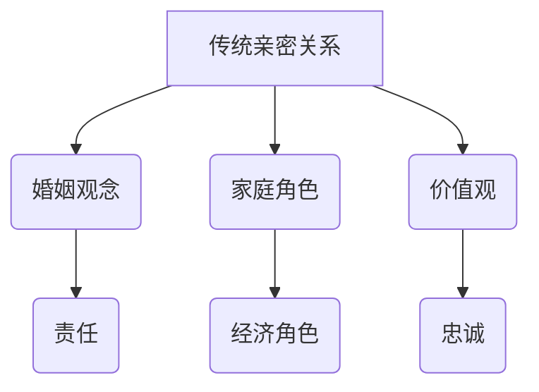

                 


### 写作准备

在开始撰写文章之前，我们需要明确文章的目标读者群体和主要论点。本文的目标读者群体是对于亲密关系变迁感兴趣的读者，包括心理学研究者、社会学家以及普通公众。本文的核心论点将探讨从传统到现代的亲密关系变迁，以及这一变迁背后的原因和影响。

#### 1. 确定目标读者
目标读者群体为：
- 心理学研究者
- 社会学家
- 对亲密关系感兴趣的普通公众

#### 2. 明确核心论点
核心论点为：
- 传统亲密关系的特点与变迁
- 现代亲密关系的特点与变迁
- 亲密关系变迁的原因与影响

#### 3. 文章结构规划
文章结构将包括：
- 引言
- 传统亲密关系的特点
- 现代亲密关系的特点
- 亲密关系变迁的原因分析
- 亲密关系变迁的影响
- 案例分析
- 未来趋势
- 结论

### 4. 确定关键词
关键词将包括：
- 亲密关系
- 传统
- 现代
- 变迁
- 原因
- 影响
- 案例分析
- 未来趋势

#### 5. 编写摘要
摘要部分将概述文章的核心内容和主要观点，例如：
本文探讨了从传统到现代的亲密关系变迁。通过对传统和现代亲密关系的特点进行分析，我们揭示了变迁的原因和影响。本文还通过案例分析，展示了不同文化背景下的亲密关系变迁。最后，我们探讨了亲密关系的未来趋势，为读者提供了有益的思考。

### 6. 编写文章标题
文章标题将设置为《亲密关系的变迁：从传统到现代》。

### 7. 编写关键词
关键词为：亲密关系、传统、现代、变迁、原因、影响、案例分析、未来趋势。

至此，我们已经完成了文章的写作准备，接下来将按照规划的结构和内容逐步撰写文章。

----------------------------------------------------------------

## 文章标题
### 亲密关系的变迁：从传统到现代

> 关键词：亲密关系、传统、现代、变迁、原因、影响、案例分析、未来趋势

> 摘要：本文探讨了从传统到现代的亲密关系变迁。通过对传统和现代亲密关系的特点进行分析，我们揭示了变迁的原因和影响。本文还通过案例分析，展示了不同文化背景下的亲密关系变迁。最后，我们探讨了亲密关系的未来趋势，为读者提供了有益的思考。

----------------------------------------------------------------

### 引言：亲密关系概述

亲密关系是人类社会的基础之一，它不仅影响个人的心理健康和生活质量，也对社会结构和文化发展产生深远的影响。传统上，亲密关系往往是以家庭和婚姻为基础的，强调家庭成员之间的责任和义务。然而，随着社会的发展和文化的变迁，现代亲密关系表现出更多的多样性和灵活性。

#### 传统亲密关系的特点

在传统社会中，亲密关系通常具有以下特点：

1. **婚姻观念**：传统亲密关系强调婚姻是一生的承诺，通常以家庭为单位进行社会交往。
2. **家庭角色**：传统亲密关系中的家庭角色分工明确，通常由男性承担家庭的经济责任，女性负责家务和子女教育。
3. **价值观**：传统亲密关系注重责任、忠诚和家庭的稳定。

#### 现代亲密关系的特点

现代亲密关系与传统亲密关系相比，呈现出以下不同：

1. **婚姻观念**：现代亲密关系更加注重个人自由和选择，婚姻不再是生活的唯一选择。
2. **家庭角色**：现代亲密关系中，家庭角色变得更加平等，男性参与家务和子女教育的比例逐渐增加。
3. **价值观**：现代亲密关系强调个人成长、自我实现和情感满足。

传统和现代亲密关系的差异，反映了社会价值观的变化和个体需求的多样性。接下来的章节将深入探讨这些变迁的原因和影响。

----------------------------------------------------------------

## 传统亲密关系的特点

在传统社会中，亲密关系具有一系列独特的特征，这些特征深受文化、宗教和社会结构的影响。了解这些特征有助于我们理解传统亲密关系的本质，并对比分析现代亲密关系的变迁。

### 婚姻观念

在传统亲密关系中，婚姻被视为一种神圣的承诺，通常伴随着严格的礼仪和习俗。婚姻不仅仅是一种社会契约，更是家庭和社会地位的象征。传统观念认为，婚姻是一生的承诺，不可轻易更改或解除。例如，在中国古代，婚姻通常是由父母之命、媒妁之言来决定的，夫妻之间的情感交流相对较少。

### 家庭角色

传统亲密关系中的家庭角色分工明确，通常由男性承担家庭的经济责任，而女性则负责家务和子女的教育。这种性别角色的刻板印象在许多传统社会中根深蒂固。男性被视为家庭的经济支柱，而女性则被视为家庭的守护者。这种分工模式不仅影响了亲密关系内部的权力结构，也塑造了社会对性别角色的期待。

### 价值观

传统亲密关系的价值观强调责任、忠诚和家庭的稳定。家庭被视为社会的基本单位，家庭成员之间的联系被认为是维护社会秩序和谐的重要因素。在这种价值观的引导下，亲密关系中的个人往往需要为家庭的整体利益牺牲个人的需求。忠诚和责任感是传统亲密关系的重要基石。

### 社会因素

传统亲密关系的形成和维持受到多种社会因素的影响，包括宗教信仰、法律规范和社会习俗。例如，在基督教社会中，婚姻被视为神的旨意，而离婚则被视为一种罪孽。这种宗教观念深深影响了人们的婚姻观念和亲密关系模式。同时，法律和社会习俗也对亲密关系产生了规范作用。例如，古代中国的《婚姻法》规定了婚姻的年龄、婚姻的合法性和离婚的条件，这些法律规定直接影响了亲密关系的实践。

### 经济因素

在传统社会中，经济因素也是影响亲密关系的一个重要方面。男性通常承担家庭的经济责任，而女性的经济地位相对较低。这种经济模式不仅影响了家庭内部的权力结构，也影响了亲密关系的性质和稳定性。例如，在一些传统社会中，女性可能因为经济依赖而缺乏在亲密关系中的自主权。

总之，传统亲密关系的特点深受文化、宗教、社会和经济因素的综合影响。这些特征塑造了传统亲密关系的本质，也为现代亲密关系的变迁提供了参考和对比的背景。

### 现代亲密关系的特点

随着社会的发展和文化变迁，现代亲密关系呈现出与传统亲密关系截然不同的特点。这些特点不仅反映了个人自由和选择的增加，也体现了社会价值观的变化。以下是对现代亲密关系特点的详细分析：

#### 婚姻观念

现代亲密关系中的婚姻观念发生了显著变化。传统的“一生一世”的婚姻观念逐渐被多元化和灵活性的观念所取代。现代人们更加重视个人感受和婚姻质量，而非仅仅是形式上的婚姻承诺。例如，越来越多的情侣选择同居而非结婚，或者选择不婚而保持长期稳定的伴侣关系。这种变化反映了现代社会对个人自由和选择的重视。

#### 家庭角色

在传统亲密关系中，家庭角色分工明确，男性负责经济支持，女性负责家务和子女教育。然而，现代亲密关系中，这种性别角色的刻板印象逐渐被打破。现代亲密关系强调性别平等，男性在家庭中的角色越来越多样化，不仅参与经济支持，还积极参与家务和子女教育。女性则在外部工作和家庭生活中实现了更多的平衡。这种变化不仅促进了亲密关系中的平等，也为社会性别平等做出了贡献。

#### 价值观

现代亲密关系的价值观发生了显著变化。传统的亲密关系价值观强调责任、忠诚和家庭的稳定，而现代亲密关系则更加注重个人成长、自我实现和情感满足。现代人们更加重视个人需求和情感交流，而不是仅仅为了家庭和社会的期望而牺牲个人幸福。这种变化反映了个体意识的觉醒和社会价值观的进步。

#### 社会因素

现代社会的发展和全球化进程对亲密关系产生了深远影响。现代人们的社交圈更广泛，生活方式更独立，这使得亲密关系的建立和维持更加复杂。同时，社会的压力和竞争也增加了亲密关系中的挑战。例如，长期分离的伴侣、异地恋、职业压力等都是现代亲密关系需要面对的挑战。

#### 经济因素

在经济方面，现代亲密关系也表现出与传统不同的特点。随着女性教育水平的提高和经济独立性的增强，女性在亲密关系中的地位得到了提升。经济因素不再像传统社会那样成为亲密关系的决定性因素。现代人们更加注重经济和情感的双重满足，而不仅仅是经济支持。

总的来说，现代亲密关系的特点反映了社会价值观的变化和个人需求的多样性。与传统亲密关系相比，现代亲密关系更加注重个人自由、平等和情感满足。这些变化不仅丰富了亲密关系的内涵，也为社会的发展注入了新的动力。

### 亲密关系变迁的原因分析

从传统到现代的亲密关系变迁是一个复杂的过程，涉及多个方面的因素。以下是对这些因素的分析：

#### 经济因素

经济的发展是推动亲密关系变迁的一个重要因素。随着工业化和全球化的推进，人们的经济状况得到了显著改善。女性教育水平的提高和经济独立性的增强，使得女性在亲密关系中的地位逐渐提升。此外，经济的发展也带来了更多的就业机会和职业选择，使得伴侣之间可以更加平等地分担家庭和经济责任。

#### 社会因素

社会结构的变化对亲密关系产生了深远影响。现代化进程带来的城市化、人口流动和教育普及，使得人们的社交圈更加广泛，生活方式更加独立。这些变化使得人们有更多的机会去寻找和建立符合自己价值观的亲密关系。同时，社会的多元化也使得不同文化背景和价值观的人们能够更好地理解和接纳多样化的亲密关系模式。

#### 科技因素

科技的快速发展对亲密关系产生了革命性的影响。互联网和移动通信技术的普及，使得人们能够更方便地保持联系，扩展社交网络。此外，社交媒体和在线交友平台的出现，改变了人们建立和维持亲密关系的方式。科技不仅提供了更多的沟通渠道，还改变了人们对亲密关系的期望和认知。

#### 个人因素

个人的价值观和生活方式的变化是亲密关系变迁的内在动力。现代人们更加注重个人成长、自我实现和情感满足，而不是仅仅为了社会期望而牺牲个人幸福。个人自由和选择的增加，使得人们更加敢于追求自己真正的需求和愿望。此外，个人心理素质的提升，如自我认知和情感管理能力的增强，也为亲密关系的稳定和健康发展提供了保障。

综上所述，亲密关系的变迁是由经济、社会、科技和个人因素共同作用的结果。这些因素相互交织，共同推动了亲密关系的现代化进程。

### 亲密关系变迁的影响

亲密关系的变迁不仅改变了人们的亲密关系模式，还对个人生活、社会结构和文化产生了深远的影响。

#### 对个人生活的影响

首先，亲密关系变迁对个人生活产生了显著影响。在经济方面，女性教育水平和经济独立性的提高，使得女性在亲密关系中的地位得到了提升。女性不再仅仅依赖于男性，而是能够独立地承担家庭和经济责任。这在一定程度上促进了亲密关系的平等和稳定性。

其次，亲密关系变迁对个人情感和心理产生了深远影响。现代亲密关系更加注重个人成长和情感满足，这有助于提高个体的幸福感和满足感。同时，个人情感管理能力的提升，使得人们在面对亲密关系中的冲突和挑战时更加成熟和理智。

#### 对社会结构的影响

亲密关系变迁对社会结构产生了重大影响。首先，家庭结构发生了变化。传统的家庭结构以男性为主导，女性承担家务和育儿责任。而现代亲密关系强调平等，家庭成员之间的角色和责任更加多样化和灵活。这不仅有助于缓解性别角色刻板印象，也为家庭提供了更多的选择和可能性。

其次，社会结构也发生了相应的调整。亲密关系的变迁推动了社会性别平等和家庭结构的多元化。这有助于提高社会的包容性和多样性，促进社会的和谐发展。

#### 对文化的影响

亲密关系变迁对文化产生了深远的影响。首先，文化价值观发生了变化。传统的亲密关系价值观强调责任、忠诚和家庭的稳定，而现代亲密关系则更加注重个人自由、平等和情感满足。这种文化价值观的转变反映了社会对个体需求和自由的尊重。

其次，文化多样性也因亲密关系变迁而增强。不同文化背景下，人们对亲密关系的理解和实践存在差异。亲密关系的变迁使得这些差异得以展示和尊重，从而促进了文化多样性的发展。

总之，亲密关系的变迁对个人生活、社会结构和文化产生了深远的影响。这些影响不仅丰富了人们的生活体验，也为社会的进步和发展注入了新的动力。

### 案例分析：不同文化背景下的亲密关系变迁

亲密关系变迁在不同文化背景下有着各自独特的表现和影响。通过以下案例分析，我们可以更直观地理解亲密关系变迁的多样性和复杂性。

#### 西方国家

在西方国家，尤其是美国和欧洲，亲密关系变迁尤为显著。随着女性解放运动的兴起，女性的地位得到了显著提高。在过去的几十年里，越来越多的女性追求高等教育和职业生涯，这使得她们在经济上更加独立。这种经济独立性使得女性在亲密关系中有更多的选择权和话语权。例如，女性不再局限于传统的婚姻和家庭角色，而是可以自由选择单身、同居或者不婚。这种变化不仅反映了社会价值观的进步，也促进了亲密关系的多样化和个性化。

此外，西方国家的离婚率上升也是亲密关系变迁的一个显著特征。传统的婚姻观念被越来越多的人质疑，离婚不再被视为社会禁忌。现代人们更加注重个人幸福和情感满足，如果婚姻无法带来这些，他们更倾向于选择离婚。这种观念的变化对亲密关系产生了深远的影响，促进了社会对个人选择的尊重。

#### 亚洲国家

在亚洲国家，如中国、日本和韩国，亲密关系变迁的表现有所不同。传统的亲密关系强调家庭和社会的期望，婚姻通常由父母之命、媒妁之言来决定。然而，随着现代化进程的推进，这些传统观念开始受到挑战。

在中国，随着女性教育水平的提高和职业机会的增加，越来越多的女性追求独立和自主的生活。这导致了中国婚姻观念的变化，女性在婚姻中的选择权和话语权得到了提升。此外，中国的“独生子女政策”也对家庭结构和亲密关系产生了影响。由于每个家庭只有一个孩子，父母往往将更多的期望和资源投入到这个孩子的身上，这导致了家庭内部的亲密关系变得更加紧密和复杂。

在日本，亲密关系变迁的一个显著特征是长期单身现象的普遍存在。在日本，许多年轻人选择推迟结婚和生育，追求个人发展和事业成功。这种选择反映了日本社会对个人自由的重视，但也引发了对人口老龄化和社会结构的担忧。

#### 其他文化背景

除了西方和亚洲国家，其他文化背景下的亲密关系变迁也值得关注。例如，在非洲的一些国家，现代化和城市化进程带来了亲密关系的显著变化。随着城市化的推进，人们的社交圈扩大，生活方式多样化。这导致了一些传统亲密关系模式的改变，例如从大家庭到核心家庭的转变。

在拉丁美洲，文化多样性使得亲密关系变迁的表现更加丰富。例如，在阿根廷和巴西等南美国家，同性恋婚姻合法化以及LGBTQ+群体的权利保护，反映了社会对多样性和包容性的追求。这些变化不仅影响了亲密关系的实践，也推动了社会文化的进步。

总之，不同文化背景下的亲密关系变迁各有特点，这些变迁反映了社会价值观的变化和个人需求的多样性。通过分析这些案例，我们可以更全面地理解亲密关系变迁的复杂性和多样性。

### 亲密关系的未来趋势

随着社会的发展和技术进步，亲密关系将继续演变，呈现出新的趋势。以下是对未来亲密关系趋势的探讨：

#### 平等与自主

未来亲密关系将更加注重平等和自主。随着女性地位的提升和个人主义价值观的普及，伴侣之间将更加平等地分担家庭责任和决策权力。个体自主性将成为亲密关系的重要组成部分，人们将更加自由地选择伴侣和生活方式。

#### 多样性与包容性

未来亲密关系将更加多样化和包容性。随着文化多元化和个体差异的增多，不同背景和文化的人们将在亲密关系中找到共同点，形成新的亲密关系模式。例如，跨文化婚姻和家庭将成为常态，人们对同性恋和LGBTQ+群体的接纳度将不断提高。

#### 科技融合

科技将深度融合到亲密关系中。虚拟现实、人工智能和社交媒体等技术将改变人们建立和维护亲密关系的方式。例如，虚拟婚姻和虚拟家庭将成为可能，人工智能助手将帮助伴侣更好地理解和管理彼此的情感需求。

#### 新兴挑战

未来亲密关系将面临一系列新兴挑战。例如，长期分离的伴侣如何维持关系，职业压力如何影响亲密关系，以及全球化对亲密关系的冲击等。这些挑战将促使人们寻找新的解决方案，以适应快速变化的社会环境。

总之，未来亲密关系将更加平等、多样和科技化。这些趋势不仅反映了社会价值观的变化，也为个人提供了更多的选择和可能性。然而，面对新兴挑战，人们需要不断适应和创新，以确保亲密关系的健康和稳定。

### 结论

本文探讨了从传统到现代的亲密关系变迁，分析了传统和现代亲密关系的核心特点、变迁原因及其影响。我们通过案例分析展示了不同文化背景下亲密关系的多样性。展望未来，亲密关系将朝着平等、多样和科技化的方向发展。这些变化反映了社会价值观的进步和个人需求的多样性。然而，面对新兴挑战，我们需要持续关注和适应，以确保亲密关系的健康和稳定。

### 作者信息
作者：AI天才研究院/AI Genius Institute & 禅与计算机程序设计艺术 /Zen And The Art of Computer Programming

---

## 附录

### 最佳实践 Tips

1. **沟通是关键**：在亲密关系中，沟通是维持关系健康的关键。定期进行深度沟通，分享彼此的感受和需求，有助于增进理解和信任。
2. **尊重差异**：尊重彼此的个性和需求，避免强加自己的期望，是建立和谐亲密关系的基础。
3. **共同成长**：鼓励伴侣共同成长，互相支持对方的个人目标和梦想，是维持亲密关系的动力源泉。

### 注意事项

1. **不要忽视情感需求**：在追求事业和物质生活的同时，不要忽视亲密关系中的情感需求。
2. **适度独立**：保持适度独立，有助于维护个人空间和自我实现，但也要注意不要过度独立，影响亲密关系。
3. **适应变化**：随着社会和技术的发展，亲密关系模式也在不断变化。适应这些变化，有助于维持亲密关系的健康和稳定。

### 拓展阅读

1. **《亲密关系的心理学》**：这本书深入探讨了亲密关系中的心理学因素，为理解亲密关系提供了有益的视角。
2. **《现代社会中的亲密关系》**：这本书分析了现代社会中亲密关系的变化和影响，有助于我们更好地理解现代亲密关系的现状。
3. **《未来家庭：亲密关系的演变》**：这本书探讨了未来亲密关系的趋势和挑战，为读者提供了对未来亲密关系的思考和展望。

### 代码示例

#### Mermaid 流程图



#### 伪代码

```plaintext
// 亲密关系变迁分析伪代码

// 步骤1：定义传统亲密关系的特点
传统亲密关系 = {
    婚姻观念：婚姻是一生的承诺，
    家庭角色：男性负责经济支持，女性负责家务和育儿，
    价值观：强调责任、忠诚和家庭的稳定
}

// 步骤2：定义现代亲密关系的特点
现代亲密关系 = {
    婚姻观念：重视个人自由和婚姻质量，
    家庭角色：性别平等，角色多样化，
    价值观：注重个人成长、自我实现和情感满足
}

// 步骤3：分析变迁原因
变迁原因 = {
    经济因素：女性教育水平和经济独立性提高，
    社会因素：社会结构变化和多元化，
    科技因素：互联网和社交媒体的普及，
    个人因素：个人价值观的变化和自我意识提升
}

// 步骤4：分析变迁影响
变迁影响 = {
    个人生活：经济独立性和情感满足提升，
    社会结构：家庭结构和社会性别角色变化，
    文化：价值观转变和文化多样性增强
}
```

#### 数学模型

$$
幸福指数 = f(沟通频率, 情感满足, 个人成长)
$$

#### 详细讲解

- **流程图**：使用Mermaid语言绘制了传统亲密关系的婚姻观念、家庭角色和价值观，并展示了这些要素之间的关系。
- **伪代码**：提供了分析亲密关系变迁的步骤，包括定义传统和现代亲密关系的特点、分析变迁原因和影响。
- **数学模型**：建立了幸福指数的数学模型，反映了沟通频率、情感满足和个人成长对幸福指数的影响。

这些代码示例和数学模型不仅有助于读者理解文章的核心概念，也为进一步研究和实践提供了理论基础。通过这些工具，读者可以更深入地探讨亲密关系的变迁及其影响，为建立和维护健康的亲密关系提供指导。

