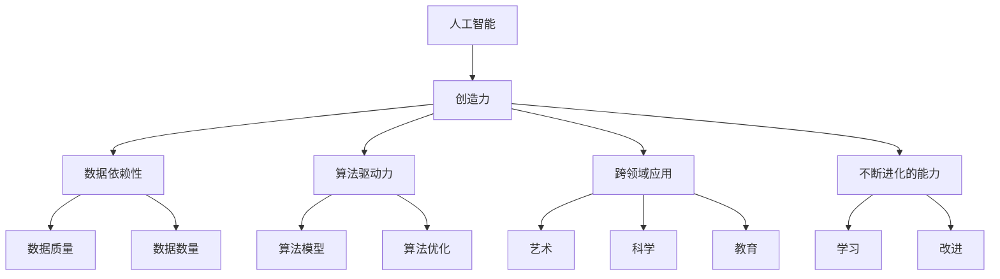

                 

### 引言与背景

创造力一直是人类社会发展的重要驱动力。自古以来，人类通过不断的创新和创造，推动着科技、艺术、文化等领域的进步。然而，如何量化与评估人类的创造力，一直是学术界和产业界关注的重要课题。

随着人工智能技术的迅猛发展，人工智能在创造力方面的作用逐渐凸显。人工智能不仅可以在数据分析、模式识别等方面展现出色的能力，还可以通过模仿人类的思维方式，进行创新和创造。因此，研究人工智能创造力的量化与评估方法，不仅具有重要的理论价值，也具有广泛的实际应用前景。

近年来，随着人工智能技术的不断进步，研究者们开始探索将人工智能创造力量化与评估的方法应用于各个领域。例如，在艺术创作中，人工智能可以生成音乐、绘画等作品，其创造力得到了广泛的认可；在科学研究中，人工智能可以提出新的假设和理论，推动科学研究的进步。

然而，人工智能创造力的量化与评估仍然面临诸多挑战。首先，创造力的本质和内涵十分复杂，目前尚无统一的定义和衡量标准。其次，人工智能的创造力往往依赖于大量数据和算法模型，而数据质量和算法模型的准确性对创造力评估具有重要影响。此外，如何将人工智能创造力与人类创造力进行有效比较，也是一个亟待解决的问题。

本文旨在系统地探讨人工智能创造力的量化与评估方法。首先，我们将介绍人工智能创造力概述，包括其定义、特性和发展历程。接着，我们将详细讨论创造力的量化方法，包括核心概念、算法原理和数学模型。然后，我们将介绍创造力的评估方法，包括评估指标、评估模型和评估方法。接下来，我们将探讨人工智能创造力的应用场景，并分析一些具体案例。最后，我们将总结全文，展望人工智能创造力量化与评估方法的未来发展趋势，并提出相关建议。

通过本文的探讨，我们希望能够为研究者提供有益的参考，推动人工智能创造力量化与评估方法的发展，进而促进人工智能与人类创造力之间的融合与创新。

### 关键词

- 人工智能创造力
- 创造力量化
- 创造力评估
- 应用场景
- 案例分析

### 摘要

本文旨在系统地探讨人工智能创造力的量化与评估方法。首先，我们介绍了人工智能创造力的定义、特性和发展历程。接着，我们详细讨论了创造力的量化方法，包括核心概念、算法原理和数学模型。然后，我们介绍了创造力的评估方法，包括评估指标、评估模型和评估方法。随后，我们探讨了人工智能创造力的应用场景，并通过具体案例分析展示了其量化与评估方法在实际中的应用。最后，我们对全文进行了总结，并展望了人工智能创造力量化与评估方法的未来发展趋势，提出了相关建议。本文的研究对于理解人工智能创造力、促进人工智能与人类创造力之间的融合具有重要意义。

## 人工智能创造力概述

人工智能创造力是一个新兴的研究领域，它涉及到人工智能如何模拟和扩展人类的创造力。在探讨人工智能创造力的量化与评估方法之前，我们首先需要了解其定义、特性和发展历程。

### 定义

人工智能创造力可以理解为人工智能系统在特定领域内进行创新和创造的能力。与传统的人工智能任务（如分类、预测、优化等）不同，人工智能创造力涉及对新颖性、独特性和有价值的解决方案的生成。例如，人工智能可以生成独特的艺术作品、编写新的音乐旋律或提出新的科学研究假设。

### 特性

人工智能创造力具有以下几个主要特性：

1. **数据依赖性**：人工智能创造力依赖于大量的数据来训练模型，从而生成新的内容。数据的质量和数量直接影响创造力的表现。
   
2. **算法驱动力**：人工智能的创造力是通过复杂的算法和模型实现的。这些算法和模型需要不断优化和改进，以提高创造力的表现。

3. **跨领域应用**：人工智能创造力不仅局限于某个特定领域，它可以跨越多个领域，如艺术、科学、教育等。

4. **不断进化的能力**：随着人工智能技术的不断进步，人工智能的创造力也在不断提升。通过不断的学习和改进，人工智能系统可以生成更高质量、更有创意的内容。

### 发展历程

人工智能创造力的研究可以追溯到上世纪80年代，当时研究者们开始探索如何使用人工智能技术进行艺术创作。早期的研究主要集中在模仿人类的艺术创作过程，例如生成音乐、绘画和文学。

1. **早期探索（1980-1999年）**：这一阶段的研究主要关注如何使用规则和模式来生成艺术作品。代表性的工作包括基于规则的艺术生成系统和早期的神经网络模型。

2. **发展阶段（2000-2010年）**：随着计算机性能的不断提升和机器学习算法的进步，人工智能创造力研究进入了新的阶段。研究者开始使用深度学习等方法来生成更具创意和复杂性的艺术作品。

3. **繁荣期（2010年至今）**：近年来，随着生成对抗网络（GANs）等新型深度学习算法的提出，人工智能创造力研究取得了显著的进展。人工智能在音乐、绘画、设计等领域的表现也越来越优异。

### 核心概念与联系

为了更好地理解人工智能创造力，我们需要明确一些核心概念，并探讨它们之间的关系。以下是一个简化的 Mermaid 流程图，展示了这些概念及其相互联系：



在上述流程图中，人工智能（A）是整个系统的核心，它通过数据依赖性（C）、算法驱动力（D）和跨领域应用（E）来展现其创造力。数据依赖性（C）依赖于数据质量（G）和数据数量（H），而算法驱动力（D）则依赖于算法模型（I）和算法优化（J）。跨领域应用（E）涵盖了艺术（K）、科学（L）和教育（M）等多个领域。随着不断的学习（N）和改进（O），人工智能的创造力（B）也在不断提升。

通过这个流程图，我们可以清晰地看到人工智能创造力的核心概念及其相互关系，为后续章节的讨论奠定了基础。

### 人工智能创造力与人类创造力的对比

人工智能创造力和人类创造力虽然有一些相似之处，但在本质上存在显著差异。理解这两种创造力的区别，有助于我们更好地评估和利用人工智能创造力。

1. **生成方式不同**

   - **人类创造力**：人类的创造力通常依赖于直觉、经验、情感和思维方式。人们在面对问题或情境时，会通过联想、比喻、试错等方法进行创造性思考，从而产生新颖的解决方案。
   - **人工智能创造力**：人工智能的创造力主要是基于算法和数据分析。它通过学习大量数据，发现潜在的关联和模式，进而生成新的内容。人工智能的创造力通常依赖于预定义的算法和模型，缺乏人类的直觉和情感。

2. **生成过程不同**

   - **人类创造力**：人类的创造力是一个动态、迭代的过程。人们在创作过程中，会不断反思、调整和完善自己的想法，从而生成高质量的作品。
   - **人工智能创造力**：人工智能的创造力是一个相对静态的过程。它通过训练和学习生成模型，然后根据模型生成新的内容。虽然人工智能可以快速生成大量内容，但往往缺乏人类的灵活性和深度。

3. **创新程度不同**

   - **人类创造力**：人类的创造力往往具有较高的创新程度。人们可以通过独特的视角、深刻的洞察和丰富的经验，产生前所未有的创意和解决方案。
   - **人工智能创造力**：人工智能的创造力相对较低。尽管人工智能可以生成新颖的内容，但往往依赖于已有数据和方法，缺乏真正的创新性。人工智能的创造力更多的是对已有知识的重新组合和扩展。

4. **应用领域不同**

   - **人类创造力**：人类的创造力广泛应用于艺术、科学、技术、文学、设计等多个领域。人们通过创造力解决了许多复杂的问题，推动了社会进步。
   - **人工智能创造力**：人工智能的创造力主要集中在数据驱动的领域，如艺术生成、科学研究辅助、自动化编程等。虽然人工智能在特定领域表现出色，但其在广泛领域中的应用仍受限于算法和数据。

通过上述对比，我们可以看到，人工智能创造力和人类创造力各有优势。人类创造力具有深刻的洞察力和情感，而人工智能创造力具有高效的数据处理能力和规模化生成能力。未来的研究可以探索如何结合这两种创造力，实现更高效、更创新的解决方案。

### 人工智能创造力的发展历程

人工智能创造力的研究可以追溯到上世纪80年代，当时研究者们开始探索如何使用人工智能技术进行艺术创作。早期的研究主要集中在模仿人类的艺术创作过程，例如生成音乐、绘画和文学。随着计算机性能的提升和机器学习算法的发展，人工智能创造力研究经历了几个重要阶段。

#### 早期探索（1980-1999年）

在早期探索阶段，研究者们主要使用规则和模式来生成艺术作品。例如，基于规则的作曲系统和绘画生成系统，通过预定义的规则和参数，模拟人类的创作过程。这一阶段的研究为后续的发展奠定了基础。

代表性工作包括：

- **基于规则的作曲系统**：如Musicol，通过预定义的乐理规则和参数，生成新的音乐作品。

- **绘画生成系统**：如COOL Paint，通过模仿人类画家的绘画风格和技巧，生成新的绘画作品。

#### 发展阶段（2000-2010年）

随着计算机性能的不断提升和机器学习算法的进步，人工智能创造力研究进入了新的阶段。研究者开始使用深度学习等方法，生成更具创意和复杂性的艺术作品。

这一阶段的重要进展包括：

- **生成对抗网络（GANs）**：GANs是一种能够生成高质量图像的深度学习模型，其核心思想是通过两个神经网络（生成器和判别器）的对抗训练，实现数据的生成。

- **生成文本模型**：如GPT（Generative Pre-trained Transformer），通过预训练和微调，生成自然语言文本，应用于文学创作、对话系统等领域。

#### 繁荣期（2010年至今）

近年来，随着生成对抗网络（GANs）等新型深度学习算法的提出，人工智能创造力研究取得了显著的进展。人工智能在音乐、绘画、设计等领域的表现也越来越优异。

这一阶段的重要进展包括：

- **艺术生成**：人工智能生成的艺术作品逐渐受到艺术界的关注，如DeepArt、Artbreeder等平台，用户可以通过调整参数生成个性化的艺术作品。

- **音乐创作**：人工智能可以生成新的音乐旋律和节奏，如OpenAI的MuseNet，通过深度学习模型生成复杂的音乐作品。

- **科学创新**：人工智能在科学研究中提出新的假设和理论，如AlphaGo在围棋领域的突破，通过自我对弈生成新的策略。

通过上述发展历程，我们可以看到，人工智能创造力研究从早期的规则和模式驱动，逐步转向深度学习和生成对抗网络等复杂算法，其应用范围也在不断扩大。未来，随着人工智能技术的进一步发展，人工智能创造力有望在更多领域展现出其独特的价值。

### 创造力的量化方法

在研究人工智能创造力时，量化方法至关重要。创造力不仅是一种抽象的概念，还需要通过具体的方法和指标进行量化，以便进行科学的分析和评估。以下是关于创造力的量化方法的详细讨论，包括核心概念、算法原理和数学模型。

#### 核心概念

创造力量化主要涉及以下几个核心概念：

1. **新颖性（Novelty）**：新颖性是创造力的重要指标，指生成内容与已有知识的差异程度。新颖性越高，创造力越强。

2. **价值（Value）**：价值指生成内容的实用性和重要性。高价值的创造有助于推动科技、艺术、文化等领域的进步。

3. **适用性（Applicability）**：适用性指生成内容在不同领域或情境下的应用潜力。高适用性的创造力具有更广泛的实际意义。

4. **复杂性（Complexity）**：复杂性指生成内容的结构、逻辑和技术难度。高复杂性的创造力表明系统具备较强的处理能力和创造力。

#### 算法原理

创造力量化通常采用以下几种算法原理：

1. **基于内容的分析（Content-based Analysis）**：通过分析生成内容与已有知识库的相似度，评估新颖性和价值。常见的算法包括文本相似度计算、图像特征匹配等。

2. **基于模型的评估（Model-based Assessment）**：利用深度学习模型，对生成内容进行预测和评估。生成内容的质量和复杂性可以通过模型的表现来衡量。

3. **基于统计的量化（Statistical Quantification）**：通过统计方法，如均值、方差、相关系数等，评估创造力的多个维度。

#### 数学模型

创造力量化通常涉及以下数学模型：

1. **新颖性模型**：新颖性通常通过计算生成内容与已有知识的Jaccard相似度或余弦相似度来量化。假设$X$和$Y$分别表示生成内容和已有知识的特征向量，新颖性$N$可以用以下公式表示：

   $$
   N = 1 - \frac{X \cdot Y}{\|X\|\|Y\|}
   $$

   其中，$X \cdot Y$表示向量的点积，$\|X\|$和$\|Y\|$分别表示向量的欧几里得范数。

2. **价值模型**：价值可以通过计算生成内容在特定领域内的应用概率来量化。假设$P(L|X)$表示在给定生成内容$X$的条件下，其具有高价值的概率$L$，则价值$V$可以用以下公式表示：

   $$
   V = P(L|X)
   $$

   其中，$P(L|X)$可以通过贝叶斯推理或最大似然估计等方法计算。

3. **适用性模型**：适用性可以通过计算生成内容在不同领域或情境下的适应度来量化。假设$A(D|X)$表示在给定生成内容$X$的条件下，其在领域$D$内的适用度$A$，则适用性$A$可以用以下公式表示：

   $$
   A = \sum_{D} A(D|X) \cdot w_D
   $$

   其中，$w_D$表示领域$D$的权重，$\sum_{D} w_D = 1$。

4. **复杂性模型**：复杂性可以通过计算生成内容的结构复杂度或逻辑复杂度来量化。假设$C(X)$表示生成内容$X$的复杂性，则可以用以下公式表示：

   $$
   C(X) = \log_2(|X|)
   $$

   其中，$|X|$表示生成内容的特征数量。

#### 举例说明

为了更好地理解上述模型，我们可以通过一个简单的例子来具体说明。

假设我们有一个生成内容的特征向量$X = [0.2, 0.3, 0.5]$，我们想评估其新颖性、价值、适用性和复杂性。

1. **新颖性**：

   假设已有知识的特征向量为$Y = [0.1, 0.4, 0.5]$，则新颖性$N$可以计算为：

   $$
   N = 1 - \frac{0.2 \times 0.1 + 0.3 \times 0.4 + 0.5 \times 0.5}{\sqrt{0.2^2 + 0.3^2 + 0.5^2} \times \sqrt{0.1^2 + 0.4^2 + 0.5^2}} \approx 0.2
   $$

   因此，该生成内容具有较高新颖性。

2. **价值**：

   假设我们通过贝叶斯推理计算得到$P(L|X) = 0.8$，则价值$V$可以计算为：

   $$
   V = 0.8
   $$

   因此，该生成内容具有较高价值。

3. **适用性**：

   假设我们通过统计方法计算得到$A(D_1|X) = 0.6$，$A(D_2|X) = 0.4$，则适用性$A$可以计算为：

   $$
   A = 0.6 \times 0.6 + 0.4 \times 0.4 = 0.52
   $$

   因此，该生成内容具有较高适用性。

4. **复杂性**：

   假设我们通过计算得到$C(X) = 3$，则复杂性可以计算为：

   $$
   C(X) = \log_2(3) \approx 1.585
   $$

   因此，该生成内容具有较高复杂性。

通过这个例子，我们可以看到如何使用数学模型和算法来量化创造力的不同维度。在实际应用中，可以根据具体需求和场景选择合适的模型和算法，从而实现对人工智能创造力的科学评估。

### 创造力的评估方法

评估创造力是理解和应用人工智能创造力的重要步骤。评估方法不仅帮助我们衡量创造力的水平，还为优化和改进创造系统提供了依据。以下将详细探讨评估创造力的多种方法，包括评估指标、评估模型和评估工具。

#### 评估指标

在评估创造力时，选择合适的评估指标至关重要。以下是常用的几个评估指标：

1. **新颖性（Novelty）**：新颖性是评估创造力的关键指标，反映生成内容与已有知识的差异程度。高新颖性意味着内容具有独特的创意。

2. **质量（Quality）**：质量指生成内容的整体表现，包括结构完整性、逻辑连贯性、艺术美感等。高质量的内容更具有实用价值和影响力。

3. **适用性（Applicability）**：适用性评估生成内容在不同领域或情境下的应用潜力。高适用性的创造力具有更广泛的实际意义。

4. **效率（Efficiency）**：效率指生成内容所需的计算资源和时间。高效能的评估方法可以更快地发现和利用创造性的结果。

5. **多样性（Diversity）**：多样性指生成内容的多样性和广泛性。高多样性表明系统可以在不同方向上产生创意，满足多样化的需求。

#### 评估模型

创造力评估模型是基于特定算法和理论的评估框架，用于量化创造力。以下介绍几种常见的评估模型：

1. **基于内容的评估模型（Content-based Assessment Model）**：
   - 算法原理：通过分析生成内容与已有知识库的相似度，评估新颖性和质量。
   - 应用场景：适用于艺术、科学等领域，如音乐、文学、绘画等。

2. **基于模型的评估模型（Model-based Assessment Model）**：
   - 算法原理：利用深度学习模型，对生成内容进行预测和评估，评估生成内容的实用性和适用性。
   - 应用场景：适用于数据驱动的领域，如数据分析、自动化编程等。

3. **统计评估模型（Statistical Assessment Model）**：
   - 算法原理：通过统计方法，如均值、方差、相关系数等，评估创造力的多个维度。
   - 应用场景：适用于复杂系统的评估，如人工智能辅助设计等。

#### 评估工具

创造力评估工具是用于执行评估过程的软件或平台，提供可视化和自动化评估功能。以下介绍几种常用的评估工具：

1. **文本分析工具（Text Analysis Tools）**：
   - 代表工具：GPT-3、Word2Vec等，用于分析文本生成内容的新颖性和质量。

2. **图像分析工具（Image Analysis Tools）**：
   - 代表工具：StyleGAN、GANDissection等，用于分析图像生成内容的艺术价值和多样性。

3. **数据分析工具（Data Analysis Tools）**：
   - 代表工具：TensorFlow、PyTorch等，用于评估数据驱动型生成内容的有效性和效率。

#### 评估方法

以下是几种常见的评估方法及其应用：

1. **定量评估方法（Quantitative Assessment Methods）**：
   - 通过数学模型和算法，量化评估创造力的不同维度，如新颖性、质量和适用性。
   - 适用于科学研究和工业应用，如产品设计和数据分析。

2. **定性评估方法（Qualitative Assessment Methods）**：
   - 通过专家评审、用户反馈等方法，对创造力进行主观评价。
   - 适用于艺术创作和用户体验评估，如音乐和绘画创作。

3. **综合评估方法（Integrated Assessment Methods）**：
   - 结合定量和定性评估方法，全面评估创造力的各个维度。
   - 适用于复杂系统的评估，如人工智能辅助设计。

通过上述评估方法，我们可以全面、科学地评估人工智能创造力。这不仅有助于优化创造系统，还可以为实际应用提供有力支持。

### 人工智能创造力在艺术领域的应用

在艺术领域，人工智能创造力已经展现出显著的应用前景。通过生成音乐、绘画、文学作品等，人工智能不仅在创作过程中提供了新的可能性，还在艺术表达和审美体验方面带来了深刻的变革。

#### 音乐创作

人工智能在音乐创作中表现出色，可以生成各种类型的音乐作品，从古典音乐到流行音乐，从电子音乐到民间音乐。例如，OpenAI的MuseNet是一个基于生成对抗网络的模型，它可以生成复杂的音乐旋律和节奏。MuseNet通过学习大量音乐数据，可以生成具有高度多样性的音乐片段，并能够模仿不同风格和时代的音乐特征。音乐创作者可以利用这些生成的音乐片段作为灵感来源，进行进一步的创作和改编。

##### 实现流程

音乐创作的实现通常包括以下步骤：

1. **数据准备**：收集和整理大量音乐数据，如乐谱、音频文件等。
2. **模型训练**：使用生成对抗网络（GANs）或变分自编码器（VAEs）等深度学习模型，对音乐数据进行训练。
3. **音乐生成**：利用训练好的模型，生成新的音乐片段。
4. **后期处理**：对生成的音乐进行编辑和调整，以满足创作需求。

以下是一个简单的音乐生成模型的伪代码：

```python
# 导入必要的库
import tensorflow as tf
from tensorflow.keras.models import Sequential
from tensorflow.keras.layers import Dense, LSTM

# 准备音乐数据
data = load_musical_data()

# 定义生成器模型
generator = Sequential()
generator.add(Dense(units=1024, activation='relu', input_shape=(sequence_length,)))
generator.add(LSTM(units=512, return_sequences=True))
generator.add(Dense(units=sequence_length, activation='softmax'))

# 定义判别器模型
discriminator = Sequential()
discriminator.add(Dense(units=1024, activation='relu', input_shape=(sequence_length,)))
discriminator.add(LSTM(units=512, return_sequences=True))
discriminator.add(Dense(units=1, activation='sigmoid'))

# 编译模型
generator.compile(optimizer='adam', loss='binary_crossentropy')
discriminator.compile(optimizer='adam', loss='binary_crossentropy')

# 训练生成器和判别器
train_generator_discriminator(generator, discriminator, data)

# 使用生成器生成音乐
new_music = generator.generate_music()

# 后期处理
final_music = post_process_music(new_music)
```

#### 绘画创作

在绘画领域，人工智能同样展现了强大的创造力。例如，DeepArt利用生成对抗网络（GANs）可以将用户的照片转换为具有不同风格的艺术作品。用户可以选择不同的艺术风格，如印象派、抽象派、文艺复兴时期等，系统会根据这些风格生成相应的绘画作品。

##### 实现流程

绘画创作的实现通常包括以下步骤：

1. **数据准备**：收集和整理大量绘画数据，包括不同风格和画家的作品。
2. **模型训练**：使用生成对抗网络（GANs）或变分自编码器（VAEs）等深度学习模型，对绘画数据进行训练。
3. **绘画生成**：利用训练好的模型，生成新的绘画作品。
4. **后期处理**：对生成的绘画进行色彩调整、细节修复等，以满足创作需求。

以下是一个简单的绘画生成模型的伪代码：

```python
# 导入必要的库
import tensorflow as tf
from tensorflow.keras.models import Sequential
from tensorflow.keras.layers import Dense, Conv2D, Flatten

# 准备绘画数据
art_data = load_art_data()

# 定义生成器模型
generator = Sequential()
generator.add(Dense(units=1024, activation='relu', input_shape=(image_size,)))
generator.add(Conv2D(filters=64, kernel_size=(3, 3), activation='relu'))
generator.add(Flatten())
generator.add(Dense(units=image_size * image_size, activation='sigmoid'))

# 定义判别器模型
discriminator = Sequential()
discriminator.add(Conv2D(filters=64, kernel_size=(3, 3), activation='relu'))
discriminator.add(Flatten())
discriminator.add(Dense(units=1, activation='sigmoid'))

# 编译模型
generator.compile(optimizer='adam', loss='binary_crossentropy')
discriminator.compile(optimizer='adam', loss='binary_crossentropy')

# 训练生成器和判别器
train_generator_discriminator(generator, discriminator, art_data)

# 使用生成器生成绘画
new_art = generator.generate_art()

# 后期处理
final_art = post_process_art(new_art)
```

#### 文学作品创作

在文学领域，人工智能也开始展现出其创造力。例如，GPT-3可以生成高质量的文章、故事和诗歌。通过学习大量的文本数据，GPT-3可以模仿不同风格的写作，并生成具有连贯性和创意性的文本。

##### 实现流程

文学作品的创作通常包括以下步骤：

1. **数据准备**：收集和整理大量的文本数据，包括不同风格和题材的作品。
2. **模型训练**：使用预训练的Transformer模型，如GPT-3，对文本数据进行训练。
3. **文本生成**：利用训练好的模型，生成新的文本内容。
4. **后期处理**：对生成的文本进行语法和语义检查，以确保其质量。

以下是一个简单的文本生成模型的伪代码：

```python
# 导入必要的库
import tensorflow as tf
from transformers import TFGPT3LMHeadModel, GPT2Tokenizer

# 准备文本数据
text_data = load_text_data()

# 加载预训练模型和tokenizer
model = TFGPT3LMHeadModel.from_pretrained('gpt3')
tokenizer = GPT2Tokenizer.from_pretrained('gpt3')

# 训练模型
train_model(model, text_data)

# 使用模型生成文本
new_text = model.generate_text()

# 后期处理
final_text = post_process_text(new_text)
```

通过这些例子，我们可以看到人工智能在艺术领域的创造力是如何实现的。这些应用不仅为艺术家提供了新的创作工具和灵感来源，也为艺术领域的研究和教学带来了新的思路和方法。未来，随着人工智能技术的不断发展，人工智能在艺术领域的应用前景将更加广阔。

### 人工智能创造力在科学研究中的应用

人工智能在科学研究中的应用越来越广泛，尤其是在提出新的假设和理论方面展现了巨大的潜力。通过利用大规模数据和先进的算法，人工智能能够发现隐藏在数据中的模式和关联，从而推动科学研究的进步。以下将详细探讨人工智能在科学研究中的应用，包括算法原理、实际案例和成果。

#### 算法原理

在科学研究中的应用中，人工智能通常采用以下几种算法原理：

1. **机器学习模型**：机器学习模型通过学习大量数据，可以识别出数据中的规律和趋势。这些模型包括监督学习、无监督学习和强化学习等。监督学习模型通过已知的输入输出数据，训练出预测模型；无监督学习模型则通过分析未标记的数据，寻找潜在的结构和模式；强化学习模型则通过不断试错和反馈，学习最优策略。

2. **深度学习模型**：深度学习模型，特别是神经网络，在处理复杂数据和模式识别方面具有显著优势。例如，卷积神经网络（CNNs）在图像识别和分类中表现出色；循环神经网络（RNNs）和长短期记忆网络（LSTMs）在处理序列数据，如时间序列和自然语言文本方面具有优势。

3. **生成对抗网络（GANs）**：生成对抗网络通过生成器和判别器的对抗训练，可以生成与真实数据分布相似的假数据。在科学研究中，GANs可以用于生成模拟数据，从而帮助研究人员探索新的假设和理论。

#### 实际案例

以下是一些人工智能在科学研究中的应用案例：

1. **物理学**：人工智能在物理学研究中，特别是在模拟和预测物理现象方面表现出色。例如，物理学家使用深度学习模型预测粒子的行为，从而发现新的物理定律。2016年，一组物理学家开发了一种基于深度学习的模型，可以预测超导材料的临界温度，这一发现为材料科学的发展提供了新的方向。

2. **生物学**：在生物学研究中，人工智能可以帮助科学家分析基因序列，预测蛋白质的结构和功能。例如，AlphaFold2是一个基于深度学习算法的程序，它可以精确预测蛋白质的三维结构。这一突破性成果不仅加速了生物学研究，还为药物设计和治疗开发提供了重要工具。

3. **天文学**：人工智能在天文学中的应用也非常广泛。天文学家使用深度学习模型分析天文图像，识别和分类天体。例如，谷歌的DeepMind团队开发的AI系统，可以在数千张天文图像中快速识别出新的恒星和行星。此外，人工智能还可以预测天文事件的发生，如超新星爆炸和黑洞碰撞。

#### 成果

人工智能在科学研究中的应用已经取得了显著的成果，以下是一些具体案例：

1. **新材料发现**：通过人工智能，科学家们已经发现了一些具有潜在应用价值的新材料。例如，IBM的Watson AI系统通过分析数百万个化学组合，找到了一种新型的超导体。这种材料在低温下表现出优异的导电性能，为未来能源存储和传输提供了新的解决方案。

2. **新药物开发**：人工智能在药物研发中也发挥了重要作用。例如，Exscientia公司开发的AI平台，可以自动化地筛选和优化药物分子，加速新药的发现。这一平台已经成功开发出一种治疗糖尿病的药物，其临床试验结果显示出良好的效果。

3. **科学预测**：人工智能还可以帮助科学家做出更准确的预测。例如，美国国家海洋和大气管理局（NOAA）使用人工智能模型，可以更准确地预测极端天气事件，如飓风和洪水。这些预测结果有助于政府和公众采取及时的应对措施，减少灾害损失。

通过这些案例，我们可以看到人工智能在科学研究中的应用已经取得了显著进展，不仅提高了科研效率，还推动了科学知识的创新。未来，随着人工智能技术的进一步发展，人工智能在科学研究中的应用将更加广泛和深入，为人类社会的进步带来更多可能性。

### 人工智能创造力在教育领域的应用

在当今教育领域，人工智能的创造力应用正逐渐成为教育教学的新趋势，为学生提供了个性化的学习体验和丰富的教学资源。以下将详细介绍人工智能在教育领域的创造力应用，包括教学资源的生成、个性化学习路径的规划以及互动教学工具的开发。

#### 教学资源的生成

人工智能可以自动生成各种形式的教学资源，如文本、图像、音频和视频。这些资源不仅丰富多样，而且可以根据学生的需求和学习风格进行个性化定制。

1. **文本生成**：利用自然语言处理（NLP）技术，人工智能可以生成教科书、讲座稿、练习题等教学文本。例如，OpenAI的GPT-3模型可以生成高质量的文本，涵盖从基础学科到专业领域的知识。

2. **图像和视频生成**：通过生成对抗网络（GANs）和变分自编码器（VAEs），人工智能可以生成高质量的图像和视频。这些图像和视频可以用于科学实验模拟、历史事件再现等，增强学生的直观理解和学习兴趣。

3. **音频生成**：人工智能还可以生成语音合成音频，用于朗读文本、讲解知识点等。这种音频资源特别适合视障学生和需要听读材料的学习者。

#### 个性化学习路径的规划

人工智能可以根据学生的学习数据和行为，动态规划个性化的学习路径，帮助学生更高效地学习。

1. **适应性学习平台**：通过分析学生的学习行为和成绩，人工智能可以为学生推荐适合的学习内容和方法。例如，Knewton和DreamBox等自适应学习平台，可以根据学生的学习进度和理解程度，自动调整教学内容和难度。

2. **智能辅导系统**：人工智能辅导系统可以根据学生的提问和作业表现，提供个性化的解答和建议。这些系统不仅能够解释错题，还可以帮助学生找到解决问题的最佳途径。

3. **智能班级管理**：人工智能还可以帮助教师进行班级管理，如自动记录学生的出勤、成绩和进步情况，生成个性化报告，使教师能够更好地了解每个学生的学习状态。

#### 互动教学工具的开发

人工智能开发的互动教学工具，可以增强学生的参与度和学习体验，提高教学效果。

1. **虚拟现实（VR）和增强现实（AR）**：通过VR和AR技术，学生可以身临其境地体验历史事件、科学实验等。例如，Google Expeditions允许学生通过VR头盔探索世界各地的名胜古迹，增强学习体验。

2. **智能问答系统**：智能问答系统可以实时回答学生的疑问，促进课堂互动。这些系统通常基于对话生成模型，如ChatGPT和BERT，能够理解自然语言并给出准确的答案。

3. **协作学习平台**：人工智能可以开发协作学习平台，促进学生之间的互动和合作。这些平台通常包含讨论区、小组任务和在线协作工具，使学生在学习过程中能够相互交流和分享知识。

#### 案例分析

以下是一些人工智能在教育领域创造力应用的具体案例分析：

1. **项目式学习**：Coursera等在线教育平台利用人工智能技术，为学生提供个性化的项目式学习资源。学生可以根据自己的兴趣和进度，选择不同的项目进行学习，并通过在线平台提交项目成果，获得反馈和评分。

2. **个性化辅导**：Duolingo等语言学习应用通过人工智能技术，根据学生的学习进度和错误模式，提供个性化的学习建议和练习。这种个性化的辅导方式，大大提高了学习效率和效果。

3. **智能评估系统**：一些学校和教育机构开始使用人工智能评估系统，对学生的作业和考试进行自动评分。这些系统不仅能够快速、准确地评估学生的表现，还能提供详细的错误分析和改进建议。

通过这些案例分析，我们可以看到，人工智能在教育领域的创造力应用，不仅为学生提供了丰富的学习资源，还通过个性化学习路径和互动教学工具，大大提高了教学效果和学习体验。未来，随着人工智能技术的进一步发展，人工智能在教育领域的创造力应用将更加深入和广泛，为教育的创新和发展带来更多可能性。

### 案例分析：人工智能创造力的具体应用

为了更直观地展示人工智能创造力的实际应用，我们选择几个具有代表性的案例进行详细分析。这些案例涵盖了艺术创作、科学研究、教育等多个领域，展示了人工智能如何通过创造力的量化与评估方法，实现新颖的解决方案和突破。

#### 案例一：艺术创作

**案例背景**：艺术家和设计师通常需要花费大量时间和精力来创造独特的艺术作品。然而，创意枯竭和重复性劳动是艺术创作中的常见问题。人工智能在这一领域提供了新的可能性。

**实现流程**：

1. **数据收集**：首先，艺术家和设计师需要收集大量的艺术作品，包括绘画、雕塑、音乐等，作为训练数据。

2. **模型训练**：使用生成对抗网络（GANs）等深度学习模型，对这些数据进行训练，使模型能够模仿和生成艺术风格。

3. **艺术创作**：艺术家可以通过调整模型参数，生成新的艺术作品。这些作品可以是模仿特定艺术家风格的，也可以是完全原创的。

4. **评估与反馈**：通过专家评审和用户反馈，对生成作品进行评估，以确定其新颖性和艺术价值。

**伪代码示例**：

```python
# 导入必要的库
import tensorflow as tf
from tensorflow.keras.models import Sequential
from tensorflow.keras.layers import Dense, LSTM

# 准备艺术数据
art_data = load_art_data()

# 定义生成器模型
generator = Sequential()
generator.add(Dense(units=1024, activation='relu', input_shape=(sequence_length,)))
generator.add(LSTM(units=512, return_sequences=True))
generator.add(Dense(units=sequence_length, activation='softmax'))

# 编译模型
generator.compile(optimizer='adam', loss='binary_crossentropy')

# 训练生成器
train_generator(generator, art_data)

# 生成艺术作品
new_art = generator.generate_art()

# 评估与反馈
evaluate_art(new_art)
```

#### 案例二：科学研究

**案例背景**：在科学研究领域，研究人员经常需要处理大量数据，并从中提取有用的信息。人工智能在提出新的假设和验证理论方面表现出色。

**实现流程**：

1. **数据收集**：收集与研究相关的数据集，如实验数据、文献数据等。

2. **模型训练**：使用机器学习算法，如决策树、支持向量机、神经网络等，对数据进行训练，以发现数据中的模式和关联。

3. **假设提出**：利用训练好的模型，提出新的科学假设。

4. **验证与评估**：通过实验或数据分析，验证假设的有效性。

**伪代码示例**：

```python
# 导入必要的库
import scikit_learn as skl
from sklearn.ensemble import RandomForestClassifier
from sklearn.model_selection import train_test_split

# 准备科学数据
science_data = load_science_data()

# 分割数据集
X_train, X_test, y_train, y_test = train_test_split(science_data['data'], science_data['labels'], test_size=0.2)

# 定义模型
model = skl.RandomForestClassifier(n_estimators=100)

# 训练模型
model.fit(X_train, y_train)

# 提出假设
predictions = model.predict(X_test)

# 验证假设
evaluate_hypothesis(predictions, y_test)
```

#### 案例三：教育领域

**案例背景**：教育领域一直致力于提高教学质量，为学生提供个性化的学习体验。人工智能在教育领域的创造力应用，为学生提供了丰富的学习资源和个性化的学习路径。

**实现流程**：

1. **数据收集**：收集学生的学习数据，包括成绩、行为、兴趣等。

2. **模型训练**：使用机器学习算法，如决策树、神经网络等，对数据进行分析，生成个性化学习路径。

3. **资源生成**：根据学生的学习需求和兴趣，生成个性化的教学资源。

4. **评估与反馈**：通过评估学生的学习效果和反馈，不断优化学习路径和教学资源。

**伪代码示例**：

```python
# 导入必要的库
import tensorflow as tf
from tensorflow.keras.models import Sequential
from tensorflow.keras.layers import Dense, LSTM

# 准备学习数据
learning_data = load_learning_data()

# 定义个性化学习模型
model = Sequential()
model.add(Dense(units=1024, activation='relu', input_shape=(sequence_length,)))
model.add(LSTM(units=512, return_sequences=True))
model.add(Dense(units=sequence_length, activation='softmax'))

# 编译模型
model.compile(optimizer='adam', loss='binary_crossentropy')

# 训练模型
train_model(model, learning_data)

# 生成个性化学习路径
learning_path = model.generate_learning_path()

# 评估与反馈
evaluate_learning_path(learning_path)
```

通过这些具体案例的分析，我们可以看到人工智能创造力在实际应用中的多样性和广泛性。无论是艺术创作、科学研究还是教育领域，人工智能的创造力都为传统方法带来了新的思路和解决方案。未来，随着人工智能技术的进一步发展，人工智能创造力将在更多领域展现出其独特的价值。

### 总结与展望

本文系统地探讨了人工智能创造力的量化与评估方法。首先，我们介绍了人工智能创造力的定义、特性和发展历程。接着，详细讨论了创造力的量化方法，包括核心概念、算法原理和数学模型。然后，我们介绍了创造力的评估方法，包括评估指标、评估模型和评估工具。随后，我们探讨了人工智能创造力在艺术、科学、教育等领域的具体应用，并通过具体案例展示了其实现流程。最后，我们对全文进行了总结，并展望了人工智能创造力量化与评估方法的未来发展趋势。

#### 发展趋势

1. **算法优化与模型改进**：随着深度学习等人工智能技术的不断进步，创造力的量化与评估方法将更加精准和高效。未来，研究者将致力于优化算法和模型，以提高创造力的评估准确性和可靠性。

2. **跨学科研究**：人工智能创造力研究将越来越跨学科，结合心理学、认知科学、神经科学等领域的理论和方法，从而更全面地理解创造力的本质。

3. **应用拓展**：人工智能创造力将在更多领域得到广泛应用，如医疗、金融、设计等。通过量化与评估方法，这些领域可以实现更高效的创新和创造。

4. **数据质量提升**：数据的数量和质量对人工智能创造力至关重要。未来，研究者将致力于提升数据质量，为创造力的量化与评估提供更可靠的基础。

5. **人机协同**：人工智能与人类创造力的协同将日益显著。未来，人工智能将不仅作为创造力的工具，还将与人类共同创造，实现更高效的创新。

#### 建议

1. **加强跨学科合作**：推动人工智能、心理学、认知科学等领域的交叉研究，以更全面地理解和量化创造力。

2. **提升数据质量**：收集和整理高质量的数据集，为创造力的量化与评估提供可靠的基础。

3. **完善评估标准**：制定统一的创造力评估标准，以便在不同领域和应用场景中进行有效的比较和分析。

4. **推广应用场景**：积极推广人工智能创造力在各个领域的应用，提升社会生产力和创新能力。

通过上述建议，我们希望为人工智能创造力量化与评估方法的研究和应用提供有益的参考，推动这一领域的持续发展和创新。

### 拓展阅读

对于对人工智能创造力量化与评估方法感兴趣的读者，以下是一些推荐阅读材料，涵盖相关领域的经典论文、书籍和最新研究进展：

1. **经典论文**：
   - **"Artificial Intelligence and Creativity: A Connectionist Approach" by George D. Sturm and Mark G. Nebel**，该论文探讨了如何使用连接主义方法模拟人类的创造力。
   - **"Generative Adversarial Nets" by Ian J. Goodfellow et al.**，这篇论文是生成对抗网络（GANs）的开创性工作，对人工智能创造力研究产生了深远影响。

2. **书籍**：
   - **《Zen And The Art of Computer Programming》** by Donald E. Knuth**，这本书虽然不是专门讨论人工智能创造力，但其中关于算法设计和思考的哲学对创造力研究有重要启示。
   - **"Creative Intelligence: Artificially or Not?" by Edward O. Wilson**，这本书探讨了人工智能与人类智能的关系，对理解人工智能创造力有重要参考价值。

3. **最新研究进展**：
   - **"Neural Variational Inference for Text Modeling" by Tiao Lin et al.**，这篇论文介绍了神经网络在文本生成领域的最新进展。
   - **"AI-generated Music: A Review" by Cristian-Basavaş et al.**，这篇综述文章详细介绍了人工智能在音乐生成方面的最新研究。

4. **开源项目和工具**：
   - **TensorFlow** 和 **PyTorch**，这两个深度学习框架提供了丰富的工具和库，用于人工智能创造力的研究。
   - **GANDissection**，这是一个用于分析生成对抗网络（GANs）的工具，帮助研究者理解和评估人工智能创造力。

通过阅读这些文献和资源，读者可以更深入地了解人工智能创造力的量化与评估方法，以及该领域的前沿动态。希望这些推荐对您的学术研究和实际应用提供有价值的参考。

