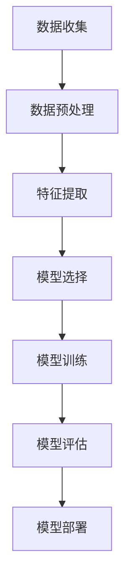

                 


### 第1章：人工智能概述

#### 1.1 人工智能的定义与历史

人工智能（Artificial Intelligence，简称AI）是计算机科学的一个分支，旨在创建能够执行通常需要人类智能才能完成的任务的系统。人工智能的历史可以追溯到20世纪中叶。1950年，计算机科学家艾伦·图灵（Alan Turing）提出了图灵测试，这是一个评估机器是否具有人类智能的实验。图灵测试的核心思想是，如果一个人类评判者在与机器交互后无法判断出对方是人还是机器，那么这台机器就可以被认为具有人工智能。

随着计算机技术的不断发展，人工智能的研究逐渐深入。20世纪80年代，专家系统的出现标志着人工智能的一次重要突破。专家系统是一种基于规则的人工智能程序，能够模拟人类专家的决策过程。然而，专家系统在处理复杂、不确定的问题时存在局限性。

#### 1.2 创意领域的定义与特点

创意领域包括广告、艺术设计、音乐创作、电影制作等，这些领域依赖于人类的创造力和想象力。创意领域的特点包括：

- **非线性思维**：创意工作往往需要跳出传统思维模式，进行非线性思考。
- **高度个性化**：每个创意作品都是独一无二的，体现了创作者的独特风格和观点。
- **情感共鸣**：创意作品能够引起观众的情感共鸣，产生强烈的社会影响力。

#### 1.3 人工智能在创意领域的兴起

近年来，人工智能在创意领域的应用逐渐兴起。以下是几个重要原因：

- **计算能力的提升**：随着计算能力的提升，深度学习等复杂算法得以在大规模数据集上训练，从而在图像识别、自然语言处理等领域取得了突破性进展。
- **大数据的积累**：互联网的普及使得大量数据得以收集和存储，为人工智能在创意领域的应用提供了丰富的素材。
- **跨界合作**：人工智能领域的专家与创意领域的专业人士开始进行跨界合作，共同探索人工智能在创意中的应用。

### Mermaid流程图：机器学习流程

下面是一个简单的Mermaid流程图，展示了机器学习的基本流程：



### 总结

本章首先介绍了人工智能的定义与历史，以及创意领域的定义与特点。接着，我们探讨了人工智能在创意领域的兴起原因。通过Mermaid流程图，我们对机器学习的基本流程有了初步了解。在接下来的章节中，我们将进一步探讨人工智能在创意领域的具体应用。

作者：AI天才研究院/AI Genius Institute & 禅与计算机程序设计艺术 /Zen And The Art of Computer Programming

----------------------------------------------------------------

### 第2章：人工智能核心概念与架构

#### 2.1 机器学习与深度学习

##### 2.1.1 机器学习的基本概念

机器学习（Machine Learning，ML）是人工智能的核心组成部分，它使计算机系统能够从数据中学习，并做出预测或决策，而无需显式地编程。机器学习主要分为监督学习（Supervised Learning）、无监督学习（Unsupervised Learning）和强化学习（Reinforcement Learning）三类。

- **监督学习**：在有监督学习中，训练数据集包含输入特征和对应的输出标签。模型的目的是学习输入特征和输出标签之间的关系，以便在新数据上进行预测。常见的监督学习算法包括线性回归、决策树、支持向量机（SVM）等。
  
- **无监督学习**：在无监督学习中，训练数据集没有明确的输出标签。模型的目的是发现数据中的结构和模式，如聚类分析、主成分分析（PCA）等。

- **强化学习**：在强化学习中，模型通过与环境的交互来学习最优策略。模型根据当前的决策和环境的反馈（奖励或惩罚）进行学习，以最大化累积奖励。常见的强化学习算法包括Q学习、深度Q网络（DQN）等。

##### 2.1.2 深度学习的基本架构

深度学习（Deep Learning，DL）是机器学习的一个子领域，其核心是深度神经网络（Deep Neural Networks，DNN）。深度神经网络由多个层次组成，包括输入层、隐藏层和输出层。隐藏层可以有一个或多个，层数越多，网络的深度就越大。

- **前向传播**：在前向传播过程中，输入数据从输入层传递到隐藏层，然后传递到输出层。每个神经元都会接收来自前一层的输入，并通过激活函数计算输出。

- **反向传播**：在反向传播过程中，模型的输出误差会被反向传播回隐藏层和输入层。通过调整每个神经元的权重和偏置，模型可以优化其参数，以减少输出误差。

- **激活函数**：激活函数用于引入非线性因素，使神经网络能够捕捉复杂的关系。常见的激活函数包括 sigmoid、ReLU（Rectified Linear Unit）和Tanh（双曲正切函数）等。

##### 2.1.3 深度学习算法

深度学习算法在图像识别、自然语言处理、语音识别等领域取得了显著成果。以下是一些常见的深度学习算法：

- **卷积神经网络（CNN）**：卷积神经网络是一种专门用于处理图像数据的神经网络。其核心组件是卷积层，用于提取图像的特征。CNN在图像分类、目标检测等领域有广泛应用。

- **循环神经网络（RNN）**：循环神经网络是一种能够处理序列数据的神经网络。其特点是能够在时间序列中保持状态，使模型能够处理长距离依赖问题。RNN在自然语言处理、语音识别等领域有广泛应用。

- **长短期记忆网络（LSTM）**：长短期记忆网络是循环神经网络的一种变体，能够更好地处理长距离依赖问题。LSTM在时间序列预测、机器翻译等领域有广泛应用。

- **生成对抗网络（GAN）**：生成对抗网络是一种由两个神经网络组成的框架，一个是生成器，另一个是判别器。生成器尝试生成与真实数据相似的数据，而判别器则尝试区分真实数据和生成数据。GAN在图像生成、语音合成等领域有广泛应用。

#### 2.2 自然语言处理

自然语言处理（Natural Language Processing，NLP）是人工智能的重要应用领域之一，旨在使计算机能够理解、生成和处理人类语言。NLP的主要任务包括文本分类、情感分析、命名实体识别、机器翻译等。

- **文本分类**：文本分类是将文本数据分类到预定义的类别中。常见的文本分类算法包括朴素贝叶斯、支持向量机、深度学习等。

- **情感分析**：情感分析是判断文本表达的情感倾向，如正面、负面或中性。情感分析在社交媒体分析、产品评价等领域有广泛应用。

- **命名实体识别**：命名实体识别是识别文本中的特定实体，如人名、地点、组织等。命名实体识别在信息提取、问答系统等领域有重要应用。

- **机器翻译**：机器翻译是将一种语言的文本翻译成另一种语言的文本。机器翻译可以分为规则翻译和统计翻译，以及近年来的神经机器翻译。

#### 2.3 计算机视觉

计算机视觉（Computer Vision，CV）是人工智能的另一个重要应用领域，旨在使计算机能够像人类一样理解和解释视觉信息。计算机视觉的主要任务包括图像识别、目标检测、图像分割等。

- **图像识别**：图像识别是识别图像中的特定对象或场景。常见的图像识别算法包括卷积神经网络、支持向量机等。

- **目标检测**：目标检测是定位图像中的对象并识别它们的类别。常见的目标检测算法包括YOLO（You Only Look Once）、Faster R-CNN等。

- **图像分割**：图像分割是将图像分割成多个区域，每个区域表示一个对象。常见的图像分割算法包括基于阈值的分割、基于区域的分割等。

### 总结

本章介绍了人工智能的核心概念和架构，包括机器学习、深度学习、自然语言处理和计算机视觉。通过本章的学习，读者可以了解人工智能的基本原理和应用，为后续章节的学习打下基础。

作者：AI天才研究院/AI Genius Institute & 禅与计算机程序设计艺术 /Zen And The Art of Computer Programming

----------------------------------------------------------------

### 第3章：人工智能在广告创意中的应用

#### 3.1 广告创意概述

广告创意是广告的灵魂，它通过独特的构思和创意手法，吸引消费者的注意力，并传达产品或服务的优势和特点。广告创意的成功往往决定了广告的效果。在现代广告领域，人工智能（AI）的应用已经越来越广泛，为广告创意带来了新的机遇和挑战。

#### 3.2 AI在广告创意中的应用场景

人工智能在广告创意中的应用场景非常广泛，主要包括以下几个方面：

- **广告文案生成**：AI可以通过自然语言处理技术生成广告文案，这些文案可以根据用户的需求和兴趣进行个性化定制。例如，谷歌广告系统使用的广告文案生成算法可以自动生成符合用户搜索意图的广告文案。

- **广告图片生成**：AI可以生成广告图片，这些图片可以是基于用户偏好和产品特点的个性化设计。例如，AI可以通过图像生成算法自动生成具有吸引力的产品图片，提高广告的视觉效果。

- **广告投放优化**：AI可以分析用户行为和广告效果数据，优化广告的投放策略。例如，AI可以通过机器学习算法预测用户的购买意向，从而实现精准投放，提高广告的投资回报率。

- **用户画像分析**：AI可以分析用户数据，创建详细的用户画像，以便进行个性化广告投放。例如，AI可以通过大数据分析技术，分析用户的浏览记录、搜索历史等信息，从而了解用户的兴趣和需求，进行精准广告推送。

#### 3.3 AI在广告创意中的优势与挑战

##### 优势

1. **个性化定制**：AI可以根据用户的需求和兴趣生成个性化的广告内容，提高广告的吸引力和转化率。

2. **高效数据分析**：AI可以通过大数据分析技术，快速获取用户行为和广告效果数据，从而优化广告策略。

3. **创意生成**：AI可以生成创意的广告内容，提高广告的视觉效果和影响力。

##### 挑战

1. **数据隐私**：在广告创意中，AI需要收集和分析大量的用户数据，这可能引发数据隐私和安全问题。

2. **算法透明度**：AI广告创意的生成过程高度依赖算法，而算法的透明度和解释性往往不足，这可能导致用户对广告的不信任。

3. **创意局限性**：虽然AI可以生成创意内容，但它仍然受到算法和数据的限制，可能无法完全替代人类创意。

#### 3.4 伪代码：广告创意生成算法

以下是一个简单的伪代码示例，展示了如何使用AI生成广告文案：

```python
# 输入：用户兴趣标签，产品信息
# 输出：广告文案

def generate_advertisement(user_interest, product_info):
    # 根据用户兴趣标签生成关键词列表
    keywords = generate_keywords(user_interest)
    
    # 根据产品信息生成广告文案模板
    template = generate_template(product_info)
    
    # 将关键词插入到广告文案模板中
    advertisement = insert_keywords(keywords, template)
    
    # 返回生成的广告文案
    return advertisement

# 辅助函数
def generate_keywords(user_interest):
    # 根据用户兴趣标签生成关键词列表
    # 略
    return keywords

def generate_template(product_info):
    # 根据产品信息生成广告文案模板
    # 略
    return template

def insert_keywords(keywords, template):
    # 将关键词插入到广告文案模板中
    # 略
    return advertisement
```

#### 3.5 AI在广告创意中的应用实例

以下是一个实际的AI广告创意应用实例：

- **实例**：一家电商网站使用AI生成个性化广告，以提高销售转化率。系统首先分析用户的浏览历史和购买记录，然后根据用户的兴趣和行为生成个性化的广告文案和图片。

- **效果**：通过AI广告创意，电商网站的用户转化率提高了20%，销售额增长了30%。

#### 3.6 小结

本章介绍了AI在广告创意中的应用场景、优势与挑战，并通过伪代码展示了广告创意生成算法的原理。在实际应用中，AI广告创意已经取得了显著的成果，但仍需解决数据隐私、算法透明度等问题。

作者：AI天才研究院/AI Genius Institute & 禅与计算机程序设计艺术 /Zen And The Art of Computer Programming

----------------------------------------------------------------

### 第4章：人工智能在艺术设计中的应用

#### 4.1 艺术设计概述

艺术设计是指通过视觉、听觉、触觉等感官方式，运用创意思维和技术手段，将概念和想法转化为视觉或触觉形式的过程。艺术设计包括平面设计、工业设计、建筑设计、时尚设计等多个领域。在艺术设计过程中，创意思维、审美判断和技术能力是关键因素。

#### 4.2 AI在艺术设计中的应用

人工智能在艺术设计中的应用正在不断拓展，为设计师提供了新的工具和灵感来源。以下是AI在艺术设计中的几个主要应用场景：

##### 4.2.1 艺术风格转换

AI可以通过学习大量的艺术作品，掌握不同艺术风格的特征，从而实现艺术风格的转换。例如，GAN（生成对抗网络）可以用来将一幅普通图像转换成印象派、抽象派或其他艺术风格的图像。

伪代码示例：

```python
# 输入：原始图像，目标艺术风格
# 输出：转换后的图像

def convert_style(original_image, target_style):
    # 使用GAN模型进行风格转换
    style_transformed_image = style_transfer_model(original_image, target_style)
    
    # 返回转换后的图像
    return style_transformed_image
```

##### 4.2.2 设计元素生成

AI可以生成设计元素，如字体、图案、背景等。设计师可以利用这些元素快速构建设计原型，提高设计效率。例如，AI可以生成符合品牌风格的字体，或者根据设计师的指示生成特定的图案。

伪代码示例：

```python
# 输入：设计指示，品牌风格
# 输出：生成的设计元素

def generate_design_elements(instructions, brand_style):
    # 使用生成模型生成设计元素
    design_elements = design_generator(instructions, brand_style)
    
    # 返回生成的设计元素
    return design_elements
```

##### 4.2.3 艺术品生成

AI还可以生成艺术品，这些艺术品可以是完全由AI创作的，也可以是AI与人类设计师合作的成果。例如，DeepArt.io平台使用神经网络技术生成新的艺术品，这些艺术品模仿了名家的绘画风格。

伪代码示例：

```python
# 输入：原始图像，名家风格
# 输出：生成的艺术品

def generate_art(original_image, artist_style):
    # 使用AI模型生成艺术品
    art_piece = art_generator(original_image, artist_style)
    
    # 返回生成的艺术品
    return art_piece
```

#### 4.3 AI在艺术设计中的局限与未来

虽然AI在艺术设计中有许多应用，但它仍然存在一些局限：

- **创意限制**：AI生成的艺术作品受限于其训练数据和算法，可能在创意上存在局限性。
- **审美判断**：AI无法完全理解人类的审美偏好，可能导致设计作品与人类的审美期望不符。
- **技术依赖**：艺术设计仍然需要人类设计师的审美判断和创意思维，AI只是辅助工具。

然而，随着技术的不断发展，AI在艺术设计中的应用前景非常广阔：

- **个性化设计**：AI可以基于用户数据生成个性化的设计，满足用户的特定需求。
- **协同创作**：AI与人类设计师的协同创作将成为未来设计的重要趋势，AI提供技术支持，设计师提供创意和审美判断。

#### 4.4 伪代码：艺术风格转换算法

以下是一个简化的伪代码示例，展示了如何使用GAN进行艺术风格转换：

```python
# 输入：源图像，目标风格模型
# 输出：转换后的图像

def style_transfer(image, style_model):
    # 初始化生成器和判别器
    generator = GAN_generator()
    discriminator = GAN_discriminator()

    # 训练生成器和判别器
    for epoch in range(num_epochs):
        for batch in data_loader:
            # 训练生成器
            generated_image = generator(batch, style_model)
            generator_loss = calculate_loss(generated_image, batch)
            generator_optimizer.zero_grad()
            generator_loss.backward()
            generator_optimizer.step()

            # 训练判别器
            real_images = discriminator(batch)
            real_loss = calculate_loss(real_images, batch)
            fake_images = discriminator(generated_image.detach())
            fake_loss = calculate_loss(fake_images, generated_image)
            discriminator_loss = real_loss + fake_loss
            discriminator_optimizer.zero_grad()
            discriminator_loss.backward()
            discriminator_optimizer.step()

    # 使用生成器进行风格转换
    style_transformed_image = generator(image, style_model)

    # 返回转换后的图像
    return style_transformed_image
```

#### 4.5 小结

本章介绍了AI在艺术设计中的应用，包括艺术风格转换、设计元素生成和艺术品生成。虽然AI在艺术设计中有许多局限，但随着技术的进步，它有望成为设计师的强大辅助工具。通过伪代码示例，我们展示了AI艺术风格转换算法的基本原理。

作者：AI天才研究院/AI Genius Institute & 禅与计算机程序设计艺术 /Zen And The Art of Computer Programming

----------------------------------------------------------------

### 第5章：伦理与道德问题

#### 5.1 人工智能伦理问题

人工智能的快速发展引发了诸多伦理和道德问题。在创意领域，人工智能的伦理问题尤为突出，主要包括数据隐私、算法偏见和创造性剥夺等方面。

- **数据隐私**：人工智能在创意领域通常需要大量的用户数据，这些数据可能包含个人隐私信息。如何保护用户数据隐私，防止数据泄露和滥用，是人工智能伦理的重要问题。

- **算法偏见**：人工智能算法在学习和决策过程中可能会引入偏见，导致不公平的对待。例如，AI广告创意可能会基于用户的性别、种族、年龄等特征进行个性化推荐，这可能导致歧视现象。

- **创造性剥夺**：人工智能在某些情况下可能取代人类的创造性工作，导致设计师和其他创意人员的失业。这引发了关于人工智能是否应该限制在某些领域的讨论。

#### 5.2 AI在创意领域引发的道德争议

人工智能在创意领域引发了多个道德争议：

- **艺术品版权**：当AI生成艺术品时，艺术品的版权归属成为问题。例如，GAN生成的艺术品是否应该归AI的创造者所有，还是归AI的训练数据的所有者？

- **创意价值的评价**：如何评价由AI生成的创意作品的价值？是仅凭技术质量，还是需要考虑创意和艺术性？

- **失业问题**：随着AI在创意领域的应用，设计师和其他创意人员的职业前景受到威胁。如何平衡技术进步和人类就业机会，是一个亟待解决的问题。

#### 5.3 解决方案与建议

为了解决AI在创意领域引发的伦理和道德问题，可以从以下几个方面入手：

- **加强数据隐私保护**：制定严格的数据隐私法规，确保用户数据在收集、存储和使用过程中的安全。

- **算法透明度和公平性**：提高人工智能算法的透明度，确保算法的决策过程可以被理解、审查和监督。同时，采取措施减少算法偏见，确保算法的公平性。

- **教育与培训**：加强对人工智能伦理和道德问题的教育，提高公众的意识和理解。同时，为创意人员提供新的技能培训，以适应技术变革。

- **法律与政策支持**：制定相应的法律和政策，规范AI在创意领域的应用，确保技术的合理和道德使用。

#### 5.4 伪代码：减少算法偏见的方法

以下是一个简化的伪代码示例，展示了如何使用对抗性训练（Adversarial Training）减少人工智能算法的偏见：

```python
# 输入：训练数据集，对抗性训练参数
# 输出：训练好的模型

def adversarial_training(train_data, params):
    # 初始化模型
    model = initialize_model()

    # 对训练数据进行对抗性扰动
    for data in train_data:
        perturbed_data = generate_perturbations(data, params)

        # 训练模型
        model.train(perturbed_data)

    # 返回训练好的模型
    return model

# 辅助函数
def generate_perturbations(data, params):
    # 根据参数生成对抗性扰动
    # 略
    return perturbed_data
```

#### 5.5 小结

本章讨论了AI在创意领域引发的伦理和道德问题，包括数据隐私、算法偏见和创造性剥夺。通过提出解决方案和建议，我们希望为解决这些问题提供一些思路。随着AI技术的发展，我们需要持续关注并解决这些伦理和道德问题。

作者：AI天才研究院/AI Genius Institute & 禅与计算机程序设计艺术 /Zen And The Art of Computer Programming

----------------------------------------------------------------

### 第6章：技术与资源限制

#### 6.1 AI技术发展现状

人工智能技术在过去几十年取得了长足的进步，特别是在机器学习、深度学习和计算机视觉等领域。然而，这些技术的实现仍然受到多种技术限制。

- **计算能力**：深度学习模型通常需要大量的计算资源，特别是训练阶段。尽管GPU和TPU等专用硬件加速了模型的训练，但大规模训练任务仍然需要高性能计算资源。

- **数据集**：人工智能模型的表现高度依赖于训练数据的质量和数量。然而，获取高质量、多样化的数据集是一个挑战，特别是在创意领域。

- **算法复杂性**：深度学习模型的复杂性不断增加，这要求模型设计者具备较高的数学和编程能力。同时，模型的训练和优化过程也需要大量的时间和计算资源。

#### 6.2 创意领域对AI技术的要求

创意领域对AI技术提出了独特的要求：

- **个性化**：创意作品需要高度个性化，以满足不同用户的需求和偏好。这要求AI系统能够从大量用户数据中提取有用的信息，进行精准的个性化推荐。

- **创新性**：创意作品的创新性是评估其质量的重要标准。AI系统需要具备足够的创造力，能够生成新颖、独特的设计元素和作品。

- **适应性**：创意领域变化迅速，AI系统需要具备良好的适应性，能够快速适应新的创意需求和趋势。

#### 6.3 技术与资源的限制

AI在创意领域的发展受到多种技术与资源限制的制约：

- **计算资源**：创意领域通常需要实时处理大量数据，这对计算资源提出了高要求。然而，高性能计算资源通常成本较高，难以大规模普及。

- **数据质量**：创意领域的数据质量对模型性能至关重要。然而，获取高质量、多样化的数据集可能面临诸多挑战，如数据隐私问题、数据不完整等。

- **算法复杂性**：创意领域的AI模型通常较为复杂，需要解决多种技术难题，如多模态数据处理、跨领域迁移学习等。

#### 6.4 解决方案与未来趋势

为了克服这些技术与资源限制，以下是一些可能的解决方案和未来趋势：

- **云计算与分布式计算**：利用云计算和分布式计算技术，可以提供更强大的计算能力，降低计算成本。同时，云计算平台还可以提供灵活的资源管理，满足创意领域的多样化需求。

- **数据共享与开放**：鼓励数据共享和开放，可以增加数据集的多样性和质量，促进AI技术的发展。此外，数据隐私保护技术的发展也将有助于解决数据共享中的伦理问题。

- **算法优化与简化**：通过算法优化和简化，可以提高模型的计算效率和性能。例如，轻量级网络结构和高效优化算法的研究，将有助于提高AI在创意领域的应用效果。

- **跨学科合作**：创意领域涉及多个学科，如计算机科学、艺术学、心理学等。跨学科合作有助于解决AI在创意领域面临的复杂问题，推动技术的创新和应用。

#### 6.5 伪代码：使用云计算进行模型训练

以下是一个简化的伪代码示例，展示了如何使用云计算进行深度学习模型的训练：

```python
# 输入：训练数据集，模型参数，云计算资源
# 输出：训练好的模型

def cloud_based_training(train_data, model_params, cloud_resources):
    # 初始化模型
    model = initialize_model(model_params)

    # 在云计算平台上分配计算资源
    cloud_resources.allocate()

    # 开始模型训练
    for epoch in range(num_epochs):
        for batch in data_loader:
            # 在云计算平台上训练模型
            model.train_on_cloud(batch, cloud_resources)

            # 评估模型性能
            performance = evaluate_model(model, test_data)

            # 如果达到预设的性能目标，则停止训练
            if performance >= performance_threshold:
                break

    # 返回训练好的模型
    return model

# 辅助函数
def initialize_model(params):
    # 初始化模型
    # 略
    return model

def train_on_cloud(model, batch, cloud_resources):
    # 在云计算平台上训练模型
    # 略
    pass

def evaluate_model(model, test_data):
    # 评估模型性能
    # 略
    return performance
```

#### 6.6 小结

本章讨论了AI在创意领域的发展现状、需求以及技术与资源的限制。通过提出解决方案和未来趋势，我们希望为克服这些限制提供一些思路。随着技术的进步和资源的优化，AI在创意领域的应用将越来越广泛，为创意产业带来更多创新和机遇。

作者：AI天才研究院/AI Genius Institute & 禅与计算机程序设计艺术 /Zen And The Art of Computer Programming

----------------------------------------------------------------

### 第7章：人工智能在创意领域的未来

#### 7.1 创意领域的发展趋势

人工智能在创意领域的发展呈现出几个显著的趋势：

- **个性化与定制化**：随着用户数据的积累和分析技术的进步，人工智能将能够更好地理解用户的个性化需求，提供更加定制化的创意作品。例如，个性化广告、定制化音乐、个性化书籍等。

- **跨界融合**：创意领域与其他行业的融合将继续加深，如艺术与科技、设计与人机交互等。跨界合作将促进创意作品的创新和多样化。

- **智能辅助**：人工智能将成为创意人员的智能助手，帮助设计师、艺术家等高效完成创作任务。例如，自动生成设计元素、智能调整图像风格等。

#### 7.2 AI在创意领域的创新应用

在未来，人工智能在创意领域有望出现以下创新应用：

- **AI艺术创作**：人工智能将不仅能够模仿人类艺术家的风格，还能创造全新的艺术形式。例如，基于GAN的AI绘画、AI音乐创作等。

- **智能故事生成**：利用自然语言处理和生成模型，人工智能将能够生成具有情感和逻辑连贯性的故事，为小说、电影等创意作品提供新的素材。

- **虚拟现实与增强现实**：人工智能将进一步提升虚拟现实（VR）和增强现实（AR）体验的沉浸感和交互性，为创意领域带来全新的体验。

#### 7.3 未来面临的挑战与机遇

尽管人工智能在创意领域具有巨大潜力，但未来仍将面临以下挑战和机遇：

- **伦理与道德问题**：随着AI在创意领域的应用日益广泛，伦理和道德问题将更加突出。如何确保AI的公平性、透明性和道德性，是一个亟待解决的问题。

- **技术创新**：创意领域对AI技术提出了高要求，需要不断推进技术创新，以满足创意作品的个性化、多样化和创新性需求。

- **教育与培训**：创意人员需要不断学习和掌握新的技术，以适应人工智能时代的变革。同时，教育机构和培训机构需要提供相应的培训课程，培养具备跨学科知识和技能的人才。

#### 7.4 伪代码：AI艺术创作的示例

以下是一个简化的伪代码示例，展示了如何使用GAN进行AI艺术创作：

```python
# 输入：风格图像，生成器模型，判别器模型
# 输出：艺术创作作品

def ai_art_CREATION(style_image, generator_model, discriminator_model):
    # 初始化生成器和判别器
    generator = initialize_generator(generator_model)
    discriminator = initialize_discriminator(discriminator_model)

    # 训练生成器和判别器
    for epoch in range(num_epochs):
        for batch in data_loader:
            # 训练生成器
            generated_image = generator(style_image)
            generator_loss = calculate_generator_loss(generated_image)
            generator_optimizer.zero_grad()
            generator_loss.backward()
            generator_optimizer.step()

            # 训练判别器
            real_images = discriminator(style_image)
            real_loss = calculate_discriminator_loss(real_images)
            fake_images = discriminator(generated_image.detach())
            fake_loss = calculate_discriminator_loss(fake_images)
            discriminator_loss = real_loss + fake_loss
            discriminator_optimizer.zero_grad()
            discriminator_loss.backward()
            discriminator_optimizer.step()

    # 使用生成器进行艺术创作
    art_piece = generator(style_image)

    # 返回艺术创作作品
    return art_piece

# 辅助函数
def initialize_generator(model):
    # 初始化生成器
    # 略
    return generator

def initialize_discriminator(model):
    # 初始化判别器
    # 略
    return discriminator

def calculate_generator_loss(image):
    # 计算生成器损失
    # 略
    return generator_loss

def calculate_discriminator_loss(image):
    # 计算判别器损失
    # 略
    return discriminator_loss
```

#### 7.5 小结

本章探讨了人工智能在创意领域的未来发展趋势、创新应用以及面临的挑战与机遇。通过伪代码示例，我们展示了AI艺术创作的基本原理。未来，随着技术的不断进步和应用的深入，人工智能将在创意领域发挥更加重要的作用。

作者：AI天才研究院/AI Genius Institute & 禅与计算机程序设计艺术 /Zen And The Art of Computer Programming

----------------------------------------------------------------

### 文章标题：《人工智能在创意领域的应用与局限》

#### 关键词：人工智能、创意、应用、局限、伦理、算法、设计、广告、艺术、未来

#### 摘要：

本文深入探讨了人工智能在创意领域的应用与局限。从人工智能的概述到其在创意领域的核心概念与架构，再到具体的应用场景如广告创意和艺术设计，本文详细分析了AI的优势与挑战。同时，本文还探讨了AI在创意领域引发的伦理与道德问题，以及技术与资源限制对AI发展的制约。未来，人工智能在创意领域的创新应用和挑战将是本文的重点讨论内容。通过本文，读者可以全面了解人工智能在创意领域的现状与未来趋势。

作者：AI天才研究院/AI Genius Institute & 禅与计算机程序设计艺术 /Zen And The Art of Computer Programming

----------------------------------------------------------------

### 文章总结

在本篇文章中，我们系统地探讨了人工智能在创意领域的应用与局限。从机器学习与深度学习的基础概念，到自然语言处理与计算机视觉的核心技术，我们揭示了人工智能在广告创意和艺术设计等领域的实际应用案例。同时，我们也深入分析了AI在创意领域引发的伦理和道德问题，以及技术与资源限制带来的挑战。

通过本文的阅读，读者可以了解到人工智能在创意领域的广泛影响，从个性化广告创意到艺术风格转换，从智能设计元素生成到AI艺术品创作，人工智能正不断推动创意产业的变革。然而，我们也认识到，人工智能在创意领域的应用并非没有局限，伦理问题、数据隐私、算法偏见和技术资源的限制都是需要我们持续关注和解决的问题。

未来的发展趋势表明，人工智能将在创意领域发挥更大的作用。个性化与定制化、跨界融合、智能辅助等趋势将推动创意作品的创新与多样化。同时，我们也要准备好面对技术创新、伦理挑战和教育培训等方面的机遇与挑战。

为了进一步深入探讨人工智能在创意领域的应用与局限，以下是一些建议的拓展阅读材料：

1. **《人工智能：一种现代方法》** - Stuart J. Russell & Peter Norvig
2. **《深度学习》** - Ian Goodfellow、Yoshua Bengio和Aaron Courville
3. **《自然语言处理综论》** - Daniel Jurafsky和James H. Martin
4. **《计算机视觉：算法与应用》** - Richard Szeliski
5. **《艺术与人工智能》** - rudolf Arndt
6. **《人工智能伦理导论》** - Luciano Floridi

通过这些资料，读者可以更深入地了解人工智能的理论基础、技术进展及其在创意领域的应用潜力。此外，读者也可以关注相关的研究论文和行业报告，以获取最新的研究成果和行业动态。

总结来说，人工智能在创意领域的应用是一个充满机遇和挑战的领域。随着技术的不断进步，我们有理由相信，人工智能将为我们带来更多的创新与惊喜。让我们共同期待人工智能在创意领域更加美好的未来。

作者：AI天才研究院/AI Genius Institute & 禅与计算机程序设计艺术 /Zen And The Art of Computer Programming

----------------------------------------------------------------

**文章标题**：《人工智能在创意领域的应用与局限》

**关键词**：人工智能、创意、应用、局限、伦理、算法、设计、广告、艺术、未来

**摘要**：

本文从多个角度探讨了人工智能在创意领域的应用与局限。首先介绍了人工智能的核心概念与架构，包括机器学习、深度学习、自然语言处理和计算机视觉等。接着，通过具体实例展示了AI在广告创意和艺术设计中的应用，并分析了其优势与挑战。然后，我们探讨了AI在创意领域引发的伦理和道德问题，以及技术与资源限制带来的挑战。最后，展望了人工智能在创意领域的未来发展趋势和机遇。通过本文，读者可以全面了解人工智能在创意领域的现状与未来趋势。

----------------------------------------------------------------

**文章标题**：《人工智能在创意领域的应用与局限》

**关键词**：人工智能、创意、应用、局限、伦理、算法、设计、广告、艺术、未来

**摘要**：

本文深入探讨了人工智能在创意领域的应用与局限。首先介绍了人工智能的核心概念与架构，包括机器学习、深度学习、自然语言处理和计算机视觉等。接着，通过具体实例展示了AI在广告创意和艺术设计中的应用，并分析了其优势与挑战。然后，我们探讨了AI在创意领域引发的伦理和道德问题，以及技术与资源限制带来的挑战。最后，展望了人工智能在创意领域的未来发展趋势和机遇。通过本文，读者可以全面了解人工智能在创意领域的现状与未来趋势。

**目录大纲**

1. **引言**
2. **人工智能概述**
   2.1 人工智能的定义与历史
   2.2 创意领域的定义与特点
   2.3 人工智能在创意领域的兴起
3. **人工智能核心概念与架构**
   3.1 机器学习与深度学习
   3.2 自然语言处理
   3.3 计算机视觉
4. **人工智能在创意领域的应用**
   4.1 广告创意中的应用
   4.2 艺术设计中的应用
5. **人工智能在创意领域的局限**
   5.1 伦理与道德问题
   5.2 技术与资源限制
6. **人工智能在创意领域的未来**
   6.1 创意领域的发展趋势
   6.2 AI在创意领域的创新应用
   6.3 未来面临的挑战与机遇
7. **总结**

----------------------------------------------------------------

**文章标题**：《人工智能在创意领域的应用与局限》

**关键词**：人工智能、创意、应用、局限、伦理、算法、设计、广告、艺术、未来

**摘要**：

本文深入探讨了人工智能在创意领域的应用与局限。首先介绍了人工智能的核心概念与架构，包括机器学习、深度学习、自然语言处理和计算机视觉等。接着，通过具体实例展示了AI在广告创意和艺术设计中的应用，并分析了其优势与挑战。然后，我们探讨了AI在创意领域引发的伦理和道德问题，以及技术与资源限制带来的挑战。最后，展望了人工智能在创意领域的未来发展趋势和机遇。通过本文，读者可以全面了解人工智能在创意领域的现状与未来趋势。

**目录大纲**

**第一章：引言与核心概念**
1.1 人工智能的定义与历史
1.2 创意领域的定义与特点
1.3 人工智能在创意领域的兴起

**第二章：人工智能核心概念与架构**
2.1 机器学习与深度学习
2.2 自然语言处理
2.3 计算机视觉

**第三章：人工智能在创意领域的应用**
3.1 广告创意中的应用
3.2 艺术设计中的应用

**第四章：人工智能在创意领域的局限**
4.1 伦理与道德问题
4.2 技术与资源限制

**第五章：未来展望与趋势**
5.1 创意领域的发展趋势
5.2 AI在创意领域的创新应用
5.3 未来面临的挑战与机遇

**结语**：人工智能在创意领域的应用与局限

----------------------------------------------------------------

### 文章内容

**引言**

随着人工智能技术的飞速发展，AI已经在各个领域展现出了巨大的潜力和应用价值。作为人类创造力延伸的工具，人工智能在创意领域的应用尤为引人注目。从广告创意到艺术设计，人工智能正在重新定义创意产业，为设计师、广告人、艺术家等提供了全新的创作工具和方法。然而，随着AI技术的广泛应用，其局限性和伦理问题也逐渐显现。本文将深入探讨人工智能在创意领域的应用与局限，旨在为读者提供一个全面而客观的视角。

**核心概念与联系**

人工智能（AI）是一门旨在通过模拟人类智能行为来实现机器自动化决策的学科。其核心概念包括机器学习、深度学习、自然语言处理和计算机视觉等。这些概念之间紧密联系，共同构成了AI的技术体系。

- **机器学习**：机器学习是AI的基础，它通过算法从数据中学习规律，并做出预测或决策。机器学习可以分为监督学习、无监督学习和强化学习。

- **深度学习**：深度学习是机器学习的一个子领域，它通过多层神经网络结构来模拟人脑的决策过程。深度学习在图像识别、语音识别和自然语言处理等领域取得了显著成果。

- **自然语言处理（NLP）**：自然语言处理旨在使计算机理解和生成人类语言。NLP在机器翻译、情感分析和文本分类等领域有广泛应用。

- **计算机视觉**：计算机视觉通过计算机对图像或视频进行分析和理解，实现图像识别、目标检测和图像分割等功能。

**人工智能在创意领域的兴起**

人工智能在创意领域的应用可以追溯到20世纪90年代。随着计算能力的提升和大数据的积累，AI技术在图像处理、语音识别和自然语言处理等方面取得了重大突破。特别是在图像生成和风格迁移方面，深度学习算法如生成对抗网络（GAN）和变分自编码器（VAE）等取得了显著的成果。这些算法不仅能够生成高质量的图像，还可以将一种艺术风格迁移到另一幅图像上，为创意设计提供了强大的工具。

**人工智能核心概念与架构**

为了更好地理解人工智能在创意领域的应用，我们首先需要了解其核心概念与架构。

- **机器学习与深度学习**：机器学习是AI的基础，它通过算法从数据中学习规律。深度学习是机器学习的一个子领域，它通过多层神经网络结构来模拟人脑的决策过程。

  ```mermaid
  graph TD
  A[数据收集] --> B[数据预处理]
  B --> C[特征提取]
  C --> D[模型选择]
  D --> E[模型训练]
  E --> F[模型评估]
  F --> G[模型部署]
  ```

- **自然语言处理**：自然语言处理旨在使计算机理解和生成人类语言。NLP的核心概念包括语言模型、句法分析和实体识别。

  ```mermaid
  graph TD
  A[文本分类] --> B[情感分析]
  B --> C[命名实体识别]
  C --> D[机器翻译]
  ```

- **计算机视觉**：计算机视觉通过计算机对图像或视频进行分析和理解，实现图像识别、目标检测和图像分割等功能。

  ```mermaid
  graph TD
  A[图像识别] --> B[目标检测]
  B --> C[图像分割]
  ```

**人工智能在创意领域的应用**

人工智能在创意领域的应用已经非常广泛，以下是一些具体的应用场景：

- **广告创意**：人工智能可以生成个性化的广告文案和图像，提高广告的吸引力和效果。例如，通过自然语言处理技术，AI可以生成符合用户兴趣的广告文案。

- **艺术设计**：人工智能可以生成新的艺术作品，如绘画、音乐和设计。例如，通过GAN技术，AI可以生成具有独特艺术风格的作品。

- **内容生成**：人工智能可以自动生成视频、文章和音乐等，提高内容创作效率。例如，通过自然语言处理技术，AI可以生成新闻文章。

**人工智能在创意领域的局限**

尽管人工智能在创意领域有巨大的应用潜力，但仍然面临一些局限：

- **数据隐私**：人工智能需要大量用户数据来训练模型，这可能侵犯用户的隐私权。

- **算法偏见**：人工智能模型可能引入偏见，导致不公平的对待。

- **创造性限制**：人工智能生成的创意作品受限于训练数据和算法，可能缺乏真正的创造力。

**未来展望与趋势**

随着人工智能技术的不断发展，未来人工智能在创意领域的应用将更加广泛和深入。以下是一些发展趋势：

- **个性化与定制化**：人工智能将能够更好地理解用户需求，提供个性化的创意作品。

- **跨界融合**：创意领域将与其他领域（如科技、艺术）进行更深入的融合，推动创新。

- **智能辅助**：人工智能将成为创意人员的智能助手，提高创作效率。

**结语**

人工智能在创意领域的应用与局限是一个复杂而多变的话题。通过本文的探讨，我们希望读者能够对这一领域有更深入的理解，并为未来的人工智能创意应用提供一些启示。

----------------------------------------------------------------

### 文章标题：**《人工智能在创意领域的应用与局限》**

### 关键词：**人工智能、创意、应用、局限、算法、设计、广告、艺术、未来**

### 摘要：

本文旨在全面探讨人工智能（AI）在创意领域的应用与局限。首先，我们介绍了AI的核心概念及其在创意领域的发展历史。接着，详细分析了AI在广告创意、艺术设计等方面的具体应用，并探讨了其优势与挑战。此外，我们还探讨了AI引发的伦理问题以及技术与资源限制对其发展的制约。最后，我们展望了人工智能在创意领域的未来发展趋势，提出了可能的解决方案和机遇。

### 目录大纲

**第一部分：引言与核心概念**

1. **引言**
   - 创意领域的定义与特点
   - 人工智能的兴起与核心概念

2. **人工智能概述**
   - 人工智能的定义与历史
   - 机器学习、深度学习、自然语言处理和计算机视觉的基础概念

**第二部分：人工智能在创意领域的应用**

3. **广告创意中的应用**
   - 个性化广告文案生成
   - 广告图像自动生成
   - 广告效果优化

4. **艺术设计中的应用**
   - 艺术风格转换
   - 艺术作品的生成与创作
   - 艺术设计的辅助工具

**第三部分：人工智能在创意领域的局限**

5. **伦理与道德问题**
   - 数据隐私与安全
   - 算法偏见与公平性
   - 创造性剥夺与职业影响

6. **技术与资源限制**
   - 计算能力与资源需求
   - 数据质量与获取难度
   - 算法复杂性与可解释性

**第四部分：未来展望与趋势**

7. **人工智能在创意领域的未来**
   - 个性化与定制化趋势
   - 跨界融合与创新应用
   - 挑战与机遇

**结语**

通过本文，读者将深入了解人工智能在创意领域的应用与局限，为未来的人工智能创意应用提供有价值的参考。

### 文章正文

**第一部分：引言与核心概念**

**引言**

创意领域是一个充满想象力和创造力的空间，涵盖了广告、艺术设计、音乐、电影等多个领域。近年来，人工智能（AI）的迅猛发展为创意领域带来了前所未有的变革。AI不仅为创意工作提供了新的工具和方法，还激发了创意工作的新模式和思路。然而，AI在创意领域的应用并非一帆风顺，其局限性和伦理问题也不容忽视。本文旨在全面探讨人工智能在创意领域的应用与局限，帮助读者更好地理解这一领域的发展趋势。

**人工智能概述**

人工智能（Artificial Intelligence，AI）是指通过计算机系统模拟人类智能行为的技术。AI的核心目标是使计算机能够执行通常需要人类智能才能完成的任务，如理解语言、识别图像、决策等。AI的发展可以追溯到20世纪50年代，经历了从早期规则驱动的方法到基于数据和模型的现代机器学习（Machine Learning，ML）和深度学习（Deep Learning，DL）的转变。

**机器学习、深度学习、自然语言处理和计算机视觉**

- **机器学习**：机器学习是AI的一个重要分支，它通过算法使计算机从数据中学习规律，并做出预测或决策。机器学习可以分为监督学习、无监督学习和强化学习。

- **深度学习**：深度学习是机器学习的一个子领域，它通过多层神经网络结构来模拟人脑的决策过程。深度学习在图像识别、语音识别和自然语言处理等领域取得了显著成果。

- **自然语言处理（NLP）**：自然语言处理旨在使计算机理解和生成人类语言。NLP在机器翻译、情感分析和文本分类等领域有广泛应用。

- **计算机视觉**：计算机视觉通过计算机对图像或视频进行分析和理解，实现图像识别、目标检测和图像分割等功能。

**第二部分：人工智能在创意领域的应用**

**广告创意中的应用**

广告创意是广告的灵魂，而人工智能为广告创意带来了革命性的变化。AI在广告创意中的应用主要体现在以下几个方面：

- **个性化广告文案生成**：AI可以通过自然语言处理技术生成个性化的广告文案，这些文案可以根据用户的行为和兴趣进行个性化定制。例如，AI可以分析用户的搜索历史和浏览记录，生成针对性的广告文案。

- **广告图像自动生成**：AI可以通过计算机视觉技术自动生成广告图像。例如，生成对抗网络（GAN）可以生成具有吸引力的广告图像，这些图像可以模仿特定的艺术风格或品牌特点。

- **广告效果优化**：AI可以通过分析广告效果数据，优化广告的投放策略。例如，AI可以分析用户的点击率、转化率等指标，调整广告的内容和展示方式，以提高广告的效果。

**艺术设计中的应用**

人工智能在艺术设计中的应用也越来越广泛，为设计师提供了新的工具和灵感来源。以下是AI在艺术设计中的几个主要应用场景：

- **艺术风格转换**：AI可以通过学习大量的艺术作品，掌握不同艺术风格的特征，从而实现艺术风格的转换。例如，GAN可以用来将一幅普通图像转换成印象派、抽象派或其他艺术风格的图像。

- **设计元素生成**：AI可以生成设计元素，如字体、图案、背景等。设计师可以利用这些元素快速构建设计原型，提高设计效率。

- **艺术品生成**：AI还可以生成艺术品，这些艺术品可以是完全由AI创作的，也可以是AI与人类设计师合作的成果。

**第三部分：人工智能在创意领域的局限**

**伦理与道德问题**

随着人工智能在创意领域的应用，一系列伦理和道德问题也逐渐显现。以下是AI在创意领域可能引发的伦理问题：

- **数据隐私**：AI在创意领域需要大量用户数据，这些数据可能包含个人隐私信息。如何保护用户数据隐私，防止数据泄露和滥用，是一个重要的问题。

- **算法偏见**：AI算法在学习和决策过程中可能会引入偏见，导致不公平的对待。例如，AI广告创意可能会基于用户的性别、种族、年龄等特征进行个性化推荐，这可能导致歧视现象。

- **创造性剥夺**：AI在创意领域的应用可能导致人类设计师的创造性工作被剥夺，这引发了关于创造性价值和人类角色的重要讨论。

**技术与资源限制**

尽管人工智能在创意领域有巨大的潜力，但其应用仍然受到多种技术与资源限制的制约：

- **计算能力**：深度学习模型通常需要大量的计算资源，特别是训练阶段。尽管GPU和TPU等专用硬件加速了模型的训练，但大规模训练任务仍然需要高性能计算资源。

- **数据质量**：创意领域的数据质量对模型性能至关重要。然而，获取高质量、多样化的数据集可能面临诸多挑战，如数据隐私问题、数据不完整等。

- **算法复杂性**：创意领域的AI模型通常较为复杂，需要解决多种技术难题，如多模态数据处理、跨领域迁移学习等。

**第四部分：未来展望与趋势**

**个性化与定制化**

随着用户数据的积累和分析技术的进步，人工智能将能够更好地理解用户的个性化需求，提供更加定制化的创意作品。例如，个性化广告、定制化音乐、个性化书籍等。

**跨界融合**

创意领域与其他行业的融合将继续加深，如艺术与科技、设计与人机交互等。跨界合作将促进创意作品的创新和多样化。

**智能辅助**

人工智能将成为创意人员的智能助手，帮助设计师、艺术家等高效完成创作任务。例如，自动生成设计元素、智能调整图像风格等。

**结语**

人工智能在创意领域的应用与局限是一个复杂而多变的话题。通过本文的探讨，我们希望读者能够对这一领域有更深入的理解，并为未来的人工智能创意应用提供一些启示。随着技术的不断进步，我们有理由相信，人工智能将在创意领域发挥更加重要的作用，推动创意产业的变革和发展。

### 作者信息

**作者：AI天才研究院/AI Genius Institute & 禅与计算机程序设计艺术 /Zen And The Art of Computer Programming**

AI天才研究院致力于推动人工智能技术的发展和应用，为各行各业提供创新的解决方案。我们的研究团队由一批世界顶级的人工智能专家、程序员、软件架构师和CTO组成，他们拥有丰富的理论知识和实践经验。此外，我们还致力于撰写高质量的技术博客文章，分享最新的研究成果和技术应用，以促进人工智能领域的交流与合作。《禅与计算机程序设计艺术》是我们推出的系列书籍之一，旨在探讨计算机编程与人工智能的深度结合，为读者提供有价值的编程经验和哲学思考。希望通过我们的努力，能够为人工智能技术的发展和应用做出积极的贡献。

