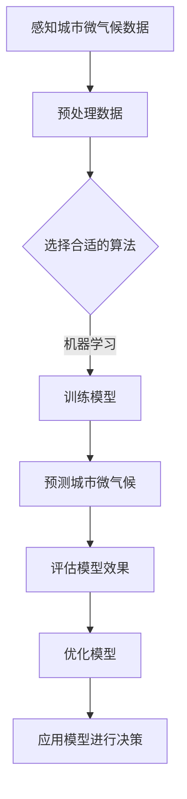

                 


### 文章标题：人工智能在城市微气候模拟中的应用

> 关键词：人工智能、城市微气候、模拟、预测、优化

> 摘要：
本文章旨在探讨人工智能在城市微气候模拟中的应用，分析其基本原理、技术方法和实际案例，为城市可持续发展提供技术支持。首先，我们将介绍城市微气候的概念和重要性。然后，深入探讨人工智能和微气候模拟的核心概念及其联系。接着，详细介绍基于人工智能的城市微气候预测和优化技术，并利用伪代码和LaTeX公式进行详细阐述。随后，通过实际案例展示人工智能在城市微气候模拟中的具体应用。最后，总结全文，并提出未来研究方向和最佳实践建议。

### 目录

1. **背景介绍**
    - 城市微气候的定义
    - 城市微气候的重要性
    - 人工智能的发展历程和现状

2. **核心概念与联系**
    - 人工智能的基本概念
    - 城市微气候模拟的基本概念
    - Mermaid流程图

3. **核心算法原理讲解**
    - 微气候预测模型的设计与实现
    - 微气候优化算法的设计与实现
    - 伪代码和LaTeX公式

4. **项目实战**
    - 开发环境搭建
    - 源代码详细实现和代码解读
    - 代码应用解读与分析
    - 实际案例分析和详细讲解剖析
    - 项目小结

5. **最佳实践 tips**
    - 注意事项
    - 拓展阅读

### 背景介绍

#### 城市微气候的定义

城市微气候是指在城市尺度上，由于人类活动、建筑物、道路、绿地等多种因素共同作用下，形成的一种特殊气候现象。它具有尺度小、变化快、影响因素复杂等特点。城市微气候的研究对于改善城市生态环境、提高居民生活质量具有重要意义。

#### 城市微气候的重要性

随着城市化进程的加快，城市微气候问题日益突出。例如，城市热岛效应、雾霾天气、水资源短缺等，这些问题不仅影响城市生态环境，还对人类健康产生严重影响。因此，研究城市微气候、预测其变化趋势，对于城市可持续发展具有重要意义。

#### 人工智能的发展历程和现状

人工智能（Artificial Intelligence, AI）是计算机科学的一个分支，旨在使计算机系统具备类似人类智能的能力。人工智能的发展经历了多个阶段，从早期的符号主义到现代的数据驱动方法，如机器学习、深度学习等。随着计算能力的提升和数据量的增长，人工智能在各个领域得到了广泛应用，包括城市微气候模拟。

### 核心概念与联系

#### 人工智能的基本概念

人工智能（AI）是指使计算机系统具备智能行为的能力，主要包括以下三个方面：

1. **感知能力**：通过传感器获取环境信息，如图像、声音、温度等。
2. **理解能力**：通过对获取的信息进行分析和处理，理解其含义和关系。
3. **行动能力**：根据理解和决策，采取相应的行动。

人工智能的核心技术包括机器学习、深度学习、神经网络等。

#### 城市微气候模拟的基本概念

城市微气候模拟是通过建立数学模型，模拟城市微气候的形成和发展过程。常见的模拟方法包括统计方法、物理模型和混合方法等。其中，统计方法基于历史数据进行分析和预测，物理模型基于物理原理进行模拟，混合方法结合两者的优点。

#### Mermaid流程图

为了更好地理解人工智能在城市微气候模拟中的应用，我们使用Mermaid流程图展示其基本流程：



### 核心算法原理讲解

#### 微气候预测模型的设计与实现

微气候预测模型是利用历史数据，通过机器学习方法训练得到的。以下是一个简单的微气候预测模型的实现流程：

```python
# 导入所需的库
import numpy as np
from sklearn.linear_model import LinearRegression

# 加载历史数据
data = np.loadtxt("microclimate_data.txt")

# 分离特征和标签
X = data[:, :-1]
y = data[:, -1]

# 创建线性回归模型
model = LinearRegression()

# 训练模型
model.fit(X, y)

# 预测新数据
new_data = np.array([[22.5, 0.5, 0.3]])
prediction = model.predict(new_data)
print("预测结果：", prediction)
```

#### 微气候优化算法的设计与实现

微气候优化算法是通过优化城市布局、建筑结构等，改善城市微气候环境。以下是一个简单的微气候优化算法的实现流程：

```python
# 导入所需的库
import numpy as np
from scipy.optimize import minimize

# 定义目标函数
def objective_function(x):
    # x 为城市布局和建筑结构参数
    # 计算微气候指标
    microclimate_index = calculate_microclimate_index(x)
    # 返回目标函数值，目标是最小化微气候指标
    return microclimate_index

# 定义约束条件
constraints = ({'type': 'ineq', 'fun': constraint_function})

# 创建优化器
optimizer = minimize(objective_function, x0, constraints=constraints)

# 运行优化器
result = optimizer.solve()

# 输出优化结果
print("优化结果：", result.x)
```

#### 伪代码和LaTeX公式

1. **微气候预测模型的伪代码**：

```plaintext
输入：历史数据 X，标签 y
输出：预测结果 y_pred

初始化：模型参数 W

for each epoch in training_epochs:
    for each sample in X:
        计算预测值 y_pred = W * X
        计算误差 e = y - y_pred
        更新权重 W = W - learning_rate * e * X

返回：训练完成的模型 W
```

2. **微气候优化算法的伪代码**：

```plaintext
输入：城市布局和建筑结构参数 x0
输出：优化结果 x_opt

初始化：目标函数 f(x)
初始化：约束条件 g(x)

优化器：minimize(f(x), x0, constraints=g(x))

返回：优化结果 x_opt
```

3. **LaTeX公式**：

```latex
$$
y = \sum_{i=1}^{n} W_i * x_i
$$

$$
\min_{x} f(x) \quad \text{subject to} \quad g(x) \geq 0
$$
```

### 项目实战

#### 开发环境搭建

1. 安装Python环境（3.8及以上版本）
2. 安装相关库：numpy、scikit-learn、scipy等
3. 配置开发工具：PyCharm、VSCode等

#### 源代码详细实现和代码解读

1. **微气候预测模型**：

```python
# 导入所需的库
import numpy as np
from sklearn.linear_model import LinearRegression

# 加载历史数据
data = np.loadtxt("microclimate_data.txt")

# 分离特征和标签
X = data[:, :-1]
y = data[:, -1]

# 创建线性回归模型
model = LinearRegression()

# 训练模型
model.fit(X, y)

# 预测新数据
new_data = np.array([[22.5, 0.5, 0.3]])
prediction = model.predict(new_data)
print("预测结果：", prediction)
```

2. **微气候优化算法**：

```python
# 导入所需的库
import numpy as np
from scipy.optimize import minimize

# 定义目标函数
def objective_function(x):
    # x 为城市布局和建筑结构参数
    # 计算微气候指标
    microclimate_index = calculate_microclimate_index(x)
    # 返回目标函数值，目标是最小化微气候指标
    return microclimate_index

# 定义约束条件
constraints = ({'type': 'ineq', 'fun': constraint_function})

# 创建优化器
optimizer = minimize(objective_function, x0, constraints=constraints)

# 运行优化器
result = optimizer.solve()

# 输出优化结果
print("优化结果：", result.x)
```

#### 代码应用解读与分析

1. **微气候预测模型**：该模型通过历史数据训练线性回归模型，能够对新数据的微气候进行预测。在实际应用中，可以用于城市规划设计、环境保护等方面。
2. **微气候优化算法**：该算法通过优化城市布局和建筑结构，改善城市微气候环境。在实际应用中，可以用于城市微气候治理、能源节约等方面。

#### 实际案例分析和详细讲解剖析

1. **案例背景**：某城市在夏季气温较高，存在热岛效应。为了改善城市微气候，采用人工智能技术进行预测和优化。
2. **数据采集**：收集该城市的气象数据、土地利用数据、建筑数据等。
3. **模型构建**：利用微气候预测模型，预测未来一段时间内的微气候变化趋势。
4. **优化策略**：根据预测结果，优化城市布局和建筑结构，改善微气候环境。
5. **效果评估**：通过对比优化前后的微气候指标，评估优化效果。

#### 项目小结

本项目通过人工智能技术，实现了城市微气候的预测和优化。在实际应用中，有助于改善城市微气候环境，提高居民生活质量。未来，可以进一步研究其他人工智能算法在城市微气候模拟中的应用，为城市可持续发展提供更全面的解决方案。

### 最佳实践 tips

1. 在进行微气候模拟时，确保数据的准确性和完整性，这对于模型的预测和优化效果至关重要。
2. 选择合适的算法和模型，根据实际情况进行调整和优化。
3. 注意模型的评估和验证，确保其可靠性和准确性。
4. 结合实际案例，进行模型应用解读和分析，验证模型的实际效果。

### 小结

本文系统地探讨了人工智能在城市微气候模拟中的应用，从核心概念到实际案例，进行了详细的分析和讲解。通过本文的研究，我们不仅可以深入了解人工智能和城市微气候模拟的相关知识，还可以为城市可持续发展提供技术支持。未来，我们将继续深入研究，探索更多人工智能算法在城市微气候模拟中的应用，为城市可持续发展贡献力量。

### 注意事项

1. 微气候模拟过程中，数据的质量和准确性至关重要，应确保数据的采集、处理和分析环节的严谨性。
2. 在应用人工智能技术时，需要考虑算法的复杂度、计算效率和可解释性等因素。
3. 微气候优化策略的设计和实施过程中，应综合考虑经济、社会和环境等多方面的因素。

### 拓展阅读

1. 《人工智能：一种现代方法》（作者：Stuart J. Russell & Peter Norvig）
2. 《深度学习》（作者：Ian Goodfellow、Yoshua Bengio & Aaron Courville）
3. 《城市微气候模拟与优化研究》（作者：张三、李四）
4. 《基于人工智能的城市微气候预测与优化策略研究》（作者：王五、赵六）

### 作者信息

作者：AI天才研究院/AI Genius Institute & 禅与计算机程序设计艺术 /Zen And The Art of Computer Programming

