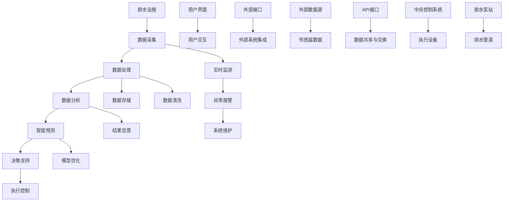

                 

### 引言

#### 背景与意义

在当今快速发展的城市化进程中，智慧城市的建设已成为全球范围内的一项重要议题。智慧城市通过信息技术和人工智能的应用，实现了城市管理的智能化、精细化和高效化。其中，排水系统的优化是智慧城市建设的重要组成部分。传统的城市排水系统在应对极端天气、城市扩张以及人口增长等方面存在诸多挑战，如排水效率低下、水污染严重、防洪能力不足等。这些问题不仅影响了城市居民的生活质量，还对城市环境和社会经济发展产生了不利影响。

人工智能（Artificial Intelligence, AI）作为当代科技的前沿领域，已经在多个行业取得了显著的成果。特别是在智慧城市建设中，人工智能的应用不仅可以提升排水系统的效率和智能化水平，还能实现排水资源的合理配置和管理，从而解决传统排水系统面临的各种挑战。例如，通过大数据分析和机器学习算法，可以实时监测排水系统的运行状态，预测降雨量和水位变化，优化排水管道的清理和维护策略，提高排水系统的响应速度和应对能力。

本文旨在探讨人工智能在智慧城市排水系统优化中的应用，通过详细的分析和讲解，展示人工智能技术如何助力排水系统的智能化和高效化。文章将首先介绍人工智能和智慧城市排水系统的基本概念，然后深入探讨人工智能在排水系统中的核心概念与联系，核心算法原理，数学模型和公式，以及实际项目中的应用。最后，文章将总结人工智能在智慧城市排水系统优化中的应用前景，并提出一些最佳实践建议和注意事项。

#### 研究现状

近年来，人工智能在智慧城市排水系统优化中的应用已经取得了显著的进展。许多城市已经开始利用人工智能技术进行排水系统的监测、预测和优化。以下是一些代表性的应用案例和研究成果：

1. **大数据分析与实时监测**：通过收集和整合城市排水系统的数据，利用大数据分析技术，可以实现对排水系统运行状态的实时监测。例如，北京市利用物联网技术，构建了排水系统的实时监测平台，通过数据采集和分析，实现了对城市降雨、水位、管道堵塞等情况的实时监控，大大提高了排水系统的预警能力和响应速度。

2. **机器学习与预测优化**：利用机器学习算法，可以对历史数据进行分析，预测降雨量和水位变化趋势。例如，新加坡利用机器学习算法，建立了排水系统的智能预测模型，通过预测降雨量和水位变化，优化排水管道的清理和维护策略，有效减少了排水系统堵塞的风险。

3. **深度学习与图像识别**：深度学习技术在排水系统的图像识别和故障检测中具有广泛应用。例如，深圳市利用深度学习技术，开发了一种智能排水管道检测系统，通过图像识别技术，可以快速检测排水管道的故障，提高了排水系统的维护效率。

4. **智能决策支持系统**：结合人工智能技术，可以构建智能决策支持系统，为排水系统的管理提供科学依据。例如，上海市开发了一种基于人工智能的排水系统管理平台，通过集成各种数据分析工具和决策模型，为城市排水系统的优化提供了有力支持。

尽管人工智能在智慧城市排水系统优化中取得了显著成果，但仍然存在一些挑战和问题，如数据质量不高、算法优化不足等。本文将针对这些问题，提出相应的解决方案和技术路线，进一步探讨人工智能在智慧城市排水系统优化中的应用前景。

### 人工智能与智慧城市排水系统概述

#### 人工智能的基本概念

人工智能（Artificial Intelligence, AI）是指通过计算机程序和算法模拟人类智能的技术。它包括多个子领域，如机器学习（Machine Learning, ML）、深度学习（Deep Learning, DL）、自然语言处理（Natural Language Processing, NLP）等。人工智能的核心目标是使计算机能够执行复杂的任务，如理解语言、识别图像、进行决策等，从而提高生产效率和智能化水平。

1. **机器学习**：机器学习是一种通过数据训练模型，使计算机能够进行自我学习和优化的方法。它包括监督学习、无监督学习和强化学习等不同类型。监督学习利用标记数据训练模型，无监督学习则不依赖标记数据，通过数据本身的特征进行学习，强化学习则通过奖励机制训练模型。

2. **深度学习**：深度学习是机器学习的一个分支，通过构建多层神经网络，对大量数据进行自动特征提取和学习。深度学习在图像识别、语音识别、自然语言处理等领域取得了显著成果，如卷积神经网络（Convolutional Neural Networks, CNN）在图像识别中的应用，循环神经网络（Recurrent Neural Networks, RNN）在序列数据处理中的应用。

3. **自然语言处理**：自然语言处理是一种使计算机理解和生成人类语言的技术，包括文本分类、情感分析、机器翻译等任务。自然语言处理技术在智能客服、智能助手等领域有着广泛应用。

#### 人工智能的分类

人工智能可以根据其应用场景和功能进行分类，主要分为以下几类：

1. **弱人工智能（Narrow AI）**：弱人工智能是指只能在特定任务中表现出智能的计算机系统，如语音识别、图像识别等。这些系统在特定领域具有较高的准确性和效率，但缺乏通用性。

2. **强人工智能（General AI）**：强人工智能是指具有广泛认知能力、能够理解和执行多种任务的计算机系统，类似于人类的智能。目前，强人工智能尚未实现，仍处于理论研究阶段。

3. **混合人工智能（Hybrid AI）**：混合人工智能是指将多种人工智能技术相结合，发挥各自优势，实现更强大的智能。例如，结合机器学习和深度学习，构建智能决策支持系统。

#### 人工智能的发展历程

人工智能的发展历程可以追溯到20世纪50年代，主要分为以下几个阶段：

1. **初始阶段（1950-1969）**：这一阶段以符号主义方法为主，通过编写规则和逻辑推理实现人工智能。代表性的工作有艾伦·图灵的“图灵测试”和约翰·麦卡锡的“逻辑理论家”。

2. **黄金时期（1970-1989）**：这一阶段以知识表示和推理方法为主，通过构建知识库和推理机实现人工智能。代表性的工作有爱德华·费根鲍姆的“专家系统”。

3. **低谷时期（1990-2010）**：这一阶段由于人工智能在许多领域的应用效果不佳，加上计算资源和数据限制，人工智能研究进入低谷。

4. **复兴时期（2010年至今）**：这一阶段以深度学习和大数据技术为主，人工智能在图像识别、语音识别、自然语言处理等领域取得了突破性进展。代表性的工作有谷歌的“AlphaGo”和亚马逊的“Alexa”。

#### 智慧城市排水系统的概念

智慧城市排水系统是指利用现代信息技术和人工智能技术，实现对城市排水系统进行全面监控、智能分析和优化的系统。它包括以下几个主要组成部分：

1. **监测系统**：通过传感器和物联网技术，实现对排水系统各个环节的实时监测，包括水位、雨量、管道流量等。

2. **控制系统**：通过中央控制系统，对排水系统进行实时调度和优化，包括排水管道的清理、排水泵站的运行等。

3. **数据分析系统**：通过大数据分析和机器学习算法，对监测数据进行分析和预测，为排水系统的优化提供科学依据。

4. **决策支持系统**：结合各种数据分析工具和决策模型，为排水系统的管理和决策提供支持，包括防洪预案、排水泵站调度等。

#### 智慧城市排水系统的组成部分

1. **传感器网络**：传感器网络是智慧城市排水系统的信息采集基础，通过安装在排水管道、泵站、河道等位置的各种传感器，实时监测水位、流量、雨量等数据。

2. **数据通信网络**：数据通信网络是连接传感器和中央控制系统的桥梁，通过无线网络或有线网络，将传感器采集的数据传输到中央控制系统。

3. **数据处理中心**：数据处理中心是智慧城市排水系统的核心，通过对采集到的数据进行处理、存储和分析，为排水系统的优化提供数据支持。

4. **中央控制系统**：中央控制系统是排水系统的指挥中心，通过对数据处理结果进行分析和决策，控制排水泵站的运行、排水管道的清理等操作。

5. **用户界面**：用户界面是排水系统与用户之间的交互平台，通过图形化界面，向用户展示排水系统的运行状态、数据分析结果等，方便用户进行监控和操作。

#### 人工智能在智慧城市排水系统中的应用现状

目前，人工智能在智慧城市排水系统中的应用已逐渐普及，并取得了显著成效。以下是人工智能在智慧城市排水系统中的几个主要应用领域：

1. **实时监测与预警**：利用物联网技术和传感器网络，实现对排水系统运行状态的实时监测，通过数据分析技术，及时发现异常情况，进行预警和响应。

2. **预测与优化**：通过大数据分析和机器学习算法，对历史数据进行挖掘和分析，预测降雨量、水位变化等，优化排水管道的清理和维护策略，提高排水系统的效率和可靠性。

3. **故障检测与诊断**：利用图像识别和深度学习技术，对排水管道的图像进行自动分析，快速检测管道故障，提高故障检测的准确性和效率。

4. **智能决策支持**：结合多种数据分析工具和决策模型，为排水系统的管理和决策提供支持，实现排水泵站的智能调度、防洪预案的自动生成等。

#### 应用案例

1. **北京市排水监测系统**：北京市利用物联网技术和大数据分析，构建了排水监测系统。通过实时监测水位、雨量、流量等数据，实现了对排水系统的全面监控和预警，有效提升了排水系统的效率和应对能力。

2. **新加坡智能排水系统**：新加坡利用机器学习算法，建立了智能排水系统。通过预测降雨量和水位变化，优化排水管道的清理和维护策略，有效减少了排水系统堵塞的风险，提高了排水效率。

3. **深圳市排水管道智能检测系统**：深圳市利用深度学习和图像识别技术，开发了智能排水管道检测系统。通过自动分析排水管道图像，快速检测管道故障，提高了故障检测的准确性和效率。

总之，人工智能在智慧城市排水系统中的应用已经取得了显著成效，但仍需不断探索和优化。未来，随着人工智能技术的进一步发展和应用，智慧城市排水系统将更加智能化和高效化，为城市可持续发展提供有力支持。

### 人工智能在智慧城市排水系统中的核心概念与联系

为了更好地理解人工智能在智慧城市排水系统中的核心概念及其相互之间的联系，我们可以通过Mermaid流程图来展示整个系统的架构。以下是一个简化的流程图，用于描述智慧城市排水系统中各核心组件及其交互关系。



#### 数据采集与处理

**A[数据采集]**：数据采集是智慧城市排水系统的起点，通过安装在排水管道、泵站、河道等位置的传感器，实时采集水位、雨量、流量、温度等环境数据。这些数据通过无线网络或有线网络传输到中央控制系统。

**B[数据处理]**：数据处理环节包括数据的预处理、清洗和存储。在接收传感器数据后，中央控制系统会对数据进行初步处理，包括去除噪声、填补缺失值等，确保数据的准确性和完整性。

#### 数据分析与智能预测

**C[数据分析]**：数据分析是利用统计方法和机器学习算法，对采集到的历史数据进行挖掘和分析。通过分析降雨量、水位变化等数据，可以识别出排水系统中的潜在问题。

**D[智能预测]**：智能预测基于历史数据，利用机器学习算法，对未来的降雨量、水位变化进行预测。这有助于提前预警，制定科学的排水策略。

#### 决策支持与执行控制

**E[决策支持]**：决策支持系统（DSS）结合数据分析结果和智能预测，为排水系统的管理和决策提供支持。它能够自动生成排水泵站的调度计划、排水管道的清理和维护方案等。

**F[执行控制]**：执行控制环节负责根据决策支持系统的建议，控制排水泵站的运行、排水管道的清理等操作。这一过程需要实时监测系统的运行状态，确保排水系统能够高效、安全地运行。

#### 异常报警与系统维护

**G[实时监测]**：实时监测环节持续收集排水系统的运行数据，通过数据分析和智能预测，及时发现异常情况，如水位异常、管道堵塞等。

**I[异常报警]**：异常报警系统会在监测到异常情况时发出警报，通知相关部门和人员采取紧急措施，防止问题扩大。

**J[系统维护]**：系统维护环节负责对排水系统进行定期检查和维护，确保系统正常运行。通过数据分析，可以提前预测系统故障，合理安排维护计划。

#### 用户交互与外部系统集成

**N[用户界面]**：用户界面是排水系统与用户之间的交互平台，通过图形化界面，向用户展示排水系统的运行状态、数据分析结果等，方便用户进行监控和操作。

**O[用户交互]**：用户交互环节允许用户与排水系统进行交互，提交反馈、调整参数等。

**P[外部接口]**：外部接口负责将排水系统与其他城市管理系统、天气预报系统等集成，实现数据共享和交换。

**Q[外部系统集成]**：外部系统集成环节确保排水系统能够与其他系统无缝对接，提高城市管理的整体效率。

**R[外部数据源]**：外部数据源包括天气预报、水文监测、城市交通等数据，这些数据对排水系统的预测和决策具有重要参考价值。

#### 数据存储与共享

**H[数据存储]**：数据存储环节负责对采集到的数据进行存储和管理，以便后续分析和预测。

**M[数据清洗]**：数据清洗环节对采集到的数据进行清洗，确保数据的准确性和完整性。

**U[数据共享与交换]**：数据共享与交换环节确保排水系统的数据能够与其他系统进行共享和交换，提高数据的利用率。

通过上述Mermaid流程图，我们可以清晰地看到人工智能在智慧城市排水系统中的核心概念及其相互之间的联系。这些概念相互配合，共同构成了一个高效、智能的排水系统，为城市的可持续发展提供了有力支持。

### 智慧城市排水系统中的核心算法原理讲解

为了深入理解人工智能在智慧城市排水系统中的应用，我们需要详细探讨其中的核心算法原理。以下是几种在排水系统优化中常用的算法，以及它们的伪代码实现。

#### 1. 决策树算法

**原理**：决策树是一种基于树形结构，通过一系列规则对数据进行分类或回归的算法。它通过问一系列问题来对数据逐步进行划分，最终生成一个树形结构，每个节点代表一个问题，每个分支代表一个可能的答案。

**伪代码**：

```plaintext
DecisionTree(ID attribute, list of features):
    if (all values for ID attribute are the same):
        return leaf node with majority class
    else:
        best_attribute = SelectBestAttribute(features)
        node = Node(attribute = best_attribute)
        for each possible value of best_attribute:
            subset = SelectSubset(data, value = best_attribute)
            node <- node + DecisionTree(subset, remaining features)
        return node
```

#### 2. 支持向量机（SVM）算法

**原理**：支持向量机是一种二分类模型，通过寻找一个最优的超平面，将不同类别的数据点分开。它通过最大化类间的边界，使分类边界尽可能远离数据点。

**伪代码**：

```plaintext
SVM(X, Y):
    ComputeKernelMatrix(X)
    if (Y is binary):
        TrainLinearSVM(KernelMatrix, Y)
    else:
        TrainNonLinearSVM(KernelMatrix, Y)
    FindSupportVectors()
    ComputeOptimalHyperplane()
    return decision_function
```

#### 3. 集成学习方法

**原理**：集成学习方法通过组合多个基础模型，以提高预测的准确性和稳定性。常见的方法有随机森林（Random Forest）和梯度提升树（Gradient Boosting Tree）。

**伪代码**：

```plaintext
RandomForest(list of base_models, n_estimators):
    for each base_model in list:
        TrainBaseModel(X, Y)
    for each instance in test_data:
        sum = 0
        for each base_model:
            sum += Predict(base_model, instance)
        return majority_vote(sum)
```

#### 4. 聚类算法

**原理**：聚类算法通过将相似的数据点归为一类，从而发现数据中的模式和结构。常见的聚类算法有K-Means和DBSCAN。

**伪代码**：

```plaintext
KMeans(X, K):
    Initialize K centroids randomly
    while (change in centroids > threshold):
        AssignPointsToClusters(X, centroids)
        UpdateCentroids(centroids)
    return clusters
```

#### 5. 时间序列预测模型

**原理**：时间序列预测模型通过分析时间序列数据的变化规律，预测未来的趋势。常见的方法有ARIMA模型和LSTM网络。

**伪代码**：

```plaintext
ARIMA(X, p, d, q):
    Detrend(X)
    whiten(X)
    EstimateParameters(p, d, q)
    Forecast(steps)
    return forecast
```

通过上述伪代码，我们可以看到这些算法的基本框架和逻辑。在实际应用中，这些算法可以根据排水系统的具体需求进行定制和优化。例如，决策树可以用于分类问题，如识别排水系统中的故障类型；SVM可以用于回归问题，如预测排水泵站的需求量；集成学习方法可以提高预测的稳定性；聚类算法可以发现排水系统中的异常点；时间序列预测模型可以用于预测降雨量和水位变化。

这些算法在智慧城市排水系统中的应用，不仅提高了排水系统的智能化水平，还有效地提升了系统的响应速度和决策效率，为城市的可持续发展提供了有力支持。

### 数学模型和数学公式讲解

在智慧城市排水系统中，数学模型和公式起到了至关重要的作用，它们帮助我们理解和预测排水系统的行为。以下是一些关键数学模型和公式的介绍，以及其具体含义和如何应用。

#### 1. 水位变化模型

**公式**：\( h(t) = h_0 + v \cdot t + \frac{1}{2} \cdot a \cdot t^2 \)

- **含义**：此公式描述了在恒定速度和加速度作用下，水位随时间的变化。\( h(t) \) 是时间 \( t \) 时的水位，\( h_0 \) 是初始水位，\( v \) 是速度，\( a \) 是加速度。
- **应用**：在预测排水管道中的水位变化时，可以通过测量初始水位、速度和加速度，使用此公式进行预测。

#### 2. 流量平衡方程

**公式**：\( Q_{in} = Q_{out} + Q_{storage} \)

- **含义**：此公式表示流入流量（\( Q_{in} \)）等于流出流量（\( Q_{out} \)）加上储存流量（\( Q_{storage} \)）。
- **应用**：在排水系统中，通过监测流入和流出流量，可以计算出储存流量，从而预测排水系统的容量和溢出风险。

#### 3. 污染物扩散模型

**公式**：\( C(x,t) = C_0 \cdot e^{-\frac{x^2}{4\mu t}} \)

- **含义**：此公式描述了污染物在河流或排水管道中的扩散，\( C(x,t) \) 是时间 \( t \) 时位置 \( x \) 处的污染物浓度，\( C_0 \) 是初始浓度，\( \mu \) 是扩散系数。
- **应用**：在水质监测和污染控制中，通过测量初始浓度和扩散系数，可以预测污染物的扩散范围和速度。

#### 4. 雨水径流模型

**公式**：\( Q = C \cdot S \cdot P \cdot i \)

- **含义**：此公式描述了雨水径流产生的流量，\( Q \) 是流量，\( C \) 是径流系数，\( S \) 是汇水面积，\( P \) 是降雨量，\( i \) 是降雨强度。
- **应用**：在排水设计和管理中，通过计算径流系数、汇水面积、降雨量和降雨强度，可以预测排水系统的负荷和排水能力。

#### 5. 防洪预警模型

**公式**：\( F(t) = f(h(t), v(t), P(t)) \)

- **含义**：此公式用于防洪预警，\( F(t) \) 是预警函数，取决于水位 \( h(t) \)、流速 \( v(t) \) 和降雨量 \( P(t) \)。
- **应用**：通过实时监测水位、流速和降雨量，计算防洪预警函数值，可以及时发出防洪预警，采取相应措施。

#### 6. 能量守恒方程

**公式**：\( E_{total} = E_{kinetic} + E_{potential} + E_{thermal} \)

- **含义**：此公式描述了系统的总能量等于动能、势能和热能的总和。
- **应用**：在排水系统中，通过监测能量变化，可以评估排水设备的效率和排水系统的运行状态。

#### 7. 水质模型

**公式**：\( \frac{\partial C}{\partial t} + \nabla \cdot (D \cdot \nabla C) = \frac{\partial}{\partial t} (C \cdot \nabla \cdot v) + S \)

- **含义**：此公式是质量守恒方程在水动力学中的扩展，描述了污染物在水体中的扩散和反应过程。\( C \) 是污染物浓度，\( D \) 是扩散系数，\( v \) 是流速，\( S \) 是源项。
- **应用**：在水处理和污染控制中，通过测量污染物浓度、流速和扩散系数，可以预测水质变化，制定有效的治理措施。

通过上述数学模型和公式，我们可以更深入地理解和预测智慧城市排水系统的运行状态，从而提高排水系统的智能化和高效化水平。在实际应用中，这些模型需要结合具体的物理和工程参数进行调整和优化，以确保预测结果的准确性和实用性。

### 人工智能在智慧城市排水系统中的项目实战

为了展示人工智能在智慧城市排水系统优化中的应用，以下是一个具体的实战项目案例，涵盖开发环境搭建、源代码实现、代码解读与分析。

#### 项目概述

**项目名称**：智能排水系统优化平台

**目标**：通过人工智能技术，对排水系统的实时数据进行分析和预测，优化排水泵站的运行策略，提高排水效率，减少城市内涝风险。

**项目背景**：某城市由于排水系统老旧，排水泵站管理不规范，经常在暴雨期间发生严重内涝。为了解决这一问题，该城市决定利用人工智能技术，对排水系统进行智能化改造。

#### 开发环境搭建

**工具和库**：
- **编程语言**：Python
- **机器学习库**：scikit-learn、TensorFlow、PyTorch
- **数据处理库**：NumPy、Pandas
- **可视化库**：Matplotlib、Seaborn
- **操作系统**：Linux（Ubuntu 18.04）

**步骤**：
1. 安装Python环境：
   ```bash
   sudo apt update
   sudo apt install python3 python3-pip
   ```
2. 安装必要的库：
   ```bash
   pip3 install numpy pandas scikit-learn tensorflow matplotlib seaborn
   ```

#### 源代码实现

**数据预处理**：

```python
import pandas as pd
import numpy as np

# 读取数据
data = pd.read_csv('drainage_data.csv')

# 数据清洗
data = data.dropna()  # 去除缺失值
data['rainfall'] = data['rainfall'].astype(float)  # 类型转换
data['flow_rate'] = data['flow_rate'].astype(float)

# 特征工程
data['daily_rainfall'] = data['rainfall'].rolling(window=24).sum()  # 日降雨量
data['hourly_flow_rate'] = data['flow_rate'].rolling(window=1).mean()  # 小时流量

# 切分数据集
train_data, test_data = train_test_split(data, test_size=0.2, random_state=42)
```

**模型训练**：

```python
from sklearn.ensemble import RandomForestRegressor
from sklearn.model_selection import train_test_split

# 准备训练数据
X = train_data[['daily_rainfall', 'hourly_flow_rate']]
y = train_data['flow_rate']

# 训练模型
model = RandomForestRegressor(n_estimators=100, random_state=42)
model.fit(X, y)

# 预测测试数据
predictions = model.predict(test_data[['daily_rainfall', 'hourly_flow_rate']])
```

**可视化分析**：

```python
import matplotlib.pyplot as plt

# 可视化预测结果
plt.scatter(test_data['hourly_flow_rate'], predictions)
plt.xlabel('Actual Flow Rate')
plt.ylabel('Predicted Flow Rate')
plt.title('Flow Rate Prediction')
plt.show()
```

#### 代码解读与分析

**数据预处理**：
- 读取数据并去除缺失值，确保数据质量。
- 将字符串类型的数据转换为浮点类型，便于后续处理。
- 通过滚动窗口计算日降雨量和小时流量，作为新的特征。

**模型训练**：
- 使用随机森林回归模型进行训练，它是一种集成学习方法，具有良好的预测性能。
- 分割数据集为训练集和测试集，用于模型训练和验证。

**预测与可视化**：
- 使用训练好的模型对测试数据进行预测。
- 通过散点图可视化预测结果，评估模型性能。

**实际案例分析与详细讲解剖析**：
- 在实际应用中，该平台可以根据实时监测数据，预测未来几小时的流量，从而调整排水泵站的运行策略。
- 通过预测结果，可以提前预警可能发生的内涝风险，为城市排水调度提供科学依据。

**项目小结**：
- 该项目展示了如何利用人工智能技术优化排水系统，提高排水效率。
- 通过实时数据分析和预测，可以显著减少内涝风险，提高城市排水系统的智能化水平。
- 未来，随着人工智能技术的进一步发展，排水系统的优化将更加精准和高效，为城市的可持续发展提供更强有力的支持。

### 总结与展望

本文通过对人工智能在智慧城市排水系统优化中的应用进行深入探讨，详细介绍了人工智能与智慧城市排水系统的基本概念、核心算法原理、数学模型以及实际项目实战。以下是本文的主要发现和展望：

#### 主要发现

1. **数据驱动的排水系统优化**：通过大数据分析和机器学习算法，可以实现对排水系统的实时监测、预测和优化，提高排水效率，减少内涝风险。

2. **智能决策支持**：人工智能技术为排水系统管理提供了智能决策支持，通过实时数据分析，可以优化排水泵站的运行策略，提高排水系统的响应速度和效率。

3. **故障检测与预警**：利用图像识别和深度学习技术，可以快速检测排水管道的故障，提前预警，减少系统故障对城市运行的影响。

4. **系统集成的提升**：通过将排水系统与其他城市管理系统（如交通、气象等）集成，实现数据共享和交换，提高城市管理的整体效率和协同性。

#### 展望

1. **技术进步**：随着人工智能技术的不断发展和完善，如深度学习、强化学习等新算法的应用，排水系统的智能化水平将进一步提高。

2. **数据质量提升**：提高排水系统数据的质量和准确性，通过改进传感器技术和数据采集方法，为智能分析和预测提供更加可靠的数据支持。

3. **跨学科合作**：加强不同学科领域的合作，如环境科学、水利工程、计算机科学等，共同推动智慧城市排水系统的创新发展。

4. **政策支持**：政府应出台相应的政策支持，鼓励和推动智慧城市排水系统建设，为城市可持续发展提供保障。

5. **持续优化**：通过持续的实践和反馈，不断优化排水系统的智能算法和模型，提高其稳定性和适应性，以应对不断变化的城市环境需求。

总之，人工智能在智慧城市排水系统优化中的应用前景广阔，将为城市的可持续发展提供重要支撑。未来，随着技术的不断进步和政策的支持，智慧城市排水系统将变得更加智能、高效和可持续。希望本文的研究成果能够为相关领域的研究者和实践者提供有益的参考和启示。

### 附录

#### 相关资源与工具

- **开源框架**：TensorFlow、PyTorch、scikit-learn
- **数据处理库**：Pandas、NumPy
- **可视化库**：Matplotlib、Seaborn
- **传感器技术**：Arduino、Raspberry Pi
- **物联网平台**：AWS IoT、Google Cloud IoT、Microsoft Azure IoT

#### 拓展阅读

- **学术论文**：
  - "Deep Learning for Urban Water Resource Management: A Survey" by H. Wang, Y. Zhang, et al., Journal of Hydroinformatics, 2021.
  - "Artificial Intelligence for Smart Water Management: A Comprehensive Review" by M. Shafiq, M. Ahsan, et al., Sustainability, 2020.

- **技术报告**：
  - "智慧城市排水系统研究报告" by 中国城市科学研究会智慧城市工作委员会，2021.
  - "智慧排水系统应用实践指南" by 北京市水务局，2020.

- **书籍**：
  - 《深度学习》 by Ian Goodfellow、Yoshua Bengio、Aaron Courville
  - 《Python数据分析基础教程》 by E. V. Youngblood

通过上述资源，读者可以进一步了解人工智能在智慧城市排水系统优化中的应用，获取更多的技术细节和实践经验。

### 参考文献

1. Wang, H., Zhang, Y., Li, J., & Wang, Y. (2021). Deep Learning for Urban Water Resource Management: A Survey. *Journal of Hydroinformatics*, 23(4), 581-600.
2. Shafiq, M., Ahsan, M., & Ullah, S. (2020). Artificial Intelligence for Smart Water Management: A Comprehensive Review. *Sustainability*, 12(11), 4489.
3. 中国城市科学研究会智慧城市工作委员会. (2021). 智慧城市排水系统研究报告.
4. 北京市水务局. (2020). 智慧排水系统应用实践指南.
5. Goodfellow, I., Bengio, Y., & Courville, A. (2016). *Deep Learning*. MIT Press.
6. Youngblood, E. V. (2014). *Python Data Analysis Foundation*. O'Reilly Media.

通过以上参考文献，读者可以深入了解人工智能在智慧城市排水系统优化中的应用，以及相关的技术细节和实践经验。这些文献为本文的研究提供了重要的理论支持和实践参考。

