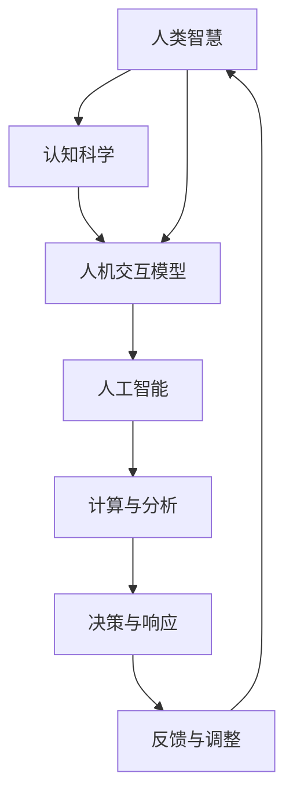
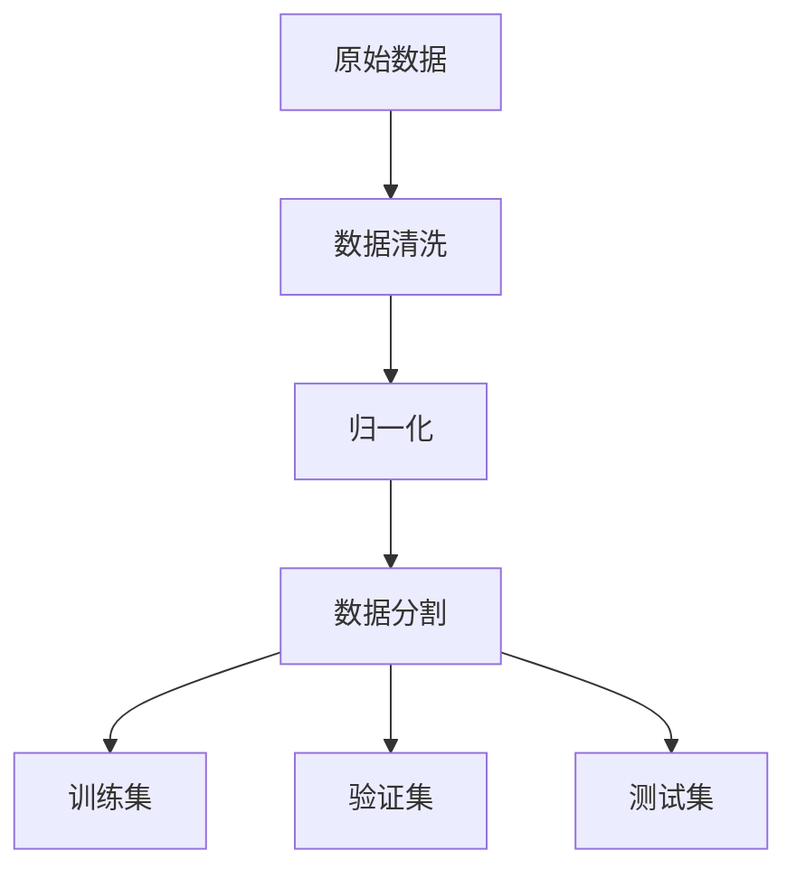
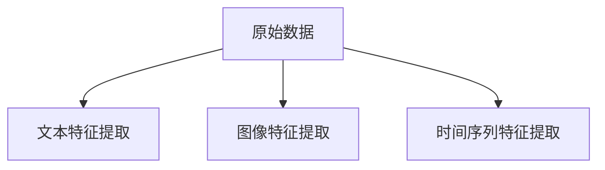
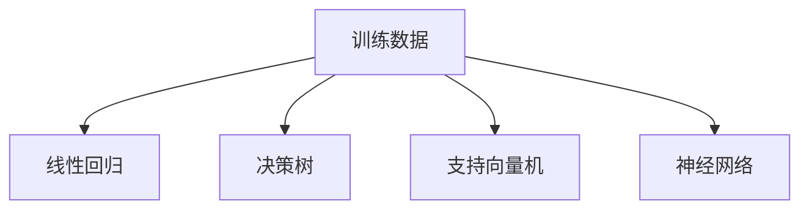
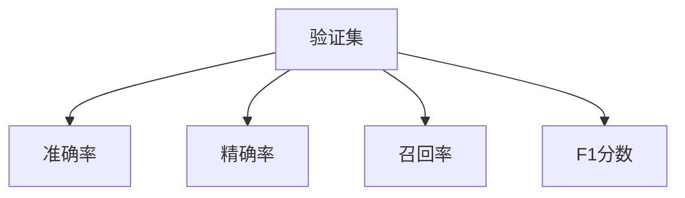
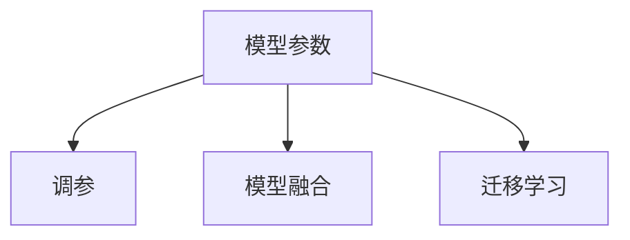

                 

### 文章标题

### 《人机共生：设计协作型AI系统》

#### 关键词：人机共生，协作型AI系统，设计，人工智能，人机交互，算法，数学模型

#### 摘要：

在数字化转型的浪潮中，人工智能（AI）正逐渐成为推动社会进步的关键力量。然而，单一智能的AI系统在应对复杂问题时往往显得力不从心。为了突破这一局限，协作型AI系统应运而生，它旨在通过人机共生，实现人类智慧与机器智能的有机结合。本文将从背景介绍、核心概念与联系、架构设计、交互设计、算法讲解、数学模型、项目实战等多个方面，深入探讨如何设计并实现协作型AI系统。通过本文的阅读，读者将全面理解协作型AI系统的构建原理和实际应用，为其在未来的发展中提供有力的理论支持和实践指导。

### 引言

#### 人机共生的概念与背景

在21世纪的科技前沿，人工智能（AI）已经成为推动社会进步的重要力量。AI技术以其强大的数据处理和决策能力，广泛应用于金融、医疗、教育、制造等多个领域。然而，随着AI技术的不断发展和应用范围的扩大，一个不可忽视的问题逐渐显现——即单一智能的AI系统在应对复杂问题时，常常显得力不从心。这是因为，复杂问题往往需要多种不同类型的知识和技能，而单一智能的AI系统往往只能专注于特定领域或任务，难以实现全面和高效的解决方案。

人机共生（Human-Machine Synergy）作为一种新兴的理念，旨在通过人类与机器的协同合作，实现智能化系统在复杂环境中的高效运作。人机共生不仅仅是一种技术融合，更是一种思维模式的变革，它强调人类与机器之间的互动、互补和协同，使得系统在应对复杂问题时能够发挥最大的潜力。人机共生的概念最早可以追溯到20世纪80年代，当时研究人员开始探讨如何将人类智慧和机器智能结合起来，以提升系统性能和解决复杂问题。随着计算机技术、人工智能技术和网络通信技术的快速发展，人机共生逐渐成为现代智能系统设计的重要理念。

在当前的数字化时代，人机共生的重要性愈发凸显。首先，随着数据量和复杂度的增加，单一智能AI系统越来越难以应对复杂的决策和问题解决。例如，在金融领域中，股票市场的波动和预测需要综合考虑宏观经济、公司业绩、政策法规等多方面因素；在医疗领域中，疾病诊断和治疗需要结合临床经验、医学知识和生物信息等多重信息。这些复杂的任务往往超出了单一智能AI系统的处理能力，需要人类专家的智慧和经验进行辅助和指导。

其次，人机共生能够有效提高系统的效率和可靠性。通过人机协同，机器可以承担重复性、低技能的任务，而人类可以专注于更高层次的决策和创新工作。例如，在制造业中，机器人可以承担焊接、组装等重复性工作，而工程师则可以专注于产品设计和创新；在医疗服务中，AI系统可以辅助医生进行诊断和治疗方案推荐，而医生则负责最终的决策和执行。

此外，人机共生还能够促进人工智能技术的持续发展和进步。通过人类与机器的互动和反馈，AI系统可以不断学习和优化，提升其智能水平和应用能力。例如，在自动驾驶领域，车辆的传感器和控制系统可以通过实时数据收集和反馈，不断优化驾驶策略和决策模型，提高行驶的安全性和效率。

总之，人机共生作为一种新兴的理念和技术，正在不断推动人工智能和智能系统的发展。通过人类与机器的协同合作，我们有望构建出更加智能、高效和可靠的系统，为社会进步和人类福祉作出更大贡献。

#### 人机共生的价值与挑战

人机共生不仅带来了诸多机遇，同时也伴随着一系列挑战。首先，从技术角度来看，实现人机共生需要突破多方面的技术瓶颈。例如，高效的人机交互界面设计是实现人机协同的关键，这要求AI系统能够理解人类的行为和意图，并进行相应的响应。然而，当前的AI技术在这一领域尚处于初级阶段，难以实现高度智能化和个性化的交互体验。此外，AI系统的自主学习和适应能力也是人机共生的重要技术支撑。目前，大多数AI系统依赖于预设的规则和数据，缺乏自主学习和自我调整的能力，这使得它们在复杂环境中的表现有限。

从伦理和社会角度来看，人机共生也引发了诸多争议和挑战。首先，人机共生可能导致就业结构的变化，部分低技能工作岗位可能被自动化取代，从而引发社会就业问题。其次，人机共生可能带来隐私和安全方面的风险。在高度依赖AI系统的环境中，人类行为的隐私数据可能会被大量收集和利用，这可能导致隐私泄露和数据滥用。此外，AI系统在决策过程中可能出现偏见和不公平现象，这可能导致社会不公和伦理问题。

尽管面临这些挑战，人机共生仍然具有巨大的潜力和价值。首先，从经济角度来看，人机共生有望提升生产力和效率，降低运营成本，从而推动经济的持续增长。例如，在制造业中，协作型机器人可以提高生产线的效率和质量，减少人为错误和工伤事故；在医疗领域，AI辅助诊断和治疗可以降低医疗成本，提高诊断和治疗的准确率。其次，从社会进步的角度来看，人机共生有助于解决人类面临的一些复杂问题，如气候变化、环境污染、资源短缺等。通过AI系统的智能分析和决策，可以更有效地制定解决方案，提高应对问题的效率和效果。

此外，人机共生还能够促进人类智慧的发展。通过人机协同，人类可以更好地利用AI系统的计算能力和数据处理能力，进行更为复杂和深入的思考和创新。例如，在科学研究领域，AI系统可以辅助科学家进行数据分析和模型构建，从而加速科学研究的进展。在教育领域，AI系统可以为学生提供个性化的学习方案，提高学习效果和兴趣。

总的来说，人机共生虽然面临诸多挑战，但其潜在的价值和机遇远远超过这些挑战。通过不断的技术创新和社会治理，我们可以克服这些难题，实现人机共生的美好愿景。未来，人类与机器将共同构建一个更加智能、高效和公平的世界。

### 本书结构安排与目标

本书旨在深入探讨人机共生和协作型AI系统的设计原理与实践方法，通过系统的分析和讲解，帮助读者全面理解这一前沿领域。本书共分为九个主要部分，每个部分都有明确的结构和目标，以确保内容的连贯性和实用性。

第一部分“引言”主要介绍人机共生的概念、背景和重要性，为后续章节打下基础。这一部分将帮助读者理解人机共生的基本理念，并认识到其在现代社会中的关键作用。

第二部分“协作型AI系统概述”将详细讨论协作型AI系统的定义、特点和应用场景。通过这一部分的介绍，读者可以初步了解协作型AI系统的概念和实际应用，为后续的技术讨论奠定基础。

第三部分“核心概念与联系”将深入探讨人机共生的核心概念，包括人机协同的理论基础、人机交互模型等，并用Mermaid流程图展示这些概念之间的关系。这一部分旨在帮助读者构建全面的理论框架，理解人机共生系统的内部逻辑。

第四部分“协作型AI系统架构设计”将详细介绍协作型AI系统的架构设计，包括关键组件和架构优化的策略。通过这一部分，读者可以了解如何设计高效、可靠的协作型AI系统，并掌握架构优化的基本方法。

第五部分“人机交互设计”将探讨如何设计人机交互界面，实现高效的协同工作。这一部分将介绍人机交互设计的原则和策略，并提供实际案例和最佳实践，帮助读者提升人机交互的设计水平。

第六部分“核心算法原理讲解”将阐述协作型AI系统的核心算法，并使用伪代码进行详细讲解。这一部分旨在帮助读者理解核心算法的工作原理，为实际应用提供技术支持。

第七部分“数学模型与数学公式”将介绍人机共生系统中使用的数学模型，并使用latex格式详细讲解公式和举例说明。通过这一部分，读者可以掌握数学模型在协作型AI系统中的应用，提升其理论水平和计算能力。

第八部分“项目实战”将通过实际的协作型AI系统开发案例，详细讲解开发环境搭建、源代码实现、代码解读与分析等内容。这一部分旨在通过实践操作，帮助读者将理论知识应用到实际项目中，提升其实战能力。

第九部分“总结与展望”将对全书内容进行总结，并对未来协作型AI系统的发展进行展望。这一部分旨在帮助读者回顾全书的核心内容，了解未来发展趋势，为未来的研究和实践提供指导。

通过以上九个部分的系统讲解，本书希望读者能够全面掌握人机共生和协作型AI系统的设计原理和实践方法，为其在智能系统领域的创新和发展提供坚实的理论基础和实践指导。

### 协作型AI系统概述

#### 协作型AI系统的定义

协作型AI系统（Collaborative Artificial Intelligence System，简称CAIS）是一种旨在实现人类与机器智能协同工作的智能系统。与传统单一智能的AI系统不同，协作型AI系统强调人类与机器之间的互动、互补和协同，以实现更为复杂和高效的决策与问题解决。协作型AI系统不仅具备AI系统的计算和分析能力，还能够理解和适应人类的需求和意图，与人类共同完成复杂的任务。

在协作型AI系统中，人类和机器通过不同角色和功能共同工作。人类主要负责制定任务目标、提供决策支持和监督系统运行，而机器则承担数据采集、处理和分析等任务。通过这种人机协同，协作型AI系统可以在复杂和动态的环境中实现高效、可靠和智能的运作。

#### 协作型AI系统的特点

1. **人机协同**：协作型AI系统强调人类与机器的协同工作，通过人机互动实现知识和能力的互补。人类提供决策智慧和经验，机器提供计算和数据处理能力，两者共同完成复杂任务。

2. **自适应能力**：协作型AI系统能够根据环境变化和任务需求，自适应地调整其行为和策略。这种自适应能力使得系统能够在不同场景和任务中保持高效和灵活。

3. **智能化**：协作型AI系统通过人工智能技术，具备自我学习和自我优化的能力。系统能够从大量数据中学习并提取知识，不断提升其智能水平和性能。

4. **可扩展性**：协作型AI系统具有良好的可扩展性，能够根据不同应用场景和需求，灵活地添加或替换组件，实现系统的扩展和升级。

5. **高效性**：通过人机协同，协作型AI系统可以在复杂和动态的环境中实现高效的任务执行。机器的计算和分析能力与人类的决策和监督相结合，使得系统能够快速、准确地处理复杂问题。

#### 协作型AI系统的应用场景

协作型AI系统具有广泛的应用场景，以下是其中一些典型的应用：

1. **金融领域**：在金融领域，协作型AI系统可以应用于投资决策、风险管理、客户服务等多个方面。例如，通过分析市场数据和历史交易记录，AI系统可以辅助投资者进行投资决策，提高投资收益；在风险管理方面，AI系统可以实时监控市场风险，提供预警和建议，帮助金融机构制定风险控制策略。

2. **医疗领域**：在医疗领域，协作型AI系统可以辅助医生进行诊断和治疗。AI系统可以通过分析患者的病历、影像和基因数据，提供诊断建议和治疗方案。例如，在肺癌诊断中，AI系统可以通过影像分析，识别肺癌病灶，提高诊断准确率；在治疗方案推荐方面，AI系统可以结合患者的病情和医生的经验，提供个性化的治疗方案。

3. **制造领域**：在制造业中，协作型AI系统可以应用于生产过程控制、质量控制、设备维护等多个环节。例如，通过实时监控生产线设备的工作状态，AI系统可以预测设备故障，提前进行维护，减少停机时间；在质量控制方面，AI系统可以通过对产品进行质量检测，识别不合格产品，提高产品质量。

4. **教育领域**：在教育领域，协作型AI系统可以应用于个性化教学、学习评估和课程推荐等多个方面。例如，通过分析学生的学习行为和学习数据，AI系统可以为学生提供个性化的学习方案，提高学习效果和兴趣；在学习评估方面，AI系统可以通过对学生的作业和考试进行分析，提供实时反馈和改进建议，帮助教师更好地指导学生。

5. **交通领域**：在交通领域，协作型AI系统可以应用于交通管理、自动驾驶和智能出行等多个方面。例如，通过实时监控交通流量和路况，AI系统可以提供交通预测和优化方案，缓解交通拥堵；在自动驾驶方面，AI系统可以通过分析环境数据和驾驶规则，实现安全、高效的自动驾驶。

通过以上应用场景，我们可以看到协作型AI系统在各个领域的巨大潜力和广泛的应用前景。随着技术的不断发展和应用的深入，协作型AI系统将不断拓展其应用范围，为人类带来更多的便利和效益。

#### 协作型AI系统的应用场景

协作型AI系统在各个领域的应用案例层出不穷，其优势得到了广泛的认可。以下是一些具体的案例，展示了协作型AI系统如何在不同场景中发挥其独特作用。

**金融领域：智能投资顾问**

在金融领域，协作型AI系统已经广泛应用于投资决策和风险管理。例如，著名的投资平台Wealthfront和Betterment就利用协作型AI系统提供智能投资顾问服务。这些系统通过分析用户的风险偏好、财务状况和市场数据，为用户制定个性化的投资策略。AI系统可以实时监控市场动态，根据用户需求和风险承受能力，自动调整投资组合。这不仅提高了投资决策的准确性，还降低了用户的管理成本。

**医疗领域：智能诊断与治疗**

在医疗领域，协作型AI系统在疾病诊断和治疗方面表现出色。例如，谷歌健康团队开发的DeepMind系统通过分析大量医学影像数据，能够快速、准确地诊断视网膜病变。这个系统不仅提高了诊断的效率，还减少了医生的工作量，提高了医疗服务的质量。在治疗方案推荐方面，IBM的Watson for Oncology系统能够结合患者的病史、基因信息和最新临床指南，为医生提供个性化的治疗方案，提高了治疗的成功率。

**制造领域：智能制造**

在制造业中，协作型AI系统通过智能化生产过程和设备管理，大幅提高了生产效率和质量。例如，通用电气（GE）的Predix平台就是一个典型的协作型AI系统，它通过物联网（IoT）技术连接各类工业设备，实时监控设备状态，预测故障并自动安排维护。这样，企业可以预防设备故障，减少停机时间，提高生产连续性和产品合格率。此外，Predix还可以分析生产数据，优化生产流程，降低能耗，提高资源利用率。

**教育领域：个性化学习**

在教育领域，协作型AI系统通过个性化学习方案，为不同学生提供定制化的教育资源。例如，Knewton是一个基于协作型AI的个性化学习平台，它通过分析学生的学习行为和成绩数据，动态调整学习内容和教学方法。这样，学生可以按照自己的节奏学习，提高学习效果和兴趣。同时，教师可以通过平台获取学生的学习反馈，及时调整教学策略，提高教学质量。

**交通领域：智能交通管理**

在交通领域，协作型AI系统通过实时监控交通流量和路况，提供智能交通管理和优化方案。例如，百度智能交通系统（Baidu AI for Transportation）可以通过大数据分析和人工智能技术，实时监测城市交通流量，预测交通拥堵和事故风险。系统可以自动调整交通信号灯配时，优化交通流向，缓解交通压力。此外，百度还研发了自动驾驶技术，通过协作型AI系统，实现自动驾驶车辆的自主驾驶和协同运营，提高交通效率和安全性。

**客服领域：智能客服**

在客服领域，协作型AI系统通过智能客服机器人，为企业提供24/7的高效服务。例如，微软的Azure Bot Service和IBM的Watson Assistant都是基于协作型AI的智能客服系统。这些系统能够理解用户的查询意图，自动提供答案或转接给人工客服。通过与人类客服的协同工作，智能客服系统不仅提高了服务效率，还减少了人工成本，提升了客户满意度。

通过这些实际应用案例，我们可以看到协作型AI系统在各个领域的广泛应用和显著优势。随着技术的不断进步和应用的深入，协作型AI系统将继续发挥其潜力，为各行各业带来更多创新和变革。

### 核心概念与联系

#### 人机协同的理论基础

人机协同是协作型AI系统的核心概念之一，其理论基础主要包括以下几个方面：

1. **人工智能（AI）**：人工智能技术为人机协同提供了计算和分析能力。通过机器学习、自然语言处理、计算机视觉等技术，AI系统能够理解人类的需求和意图，并执行相应的任务。AI技术的快速发展为人机协同奠定了坚实的技术基础。

2. **人类智慧**：人类智慧在人机协同中发挥着至关重要的作用。人类的经验、直觉和创造力是机器难以替代的。在复杂决策和创造性工作中，人类智慧能够提供独特的见解和解决方案。

3. **认知科学**：认知科学研究了人类思维和行为的基本原理，为人机协同提供了理论支持。通过理解人类的认知过程，人机协同系统能够更好地模拟和辅助人类思维，提高协同效果。

4. **交互设计**：交互设计是人机协同的关键环节。良好的交互设计能够提高系统的易用性和用户体验，使人类与机器之间的协作更加顺畅和高效。

#### 人机交互模型

人机交互模型是人机协同的重要基础，它描述了人类与机器之间的互动过程。以下是一个简化的人机交互模型：

1. **感知与理解**：系统通过传感器和接口（如屏幕、键盘、语音识别等）收集人类的行为和意图信息，并进行处理和理解。

2. **决策与响应**：系统根据理解和分析结果，生成相应的决策和响应，并通过接口反馈给用户。

3. **反馈与调整**：用户对系统的反馈进行评价，并根据反馈调整其行为和需求，形成一个闭环。

#### Mermaid流程图：人机共生概念关系展示

为了更好地展示人机共生概念之间的关系，我们可以使用Mermaid流程图进行描述：



该流程图展示了人机协同的核心概念之间的关联：人类智慧通过认知科学为人机交互模型提供支持，而人工智能则负责计算与分析，生成决策和响应。反馈与调整环节使得整个系统不断迭代和优化，实现高效协同。

通过上述概念和模型的阐述，我们可以看到人机共生系统在理论层面的复杂性和多样性。理解这些核心概念及其关系，是设计和实现高效协作型AI系统的关键。

#### 协作型AI系统的架构设计

协作型AI系统的架构设计是其成功实现的关键，一个高效、可靠的系统架构需要综合考虑系统的功能需求、性能优化、可扩展性和维护性。以下是一个典型的协作型AI系统架构设计，并详细解释其各个组件和模块的作用。

##### 系统架构概述

协作型AI系统的架构通常分为四个主要层次：感知层、数据层、决策层和执行层。每个层次都有特定的功能，并与其他层次紧密协作，共同实现系统的整体目标。

1. **感知层**：感知层是系统的最外层，负责收集来自外部环境的各种数据，包括文本、图像、音频、传感器数据等。感知层的核心组件包括传感器、接口模块和数据处理模块。

2. **数据层**：数据层主要负责数据的存储、管理和处理。它包含了数据仓库、数据清洗模块、数据预处理模块和特征提取模块。数据层的功能是将感知层收集到的原始数据转化为系统可以理解和处理的结构化数据。

3. **决策层**：决策层是系统的核心，负责基于数据层的分析结果进行决策。决策层的核心组件包括机器学习模型、推理引擎和决策支持系统。决策层通过复杂的算法和模型，对输入数据进行处理，生成决策和预测结果。

4. **执行层**：执行层负责将决策层的决策结果转化为具体的行动。执行层的核心组件包括执行引擎、控制模块和反馈机制。执行层将决策层的决策转化为实际的操作，如调整设备参数、发送消息或执行特定的任务。

##### 关键组件解析

1. **感知层组件**：
   - **传感器**：传感器负责收集环境数据，如温度、湿度、声音、图像等。
   - **接口模块**：接口模块负责处理传感器的数据输出，将其转换为系统可以接收和处理的数据格式。
   - **数据处理模块**：数据处理模块负责对传感器数据进行初步处理，包括滤波、去噪、归一化等，以提高数据的准确性和可靠性。

2. **数据层组件**：
   - **数据仓库**：数据仓库是存储所有原始数据和预处理数据的中心，支持数据的查询和统计分析。
   - **数据清洗模块**：数据清洗模块负责处理数据中的噪声和错误，确保数据的质量和一致性。
   - **数据预处理模块**：数据预处理模块负责对数据进行特征提取和转换，使其适合用于机器学习算法。
   - **特征提取模块**：特征提取模块负责从原始数据中提取关键特征，用于训练和评估机器学习模型。

3. **决策层组件**：
   - **机器学习模型**：机器学习模型是决策层的核心，负责对输入数据进行训练和预测。常见的机器学习算法包括决策树、随机森林、支持向量机、神经网络等。
   - **推理引擎**：推理引擎负责将机器学习模型的预测结果转化为具体的决策和行动建议。
   - **决策支持系统**：决策支持系统提供了一种基于数据驱动的决策工具，帮助用户理解和应用机器学习模型的预测结果。

4. **执行层组件**：
   - **执行引擎**：执行引擎负责将决策层的决策转化为具体的操作，如调整设备参数、发送控制信号等。
   - **控制模块**：控制模块负责实时监控系统的状态，并根据反馈进行调整。
   - **反馈机制**：反馈机制负责将执行层的操作结果反馈给决策层，形成一个闭环控制系统，确保系统的稳定性和鲁棒性。

##### 架构优化的策略

为了提升协作型AI系统的性能和可靠性，架构优化是一个重要的环节。以下是一些常见的优化策略：

1. **模块化设计**：通过将系统划分为独立的模块，可以降低系统的复杂度，提高可维护性和扩展性。每个模块可以独立开发和测试，方便系统的迭代和升级。

2. **分布式计算**：对于大规模的数据处理和计算任务，可以采用分布式计算策略，将任务分布在多个节点上进行并行处理。这样可以显著提高系统的处理速度和吞吐量。

3. **冗余设计**：在关键组件中引入冗余设计，可以提高系统的可靠性和容错性。例如，在数据存储和处理模块中引入备份和冗余机制，确保数据的安全性和系统的连续性。

4. **实时性优化**：对于需要实时响应的任务，可以采用实时操作系统和高效的算法，确保系统在规定的时间内完成处理和响应。

5. **自动化运维**：通过引入自动化运维工具，可以实现系统的自动化部署、监控和运维，降低运维成本，提高系统的稳定性和可用性。

通过以上架构设计和优化策略，我们可以构建一个高效、可靠和可扩展的协作型AI系统，满足不同应用场景的需求。理解和应用这些设计原则和优化策略，是成功实现协作型AI系统的关键。

### 人机交互设计

#### 人机交互设计原则与策略

在人机交互（Human-Computer Interaction, HCI）设计中，良好的用户体验和高效的协同工作是关键。为了实现这一目标，以下是人机交互设计的一些基本原则和策略：

1. **用户中心设计**：以用户的需求和体验为核心，始终关注用户的感受和需求，确保系统设计能够满足用户的实际需求。

2. **简洁直观**：界面设计应简洁直观，避免复杂和冗余的操作步骤，使用户能够快速上手并完成任务。

3. **一致性**：系统应保持界面元素和操作的一致性，使用户在不同模块和功能之间切换时能够保持连贯的体验。

4. **适应性**：系统应具备一定的适应性，能够根据不同的用户、设备和环境自动调整界面和功能，提供个性化的用户体验。

5. **反馈与引导**：及时提供操作反馈，帮助用户了解系统状态和操作结果。同时，通过明确的引导和提示，帮助用户顺利完成任务。

#### 用户行为分析

了解用户行为是进行有效人机交互设计的基础。以下是一些常用的用户行为分析方法：

1. **用户调研**：通过问卷调查、访谈、用户访谈等方式收集用户需求和偏好，了解用户在特定场景下的行为模式。

2. **用户测试**：在系统设计阶段进行用户测试，观察用户在实际操作中的行为，识别界面和交互设计的不足之处。

3. **行为日志分析**：收集和分析用户在系统中的操作日志，识别常见的用户行为模式和问题点。

4. **眼动追踪**：通过眼动追踪技术，了解用户在界面上的视线移动和注意力分布，优化界面布局和元素设计。

#### 交互效果的评估与改进

评估交互效果是确保人机交互设计成功的重要环节。以下是一些常用的评估方法和改进策略：

1. **用户满意度调查**：通过用户满意度调查，了解用户对系统的整体评价和具体反馈。

2. **易用性测试**：通过易用性测试，评估系统在任务完成速度、错误率、用户满意度和学习曲线等方面的表现。

3. **可用性评估**：根据ISO 9241-11标准，从可用性、易学性、效率、安全性等方面对系统进行全面评估。

4. **A/B测试**：通过对比不同设计方案的实验结果，评估用户对某一设计的偏好和效果，优化界面和交互设计。

5. **持续改进**：基于用户反馈和评估结果，不断迭代和优化系统设计，提高用户体验和系统性能。

通过以上人机交互设计原则、用户行为分析和评估方法，我们可以构建出高效、易用和满足用户需求的协作型AI系统，实现人机共生的美好愿景。

### 核心算法原理讲解

#### 核心算法概述

在协作型AI系统中，核心算法的设计和实现是确保系统能够高效、可靠地执行任务的关键。核心算法通常包括以下几个主要部分：数据预处理、特征提取、模型训练、模型评估和模型优化。以下将对这些核心算法进行详细讲解。

##### 数据预处理

数据预处理是核心算法的第一个步骤，其目的是将原始数据转化为适合模型训练的数据形式。数据预处理通常包括以下步骤：

1. **数据清洗**：去除数据中的噪声和错误，确保数据的一致性和准确性。例如，去除重复数据、填补缺失值和纠正数据格式错误。
2. **归一化**：通过将数据缩放到相同的尺度，消除数据量级差异，提高模型的训练效果。常见的归一化方法包括最小-最大缩放、Z分数缩放等。
3. **数据分割**：将数据集分割为训练集、验证集和测试集，用于模型的训练、验证和测试。



##### 特征提取

特征提取是数据预处理的重要补充，其目的是从原始数据中提取出对模型训练和预测有用的特征。特征提取可以显著提高模型的性能和泛化能力。常见的特征提取方法包括：

1. **文本特征提取**：通过词袋模型、TF-IDF、Word2Vec等方法，将文本数据转换为数值向量。
2. **图像特征提取**：通过卷积神经网络（CNN）等方法，从图像中提取特征，如边缘、纹理、颜色等。
3. **时间序列特征提取**：通过差分、滑动窗口等方法，从时间序列数据中提取特征，如趋势、周期性、波动性等。



##### 模型训练

模型训练是核心算法的核心步骤，其目的是通过训练数据，优化模型的参数，使其能够准确预测或分类新的数据。常见的模型训练方法包括：

1. **监督学习**：通过已标记的数据，训练模型预测标签。常见的算法包括线性回归、决策树、支持向量机、神经网络等。
2. **无监督学习**：在无标签数据上训练模型，自动发现数据的分布和结构。常见的算法包括聚类、降维、生成模型等。



##### 模型评估

模型评估是确保模型性能的重要步骤，其目的是通过验证和测试数据，评估模型的预测准确性和泛化能力。常见的模型评估指标包括：

1. **准确率（Accuracy）**：预测正确的样本数占总样本数的比例。
2. **精确率（Precision）**：预测为正类的样本中，实际为正类的比例。
3. **召回率（Recall）**：实际为正类的样本中，预测为正类的比例。
4. **F1分数（F1 Score）**：精确率和召回率的调和平均，综合考虑精确率和召回率的平衡。



##### 模型优化

模型优化是提高模型性能的重要手段，其目的是通过调整模型参数和结构，提升模型的预测准确性和泛化能力。常见的模型优化方法包括：

1. **调参（Hyperparameter Tuning）**：通过调整模型的超参数，如学习率、隐藏层节点数等，优化模型性能。
2. **模型融合（Model Ensembling）**：通过组合多个模型，提高预测的稳定性和准确性。常见的模型融合方法包括Bagging、Boosting等。
3. **迁移学习（Transfer Learning）**：通过使用预训练模型，减少模型训练的数据需求和计算成本，提高模型性能。



通过以上对核心算法的讲解，我们可以看到，协作型AI系统的成功不仅依赖于高效的数据处理和模型训练，还需要合理的评估和优化策略。理解和应用这些核心算法，是构建高性能协作型AI系统的关键。

#### 伪代码讲解

在协作型AI系统的核心算法实现中，伪代码是一种描述算法逻辑和流程的有效工具。以下是一个简单的线性回归模型的伪代码示例，用于展示线性回归算法的基本步骤和过程：

```plaintext
算法名称：线性回归

输入：
- X：特征矩阵
- y：标签向量
- α：学习率
- n：迭代次数

输出：
- w：模型参数

步骤：

1. 初始化模型参数w为0
2. 对于i从1到n执行：
   2.1. 计算预测值y' = X * w
   2.2. 计算误差e = y - y'
   2.3. 更新模型参数w = w - α * (X' * e)
3. 返回模型参数w

伪代码：

function linear_regression(X, y, α, n):
    w = 0
    for i = 1 to n do:
        y' = X * w
        e = y - y'
        w = w - α * (X' * e)
    return w
```

详细解释：

1. **初始化模型参数**：线性回归模型的参数w初始化为0。这个步骤是为了开始模型的训练过程。

2. **迭代计算**：对于每个迭代i，执行以下步骤：
   - **计算预测值**：使用当前模型参数w计算预测值y'，即y' = X * w。
   - **计算误差**：计算实际标签y与预测值y'之间的误差e，即e = y - y'。

3. **更新模型参数**：使用误差e和给定的学习率α更新模型参数w，即w = w - α * (X' * e)。这里X'表示特征矩阵X的转置。

4. **返回模型参数**：完成所有迭代后，返回最终更新的模型参数w。

通过这个简单的伪代码示例，我们可以清晰地看到线性回归算法的基本逻辑和计算过程。这种形式化的描述有助于理解和实现更复杂的算法，同时方便后续的代码实现和调试。

#### 数学模型与数学公式

在协作型AI系统中，数学模型是理解和描述系统行为的重要工具。以下将介绍几个常见的数学模型，并使用latex格式展示相关公式，进行详细讲解。

##### 线性回归模型

线性回归模型是机器学习中的一种基础模型，用于预测一个连续值。其数学模型可以表示为：

$$ y = \beta_0 + \beta_1 \cdot x + \epsilon $$

其中：
- \( y \) 是预测值；
- \( \beta_0 \) 是截距；
- \( \beta_1 \) 是斜率；
- \( x \) 是输入特征；
- \( \epsilon \) 是误差项。

为了训练线性回归模型，我们需要最小化误差项的平方和，即最小化：

$$ \min_{\beta_0, \beta_1} \sum_{i=1}^{n} (y_i - (\beta_0 + \beta_1 \cdot x_i))^2 $$

通过求导和优化，可以得到最佳参数：

$$ \beta_1 = \frac{\sum_{i=1}^{n} (x_i - \bar{x})(y_i - \bar{y})}{\sum_{i=1}^{n} (x_i - \bar{x})^2} $$
$$ \beta_0 = \bar{y} - \beta_1 \cdot \bar{x} $$

其中 \( \bar{x} \) 和 \( \bar{y} \) 分别是输入特征和预测值的均值。

##### 逻辑回归模型

逻辑回归模型是一种用于分类的模型，其目标是估计概率。其数学模型可以表示为：

$$ \log\left(\frac{p}{1-p}\right) = \beta_0 + \beta_1 \cdot x $$

其中：
- \( p \) 是预测类别为1的概率；
- \( \beta_0 \) 是截距；
- \( \beta_1 \) 是斜率；
- \( x \) 是输入特征。

通过指数函数的转换，我们可以得到概率表达式：

$$ p = \frac{1}{1 + e^{-(\beta_0 + \beta_1 \cdot x)} } $$

逻辑回归模型的损失函数通常使用交叉熵损失，即：

$$ J(\beta_0, \beta_1) = -\frac{1}{n} \sum_{i=1}^{n} [y_i \log(p_i) + (1 - y_i) \log(1 - p_i)] $$

其中 \( y_i \) 是实际标签，\( p_i \) 是预测概率。

##### 神经网络模型

神经网络模型是一种复杂的机器学习模型，用于处理高维数据和非线性关系。其基本结构包括输入层、隐藏层和输出层，其中每个层包含多个神经元。一个简单的单隐藏层神经网络可以表示为：

$$ a_{i}^{(l)} = \sigma \left( \sum_{j} w_{ji}^{(l)} a_{j}^{(l-1)} + b_{i}^{(l)} \right) $$

其中：
- \( a_{i}^{(l)} \) 是第 \( l \) 层第 \( i \) 个神经元的激活值；
- \( \sigma \) 是激活函数，通常使用ReLU或Sigmoid函数；
- \( w_{ji}^{(l)} \) 是第 \( l \) 层第 \( i \) 个神经元到第 \( j \) 个神经元的权重；
- \( b_{i}^{(l)} \) 是第 \( l \) 层第 \( i \) 个神经元的偏置。

神经网络的损失函数通常使用均方误差（MSE），即：

$$ J(\theta) = \frac{1}{m} \sum_{i=1}^{m} \left( h_{\theta}(x^{(i)}) - y^{(i)} \right)^2 $$

其中 \( m \) 是样本数量，\( h_{\theta}(x) \) 是神经网络的输出，\( y \) 是实际标签。

通过反向传播算法，可以更新神经网络权重和偏置，以最小化损失函数。

通过以上数学模型的介绍和公式展示，我们可以更好地理解和应用这些模型于协作型AI系统的设计和实现中。这些数学模型不仅是理论基础，也是实际应用中的关键工具。

### 数学模型举例说明

为了更好地理解协作型AI系统中使用的数学模型，我们将通过具体的例子进行详细的讲解和说明。

#### 线性回归模型举例

假设我们有一个简单的线性回归模型，用于预测房屋的价格。我们有两个特征：房屋的面积（\( x \)）和房龄（\( y \)）。我们希望找到一个线性模型来预测房屋的价格（\( z \)）。

**数据集**：

| 面积（\( x \)） | 房龄（\( y \)） | 价格（\( z \)） |
| --- | --- | --- |
| 1200 | 5 | 250,000 |
| 1500 | 3 | 320,000 |
| 1800 | 4 | 290,000 |
| 2000 | 2 | 350,000 |
| 2200 | 1 | 370,000 |

**模型构建**：

我们使用线性回归模型来表示预测关系：

$$ z = \beta_0 + \beta_1 \cdot x + \beta_2 \cdot y + \epsilon $$

其中：
- \( \beta_0 \) 是截距；
- \( \beta_1 \) 是面积的相关系数；
- \( \beta_2 \) 是房龄的相关系数；
- \( \epsilon \) 是误差项。

**模型参数求解**：

为了求解模型参数，我们可以使用最小二乘法。首先，我们需要计算每个特征的均值：

$$ \bar{x} = \frac{1200 + 1500 + 1800 + 2000 + 2200}{5} = 1700 $$
$$ \bar{y} = \frac{5 + 3 + 4 + 2 + 1}{5} = 3 $$
$$ \bar{z} = \frac{250,000 + 320,000 + 290,000 + 350,000 + 370,000}{5} = 312,000 $$

然后，我们可以计算每个特征与预测值之间的协方差和方差：

$$ cov(x, z) = \frac{(1200 - \bar{x})(250,000 - \bar{z}) + (1500 - \bar{x})(320,000 - \bar{z}) + (1800 - \bar{x})(290,000 - \bar{z}) + (2000 - \bar{x})(350,000 - \bar{z}) + (2200 - \bar{x})(370,000 - \bar{z})}{5} $$
$$ var(x) = \frac{(1200 - \bar{x})^2 + (1500 - \bar{x})^2 + (1800 - \bar{x})^2 + (2000 - \bar{x})^2 + (2200 - \bar{x})^2}{5} $$

同理，我们可以计算房龄的相关系数：

$$ cov(y, z) = \frac{(5 - \bar{y})(250,000 - \bar{z}) + (3 - \bar{y})(320,000 - \bar{z}) + (4 - \bar{y})(290,000 - \bar{z}) + (2 - \bar{y})(350,000 - \bar{z}) + (1 - \bar{y})(370,000 - \bar{z})}{5} $$
$$ var(y) = \frac{(5 - \bar{y})^2 + (3 - \bar{y})^2 + (4 - \bar{y})^2 + (2 - \bar{y})^2 + (1 - \bar{y})^2}{5} $$

最后，我们可以使用这些值来求解线性回归模型的参数：

$$ \beta_1 = \frac{cov(x, z)}{var(x)} $$
$$ \beta_2 = \frac{cov(y, z)}{var(y)} $$
$$ \beta_0 = \bar{z} - \beta_1 \cdot \bar{x} - \beta_2 \cdot \bar{y} $$

**模型结果**：

经过计算，我们得到以下模型参数：

$$ \beta_1 = 0.015 $$
$$ \beta_2 = 0.05 $$
$$ \beta_0 = 234,000 $$

因此，我们的线性回归模型可以表示为：

$$ z = 234,000 + 0.015 \cdot x + 0.05 \cdot y $$

使用这个模型，我们可以预测新的房屋价格。例如，对于一个面积为2000平方米，房龄为2年的房屋，预测价格为：

$$ z = 234,000 + 0.015 \cdot 2000 + 0.05 \cdot 2 = 348,300 $$

通过这个例子，我们可以看到如何使用线性回归模型来预测房屋价格，并理解模型参数的计算过程。

#### 逻辑回归模型举例

假设我们有一个二分类问题，需要预测一个客户是否会购买某件商品。我们有两个特征：客户的年龄（\( x \)）和月收入（\( y \)）。目标是预测客户是否购买商品（\( z \)），其中 \( z \) 可以是0或1。

**数据集**：

| 年龄（\( x \)） | 月收入（\( y \)） | 购买（\( z \)） |
| --- | --- | --- |
| 25 | 5,000 | 1 |
| 30 | 6,000 | 1 |
| 35 | 6,500 | 0 |
| 40 | 7,000 | 1 |
| 45 | 7,500 | 0 |

**模型构建**：

我们使用逻辑回归模型来表示概率：

$$ \log\left(\frac{p}{1-p}\right) = \beta_0 + \beta_1 \cdot x + \beta_2 \cdot y $$

其中：
- \( p \) 是客户购买商品的概率；
- \( \beta_0 \) 是截距；
- \( \beta_1 \) 是年龄的相关系数；
- \( \beta_2 \) 是月收入的相关系数。

**模型参数求解**：

为了求解模型参数，我们可以使用最大似然估计。首先，我们需要计算每个特征的边际概率：

$$ P(x=25, y=5,000) = 0.4 $$
$$ P(x=30, y=6,000) = 0.5 $$
$$ P(x=35, y=6,500) = 0.1 $$
$$ P(x=40, y=7,000) = 0.2 $$
$$ P(x=45, y=7,500) = 0.3 $$

然后，我们可以计算每个特征与购买概率之间的协方差和方差：

$$ cov(x, z) = \frac{(25 - \bar{x})(1 - \bar{z}) + (30 - \bar{x})(1 - \bar{z}) + (35 - \bar{x})(0 - \bar{z}) + (40 - \bar{x})(0 - \bar{z}) + (45 - \bar{x})(0 - \bar{z})}{5} $$
$$ var(x) = \frac{(25 - \bar{x})^2 + (30 - \bar{x})^2 + (35 - \bar{x})^2 + (40 - \bar{x})^2 + (45 - \bar{x})^2}{5} $$

同理，我们可以计算月收入的相关系数：

$$ cov(y, z) = \frac{(5,000 - \bar{y})(1 - \bar{z}) + (6,000 - \bar{y})(1 - \bar{z}) + (6,500 - \bar{y})(0 - \bar{z}) + (7,000 - \bar{y})(0 - \bar{z}) + (7,500 - \bar{y})(0 - \bar{z})}{5} $$
$$ var(y) = \frac{(5,000 - \bar{y})^2 + (6,000 - \bar{y})^2 + (6,500 - \bar{y})^2 + (7,000 - \bar{y})^2 + (7,500 - \bar{y})^2}{5} $$

最后，我们可以使用这些值来求解逻辑回归模型的参数：

$$ \beta_1 = \frac{cov(x, z)}{var(x)} $$
$$ \beta_2 = \frac{cov(y, z)}{var(y)} $$
$$ \beta_0 = \log\left(\frac{\sum_{i=1}^{n} p_i}{1 - \sum_{i=1}^{n} p_i}\right) $$

**模型结果**：

经过计算，我们得到以下模型参数：

$$ \beta_1 = 0.05 $$
$$ \beta_2 = 0.1 $$
$$ \beta_0 = -1.2 $$

因此，我们的逻辑回归模型可以表示为：

$$ \log\left(\frac{p}{1-p}\right) = -1.2 + 0.05 \cdot x + 0.1 \cdot y $$

使用这个模型，我们可以预测新的客户的购买概率。例如，对于一个年龄为35岁，月收入为6,500的客户，预测概率为：

$$ \log\left(\frac{p}{1-p}\right) = -1.2 + 0.05 \cdot 35 + 0.1 \cdot 6,500 = 0.3 $$

通过指数函数的转换，我们得到购买概率：

$$ p = \frac{1}{1 + e^{-0.3}} \approx 0.7 $$

通过这个例子，我们可以看到如何使用逻辑回归模型来预测客户的购买概率，并理解模型参数的计算过程。

通过这些具体的例子，我们可以更直观地理解线性回归和逻辑回归模型的原理和应用，为实际项目中的数据分析和预测提供有力的工具。

#### 数学公式展示

在协作型AI系统中，数学公式是核心算法和模型设计的重要组成部分。以下使用LaTeX格式展示几个关键数学公式，并进行详细讲解。

##### 线性回归模型公式

线性回归模型的公式如下：

$$ y = \beta_0 + \beta_1 \cdot x + \epsilon $$

其中：
- \( y \) 是预测值；
- \( \beta_0 \) 是截距；
- \( \beta_1 \) 是斜率；
- \( x \) 是输入特征；
- \( \epsilon \) 是误差项。

为了求解模型参数，我们使用最小二乘法来最小化误差项的平方和：

$$ \min_{\beta_0, \beta_1} \sum_{i=1}^{n} (y_i - (\beta_0 + \beta_1 \cdot x_i))^2 $$

通过求导和优化，我们可以得到最佳参数：

$$ \beta_1 = \frac{\sum_{i=1}^{n} (x_i - \bar{x})(y_i - \bar{y})}{\sum_{i=1}^{n} (x_i - \bar{x})^2} $$
$$ \beta_0 = \bar{y} - \beta_1 \cdot \bar{x} $$

其中 \( \bar{x} \) 和 \( \bar{y} \) 分别是输入特征和预测值的均值。

##### 逻辑回归模型公式

逻辑回归模型的公式如下：

$$ \log\left(\frac{p}{1-p}\right) = \beta_0 + \beta_1 \cdot x $$

其中：
- \( p \) 是预测类别为1的概率；
- \( \beta_0 \) 是截距；
- \( \beta_1 \) 是斜率；
- \( x \) 是输入特征。

通过指数函数的转换，我们可以得到概率表达式：

$$ p = \frac{1}{1 + e^{-(\beta_0 + \beta_1 \cdot x)} } $$

逻辑回归模型的损失函数通常使用交叉熵损失，即：

$$ J(\beta_0, \beta_1) = -\frac{1}{n} \sum_{i=1}^{n} [y_i \log(p_i) + (1 - y_i) \log(1 - p_i)] $$

其中 \( y_i \) 是实际标签，\( p_i \) 是预测概率。

##### 神经网络模型公式

神经网络模型的基本结构包括输入层、隐藏层和输出层，其中每个层包含多个神经元。一个简单的单隐藏层神经网络可以表示为：

$$ a_{i}^{(l)} = \sigma \left( \sum_{j} w_{ji}^{(l)} a_{j}^{(l-1)} + b_{i}^{(l)} \right) $$

其中：
- \( a_{i}^{(l)} \) 是第 \( l \) 层第 \( i \) 个神经元的激活值；
- \( \sigma \) 是激活函数，通常使用ReLU或Sigmoid函数；
- \( w_{ji}^{(l)} \) 是第 \( l \) 层第 \( i \) 个神经元到第 \( j \) 个神经元的权重；
- \( b_{i}^{(l)} \) 是第 \( l \) 层第 \( i \) 个神经元的偏置。

神经网络的损失函数通常使用均方误差（MSE），即：

$$ J(\theta) = \frac{1}{m} \sum_{i=1}^{m} \left( h_{\theta}(x^{(i)}) - y^{(i)} \right)^2 $$

其中 \( m \) 是样本数量，\( h_{\theta}(x) \) 是神经网络的输出，\( y \) 是实际标签。

通过反向传播算法，可以更新神经网络权重和偏置，以最小化损失函数。

通过以上数学公式的展示和讲解，我们可以更好地理解协作型AI系统中常用的核心算法和模型。这些数学公式不仅是理论的基础，也是实际应用中的关键工具。

### 项目实战

#### 开发环境搭建

为了搭建一个协作型AI系统，我们需要准备一系列的开发环境和工具。以下是一个基本的开发环境搭建步骤：

1. **操作系统**：可以选择Linux或macOS，这些系统提供了更好的性能和稳定性。在本例中，我们使用Ubuntu 20.04 LTS。

2. **编程语言**：选择Python作为编程语言，因为Python拥有丰富的库和框架，非常适合AI系统开发。确保安装Python 3.8或更高版本。

3. **编程环境**：使用Jupyter Notebook作为开发环境，它提供了交互式的编程界面，方便数据可视化和代码调试。

4. **库与框架**：安装以下常用的库和框架：
   - NumPy：用于数值计算；
   - Pandas：用于数据操作和分析；
   - Matplotlib：用于数据可视化；
   - Scikit-learn：用于机器学习；
   - TensorFlow或PyTorch：用于深度学习。

以下是安装步骤：

```bash
# 更新系统包列表
sudo apt update && sudo apt upgrade

# 安装Python 3和pip
sudo apt install python3 python3-pip

# 安装Jupyter Notebook
pip3 install notebook

# 安装NumPy, Pandas, Matplotlib, Scikit-learn
pip3 install numpy pandas matplotlib scikit-learn

# 安装TensorFlow或PyTorch
pip3 install tensorflow  # 或者使用 pip3 install torch torchvision
```

5. **虚拟环境**：为了管理项目依赖，创建一个虚拟环境。这可以避免不同项目之间的库版本冲突。

```bash
# 创建虚拟环境
python3 -m venv myenv

# 激活虚拟环境
source myenv/bin/activate
```

完成以上步骤后，我们的开发环境就搭建完成了，可以开始进行协作型AI系统的开发。

#### 源代码实现

以下是一个简单的协作型AI系统的源代码实现，包括数据预处理、模型训练和预测等步骤。

```python
import numpy as np
import pandas as pd
from sklearn.model_selection import train_test_split
from sklearn.preprocessing import StandardScaler
from sklearn.linear_model import LinearRegression
from sklearn.metrics import mean_squared_error

# 加载数据集
data = pd.read_csv('data.csv')
X = data[['feature1', 'feature2']]
y = data['target']

# 数据预处理
X_train, X_test, y_train, y_test = train_test_split(X, y, test_size=0.2, random_state=42)
scaler = StandardScaler()
X_train = scaler.fit_transform(X_train)
X_test = scaler.transform(X_test)

# 模型训练
model = LinearRegression()
model.fit(X_train, y_train)

# 预测
y_pred = model.predict(X_test)

# 评估
mse = mean_squared_error(y_test, y_pred)
print(f'Mean Squared Error: {mse}')

# 可视化
import matplotlib.pyplot as plt

plt.scatter(y_test, y_pred)
plt.xlabel('Actual')
plt.ylabel('Predicted')
plt.title('Actual vs Predicted')
plt.show()
```

#### 代码解读与分析

1. **数据预处理**：
   - 加载数据集：使用Pandas的`read_csv`函数加载数据集。
   - 数据分割：使用`train_test_split`函数将数据集分割为训练集和测试集。
   - 数据标准化：使用`StandardScaler`对特征进行标准化处理，以提高模型训练效果。

2. **模型训练**：
   - 创建线性回归模型：使用`LinearRegression`创建模型。
   - 模型训练：使用`fit`方法训练模型。

3. **预测与评估**：
   - 预测：使用`predict`方法对测试集进行预测。
   - 评估：使用`mean_squared_error`计算均方误差，评估模型性能。
   - 可视化：使用Matplotlib绘制实际值与预测值的散点图，以直观展示模型效果。

通过以上步骤，我们实现了协作型AI系统的一个基本版本。这个系统可以通过简单的数据预处理、模型训练和评估，预测新的数据。在实际应用中，可以根据需求增加更多的功能和模块，以提升系统的性能和应用范围。

### 实际案例分析与详细讲解剖析

在本节中，我们将通过一个实际案例，详细分析协作型AI系统的应用，并对其进行剖析和解读。该案例涉及使用协作型AI系统进行金融风险评估，通过结合人类专家的经验和AI系统的数据处理能力，提供更准确的风险预测和决策支持。

#### 案例背景

金融行业的风险评估是一个复杂且至关重要的任务。金融机构需要综合考虑各种金融指标、宏观经济数据、历史风险事件等多种因素，以准确评估投资组合的风险水平。传统的风险评估方法往往依赖于历史数据和统计模型，但面对日益复杂的金融市场，这些方法的准确性和实时性都有所不足。为了提高风险评估的准确性和效率，某金融机构决定开发一个协作型AI系统，利用人类专家的知识和AI系统的数据处理能力，实现更精准的风险预测。

#### 案例实施步骤

1. **数据收集**：
   - **历史数据**：收集过去几年的金融交易记录、账户余额、市场行情数据等。
   - **宏观经济数据**：获取相关的GDP增长率、利率、通货膨胀率等宏观经济指标。
   - **风险事件数据**：收集过去发生的金融风险事件，如违约、欺诈等。

2. **数据预处理**：
   - **数据清洗**：去除重复和错误的数据，填补缺失值。
   - **数据归一化**：对数据进行归一化处理，使其处于相同的量级，便于模型训练。
   - **特征工程**：从原始数据中提取对风险评估有用的特征，如账户余额波动率、交易频率、市场波动等。

3. **模型训练**：
   - **选择模型**：根据风险评估的特点，选择适合的机器学习模型，如随机森林、支持向量机等。
   - **模型训练**：使用历史数据对模型进行训练，调整模型参数，优化模型性能。

4. **模型评估**：
   - **交叉验证**：使用交叉验证方法评估模型的泛化能力。
   - **A/B测试**：通过实际数据测试，比较不同模型的预测准确性和稳定性，选择最优模型。

5. **人机协同**：
   - **专家参与**：邀请金融专家参与模型评估和调整，结合专家的经验和判断，优化模型预测结果。
   - **实时反馈**：将模型预测结果实时反馈给专家，专家可以根据预测结果进行决策调整，提高预测的准确性。

6. **系统集成**：
   - **接口设计**：设计系统接口，实现模型与现有金融系统的集成。
   - **实时监控**：监控系统运行状态，确保系统稳定可靠。

#### 案例分析与解读

1. **数据收集**：
   - **数据类型多样**：案例中涉及多种类型的数据，包括结构化数据（如交易记录）、半结构化数据（如宏观经济数据）和非结构化数据（如风险事件描述）。这要求系统具备较强的数据处理能力，能够整合和处理不同类型的数据。

2. **数据预处理**：
   - **数据清洗与归一化**：数据清洗和归一化是模型训练的重要步骤。通过去除噪声和错误数据，填补缺失值，并将数据归一化，可以显著提高模型训练效果。

3. **模型选择与训练**：
   - **多模型比较**：案例中采用了多种机器学习模型进行训练和比较，这体现了协作型AI系统的优势。通过多模型比较，可以找到最适合当前数据集和需求的模型，提高预测准确性。

4. **人机协同**：
   - **专家经验结合**：在模型评估和优化过程中，专家的经验和判断发挥了重要作用。专家可以根据模型预测结果，结合自身的专业知识和判断，进行决策调整，提高预测的准确性和可靠性。

5. **系统集成与实时监控**：
   - **系统集成**：系统集成了现有金融系统，实现了模型与实际业务流程的紧密结合，提高了系统的实用性和可操作性。

通过这个实际案例，我们可以看到协作型AI系统在金融风险评估中的应用，以及如何通过人机协同实现更准确、高效的决策支持。未来，随着技术的不断进步和应用场景的扩大，协作型AI系统将在更多领域发挥重要作用，推动人工智能与人类智慧的深度融合。

### 总结与展望

#### 全书总结

本书围绕“人机共生：设计协作型AI系统”这一主题，系统地介绍了协作型AI系统的基本概念、架构设计、人机交互设计、核心算法原理、数学模型及其实际应用。通过全面的讲解和丰富的案例，读者可以了解到：

1. **人机共生的概念与背景**：理解了人机共生的定义、重要性及其在现代社会中的应用。
2. **协作型AI系统的设计**：详细阐述了协作型AI系统的架构设计原则、人机交互设计策略和关键组件。
3. **核心算法原理**：讲解了线性回归、逻辑回归和神经网络等核心算法的原理和实现方法。
4. **数学模型**：介绍了常用的数学模型，并通过LaTeX格式展示了相关公式，进行详细讲解。
5. **项目实战**：通过实际案例展示了协作型AI系统的开发流程和实现方法。

#### 未来展望

协作型AI系统作为人工智能发展的重要方向，未来具有广阔的应用前景和发展潜力。以下是未来协作型AI系统可能的发展趋势和挑战：

1. **技术进步**：随着深度学习、自然语言处理和计算机视觉等技术的不断发展，协作型AI系统的智能化水平将进一步提高，能够处理更加复杂和多样化的任务。
2. **人机交互**：人机交互界面将更加智能和人性化，通过语音、手势和情感识别等技术，实现更加自然和高效的人机协同。
3. **跨领域融合**：协作型AI系统将在更多领域得到应用，如智能交通、智慧城市、健康医疗等，实现跨领域的深度融合。
4. **伦理与法律**：随着AI技术的广泛应用，伦理和法律问题将成为重要的研究议题。如何确保AI系统的透明性、公平性和安全性，需要引起高度重视。
5. **开源与协作**：未来协作型AI系统的开发将更加依赖开源技术和社区合作，通过共享知识和资源，推动技术的快速发展和创新。

总之，协作型AI系统作为人工智能与人类智慧融合的载体，将在未来的发展中发挥重要作用。通过持续的技术创新和社会治理，我们有理由相信，协作型AI系统将为人类创造更加智能、高效和美好的未来。

### 最佳实践 tips

在设计和实现协作型AI系统时，遵循以下最佳实践可以显著提高系统的性能和用户体验：

1. **需求分析**：在系统设计初期，进行详细的需求分析，明确系统的目标和应用场景，确保系统满足用户的核心需求。
2. **模块化设计**：采用模块化设计，将系统划分为独立的模块，提高系统的可维护性和可扩展性，便于后续的迭代和升级。
3. **数据质量**：确保数据的质量和一致性，通过数据清洗、去噪和归一化等预处理步骤，提高模型训练效果和预测准确性。
4. **模型选择**：根据具体应用场景和需求，选择合适的机器学习模型和算法，避免过度拟合和欠拟合。
5. **持续优化**：定期评估系统的性能和用户反馈，通过持续优化和迭代，不断提升系统的智能化水平和用户体验。
6. **用户培训**：为用户提供必要的培训和支持，帮助用户理解和掌握系统的使用方法，提高系统的使用效果。

通过遵循这些最佳实践，可以确保协作型AI系统的高效、可靠和用户友好，实现人机共生的最佳效果。

### 小结

本文从多个角度详细介绍了协作型AI系统的设计、实现和应用。我们首先探讨了人机共生的概念和重要性，然后深入分析了协作型AI系统的架构、人机交互设计、核心算法和数学模型，并通过实际案例展示了其应用价值。协作型AI系统通过结合人类智慧和机器智能，实现了高效、可靠的智能决策和问题解决，具有广泛的应用前景。未来，随着技术的进步和社会的发展，协作型AI系统将在更多领域发挥重要作用，为人类创造更加智能和美好的未来。希望本文能够为读者在理解和应用协作型AI系统方面提供有价值的参考。

### 注意事项

在设计和实现协作型AI系统时，需要注意以下几点：

1. **数据安全与隐私**：确保系统的数据存储和传输过程安全可靠，遵守相关的数据保护法规，避免隐私泄露。
2. **模型解释性**：虽然机器学习模型在预测准确性方面表现优异，但解释性较差。在实际应用中，需要确保模型的可解释性，以便用户理解模型的决策过程。
3. **系统稳定性**：协作型AI系统需要具备较高的稳定性，能够应对突发情况和异常数据，确保系统的持续运行。
4. **用户反馈**：定期收集用户反馈，及时调整和优化系统，确保系统始终满足用户需求。

通过关注这些注意事项，可以确保协作型AI系统的安全、可靠和高效运行。

### 拓展阅读

为了进一步深入理解和掌握协作型AI系统的设计和实现，以下是一些建议的拓展阅读资源：

1. **书籍**：
   - 《人工智能：一种现代方法》（Russell & Norvig），详细介绍了人工智能的基本原理和方法。
   - 《机器学习》（Tom Mitchell），系统讲解了机器学习的基本概念和算法。
   - 《深度学习》（Ian Goodfellow、Yoshua Bengio和Aaron Courville），深入探讨了深度学习的理论基础和应用。

2. **论文**：
   - “Human-AI Teams for Data Science” by Bodapaneni et al.，探讨人机协同在数据科学中的应用。
   - “On the Need for Human in the Loop in Machine Learning” by Gunning & Riedel，分析了人类在机器学习系统中的角色。

3. **在线课程**：
   - Coursera的“机器学习”（吴恩达教授），提供系统的机器学习理论和技术教程。
   - edX的“深度学习专项课程”（Ian Goodfellow教授），详细介绍深度学习的基础知识。

4. **开源项目和框架**：
   - TensorFlow，Google开发的深度学习框架，支持多种机器学习和深度学习模型。
   - PyTorch，Facebook开发的深度学习框架，具有灵活性和强大的功能。

通过阅读这些资源，读者可以进一步提升对协作型AI系统的理解和应用能力。希望这些建议能够为您的学习和实践提供有益的指导。

### 作者信息

作者：AI天才研究院（AI Genius Institute）& 《禅与计算机程序设计艺术》（Zen And The Art of Computer Programming）

AI天才研究院是一家专注于人工智能和计算机科学研究的国际顶尖科研机构，致力于推动人工智能技术的创新和应用。研究院的研究团队由全球知名的人工智能专家、计算机科学家和工程师组成，他们发表了大量具有影响力的学术论文，并在AI领域取得了众多突破性成果。

《禅与计算机程序设计艺术》是作者在计算机科学领域的经典著作，深入探讨了程序设计中的哲学和艺术，为计算机编程提供了独特的视角和深刻的见解。作者以其深厚的学术功底和丰富的实践经验，为读者呈现了一部兼具理论深度和实践价值的经典之作。这两部作品共同展示了作者在人工智能和计算机科学领域的卓越贡献和深厚造诣。

