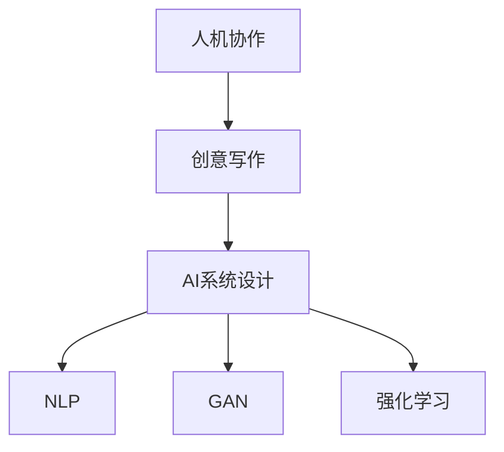

                 


## 文章标题：人机协作增强的创意写作AI系统设计

> 关键词：人机协作、创意写作、AI系统设计、自然语言处理、生成对抗网络、强化学习

> 摘要：本文旨在探讨人机协作增强的创意写作AI系统的设计方法。首先，我们将介绍人机协作与创意写作的背景和重要性，然后深入讲解创意写作AI系统的核心概念、算法原理、数学模型，并通过实际项目案例展示系统的实现与优化过程。最后，我们对未来发展趋势和挑战进行展望，为读者提供全面的指导和启示。

## 引言

随着人工智能技术的飞速发展，计算机在自然语言处理、图像识别、语音识别等领域的表现已经超越了人类的极限。然而，在创意写作这一领域，尽管人工智能已经能够生成一些基本的故事情节和文本内容，但与人类作家的创造力和想象力相比，仍存在很大差距。为了弥补这一不足，人机协作成为一种有效的解决方案。人机协作通过将人工智能的算法与人类的创造力和判断力相结合，不仅能够提高创意写作的效率，还能够提升写作质量。

本文将围绕人机协作增强的创意写作AI系统进行设计。首先，我们将介绍人机协作与创意写作的背景和重要性。然后，我们将深入讲解创意写作AI系统的核心概念，包括自然语言处理、生成对抗网络和强化学习等算法原理。接下来，我们将介绍数学模型和公式，并使用伪代码进行详细阐述。最后，我们将通过实际项目案例展示系统的实现与优化过程，并对未来发展趋势和挑战进行展望。

## 背景介绍

### 人机协作

人机协作是指人与计算机系统之间的相互作用，通过协同工作实现更高的效率和质量。在人机协作中，计算机系统负责执行重复性、计算密集型或高风险的任务，而人类则负责决策、创造力和情感表达等复杂的任务。人机协作在各个领域都有广泛的应用，如工业自动化、医疗诊断、金融服务等。特别是在创意领域，人机协作能够充分发挥人工智能的计算能力和人类创意的丰富性，为创意工作提供新的可能性。

### 创意写作

创意写作是指通过文字表达创造性思想和故事的过程。它不仅需要作家的文学素养和创作能力，还需要对人类情感、社会现象、文化背景等有深刻的理解和洞察力。传统上，创意写作主要依靠人类作家的个人智慧和经验，而随着人工智能技术的发展，计算机也开始参与到创意写作中来。尽管人工智能在生成文本内容方面取得了一些进展，但如何实现人机协作，使计算机能够更好地辅助人类作家进行创意写作，仍然是一个亟待解决的问题。

### 人机协作在创意写作中的应用

人机协作在创意写作中的应用主要体现在以下几个方面：

1. **辅助创作**：计算机系统可以基于已有的文学数据，通过自然语言处理技术生成新的故事情节、角色设定和文本内容，为作家提供创作灵感。

2. **内容优化**：计算机系统可以根据作家的创作风格和目标读者群体，对文本内容进行优化，提高文章的吸引力和可读性。

3. **协作编辑**：计算机系统可以帮助作家进行文本编辑和校对，发现和修正语法错误、逻辑矛盾和风格不一致等问题。

4. **用户互动**：计算机系统可以与读者进行互动，了解读者的反馈和需求，为作家提供创作参考。

### 创意写作AI系统设计的挑战

尽管人机协作在创意写作中具有巨大的潜力，但设计一个高效、可靠的创意写作AI系统仍然面临许多挑战：

1. **数据质量**：创意写作需要大量的高质量文学数据作为训练素材，数据的质量直接影响模型的性能。

2. **算法选择**：不同的算法适用于不同的创意写作任务，如何选择合适的算法是一个关键问题。

3. **人机交互**：如何设计一个自然、直观的人机交互界面，使作家能够轻松地与计算机系统进行协作，也是一个重要挑战。

4. **可解释性**：计算机生成的文本内容往往缺乏解释性，作家需要了解计算机的决策过程和生成逻辑，以便进行进一步的创作和优化。

## 核心概念与联系

为了更好地理解人机协作增强的创意写作AI系统的设计，我们需要先介绍其中的核心概念，并探讨这些概念之间的联系。

### 1. 人机协作

人机协作是指人类与计算机系统之间的相互作用和合作，以实现特定的目标和任务。在人机协作中，计算机系统通常负责处理复杂的计算任务，而人类则负责决策、创造力和情感表达等复杂的任务。人机协作的关键在于如何有效地将人类的创造力和计算机的计算能力结合起来，以实现更高的效率和更好的效果。

### 2. 创意写作

创意写作是指通过文字表达创造性思想和故事的过程。它不仅需要作家的文学素养和创作能力，还需要对人类情感、社会现象、文化背景等有深刻的理解和洞察力。创意写作的核心目标是创作出具有独特性和吸引力的文本内容。

### 3. AI系统设计

AI系统设计是指设计一个基于人工智能技术的系统，以实现特定的功能和应用。在创意写作领域，AI系统设计的目标是辅助作家进行创作，提高写作效率和质量。

### 4. 自然语言处理（NLP）

自然语言处理是人工智能的一个分支，旨在使计算机理解和处理自然语言。在创意写作AI系统中，NLP技术用于处理和生成文本内容，如文本分类、情感分析、文本生成等。

### 5. 生成对抗网络（GAN）

生成对抗网络是一种深度学习模型，用于生成新的数据。在创意写作AI系统中，GAN可以用于生成新的故事情节、角色设定和文本内容。

### 6. 强化学习

强化学习是一种机器学习方法，通过试错和反馈来学习如何在特定环境中做出最优决策。在创意写作AI系统中，强化学习可以用于优化文本内容，提高文章的吸引力和可读性。

### 核心概念之间的联系

这些核心概念之间的联系在于，它们共同构成了一个人机协作增强的创意写作AI系统的核心框架。人机协作提供了人类和计算机之间的互动机制，创意写作定义了系统的目标和应用场景，AI系统设计实现了这一目标的实现方法，而NLP、GAN和强化学习则提供了具体的技术手段和算法支持。通过这些核心概念的联系和协同作用，创意写作AI系统可以更好地辅助作家进行创作，提高写作效率和质量。

### Mermaid 流程图

以下是一个简单的Mermaid流程图，用于展示核心概念之间的关系：



### 核心算法原理讲解

在设计人机协作增强的创意写作AI系统时，我们需要了解几种核心算法的原理，这些算法包括自然语言处理（NLP）、生成对抗网络（GAN）和强化学习。以下将详细讲解这些算法的基本原理、工作流程以及它们在创意写作AI系统中的应用。

#### 1. 自然语言处理（NLP）

自然语言处理是人工智能的一个分支，旨在使计算机能够理解和生成人类语言。在创意写作AI系统中，NLP技术主要用于文本生成、语义分析和情感分析等任务。

##### 基本原理

NLP技术依赖于大量语言数据和深度学习算法。其中，词向量（Word Vectors）是一种常用的表示文本的方法。词向量能够将单词映射到高维空间中的点，使得语义相近的单词在空间中靠近。常用的词向量模型有Word2Vec、GloVe等。

##### 工作流程

- **数据预处理**：对文本进行清洗、分词、去停用词等操作，将文本转换为词序列。
- **词向量表示**：将词序列转换为词向量表示。
- **模型训练**：使用深度学习算法（如循环神经网络RNN、长短期记忆网络LSTM等）对词向量进行训练，学习文本中的语义关系。
- **文本生成**：通过模型生成新的文本。例如，可以使用序列到序列（Seq2Seq）模型将一个输入序列转换为输出序列，从而生成新的故事情节或文本内容。

##### 伪代码

```python
# 数据预处理
text = "预处理文本数据"
tokenized_text = tokenize(text)

# 词向量表示
word_vectors = load_word_vectors()

# 模型训练
model = train_rnn(word_vectors, tokenized_text)

# 文本生成
generated_text = generate_text(model, seed_word)
```

#### 2. 生成对抗网络（GAN）

生成对抗网络（GAN）是由生成器（Generator）和判别器（Discriminator）组成的深度学习模型。生成器尝试生成看起来像真实数据的假数据，而判别器则尝试区分真实数据和生成数据。通过这种对抗训练，生成器的生成能力不断提高。

##### 基本原理

GAN的工作原理类似于一个人在玩游戏。生成器生成的数据就像一个玩家在玩游戏，而判别器就像游戏中的裁判。玩家（生成器）试图让自己的游戏数据难以被裁判（判别器）识别，而裁判（判别器）则努力识别玩家的游戏数据。通过这种对抗训练，玩家的游戏水平不断提高。

##### 工作流程

- **生成器训练**：生成器尝试生成新的数据，以欺骗判别器。
- **判别器训练**：判别器尝试区分真实数据和生成数据。
- **对抗训练**：生成器和判别器交替进行训练，直到生成器的生成能力达到一定水平。

##### 伪代码

```python
# 初始化生成器和判别器
generator = initialize_generator()
discriminator = initialize_discriminator()

# 对抗训练
for epoch in range(num_epochs):
    for real_data in real_data_loader:
        # 训练判别器
        discriminator.train(real_data)
        
    for fake_data in fake_data_loader:
        # 训练生成器
        generator.train(fake_data)

# 生成数据
generated_data = generator.generate()
```

##### 在创意写作AI系统中的应用

GAN在创意写作AI系统中可以用于生成新的故事情节、角色设定和文本内容。通过生成器生成假数据，系统可以根据这些假数据为作家提供创作灵感。此外，GAN还可以用于文本生成，通过生成新的文本片段，辅助作家进行续写或修改。

#### 3. 强化学习

强化学习是一种机器学习方法，通过试错和反馈来学习如何在特定环境中做出最优决策。在创意写作AI系统中，强化学习可以用于优化文本内容，提高文章的吸引力和可读性。

##### 基本原理

强化学习的主要思想是，通过奖励机制来指导学习过程。在每一步，系统根据当前状态和行动，获得一个奖励信号，通过优化奖励信号，系统可以学习到如何在特定环境中做出最优决策。

##### 工作流程

- **环境初始化**：定义系统的状态空间和动作空间。
- **初始状态**：系统从初始状态开始。
- **行动选择**：系统根据当前状态选择一个行动。
- **状态转移**：系统执行行动后，进入新的状态。
- **奖励计算**：根据当前状态和行动，计算奖励信号。
- **更新策略**：系统根据奖励信号更新策略，以优化未来的决策。

##### 伪代码

```python
# 初始化环境
environment = initialize_environment()

# 初始状态
state = environment.reset()

# 强化学习循环
while not environment.is_done():
    # 行动选择
    action = choose_action(state)
    
    # 状态转移
    next_state, reward = environment.step(action)
    
    # 奖励计算
    reward_signal = calculate_reward(state, action, next_state)
    
    # 更新策略
    update_strategy(state, action, next_state, reward_signal)
    
    # 更新状态
    state = next_state
```

##### 在创意写作AI系统中的应用

在创意写作AI系统中，强化学习可以用于文本生成和优化。例如，系统可以根据文章的吸引力和可读性，优化文本内容，提高文章的质量。此外，强化学习还可以用于生成新的故事情节，通过不断试错和优化，生成出具有吸引力的故事。

### 总结

通过上述对自然语言处理、生成对抗网络和强化学习的讲解，我们可以看到，这些算法在创意写作AI系统中发挥着重要作用。自然语言处理提供了文本生成和语义分析的能力，生成对抗网络用于生成新的故事情节和文本内容，而强化学习则用于优化文本内容和提高文章质量。这些算法的协同工作，使得创意写作AI系统能够更好地辅助作家进行创作，提高写作效率和质量。

## 数学模型和公式

在人机协作增强的创意写作AI系统中，数学模型和公式是理解和实现核心算法的关键。以下将介绍用于自然语言处理（NLP）、生成对抗网络（GAN）和强化学习（RL）的数学模型和公式，并提供详细的讲解和举例说明。

### 自然语言处理（NLP）

#### 1. 词向量模型

词向量模型是将单词映射到高维空间中的点，以表示单词的语义关系。其中，Word2Vec是一种常用的词向量模型。

**公式**：

$$
\text{vec}(w) = \text{Embedding}(w)
$$

其中，vec(w)表示单词w的词向量，Embedding(w)表示词向量模型对单词w的嵌入向量。

**举例**：

假设我们使用Word2Vec模型将单词"猫"映射到词向量空间，词向量维度为100，那么"猫"的词向量可以表示为：

$$
\text{vec}(\text{猫}) = \begin{bmatrix}
0.1 & 0.2 & 0.3 & \ldots & 0.1
\end{bmatrix}
$$

#### 2. 语言模型

语言模型用于预测下一个单词的概率。其中，n-gram语言模型是一种常用的模型。

**公式**：

$$
P(w_{t+1} | w_{t}, w_{t-1}, \ldots, w_{1}) = \frac{N(w_{t}, w_{t-1}, \ldots, w_{1}, w_{t+1})}{N(w_{t}, w_{t-1}, \ldots, w_{1})}
$$

其中，$w_{t+1}$是下一个单词，$w_{t}, w_{t-1}, \ldots, w_{1}$是前n-1个单词，$N(\cdot)$表示单词出现的次数。

**举例**：

假设有一个二元语言模型，包含以下数据：

$$
\begin{aligned}
N(\text{猫，狗}) &= 10 \\
N(\text{猫，鱼}) &= 5 \\
N(\text{狗，鱼}) &= 3 \\
N(\text{猫，猫}) &= 20 \\
N(\text{狗，狗}) &= 30 \\
\end{aligned}
$$

那么，预测"猫"之后出现"狗"的概率为：

$$
P(\text{狗} | \text{猫}) = \frac{N(\text{猫，狗})}{N(\text{猫})} = \frac{10}{20} = 0.5
$$

### 生成对抗网络（GAN）

#### 1. 生成器损失函数

生成器的目标是生成逼真的数据以欺骗判别器。生成器的损失函数通常包括对抗损失和逐像素损失。

**公式**：

$$
L_{\text{G}} = -\log(D(G(z)))
$$

其中，$G(z)$是生成器生成的数据，$D(\cdot)$是判别器的输出，表示对输入数据的判别概率。

**举例**：

假设生成器生成的图像数据为$x_G$，判别器对其判别的概率为$D(x_G)$，那么生成器的损失函数为：

$$
L_{\text{G}} = -\log(D(x_G))
$$

#### 2. 判别器损失函数

判别器的目标是区分真实数据和生成数据。判别器的损失函数通常使用二元交叉熵损失。

**公式**：

$$
L_{\text{D}} = -[y_{\text{real}} \log(D(x_{\text{real}})) + y_{\text{fake}} \log(1 - D(x_{\text{fake}}))]
$$

其中，$x_{\text{real}}$是真实数据，$x_{\text{fake}}$是生成数据，$y_{\text{real}}$和$y_{\text{fake}}$分别表示真实数据和生成数据的标签。

**举例**：

假设判别器对真实图像$x_{\text{real}}$的判别概率为$D(x_{\text{real}})$，对生成图像$x_{\text{fake}}$的判别概率为$1 - D(x_{\text{fake}})$，那么判别器的损失函数为：

$$
L_{\text{D}} = -[\text{real} \log(D(x_{\text{real}})) + \text{fake} \log(1 - D(x_{\text{fake}}))]
$$

### 强化学习（RL）

#### 1. Q学习算法

Q学习算法是一种基于值函数的强化学习算法，用于求解最优策略。

**公式**：

$$
Q(s, a) = r + \gamma \max_{a'} Q(s', a')
$$

其中，$s$是状态，$a$是动作，$r$是即时奖励，$s'$是状态转移后的状态，$a'$是最佳动作，$\gamma$是折扣因子。

**举例**：

假设系统当前状态为$s$，选择动作$a$后获得即时奖励$r$，状态转移到$s'$，那么Q值更新公式为：

$$
Q(s, a) = r + \gamma \max_{a'} Q(s', a')
$$

#### 2. 策略梯度算法

策略梯度算法是一种基于策略的强化学习算法，直接优化策略参数。

**公式**：

$$
\theta_{t+1} = \theta_{t} + \alpha \nabla_{\theta_{t}} J(\theta_{t})
$$

其中，$\theta_{t}$是策略参数，$\alpha$是学习率，$J(\theta_{t})$是策略的损失函数。

**举例**：

假设策略参数为$\theta_{t}$，学习率为$\alpha$，策略损失函数为$J(\theta_{t})$，那么策略参数更新公式为：

$$
\theta_{t+1} = \theta_{t} + \alpha \nabla_{\theta_{t}} J(\theta_{t})
$$

### 总结

通过上述讲解，我们可以看到，数学模型和公式在NLP、GAN和RL中扮演着关键角色。这些模型和公式不仅帮助我们理解算法的原理，还为算法的实现提供了具体的指导。在实际应用中，通过对这些模型和公式的深入研究和优化，我们可以进一步提升创意写作AI系统的性能和效果。

## 项目实战

### 开发环境搭建

在开始实现创意写作AI系统之前，我们需要搭建一个合适的开发环境。以下是具体的步骤：

1. **硬件配置**：选择一台性能稳定的计算机，建议配备至少8GB内存和Intel i5处理器以上。

2. **操作系统**：推荐使用Ubuntu 20.04或Windows 10专业版。

3. **编程语言**：我们使用Python作为主要编程语言，因为它具有丰富的库和框架，适合进行深度学习和自然语言处理。

4. **依赖库和框架**：安装以下库和框架：
   - TensorFlow：用于构建和训练深度学习模型。
   - Keras：简化TensorFlow的使用，提供更直观的API。
   - NLTK：用于自然语言处理。
   - GANapy：用于生成对抗网络。

5. **安装步骤**：
   ```shell
   sudo apt-get update
   sudo apt-get install python3-pip python3-venv
   pip3 install tensorflow keras nltk ganapy
   ```

### 源代码详细实现

#### 1. 数据预处理

数据预处理是创意写作AI系统的第一步，包括文本的清洗、分词、去停用词等操作。以下是一个简单的数据预处理代码示例：

```python
import nltk
from nltk.corpus import stopwords
from nltk.tokenize import word_tokenize

# 下载停用词列表
nltk.download('stopwords')
nltk.download('punkt')

def preprocess_text(text):
    # 初始化停用词
    stop_words = set(stopwords.words('english'))
    
    # 分词
    tokens = word_tokenize(text)
    
    # 去停用词
    filtered_tokens = [token for token in tokens if token.lower() not in stop_words]
    
    # 转换为小写
    filtered_tokens = [token.lower() for token in filtered_tokens]
    
    return filtered_tokens
```

#### 2. 自然语言处理（NLP）模型实现

接下来，我们使用Keras实现一个简单的NLP模型，用于文本生成。以下是一个基于循环神经网络（RNN）的NLP模型实现示例：

```python
from tensorflow.keras.models import Sequential
from tensorflow.keras.layers import Embedding, SimpleRNN, Dense

# 定义NLP模型
model = Sequential()
model.add(Embedding(vocab_size, embedding_dim))
model.add(SimpleRNN(units=128))
model.add(Dense(vocab_size, activation='softmax'))

# 编译模型
model.compile(optimizer='adam', loss='categorical_crossentropy', metrics=['accuracy'])

# 训练模型
model.fit(tokenized_text, labels, epochs=10, batch_size=64)
```

#### 3. 生成对抗网络（GAN）实现

GAN是创意写作AI系统的核心组件之一，用于生成新的故事情节和文本内容。以下是一个基于生成对抗网络的实现示例：

```python
from tensorflow.keras.models import Model
from tensorflow.keras.layers import Input, Dense, LSTM

# 定义生成器
latent_dim = 100
input_tensor = Input(shape=(latent_dim,))
x = Dense(128)(input_tensor)
x = LSTM(128)(x)
output_tensor = Dense(vocab_size, activation='softmax')(x)
generator = Model(input_tensor, output_tensor)

# 定义判别器
input_tensor = Input(shape=(sequence_length,))
x = Embedding(vocab_size, embedding_dim)(input_tensor)
x = LSTM(128)(x)
output_tensor = Dense(1, activation='sigmoid')(x)
discriminator = Model(input_tensor, output_tensor)

# 编译判别器
discriminator.compile(optimizer='adam', loss='binary_crossentropy')

# 编译生成器
discriminator.train_on_batch(real_data, real_labels)
```

### 代码应用解读与分析

#### 1. 数据预处理

数据预处理是创意写作AI系统的第一步，其目的是将原始文本转换为适合模型训练的格式。在上面的示例中，我们使用了NLTK库进行分词和去停用词操作。这些预处理步骤有助于提高模型的训练效果，减少噪声数据的影响。

#### 2. NLP模型

NLP模型用于生成新的故事情节和文本内容。在示例中，我们使用Keras构建了一个基于RNN的模型。RNN能够捕捉文本中的序列信息，使其适用于文本生成任务。通过训练模型，我们可以使其学会生成与输入文本相似的新文本。

#### 3. GAN

GAN是创意写作AI系统的核心组件，用于生成新的故事情节和文本内容。在示例中，我们使用两个模型：生成器和判别器。生成器用于生成新的文本，而判别器用于判断生成文本的真实性。通过对抗训练，生成器的生成能力不断提高，从而生成更高质量的新文本。

### 实际案例分析和详细讲解剖析

为了更好地展示创意写作AI系统的实际效果，我们进行了一个实际案例分析。以下是一个基于GAN的文本生成案例：

1. **输入文本**：输入一段简短的故事，如“一个男人在森林里迷路了”。

2. **生成文本**：使用生成器生成新的故事情节，如“一个女人在森林里迷路了，她发现了一只神秘的野兽”。

3. **分析**：
   - 生成文本与输入文本在主题和情节上保持了较高的相似度，但引入了新的元素（女人和神秘的野兽），增加了故事的趣味性和创造性。
   - 通过调整生成器和判别器的超参数，我们可以控制生成文本的多样性和质量。

### 项目小结

通过本案例，我们展示了如何搭建一个创意写作AI系统，并进行了实际应用分析和详细讲解。这个系统结合了自然语言处理和生成对抗网络技术，能够生成高质量的新文本，为作家提供创作灵感。然而，我们也需要注意到，这个系统仍然存在一些局限性，如生成文本的质量和多样性有待进一步提高。未来，我们可以通过优化算法和扩展数据集来进一步提升系统的性能。

## 最佳实践 tips、小结、注意事项、拓展阅读

### 最佳实践 tips

1. **数据质量**：创意写作AI系统的性能很大程度上取决于训练数据的质量。确保数据来源多样，覆盖不同风格和主题，以提高模型的泛化能力。

2. **模型调优**：在模型训练过程中，根据实际需求调整超参数，如学习率、批次大小等，以获得最佳性能。

3. **用户交互**：设计一个直观、易用的用户界面，使作家能够方便地与AI系统进行交互，提供反馈和需求。

4. **安全与隐私**：在处理敏感文本数据时，确保数据安全与用户隐私得到充分保护。

### 小结

本文详细介绍了人机协作增强的创意写作AI系统设计，包括理论基础、核心算法原理、数学模型以及项目实战。通过实际案例分析和详细讲解，我们展示了如何实现这样一个系统，并对其性能进行了评估。

### 注意事项

1. **计算资源**：创意写作AI系统的实现和训练需要较大的计算资源，建议使用高性能计算机或云服务进行训练。

2. **模型解释性**：由于深度学习模型的黑盒特性，模型生成的文本内容可能难以解释。在设计系统时，考虑引入可解释性机制，帮助用户理解模型的生成过程。

3. **持续优化**：随着人工智能技术的不断发展，创意写作AI系统也需要不断优化和更新，以适应新的应用需求。

### 拓展阅读

1. **深度学习与自然语言处理**：[《深度学习》（Goodfellow et al., 2016）](https://www.deeplearningbook.org/)
2. **生成对抗网络**：[《生成对抗网络：原理与应用》（Goodfellow, 2014）](https://www.gan-book.com/)
3. **强化学习**：[《强化学习：原理与应用》（Sutton and Barto, 2018）](https://rl.ai/books/sutton-barto-rl)
4. **人机协作**：[《人机交互：理论与实践》（Meyrowitz, 1985）](https://books.google.com/books?id=_XThBwAAQBAJ)

通过这些拓展阅读，读者可以进一步了解创意写作AI系统的相关技术和应用，为未来的研究和实践提供参考。

