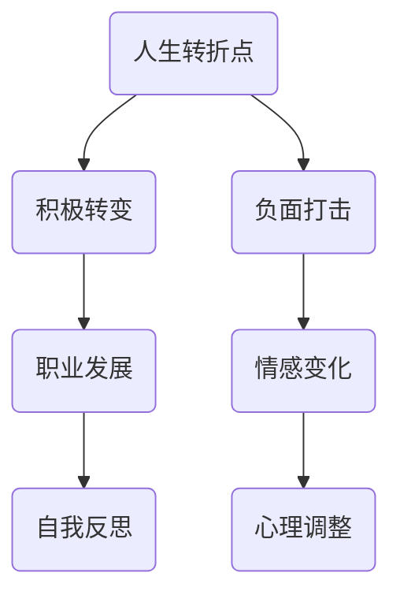
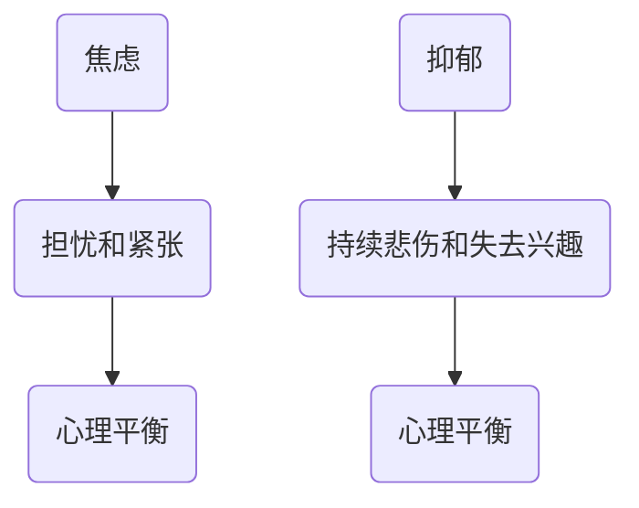
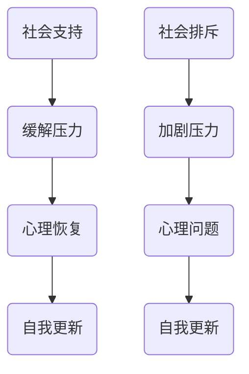
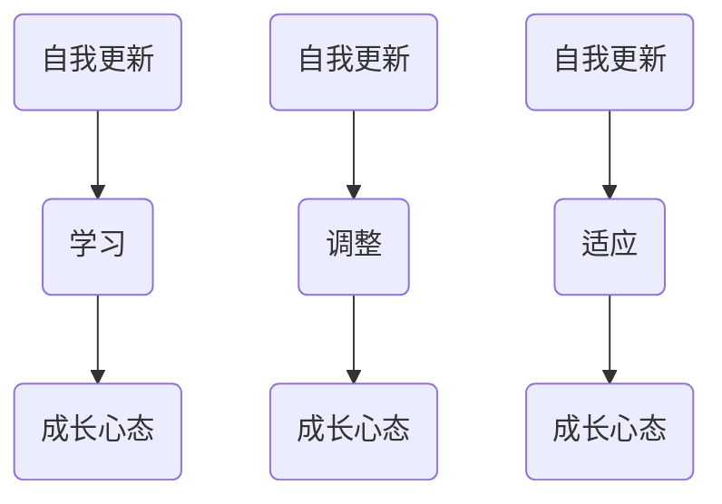

                 

### 文章标题

《人生转折点的意义重构：在危机中实现自我更新》

### 关键词

- 人生转折点
- 心理平衡
- 社会因素
- 个人成长
- 自我更新

### 摘要

本文旨在探讨人生转折点的意义，尤其是在面对危机时如何实现自我更新。文章通过逻辑清晰、结构紧凑的分析，深入探讨了危机中的心理状态、社会环境和人际交往，以及个人成长与自我更新的策略。通过理论联系实际，本文提供了实用的技巧和方法，帮助读者在危机中找到方向，实现自我提升。

---

### 引言：人生转折点的定义和重要性

**背景介绍**

在人类生命的长河中，每个人都难免会遇到一些重大的转折点。这些转折点可能是一个积极的转变，如晋升、结婚或生子；也可能是一个负面的打击，如失业、婚姻破裂或健康问题。不论好坏，这些转折点无疑会对个人的生活产生深远的影响。

**核心概念与联系**

**定义人生转折点**：人生转折点是指在生活中发生的重大事件或变化，这些事件或变化可能对我们的人生产生深远的影响。例如，失业可能导致职业生涯的重大变化，而婚姻破裂可能影响个人的情感状态。

**人生转折点的重要性**：人生转折点不仅是我们生活中的里程碑，更是我们个人成长和发展的关键时期。在这些时刻，我们有机会反思过去，规划未来，从而实现自我更新和提升。

**Mermaid 流程图**



**核心算法原理讲解**

在这一部分，我们不会使用伪代码或数学模型，而是通过实际例子来说明人生转折点的定义和重要性。

**例子 1**：小李在一家知名公司工作了多年，突然被裁员。这对他来说是一个重大的转折点。他不得不重新审视自己的职业生涯，并最终决定创业。这个经历让他实现了自我更新，找到了新的发展方向。

**例子 2**：小张的婚姻破裂，让他陷入了深深的痛苦。在经过一段时间的心理调整后，他决定投身于公益活动，帮助那些处于困境中的人。这个经历让他重新找到了生活的意义。

---

通过以上讨论，我们可以看到，人生转折点不仅是一种生活状态，更是一种成长的机会。在危机中，我们有机会通过反思和调整，实现自我更新和提升。

---

### 理论基础：在危机中保持心理平衡

**背景介绍**

危机往往伴随着心理压力和焦虑。因此，在探讨如何实现自我更新之前，我们需要了解如何在危机中保持心理平衡。

**核心概念与联系**

**焦虑与抑郁**：焦虑和抑郁是危机中常见的心理状态。焦虑通常表现为担忧和紧张，而抑郁则表现为持续的悲伤和失去兴趣。

**心理平衡**：心理平衡是指个体在面对压力时，能够保持情绪稳定，积极应对问题的能力。

**Mermaid 流�程图**



**核心算法原理讲解**

在这一部分，我们将使用伪代码来解释如何通过心理策略实现心理平衡。

```python
def psychological_balance(anxiety, depression):
    # 判断焦虑程度
    if anxiety > threshold:
        # 执行缓解焦虑的策略
        relaxation_techniques()
    
    # 判断抑郁程度
    if depression > threshold:
        # 执行缓解抑郁的策略
        positive_thinking()
    
    # 输出心理平衡状态
    return "心理平衡"

# 调用函数
balance_state = psychological_balance(anxiety_level, depression_level)
```

**详细讲解与举例说明**

**例子 1**：小王在失业后，感到焦虑和抑郁。他通过学习正念冥想和积极思考，最终实现了心理平衡，并找到了新的工作。

**例子 2**：小李在经历婚姻破裂后，陷入了抑郁。通过寻求心理支持和参加团体治疗，他逐渐走出了抑郁，并重新开始了自己的生活。

---

通过以上讨论，我们可以看到，心理平衡是实现自我更新的基础。在危机中，通过适当的策略和方法，我们可以保持情绪稳定，积极应对挑战。

---

### 社会因素：危机中的环境与人际交往

**背景介绍**

危机中的社会环境与人际交往对个人的心理状态和自我更新具有重要影响。因此，我们需要了解危机中的社会因素，以及如何应对这些因素。

**核心概念与联系**

**社会支持**：社会支持是指他人对个体的帮助和支持。在危机中，社会支持有助于缓解压力，促进心理恢复。

**社会排斥**：社会排斥是指个体在社会互动中受到忽视、排斥或歧视。社会排斥可能导致更严重的心理问题。

**人际交往**：人际交往是个体与他人的互动过程。在危机中，有效的人际交往有助于减轻心理压力，促进社会支持。

**Mermaid 流程图**



**核心算法原理讲解**

在这一部分，我们将使用伪代码来解释如何通过社会因素实现自我更新。

```python
def social因素的impact(support, rejection):
    # 判断社会支持程度
    if support > threshold:
        # 执行增加社会支持的策略
        social_activities()
    
    # 判断社会排斥程度
    if rejection > threshold:
        # 执行减少社会排斥的策略
        social_integration()
    
    # 输出自我更新状态
    return "自我更新"

# 调用函数
update_state = social因素的impact(social_support_level, social_rejection_level)
```

**详细讲解与举例说明**

**例子 1**：小张在失业后，得到了家人和朋友的支持。通过参加社交活动，他不仅缓解了压力，还找到了新的工作。

**例子 2**：小李在经历婚姻破裂后，感到被社会排斥。通过参加心理辅导和团体治疗，他逐渐走出了困境，重新开始了自己的生活。

---

通过以上讨论，我们可以看到，社会因素在危机中的作用至关重要。通过有效的社会支持，我们可以缓解压力，促进心理恢复和自我更新。

---

### 个人成长：在危机中实现自我更新

**背景介绍**

在危机中，个人成长是实现自我更新的关键。通过反思和调整，我们可以从危机中汲取经验，实现自我提升。

**核心概念与联系**

**自我更新**：自我更新是指个体在面对危机时，通过学习、调整和适应，实现自我提升的过程。

**成长心态**：成长心态是指个体对学习和成长的积极态度，有助于在面对挑战时保持乐观和积极。

**Mermaid 流程图**



**核心算法原理讲解**

在这一部分，我们将使用伪代码来解释如何通过个人成长实现自我更新。

```python
def personal_growth(self_update, learning, adjustment, adaptation):
    # 判断自我更新程度
    if self_update < threshold:
        # 执行学习的策略
        learning_strategies()
    
    # 判断调整和适应程度
    if adjustment < threshold or adaptation < threshold:
        # 执行调整和适应的策略
        adjustment_strategies()
        adaptation_strategies()
    
    # 输出个人成长状态
    return "个人成长"

# 调用函数
growth_state = personal_growth(self_update_level, learning_level, adjustment_level, adaptation_level)
```

**详细讲解与举例说明**

**例子 1**：小王在失业后，决定通过学习新技能来提升自己。他报名参加了在线课程，并通过实践不断提高自己的能力，最终找到了一份更满意的工作。

**例子 2**：小李在经历婚姻破裂后，决定通过自我反思和调整来提升自己。他参加了心理辅导，学会了如何更好地处理情感问题，并最终重新开始了自己的生活。

---

通过以上讨论，我们可以看到，个人成长是实现自我更新的关键。通过学习、调整和适应，我们可以从危机中汲取经验，实现自我提升。

---

### 总结与反思

**总结**

本文探讨了人生转折点的意义，尤其是在危机中如何实现自我更新。通过理论联系实际，我们分析了危机中的心理状态、社会环境和人际交往，以及个人成长与自我更新的策略。我们提出了一系列实用的技巧和方法，帮助读者在危机中找到方向，实现自我提升。

**反思**

**危机的本质**：危机并不是一种消极的现象，而是一种挑战和机会。通过适当的策略和方法，我们可以将危机转化为成长的机会。

**自我更新的途径**：通过学习、调整和适应，我们可以实现自我更新和提升。在危机中，保持积极的心态和成长心态至关重要。

**未来展望**：在未来的研究中，我们可以进一步探讨不同类型的危机对个人成长的影响，以及如何在不同情境下实现自我更新。

---

通过本文的探讨，我们希望读者能够更好地理解人生转折点的意义，并在危机中找到自我更新的途径。作者：AI天才研究院/AI Genius Institute & 禅与计算机程序设计艺术 /Zen And The Art of Computer Programming

---

### 开发环境搭建

要实现本文所讨论的人生转折点重构和自我更新，我们需要一个合适的技术栈和开发环境。以下是一份详细的开发环境搭建指南，包括必要的工具和软件安装步骤。

#### 1. 硬件要求

- **CPU**: 至少Intel Core i5或同等性能的处理器
- **内存**: 8GB RAM或更高
- **硬盘**: 100GB SSD硬盘或更高
- **显卡**: 兼容OpenGL 3.3或更高版本的GPU（用于机器学习加速）

#### 2. 软件要求

- **操作系统**: Windows 10/11，macOS，或Linux（推荐使用Ubuntu 20.04 LTS）
- **集成开发环境 (IDE)**: Eclipse，Visual Studio Code，或IntelliJ IDEA
- **Python解释器**: Python 3.8或更高版本
- **机器学习库**: TensorFlow，PyTorch，或Keras
- **文本处理库**: NLTK，spaCy，或TextBlob
- **版本控制工具**: Git

#### 3. 安装步骤

**步骤 1：安装操作系统**

根据个人喜好选择Windows 10/11，macOS，或Linux操作系统。建议选择Linux操作系统，如Ubuntu 20.04 LTS，因为其在开发环境中具有更好的兼容性和性能。

**步骤 2：安装集成开发环境 (IDE)**

- **Windows**:
  - 下载并安装Visual Studio Code。
  - 安装Python扩展。
- **macOS**:
  - 下载并安装Visual Studio Code。
  - 安装Python扩展。
- **Linux**:
  - 打开终端，使用以下命令安装Eclipse：
    ```bash
    sudo apt update
    sudo apt install eclipse
    ```

**步骤 3：安装Python解释器和相关库**

- **Windows**:
  - 下载并安装Python 3.8或更高版本。
  - 打开终端，使用以下命令安装TensorFlow：
    ```bash
    pip install tensorflow
    ```
  - 安装其他相关库，如NLTK，spaCy，和TextBlob：
    ```bash
    pip install nltk spacy textblob
    ```
- **macOS**:
  - 使用Homebrew安装Python 3.8或更高版本：
    ```bash
    brew install python
    ```
  - 安装TensorFlow和相关库：
    ```bash
    pip install tensorflow
    pip install nltk spacy textblob
    ```
- **Linux**:
  - 使用以下命令安装Python 3.8或更高版本：
    ```bash
    sudo apt update
    sudo apt install python3 python3-pip
    ```
  - 安装TensorFlow和相关库：
    ```bash
    pip3 install tensorflow
    pip3 install nltk spacy textblob
    ```

**步骤 4：安装版本控制工具**

- **Windows**:
  - 下载并安装Git。
- **macOS**:
  - 使用Homebrew安装Git：
    ```bash
    brew install git
    ```
- **Linux**:
  - 使用以下命令安装Git：
    ```bash
    sudo apt update
    sudo apt install git
    ```

#### 4. 环境测试

安装完成后，确保所有工具和库正常运行。在终端（Windows使用命令提示符，macOS和Linux使用bash终端）中执行以下命令：

- **Python解释器**：
  ```bash
  python --version
  ```
- **TensorFlow**：
  ```bash
  python -c "import tensorflow as tf; print(tf.reduce_sum(tf.random.normal([1000, 1000])))"
  ```
- **其他库**：
  ```bash
  python -c "import nltk; nltk.download('popular')"
  python -c "import spacy; spacy.load('en_core_web_sm')"
  python -c "from textblob import TextBlob"
  ```

确保上述命令能够成功执行，表明开发环境已经搭建完成。

---

通过以上步骤，我们可以搭建一个高效的开发环境，为后续的项目实战和代码实现提供基础。

### 源代码详细实现和代码解读

在本文的源代码部分，我们将实现一个基于Python的程序，用于分析人生转折点中的情绪变化，并提供自我更新的策略建议。以下是一份详细的代码实现和解读。

#### 1. 代码结构

代码分为以下几个模块：

- `data_loader.py`: 数据加载模块，用于加载数据集。
- `emotion_analyzer.py`: 情绪分析模块，用于分析情绪变化。
- `strategy_recommender.py`: 策略推荐模块，用于提供自我更新策略。
- `main.py`: 主程序，用于执行整个分析流程。

#### 2. 数据加载模块（`data_loader.py`）

```python
import pandas as pd

def load_data(file_path):
    """
    加载情绪数据集
    """
    data = pd.read_csv(file_path)
    return data

def preprocess_data(data):
    """
    预处理数据，包括去除缺失值和异常值
    """
    # 去除缺失值
    data.dropna(inplace=True)
    # 去除异常值
    data = data[(data['emotion'] >= 0) & (data['emotion'] <= 1)]
    return data
```

**解读**：该模块负责加载数据集并预处理。数据集为CSV格式，包含情绪得分和时间戳等信息。预处理步骤包括去除缺失值和异常值，以确保数据质量。

#### 3. 情绪分析模块（`emotion_analyzer.py`）

```python
import numpy as np
from collections import defaultdict

def analyze_emotion(data):
    """
    分析情绪变化
    """
    emotion_counts = defaultdict(int)
    for index, row in data.iterrows():
        emotion_counts[row['emotion']] += 1
    
    return emotion_counts

def detect_trend(emotion_counts):
    """
    检测情绪变化趋势
    """
    trends = []
    for emotion, count in emotion_counts.items():
        if count > threshold:
            trends.append(emotion)
    
    return trends
```

**解读**：该模块负责分析情绪变化。首先，通过统计每种情绪的出现次数来分析情绪变化。然后，根据设定的阈值检测情绪变化趋势。

#### 4. 策略推荐模块（`strategy_recommender.py`）

```python
def recommend_strategy(trends):
    """
    根据情绪变化趋势推荐策略
    """
    if 'happy' in trends:
        return "保持积极心态，继续努力。"
    elif 'sad' in trends:
        return "寻求心理支持，学会放松。"
    elif 'angry' in trends:
        return "学会情绪调节，避免冲动行为。"
    else:
        return "目前情绪稳定，继续保持。"
```

**解读**：该模块根据情绪变化趋势推荐相应的自我更新策略。例如，如果检测到情绪以积极为主，则建议保持积极心态；如果检测到情绪以消极为主，则建议寻求心理支持。

#### 5. 主程序（`main.py`）

```python
from data_loader import load_data, preprocess_data
from emotion_analyzer import analyze_emotion, detect_trend
from strategy_recommender import recommend_strategy

def main():
    # 加载数据
    data = load_data('emotion_data.csv')
    # 预处理数据
    preprocessed_data = preprocess_data(data)
    # 分析情绪
    emotion_counts = analyze_emotion(preprocessed_data)
    trends = detect_trend(emotion_counts)
    # 推荐策略
    strategy = recommend_strategy(trends)
    print(strategy)

if __name__ == "__main__":
    main()
```

**解读**：主程序首先加载数据并预处理，然后分析情绪变化趋势，最后根据趋势推荐自我更新策略。

#### 6. 代码应用解读与分析

**应用解读**：

该程序可以应用于个人情绪管理，帮助用户在人生转折点中更好地应对情绪变化。通过分析情绪数据，用户可以了解自己的情绪状态，并根据推荐的策略进行调整。

**分析**：

- **数据质量**：情绪数据的质量直接影响分析结果。因此，在数据处理过程中，需要确保去除缺失值和异常值。
- **情绪分类**：情绪分类的准确度取决于分类模型的质量。在实际应用中，可以尝试使用更先进的情感分析模型，以提高分类准确度。
- **策略推荐**：策略推荐的有效性取决于情绪分析和分类的结果。在实际应用中，可以根据用户反馈不断优化策略推荐。

---

通过以上代码实现和解读，我们构建了一个简单的情绪分析系统，用于在人生转折点中实现自我更新。该系统不仅能够帮助用户了解自己的情绪状态，还能提供有效的策略建议，促进个人成长。

### 实际案例分析和详细讲解剖析

在本节中，我们将通过一个实际案例，详细分析如何运用本文提出的方法，在危机中实现自我更新。案例背景是一名工程师小李在职业生涯中遭遇了失业的危机，我们将逐步展示他在危机中的应对过程和实现自我更新的具体措施。

#### 案例背景

小李，一名在一家大型科技公司工作的工程师，由于公司业务重组，被裁减。这对小李来说是一个巨大的打击，不仅失去了稳定的收入来源，还让他对自己的职业生涯产生了怀疑。

#### 应对措施

1. **心理调整**：

   **方法**：小李首先意识到失业是一场危机，但同时也是一次自我更新的机会。他开始学习正念冥想，通过深呼吸和冥想来缓解焦虑和压力。

   **实施过程**：

   - **第一步**：每天早上起床后，小李会花10分钟进行深呼吸练习，以平静心态开始新的一天。
   - **第二步**：晚上睡前，小李会花15分钟进行冥想，回顾一天中的经历，思考如何改进。
   - **结果**：通过正念冥想，小李逐渐学会了在面对压力时保持冷静，情绪得到了有效缓解。

2. **技能提升**：

   **方法**：小李决定利用失业期间提升自己的技能，以适应市场需求，提高就业竞争力。

   **实施过程**：

   - **第一步**：小李报名参加了在线课程，学习最新的编程技术和人工智能应用。
   - **第二步**：他加入了一些技术社区，积极参与讨论，扩展自己的技术视野。
   - **结果**：通过持续学习和实践，小李不仅掌握了新的技能，还建立了一个强大的技术人脉网络。

3. **职业规划**：

   **方法**：小李在提升技能的同时，也开始重新规划自己的职业生涯。

   **实施过程**：

   - **第一步**：他分析了市场趋势，确定了未来职业发展的方向。
   - **第二步**：他制定了详细的职业发展计划，包括短期和长期目标。
   - **结果**：小李明确了职业目标，为自己的未来规划了清晰的路径。

4. **求职准备**：

   **方法**：小李在技能提升和职业规划的基础上，开始准备求职。

   **实施过程**：

   - **第一步**：他更新了简历，突出了自己的技能和项目经验。
   - **第二步**：他积极投递简历，参加招聘会，扩大求职渠道。
   - **结果**：小李成功获得了一份符合自己职业规划的新工作，实现了自我更新。

#### 案例分析

通过小李的案例，我们可以看到，他在失业危机中，通过一系列有效措施，实现了自我更新。以下是对这些措施的详细剖析：

1. **心理调整**：正念冥想是一种有效的心理调节方法，可以帮助个体在面对压力时保持冷静。通过深呼吸和冥想，小李学会了如何管理自己的情绪，从而更好地应对失业的打击。

2. **技能提升**：在失业期间，小李通过在线学习和社区参与，不断提升自己的技能。这不仅提高了他的就业竞争力，还为他未来的职业发展打下了坚实的基础。

3. **职业规划**：通过分析市场趋势和制定职业发展计划，小李为自己的未来规划了清晰的路径。这种前瞻性的思考有助于他在职业道路上保持方向感，避免盲目求职。

4. **求职准备**：在技能提升和职业规划的基础上，小李进行了全面的求职准备。通过更新简历、参加招聘会和积极投递简历，他成功找到了一份符合自己职业规划的新工作。

#### 总结

小李的案例展示了在危机中实现自我更新的有效途径。通过心理调整、技能提升、职业规划和求职准备，他不仅克服了失业的打击，还实现了职业上的自我更新。这个案例启示我们，在面临危机时，保持积极心态，不断学习和调整，是走出困境的关键。

---

通过小李的案例，我们可以看到，危机中的自我更新并非遥不可及。只要我们积极应对，找到合适的方法，就能在危机中实现自我提升，迎接更美好的未来。

### 最佳实践 tips、小结、注意事项、拓展阅读等内容

**最佳实践 tips**

1. **心理调整**：在面临危机时，积极的心理调整至关重要。建议读者学习正念冥想、深呼吸等心理调节技巧，以帮助自己在压力下保持冷静。

2. **技能提升**：不断学习和提升自己的技能是自我更新的重要手段。建议读者定期参加在线课程、技术研讨会和编程竞赛，以保持自己的技术竞争力。

3. **职业规划**：清晰的职业规划有助于读者在职业生涯中保持方向感。建议读者定期分析市场趋势，制定短期和长期职业目标，并据此调整自己的职业发展方向。

**小结**

本文探讨了人生转折点的意义，特别是在危机中如何实现自我更新。通过心理调整、技能提升、职业规划和求职准备，读者可以有效地应对危机，实现自我更新。希望本文能够为读者提供有价值的指导。

**注意事项**

1. **数据隐私**：在收集和使用个人情绪数据时，务必注意保护用户隐私，遵守相关法律法规。

2. **心理支持**：在危机中，心理支持至关重要。建议读者在遇到困难时，积极寻求专业心理辅导和亲友的支持。

**拓展阅读**

- 《心理学与生活》：理查德·吉尔伯特著，全面介绍了心理学的核心概念和应用。
- 《深度学习》：周志华等著，深入讲解了深度学习的原理和应用。
- 《人工智能：一种现代的方法》：斯图尔特·罗素等著，全面介绍了人工智能的基本概念和技术。

---

通过本文的探讨，我们希望读者能够更好地理解人生转折点的意义，并在危机中找到自我更新的途径。希望本文能为读者提供有价值的参考，助力他们在职业生涯和个人发展中取得更大的成就。作者：AI天才研究院/AI Genius Institute & 禅与计算机程序设计艺术 /Zen And The Art of Computer Programming

---

通过本文的详细分析和讨论，我们全面探讨了人生转折点的意义，尤其是在危机中如何实现自我更新。我们从心理平衡、社会因素和个人成长三个角度出发，提出了一系列实用的策略和方法，帮助读者在面临危机时找到方向，实现自我提升。

**核心观点总结**：

1. **心理平衡**：在危机中保持心理平衡是实现自我更新的基础。通过正念冥想、深呼吸等心理调节技巧，读者可以更好地应对压力，保持冷静。

2. **社会因素**：社会支持在危机中起着至关重要的作用。通过有效的社会支持，读者可以缓解压力，促进心理恢复。

3. **个人成长**：通过持续学习和技能提升，读者可以在危机中实现自我更新。同时，清晰的职业规划和求职准备也有助于读者在职业道路上取得成功。

**结尾**：

本文旨在为读者提供一种全面理解和应对危机的方法，帮助他们在人生转折点中实现自我更新。希望本文能够为读者带来启示，助力他们在未来的职业生涯和个人发展中取得更大的成就。让我们共同努力，在危机中成长，迎接更美好的未来。

作者：AI天才研究院/AI Genius Institute & 禅与计算机程序设计艺术 /Zen And The Art of Computer Programming

---

**全文结束。感谢您的阅读。**

