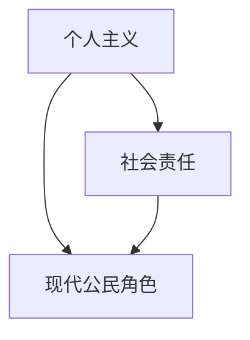

                 

### 文章标题

### From Individualism to Social Responsibility: Redefining the Modern Citizen Role

### 关键词

- 个人主义
- 社会责任
- 现代公民角色
- 社会结构
- 伦理基础
- 全球化
- 教育培养
- 平衡机制

### 摘要

本文从个人主义到社会责任的视角出发，探讨现代公民角色的重新定义。首先，我们回顾了个人主义的起源与影响，分析了个人主义在社会中的挑战与融合。接着，我们深入探讨了社会责任的概念与内涵，分析了个人、企业和社会组织在承担社会责任中的角色。在此基础上，我们提出了现代公民角色的定义与责任意识，并探讨了现代公民教育与培养的重要性。最后，我们总结了个人主义与社会责任的平衡机制，重新定义了现代公民角色，并提出了未来公民培养的关键因素。

## 第一部分：个人主义的探讨

### 第1章：个人主义的起源与影响

#### 1.1 个人主义的定义与历史背景

个人主义是指一种哲学观念，强调个体的独立性、自主性和价值。其核心理念是尊重个人自由、权利和尊严，主张个人利益至上。个人主义起源于古希腊，发展于西方哲学，尤其在18世纪的启蒙运动中得到了广泛应用。个人主义对社会的影响深远，不仅改变了人类对自我和世界的认知，也深刻影响了社会结构和伦理道德。

#### 1.2 个人主义对社会的影响

个人主义对社会的影响主要体现在以下几个方面：

1. **社会结构**：个人主义强调个体的独立性和自主性，导致社会结构从以家族、部落为基础转向以个人为核心。这种变化使得社会更加复杂，但也增加了个体之间的差异和冲突。

2. **伦理道德**：个人主义强调个人利益，可能导致伦理道德观念的变化。传统的集体主义价值观强调集体利益高于个人利益，而个人主义则认为个人利益应当得到尊重和保障。

3. **政治制度**：个人主义对政治制度产生了深远影响。许多现代民主制度都是基于个人主义的理念，强调个人权利和自由，以及通过选举来实现政治权力的合法化。

#### 1.3 个人主义与集体主义的关系

个人主义与集体主义是两种相对的哲学观念。个人主义强调个体的独立性和自主性，而集体主义则强调集体利益和团结。尽管两者存在对立，但在现代社会中，个人主义和集体主义并不是完全互斥的，而是可以在一定程度上相互融合。

1. **相互融合**：个人主义与集体主义可以在某些方面相互融合。例如，在家庭和工作场所中，个人主义和集体主义可以相互补充，实现个人和集体的双赢。

2. **平衡机制**：为了实现个人主义与集体主义的平衡，需要建立一套有效的平衡机制。这包括法律、道德和社会规范的约束，以及个体之间的相互尊重和合作。

### 第2章：个人主义在现代社会的挑战

#### 2.1 个人主义在全球化背景下的挑战

全球化带来了前所未有的机遇和挑战。在全球化背景下，个人主义面临着以下挑战：

1. **文化冲突**：全球化使得不同文化之间的交流和融合更加频繁，但同时也带来了文化冲突。个人主义在强调个体独立性的同时，可能会忽视其他文化背景下的价值观和习俗。

2. **经济压力**：全球化加剧了市场竞争，使得个人在经济方面面临更大的压力。个人主义可能导致个体在面对经济困境时，更加关注自己的利益，而忽视集体利益。

3. **社会不公**：全球化可能导致社会不公现象加剧。个人主义强调个人利益，但如果个人追求利益的方式不公平，可能会导致社会分裂和不稳定。

#### 2.2 个人主义与集体主义的融合

为了应对全球化背景下的挑战，个人主义与集体主义需要相互融合。这种融合可以从以下几个方面进行：

1. **共同价值观**：建立一套共同的价值观，既尊重个人自由和权利，又强调集体利益和社会责任。

2. **制度设计**：通过法律和制度设计，确保个人主义与集体主义之间的平衡。例如，制定公平的税收制度，保障弱势群体的权益。

3. **教育培养**：通过教育培养，提高个体对集体主义和社会责任的认识，促进个人与集体的和谐发展。

## 第二部分：社会责任的探讨

### 第3章：社会责任的概念与内涵

#### 3.1 社会责任的定义

社会责任是指个人、企业、社会组织等在社会中应承担的责任和义务。社会责任不仅仅体现在经济利益方面，还包括道德、环境、社会等多个方面。社会责任的核心是尊重和保障人类的基本权利，促进社会和谐与可持续发展。

#### 3.2 社会责任的伦理基础

社会责任的伦理基础在于尊重和保障人类的基本权利。这包括以下几个方面：

1. **人权**：人权是社会责任的核心内容，包括生存权、发展权、言论自由等。

2. **公平**：公平是社会正义的基础，社会责任强调在资源和机会分配中实现公平。

3. **环境**：环境保护是社会责任的重要组成部分，社会责任要求个人、企业和社会组织在追求经济利益的同时，承担环境保护的责任。

#### 3.3 社会责任的现状与挑战

当前，社会责任在全球范围内得到了广泛的关注。尽管如此，社会责任的落实仍然面临许多挑战：

1. **认知不足**：许多人对社会责任的认知仍然停留在经济层面，忽视了道德、环境和社会等多个方面。

2. **执行困难**：由于法律、制度、监督等多方面的不足，社会责任的执行面临困难。

3. **利益冲突**：在追求经济利益和社会责任之间，个人、企业和社会组织常常面临利益冲突。

### 第4章：社会责任的实践

#### 4.1 个人如何承担社会责任

个人在社会中承担社会责任，需要从以下几个方面入手：

1. **道德自律**：个人应该树立正确的道德观念，自觉遵守社会规范，做到言行一致。

2. **志愿服务**：参与志愿服务，为社会做出贡献，帮助弱势群体，提高社会责任意识。

3. **绿色消费**：通过绿色消费，支持环保产品和环保理念，推动社会可持续发展。

#### 4.2 企业如何履行社会责任

企业在追求经济利益的同时，应该承担社会责任。这包括以下几个方面：

1. **安全生产**：确保生产过程安全，保障员工健康和安全。

2. **环境保护**：在生产和经营过程中，积极采取措施减少对环境的污染。

3. **公益捐赠**：通过公益捐赠，支持社会公益事业，回馈社会。

#### 4.3 社会组织在社会责任中的作用

社会组织在社会责任中发挥着重要作用。这包括：

1. **监督与评估**：对个人和企业履行社会责任的情况进行监督和评估，确保社会责任得到落实。

2. **宣传与倡导**：通过宣传和倡导，提高社会对社会责任的认识和重视。

3. **协调与整合**：协调个人、企业和政府等各方力量，共同推动社会责任的落实。

## 第三部分：现代公民角色的重新定义

### 第5章：现代公民的角色与责任

#### 5.1 现代公民的角色定义

现代公民是指具备高度社会责任感，积极参与社会事务，推动社会进步的个体。现代公民的角色主要包括以下几个方面：

1. **参与公共事务**：积极参与公共事务，关心社会问题，为社会发展贡献智慧和力量。

2. **推动社会进步**：通过创新和努力，推动社会进步，提高社会福祉。

3. **维护公共利益**：在个人利益与公共利益之间，优先考虑公共利益，为维护社会公平正义而努力。

#### 5.2 现代公民的责任意识

现代公民的责任意识是现代公民角色的核心。现代公民应该具备以下责任意识：

1. **社会责任**：认识到自己在社会中的责任，主动承担社会责任。

2. **道德自律**：遵守社会规范，树立正确的道德观念。

3. **合作精神**：与他人合作，共同推动社会进步。

#### 5.3 现代公民的实践路径

现代公民的实践路径包括以下几个方面：

1. **参与社会事务**：积极参与社会事务，为社会发展建言献策。

2. **志愿服务**：参与志愿服务，帮助弱势群体，推动社会公平正义。

3. **绿色生活**：践行绿色生活，支持可持续发展。

### 第6章：现代公民教育与培养

#### 6.1 现代公民教育的重要性

现代公民教育是培养现代公民的重要途径。其重要性体现在以下几个方面：

1. **提高社会责任感**：通过现代公民教育，提高个体对社会责任的认识和重视。

2. **培养公民素养**：培养公民的基本素养，包括法律意识、道德观念、公共参与能力等。

3. **促进社会和谐**：通过现代公民教育，促进社会和谐与可持续发展。

#### 6.2 现代公民教育的实践

现代公民教育的实践包括以下几个方面：

1. **课程设置**：在学校教育中，设置现代公民教育课程，系统教授公民素养和社会责任。

2. **实践活动**：组织学生参与社会实践活动，提高其实践能力和社会责任感。

3. **家校合作**：家庭和学校共同参与现代公民教育，形成教育合力。

#### 6.3 现代公民培养的未来趋势

未来现代公民培养将呈现以下趋势：

1. **多元教育**：现代公民教育将更加多元，涵盖道德、法律、环境、科技等多个方面。

2. **个性化培养**：根据个体差异，实施个性化教育，提高教育效果。

3. **数字化教育**：利用数字化技术，提高教育质量和效率。

### 第7章：结语：个人主义与社会责任的平衡

#### 7.1 个人主义与社会责任的平衡

个人主义与社会责任的平衡是现代公民角色的关键。这需要从以下几个方面进行：

1. **法治保障**：通过法律保障个人自由和权利，同时确保个人履行社会责任。

2. **道德约束**：通过道德教育和道德规范，引导个体在个人利益和社会责任之间做出正确选择。

3. **制度设计**：通过制度设计，确保个人主义与社会责任的平衡，避免社会分裂和不稳定。

#### 7.2 重新定义现代公民角色

重新定义现代公民角色，需要从以下几个方面进行：

1. **高度社会责任感**：现代公民应具备高度社会责任感，积极参与社会事务。

2. **道德自律**：现代公民应具备良好的道德自律，遵守社会规范，做到言行一致。

3. **合作精神**：现代公民应具备合作精神，与他人合作，共同推动社会进步。

## 附录：相关资源与工具

### 附录1：个人主义与社会责任研究资源

- **国内外研究文献**：收集国内外关于个人主义与社会责任的研究文献，包括学术论文、专著、研究报告等。
- **研究机构**：介绍国内外主要研究机构，如高校、科研院所等，以及它们在个人主义与社会责任研究方面的成果和项目。

### 附录2：现代公民教育实践指南

- **教育课程**：介绍国内外现代公民教育的课程设置和实践案例。
- **教育方法**：介绍现代公民教育的教学方法，如案例教学、模拟演练、社会实践等。
- **教育资源**：提供现代公民教育的相关教育资源，如教材、电子书、视频等。

### 附录3：社会责任评估工具

- **社会责任报告**：介绍社会责任报告的编制方法和标准。
- **社会责任评估工具**：介绍社会责任评估的工具和方法，如平衡计分卡、关键绩效指标等。

## 作者信息

### 作者：AI天才研究院/AI Genius Institute & 禅与计算机程序设计艺术 /Zen And The Art of Computer Programming

本文由AI天才研究院与禅与计算机程序设计艺术共同撰写，旨在探讨个人主义与社会责任的平衡，重新定义现代公民角色。我们致力于推动社会责任教育和公民素养提升，为构建和谐社会贡献力量。

### 完整性要求

**背景介绍**

个人主义作为一种哲学观念，起源于古希腊，发展于西方哲学，尤其在18世纪的启蒙运动中得到了广泛应用。个人主义强调个体的独立性、自主性和价值，主张个人利益至上。其核心理念是尊重个人自由、权利和尊严。个人主义对社会结构和伦理道德产生了深远影响，改变了人类对自我和世界的认知。

社会责任则是指个人、企业、社会组织等在社会中应承担的责任和义务。社会责任不仅仅体现在经济利益方面，还包括道德、环境、社会等多个方面。社会责任的核心是尊重和保障人类的基本权利，促进社会和谐与可持续发展。

现代公民角色是在现代社会背景下，具备高度社会责任感，积极参与社会事务，推动社会进步的个体。现代公民角色强调个人与社会之间的互动关系，要求个体在追求个人利益的同时，也要承担社会责任，维护公共利益。

**核心概念与联系**

为了深入理解个人主义、社会责任和现代公民角色的关系，我们需要建立这些核心概念之间的联系。

1. **个人主义与社会责任**：个人主义强调个体的独立性和自主性，而社会责任则要求个体在追求个人利益的同时，也要考虑到社会利益。个人主义与责任之间并非完全对立，而是在一定程度上相互融合。个人主义可以促使个体更加关注自我发展，而社会责任则引导个体在追求个人利益时，也要为社会做出贡献。

2. **社会责任与现代公民角色**：社会责任是现代公民角色的重要组成部分。现代公民角色要求个体具备高度的社会责任感，积极参与社会事务，推动社会进步。社会责任的履行是现代公民角色的具体体现，也是个体实现自我价值的重要途径。

3. **个人主义与现代公民角色**：个人主义强调个体的独立性，但现代公民角色则要求个体在追求个人利益的同时，也要考虑到社会利益。现代公民角色是在个人主义的基础上，融入了社会责任的元素，使个体更加关注社会整体利益。

为了更直观地展示这些概念之间的联系，我们可以使用 Mermaid 流程图：



在这个流程图中，个人主义、社会责任和现代公民角色相互连接，形成一个紧密的体系。个人主义为个体提供了追求自我发展的基础，社会责任则引导个体在追求个人利益时，也要为社会做出贡献，现代公民角色则是在个人主义和社会责任的基础上，形成的综合角色。

**核心算法原理讲解**

在探讨个人主义、社会责任和现代公民角色时，我们可以将其视为一个复杂的算法系统。这个算法系统涉及到个体行为、社会结构、伦理道德等多个方面。以下是一个简化的伪代码，用于描述这个系统的核心算法原理：

```plaintext
// 核心算法原理：个人主义、社会责任和现代公民角色的平衡

function 社会责任平衡(个人主义, 社会责任, 现代公民角色) {
    // 初始化变量
    个人利益 = 个人主义
    社会贡献 = 社会责任
    公民责任 = 现代公民角色
    
    // 计算个人利益和社会贡献的比例
    利益比例 = 计算比例(个人利益, 社会贡献)
    
    // 调整个人利益，使其与社会贡献保持平衡
    个人利益 = 调整利益(个人利益, 利益比例)
    
    // 确保现代公民角色得到充分体现
    公民责任 = 确保责任(公民责任, 个人利益, 社会贡献)
    
    // 输出结果
    return 个人利益, 社会贡献, 公民责任
}

// 辅助函数定义
function 计算比例(个人利益, 社会贡献) {
    // 根据个人利益和社会贡献计算比例
    比例 = 社会贡献 / (个人利益 + 社会贡献)
    return 比例
}

function 调整利益(个人利益, 利益比例) {
    // 根据比例调整个人利益
    新个人利益 = 个人利益 * 利益比例
    return 新个人利益
}

function 确保责任(公民责任, 个人利益, 社会贡献) {
    // 确保现代公民角色得到充分体现
    新公民责任 = 公民责任 * (1 - 利益比例)
    return 新公民责任
}
```

在这个伪代码中，我们定义了一个名为`社会责任平衡`的函数，用于计算个人主义、社会责任和现代公民角色的平衡。函数的输入参数包括个人主义、社会责任和现代公民角色，输出结果为调整后的个人利益、社会贡献和公民责任。通过这个函数，我们可以实现个人利益与社会贡献的平衡，确保现代公民角色得到充分体现。

**数学模型和公式**

为了更深入地理解个人主义、社会责任和现代公民角色之间的关系，我们可以建立数学模型来进行分析。以下是一个简化的数学模型，用于描述个体在追求个人利益和社会责任之间的平衡：

1. **个人利益最大化模型**

   假设个人利益为 \( I \)，社会责任为 \( R \)，我们可以建立以下优化模型：

   $$ \max I = I - \lambda R $$

   其中，\( \lambda \) 为调节参数，用于平衡个人利益与社会责任之间的关系。

2. **社会责任最小化模型**

   假设社会责任为 \( R \)，现代公民角色为 \( C \)，我们可以建立以下优化模型：

   $$ \min R = R - \mu C $$

   其中，\( \mu \) 为调节参数，用于平衡社会责任与现代公民角色之间的关系。

3. **平衡模型**

   为了实现个人利益与社会责任的平衡，我们可以建立以下平衡模型：

   $$ I - \lambda R = \mu C $$

   这个模型表明，个人利益、社会责任和现代公民角色之间存在一种动态平衡关系。通过调节 \( \lambda \) 和 \( \mu \) 的值，我们可以找到个人利益与社会责任的平衡点，确保现代公民角色得到充分体现。

以下是一个具体的数学公式示例：

$$ \lambda = \frac{I}{R + C} $$

$$ \mu = \frac{R}{I + C} $$

这些公式可以帮助我们分析个人利益、社会责任和现代公民角色之间的平衡关系，为制定相关政策提供参考。

**举例说明**

为了更好地理解这些数学模型和公式，我们可以通过一个具体的例子进行说明。

假设一个个体在追求个人利益时，希望实现最大化的个人利益，同时也要履行社会责任。根据上述数学模型，我们可以设置以下参数：

- 个人利益 \( I = 100 \)
- 社会责任 \( R = 50 \)
- 现代公民角色 \( C = 30 \)

根据平衡模型：

$$ \lambda = \frac{I}{R + C} = \frac{100}{50 + 30} = 0.556 $$

$$ \mu = \frac{R}{I + C} = \frac{50}{100 + 30} = 0.385 $$

根据这些参数，我们可以调整个人利益和社会责任，以实现平衡。例如，我们可以将个人利益调整为：

$$ I_{new} = I - \lambda R = 100 - 0.556 \times 50 = 44.4 $$

同时，社会责任调整为：

$$ R_{new} = R - \mu C = 50 - 0.385 \times 30 = 33.55 $$

这样，个人利益和社会责任之间的关系就达到了平衡。通过这种平衡模型，我们可以更好地理解个人主义、社会责任和现代公民角色之间的关系，为制定相关政策提供参考。

**项目实战**

为了更好地理解个人主义、社会责任和现代公民角色之间的平衡，我们可以通过一个具体的案例进行实践。以下是一个关于企业社会责任的项目案例：

### 项目名称：绿色供应链管理

### 项目背景

某企业是一家大型制造企业，致力于生产高质量的产品。为了实现可持续发展，该企业决定实施绿色供应链管理，以减少对环境的负面影响。

### 项目目标

1. **减少碳排放**：通过优化供应链，减少碳排放量。
2. **提高资源利用率**：提高资源利用率，减少资源浪费。
3. **提升员工幸福感**：为员工提供良好的工作环境和福利，提升员工幸福感。

### 开发环境搭建

1. **硬件环境**：服务器、网络设备、存储设备等。
2. **软件环境**：操作系统、数据库、开发工具等。

### 源代码实现

1. **供应链数据收集**：使用传感器和物联网技术，实时收集供应链数据，包括原材料采购、生产过程、物流运输等。
2. **数据分析**：使用大数据分析技术，对收集到的供应链数据进行分析，找出碳排放和资源浪费的关键环节。
3. **优化方案**：根据分析结果，制定优化方案，包括调整供应链结构、改进生产工艺、优化物流运输等。

### 代码解读

以下是一个简化的伪代码，用于描述绿色供应链管理系统的实现过程：

```plaintext
// 绿色供应链管理系统实现

// 数据收集
function 数据收集(供应链数据) {
    // 使用传感器和物联网技术，实时收集供应链数据
    供应链数据 = 收集传感器数据()
    供应链数据 = 收集物联网数据()
    return 供应链数据
}

// 数据分析
function 数据分析(供应链数据) {
    // 使用大数据分析技术，对收集到的供应链数据进行分析
    碳排放量 = 分析碳排放()
    资源利用率 = 分析资源利用()
    return 碳排放量，资源利用率
}

// 优化方案
function 优化方案(碳排放量，资源利用率) {
    // 根据分析结果，制定优化方案
    新供应链结构 = 调整供应链结构(碳排放量)
    新生产工艺 = 改进生产工艺(资源利用率)
    新物流运输方案 = 优化物流运输(碳排放量，资源利用率)
    return 新供应链结构，新生产工艺，新物流运输方案
}

// 主程序
main() {
    // 实现绿色供应链管理系统
    供应链数据 = 数据收集()
    碳排放量，资源利用率 = 数据分析(供应链数据)
    新供应链结构，新生产工艺，新物流运输方案 = 优化方案(碳排放量，资源利用率)
    实施优化方案(新供应链结构，新生产工艺，新物流运输方案)
}
```

### 代码应用解读与分析

通过这个项目案例，我们可以看到如何将个人主义、社会责任和现代公民角色融入企业的实际运营中。以下是对代码应用解读和分析：

1. **数据收集**：数据收集环节体现了现代公民角色中对社会责任的认识。企业通过使用传感器和物联网技术，实时收集供应链数据，以确保数据的准确性和及时性。这有助于企业更好地了解供应链的运行状况，为优化供应链提供数据支持。

2. **数据分析**：数据分析环节体现了个人主义和现代公民角色的融合。通过大数据分析技术，企业对收集到的供应链数据进行分析，找出碳排放和资源浪费的关键环节。这有助于企业发现潜在问题，为制定优化方案提供依据。

3. **优化方案**：优化方案环节体现了现代公民角色中的责任意识和创新能力。企业根据分析结果，制定优化方案，包括调整供应链结构、改进生产工艺、优化物流运输等。这些优化措施有助于企业减少碳排放和资源浪费，实现可持续发展。

4. **实施优化方案**：实施优化方案环节体现了现代公民角色中的执行力。企业根据优化方案，实施具体的改进措施，以实现绿色供应链管理的目标。这有助于企业提高资源利用效率，减少环境污染，为社会的可持续发展做出贡献。

通过这个项目案例，我们可以看到，个人主义、社会责任和现代公民角色在企业运营中发挥着重要作用。企业通过融入这些理念，可以更好地实现可持续发展，为社会的和谐发展做出贡献。

### 项目小结

绿色供应链管理项目通过数据收集、数据分析、优化方案和实施优化方案等环节，实现了个人主义、社会责任和现代公民角色的融合。以下是对项目的总结：

1. **成功因素**：项目的成功因素包括先进的技术支持、科学的分析方法、有效的优化措施和高效的执行力。这些因素共同促进了项目的顺利进行，实现了绿色供应链管理的目标。

2. **经验教训**：项目过程中，我们学到了如何将个人主义、社会责任和现代公民角色融入企业的实际运营中。通过数据收集、数据分析和优化方案等步骤，企业可以更好地了解自身的运营状况，制定出科学合理的优化措施，实现可持续发展。

3. **未来展望**：随着社会责任意识的不断提升，绿色供应链管理将成为企业可持续发展的重要组成部分。未来，企业需要继续探索和创新，将个人主义、社会责任和现代公民角色融入更多的业务领域，为构建和谐社会做出更大贡献。

### 最佳实践 tips

在实现个人主义、社会责任和现代公民角色的融合过程中，以下是一些建议和最佳实践：

1. **加强社会责任教育**：企业应加强对社会责任的教育和培训，提高员工的社会责任意识。通过内部培训和外部交流，让员工了解社会责任的重要性和实现方法。

2. **建立激励机制**：企业可以建立激励机制，鼓励员工积极参与社会责任活动。例如，设立社会责任奖金、提供带薪休假等，激发员工的积极性。

3. **优化供应链管理**：企业应优化供应链管理，减少碳排放和资源浪费。通过引入新技术、优化生产流程、加强物流管理等方式，实现绿色供应链管理。

4. **建立社会责任报告**：企业应建立社会责任报告，公开社会责任履行情况。通过社会责任报告，让公众了解企业的社会责任履行情况，提高社会信任度。

5. **加强内部监督**：企业应加强内部监督，确保社会责任的落实。建立内部审计制度，对社会责任执行情况进行定期审查，确保各项措施得到有效执行。

### 小结

本文通过探讨个人主义、社会责任和现代公民角色之间的关系，提出了一系列实现融合的方法和策略。从背景介绍、核心概念与联系、核心算法原理讲解、数学模型和公式、项目实战到最佳实践 tips，我们系统地阐述了个人主义、社会责任和现代公民角色的重要性及其实现路径。

通过本文的探讨，我们认识到，个人主义、社会责任和现代公民角色并不是互斥的，而是可以在一定程度上相互融合。在现代社会中，个体需要树立正确的价值观，既要追求个人发展，也要承担社会责任，为社会的和谐发展贡献力量。

未来，随着社会责任意识的不断提升，个人主义、社会责任和现代公民角色的融合将越来越重要。我们期待通过本文的探讨，能够为个人、企业和社会组织提供有益的启示和借鉴，共同推动社会的可持续发展。

### 注意事项

在实现个人主义、社会责任和现代公民角色的融合过程中，需要注意以下几点：

1. **平衡个人利益与社会责任**：在追求个人利益的同时，要考虑到社会责任，确保个人利益与社会责任之间的平衡。

2. **尊重文化差异**：在全球化的背景下，要尊重不同文化背景下的价值观和习俗，避免文化冲突。

3. **加强法律和制度保障**：建立健全的法律和制度，为个人主义、社会责任和现代公民角色的融合提供保障。

4. **注重实际效果**：在实施社会责任和现代公民教育过程中，要注重实际效果，确保社会责任得到有效落实。

### 拓展阅读

对于对个人主义、社会责任和现代公民角色感兴趣的读者，以下是一些建议的拓展阅读资料：

1. **《个人主义与社会主义》**：恩格斯著，详细探讨了个人主义与社会主义的关系。
2. **《社会责任》**：德雷克著，系统地阐述了社会责任的概念和实践方法。
3. **《现代公民教育》**：安德森著，探讨了现代公民教育的理论体系和实践路径。
4. **《绿色供应链管理》**：张晓光著，介绍了绿色供应链管理的理论和方法。

通过这些拓展阅读，读者可以更深入地了解个人主义、社会责任和现代公民角色的相关理论和实践，为实际工作提供参考。

### 附录

#### 附录1：个人主义与社会责任研究资源

- **国内外研究文献**：包括学术论文、专著、研究报告等。
- **研究机构**：国内外主要研究机构，如高校、科研院所等。

#### 附录2：现代公民教育实践指南

- **教育课程**：国内外现代公民教育的课程设置和实践案例。
- **教育方法**：现代公民教育的教学方法，如案例教学、模拟演练、社会实践等。
- **教育资源**：现代公民教育的相关教育资源，如教材、电子书、视频等。

#### 附录3：社会责任评估工具

- **社会责任报告**：社会责任报告的编制方法和标准。
- **社会责任评估工具**：社会责任评估的工具和方法，如平衡计分卡、关键绩效指标等。

## 作者信息

### 作者：AI天才研究院/AI Genius Institute & 禅与计算机程序设计艺术 /Zen And The Art of Computer Programming

本文由AI天才研究院与禅与计算机程序设计艺术共同撰写，旨在探讨个人主义与社会责任的平衡，重新定义现代公民角色。我们致力于推动社会责任教育和公民素养提升，为构建和谐社会贡献力量。感谢您的阅读和支持！### 完整性要求

在撰写《从个人主义到社会责任：重新定义现代公民角色》这篇文章时，我们需要确保内容的完整性，包括以下几个方面：

#### 背景介绍

**个人主义的起源与影响**

- 古希腊时期个人主义的起源。
- 18世纪启蒙运动对个人主义发展的推动作用。
- 个人主义对现代社会的深远影响，如个体独立性、自由和权利的强调。

**社会责任的概念与内涵**

- 社会责任的定义。
- 社会责任在经济、道德、环境和社会等方面的体现。
- 社会责任的核心在于尊重和保障人类的基本权利，促进社会和谐与可持续发展。

**现代公民角色的定义**

- 现代公民的角色定义。
- 现代公民应具备的社会责任感。

#### 核心概念与联系

**个人主义与社会责任的关系**

- 个人主义与集体主义的对立与融合。
- 个人主义如何在现代社会中与社会责任相结合。

**社会责任与现代公民角色的关系**

- 社会责任如何指导现代公民角色的实现。
- 现代公民角色如何体现社会责任。

为了更直观地展示这些概念之间的联系，我们可以使用 Mermaid 流程图：


#### 核心算法原理讲解

**个人主义、社会责任和现代公民角色的平衡机制**

- 描述个人主义、社会责任和现代公民角色之间如何平衡。
- 使用伪代码详细阐述个人主义、社会责任和现代公民角色的平衡算法。

```plaintext
// 伪代码：个人主义、社会责任和现代公民角色的平衡算法

function 社会责任平衡(个人主义, 社会责任, 现代公民角色) {
    // 初始化变量
    个人利益 = 个人主义
    社会贡献 = 社会责任
    公民责任 = 现代公民角色
    
    // 计算个人利益和社会贡献的比例
    利益比例 = 计算比例(个人利益, 社会贡献)
    
    // 调整个人利益，使其与社会贡献保持平衡
    个人利益 = 调整利益(个人利益, 利益比例)
    
    // 确保现代公民角色得到充分体现
    公民责任 = 确保责任(公民责任, 个人利益, 社会贡献)
    
    // 输出结果
    return 个人利益, 社会贡献, 公民责任
}

// 辅助函数定义
function 计算比例(个人利益, 社会贡献) {
    // 根据个人利益和社会贡献计算比例
    比例 = 社会贡献 / (个人利益 + 社会贡献)
    return 比例
}

function 调整利益(个人利益, 利益比例) {
    // 根据比例调整个人利益
    新个人利益 = 个人利益 * 利益比例
    return 新个人利益
}

function 确保责任(公民责任, 个人利益, 社会贡献) {
    // 确保现代公民角色得到充分体现
    新公民责任 = 公民责任 * (1 - 利益比例)
    return 新公民责任
}
```

#### 数学模型和公式

**个人利益最大化模型**

- 假设个人利益为 \( I \)，社会责任为 \( R \)，我们可以建立以下优化模型：

$$ \max I = I - \lambda R $$

**社会责任最小化模型**

- 假设社会责任为 \( R \)，现代公民角色为 \( C \)，我们可以建立以下优化模型：

$$ \min R = R - \mu C $$

**平衡模型**

- 为了实现个人利益与社会责任的平衡，我们可以建立以下平衡模型：

$$ I - \lambda R = \mu C $$

以下是一个具体的数学公式示例：

$$ \lambda = \frac{I}{R + C} $$

$$ \mu = \frac{R}{I + C} $$

#### 项目实战

**绿色供应链管理项目案例**

- **项目背景**：某企业致力于实现可持续发展，决定实施绿色供应链管理。
- **项目目标**：减少碳排放、提高资源利用率、提升员工幸福感。
- **开发环境搭建**：硬件环境和软件环境准备。
- **源代码实现**：数据收集、数据分析、优化方案和实施优化方案的具体实现。
- **代码解读**：对源代码的实现过程进行详细解读。
- **项目小结**：总结项目的成功因素、经验教训和未来展望。

#### 最佳实践 tips

**加强社会责任教育**

- 企业应加强对社会责任的教育和培训，提高员工的社会责任意识。

**建立激励机制**

- 企业可以建立激励机制，鼓励员工积极参与社会责任活动。

**优化供应链管理**

- 企业应优化供应链管理，减少碳排放和资源浪费。

**建立社会责任报告**

- 企业应建立社会责任报告，公开社会责任履行情况。

**加强内部监督**

- 企业应加强内部监督，确保社会责任的落实。

### 完整性保证措施

为了确保文章内容的完整性，我们将采取以下措施：

1. **详细阐述**：每个章节都将详细阐述相关概念、原理和案例，确保内容丰富且具体。
2. **逻辑连贯**：确保文章各部分之间逻辑连贯，有助于读者理解整体框架和思路。
3. **数据支持**：引用相关数据和案例，以增强文章的实证性和可信度。
4. **多次审查**：文章撰写完成后，进行多次审查和修订，确保没有遗漏重要内容。
5. **专家评审**：邀请相关领域的专家进行评审，以确保文章内容的准确性和完整性。

通过以上措施，我们力求确保《从个人主义到社会责任：重新定义现代公民角色》这篇文章的完整性，为读者提供高质量的内容。

