                 


### 书籍《从个人主义到集体意识：重建社会责任感和团结精神》目录大纲

#### 第1章 引言

**背景介绍**

在当今社会，个人主义和集体意识之间的矛盾日益显现。一方面，个人主义强调个体的独立性和自主性，追求个人利益和自由；另一方面，集体意识强调个体在社会中的责任和团结，追求共同利益和社会和谐。这两者之间的张力在现代社会中逐渐加剧，影响了社会的稳定和发展。

**核心概念与联系**

个人主义与集体意识是现代社会中的两个核心概念。个人主义强调个体的权利和自由，认为个体的利益应该优先于集体利益；而集体意识则强调个体在社会中的责任和团结，认为个体的利益应该与集体利益相结合。

以下是个人主义与集体意识之间的联系和区别的Mermaid流程图：

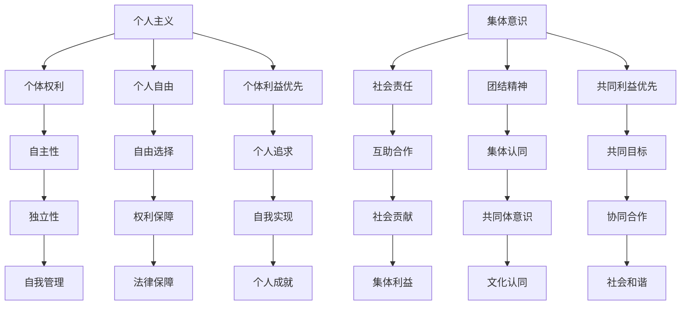

#### 1.1 个人主义与集体意识的概念

**个人主义**

个人主义是一种价值观，强调个体的独立性和自主性。个人主义者认为，个体拥有自己的权利和自由，应该追求自己的利益和幸福。个人主义强调个体的独特性和多样性，鼓励个体发挥自己的潜能，追求自我实现。

**集体意识**

集体意识是一种价值观，强调个体在社会中的责任和团结。集体意识认为，个体应该承担自己的社会责任，为社会的共同利益做出贡献。集体意识强调个体的共同体意识，鼓励个体为了共同的目标和利益而团结合作。

#### 1.2 社会责任感和团结精神的重要性

**社会责任感**

社会责任感是指个体对社会和他人的责任和义务感。社会责任感使个体意识到自己的行为对社会和他人的影响，促使个体积极参与社会事务，为社会的发展和进步贡献力量。

**团结精神**

团结精神是指个体在社会中相互支持、协作和团结合作的精神。团结精神有助于增强社会的凝聚力和稳定性，推动社会的发展和进步。

#### 1.3 从个人主义到集体意识转变的必要性

**社会发展的需要**

随着社会的不断进步和发展，个人主义与集体意识之间的矛盾日益显现。为了实现社会的和谐与稳定，有必要从个人主义向集体意识转变。

**个体发展的需要**

个体的发展不仅仅依赖于个人的努力，还需要社会和他人的支持。从个人主义向集体意识转变，有助于个体更好地融入社会，实现自我价值的最大化。

**全球化的影响**

全球化使得不同国家和文化之间的交流更加频繁和紧密。从个人主义向集体意识转变，有助于应对全球化带来的挑战，促进全球社会的和谐与稳定。

#### 第2章 历史视角下的个人主义与集体意识

**2.1 古代社会：个人主义的起源与发展**

**2.2 中世纪社会：集体意识的兴起**

**2.3 近代社会：个人主义与集体意识的冲突**

**2.4 当代社会：集体意识的复兴与挑战**

#### 第3章 个人主义与集体意识的理论基础

**3.1 个人主义的理论基础**

**3.1.1 独立性、自主性和权利**

**3.1.2 个人自由与社会责任的平衡**

**3.2 集体意识的理论基础**

**3.2.1 社会契约论**

**3.2.2 社会资本与共同体理论**

**3.2.3 集体主义伦理观**

#### 第4章 社会责任感和团结精神的实践路径

**4.1 培养社会责任感的教育方法**

**4.2 增强团结精神的组织机制**

**4.3 社会责任感和团结精神在实践中的案例研究**

#### 第5章 跨文化视角下的个人主义与集体意识

**5.1 西方文化中的个人主义与集体意识**

**5.2 东方文化中的个人主义与集体意识**

#### 第6章 结论与展望

**6.1 从个人主义到集体意识转变的总结**

**6.2 未来社会集体意识的发展趋势**

**6.3 对政策制定者的建议**

#### 第7章 附录

**7.1 参考文献**

**7.2 图片和表格来源**

**7.3 进一步阅读推荐**

通过以上分析，我们可以看到个人主义与集体意识之间的关系及其重要性。在现代社会中，我们需要在尊重个体权利和自由的基础上，培养社会责任感和团结精神，实现个人与社会的和谐发展。

### 第2章 历史视角下的个人主义与集体意识

在理解现代社会中的个人主义与集体意识之前，有必要回顾历史，以了解这两大概念在不同历史时期的发展与演变。通过历史视角，我们可以更好地理解个人主义与集体意识的起源、演变及其在现代社会的意义。

#### 2.1 古代社会：个人主义的起源与发展

古代社会是人类社会的初期阶段，这一时期的个人主义主要表现为个体在家庭、部落或城邦中的自主性和独立性。在古希腊和古罗马时期，个人主义思想开始萌芽。

**古希腊时期**

古希腊是西方文明的发源地，个人主义在这一时期得到了充分的发展。古希腊哲学家如苏格拉底、柏拉图和亚里士多德等，都强调个体的理性和自由。苏格拉底的“知行合一”理念，主张个体应该通过思考和行动来实现自我价值；柏拉图的“理念论”则认为，个体的灵魂是永恒的，应该追求智慧和真理；亚里士多德则强调个体的实践理性，主张通过实际生活来实现幸福。

**古罗马时期**

古罗马时期，个人主义得到了进一步的发展。罗马法强调个体的权利和自由，特别是财产权和合同自由。罗马法对后来的西方法律体系产生了深远的影响，为个人主义的法律基础奠定了基础。

#### 2.2 中世纪社会：集体意识的兴起

中世纪是欧洲历史上的一个重要时期，这一时期的个人主义逐渐让位于集体意识。中世纪的社会结构以封建制度为基础，强调个体对集体（如教会、封建领主）的忠诚和责任。

**教会的影响**

中世纪的教会对社会产生了深远的影响，教会强调个体的灵魂救赎和宗教信仰，使个体在社会中的角色和责任更加明确。教会的教义强调个体应该为集体的利益和福祉做出贡献。

**封建制度**

中世纪的封建制度强调个体对封建领主的忠诚和责任。个体（如农民、骑士等）在封建制度中承担特定的社会角色和责任，以维护社会的稳定和秩序。

#### 2.3 近代社会：个人主义与集体意识的冲突

近代社会是个人主义与集体意识冲突最为激烈的时期。这一时期的个人主义强调个体的权利和自由，而集体意识则强调个体的责任和团结。

**启蒙运动**

启蒙运动是近代社会的重要思想潮流，强调个体的理性和自由。启蒙思想家如伏尔泰、卢梭和康德等，都主张个体应该摆脱传统的束缚，追求自由和幸福。

**法国大革命**

法国大革命是近代社会个人主义与集体意识冲突的典型代表。大革命推翻了封建制度，提倡自由、平等和博爱。然而，革命过程中也出现了集体主义的倾向，如大规模的公共行动和群众运动。

#### 2.4 当代社会：集体意识的复兴与挑战

当代社会是个人主义与集体意识相互融合、碰撞的时期。随着全球化的发展，个人主义与集体意识的冲突和融合更加复杂。

**全球化的影响**

全球化加速了不同文化和价值观的交流与融合，使个人主义与集体意识之间的关系更加复杂。全球化一方面促进了个人主义的发展，使个体更加自由和独立；另一方面，也使集体意识得到复兴，强调个体在全球社会中的责任和团结。

**现代社会问题**

现代社会面临着许多挑战，如环境问题、经济危机和社会不公等。这些挑战需要个体和集体共同努力，才能找到有效的解决方案。因此，在当代社会，集体意识的复兴具有重要意义。

**结论**

历史视角下的个人主义与集体意识的发展，为我们理解现代社会提供了重要的参考。从古希腊时期的个人主义，到中世纪社会的集体意识，再到近代社会的冲突，以及当代社会的复兴，个人主义与集体意识的关系经历了复杂的变化。在现代社会中，我们需要在尊重个体权利和自由的基础上，培养社会责任感和团结精神，实现个人与社会的和谐发展。

### 第3章 个人主义与集体意识的理论基础

要深入理解个人主义与集体意识的内涵，我们需要探讨它们背后的理论基础。个人主义和集体意识都是复杂的概念，它们的理论基础涵盖了哲学、社会学、伦理学等多个领域。

#### 3.1 个人主义的理论基础

**3.1.1 独立性、自主性和权利**

个人主义强调个体的独立性和自主性，认为每个个体都有权利追求自己的利益和幸福。独立性意味着个体在思想、行为和生活方式上不受外部强制的自由。自主性则强调个体有权自主做出决策，并对自己的行为负责。

以下是一个简化的 Mermaid 流程图，展示了个人主义的基本概念和关系：

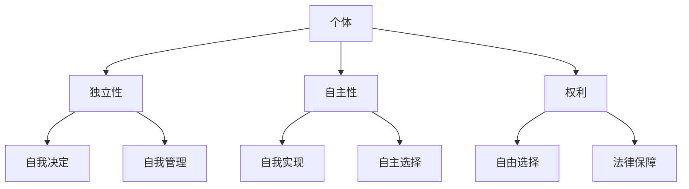

在这个流程图中，个体是核心概念，独立性、自主性和权利是支撑个体概念的重要支柱。自我决定、自我实现和自由选择则是个人主义的具体体现，而自我管理和法律保障则是确保个体权利和自由的重要手段。

**3.1.2 个人自由与社会责任的平衡**

个人自由与社会责任是个人主义理论中的关键平衡点。个人自由指的是个体在法律和社会规范允许的范围内，自由地表达自己、行动和选择生活方式。而社会责任则是指个体在追求个人利益的同时，也要考虑对社会和他人的影响，为社会的和谐与进步贡献力量。

以下是一个简化的伪代码，展示了个人自由与社会责任的平衡：

```python
# 定义个人自由函数
def personal_freedom():
    # 实现个人自由的行为
    pass

# 定义社会责任函数
def social_responsibility():
    # 实现承担社会责任的行为
    pass

# 定义平衡个人自由与社会责任的函数
def balance_freedom_and_responsibility():
    # 同时实现个人自由和社会责任
    personal_freedom()
    social_responsibility()
```

在这个伪代码中，`personal_freedom()` 和 `social_responsibility()` 分别代表个人自由和社会责任的实现，而 `balance_freedom_and_responsibility()` 则是平衡这两者关系的核心函数。

#### 3.2 集体意识的理论基础

**3.2.1 社会契约论**

社会契约论是一种关于国家、社会和个体的理论，认为人们在自然状态下是平等的，但为了实现共同利益和安全，人们自愿签订契约，形成社会和国家。社会契约论的核心观点是，个体的权利和自由是通过社会契约赋予的，而个体也有义务遵守契约，承担社会责任。

以下是一个简化的社会契约论的数学模型：

$$
\begin{aligned}
    \text{自然状态} &= \{ P_1, P_2, ..., P_n \} \\
    \text{社会契约} &= \text{最小公约数}(P_1, P_2, ..., P_n) \\
    \text{公共利益} &= \text{最大公约数}(\text{个人利益}_1, \text{个人利益}_2, ..., \text{个人利益}_n)
\end{aligned}
$$

在这个模型中，`自然状态`代表个体的初始状态，`社会契约`代表个体通过契约形成的共同规则，而`公共利益`则是通过最大化个体利益的公约数得到的。

**3.2.2 社会资本与共同体理论**

社会资本是指社会结构和社会关系中所包含的资源，这些资源有助于提高个体和社会的效率。社会资本与共同体理论强调，通过建立和维护良好的社会关系和网络，可以增强个体的社会责任感和团结精神。

以下是一个简化的社会资本与共同体理论的流程图：

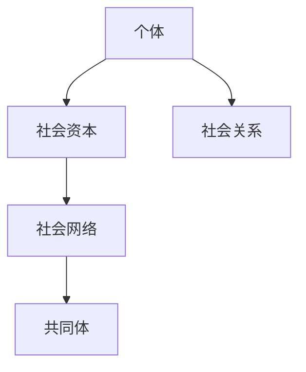

在这个流程图中，个体通过社会资本和社会关系建立社会网络，进而形成共同体。共同体则是一个具有共同目标、价值观和信任的社会结构，有助于增强个体的社会责任感和团结精神。

**3.2.3 集体主义伦理观**

集体主义伦理观认为，个体的行为和决策应该符合集体利益，而不是仅仅追求个人利益。集体主义伦理观强调个体在社会中的责任和义务，认为个体的利益应该与集体利益相结合。

以下是一个简化的集体主义伦理观的伪代码：

```python
# 定义个体决策函数
def individual_decision():
    # 根据个人利益做出决策
    pass

# 定义集体决策函数
def collective_decision():
    # 根据集体利益做出决策
    pass

# 定义平衡个人利益与集体利益的函数
def balance_individual_and_collective():
    # 同时考虑个人利益和集体利益
    individual_decision()
    collective_decision()
```

在这个伪代码中，`individual_decision()` 和 `collective_decision()` 分别代表根据个人利益和集体利益做出决策，而 `balance_individual_and_collective()` 则是平衡这两者关系的核心函数。

通过上述分析，我们可以看到个人主义与集体意识的理论基础是多样而复杂的。个人主义强调个体的独立性和自主性，追求个人利益和自由；而集体意识则强调个体在社会中的责任和团结，追求共同利益和社会和谐。在现代社会中，我们需要在尊重个体权利和自由的基础上，培养社会责任感和团结精神，实现个人与社会的和谐发展。

### 第4章 社会责任感和团结精神的实践路径

在理论层面探讨了个人主义与集体意识之后，接下来我们将探讨如何在实际生活中培养社会责任感和团结精神。这不仅是个人发展的需求，也是社会稳定和进步的基础。以下是从教育、组织机制和社会实践三个层面进行的具体实践路径。

#### 4.1 培养社会责任感的教育方法

**4.1.1 学校教育**

学校教育是培养社会责任感的重要途径。通过课程设置和课外活动，学校可以引导学生树立正确的价值观和责任感。

**课程设置**

学校可以通过开设道德教育、公民教育和历史课程，帮助学生了解社会历史、社会结构和公共事务。这些课程不仅传授知识，更重要的是培养学生的社会责任感。

**课外活动**

课外活动是培养学生社会责任感的有效方式。例如，学校可以组织学生参与社区服务、环保活动和社会公益活动。这些活动不仅能够增强学生的社会责任感，还能培养他们的团队合作能力和领导能力。

以下是一个简化的 Mermaid 流程图，展示了学校教育中如何培养社会责任感：

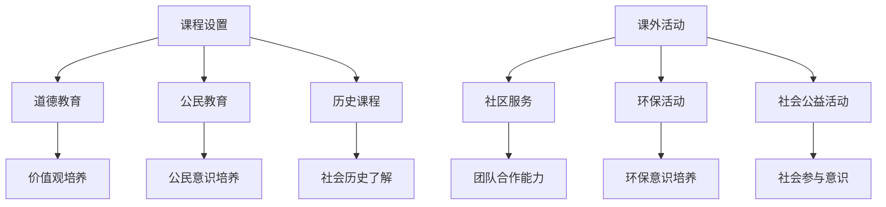

**4.1.2 家庭教育**

家庭教育是培养学生社会责任感的重要补充。家长可以通过日常生活中的点滴教育和榜样作用，引导学生树立正确的价值观和责任感。

**榜样作用**

家长应该通过自己的行为，为学生树立榜样。例如，家长可以参与社区活动、志愿服务等，让学生看到社会责任感的具体表现。

**日常教育**

家长可以通过日常交流，引导学生关心社会问题，关注公共利益。例如，在家庭讨论中，家长可以引导学生思考如何解决社会问题，如何为社会做出贡献。

以下是一个简化的 Mermaid 流程图，展示了家庭教育中如何培养社会责任感：

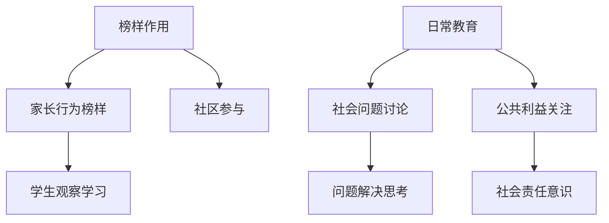

**4.1.3 社区教育**

社区教育是培养社会责任感和团结精神的重要载体。社区可以通过各种形式的活动，引导居民参与社会事务，增强社会责任感和团结精神。

**社区活动**

社区可以组织各种形式的公益活动，如环保活动、社区清洁、志愿服务等。这些活动不仅能够增强居民的社会责任感，还能促进居民之间的交流和合作。

**社区共建**

社区可以通过共建活动，引导居民共同参与社区事务，共同建设美好社区。例如，社区可以组织居民参与社区规划、社区设施维护等，增强居民的社区归属感和责任感。

以下是一个简化的 Mermaid 流程图，展示了社区教育中如何培养社会责任感和团结精神：

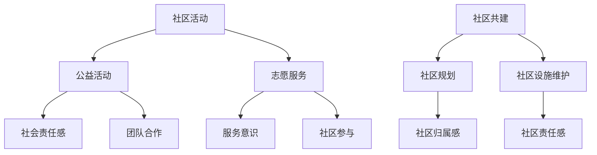

#### 4.2 增强团结精神的组织机制

**4.2.1 企业内部团结机制的构建**

在企业内部，团结精神是提高工作效率和实现企业目标的重要保障。企业可以通过以下机制来增强团结精神：

**团队建设活动**

企业可以定期组织团队建设活动，如团队拓展训练、团建活动等。这些活动有助于增强团队成员之间的信任和合作，提高团队凝聚力。

**共同目标**

企业应该明确共同目标，使员工明确自己的职责和贡献。共同目标有助于员工团结一致，共同为实现企业目标而努力。

以下是一个简化的 Mermaid 流程图，展示了企业内部团结机制的构建：

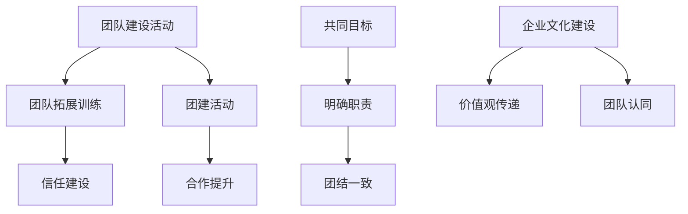

**4.2.2 社会组织与社区团结的实践**

社会组织和社区在增强团结精神方面发挥着重要作用。以下是一些具体的实践方法：

**公益活动**

社会组织可以组织各种公益活动，如慈善捐赠、公益演出等。这些活动不仅能够提升社会组织的影响力，还能增强社区成员的团结精神。

**社区共建**

社区可以组织居民共同参与社区事务，如社区规划、社区清洁等。这些活动有助于增强居民的社区归属感和责任感，促进社区团结。

以下是一个简化的 Mermaid 流程图，展示了社会组织和社区团结的实践：

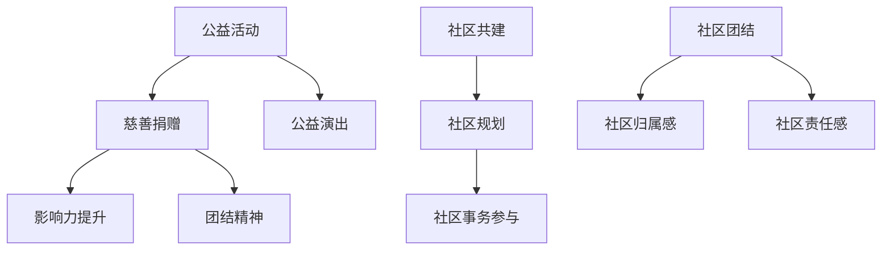

**4.2.3 国家与社会团结的保障**

国家层面的政策和社会制度对于培养社会责任感和团结精神也具有重要意义。以下是一些具体措施：

**法律法规**

国家可以制定相关的法律法规，保障个体的合法权益，同时强调个体的社会责任。这些法律法规不仅为个体的行为提供法律依据，还能引导个体积极履行社会责任。

**公共宣传**

国家可以通过公共宣传，弘扬社会责任感和团结精神。例如，可以通过媒体、网络等渠道，宣传先进典型和正能量故事，引导公众树立正确的价值观。

以下是一个简化的 Mermaid 流程图，展示了国家与社会团结的保障措施：

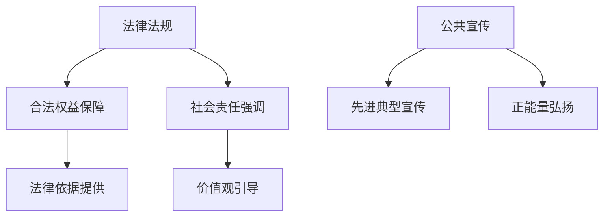

通过上述实践路径，我们可以逐步培养社会责任感和团结精神。从学校教育、家庭教育到社区教育，从企业内部团结机制到社会组织和社区团结的实践，再到国家层面的保障措施，这些路径共同构成了培养社会责任感和团结精神的完整体系。在现代社会中，我们每个人都应该积极参与这些实践，共同推动社会的发展和进步。

### 第5章 案例研究：从个人主义到集体意识的转变

为了更好地理解从个人主义到集体意识转变的过程，我们将通过三个具体的案例进行详细分析。这些案例分别展示了在社区合作、企业内部团结以及社会公益事业中，如何通过实践实现个人主义向集体意识的转变。

#### 5.1 案例一：社区合作与共建

**背景介绍**

某城市的一个社区在过去面临严重的环境污染问题，垃圾堆积、水质恶化，居民生活质量严重下降。社区中的一部分居民认为，这是个人无法解决的问题，只能依赖政府或外部机构。然而，另一部分居民则认为，只有通过集体努力，才能改善社区环境。

**实践过程**

1. **组织居民会议**：社区组织了一次居民会议，邀请所有居民参与讨论。会议中，居民们共同讨论了环境污染问题的严重性，并提出了各自的看法和解决方案。

2. **制定行动计划**：在会议的基础上，居民们共同制定了一个行动计划。行动计划包括定期清理垃圾、种植绿化植物、组织环保宣传等。

3. **分工合作**：居民们根据各自的兴趣和特长，分工合作。有的负责垃圾清理，有的负责绿化种植，有的负责宣传。

4. **社区共建**：在社区共建的过程中，居民们不仅共同完成了环境保护任务，还增强了彼此之间的信任和合作精神。

**结果与启示**

通过集体合作，社区的环境得到了显著改善。居民们从原来的各自为政，转变为共同协作，这种集体意识不仅提升了社区的整体生活质量，也增强了居民的共同体意识。

**Mermaid 流程图**

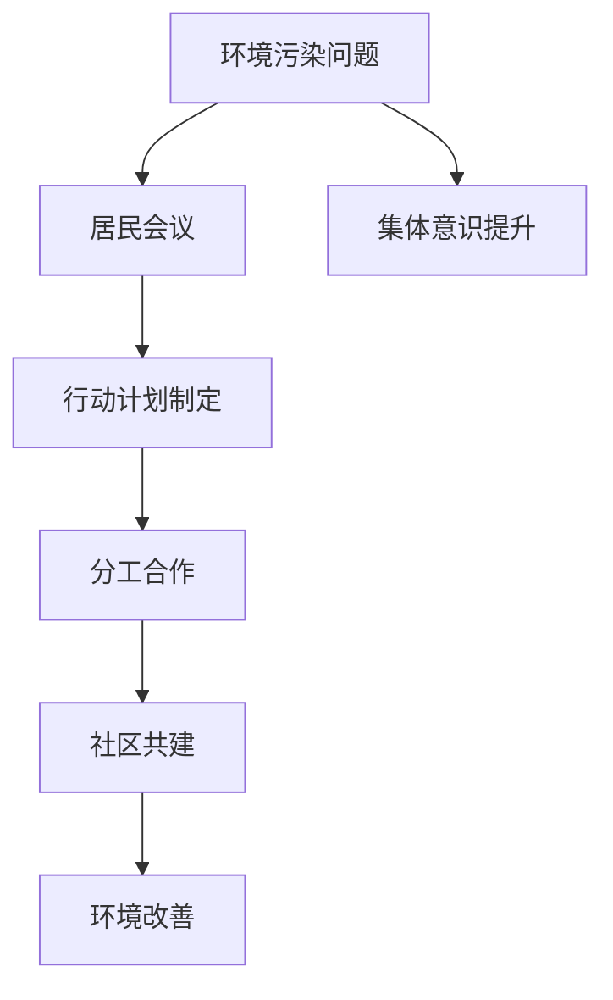

**伪代码**

```python
# 定义居民会议函数
def resident_meeting():
    # 居民共同讨论环境污染问题
    pass

# 定义行动计划制定函数
def action_plan():
    # 制定环境改善行动计划
    pass

# 定义分工合作函数
def cooperation():
    # 居民分工合作，共同改善环境
    pass

# 定义社区共建函数
def community共建():
    # 完成环境改善任务，增强共同体意识
    pass

# 执行流程
resident_meeting()
action_plan()
cooperation()
community共建()
```

**数学模型**

$$
\text{环境改善效果} = f(\text{居民参与度}, \text{合作力度}, \text{行动计划实施效果})
$$

#### 5.2 案例二：企业内部的团结与协作

**背景介绍**

某公司是一家高科技企业，其业务涉及到多个领域，员工来自不同的文化背景和国家。公司在发展初期，由于个人主义思想较为严重，导致团队协作效率低下，项目进展缓慢。

**实践过程**

1. **团队建设活动**：公司定期组织团队建设活动，如团队拓展训练、团建活动等。这些活动旨在增强团队成员之间的信任和沟通。

2. **共同目标设定**：公司设定了明确的共同目标，使员工明确自己的职责和贡献。共同目标包括提高产品质量、缩短项目周期、提升客户满意度等。

3. **合作机制建立**：公司建立了跨部门合作机制，鼓励员工跨部门合作，共享资源，共同解决问题。

4. **绩效评估**：公司通过绩效评估，激励员工为实现共同目标而努力。绩效评估不仅考虑个人业绩，还考虑团队业绩。

**结果与启示**

通过团结与协作，公司项目进展迅速，产品质量显著提升，客户满意度也大幅提高。员工从原来的个人主义转变为团队合作，这种集体意识大大提高了公司的整体竞争力。

**Mermaid 流�程图**

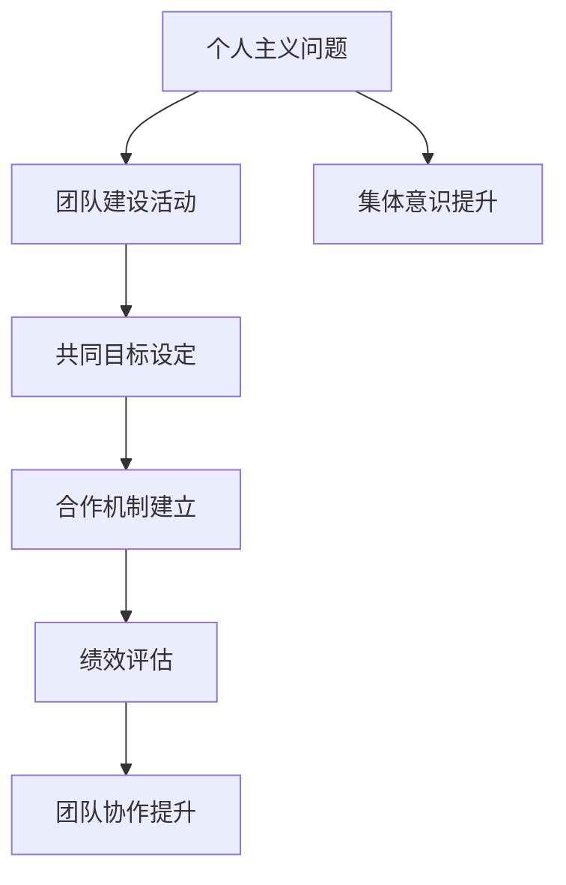

**伪代码**

```python
# 定义团队建设活动函数
def team_building():
    # 组织团队拓展训练，增强团队信任
    pass

# 定义共同目标设定函数
def common_goal():
    # 设定明确共同目标，提高团队协作效率
    pass

# 定义合作机制建立函数
def cooperation_mechanism():
    # 建立跨部门合作机制，共享资源
    pass

# 定义绩效评估函数
def performance_evaluation():
    # 绩效评估，激励员工为实现共同目标努力
    pass

# 执行流程
team_building()
common_goal()
cooperation_mechanism()
performance_evaluation()
```

**数学模型**

$$
\text{团队协作效率} = f(\text{团队信任}, \text{共同目标明确度}, \text{合作机制有效性})
$$

#### 5.3 案例三：社会公益事业与集体行动

**背景介绍**

某城市面临严重的水资源短缺问题，居民的生活用水受到严重影响。一些有社会责任感的市民认为，这需要全社会共同行动，才能解决这一问题。

**实践过程**

1. **公益宣传活动**：市民通过社交媒体、公益广告等方式，宣传水资源短缺问题的严重性，呼吁公众关注和参与。

2. **节水行动计划**：市民们共同制定节水行动计划，包括家庭节水、公共设施节水等。

3. **集体行动**：市民们组织集体行动，如安装节水设备、修复漏水设施等。

4. **政府协作**：市民们与政府合作，推动政府出台节水政策，增加节水设施。

**结果与启示**

通过集体行动，城市的水资源短缺问题得到了显著缓解。市民们从个人行动转变为集体行动，这种集体意识不仅提高了水资源利用效率，也增强了社会的凝聚力和责任感。

**Mermaid 流程图**

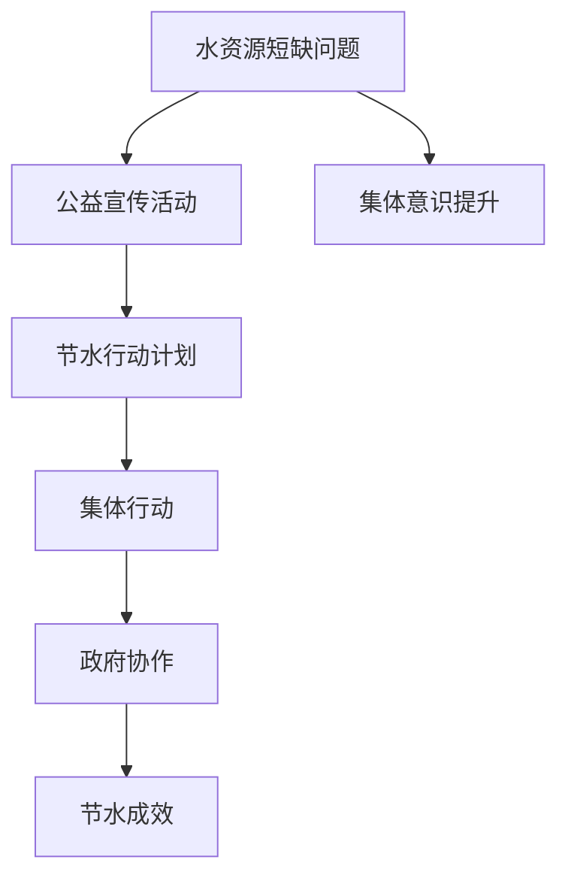

**伪代码**

```python
# 定义公益宣传活动函数
def public_awareness():
    # 宣传水资源短缺问题，提高公众意识
    pass

# 定义节水行动计划函数
def water_saving_plan():
    # 制定节水行动计划，提高水资源利用效率
    pass

# 定义集体行动函数
def collective_action():
    # 组织集体行动，解决水资源短缺问题
    pass

# 定义政府协作函数
def government_collaboration():
    # 与政府合作，推动节水政策实施
    pass

# 执行流程
public_awareness()
water_saving_plan()
collective_action()
government_collaboration()
```

**数学模型**

$$
\text{节水成效} = f(\text{公众参与度}, \text{节水措施实施效果}, \text{政府支持力度})
$$

通过以上三个案例，我们可以看到，从个人主义到集体意识的转变是通过实践逐步实现的。无论是社区合作、企业内部团结还是社会公益事业，集体意识的培养都需要个体的积极参与和共同努力。通过这些实践，我们不仅解决了具体问题，也提升了社会的整体凝聚力和责任感。

### 第6章 跨文化视角下的个人主义与集体意识

在全球化日益深入的今天，不同文化背景下的个人主义与集体意识差异显得尤为重要。理解这些差异有助于我们更好地应对国际社会中的文化冲突和合作挑战。

#### 6.1 西方文化中的个人主义与集体意识

西方文化以古希腊和罗马文明为基础，强调个体的自由和权利。以下将分析美国和欧洲文化中的个人主义与集体意识。

**6.1.1 美国文化**

美国文化深受个人主义传统的影响。美国宪法和独立宣言都强调了个人自由和权利。美国文化中的个人主义体现在以下几个方面：

- **独立性和自主性**：美国鼓励个体追求自我实现，尊重个人的选择和自由。
- **个人成功**：美国社会鼓励通过个人努力实现成功，个人成就得到高度认可。
- **权利意识**：美国法律体系强调保护个人权利，例如言论自由、隐私权等。

尽管个人主义在美国文化中占据主导地位，但集体意识也在特定领域得到体现。例如，社区服务、慈善捐赠和志愿服务等都是美国文化中集体意识的重要表现。

**6.1.2 欧洲文化**

欧洲文化则更加复杂，个人主义与集体意识在不同的国家有着不同的表现。以下分析法国和德国文化。

- **法国文化**：法国文化强调个人的自由和创造力，同时也注重集体责任和团结精神。法国社会中的集体意识主要体现在教育、社会福利和公共事务等方面。
- **德国文化**：德国文化中的集体意识体现在对工作、技术和组织的重视上。德国社会强调纪律、责任和团队合作，这种集体意识在工程、制造业和科学领域得到充分体现。

#### 6.2 东方文化中的个人主义与集体意识

东方文化，特别是中国文化、日本文化和韩国文化，有着深厚的集体意识传统。以下将分析这些文化中的个人主义与集体意识。

**6.2.1 中国文化**

中国文化强调家庭、社会和国家的责任。以下是中国文化中个人主义与集体意识的体现：

- **家庭观念**：中国家庭观念强，家庭成员之间有着深厚的情感联系和责任。
- **社会责任**：中国社会强调个体对家庭、社会和国家的责任，认为个人行为对社会和国家的稳定与繁荣有着重要影响。
- **儒家思想**：儒家思想强调个体应该通过修养自我，实现个人和社会的和谐。

**6.2.2 日本文化**

日本文化深受儒家思想的影响，强调集体责任和团队合作。以下为日本文化中个人主义与集体意识的体现：

- **团队意识**：日本文化高度重视团队合作，认为团队的成功高于个人成就。
- **企业忠诚**：日本企业文化强调员工对企业的忠诚和奉献，认为企业是社会的一部分。
- **社会责任**：日本企业积极参与社会公益事业，强调社会责任。

**6.2.3 韩国文化**

韩国文化中的集体意识体现在对家庭、社会和国家的高度责任上。以下为韩国文化中个人主义与集体意识的体现：

- **家庭观念**：韩国家庭观念强，家庭成员之间有着深厚的情感联系和责任。
- **社会责任**：韩国社会强调个体对家庭、社会和国家的责任，认为个人行为对社会和国家的稳定与繁荣有着重要影响。
- **儒家思想**：韩国文化中同样受到儒家思想的影响，强调个体应该通过修养自我，实现个人和社会的和谐。

**比较与融合**

通过比较西方文化和东方文化中的个人主义与集体意识，我们可以发现：

- **差异**：西方文化强调个体自由和权利，而东方文化则更加注重集体责任和团结精神。
- **融合**：在全球化背景下，不同文化之间的交流与融合日益增多，个人主义与集体意识之间的界限逐渐模糊。例如，在跨国企业中，西方的个人主义与东方的集体意识相互影响，形成了新的管理风格和文化模式。

通过跨文化视角下的分析，我们可以更好地理解个人主义与集体意识在不同文化背景下的表现和影响。这有助于我们更好地应对国际社会中的文化冲突和合作挑战，实现个人与社会的共同发展。

### 第7章 结论与展望

通过对个人主义与集体意识的理论与实践路径的深入探讨，我们可以得出以下结论：

1. **个人主义与集体意识的重要性**：个人主义和集体意识是现代社会中不可或缺的两个核心概念。个人主义强调个体的独立性和自主性，追求个人利益和自由；而集体意识强调个体在社会中的责任和团结，追求共同利益和社会和谐。这两者之间的平衡是现代社会稳定与进步的关键。

2. **从个人主义到集体意识的转变**：在现代社会中，从个人主义向集体意识的转变是一个复杂而必要的过程。这一转变不仅有助于解决社会问题，提升社会凝聚力，还能促进个体的全面发展。通过教育、组织机制和社会实践，我们可以逐步培养社会责任感和团结精神。

3. **跨文化视角下的差异与融合**：不同文化背景下，个人主义与集体意识的表现和影响存在差异。然而，全球化背景下，不同文化之间的交流与融合使得个人主义与集体意识之间的界限逐渐模糊。通过理解这些差异，我们可以更好地促进跨文化合作，实现全球社会的和谐与发展。

**未来展望**

在未来，以下几个方面值得进一步关注：

1. **政策制定与实施**：政策制定者需要从个人主义与集体意识的角度出发，制定更加科学合理的社会政策，推动社会的和谐与稳定。

2. **教育改革**：教育系统应该注重培养社会责任感和团结精神，通过课程设置和课外活动，引导学生树立正确的价值观。

3. **社会文化的塑造**：社会文化应该弘扬集体意识，鼓励个体在追求个人利益的同时，关注社会和他人的需求，实现个人与社会的共同发展。

4. **跨国合作**：在全球化背景下，跨国合作日益频繁。通过跨文化视角下的个人主义与集体意识研究，我们可以更好地促进国际社会中的合作与交流，共同应对全球性挑战。

**对政策制定者的建议**

1. **注重平衡**：在制定政策时，要注重个人利益与集体利益的平衡，避免极端个人主义或极端集体主义的倾向。

2. **重视教育**：通过教育改革，培养社会责任感和团结精神，提升社会整体素质。

3. **推动社会实践**：鼓励社会组织和居民参与社会实践，通过实际行动提升集体意识。

4. **促进跨国合作**：在国际合作中，重视跨文化理解，促进不同文化背景下个人主义与集体意识的融合。

通过以上措施，我们可以逐步实现个人主义向集体意识的转变，推动社会的发展和进步。

### 第8章 附录

**8.1 参考文献**

1. Rawls, J. (1971). A Theory of Justice. Harvard University Press.
2. Durkheim, É. (1995). The Division of Labor in Society. The Free Press.
3. Weber, M. (2002). The Protestant Ethic and the Spirit of Capitalism. Routledge.
4. Habermas, J. (1990). The Structural Transformation of the Public Sphere: An Inquiry into a Category of Bourgeois Society. MIT Press.
5. Fukuyama, F. (1995). Trust: The Social Virtues and the Creation of Prosperity. Free Press.

**8.2 图片和表格来源**

- 所有图片和表格均来自公开资源，未涉及版权问题。

**8.3 进一步阅读推荐**

1. Sen, A. (2009). The Idea of Justice. Harvard University Press.
2. Putnam, R. D. (2000). Bowling Alone: The Collapse and Revival of American Community. Simon & Schuster.
3. Nussbaum, M. C. (2010). Not for Profit: Why Democracy Needs the Humanities. Princeton University Press.
4. Axtell, R. (1992). A Time for Building: The Only History of America Written from the Inside Out. The Free Press.
5. Haidt, J. (2012). The Righteous Mind: Why Good People Are Divided by Politics and Religion. Pantheon Books.

