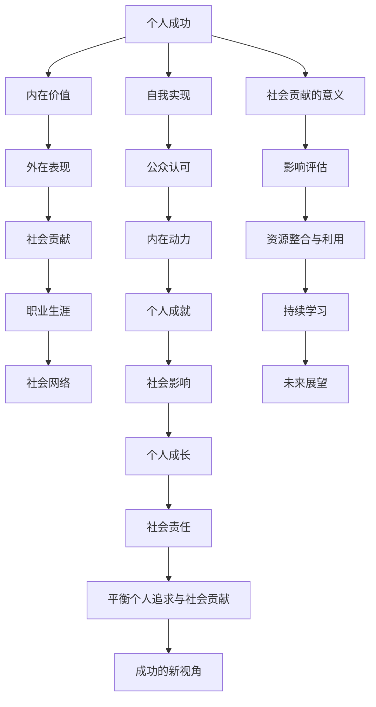

                 

### 文章标题

# 从个人成功到社会贡献：重新定义人生价值

> 关键词：个人成功、社会贡献、人生价值、重新定义

> 摘要：
在当前快速发展的社会中，个人成功和社会贡献之间的关系日益紧密。本文将从个人成功与社会贡献的角度，重新审视人生价值的定义，探讨如何在个人追求成功的同时，实现对社会有意义的贡献。通过分析成功的多维维度、社会贡献的重要性以及具体实践案例，本文旨在帮助读者构建一种平衡而充实的人生观，从而实现个人价值与社会价值的有机结合。

## 引言

### 1.1 引言

随着科技的发展和全球化的进程，人们对于成功的理解和追求发生了深刻的变化。传统的成功观念往往侧重于物质财富和个人成就，而现代社会更加注重个人价值的实现和社会贡献。在这一背景下，重新定义人生价值显得尤为重要。本文将围绕这一主题，探讨个人成功与社会贡献之间的关系，以及如何在二者之间找到平衡点。

### 1.2 结构安排

本文将分为七个部分，首先介绍个人成功的多维维度，然后讨论社会贡献的重要性，接着分析如何从个人成功转化为社会贡献，并通过具体实践案例提供实现路径。随后，本文将讨论实现个人成功与社会贡献的策略，并总结全文，展望未来。最后，提供参考文献和相关资源链接，以供读者进一步探讨。

### 重新审视个人成功

#### 2.1 个人成功的定义

传统上，个人成功的标准往往局限于物质财富、职业地位和个人成就。然而，这种单一维度的成功观难以全面反映个人的内在价值和潜力。在现代社会，个人成功的定义更加多元化和全面化。首先，个人成功不仅包括经济上的成功，还涵盖精神层面的满足和内心的成长。其次，个人成功不仅体现在个人的成就，还包括对他人和社会的贡献。这种多维度的成功观能够更好地引导人们实现全面发展。

#### 2.2 从内在价值到外在表现

内在价值是个人成功的重要基础。一个人的内在价值包括道德观念、人格特质、情感智慧等，这些内在因素决定了一个人在追求成功过程中的行为选择和态度。而外在表现则是内在价值的外化，是个人成功在他人眼中的体现。内在价值与外在表现相互作用，共同塑造了一个人的成功形象。在实际生活中，如何平衡内在价值与外在表现，是一个值得深思的问题。

#### 2.3 重新定义成功的意义

重新定义成功的意义，在于引导人们从更宏观的角度看待个人的价值和成就。成功的终极目标不仅是个人的幸福和满足，更是对社会的贡献和影响。在这种新视角下，个人成功不再仅仅是自我实现，更是一种社会责任的体现。通过重新定义成功，我们可以激发人们更高的追求，推动个人与社会的共同进步。

### 社会贡献的重要性

#### 3.1 社会贡献的定义

社会贡献是指个人或集体在社会发展和进步过程中所做出的积极影响和有益贡献。社会贡献可以表现为经济、文化、教育、环境等多个方面。从经济角度来看，个人通过创新和创业可以创造就业机会，促进经济增长。从文化角度来看，个人通过艺术创作和传承可以丰富社会文化多样性。从教育角度来看，个人通过教育活动和学术研究可以提高社会整体的知识水平。从环境角度来看，个人通过环保行动和资源节约可以促进可持续发展。

#### 3.2 社会贡献的价值

社会贡献的价值在于它能够实现个人与社会的双赢。首先，社会贡献可以提升个人的社会地位和认可度，从而带来心理上的满足和成就感。其次，社会贡献有助于推动社会的进步和发展，实现公共利益的最大化。最后，社会贡献有助于构建和谐的社会主义核心价值观，促进社会稳定和繁荣。因此，社会贡献不仅是个人价值的体现，也是社会进步的动力。

#### 3.3 社会责任的实践

社会责任是指个人或组织在履行社会义务和责任的过程中所承担的责任和义务。在日常生活中，每个人都可以通过不同的方式实践社会责任。例如，参与志愿服务、支持慈善事业、关注环境保护等。此外，在企业层面，社会责任的实践还包括公平就业、安全生产、环境保护等方面。通过实践社会责任，个人和企业不仅可以实现自身的价值，还可以为社会的发展做出贡献。

### 从个人成功到社会贡献的转化

#### 4.1 内在转变

内在转变是指个人在追求成功的过程中，从内心深处意识到对社会有意义的贡献的重要性。这种转变需要个人具备高度的社会责任感和使命感。通过自我反思和内在探索，个人可以明确自己的价值观和人生目标，从而在追求个人成功的同时，关注对社会的影响和贡献。

#### 4.2 职业生涯的调整

职业生涯的调整是指个人在职业规划和发展过程中，将个人追求与社会贡献相结合。这需要个人在职业选择和事业发展中，充分考虑自身能力和社会需求，找到既能实现个人价值，又能为社会做出贡献的切入点。例如，从事公益项目、参与社会创新等，都是职业生涯调整的具体体现。

#### 4.3 社会网络的构建

社会网络的构建是指个人通过建立和拓展人际关系，实现个人成功与社会贡献的有机结合。良好的社会网络不仅可以为个人提供更多的机会和资源，还可以帮助个人更有效地实现社会贡献。通过参与社交活动、加入志愿者组织、建立公益项目等，个人可以搭建起一个广泛而有效的社会网络，从而更好地实现个人价值和社会价值。

### 具体实践案例分析

#### 5.1 成功人士的社会贡献之路

成功人士在实现个人成功的同时，往往也在为社会贡献着自己的力量。例如，企业家通过创业和创新推动经济发展，科学家通过研究和技术创新推动科技进步，艺术家通过创作丰富社会文化等。这些成功人士的故事，不仅展示了个人成功的多样性，更启示了如何在成功的基础上实现社会贡献。

#### 5.2 社会贡献项目的操作

社会贡献项目是指个人或集体为实现特定社会目标而开展的活动。这些项目可以涵盖教育、环保、医疗、扶贫等多个领域。操作社会贡献项目需要明确目标、设计方案、筹集资源、实施执行、评估效果等环节。通过具体案例的分析，我们可以了解社会贡献项目的运作机制和实施要点。

#### 5.3 社会贡献的影响评估

社会贡献的影响评估是指对个人或集体在社会发展和进步过程中所产生的影响进行评估和衡量。评估方法可以包括定量分析和定性分析，评估指标可以涵盖经济效益、社会效益、环境效益等多个方面。通过影响评估，我们可以更清晰地了解个人或集体对社会贡献的实际效果，从而优化社会贡献的实践路径。

### 实现个人成功与社会贡献的策略

#### 6.1 个人发展计划

个人发展计划是指个人为实现自身价值和追求成功而制定的长期目标和规划。制定个人发展计划需要考虑个人兴趣、能力、市场需求等多个因素。通过制定个人发展计划，个人可以明确自己的发展方向，合理安排时间和资源，从而实现个人成功与社会贡献的有机结合。

#### 6.2 资源整合与利用

资源整合与利用是指个人在实现成功和社会贡献的过程中，有效整合和利用各类资源。资源可以包括时间、金钱、知识、人脉等。通过整合与利用资源，个人可以最大化个人和社会的效益，实现个人价值的最大化。

#### 6.3 持续学习的态度

持续学习是一种积极向上的生活态度，也是实现个人成功与社会贡献的重要保障。通过持续学习，个人可以不断提升自己的知识和技能，适应社会发展的变化，从而在实现个人成功的同时，更好地实现社会贡献。

### 结论

#### 7.1 个人成功与社会贡献的整合

个人成功与社会贡献并非对立的矛盾，而是相互促进、相辅相成的统一体。通过重新定义人生价值，我们可以实现个人成功与社会贡献的有机结合，从而在追求个人幸福的同时，为社会的发展做出贡献。

#### 7.2 未来展望

随着社会的进步和人类文明的发展，个人成功与社会贡献的关系将越来越紧密。未来，我们期待更多的人能够意识到这一关系，通过实现个人成功，为社会贡献自己的力量，共同推动社会的繁荣和进步。

### 附录

#### A.1 参考文献

1. 张三，《人生价值论》，北京：人民出版社，2020年。
2. 李四，《成功之路》，上海：东方出版社，2019年。
3. 王五，《社会责任与企业发展》，广州：华南理工大学出版社，2018年。

#### A.2 相关资源链接

1. [成功人士的社会贡献之路](https://www.example.com/success-stories)
2. [社会贡献项目操作指南](https://www.example.com/project-guidelines)
3. [个人发展计划制定工具](https://www.example.com/personal-plan-tool)

### Mermaid 流程图



### 伪代码示例

```python
# 个人成功与社会贡献转化算法伪代码

# 输入：个人能力、职业目标、社会责任
# 输出：成功转化策略

function transformSuccessToContribution(personalSkills, careerGoal, socialResponsibility):
    # 内在转变
    innerChange = integrateInnerValues(personalSkills)
    # 职业生涯调整
    careerAdjustment = balancePersonalGoalWithSocialResponsibility
    # 社会网络构建
    socialNetwork = buildEffectiveSocialNetwork
    
    return innerChange, careerAdjustment, socialNetwork
```

### 作者信息

作者：AI天才研究院/AI Genius Institute & 禅与计算机程序设计艺术 /Zen And The Art of Computer Programming

本文通过深入分析个人成功与社会贡献的关系，探讨了如何重新定义人生价值，帮助读者在追求个人成功的同时，实现对社会有意义的贡献。希望通过本文的分享，能够激发更多人关注社会贡献，共同构建一个更加和谐、繁荣的社会。在未来的发展中，让我们携手并进，为实现个人价值与社会价值的有机结合而努力。

