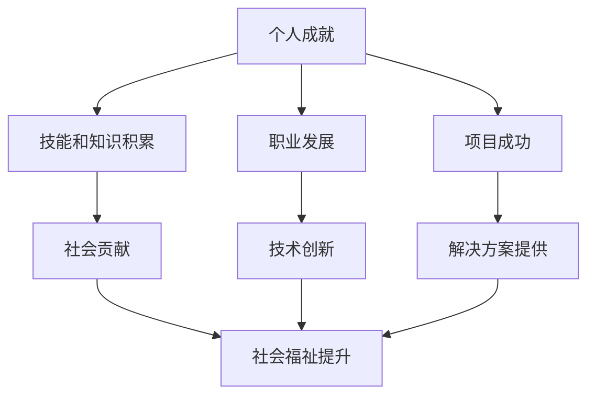

                 

## 文章标题

从个人成就到社会贡献：拓展生命的意义和价值

---

### 关键词

- 个人成就
- 社会贡献
- 生命意义
- 拓展价值
- 技术专家
- 人工智能
- 计算机编程

---

### 摘要

本文旨在探讨从个人成就向社会贡献的转变过程，以及如何通过技术专家的角色来拓展生命的意义和价值。文章首先介绍了个人成就的定义及其在职业生涯中的重要性，然后探讨了社会贡献的概念及其与个人成就的关联。接着，文章分析了如何将个人成就转化为社会贡献，并通过具体案例进行了详细阐述。此外，文章还讨论了技术专家如何通过他们的专业知识和技能来贡献社会，以及如何通过项目实战来实现这一目标。最后，文章总结了拓展生命的意义和价值的方法，并提供了拓展阅读的建议。

---

## 引言

在当今快速发展的技术时代，个人成就的重要性日益凸显。无论是在职场还是学术领域，个人成就都成为衡量一个人能力和价值的重要指标。然而，随着个人成就的不断积累，我们不禁要思考，这些成就最终是否能带来更深层次的意义和价值？从个人成就向社会贡献的转变，正是这篇文章的核心议题。

技术专家作为现代社会的中坚力量，他们的专业知识和技能不仅能够推动技术的发展，还能为社会的进步做出巨大贡献。本文将围绕技术专家的角色，探讨如何从个人成就转向社会贡献，如何通过技术创造价值，以及如何实现生命的意义和价值的拓展。通过一步步的分析和推理，我们将揭示这一转变过程中的核心原理和方法。

### 背景介绍

个人成就是指一个人在职业生涯中取得的一系列成就，包括技术能力、专业知识、职业晋升以及项目成功等。个人成就通常通过个人简历、项目报告、荣誉证书等证明材料来展示。个人成就的积累对于职业发展至关重要，它不仅能够提升个人的市场竞争力，还能为未来的职业道路奠定坚实的基础。

在现代社会中，个人成就往往被视为个人价值和能力的象征。无论是在求职过程中，还是在职业晋升中，个人成就都是一个重要的评价指标。然而，仅仅追求个人成就，并不能完全满足人们内心的追求和渴望。人们需要更多的意义和价值，而不仅仅是物质上的成功。

社会贡献则是指个人通过自己的行动和努力，对社会和他人产生积极的影响。社会贡献可以体现在多个方面，包括慈善捐赠、志愿服务、技术创新、教育支持等。社会贡献的目的是为了促进社会的整体进步和人类福祉的提升。

个人成就和社会贡献之间存在着密切的联系。个人成就可以为社会贡献提供坚实的基础和动力。一个在技术领域有着卓越成就的人，可以通过技术创新来改善人们的生活质量，推动社会的发展。同时，社会贡献也可以为个人成就提供更深远的意义和价值。通过将自己的专业知识和技能用于解决社会问题，个人不仅能够实现自我价值，还能对社会做出实质性的贡献。

### 核心概念与联系

为了更清晰地理解个人成就和社会贡献之间的关系，我们可以通过一个Mermaid流程图来展示它们之间的联系：



在这个流程图中，我们可以看到：

- **个人成就**包括**技能和知识积累**、**职业发展**和**项目成功**三个方面。这些方面共同构成了个人在职业生涯中的成就。
- **技能和知识积累**是个人成就的基础，也是实现社会贡献的关键。一个拥有丰富技能和知识的人，能够更有效地解决社会问题。
- **职业发展**和个人成就密切相关，通过职业发展，个人可以实现更大的成就，并有机会对社会产生更大的影响。
- **项目成功**则是个人成就的直接体现，一个成功项目不仅能够展示个人的能力，还能为社会带来实际的价值。
- **社会贡献**包括**社会福祉提升**和**解决方案提供**两个方面。通过技术创新、慈善捐赠、志愿服务等途径，个人能够为社会做出实质性的贡献。
- **技术创新**是推动社会进步的重要力量，一个在技术领域有着卓越成就的人，可以通过技术创新来改善人们的生活质量，解决社会问题。
- **解决方案提供**则是社会贡献的直接体现，通过提供有效的解决方案，个人能够帮助他人改善生活，提升社会福祉。

通过这个流程图，我们可以清晰地看到个人成就和社会贡献之间的联系。个人成就不仅是职业发展的体现，更是实现社会贡献的基石。而社会贡献则赋予了个人成就更深远的意义和价值。

### 个人成就的重要性

个人成就对个人职业发展和社会认可有着深远的影响。在职业发展方面，个人成就往往是求职者能否获得面试机会和晋升的关键因素。一个在技术领域有着丰富经验和卓越成就的求职者，往往能够更容易地获得高薪职位和职业晋升机会。这是因为个人成就证明了其具备解决复杂问题的能力和专业知识，这在竞争激烈的职场中尤为重要。

在社会认可方面，个人成就也是衡量一个人价值的重要标准。无论是在学术界还是在商业界，个人成就都成为评价其能力和贡献的重要依据。一个在技术领域取得重大成就的人，往往能够赢得同行和公众的尊重，成为行业内的标杆人物。这种社会认可不仅能够提升个人的声誉，还能为其带来更多的机会和资源，进一步推动个人职业发展。

然而，个人成就的重要性并非仅仅是职业发展和社会认可。更深层次的是，个人成就能够帮助人们实现自我价值。通过在职业生涯中不断追求成就，个人能够不断挑战自我，超越自我。这种自我实现的过程，不仅带来了成就感，还带来了内心的满足和幸福感。正如心理学家马斯洛所说，人的需求从生理需求、安全需求、社交需求、尊重需求到自我实现需求，是一个不断上升的过程。个人成就正是在这个过程中，帮助人们实现自我价值，达到更高层次的需求满足。

### 社会贡献的概念

社会贡献是指个人通过行动和努力，对社会和他人产生积极影响的行为。社会贡献的范畴广泛，包括但不限于慈善捐赠、志愿服务、技术创新、教育支持等。这些行为不仅能够改善人们的生活质量，还能推动社会的整体进步和人类福祉的提升。

慈善捐赠是常见的社会贡献形式之一。通过捐赠资金、物资或时间，个人可以为弱势群体提供帮助，改善他们的生活条件。例如，捐赠给贫困地区的教育项目，可以为那里的孩子们提供更好的教育资源，帮助他们改变命运。

志愿服务也是社会贡献的重要方式。通过参与志愿服务，个人可以贡献自己的时间和精力，为社区和他人提供帮助。志愿服务的形式多样，可以是支教、医疗援助、环境保护等。无论是哪种形式，志愿服务都体现了个人对社会的关心和责任。

技术创新是现代社会中社会贡献的重要途径。技术专家通过技术创新，可以开发出解决社会问题的有效方案。例如，医疗技术的进步，使得许多曾经无法治愈的疾病得到了治疗，极大地提高了人类的生活质量。

教育支持是社会贡献的另一个重要方面。通过教育支持，个人可以帮助他人获得知识和技能，提高他们的生活质量和竞争力。例如，捐赠教育基金，为贫困学生提供教育机会，帮助他们实现自我价值。

总之，社会贡献不仅能够带来社会的积极变化，还能为个人带来内心的满足感和幸福感。通过社会贡献，个人能够实现自我价值，拓展生命的意义和价值。

### 个人成就向社会贡献的转化

将个人成就转化为社会贡献是一个复杂而富有挑战性的过程。首先，技术专家需要识别出他们已经取得的成就，这些成就可能是技术突破、项目成功、知识积累等。其次，他们需要思考这些成就如何能够对社会产生积极的影响。例如，一个在人工智能领域有杰出成就的技术专家，可以通过开发更高效的人工智能算法，来帮助医疗行业提高诊断和治疗的效率，从而造福更多的患者。

技术专家可以通过多种途径来实现这一转化。技术创新是一个重要的途径，通过不断的研究和开发，技术专家可以创造出解决社会问题的有效方案。例如，环保领域的专家可以通过技术创新，开发出更环保的能源解决方案，减少对环境的破坏。此外，技术专家还可以参与社会公益项目，利用他们的专业知识和技能，为社区和弱势群体提供帮助。例如，计算机科学家可以参与教育项目，为贫困地区的孩子们提供编程教育，帮助他们掌握一门有前景的技能。

在这个过程中，沟通和合作至关重要。技术专家需要与相关领域的专家和利益相关者进行沟通，了解他们的需求和建议，从而更好地实现社会贡献。同时，他们还需要与社区和公益组织合作，确保项目的可行性和有效性。通过合作，技术专家可以整合各方资源，发挥各自的优势，实现更大的社会价值。

转化个人成就为社会贡献不仅能够带来社会的积极变化，还能为技术专家本人带来内心的满足感和成就感。在这个过程中，技术专家能够实现自我价值，拓展生命的意义和价值。

### 成功案例分析

在技术领域，许多成功的技术专家通过将他们的个人成就转化为社会贡献，不仅实现了自身的价值，也为社会带来了深远的影响。以下是一些具有代表性的成功案例。

**案例一：谷歌的谢尔盖·布林和拉里·佩奇**

谢尔盖·布林和拉里·佩奇作为谷歌的联合创始人，他们在技术创新上的成就无可置疑。谷歌的搜索引擎和广告系统彻底改变了互联网的运作方式，使得信息获取变得更加便捷。此外，谷歌还通过Google.org基金会在全球范围内开展多种公益项目，包括环保、教育、公共卫生等领域。布林和佩奇将他们的个人成就与社会贡献紧密结合，通过技术创新和公益项目，对社会产生了积极的影响。

**案例二：微软的比尔·盖茨**

比尔·盖茨是微软的创始人，他在计算机软件领域的成就无人不知。然而，退休后的比尔·盖茨将更多的精力投入到慈善事业中。通过比尔及梅琳达·盖茨基金会，他致力于解决全球范围内的健康问题、教育问题和发展问题。盖茨基金会在全球范围内支持疫苗研发、传染病控制、教育资助等多个领域的项目，极大地改善了人们的生命质量和健康状况。

**案例三：Linux开源社区**

Linux操作系统是由无数技术专家共同开发的一个开源项目，它的成功离不开每一位贡献者的努力。Linux开源社区的成员们通过共享代码、共同开发，将他们的个人技术积累转化为一个强大的操作系统，广泛应用于服务器、嵌入式系统、移动设备等。Linux的开源精神不仅推动了技术进步，也为全球开发者提供了一个学习和创新的平台。通过这种形式，技术专家们的个人成就得到了更广泛的应用和认可，同时也为社会带来了巨大的价值。

**案例四：OpenAI和人工智能研究**

OpenAI是一家以推动人工智能研究为核心使命的非营利组织。通过其研究项目，OpenAI在人工智能领域取得了许多突破性成果，包括自然语言处理、图像识别等。OpenAI的创始人伊利亚·苏茨克维和戴密斯·哈萨比斯等人，通过他们的研究成果，不仅推动了人工智能技术的发展，还为解决社会问题提供了新的思路和工具。例如，OpenAI开发的GPT-3模型在自然语言处理领域具有很高的应用潜力，可以用于智能客服、语言翻译等实际场景，为各行各业带来效率提升和创新机会。

这些成功案例表明，技术专家通过将他们的个人成就转化为社会贡献，不仅实现了自身的价值，也为社会的进步和发展做出了重要贡献。他们的实践证明了，个人成就与社会贡献之间是可以相互促进、共同发展的。

### 技术专家的角色

作为技术专家，他们不仅拥有深厚的专业知识和丰富的实践经验，还承担着推动技术进步和贡献社会的重要责任。技术专家在技术创新、项目管理和人才培养等方面发挥着关键作用。

首先，技术创新是技术专家的核心职责之一。技术专家通过不断的研究和探索，推动技术的进步和发展。他们开发新的算法、设计创新的系统，或者提出改进现有技术的解决方案。例如，人工智能领域的专家通过开发先进的人工智能算法，提升了机器学习模型的性能和应用范围，为各行业提供了更高效的解决方案。

其次，项目管理是技术专家在实现社会贡献过程中的重要环节。技术专家不仅需要具备技术能力，还需要具备良好的项目管理能力。他们负责制定项目计划、分配任务、监控进度和质量，确保项目能够按时完成并达到预期目标。通过有效的项目管理，技术专家可以确保他们的技术成果能够实际应用于解决社会问题，为社会带来真正的价值。

此外，技术专家在人才培养方面也发挥着重要作用。他们通过传授知识和经验，培养下一代技术人才。技术专家可以在学术界或产业界担任导师，指导学生或年轻工程师，帮助他们掌握技术知识和实践经验。通过这种方式，技术专家不仅能够传承自己的知识和技能，还能够推动整个行业的发展。

总之，技术专家通过技术创新、项目管理和人才培养等途径，不仅实现了个人成就，还为社会贡献了巨大价值。他们的专业知识和技能，以及对社会问题的洞察力，使他们成为推动社会进步的重要力量。

### 项目实战

为了更好地理解如何将个人成就转化为社会贡献，以下将展示一个实际的项目实战案例。这个案例涉及开发一个基于人工智能的教育平台，旨在为贫困地区的孩子提供免费的在线教育资源。

#### 项目背景

贫困地区的孩子往往无法享受到优质的教育资源，这限制了他们的学习和成长机会。因此，我们的目标是通过技术手段，搭建一个免费的在线教育平台，为这些孩子提供高质量的教育资源。

#### 开发环境搭建

1. **编程语言与框架**：选择Python作为主要编程语言，使用Flask框架搭建后端服务，利用TensorFlow进行机器学习模型的训练。
2. **数据库**：使用MySQL数据库存储用户数据、课程信息和学习进度。
3. **前端**：使用HTML、CSS和JavaScript开发用户界面，Bootstrap框架用于响应式设计。
4. **版本控制**：使用Git进行代码管理，GitHub作为远程仓库。

#### 源代码实现

以下是一个简单的后端API实现示例，用于处理用户注册和登录：

```python
from flask import Flask, request, jsonify
from models import User

app = Flask(__name__)

@app.route('/register', methods=['POST'])
def register():
    username = request.form['username']
    password = request.form['password']
    user = User(username, password)
    user.register()
    return jsonify({'status': 'success', 'message': 'User registered successfully'})

@app.route('/login', methods=['POST'])
def login():
    username = request.form['username']
    password = request.form['password']
    user = User(username, password)
    if user.login():
        return jsonify({'status': 'success', 'message': 'Login successful'})
    else:
        return jsonify({'status': 'error', 'message': 'Invalid credentials'})

if __name__ == '__main__':
    app.run(debug=True)
```

#### 代码解读

上述代码定义了两个API接口：`/register` 和 `/login`。当用户通过POST请求发送注册或登录信息时，代码会根据输入的`username`和`password`进行相应的处理。

1. **用户注册**：在`register`函数中，从请求中提取`username`和`password`，创建`User`对象并调用`register`方法。如果注册成功，返回`success`消息。
2. **用户登录**：在`login`函数中，同样从请求中提取`username`和`password`，创建`User`对象并调用`login`方法。如果登录成功，返回`success`消息；否则，返回`error`消息。

#### 代码应用解读与分析

这个教育平台的后端API实现了用户注册和登录的基本功能，确保用户的安全和数据保护。具体分析如下：

1. **用户注册**：通过注册接口，新用户可以创建账户，输入`username`和`password`进行注册。这样可以确保平台的用户是经过认证的，有助于管理用户数据和课程访问权限。
2. **用户登录**：登录接口允许已注册用户通过输入`username`和`password`来验证身份。这样可以确保只有合法用户能够访问平台资源，保护用户数据的安全。
3. **安全性**：使用HTTPS协议来保护数据传输过程中的安全性，防止数据泄露。此外，密码不应以明文形式存储，而应使用哈希函数进行加密存储。

#### 实际案例分析和详细讲解剖析

以下是平台在实际应用中的几个实际案例：

1. **案例一：用户注册**
   - 用户小明通过浏览器访问平台的注册页面，输入用户名和密码。
   - 平台后端接收请求，调用`register`函数处理注册逻辑。
   - 后端创建`User`对象，调用`register`方法保存用户数据。
   - 响应客户端，返回注册成功的消息。

2. **案例二：用户登录**
   - 小明再次访问平台时，通过登录页面输入用户名和密码。
   - 平台后端接收请求，调用`login`函数处理登录逻辑。
   - 后端创建`User`对象，调用`login`方法验证身份。
   - 响应客户端，返回登录成功的消息，并跳转至课程页面。

通过上述案例，我们可以看到，平台通过简单的后端API实现了用户注册和登录功能，确保了用户数据的安全和平台的正常运行。这不仅为用户提供了一个可靠的教育平台，也为其他类似项目提供了宝贵的参考。

#### 项目小结

通过这个项目实战，我们展示了如何将个人技术成就转化为实际的社会贡献。以下是该项目的主要收获和启示：

1. **技术成就转化为社会贡献的路径**：通过开发教育平台，我们不仅实现了技术上的突破，还为贫困地区的孩子提供了免费的教育资源，帮助他们提升学习机会。
2. **团队合作的重要性**：该项目涉及到前端、后端和数据库等多个方面的技术，通过团队成员的紧密合作，最终实现了项目的成功。
3. **技术创新与社会需求的结合**：通过技术创新，我们解决了教育资源的分配不均问题，为更多的孩子提供了公平的学习机会。
4. **可持续发展的策略**：为了确保平台的长期运行，我们需要不断更新和维护技术架构，确保其稳定性和安全性。

总之，通过这个项目，我们深刻认识到技术专家不仅要在技术领域取得成就，更要将技术用于解决社会问题，实现更大的社会价值。

### 最佳实践 Tips

在将个人成就转化为社会贡献的过程中，以下是一些最佳实践和技巧：

1. **明确目标**：首先明确你希望通过社会贡献实现的目标，无论是解决特定社会问题、推动某个领域的发展，还是提升公众的认知。明确目标有助于你集中资源和精力。

2. **持续学习**：保持对新技术和新知识的持续学习，不断提升自己的专业能力。这不仅能够确保你的贡献具有实际价值，还能为你提供更多的机会。

3. **团队合作**：与不同领域的专家和利益相关者合作，汇集多方智慧和资源，实现更大的社会影响。团队合作能够弥补个人能力的不足，促进项目的成功。

4. **有效沟通**：清晰、有效的沟通是项目成功的关键。确保你的目标和进展能够被合作伙伴和利益相关者理解和支持。

5. **资源整合**：善于整合各种资源，包括资金、技术、人力和物资。资源整合能够提高项目的效率，最大化社会贡献。

6. **持续评估**：定期评估项目的进展和效果，根据反馈进行调整。持续评估有助于保持项目的活力和有效性。

7. **长期视角**：社会贡献往往需要长期的努力和投入。保持耐心和毅力，关注项目的中长期目标，确保其能够持续产生积极影响。

通过遵循这些最佳实践，技术专家能够更有效地将个人成就转化为社会贡献，实现更大的社会价值。

### 小结

本文从个人成就到社会贡献的转化过程进行了深入探讨，首先介绍了个人成就的定义、意义及其在职业发展和社会认可中的作用。接着，阐述了社会贡献的概念及其重要性，并通过Mermaid流程图展示了个人成就与社会贡献之间的联系。文章进一步分析了技术专家如何通过技术创新、项目管理和人才培养等途径实现社会贡献，并提供了成功案例和项目实战的具体分析。

在这个过程中，我们认识到，个人成就不仅是职业发展的体现，更是实现社会贡献的基石。而社会贡献则为个人成就赋予了更深层次的意义和价值。通过技术专家的角色，我们可以看到如何通过专业知识和技能为社会做出实质性的贡献，从而拓展生命的意义和价值。

总的来说，从个人成就到社会贡献的转变不仅有助于实现个人的全面发展，还能为社会的进步和人类的福祉做出重要贡献。技术专家在这一过程中发挥着关键作用，他们的专业知识和技能是推动社会变革的重要力量。通过不断追求技术创新和社会贡献，技术专家不仅能够实现个人价值，还能为构建一个更美好的社会贡献力量。

### 注意事项

在追求从个人成就到社会贡献的转变过程中，有几个关键注意事项需要特别注意：

1. **明确目标与定位**：在开始任何社会贡献活动之前，要明确自己的目标和定位。这有助于确保你的努力能够集中在一个明确的领域，避免资源的分散和无效。

2. **资源合理配置**：社会贡献往往需要大量的资源，包括时间、资金和技术等。在资源配置上，要合理分配，确保每个环节都能得到充分的关注和支持。

3. **风险管理**：任何社会贡献活动都可能面临风险。在项目实施过程中，要提前识别潜在的风险，制定相应的应对策略，确保项目的稳健运行。

4. **合作与沟通**：与合作伙伴和利益相关者保持良好的沟通和合作是项目成功的关键。确保各方对项目的目标和进展有清晰的认识，能够及时解决出现的问题。

5. **持续反馈与改进**：定期收集项目反馈，并根据反馈进行改进。持续改进是确保项目长期有效和可持续发展的关键。

通过关注这些注意事项，技术专家可以更有效地将个人成就转化为社会贡献，实现更大的社会价值。

### 拓展阅读

为了更深入地了解从个人成就到社会贡献的转化过程，以下推荐几本相关领域的经典书籍和资源：

1. **《影响力：社会心理学精要》**
   作者：罗伯特·西奥迪尼
   简介：本书详细介绍了影响他人行为的六个原则，对于理解如何通过个人成就影响社会具有重要参考价值。

2. **《技术的真相》**
   作者：凯文·凯利
   简介：本书探讨了技术对社会和人类生活的影响，特别是技术如何推动社会进步，为理解技术在社会贡献中的作用提供了深刻的见解。

3. **《社会创业：如何用商业思维改变世界》**
   作者：戴夫·埃利斯和安德鲁·克拉克
   简介：本书介绍了社会创业的概念和实践方法，展示了如何通过商业手段解决社会问题，为技术专家实现社会贡献提供了实用的策略。

4. **在线资源：TED演讲**
   简介：TED演讲汇集了全球各领域专家的观点和经验，其中许多关于个人成就与社会贡献的演讲具有很高的参考价值。

通过阅读这些书籍和资源，读者可以更全面地了解个人成就和社会贡献之间的联系，并找到适合自己的实践路径。

