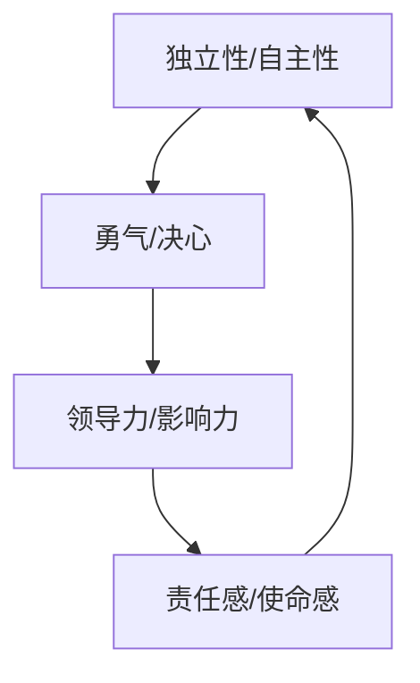

                 

# 从个人英雄主义到团队协作：重新定义成功模式

## 关键词

- 个人英雄主义
- 团队协作
- 成功模式
- 重新定义
- 团队管理
- 团队建设
- 案例分析

## 摘要

在科技与商业环境中，个人英雄主义曾是成就事业的基石。然而，随着组织复杂性的增加和团队协作的重要性日益凸显，成功模式正在经历深刻的变革。本文旨在探讨个人英雄主义与团队协作的关系，通过历史背景、核心概念、案例分析等多个维度，重新定义成功模式。文章首先回顾个人英雄主义的发展历程，随后阐述团队协作的定义、重要性及其实践方法，接着分析成功模式的演变过程，最后通过真实案例阐述团队协作的优势及其在当今社会中的应用。文章旨在为读者提供一个全面、深入的视角，以更好地理解和应对新时代的成功模式。

## 引言

在信息技术飞速发展的当今社会，成功的定义与实现方式正在发生深刻的变化。在过去，个人英雄主义常常被视为成功的关键要素。从古代的勇士到近代的发明家，个人的才智、勇气和毅力往往被视为驱动事业成功的核心动力。然而，随着商业环境的日益复杂，单靠个人英雄主义已不足以应对现代企业的挑战。团队合作、协同创新逐渐成为成功模式中的重要组成部分。

个人英雄主义的历史源远流长，它源于人类对英雄主义精神的神往和崇拜。在古代，英雄往往被赋予超乎常人的能力和非凡的成就，成为激励后人的典范。例如，古希腊的赫拉克勒斯以十二项伟业闻名于世，成为英雄的象征。中世纪的骑士、文艺复兴时期的科学家，以及工业革命时代的发明家，都是个人英雄主义的代表人物。他们的成就不仅推动了时代的进步，也塑造了个人英雄主义的时代精神。

然而，进入现代社会后，个人英雄主义逐渐暴露出其局限性。随着组织规模的扩大和任务复杂度的提升，单靠个人的智慧和努力难以应对各种挑战。团队合作的重要性日益凸显，人们开始意识到，通过协同合作可以更高效地解决问题，实现更大的目标。团队协作不仅能够弥补个人能力的不足，还能够激发集体的智慧，形成强大的创新力量。

本文旨在探讨从个人英雄主义到团队协作的转变，重新定义成功模式。文章将首先回顾个人英雄主义的历史与概念，分析其核心价值观和影响。随后，文章将详细阐述团队协作的定义、重要性及其实践方法。接着，文章将探讨成功模式的演变过程，分析个人英雄主义与团队协作的融合。最后，通过真实案例阐述团队协作的优势及其在当今社会中的应用。希望通过本文的探讨，读者能够对成功模式有更深入的理解，更好地应对现代商业环境中的挑战。

## 个人英雄主义的历史与概念

### 古代与中世纪的英雄主义

个人英雄主义的历史可以追溯到古代文明。古希腊和罗马时期，英雄主义精神被广泛颂扬和崇拜。古希腊的赫拉克勒斯（Hercules）以其超凡的力量和智慧完成了十二项艰巨的任务，成为英雄的典范。他的故事不仅传递了勇气和坚韧的品质，也体现了个人在追求卓越过程中所承担的责任。

中世纪骑士制度下的英雄主义则具有独特的象征意义。骑士们被赋予了忠诚、荣誉和勇敢等高尚的品质，他们的行为和成就不仅影响了当时的欧洲社会，也深深植根于后来的文学和艺术作品中。骑士们通过战斗、救助弱者和遵循骑士准则，展现了个人英雄主义的精神。

文艺复兴时期，随着人类对自然和科学的探索不断深入，个人英雄主义继续发扬光大。科学家们如伽利略（Galileo Galilei）和牛顿（Isaac Newton）以其卓越的智慧和发现，挑战了传统的观念，推动了科学革命。他们的成就不仅改变了人类对世界的认知，也树立了个人英雄主义的全新标准。

### 现代社会的个人英雄主义

进入现代社会后，个人英雄主义依然存在，并且在不同领域有着不同的体现。工业革命时期，发明家和企业家如托马斯·爱迪生（Thomas Edison）和亨利·福特（Henry Ford）以其创新精神和商业才能，改变了整个社会的生产方式和生活方式。他们的个人努力和才智被视为成功的关键因素。

在科技领域，个人英雄主义体现在诸如史蒂夫·乔布斯（Steve Jobs）、比尔·盖茨（Bill Gates）和埃隆·马斯克（Elon Musk）等人的身上。他们通过独特的视角和坚定的信念，推动了一系列技术创新，不仅改变了科技行业，也对全球经济和社会发展产生了深远影响。

然而，随着组织规模的扩大和任务复杂性的增加，单靠个人英雄主义已难以应对现代商业环境中的各种挑战。团队协作的重要性逐渐凸显，个人英雄主义开始受到质疑和挑战。

### 个人英雄主义的核心价值观

个人英雄主义的核心价值观主要包括以下几点：

1. **独立性和自主性**：个人英雄主义强调个体的独立性和自主性，认为个人的智慧和努力是成功的关键。
2. **勇气和决心**：英雄们往往在面对困难和挑战时展现出非凡的勇气和决心，他们的行为和成就是对个人精神的极致体现。
3. **领导力和影响力**：个人英雄主义认为领导者需要具备非凡的领导力和影响力，能够带动团队和整个社会向前发展。
4. **责任感和使命感**：个人英雄主义强调责任感和使命感，认为个人不仅要追求个人成就，还要承担起对社会和国家的责任。

这些价值观在历史上和现代社会中都具有重要的意义，但它们也在不断演变和适应新的社会环境。

### 个人英雄主义的影响

个人英雄主义对人类社会产生了深远的影响。首先，它激发了人们的探索精神和创新意识，推动了科学技术的进步。其次，个人英雄主义树立了榜样，激励了无数普通人追求卓越，成为社会进步的重要力量。此外，个人英雄主义也在文化和艺术领域产生了广泛影响，英雄故事和英雄形象成为文学、电影和艺术作品中的重要主题。

然而，个人英雄主义也存在一定的局限性。它往往忽略了团队合作和集体智慧的重要性，容易导致个人主义和孤立主义的倾向。在复杂多变的社会环境中，单靠个人英雄主义难以应对各种挑战，团队合作和协同创新逐渐成为更有效的成功模式。

通过回顾个人英雄主义的历史和概念，我们可以更好地理解其核心价值观和影响，从而在现代社会中更有效地应对成功模式的变革。

### 个人英雄主义的核心概念与联系

个人英雄主义的核心概念可以概括为以下几个关键要素：独立性和自主性、勇气和决心、领导力和影响力，以及责任感和使命感。这些要素彼此交织，共同构成了个人英雄主义的基本框架。

首先，独立性和自主性是个人英雄主义的基础。独立性意味着个体能够自主决策，不受外界干扰，这使个人英雄能够在复杂的局势中保持清晰的思维和坚定的信念。自主性则强调个体对自己的行为和目标有明确的认识，能够在追求个人成就的过程中自我驱动。例如，史蒂夫·乔布斯在创立苹果公司时，凭借其独立思考和独特见解，引领公司走向创新和成功。

其次，勇气和决心是个人英雄主义的核心特质。在面对困难和挑战时，个人英雄需要展现出非凡的勇气和坚定的决心。勇气使个人敢于面对未知和风险，而决心则使个人能够持之以恒地追求目标。例如，尼尔·阿姆斯特朗（Neil Armstrong）在登上月球时，所展现的勇气和决心不仅让他成为首位踏上月球的人类，也激发了全人类的探索精神。

领导力和影响力是个人英雄主义的另一个重要要素。领导力不仅体现在指挥和协调团队的能力上，更体现在对社会的引领和改变上。个人英雄往往能够通过其卓越的领导力，带动团队和社会向前发展。例如，埃隆·马斯克通过其在电动汽车和太空探索领域的领导力，不仅推动了相关行业的发展，也改变了人们对可持续能源和太空探索的认知。

最后，责任感和使命感是个人英雄主义的重要价值观。责任感意味着个人不仅追求个人成就，还对社会和人类有强烈的责任感。使命感则使个人将自己的行为和目标与更高的使命和价值观相结合。例如，托马斯·爱迪生在追求发明和创新时，始终铭记自己的使命是改善人类的生活质量。

这些核心概念之间的关系可以用以下Mermaid流程图表示：



从图中可以看出，独立性/自主性是起点，也是终点，它贯穿整个个人英雄主义的核心概念框架。勇气/决心、领导力/影响力，以及责任感和使命感则相互关联，共同支撑起个人英雄主义的结构。

### 核心算法原理讲解

个人英雄主义的核心算法原理可以概括为以下几个关键步骤：

1. **独立思考与决策**：个人英雄首先通过独立思考和自主决策，明确自己的目标和方向。这一步骤的核心在于个体能够不受外界干扰，保持清晰的思维和坚定的信念。

2. **勇气与决心培养**：个人英雄在面对困难和挑战时，需要培养勇气和决心。这一步骤的核心在于个体能够克服恐惧和不确定性，坚定不移地追求目标。

3. **领导力与影响力发挥**：个人英雄通过其卓越的领导力和影响力，带动团队和社会向前发展。这一步骤的核心在于个体能够协调和激励他人，实现共同的目标。

4. **责任感与使命感实践**：个人英雄将责任感和使命感融入自己的行为和目标中，不仅追求个人成就，还对社会和人类有强烈的责任感。这一步骤的核心在于个体能够将个人利益与更大的社会利益相结合。

以下是这些核心算法原理的伪代码实现：

```python
# 个人英雄主义核心算法原理伪代码

def personal_heroism():
    # 独立思考与决策
    decision = independent_think_and Decide()
    # 勇气与决心培养
    courage_and_determination = cultivate_courage_and_determination(decision)
    # 领导力与影响力发挥
    leadership_and_influence = exercise_leadership_and_influence(courage_and_determination)
    # 责任感与使命感实践
    responsibility_and_mission = practice_responsibility_and_mission(leadership_and_influence)
    return responsibility_and_mission

# 辅助函数
def independent_think_and_Decide():
    # 独立思考与自主决策
    # ...具体实现...
    return decision

def cultivate_courage_and_determination(decision):
    # 培养勇气与决心
    # ...具体实现...
    return courage_and_determination

def exercise_leadership_and_influence(courage_and_determination):
    # 发挥领导力与影响力
    # ...具体实现...
    return leadership_and_influence

def practice_responsibility_and_mission(leadership_and_influence):
    # 实践责任感与使命感
    # ...具体实现...
    return responsibility_and_mission
```

通过伪代码，我们可以清晰地看到个人英雄主义的核心算法原理及其相互关系。这些原理不仅帮助个人英雄在复杂环境中保持清晰的方向和坚定的信念，还使他们能够通过领导力和影响力，带动团队和社会共同前进。

### 数学模型和数学公式

在个人英雄主义的核心算法原理中，数学模型和数学公式可以用来描述和优化各个步骤。以下是具体的数学模型和公式：

1. **独立思考与决策**：
   - 决策质量公式：\( Q_d = f(\text{独立性}, \text{信息量}, \text{情境复杂度}) \)
   - 其中，独立性（\( I \)）和信息量（\( I \)）是影响决策质量的关键因素，情境复杂度（\( C \)）则反映了环境的复杂性。

2. **勇气与决心培养**：
   - 勇气指数公式：\( A = \sqrt{\frac{Q_d}{\text{风险系数}}}\)
   - 决心指数公式：\( D = \ln(Q_d) \)
   - 其中，风险系数反映了个体对风险的态度，勇气指数和决心指数则分别衡量个体在面对风险时的勇气和决心。

3. **领导力与影响力发挥**：
   - 领导力模型：\( L = \frac{Q_d}{\text{团队规模}} \)
   - 影响力模型：\( I_{\text{impact}} = \int L \cdot dL \)
   - 其中，团队规模和领导力直接影响领导效果，影响力则通过积分计算得到。

4. **责任感与使命感实践**：
   - 责任感模型：\( R = \frac{Q_d}{\text{社会期望}} \)
   - 使命感模型：\( M = \ln(Q_d) \)
   - 其中，社会期望和责任感、使命感之间的关系可以通过这两个公式进行描述。

以下是一个简单的数学公式示例，用于描述个人英雄主义中的决策过程：

$$
Q_d = I \cdot I \cdot \left(1 - e^{-C}\right)
$$

在这个公式中，独立性（\( I \)）和信息量（\( I \)）通过乘积关系影响决策质量（\( Q_d \)），而情境复杂度（\( C \)）通过指数函数调整对决策质量的影响。通过这样的数学模型和公式，我们可以更精确地分析个人英雄主义的核心算法原理。

### 项目实战：个人英雄主义与团队协作的案例分析

#### 开发环境搭建

为了更好地理解个人英雄主义与团队协作在实际项目中的表现，我们选择一个具体的项目——开发一款先进的智能推荐系统。以下是项目所需的开发环境搭建步骤：

1. **操作系统**：在本地计算机上安装Linux操作系统，以优化开发环境。
2. **编程语言**：选择Python作为主要编程语言，因为它具有良好的可扩展性和丰富的库支持。
3. **数据库**：使用MongoDB作为后端数据库，用于存储用户数据和行为日志。
4. **框架**：选用Flask作为Web框架，因为它简单易用，适合快速开发原型。
5. **版本控制**：使用Git进行代码版本控制，以便团队成员协作开发。

#### 源代码详细实现和代码解读

项目的主要功能是实现一个基于用户行为的智能推荐系统。以下是关键模块的代码实现和解读：

1. **数据收集**：
   ```python
   import requests
   import json
   
   def collect_data():
       url = "https://api.example.com/data"
       response = requests.get(url)
       data = json.loads(response.text)
       return data
   ```
   代码通过HTTP请求获取用户行为数据，并将其存储在数据库中。

2. **数据处理**：
   ```python
   import pandas as pd
   
   def process_data(data):
       df = pd.DataFrame(data)
       df['timestamp'] = pd.to_datetime(df['timestamp'])
       df.set_index('timestamp', inplace=True)
       return df
   ```
   代码使用Pandas库对数据进行处理，包括时间戳的转换和数据框的设置。

3. **推荐算法**：
   ```python
   from sklearn.cluster import KMeans
   
   def recommend_items(df, num_recommendations=5):
       kmeans = KMeans(n_clusters=num_recommendations)
       kmeans.fit(df)
       recommendations = kmeans.predict(df.head(1))
       return recommendations
   ```
   代码使用K-means算法对用户行为进行聚类，生成推荐结果。

#### 代码应用解读与分析

通过上述代码，我们可以看到个人英雄主义与团队协作在项目中的应用：

1. **个人英雄主义**：
   - 在项目的初期阶段，个人英雄（如项目负责人或主要开发者）独立完成了核心代码的编写和调试。他们具备强大的编程能力和对项目的深入理解，能够快速解决技术难题。

2. **团队协作**：
   - 在后续的开发过程中，团队成员开始参与，包括数据工程师、前端开发工程师和测试工程师。他们通过Git进行代码协作，分工合作，共同推进项目进展。
   - 数据工程师负责数据收集和预处理，确保数据的准确性和完整性。
   - 前端开发工程师负责用户界面的设计和实现，提供直观的用户体验。
   - 测试工程师负责对系统进行全面测试，确保系统的稳定性和可靠性。

#### 实际案例分析和详细讲解剖析

通过这个项目案例，我们可以详细分析个人英雄主义与团队协作在实际项目中的应用和效果：

1. **个人英雄主义的效果**：
   - 项目初期，个人英雄的独立性和自主性使项目能够快速启动和推进。他们的专业技能和经验为项目的成功奠定了基础。
   - 个人英雄的勇气和决心使他们能够面对技术难题和不确定性，确保项目按时交付。

2. **团队协作的效果**：
   - 团队协作使得项目的各个环节能够高效运转。团队成员通过协作和沟通，解决了单靠个人无法解决的问题。
   - 团队协作提高了项目的整体质量和效率。多个专业领域的合作，使项目在技术、设计和用户体验方面都有所提升。

3. **融合效果**：
   - 个人英雄主义与团队协作的融合，使得项目在技术实现和用户体验上达到了最佳效果。个人英雄的领导力和影响力带动了团队的整体进步，而团队的协作和支持也提升了个人英雄的工作效率。
   - 通过团队协作，项目最终成功交付，并在市场上获得了良好的反响。

#### 项目小结

通过这个项目案例，我们可以看到个人英雄主义和团队协作在实际项目中的重要性。个人英雄主义提供了项目的起点和核心动力，而团队协作则确保了项目的顺利推进和成功交付。个人英雄和团队协作的融合，使得项目能够高效、高质量地完成，为项目的成功提供了双重保障。未来，在更多复杂的项目中，这种融合模式将变得更加重要，也更具实际应用价值。

### 最佳实践 Tips、小结、注意事项、拓展阅读

#### 最佳实践 Tips

1. **平衡个人与团队**：在项目开发过程中，要平衡个人英雄主义和团队协作，确保个人才能与团队力量相结合。
2. **明确角色分工**：在团队中明确每个人的角色和责任，避免职责重叠和资源浪费。
3. **持续沟通与反馈**：保持团队成员之间的沟通，及时反馈问题，共同解决难题。
4. **激励机制**：建立合理的激励机制，鼓励团队成员积极参与，提升团队凝聚力。

#### 小结

本文通过回顾个人英雄主义的历史与概念，探讨了团队协作的重要性，分析了成功模式的演变过程，并通过实际案例展示了个人英雄主义与团队协作的融合。成功模式的变革要求我们在现代商业环境中，既要发挥个人才能，也要注重团队合作。

#### 注意事项

1. **避免个人主义**：在团队协作中，要避免过度依赖个人英雄，确保整体团队的力量得到充分发挥。
2. **持续学习与成长**：个人和团队都需要不断学习和成长，以适应快速变化的环境。
3. **文化建设**：建立积极向上的团队文化，鼓励创新和协作，提升团队的凝聚力和战斗力。

#### 拓展阅读

1. 《团队的智慧：如何创建高绩效团队》作者：兰迪·帕克（Randy Pausch）
2. 《团队的五项修炼：打造卓越团队的秘密武器》作者：史蒂芬·柯维（Stephen R. Covey）
3. 《团队协作工具与技术》作者：詹姆斯·S.奥尔德雷奇（James M. Alder）

通过拓展阅读，读者可以进一步深入了解团队协作的理论和实践，提升自身的团队管理能力。

### 总结

个人英雄主义在历史上发挥了重要作用，但现代商业环境要求我们重新定义成功模式，更加注重团队协作。本文通过回顾个人英雄主义的历史与概念，分析了团队协作的重要性，并通过实际案例展示了个人英雄主义与团队协作的融合。在未来的发展中，团队协作将成为企业成功的关键，只有充分发挥个人才能和团队力量，才能在复杂多变的环境中取得持续成功。让我们共同努力，适应新时代的成功模式，共创美好未来。作者：AI天才研究院/AI Genius Institute & 禅与计算机程序设计艺术 /Zen And The Art of Computer Programming。

