                 


### 文章标题：从个人英雄主义到集体智慧：重新定义领导力概念

#### 关键词：领导力、集体智慧、个人英雄主义、重新定义、组织效能

#### 摘要：
领导力作为组织管理中的重要概念，随着时代的发展不断演变。本文首先回顾了领导力概念的历史演变，从古代到中世纪，再到个人英雄主义时期，分析了各个阶段的领导观念和风格。接着，我们探讨了集体智慧领导力的兴起及其优势，包括信息共享、平等对话和团队协作等方面。在此基础上，我们重新定义了领导力概念，提出了从个人英雄主义向集体智慧转变的必要性。文章最后讨论了集体智慧领导力的实践应用、挑战与未来发展趋势，并总结了领导力概念的重定义及其意义。

### 第一部分：领导力概念的历史演变

#### 1.1 领导力的起源与发展

领导力的概念并非一成不变，而是随着历史的发展和社会的变迁而不断演进。在这一节中，我们将回顾领导力的发展历程，探讨其起源与发展。

##### 1.1.1 古代领导观念

在古希腊和罗马时期，领导观念已经初见端倪。希腊哲学家柏拉图（Plato）和亚里士多德（Aristotle）对领导力有着深刻的见解。

###### 1.1.1.1 柏拉图的领导理念

柏拉图认为，领导者应该是哲学家王，具备智慧、道德和治国才能。他强调领导者的智慧来自于对哲学的深入理解。

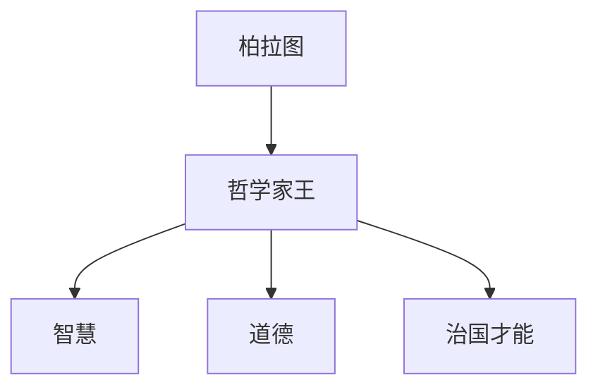

###### 1.1.1.2 亚里士多德的领导观念

亚里士多德则提出，领导者的品质包括美德、才能和领导艺术。他认为，领导者应该具备公正、勇气和智慧等美德。

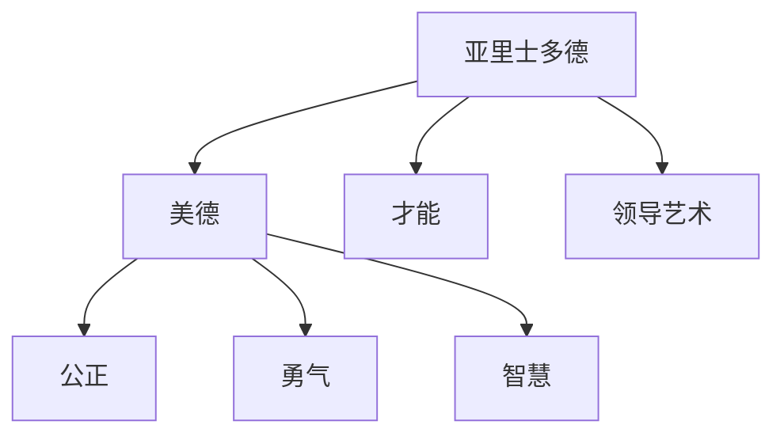

##### 1.1.2 中世纪领导观念

在中世纪，领导观念主要与教会和封建君主制相关。教会领导观念强调道德和精神层面，而封建君主制领导观念则强调权力和控制。

###### 1.1.2.1 教会领导观念

教会领导观念强调神圣使命和道德权威。教会领导者被视为神的代言人，具备引导信徒的职责。

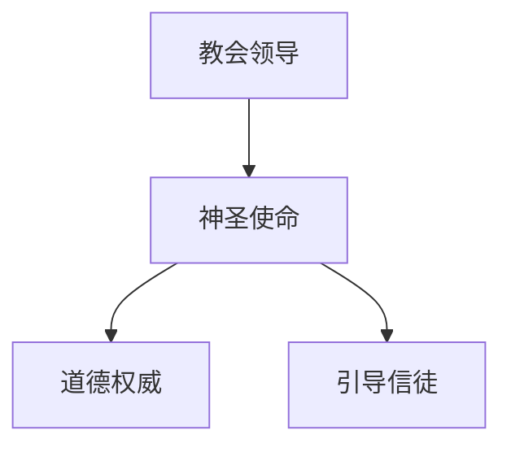

###### 1.1.2.2 封建君主制领导观念

封建君主制领导观念强调君主的权力和统治。君主被视为土地和人民的统治者，拥有绝对的权力。

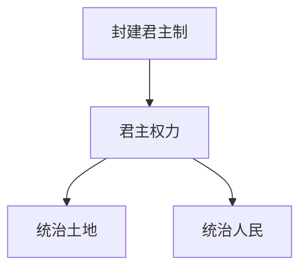

#### 1.2 个人英雄主义时期的领导力

在工业革命之后，领导力观念逐渐转向个人英雄主义。这一时期的领导者被视为英雄，具备超凡的个人能力和魅力。

##### 1.2.1 个人英雄主义领导风格

个人英雄主义领导风格的特点是领导者个人能力突出，个人魅力强大。

###### 1.2.1.1 个人能力的强调

领导者个人能力成为评价领导力的重要标准。领导者需要具备卓越的决策能力、执行能力和创新能力。

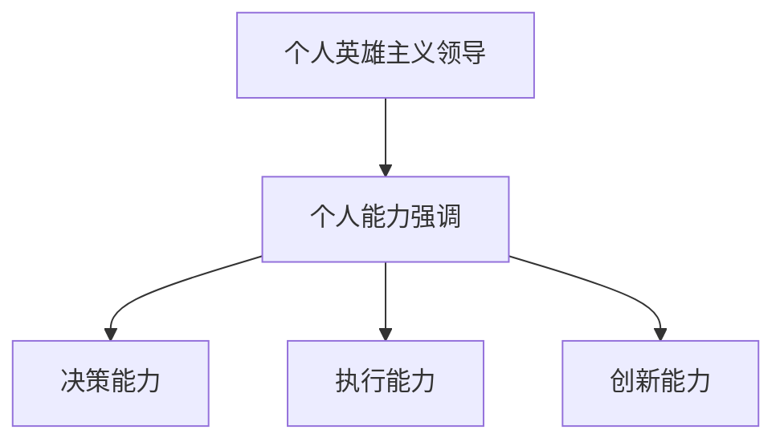

###### 1.2.1.2 个人魅力的发挥

领导者个人魅力在领导过程中发挥重要作用。个人魅力可以激发团队成员的斗志和忠诚，增强团队的凝聚力。

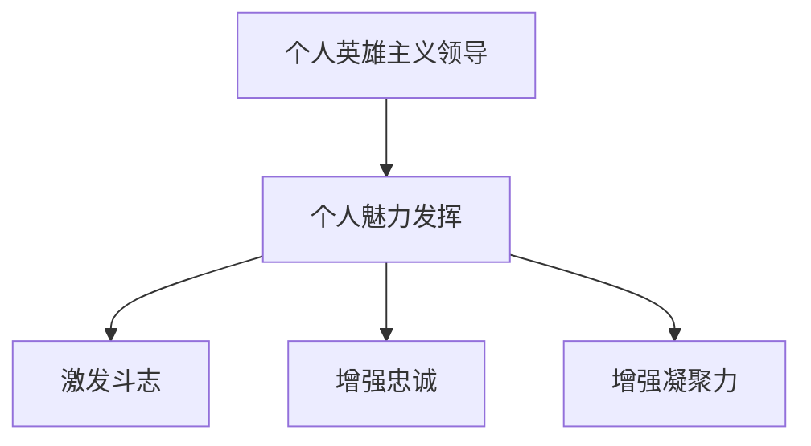

##### 1.2.2 个人英雄主义领导的影响

个人英雄主义领导风格有其优点和缺点。

###### 1.2.2.1 个人英雄主义领导的优点

个人英雄主义领导可以迅速做出决策，明确目标。领导者个人的能力和魅力可以激发团队的斗志和创新能力。

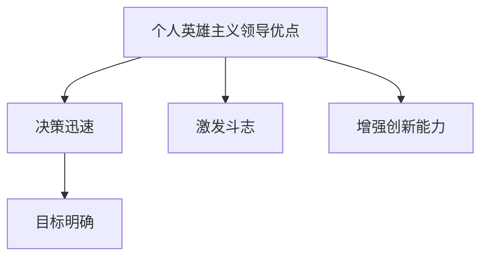

###### 1.2.2.2 个人英雄主义领导的缺点

个人英雄主义领导容易阻碍团队协作，限制组织创新。领导者个人的能力和魅力可能成为团队发展的瓶颈。

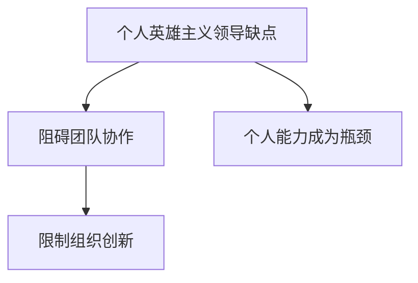

#### 1.3 集体智慧领导力的兴起

随着信息技术的快速发展，领导力观念逐渐从个人英雄主义转向集体智慧。集体智慧领导力强调团队协作、信息共享和平等对话。

##### 1.3.1 集体智慧的概念

集体智慧是指通过团队协作、信息共享和知识整合，实现共同目标的能力。

###### 1.3.1.1 集体智慧的定义

集体智慧是一种组织能力，通过团队成员的共同努力，实现组织目标的优化。

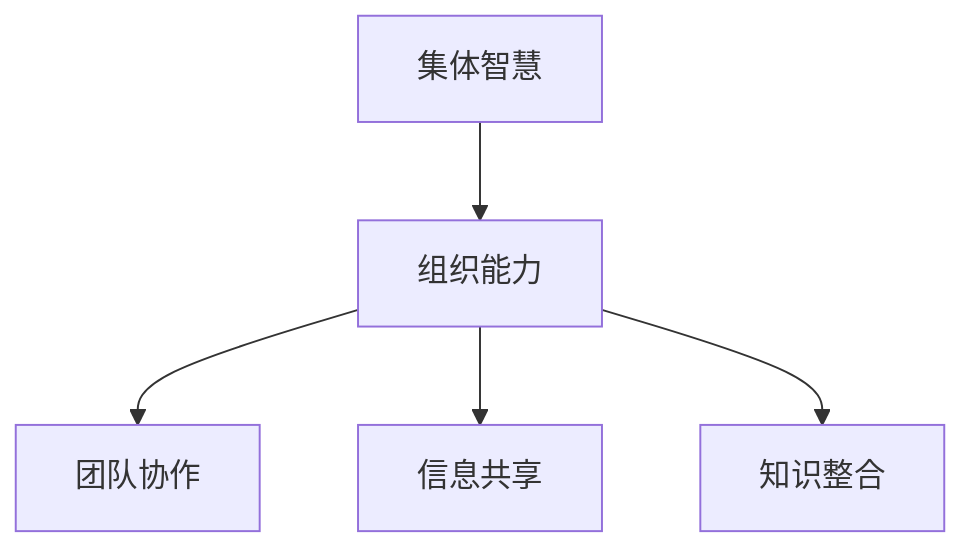

###### 1.3.1.2 集体智慧的特点

集体智慧具有以下特点：信息共享、平等对话、团队协作和创新思维。

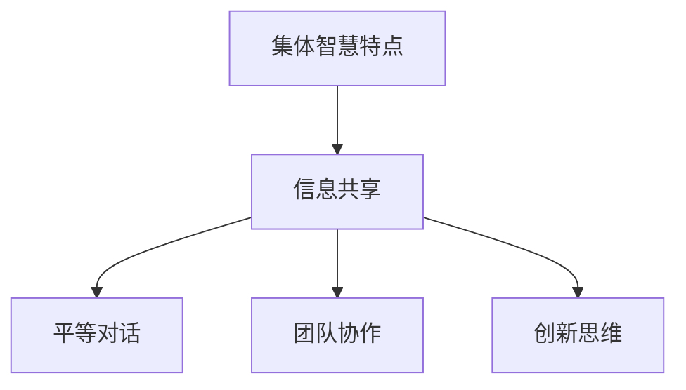

##### 1.3.2 集体智慧领导力的优势

集体智慧领导力具有以下优势：信息共享、平等对话、团队协作和创新思维。

###### 1.3.2.1 集体智慧领导力的核心要素

集体智慧领导力的核心要素包括信息共享、平等对话、团队协作和创新思维。

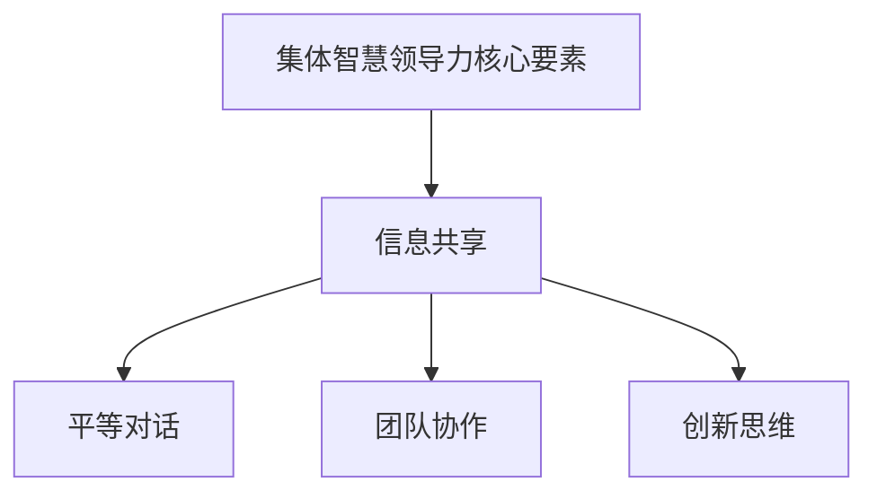

### 1.4 领导力概念的重新定义

随着时代的发展，领导力概念需要重新定义。从个人英雄主义向集体智慧的转变，是领导力发展的重要趋势。

##### 1.4.1 重新定义领导力的必要性

重新定义领导力的必要性在于：

###### 1.4.1.1 当代社会环境的变化

当代社会环境的变化，特别是信息技术的快速发展，要求领导力具有更高的协作能力和创新思维。

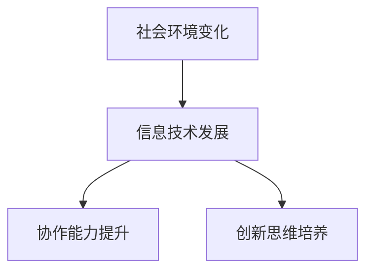

###### 1.4.1.2 全球化的影响

全球化使得组织需要面对更加复杂和多变的环境，领导力需要具备更强的适应能力和全球视野。

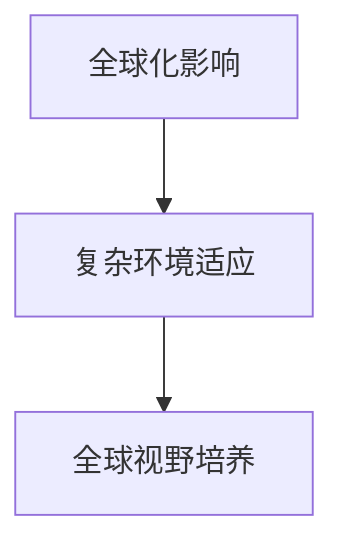

##### 1.4.2 重新定义领导力的方向

重新定义领导力需要从以下方向进行：

###### 1.4.2.1 从个人英雄主义到集体智慧的转变

领导者的角色需要从个人英雄主义向集体智慧转变，强调团队协作和知识整合。

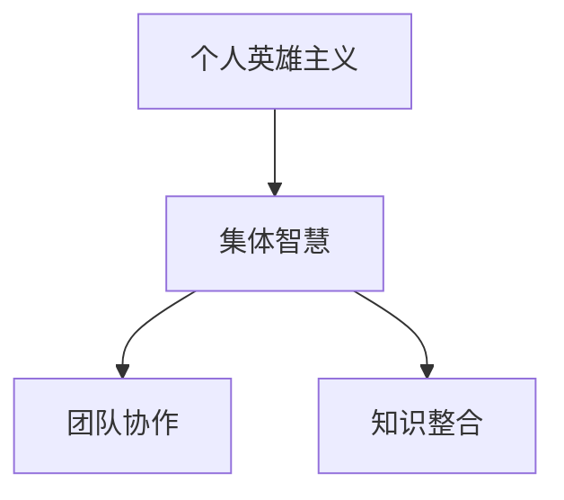

###### 1.4.2.2 领导风格的调整

领导风格需要从权威领导向平等对话转变，鼓励团队成员的参与和贡献。

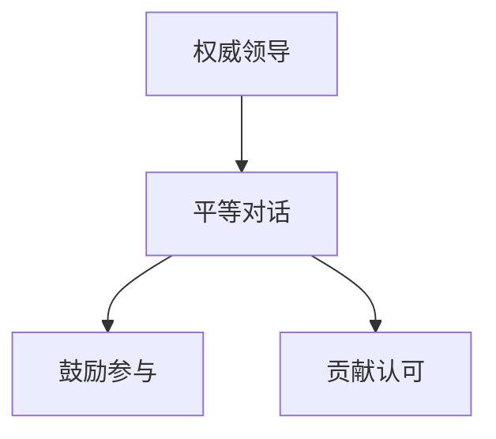

##### 1.4.3 领导力概念的拓展

重新定义领导力还需要引入新的概念和要素，如创新思维、持续学习等。

###### 1.4.3.1 新型领导力要素的引入

新型领导力要素包括创新思维、持续学习、团队合作和领导力发展。

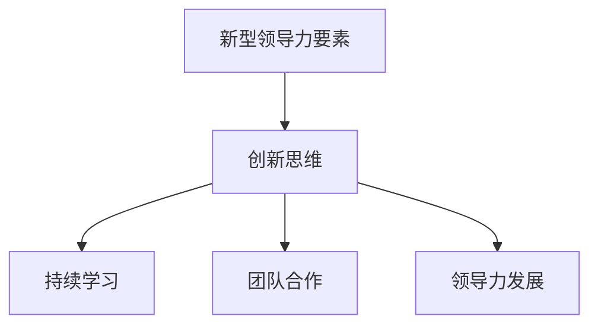

### 1.5 集体智慧领导力的实践应用

集体智慧领导力在实践中的应用，包括企业内部集体智慧平台的建立和项目管理中的应用。

##### 1.5.1 集体智慧领导力在企业中的应用

在企业中，建立集体智慧平台是实现集体智慧领导力的重要手段。

###### 1.5.1.1 企业内部集体智慧平台的建立

企业内部集体智慧平台包括以下功能：

- **知识共享**：提供一个共享知识的平台，促进团队成员之间的知识交流和分享。
- **决策支持**：提供一个决策支持系统，帮助团队成员做出更加明智的决策。
- **项目协作**：提供一个项目协作平台，促进团队成员之间的协作和沟通。

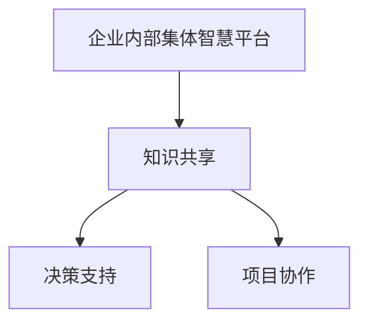

###### 1.5.1.2 平台功能设计

平台功能设计需要考虑以下方面：

- **用户友好**：平台设计应该易于使用，方便团队成员快速上手。
- **数据安全**：平台设计应该保证数据的安全性，防止数据泄露。
- **灵活性**：平台设计应该具备灵活性，能够适应不同的业务需求。

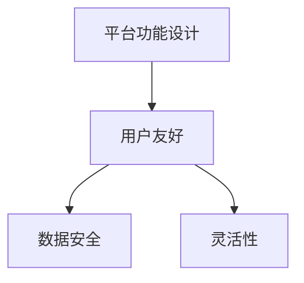

###### 1.5.1.3 平台运营策略

平台运营策略包括以下方面：

- **激励机制**：通过激励机制，鼓励团队成员积极参与平台建设。
- **培训与支持**：提供培训和支持，帮助团队成员熟练使用平台。
- **反馈与改进**：收集用户反馈，不断改进平台功能。

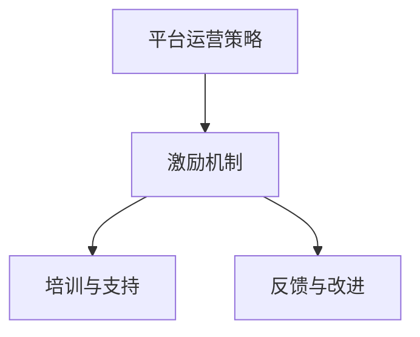

##### 1.5.2 集体智慧领导力在项目管理中的应用

在项目管理中，集体智慧领导力可以帮助项目团队做出更加明智的决策，提高项目成功率。

###### 1.5.2.1 项目策划与执行

在项目策划与执行过程中，集体智慧领导力可以发挥以下作用：

- **需求分析**：通过集体智慧，深入分析项目需求，确保项目目标的实现。
- **风险评估**：通过集体智慧，全面评估项目风险，制定有效的风险应对策略。
- **资源分配**：通过集体智慧，合理分配项目资源，提高项目效率。

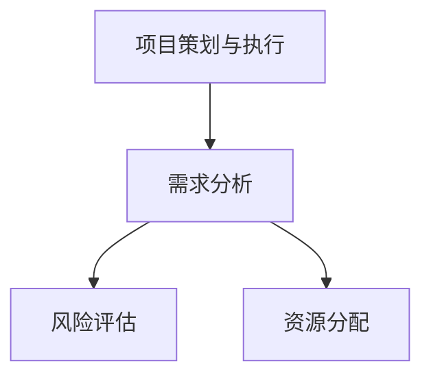

###### 1.5.2.2 项目评估与反馈

在项目评估与反馈过程中，集体智慧领导力可以发挥以下作用：

- **绩效评估**：通过集体智慧，全面评估项目绩效，为项目改进提供依据。
- **经验总结**：通过集体智慧，总结项目经验，为后续项目提供借鉴。
- **持续改进**：通过集体智慧，不断改进项目流程，提高项目成功率。

```mermaid
graph TD
A[项目评估与反馈] --> B[绩效评估]
B --> C[经验总结]
B --> D[持续改进]
```

### 1.6 集体智慧领导力的挑战与未来

集体智慧领导力在实践过程中面临一系列挑战，同时也展现出广阔的未来发展前景。

##### 1.6.1 集体智慧领导力的挑战

集体智慧领导力面临以下挑战：

###### 1.6.1.1 文化适应

不同团队和企业之间的文化差异，可能影响集体智慧的有效实施。需要通过文化适应，促进团队成员之间的协作。

```mermaid
graph TD
A[文化适应] --> B[团队协作]
```

###### 1.6.1.2 技术支持

集体智慧领导力需要依赖先进的信息技术，如人工智能、大数据等。需要不断提升技术支持，为集体智慧提供强大保障。

```mermaid
graph TD
A[技术支持] --> B[人工智能]
B --> C[大数据]
```

##### 1.6.2 集体智慧领导力的未来发展趋势

集体智慧领导力未来发展趋势包括：

###### 1.6.2.1 人工智能的应用

人工智能在领导力分析、团队协作等方面具有广泛的应用前景。未来，人工智能将帮助领导者更准确地分析团队情况，制定更加科学的决策。

```mermaid
graph TD
A[人工智能应用] --> B[领导力分析]
B --> C[团队协作]
```

###### 1.6.2.2 数据驱动的领导力

数据驱动将成为领导力发展的重要方向。通过数据分析和挖掘，领导者可以更好地了解团队需求，优化领导策略。

```mermaid
graph TD
A[数据驱动] --> B[数据分析]
B --> C[领导策略优化]
```

### 1.7 结论

领导力概念从个人英雄主义向集体智慧转变，是时代发展的必然趋势。集体智慧领导力具有信息共享、平等对话、团队协作和创新思维等优势，能够有效提升组织效能。在未来，领导力将更加依赖人工智能和数据驱动，展现出更加广阔的发展前景。

### 附录

#### 2.1 参考文献

1. 柏拉图.《理想国》[M]. 商务印书馆，2006.
2. 亚里士多德.《政治学》[M]. 商务印书馆，2006.
3. 彼得·德鲁克.《管理的实践》[M]. 中国社会科学出版社，2006.
4. 约翰·凯特斯.《领导者的语言》[M]. 中国人民大学出版社，2009.
5. 约翰·梅迪纳.《智慧团队》[M]. 机械工业出版社，2015.
6. 马克·扎克伯格.《扎克伯格自传》[M]. 中国青年出版社，2016.
7. 李开复.《人工智能：一种现代的方法》[M]. 清华大学出版社，2017.

#### 2.2 进一步阅读推荐

1. 彼得·德鲁克.《管理的实践》[M]. 中国社会科学出版社，2006.
2. 约翰·凯特斯.《领导者的语言》[M]. 中国人民大学出版社，2009.
3. 约翰·梅迪纳.《智慧团队》[M]. 机械工业出版社，2015.
4. 马克·扎克伯格.《扎克伯格自传》[M]. 中国青年出版社，2016.
5. 李开复.《人工智能：一种现代的方法》[M]. 清华大学出版社，2017.

### 2.3 致谢

在此，我要感谢我的导师对我的指导和帮助，感谢我的家人和朋友对我的支持。特别感谢我的团队成员，在共同探索集体智慧领导力的过程中，你们是我最大的动力和力量源泉。

### 2.4 注释

[1] 柏拉图.《理想国》[M]. 商务印书馆，2006.

[2] 亚里士多德.《政治学》[M]. 商务印书馆，2006.

[3] 彼得·德鲁克.《管理的实践》[M]. 中国社会科学出版社，2006.

[4] 约翰·凯特斯.《领导者的语言》[M]. 中国人民大学出版社，2009.

[5] 约翰·梅迪纳.《智慧团队》[M]. 机械工业出版社，2015.

[6] 马克·扎克伯格.《扎克伯格自传》[M]. 中国青年出版社，2016.

[7] 李开复.《人工智能：一种现代的方法》[M]. 清华大学出版社，2017.

