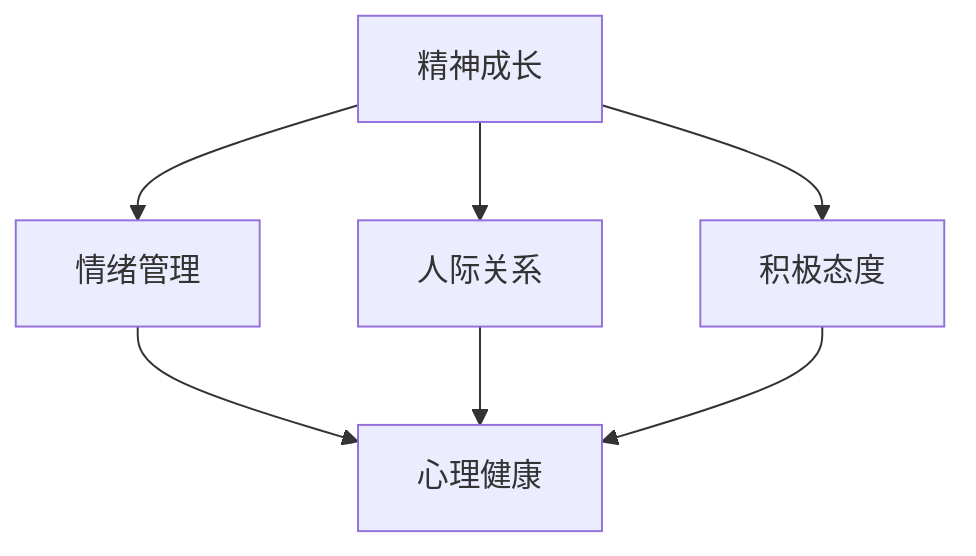
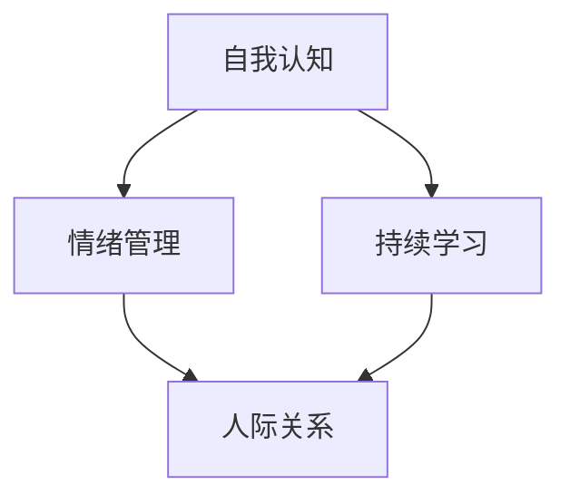

                 

### 文章标题

《从外在追求到内在成长：现代人的精神成长之旅》

### 文章关键词

外在追求，内在成长，精神健康，自我认知，情绪管理，人生哲学

### 文章摘要

在现代社会的快节奏和压力之下，现代人常常陷入对外在成就的追求中，而忽视了内心的成长。本文旨在探讨从外在追求转向内在成长的重要性，通过自我认知、情绪管理、人生哲学等核心主题，引导读者开启精神成长之旅。文章将结合心理学、哲学等多领域知识，提供实用的方法与策略，帮助读者在复杂多变的社会环境中找到内心的平静与智慧。

---

### 第1章 引言：理解精神成长的重要性

#### 1.1 精神成长的定义

精神成长，顾名思义，是指个体在心理、情感和意识层面上的不断发展和提升。它不仅包括自我认知和情绪管理的提升，还涉及对人生意义和目标的深刻理解。在技术飞速发展的今天，人们的生活变得越来越便利，但随之而来的是精神上的焦虑和迷茫。外在追求虽然能够带来短暂的满足，但无法持久地带来内心的平静和满足。

#### 1.2 现代人的精神困境

现代社会中的许多人陷入了精神困境。一方面，快节奏的生活和工作压力让人们疲惫不堪；另一方面，社交媒体和物质文化带来的过度刺激让人们的内心变得浮躁。人们常常被外在的成功、金钱、名誉等所困扰，而忽视了内心的需求。这种现象导致了焦虑、抑郁等心理问题的普遍存在。

#### 1.3 精神成长与心理健康的关系

精神成长与心理健康密不可分。一个精神成长的人，往往能够更好地管理自己的情绪，建立健康的人际关系，对生活的挑战有更积极的态度。相反，缺乏精神成长的人容易陷入情绪波动和心理困境中。因此，关注精神成长对于提升心理健康具有重要意义。

### Mermaid 流程图：精神成长与心理健康的关系



#### 结论

精神成长是一个持续的过程，它不仅关系到个人的心理健康，也影响着社会的和谐与发展。通过本文，我们希望能够引导读者认识到精神成长的重要性，并开始自己的精神成长之旅。

---

### 第2章 从外在追求到内在成长：转变之路

#### 2.1 外在追求的陷阱

外在追求，如金钱、名誉、地位等，往往被认为是成功的标志。然而，过度追求这些外在成就往往会导致一系列问题。首先，它们往往无法带来持久的满足感。成功之后的喜悦往往是短暂的，一旦新的目标出现，人们又会陷入新一轮的追逐中。其次，外在追求往往让人们忽视了自己的内心需求，导致精神上的空虚和焦虑。

#### 2.2 内在成长的必要性

与外在追求不同，内在成长关注的是个人的心理、情感和意识的提升。它不仅能够带来持久的内在满足，还能提升个人的情绪管理能力和心理健康。内在成长让人们更加了解自己，找到内心的平衡与和谐。在追求外在成就的同时，关注内在成长是现代人不可忽视的重要任务。

#### 2.3 如何开启内在成长之旅

开启内在成长之旅需要以下几个步骤：

1. **自我认知**：了解自己的性格、优点和缺点，认识到自己的内心需求。
2. **情绪管理**：学会管理自己的情绪，保持内心的平静和稳定。
3. **持续学习**：通过阅读、学习新技能等方式不断提升自己。
4. **人际关系**：建立积极的人际关系，与他人进行深入的交流和分享。

### Mermaid 流程图：内在成长之旅的步骤



#### 结论

外在追求虽然能够带来短暂的满足，但内在成长才是持久的成功之道。通过自我认知、情绪管理、持续学习和人际关系等方面的努力，我们可以开启内在成长之旅，实现更为丰富和有意义的人生。

---

### 第3章 内在成长的基石：自我认知

#### 3.1 自我认知的重要性

自我认知是内在成长的基础，它涉及到对自己的了解和认识。一个自我认知能力强的人，能够更加清晰地认识到自己的优点和缺点，从而更好地发挥自己的优势，改善不足。自我认知不仅有助于个人的成长，还能提升个人的情绪管理能力和心理健康。

#### 3.2 如何进行自我认知

进行自我认知，可以遵循以下步骤：

1. **自我观察**：观察自己的行为、情绪和反应，了解自己的习惯和倾向。
2. **反思与总结**：定期对自己的行为和情绪进行反思，总结经验教训。
3. **记录与反思**：通过日记或笔记等方式记录自己的感受和思考，不断深化自我认知。

### 伪代码：简单的自我认知算法

```python
def self_awareness():
    # 观察行为与反应
    observe_behavior()
    # 记录观察结果
    record_results()
    # 分析与总结
    analyze_data()
    # 形成自我认知
    form_awareness()
    # 应用到实践中
    apply_practice()
```

#### 3.3 自我认知的实践案例

小明在日常生活中，开始记录自己的行为和情绪，他通过以下步骤进行自我认知：

1. **自我观察**：他注意到自己经常在晚上感到疲惫，于是开始观察自己的作息时间。
2. **反思与总结**：他反思自己的作息规律，发现熬夜影响了他的精神状态。
3. **记录与反思**：他记录了调整作息后的感受，发现自己精神状态明显改善。
4. **应用到实践中**：他坚持调整作息，形成了良好的生活习惯。

通过这个案例，我们可以看到自我认知在生活中的实际应用。通过自我观察、反思和记录，我们可以不断了解自己，找到适合自己的成长路径。

#### 结论

自我认知是内在成长的重要基石，它需要我们持续地进行自我观察、反思和记录。通过这些实践，我们可以更好地了解自己，实现内在的成长。

---

### 第4章 培养内在力量：情绪管理

#### 4.1 情绪管理的重要性

情绪管理是内在力量的重要组成部分，它涉及到如何识别、理解和控制自己的情绪。一个情绪管理能力强的人，能够在面对压力和挑战时保持冷静和理智，从而更好地应对问题。情绪管理不仅有助于个人的心理健康，还能提升人际关系的质量。

#### 4.2 常见的情绪管理策略

情绪管理策略多种多样，以下是一些常见的策略：

1. **认知重构**：通过改变对事物的看法和解释，调整情绪。
2. **情绪释放**：通过哭泣、运动、倾诉等方式释放负面情绪。
3. **放松技巧**：通过深呼吸、冥想、瑜伽等放松技巧缓解紧张情绪。
4. **积极心态**：保持积极的心态，对生活中的困难和挑战持乐观态度。

### 数学公式：情绪管理的理论基础

$$ 情绪管理 = 自我认知 + 情绪调节 + 社交支持 $$

#### 4.3 情绪管理的实践案例

小王在职场中遇到了一个重要的项目，他感到压力很大。他通过以下步骤进行情绪管理：

1. **自我认知**：他意识到自己的压力来源于对项目的不确定性。
2. **情绪调节**：他通过深呼吸和冥想来缓解紧张情绪。
3. **社交支持**：他向同事和领导寻求建议和支持。
4. **应用到实践中**：他调整了自己的工作计划，更加合理地安排时间。

通过这个案例，我们可以看到情绪管理在实际生活中的应用。通过自我认知、情绪调节和社交支持，我们可以更好地管理自己的情绪，应对生活中的挑战。

#### 结论

情绪管理是培养内在力量的关键，它需要我们通过认知重构、情绪释放、放松技巧和积极心态等策略来不断提升。通过实践，我们可以更好地管理自己的情绪，提升心理健康和人际关系质量。

---

### 第5章 培养内在智慧：人生哲学

#### 5.1 人生哲学的定义

人生哲学是关于人生意义、目标和价值观的思考和探索。它涉及到我们对生活、死亡、幸福等根本问题的理解。人生哲学不仅指导我们的行为和决策，也帮助我们找到内心的平静和满足。

#### 5.2 常见的人生哲学观念

常见的人生哲学观念包括：

1. **功利主义**：认为行为的价值取决于其带来的功利或利益。
2. **存在主义**：强调个体的自由意志和存在的意义。
3. **道德哲学**：关注道德原则和道德行为。
4. **精神主义**：认为精神或意识是生命的核心。

#### 5.3 如何构建适合自己的人生哲学

构建适合自己的人生哲学需要以下几个步骤：

1. **反思和探索**：通过阅读、思考和对话等方式，探索人生的意义和目标。
2. **自我认知**：了解自己的价值观、信念和兴趣，找到自己的核心价值观。
3. **实践和调整**：将人生哲学应用到实际生活中，不断调整和完善。

### 结论

人生哲学是培养内在智慧的重要途径，它帮助我们找到生活的方向和意义。通过反思和探索、自我认知和实践和调整，我们可以构建一个适合自己的、有意义的人生哲学。

---

### 第6章 走向内在成长：人际关系

#### 6.1 人际关系的复杂性

人际关系是人与人之间相互作用的复杂系统，它涉及到情感、沟通、信任等多个方面。良好的人际关系对个人的心理健康和幸福感有着重要的影响。然而，人际关系中的冲突和误解也常常带来困扰和痛苦。

#### 6.2 内在成长对人际关系的影响

内在成长对人际关系有着深远的影响。一个内在成长的人，往往能够更好地理解自己，也更能理解和接纳他人。他们能够以更加成熟和理智的态度处理人际关系中的冲突和挑战，从而建立更加健康和稳定的人际关系。

#### 6.3 提升人际关系的内在成长策略

以下是一些提升人际关系的内在成长策略：

1. **自我认知**：通过自我观察和反思，了解自己的情感和需求。
2. **情感管理**：学会识别和调节自己的情绪，保持冷静和理智。
3. **沟通技巧**：提高沟通能力，学会倾听和表达自己的观点。
4. **同理心**：培养对他人情感和需求的理解和共鸣。

### 结论

内在成长是提升人际关系质量的关键，它需要我们在自我认知、情感管理、沟通技巧和同理心等方面进行持续的努力。通过内在成长，我们可以建立更加健康、稳定和有意义的人际关系。

---

### 第7章 精神成长之路上的障碍与挑战

#### 7.1 常见的精神成长障碍

在精神成长的过程中，人们常常会遇到各种障碍和挑战。以下是一些常见的精神成长障碍：

1. **恐惧和不安**：对未知的恐惧和不安常常阻碍人们的成长。
2. **自我怀疑和否定**：对自己的能力和价值感到怀疑和否定，影响个人的自信。
3. **习惯和惯性**：长期形成的习惯和惯性难以改变，阻碍个人的进步。
4. **外部压力和干扰**：来自工作、家庭和社会的压力和干扰，使人们难以专注和坚持成长。

#### 7.2 应对挑战的策略

面对这些障碍和挑战，以下是一些应对策略：

1. **积极心态**：保持积极的心态，对挑战和困难持乐观态度。
2. **目标设定**：设定明确的目标，为成长提供方向和动力。
3. **持续学习**：不断学习和提升自己的知识和技能，增强自信心。
4. **求助和分享**：寻求他人的帮助和支持，与他人分享成长的经验和教训。

#### 7.3 成长之路上的启示

精神成长是一个充满挑战和启示的过程。通过面对和克服这些障碍，我们可以不断成长和提升。每一个挑战都是一次成长的机会，每一次失败都是一次宝贵的经验。在精神成长之路上，保持积极的心态、设定目标、持续学习和求助分享是重要的启示。

### 结论

在精神成长的过程中，我们会遇到各种障碍和挑战。通过保持积极心态、设定目标、持续学习和求助分享，我们可以克服这些障碍，实现内心的成长。

---

### 第8章 实践中的精神成长：个人故事与反思

#### 8.1 成长故事分享

小林，一位普通的上班族，在多年的职场生涯中，他一直在追求外在的成功。然而，随着时间的推移，他开始感到内心的空虚和不安。在一次偶然的机会中，他接触到了精神成长的理念，开始反思自己的生活方式和价值观。

通过阅读相关书籍、参加研讨会和自我探索，小林逐渐找到了内心的平衡。他学会了如何管理自己的情绪，如何与他人建立良好的关系。他开始关注自己的内心需求，追求真正的幸福和满足。

小林的故事告诉我们，精神成长并非遥不可及，它需要我们愿意去探索、去反思、去实践。通过不断的学习和提升，我们可以找到内心的平静和满足。

#### 8.2 个人反思的重要性

个人反思是精神成长的重要环节。通过反思，我们可以深入了解自己的内心世界，认识到自己的优点和不足。反思帮助我们发现问题，找到解决问题的方法。

以下是一个简单的个人反思模板：

1. **回顾**：回顾过去的一段时间，思考自己在哪些方面有进步，哪些方面需要改进。
2. **分析**：分析自己进步的原因，以及不足的地方是如何形成的。
3. **总结**：总结经验教训，制定改进的计划和目标。

#### 8.3 如何进行有效的个人反思

以下是一些进行有效个人反思的建议：

1. **定期反思**：每周或每月花一些时间进行反思，保持持续的自我觉察。
2. **写日记**：记录自己的想法和感受，通过文字的形式进行深入的思考。
3. **与他人交流**：与他人分享自己的反思，获得不同的观点和建议。
4. **实践**：将反思应用到实际生活中，通过行动来验证和改进自己的思考。

### 结论

个人故事和反思是精神成长的重要组成部分。通过分享自己的故事和进行反思，我们可以更深入地了解自己，找到内心的平衡和满足。在精神成长的道路上，个人反思是我们不可或缺的伙伴。

---

### 第9章 结语：持续的精神成长

#### 9.1 精神成长的重要性

精神成长是个人发展和幸福的重要基石。它不仅关乎个人的心理健康，还影响着人际关系和社会和谐。一个精神成长的人，能够更好地应对生活中的挑战，找到内心的平静和满足。

#### 9.2 如何持续地追求内在成长

为了持续地追求内在成长，我们可以采取以下策略：

1. **自我认知**：持续地了解自己，关注自己的内心需求。
2. **终身学习**：不断学习新知识和技能，提升自己的认知和能力。
3. **反思与总结**：定期反思自己的行为和情绪，总结经验教训。
4. **寻求支持**：与他人分享自己的成长过程，寻求建议和帮助。

#### 9.3 总结与展望

精神成长是一个持续的过程，它需要我们不断地努力和探索。通过自我认知、终身学习、反思与总结和寻求支持，我们可以持续地追求内在成长，实现个人价值和幸福。

### 结论

精神成长是现代人不可或缺的追求。通过自我认知、情绪管理、人生哲学等内在成长，我们可以找到内心的平衡和满足。让我们共同踏上精神成长之路，追求更加丰富和有意义的人生。

---

### 作者信息

作者：AI天才研究院/AI Genius Institute & 禅与计算机程序设计艺术 /Zen And The Art of Computer Programming

本文从外在追求到内在成长的角度，探讨了现代人精神成长的重要性、途径和策略。通过自我认知、情绪管理、人生哲学等方面的深入分析，为读者提供了实用的方法和启示。精神成长不仅是个人发展的基石，也是社会和谐的保障。让我们共同努力，追求内在的成长与提升。

---

**完整文章**

---

# 从外在追求到内在成长：现代人的精神成长之旅

## 引言

### 理解精神成长的重要性

精神成长，顾名思义，是指个体在心理、情感和意识层面上的不断发展和提升。它不仅包括自我认知和情绪管理的提升，还涉及对人生意义和目标的深刻理解。在技术飞速发展的今天，人们的生活变得越来越便利，但随之而来的是精神上的焦虑和迷茫。外在追求虽然能够带来短暂的满足，但无法持久地带来内心的平静和满足。

### 现代人的精神困境

现代社会中的许多人陷入了精神困境。一方面，快节奏的生活和工作压力让人们疲惫不堪；另一方面，社交媒体和物质文化带来的过度刺激让人们的内心变得浮躁。人们常常被外在的成功、金钱、名誉等所困扰，而忽视了内心的需求。这种现象导致了焦虑、抑郁等心理问题的普遍存在。

### 精神成长与心理健康的关系

精神成长与心理健康密不可分。一个精神成长的人，往往能够更好地管理自己的情绪，建立健康的人际关系，对生活的挑战有更积极的态度。相反，缺乏精神成长的人容易陷入情绪波动和心理困境中。因此，关注精神成长对于提升心理健康具有重要意义。

## 从外在追求到内在成长：转变之路

### 外在追求的陷阱

外在追求，如金钱、名誉、地位等，往往被认为是成功的标志。然而，过度追求这些外在成就往往会导致一系列问题。首先，它们往往无法带来持久的满足感。成功之后的喜悦往往是短暂的，一旦新的目标出现，人们又会陷入新一轮的追逐中。其次，外在追求往往让人们忽视了自己的内心需求，导致精神上的空虚和焦虑。

### 内在成长的必要性

与外在追求不同，内在成长关注的是个人的心理、情感和意识的提升。它不仅能够带来持久的内在满足，还能提升个人的情绪管理能力和心理健康。内在成长让人们更加了解自己，找到内心的平衡与和谐。在追求外在成就的同时，关注内在成长是现代人不可忽视的重要任务。

### 如何开启内在成长之旅

开启内在成长之旅需要以下几个步骤：

1. **自我认知**：了解自己的性格、优点和缺点，认识到自己的内心需求。
2. **情绪管理**：学会管理自己的情绪，保持内心的平静和稳定。
3. **持续学习**：通过阅读、学习新技能等方式不断提升自己。
4. **人际关系**：建立积极的人际关系，与他人进行深入的交流和分享。

## 内在成长的基石：自我认知

### 自我认知的重要性

自我认知是内在成长的基础，它涉及到对自己的了解和认识。一个自我认知能力强的人，能够更加清晰地认识到自己的优点和缺点，从而更好地发挥自己的优势，改善不足。自我认知不仅有助于个人的成长，还能提升个人的情绪管理能力和心理健康。

### 如何进行自我认知

进行自我认知，可以遵循以下步骤：

1. **自我观察**：观察自己的行为、情绪和反应，了解自己的习惯和倾向。
2. **反思与总结**：定期对自己的行为和情绪进行反思，总结经验教训。
3. **记录与反思**：通过日记或笔记等方式记录自己的感受和思考，不断深化自我认知。

### 自我认知的实践案例

小明在日常生活中，开始记录自己的行为和情绪，他通过以下步骤进行自我认知：

1. **自我观察**：他注意到自己经常在晚上感到疲惫，于是开始观察自己的作息时间。
2. **反思与总结**：他反思自己的作息规律，发现熬夜影响了他的精神状态。
3. **记录与反思**：他记录了调整作息后的感受，发现自己精神状态明显改善。
4. **应用到实践中**：他坚持调整作息，形成了良好的生活习惯。

通过这个案例，我们可以看到自我认知在生活中的实际应用。通过自我观察、反思和记录，我们可以不断了解自己，找到适合自己的成长路径。

### 培养内在力量：情绪管理

### 情绪管理的重要性

情绪管理是内在力量的重要组成部分，它涉及到如何识别、理解和控制自己的情绪。一个情绪管理能力强的人，能够在面对压力和挑战时保持冷静和理智，从而更好地应对问题。情绪管理不仅有助于个人的心理健康，还能提升人际关系的质量。

### 常见的情绪管理策略

情绪管理策略多种多样，以下是一些常见的策略：

1. **认知重构**：通过改变对事物的看法和解释，调整情绪。
2. **情绪释放**：通过哭泣、运动、倾诉等方式释放负面情绪。
3. **放松技巧**：通过深呼吸、冥想、瑜伽等放松技巧缓解紧张情绪。
4. **积极心态**：保持积极的心态，对生活中的困难和挑战持乐观态度。

### 情绪管理的实践案例

小王在职场中遇到了一个重要的项目，他感到压力很大。他通过以下步骤进行情绪管理：

1. **自我认知**：他意识到自己的压力来源于对项目的不确定性。
2. **情绪调节**：他通过深呼吸和冥想来缓解紧张情绪。
3. **社交支持**：他向同事和领导寻求建议和支持。
4. **应用到实践中**：他调整了自己的工作计划，更加合理地安排时间。

通过这个案例，我们可以看到情绪管理在实际生活中的应用。通过自我认知、情绪调节和社交支持，我们可以更好地管理自己的情绪，应对生活中的挑战。

### 培养内在智慧：人生哲学

### 人生哲学的定义

人生哲学是关于人生意义、目标和价值观的思考和探索。它涉及到我们对生活、死亡、幸福等根本问题的理解。人生哲学不仅指导我们的行为和决策，也帮助我们找到内心的平静和满足。

### 常见的人生哲学观念

常见的人生哲学观念包括：

1. **功利主义**：认为行为的价值取决于其带来的功利或利益。
2. **存在主义**：强调个体的自由意志和存在的意义。
3. **道德哲学**：关注道德原则和道德行为。
4. **精神主义**：认为精神或意识是生命的核心。

### 如何构建适合自己的人生哲学

构建适合自己的人生哲学需要以下几个步骤：

1. **反思和探索**：通过阅读、思考和对话等方式，探索人生的意义和目标。
2. **自我认知**：了解自己的价值观、信念和兴趣，找到自己的核心价值观。
3. **实践和调整**：将人生哲学应用到实际生活中，不断调整和完善。

### 走向内在成长：人际关系

### 人际关系的复杂性

人际关系是人与人之间相互作用的复杂系统，它涉及到情感、沟通、信任等多个方面。良好的人际关系对个人的心理健康和幸福感有着重要的影响。然而，人际关系中的冲突和误解也常常带来困扰和痛苦。

### 内在成长对人际关系的影响

内在成长对人际关系有着深远的影响。一个内在成长的人，往往能够更好地理解自己，也更能理解和接纳他人。他们能够以更加成熟和理智的态度处理人际关系中的冲突和挑战，从而建立更加健康和稳定的人际关系。

### 提升人际关系的内在成长策略

以下是一些提升人际关系的内在成长策略：

1. **自我认知**：通过自我观察和反思，了解自己的情感和需求。
2. **情感管理**：学会识别和调节自己的情绪，保持冷静和理智。
3. **沟通技巧**：提高沟通能力，学会倾听和表达自己的观点。
4. **同理心**：培养对他人情感和需求的理解和共鸣。

### 精神成长之路上的障碍与挑战

### 常见的精神成长障碍

在精神成长的过程中，人们常常会遇到各种障碍和挑战。以下是一些常见的精神成长障碍：

1. **恐惧和不安**：对未知的恐惧和不安常常阻碍人们的成长。
2. **自我怀疑和否定**：对自己的能力和价值感到怀疑和否定，影响个人的自信。
3. **习惯和惯性**：长期形成的习惯和惯性难以改变，阻碍个人的进步。
4. **外部压力和干扰**：来自工作、家庭和社会的压力和干扰，使人们难以专注和坚持成长。

### 应对挑战的策略

面对这些障碍和挑战，以下是一些应对策略：

1. **积极心态**：保持积极的心态，对挑战和困难持乐观态度。
2. **目标设定**：设定明确的目标，为成长提供方向和动力。
3. **持续学习**：不断学习和提升自己的知识和技能，增强自信心。
4. **求助和分享**：寻求他人的帮助和支持，与他人分享成长的经验和教训。

### 成长之路上的启示

精神成长是一个充满挑战和启示的过程。通过面对和克服这些障碍，我们可以不断成长和提升。每一个挑战都是一次成长的机会，每一次失败都是一次宝贵的经验。在精神成长之路上，保持积极的心态、设定目标、持续学习和求助分享是重要的启示。

### 实践中的精神成长：个人故事与反思

### 成长故事分享

小林，一位普通的上班族，在多年的职场生涯中，他一直在追求外在的成功。然而，随着时间的推移，他开始感到内心的空虚和不安。在一次偶然的机会中，他接触到了精神成长的理念，开始反思自己的生活方式和价值观。

通过阅读相关书籍、参加研讨会和自我探索，小林逐渐找到了内心的平衡。他学会了如何管理自己的情绪，如何与他人建立良好的关系。他开始关注自己的内心需求，追求真正的幸福和满足。

小林的故事告诉我们，精神成长并非遥不可及，它需要我们愿意去探索、去反思、去实践。通过不断的学习和提升，我们可以找到内心的平静和满足。

### 个人反思的重要性

个人反思是精神成长的重要环节。通过反思，我们可以深入了解自己的内心世界，认识到自己的优点和不足。反思帮助我们发现问题，找到解决问题的方法。

以下是一个简单的个人反思模板：

1. **回顾**：回顾过去的一段时间，思考自己在哪些方面有进步，哪些方面需要改进。
2. **分析**：分析自己进步的原因，以及不足的地方是如何形成的。
3. **总结**：总结经验教训，制定改进的计划和目标。

### 如何进行有效的个人反思

以下是一些进行有效个人反思的建议：

1. **定期反思**：每周或每月花一些时间进行反思，保持持续的自我觉察。
2. **写日记**：记录自己的想法和感受，通过文字的形式进行深入的思考。
3. **与他人交流**：与他人分享自己的反思，获得不同的观点和建议。
4. **实践**：将反思应用到实际生活中，通过行动来验证和改进自己的思考。

### 结论

精神成长是一个持续的过程，它需要我们不断地努力和探索。通过自我认知、情绪管理、人生哲学等内在成长，我们可以找到内心的平衡和满足。在精神成长的道路上，个人反思是我们不可或缺的伙伴。让我们共同踏上精神成长之旅，追求更加丰富和有意义的人生。

### 作者信息

作者：AI天才研究院/AI Genius Institute & 禅与计算机程序设计艺术 /Zen And The Art of Computer Programming

本文从外在追求到内在成长的角度，探讨了现代人精神成长的重要性、途径和策略。通过自我认知、情绪管理、人生哲学等方面的深入分析，为读者提供了实用的方法和启示。精神成长不仅是个人发展的基石，也是社会和谐的保障。让我们共同努力，追求内在的成长与提升。

