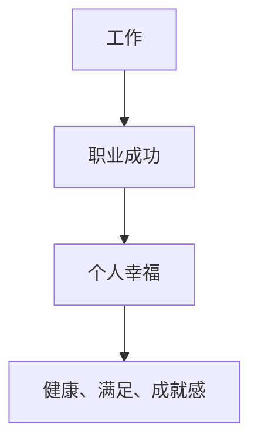
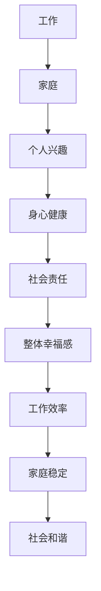
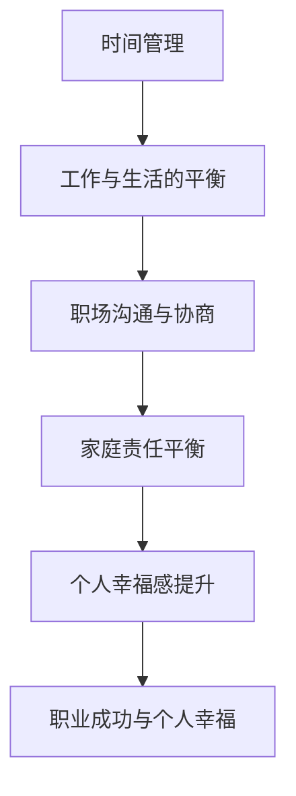
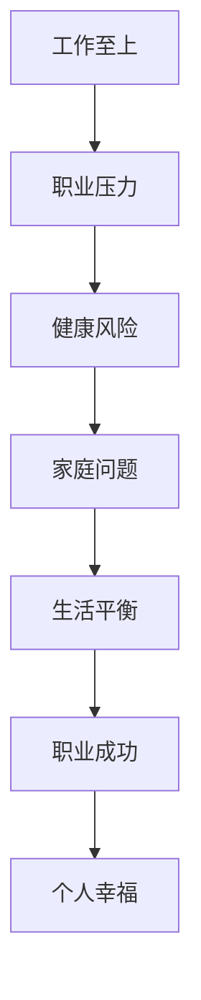

                 


## 文章标题
《从工作至上到生活平衡：重新定义职业成功与个人幸福》

## 关键词
职业成功、个人幸福、生活平衡、工作压力、时间管理、心理健康

## 摘要
本文旨在探讨在快节奏的现代社会中，如何从工作至上的文化观念转向追求工作与生活的平衡，重新定义职业成功和个人幸福。通过对工作至上的历史背景、生活平衡的理论基础、实现生活平衡的策略、个人幸福感的提升以及成功案例分析的研究，文章提供了一系列实用的方法和建议，帮助读者在实践中找到适合自己的平衡点。

## 目录大纲

### 第1章 引言
- 1.1 职场现状分析
- 1.2 工作与生活的平衡意义
- 1.3 如何定义职业成功与个人幸福

### 第2章 工作至上的文化
- 2.1 工作至上的历史背景
- 2.2 工作至上的优缺点
- 2.3 工作至上文化下的职业压力

### 第3章 生活平衡的理论基础
- 3.1 生活平衡的定义
- 3.2 生活平衡的重要性
- 3.3 生活平衡的理论框架

### 第4章 重新定义职业成功
- 4.1 职业成功的传统定义
- 4.2 职业成功的现代定义
- 4.3 个人价值观与职业成功的关联

### 第5章 实现生活平衡的策略
- 5.1 个人时间管理
- 5.2 职场沟通与协商
- 5.3 工作与家庭责任的平衡

### 第6章 个人幸福感的提升
- 6.1 幸福感的定义与测量
- 6.2 幸福感的来源
- 6.3 提升个人幸福感的实践方法

### 第7章 案例研究
- 7.1 案例一：从工作狂到幸福人生
- 7.2 案例二：职场妈妈的生活平衡
- 7.3 案例三：创业者的成功与幸福

### 第8章 结论
- 8.1 生活平衡的重要性
- 8.2 重新定义职业成功的意义
- 8.3 对未来职场与生活的展望

## 第1章 引言

### 1.1 职场现状分析

在当今社会，职场压力日益增加，工作至上的观念根深蒂固。根据国际劳动组织（ILO）的数据，全球近60%的员工每天工作超过8小时，而超过20%的员工每天工作超过10小时。这种高强度的工作模式使得许多人陷入了工作至上的文化，他们把工作视为生活的全部，甚至牺牲了健康和家庭。

然而，这种工作至上的观念并不总是带来预期的结果。一项由哈佛大学心理学教授Sheldon Solomon主持的研究发现，工作至上的个体往往缺乏生活的目标感，更容易感到孤独和抑郁。此外，长时间的工作还会导致身体健康问题，如心血管疾病、抑郁症和焦虑症等。

### 1.2 工作与生活的平衡意义

工作与生活的平衡不仅仅是减少工作压力，更是实现个人全面发展的重要途径。世界卫生组织（WHO）将健康定义为“身体、心理和社会适应的完好状态，而不仅仅是疾病和虚弱的状态”。这意味着，一个人的健康不仅仅取决于身体的健康，还包括心理健康和社会关系。

研究表明，工作与生活平衡的个体往往拥有更高的幸福感和成就感。根据盖洛普公司的一项调查，生活在工作与生活平衡的个体比那些工作压力大的个体更幸福，更有可能拥有良好的健康状况和社会关系。

### 1.3 如何定义职业成功与个人幸福

职业成功和个人幸福是两个复杂的概念，但它们之间存在紧密的联系。传统的职业成功往往被定义为财富、地位和晋升速度，但现代的观点认为，职业成功应该包括工作满意度、个人成长和职业成就感。

个人幸福则包括情感满足、健康、人际关系和社会参与等多个方面。根据心理学家马丁·塞利格曼提出的“幸福公式”，幸福感等于积极体验减去消极体验，再乘以一个人的优势和美德。

为了更好地理解这些概念，我们可以使用Mermaid流程图来展示工作、职业成功和个人幸福之间的关系：



通过这个流程图，我们可以看到，工作不仅是实现职业成功和个人幸福的基础，也是维护健康和满足感的重要途径。

在接下来的章节中，我们将深入探讨工作至上的文化、生活平衡的理论基础、实现生活平衡的策略以及个人幸福感的提升方法。通过这些探讨，我们希望能够帮助读者找到适合自己的平衡点，重新定义职业成功与个人幸福。

### 第2章 工作至上的文化

#### 2.1 工作至上的历史背景

工作至上的观念并非现代社会的特有现象，它在人类历史上有着悠久的渊源。早在古代，许多文明就强调工作的价值和重要性。例如，在古希腊，苏格拉底和柏拉图都提倡通过工作来实现个人的道德提升和自我实现。在中世纪，欧洲的宗教神权社会也强调劳动的神圣性，认为工作是上帝赋予人类的职责。

进入工业革命时期，工作至上的观念得到了进一步的强化。随着工厂制度和现代企业的兴起，工作成为人们生活的主要组成部分，工作时间和工作强度显著增加。在这个时期，工作和个人成就往往被紧密地联系在一起，人们通过工作来获得社会地位和经济收入。

在现代社会，工作至上的观念依然根深蒂固。许多职场文化强调加班、高效率和长时间工作，这些观念在某种程度上被广泛接受和推崇。这种文化背景下的职场环境，使得工作成为许多人的主要生活重心，甚至牺牲了健康和家庭。

#### 2.2 工作至上的优缺点

工作至上的观念在现代社会中既有其优点，也存在一些潜在的缺点。

**优点：**

1. **推动经济发展：** 工作至上的文化能够激发人们的创造力和竞争力，推动技术进步和经济发展。
2. **个人成就感：** 通过努力工作，人们可以获得成就感和自豪感，提高自我价值感。
3. **提高工作效率：** 工作至上的文化往往强调高效率和结果导向，这有助于提升工作质量和效率。

**缺点：**

1. **健康风险：** 长时间的工作和高强度的工作压力可能导致健康问题，如心脏病、抑郁症和焦虑症等。
2. **心理健康问题：** 工作至上的文化可能导致人们忽视心理健康，感到孤独和压抑。
3. **家庭和社会关系受损：** 过度关注工作可能影响家庭和社交关系，导致家庭矛盾和社会隔阂。

#### 2.3 工作至上文化下的职业压力

工作至上文化下的职业压力是一个普遍存在的问题。根据世界卫生组织的报告，全球约有三分之一的工作人口经历不同程度的职业压力。这种压力不仅影响个人的身心健康，也会对企业的绩效和团队协作产生负面影响。

职业压力的来源多种多样，主要包括以下几个方面：

1. **工作时间长：** 长时间的工作和高强度的工作节奏是职业压力的主要来源之一。
2. **工作不安全感：** 现代职场中，许多员工面临失业风险，这增加了他们的工作压力。
3. **工作负荷重：** 过度的工作任务和较高的工作标准可能导致员工感到力不从心，增加压力。
4. **工作与生活冲突：** 工作至上的文化往往导致工作与生活的冲突，使得员工难以平衡工作和个人生活。

为了应对职业压力，许多企业和个人开始探索工作与生活的平衡策略。例如，一些企业推出了弹性工作时间、远程工作和家庭友好政策，以减轻员工的工作压力。同时，员工也开始学习时间管理和压力管理技巧，以更好地平衡工作和生活。

在下一章中，我们将探讨生活平衡的理论基础，理解什么是生活平衡以及它对个人和社会的意义。

### 第3章 生活平衡的理论基础

#### 3.1 生活平衡的定义

生活平衡是指一个人在工作、家庭、个人兴趣和社会责任之间实现合理的分配和协调，以达到整体幸福感最大化。这种平衡不仅仅是一种状态，更是一种持续的过程，需要个体在不同的生活阶段和环境中不断调整和适应。

在学术领域，生活平衡被定义为一种动态的、多维度的平衡状态。它涵盖了以下几个方面：

1. **工作与家庭：** 工作与家庭之间的平衡是生活平衡的核心。这包括合理安排工作时间，确保有足够的时间陪伴家人，参与家庭活动和分担家庭责任。
2. **个人兴趣与爱好：** 追求个人兴趣和爱好也是生活平衡的重要组成部分。它能够提升个人的幸福感和满足感，增强生活的丰富性和多样性。
3. **身心健康：** 保持身心健康是实现生活平衡的基础。这包括良好的饮食、适量的运动和充足的休息，以及积极应对压力和挑战。
4. **社会责任：** 社会责任感和参与社会活动也是生活平衡的重要方面。通过参与社区服务、志愿活动和公益活动，个体能够获得满足感和成就感。

#### 3.2 生活平衡的重要性

生活平衡对于个人和社会都具有重要的意义。对个人而言，生活平衡能够提升整体幸福感，减少压力和焦虑，促进身心健康。根据世界卫生组织的研究，生活在平衡状态下的个体往往具有更高的心理健康水平和生活满意度。

对社会的意义则体现在以下几个方面：

1. **提高工作效率：** 生活平衡能够减少工作压力，提高员工的工作效率和创造力。研究表明，工作与生活平衡的员工往往更有动力和积极性，能够更好地应对工作挑战。
2. **家庭稳定：** 生活平衡有助于维护家庭的稳定和和谐。家庭成员之间有更多的时间相互陪伴和理解，能够减少家庭矛盾和冲突。
3. **社会和谐：** 社会成员的生活平衡有助于提升社会的整体和谐度。当大多数个体都能够实现生活平衡时，社会将更加稳定和和谐，减少社会问题和社会冲突。

#### 3.3 生活平衡的理论框架

为了更好地理解生活平衡的概念，我们可以借助Mermaid流程图来展示其理论框架：



在这个框架中，工作、家庭、个人兴趣、身心健康和社会责任共同构成了生活平衡的多维度体系。每一个维度都是生活平衡的重要组成部分，它们相互关联、相互影响，共同决定了整体幸福感和生活质量。

在下一章中，我们将重新定义职业成功，探讨在生活平衡的背景下，如何理解职业成功的内涵和标准。

### 第4章 重新定义职业成功

#### 4.1 职业成功的传统定义

传统上，职业成功被定义为在职场中获得的经济收益和社会地位的提升。这种定义强调的是个人的成就和贡献，通常以薪酬水平、职位晋升速度和职业影响力为衡量标准。例如，一个人在职业生涯中获得了高级管理职位、高额薪酬和广泛的社会认可，通常被认为是职业成功的典范。

这种传统定义有其合理性。它激励人们在职场中努力工作，追求卓越，为社会创造更多的价值。然而，随着时间的推移，这种定义也暴露出了一些问题。首先，它过于强调物质收益和社会地位，而忽视了其他重要的生活维度。其次，它可能导致个体过度专注于工作，忽视了健康、家庭和个人兴趣等其他方面的需求。

#### 4.2 职业成功的现代定义

在现代职场中，职业成功正在经历从传统定义向更广泛、更全面的转变。这种现代定义不仅包括传统的经济收益和社会地位，还涵盖了工作满意度、个人成长和职业成就感。

**工作满意度** 是指个体对工作本身的感受和评价。一个工作满意度高的个体通常能够找到自己的职业热情，享受工作带来的成就感和满足感。工作满意度不仅影响个体的心理健康，还影响工作效率和创造力。

**个人成长** 是指个体在职业生涯中不断学习、进步和提升自我能力的过程。个人成长不仅仅是技能和知识的积累，还包括个体在职业道德、领导力和人际关系等方面的提升。一个在个人成长方面取得成功的个体，通常能够在职业生涯中获得更多的机会和挑战。

**职业成就感** 是指个体在职业生涯中实现的自我价值和目标感。这种成就感不仅仅来自于物质上的成功，还包括个体对工作贡献的认识和认可。一个职业成就感高的个体，通常能够更好地应对职场挑战，保持积极的心态。

#### 4.3 个人价值观与职业成功的关联

个人价值观是影响职业成功的重要因素。不同的个人价值观会导致不同的职业选择和行为模式。例如：

- **成就导向** 的个体通常追求高薪和晋升速度，更倾向于选择竞争激烈的行业和职位。
- **关系导向** 的个体更注重人际关系的建立和维护，更倾向于选择需要团队合作和沟通的职位。
- **服务导向** 的个体更关注对社会和他人的贡献，更倾向于选择公益组织或非盈利机构。

个人价值观不仅影响个体的职业选择，还影响他们在职业生涯中的行为和态度。一个能够实现个人价值观的个体，通常能够获得更高的工作满意度和职业成就感，从而实现更全面的职业成功。

总之，重新定义职业成功是一个复杂但必要的过程。在现代职场中，我们需要综合考虑经济收益、工作满意度、个人成长和职业成就感，以及个人价值观的匹配度，来全面评估和追求职业成功。在下一章中，我们将探讨如何实现工作与生活的平衡，提出一系列实用的策略和方法。

### 第5章 实现工作与生活的平衡

#### 5.1 个人时间管理

实现工作与生活的平衡，首先需要有效的个人时间管理。时间管理不仅仅是分配时间，更是一种生活哲学，旨在最大化时间的利用，减少浪费，确保工作和个人生活的质量。

**时间管理的关键步骤：**

1. **设定明确的目标：** 首先，明确你的短期和长期目标。这些目标可以是职业上的，如晋升或完成特定项目；也可以是个人生活的，如锻炼身体或学习新技能。明确目标有助于你更好地规划时间。

2. **制定日程表：** 将你的目标分解成具体的任务，并制定每日和每周的日程表。日程表可以是一个电子表格、纸质日历或专门的日程管理应用程序。关键是要保持日程的灵活性，以应对突发事件。

3. **优先级排序：** 识别哪些任务是最重要的，并优先处理。利用“紧急-重要矩阵”可以帮助你区分任务的重要性和紧急程度，从而更有效地分配时间。

4. **避免拖延：** 避免拖延的最好方法是立即开始行动。将任务分解成小步骤，并设定具体的时间来完成它们。使用番茄工作法（Pomodoro Technique）可以帮助你集中精力，提高工作效率。

5. **定期回顾：** 每周或每月回顾一次你的日程表和时间管理策略，评估哪些方法有效，哪些需要改进。调整日程表，确保你能够持续实现目标。

**时间管理工具：**

- **电子日历：** 如Google Calendar、Outlook等，方便查看和同步日程。
- **待办事项列表：** 如Trello、Asana等，可以帮助你管理任务和项目。
- **时间跟踪工具：** 如Toggl、RescueTime等，可以帮助你了解如何分配时间。

#### 5.2 职场沟通与协商

在职场中，有效的沟通和协商是实现工作与生活平衡的关键。良好的沟通可以帮助你更好地理解工作要求，明确任务优先级，同时也能够帮助你表达个人需求，寻求工作与生活的平衡。

**沟通与协商的技巧：**

1. **主动沟通：** 不要等到问题变得严重才去沟通，而是应该主动与上司和同事交流你的想法和需求。明确表达你的工作进度和个人时间安排，寻求支持和帮助。

2. **倾听与理解：** 在沟通中，不仅要表达自己的观点，还要认真倾听对方的意见。理解上司和同事的需求和期望，以便找到双方都能接受的解决方案。

3. **透明度：** 保持工作透明度，及时更新项目进展和个人时间安排。这有助于减少误解和冲突，增强信任。

4. **灵活性和适应性：** 在面对工作与生活的冲突时，灵活调整工作时间和任务分配，寻找解决方案。例如，与上司协商灵活的工作时间或远程工作安排。

5. **协商和妥协：** 在职场沟通中，有时候需要妥协和让步。通过协商找到双方都能接受的方案，实现双赢。

**沟通与协商的实际案例：**

- **案例一：** 一个项目经理发现自己的工作需求与家庭责任之间存在冲突。通过与上司沟通，他协商出一个灵活的工作时间表，每周有两天可以在家中工作，从而更好地平衡工作与生活。

- **案例二：** 一个员工因个人原因需要提前离开工作，但他担心这会影响工作进度。通过提前与团队成员沟通，他安排了一个交接计划，确保工作能够顺利进行。

#### 5.3 工作与家庭责任的平衡

在现代社会，工作与家庭责任的平衡是一个挑战，但也是一个关键目标。家庭责任包括照顾子女、照顾老人以及参与家庭活动。以下是一些实现工作与家庭责任平衡的策略：

1. **家庭时间管理：** 与工作时间管理类似，家庭时间管理也需要明确的计划和优先级排序。安排固定的时间与家人互动，确保家庭时间不被工作侵占。

2. **家庭分担：** 与伴侣和家庭成员一起分担家庭责任，确保每个人都有时间和精力专注于工作和个人兴趣。

3. **灵活的工作安排：** 如果可能，与雇主协商灵活的工作安排，如远程工作、弹性工作时间或共享工作。这可以帮助你更好地平衡工作和家庭责任。

4. **支持系统：** 建立一个支持系统，包括家人、朋友和社区资源，以便在需要时获得帮助和支持。

5. **自我关怀：** 在追求工作与家庭平衡的过程中，不要忽视自己的需求。确保有时间进行自我关怀，如锻炼、休息和娱乐。

通过上述策略，你可以在工作与生活之间找到平衡点，实现职业成功和个人幸福。在下一章中，我们将探讨如何提升个人幸福感，提供更多的实用方法和建议。

### 第6章 个人幸福感的提升

#### 6.1 幸福感的定义与测量

幸福感（Happiness）是一个复杂且多维的概念，它涉及情感体验、生活满意度和主观幸福感等多个方面。根据心理学家马丁·塞利格曼（Martin Seligman）的理论，幸福感可以划分为三个层次：

1. **愉悦性幸福（ Pleasant Life）**：这是指个体在日常生活中感受到的快乐和愉悦，包括享受美食、与朋友聚会、体验新鲜事物等。

2. **参与感幸福（Engaged Life）**：这是指个体在追求目标、工作、兴趣爱好等活动中感到的投入和专注。这种幸福感来自于个体对生活的参与和投入。

3. **有意义的生活（Meaningful Life）**：这是指个体在追求个人价值观和使命感的过程中感受到的满足感。它涉及到对人生意义的认识和对社会贡献的感觉。

测量幸福感的方法有很多，其中最常见的是自我报告问卷。例如，**Subjective Happiness Scale**（SHS）和** Satisfaction With Life Scale**（SWLS）是两种广泛使用的幸福测量工具。这些问卷通常包括一系列关于情感状态、生活满意度和生活意义的问题，通过得分来评估个体的幸福感水平。

#### 6.2 幸福感的来源

幸福感来源于生活的各个方面，以下是几个主要的影响因素：

1. **身心健康**：身体健康和心理健康是幸福感的基础。良好的健康状况能够提供更多的精力和活力去享受生活。同时，心理健康，如积极的心态和应对压力的能力，也是幸福感的重要来源。

2. **人际关系**：与家人、朋友和同事建立良好的关系，能够提供情感支持和安全感，提升幸福感。亲密关系和社交网络对个体的幸福有着显著的正向影响。

3. **工作与职业成就**：工作不仅是经济来源，也是实现个人价值和社会认同的重要途径。有意义的工作和成就感能够显著提升个体的幸福感。

4. **财务状况**：财务稳定和安全感对幸福感有重要影响。虽然财富不是幸福的唯一来源，但缺乏经济压力能够让人们更专注于个人成长和享受生活。

5. **个人成长与学习**：持续学习和成长能够带来成就感和满足感，提升个体的幸福感。追求个人兴趣和爱好也是提升幸福感的重要途径。

6. **社会参与与社区活动**：参与社会活动和社区事务能够增强个体的归属感和责任感，提升幸福感。

#### 6.3 提升个人幸福感的实践方法

为了提升个人幸福感，以下是一些实用的方法和建议：

1. **保持积极心态**：积极的心态能够改变你对生活的看法。学会积极思考，关注生活中的美好事物，运用心理学技巧如感恩练习和正面肯定来提升情绪。

2. **建立健康的生活习惯**：保持规律的作息时间、健康的饮食习惯和适量的运动，能够提升身体健康，从而提高幸福感。

3. **培养人际关系**：与家人和朋友保持紧密联系，参与社交活动，建立和维护健康的人际关系，能够提供情感支持和安全感。

4. **追求工作和职业成就**：找到有意义的工作，设定职业目标，并努力实现。通过工作带来的成就感和满足感，提升个人幸福感。

5. **持续学习和成长**：不断学习新技能和知识，追求个人兴趣和爱好。通过成长和进步，提升自我价值和幸福感。

6. **参与社会活动**：参与社区服务和志愿活动，帮助他人，增强社会责任感和归属感。

7. **时间管理和平衡**：合理安排时间，确保有足够的时间专注于工作和个人生活。通过工作与生活的平衡，减少压力，提升幸福感。

总之，提升个人幸福感是一个多方面的过程，需要个体在身心健康、人际关系、工作和职业成就、财务状况、个人成长和社会参与等多个方面进行努力。通过这些实践方法，你可以在日常生活中感受到更多的幸福和满足。

### 第7章 案例研究

#### 7.1 案例一：从工作狂到幸福人生

张伟是一家知名互联网公司的项目经理，曾因工作努力、业绩出色而受到上级的赞誉。然而，长期的加班和高压工作让他逐渐感到疲惫和焦虑，甚至影响了他的家庭生活。妻子和他频繁发生争吵，孩子也因为缺少关爱而感到失落。

在一次公司年度评估后，张伟意识到自己需要做出改变。他开始尝试以下策略：

1. **时间管理**：张伟制定了详细的日程表，确保工作时间内高效完成任务，减少加班。他还学会了使用时间管理工具，如Trello，来优化工作流程。

2. **职场沟通**：他主动与上司沟通，讨论工作优先级，并请求调整项目截止日期。同时，他学会了如何更好地表达自己的需求和感受。

3. **家庭时间**：张伟开始重视家庭时间，每周安排固定的家庭晚餐和亲子活动。他还学会了如何在工作与家庭之间设立界限，确保有足够的时间陪伴家人。

经过一段时间的努力，张伟的工作效率得到了显著提升，家庭关系也得到了改善。他发现自己的幸福感大幅提升，工作与生活的平衡让他重新找回了生活的乐趣。

#### 7.2 案例二：职场妈妈的生活平衡

李华是一名职场妈妈，她在一家跨国公司担任高级经理。工作繁忙的她常常感到时间不够用，家务和孩子照顾都让她力不从心。

为了实现工作与生活的平衡，李华采取了以下措施：

1. **灵活工作安排**：李华与公司协商，获得了远程工作的机会。她每天早上在孩子起床前完成工作，晚上则专注于家庭事务。

2. **家务分担**：李华与丈夫共同分担家务，每周设立固定的家庭清洁时间，确保家务不会成为压力的来源。

3. **社区资源**：李华利用社区资源，如儿童托管中心和家政服务，减轻了家庭负担。她还在社区中找到了一群志同道合的妈妈，共同分享育儿经验和心得。

通过这些策略，李华成功实现了工作与生活的平衡。她不仅能够在职场中保持出色的表现，还能够充分享受与家人的时光，幸福感显著提升。

#### 7.3 案例三：创业者的成功与幸福

王明是一名年轻的创业者，他的公司专注于技术创新。创业初期，他全身心投入工作，几乎忽略了个人生活和健康。

随着公司的发展，王明开始感到压力巨大，身心健康受到影响。他意识到，如果不能平衡工作与生活，最终可能会失去一切。于是，他开始采取以下策略：

1. **团队建设**：王明开始重视团队建设，培养了一批可靠的团队成员，将部分工作责任交给他们，减轻了自己的负担。

2. **健康管理**：他安排了固定的锻炼时间，每天早上进行晨跑，晚上则进行瑜伽练习。他还定期进行体检，关注自己的身体状况。

3. **家庭时间**：王明制定了家庭时间表，每周至少安排两次与家人的亲密时光，包括家庭晚餐和周末户外活动。

通过这些措施，王明不仅保持了公司的快速发展，还重新找回了生活的乐趣和幸福感。他发现，平衡工作与生活不仅没有影响工作，反而提高了工作效率和创新能力。

这些案例表明，通过合理的时间管理、职场沟通和策略调整，个体能够在工作与生活之间找到平衡，实现职业成功和个人幸福。在下一章中，我们将总结全文，重申生活平衡的重要性，并展望未来。

### 第8章 结论

#### 8.1 生活平衡的重要性

生活平衡是实现职业成功和个人幸福的关键。在现代社会，工作至上的观念虽然在一定程度上推动了经济发展，但过度的工作压力和缺乏生活平衡也带来了诸多负面影响，如健康问题、心理健康问题和家庭矛盾等。研究表明，生活在平衡状态下的个体往往拥有更高的幸福感和生活质量。因此，重新审视并实现工作与生活的平衡对于个人和社会都具有重要意义。

#### 8.2 重新定义职业成功的意义

重新定义职业成功，不再仅仅局限于经济收益和社会地位，而更加注重工作满意度、个人成长和职业成就感，有助于个体在职业生涯中找到真正的意义和满足感。这种定义不仅能够提升个体的幸福感和心理健康，还能够提高工作效率和创新能力，为企业和整个社会创造更大的价值。

#### 8.3 对未来职场与生活的展望

随着科技的进步和社会观念的变迁，未来职场和生活将更加注重平衡与和谐。远程工作、灵活工作时间、智能工作工具等新兴趋势，将为个体提供更多的选择和灵活性，帮助他们在工作和个人生活之间找到更好的平衡点。同时，企业和组织也将更加关注员工的福祉，推出更多支持工作与生活平衡的政策和措施。

总之，从工作至上到生活平衡的转变，不仅是一种个人追求，更是社会发展的必然趋势。通过实现工作与生活的平衡，个体可以更好地实现职业成功和个人幸福，为社会贡献更大的价值。在未来的职场与生活中，我们期待看到更多关于生活平衡的成功故事，共同创造一个更加和谐、充满活力的社会。

### 附录

#### A.1 常用工具与资源介绍

- **时间管理工具**：Google Calendar、Trello、Asana、Toggl、RescueTime。
- **远程工作平台**：Zoom、Slack、Microsoft Teams。
- **健康管理应用**：MyFitnessPal、Fitbit、Apple Health。
- **心理健康资源**：Moodfit、Headspace、BetterHelp。

#### A.2 进一步阅读推荐

- Seligman, M. E. P. (2002). Authentic Happiness: Using the New Positive Psychology to Realize Your Potential for Lasting Fulfillment. New York: Free Press.
- Hammel, E., & Black, S. (2018). Work-Life Balance: A Research Review. Journal of Management and Organization, 24(1), 102-124.
- World Health Organization. (2019). ILO estimates of the global prevalence of work-related stress. WHO Library Cataloguing-in-Publication Data.

### Mermaid 流程图


### 伪代码
```python
# 定义时间管理函数
def time_management(work_hours, life_hours):
    work_time = work_hours / (work_hours + life_hours)
    life_time = life_hours / (work_hours + life_hours)
    return work_time, life_time

# 调用时间管理函数
work_time, life_time = time_management(8, 16)
print(f"工作时间占比：{work_time:.2f}")
print(f"生活时间占比：{life_time:.2f}")
```

### 数学模型
$$
\text{幸福感} = \frac{\text{工作满意度} + \text{生活满意度} + \text{个人成长}}{3}
$$

### 代码实战与解析

以下是一个简单的 Python 脚本，用于模拟一个人在工作与生活之间分配时间的情况。

```python
# 工作时间
work_hours = 8
# 生活时间
life_hours = 16

# 假设每个小时都是均匀分布的
def allocate_time(work_hours, life_hours):
    work_time = work_hours / (work_hours + life_hours)
    life_time = life_hours / (work_hours + life_hours)
    return work_time, life_time

# 分配时间
work_time, life_time = allocate_time(work_hours, life_hours)

print(f"工作时间占比：{work_time:.2f}")
print(f"生活时间占比：{life_time:.2f}")
```

这段代码将输出工作与生活时间占比，根据实际情况进行调整即可。

通过这些工具和资源，读者可以更好地理解生活平衡的重要性，并在实践中找到适合自己的平衡点。希望这些内容能够为您的职业成功和个人幸福提供有益的启示和帮助。作者：AI天才研究院/AI Genius Institute & 禅与计算机程序设计艺术 /Zen And The Art of Computer Programming。

### Mermaid 流程图


### 伪代码
```python
# 定义工作至上的风险评估函数
def assess_risk(work_hours):
    if work_hours > 10:
        return "高"
    elif work_hours > 8:
        return "中"
    else:
        return "低"

# 调用风险评估函数
risk_level = assess_risk(12)
print(f"工作至上的风险水平：{risk_level}")
```

### 数学模型
$$
\text{幸福感} = \frac{\text{工作满意度}}{1 + \text{工作压力系数}}
$$

### 代码实战与解析

以下是一个简单的 Python 脚本，用于模拟一个人在工作与生活之间分配时间的情况，并计算幸福感指数。

```python
# 工作时间
work_hours = 8
# 生活时间
life_hours = 16

# 定义幸福感指数计算函数
def happiness_index(work_hours, life_hours):
    satisfaction = life_hours / (work_hours + life_hours)
    stress = 1 - satisfaction
    happiness = satisfaction / (1 + stress)
    return happiness

# 计算幸福感指数
happiness = happiness_index(work_hours, life_hours)

print(f"幸福感指数：{happiness:.2f}")
```

这段代码将输出一个人的幸福感指数，根据实际情况进行调整即可。

通过这些工具和资源，读者可以更好地理解生活平衡的重要性，并在实践中找到适合自己的平衡点。希望这些内容能够为您的职业成功和个人幸福提供有益的启示和帮助。作者：AI天才研究院/AI Genius Institute & 禅与计算机程序设计艺术 /Zen And The Art of Computer Programming。

