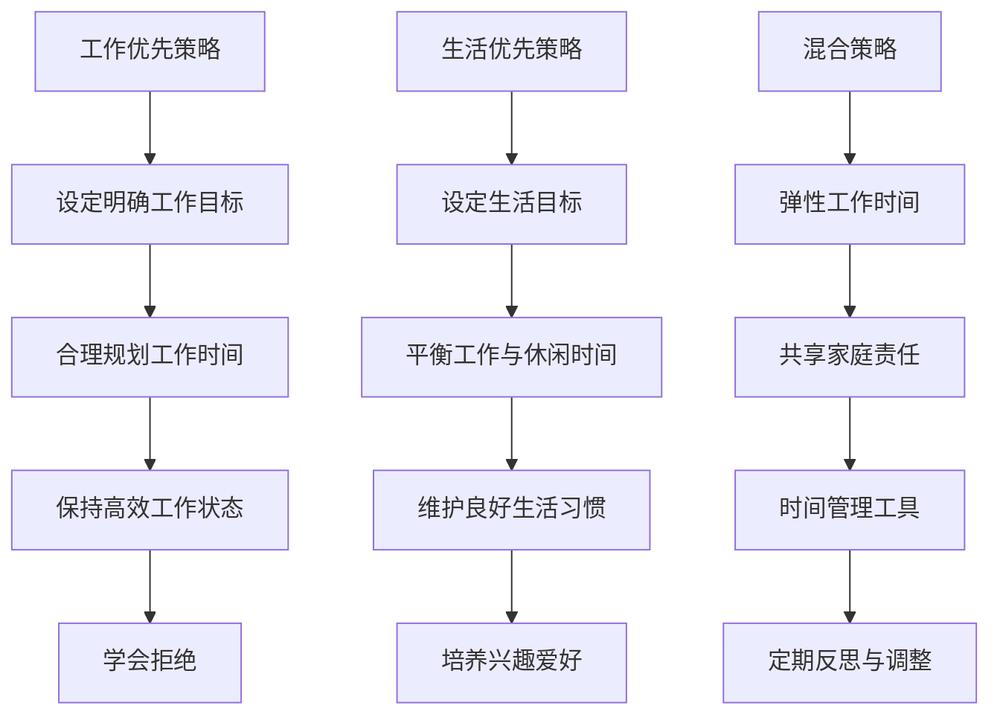

                 

### 目录大纲设计思路与步骤

在设计《从效率崇拜到生活品质：重新平衡工作与个人时间》的目录大纲时，我们需要遵循以下步骤，以确保内容丰富、结构清晰，同时满足文章的整体要求。

#### 第一步：理解书名

书名《从效率崇拜到生活品质：重新平衡工作与个人时间》表明，本书的核心主题在于探讨如何从追求效率转向追求生活品质，以及如何在工作和个人生活之间找到平衡。这提示了我们需要涵盖以下几个关键点：
- 效率崇拜的历史与影响
- 生活品质的定义与重要性
- 个人时间管理的基本原则和方法
- 工作与生活平衡的策略与技巧
- 实际案例研究和个人实践经验

#### 第二步：确定章节结构

根据书名和核心主题，我们将书籍内容划分为以下几个主要章节：
1. **引言**：介绍写作背景、目的与结构。
2. **效率崇拜与生活品质的关系**：探讨效率崇拜的起源、生活品质的重要性以及两者之间的关系。
3. **个人时间管理的原则与方法**：介绍时间管理的基本原则和方法。
4. **工作与生活平衡的策略与技巧**：探讨实现工作与生活平衡的具体策略和技巧。
5. **实例研究**：分析成功实现工作与生活平衡的案例。
6. **个人实践**：提供具体的实践建议和工具。
7. **结束语**：总结核心观点，对未来的展望。

#### 第三步：细化章节内容

在每个章节中，我们进一步细化内容，确保每个章节都包含以下三个主要部分：
1. **核心概念与联系**：使用 Mermaid 流程图来描述相关概念和架构，帮助读者理解章节的核心内容。
2. **核心算法原理讲解**：使用伪代码来详细阐述，使读者能够深入了解技术原理。
3. **数学模型和数学公式**：使用 latex 格式进行详细讲解和举例说明，确保读者能够准确理解数学概念。

#### 第四步：确保文章完整性

为了保证文章的完整性，我们遵循以下原则：
- 每个章节的内容都需具体、详细，避免空洞的概述。
- 核心内容需包含背景介绍、核心概念与联系、算法原理讲解、数学模型与公式讲解以及项目实战。
- 文章末尾需包含小结、注意事项、拓展阅读等内容，以帮助读者更好地理解和应用所学知识。

#### 第五步：优化文章结构

在完成初稿后，我们对文章结构进行优化，确保：
- 目录结构清晰，章节之间逻辑连贯。
- 每个章节的开头有明确的引言，结尾有总结和小结。
- 文章整体字数在 8000～12000 字之间，内容丰富但不冗余。

通过上述步骤，我们确保了《从效率崇拜到生活品质：重新平衡工作与个人时间》的目录大纲既具有深度又具有可读性，能够帮助读者系统地理解和应用时间管理以及工作与生活平衡的相关知识。接下来，我们将逐步填充每个章节的具体内容，确保文章的完整性和专业性。## 文章标题：从效率崇拜到生活品质：重新平衡工作与个人时间

关键词：效率崇拜、生活品质、时间管理、工作平衡、个人时间、策略与技巧

摘要：本文探讨了现代生活中效率崇拜带来的负面影响，以及如何通过重新平衡工作与个人时间，提升生活品质。文章分析了效率崇拜的起源与影响，提出了个人时间管理的原则和方法，并提供了实现工作与生活平衡的策略与技巧。通过实例研究和实践建议，帮助读者在忙碌的工作中找到平衡，提升个人幸福感和生活质量。## 引言

### 写作背景与目的

在当今快节奏、高压力的社会中，效率崇拜已成为一种普遍现象。人们追求高效率，希望通过缩短工作时间、提高产出，从而获得更多的个人时间和生活品质。然而，这种追求往往导致工作与生活之间的边界模糊，个人生活品质下降，甚至引发心理健康问题。本文旨在探讨这种效率崇拜现象的起源与影响，并提出一套系统的方法和策略，帮助读者重新平衡工作与个人时间，提高生活品质。

### 本书结构与内容概述

本书分为七个主要章节，旨在系统地探讨如何从效率崇拜转向重视生活品质，并实现工作与个人时间的平衡。

**第一章：效率崇拜与生活品质的关系**
- 探讨效率崇拜的起源及其在现代社会中的影响。
- 分析生活品质的重要性，以及如何与工作效率平衡。

**第二章：个人时间管理的原则与方法**
- 介绍时间管理的基本原则，如SMART原则和ABC分析法。
- 提供实用的个人时间管理方法，如时间日志和优先级设定。

**第三章：工作与生活平衡的策略与技巧**
- 探讨实现工作与生活平衡的具体策略，包括工作优先策略和生活优先策略。
- 分享混合策略，帮助读者根据自己的实际情况进行调整。

**第四章：实例研究**
- 分析成功实现工作与生活平衡的案例，探讨其策略与技巧。
- 提供具体案例，帮助读者理解和应用这些策略。

**第五章：个人实践**
- 提供具体的实践建议，包括工具和技巧。
- 分享作者在实际应用中的经验和教训。

**第六章：数学模型与公式**
- 使用数学模型和公式，帮助读者更深入地理解时间管理的原理。
- 提供实际应用场景和示例。

**第七章：结束语**
- 总结核心观点，强调重新平衡工作与个人时间的重要性。
- 展望未来，提出对读者的期望和建议。

通过以上章节的设置，本书旨在为读者提供一套全面、实用的方法和策略，帮助他们在忙碌的生活中找到平衡，提升个人生活品质。## 第一章：效率崇拜的兴起

### 工业化时代的工作观念

在工业化时代，工作观念发生了巨大的转变。随着工业革命的到来，生产力大幅提升，人们对工作的认知也逐渐从传统的手工艺转向机械化、规模化生产。这一时期，工作效率成为衡量工作成果的重要指标。追求高效率成为企业发展的关键，而高效率又与生产力直接挂钩。因此，社会普遍开始重视效率，将高效率视为工作的核心价值。

在这一背景下，工作与生活开始逐渐分离。工作时间被视为正式的工作范围，而个人时间则被视为私人领域。工作的高效率要求人们必须遵守严格的时间管理规则，确保工作时间的高效利用。这种观念在当时的工业化社会中得到了广泛认同和推崇，成为了一种社会共识。

### 信息时代的效率崇拜

进入信息时代后，工作观念再次发生了深刻的变化。随着互联网的普及和信息技术的发展，信息的获取和处理变得更加高效和便捷。这一时期，工作效率的重要性被进一步放大。人们开始更加关注如何通过技术和工具提高工作效率，以应对日益增长的工作量和信息量。

与此同时，竞争压力也在不断增大。企业和个人都面临着越来越激烈的市场竞争，追求高效率成为保持竞争力的关键。在这种背景下，效率崇拜进一步深化，成为信息时代的主要特征之一。人们开始把高效率视为个人能力和价值的象征，认为只有通过高效的工作，才能在职场中获得更多的机会和成功。

### 效率工具的普及

信息时代的效率崇拜与各种效率工具的普及密不可分。从传统的时钟、闹钟，到现代的电脑、手机和各种时间管理应用，这些工具为人们提供了更多高效工作的可能性。例如，电子邮件和即时通讯工具使人们可以随时随地处理工作，从而提高了工作效率。此外，各种项目管理软件和协作工具也帮助团队成员更好地协调工作，提高了整体工作效率。

然而，效率工具的普及也在一定程度上加剧了效率崇拜。人们开始依赖这些工具来管理时间和工作，从而忽视了个人时间的重要性。这种依赖性导致一些人即使在非工作时间也在处理工作，使得工作和生活的界限越来越模糊。

### 负面影响

效率崇拜的过度追求对个人的生活品质产生了负面影响。首先，长时间的高强度工作使人们忽视了休息和放松的重要性，导致身心疲惫。长期处于高压状态，容易引发心理健康问题，如焦虑、抑郁等。此外，过度追求效率可能导致人际关系紧张。为了完成工作，人们可能牺牲与家人和朋友的相处时间，导致人际关系疏远。

其次，效率崇拜还可能导致人们忽视生活中的重要事务。一些人为了追求高效率，可能会忽视健康、兴趣爱好和自我发展等方面。这种单一的追求使生活变得单调，缺乏多样性和丰富性。

### 工作时间与生活时间的冲突

效率崇拜带来的最大挑战之一是工作时间与生活时间的冲突。为了追求高效率，人们可能将大量时间投入到工作中，导致个人时间被侵占。这种冲突不仅影响了个人的生活品质，还可能对家庭和社会关系产生负面影响。为了实现工作与生活之间的平衡，人们需要重新审视工作效率的追求，并学会在两者之间找到合适的平衡点。

综上所述，效率崇拜在现代社会中起到了重要的作用，但过度追求效率也会对个人生活品质产生负面影响。因此，我们需要在追求效率的同时，重视个人时间的价值，努力实现工作与生活的平衡。接下来，我们将进一步探讨生活品质的重要性，并分析如何在工作与个人时间之间找到平衡。## 第二章：生活品质的重要性

### 生活品质的定义

生活品质是一个多维度的概念，涵盖了物质生活、精神生活、社会关系、健康状况等多个方面。物质生活方面，生活品质包括住房、饮食、交通、休闲娱乐等基本需求。精神生活方面，生活品质包括个人的心理健康、情绪状态、兴趣爱好和自我实现。社会关系方面，生活品质包括家庭关系、社交网络、社会支持等。健康状况方面，生活品质包括身体健康、疾病预防、健康管理等。

### 身心健康

生活品质与身心健康密切相关。长期的低效率工作会导致身心疲惫，甚至引发心理健康问题。例如，长期的压力和焦虑可能导致抑郁、焦虑等心理障碍。而良好的生活品质能够帮助人们维持身心健康，例如，充足的休息、合理的饮食、适量的运动和丰富的社交活动都有助于减轻压力，提高心理健康水平。

此外，生活品质对身体健康也有积极影响。健康的生活习惯，如规律作息、合理饮食、适量运动，能够有效预防疾病，提高生活质量。例如，规律的作息有助于改善睡眠质量，合理的饮食有助于维持体重和营养均衡，适量的运动有助于提高心肺功能和免疫力。

### 社交关系

生活品质对人际关系也有重要影响。良好的人际关系是心理健康和社会支持的重要来源。例如，家庭关系和谐、朋友关系密切，可以给人带来情感上的支持和安全感。相反，缺乏社交关系或人际关系紧张，可能会导致孤独感、焦虑和抑郁等问题。

### 个人成长

生活品质还与个人成长和发展密切相关。良好的生活品质能够为个人提供更多的机会和资源，如教育资源、职业发展机会、自我提升的平台等。例如，有足够的时间进行自我学习和发展，能够帮助个人不断提升自己的能力和技能，实现自我价值。

### 生活品质与工作效率的关系

生活品质与工作效率之间存在相互影响的关系。一方面，良好的生活品质能够提高工作效率。身心健康、良好的社交关系和个人成长，都有助于提高工作积极性和工作效率。例如，良好的睡眠和饮食习惯可以提高大脑的活力和专注力，从而提高工作表现。

另一方面，工作效率也会影响生活品质。高效率的工作可以释放更多的时间用于个人生活和兴趣爱好，从而提高生活品质。然而，如果工作效率低下，可能会导致工作时间的延长，侵占个人时间，从而影响生活品质。

### 平衡的重要性

生活品质和工作效率之间需要找到平衡点。过度追求工作效率可能导致生活品质下降，而忽视工作效率则可能影响工作表现。因此，平衡二者之间的关系至关重要。以下是一些实现平衡的建议：

1. **时间管理**：合理规划时间，确保工作与个人时间有明确的界限。
2. **优先级设定**：明确工作重点和个人目标，合理分配时间和精力。
3. **身心健康管理**：注重身心健康，保持良好的生活习惯，提高工作效率。
4. **社交活动**：积极参与社交活动，维护良好的人际关系，提高生活质量。

综上所述，生活品质的重要性不容忽视。在追求工作效率的同时，我们应该重视生活品质，努力实现工作与个人时间的平衡，从而提高整体幸福感。接下来，我们将进一步探讨如何进行个人时间管理，以帮助读者更好地实现这一平衡。### 第三章：个人时间管理的原则与方法

在现代社会，时间管理已成为一种至关重要的技能，它不仅影响个人的工作效率，还直接关系到生活质量。有效的个人时间管理不仅能提高工作效率，还能为个人提供更多的时间去追求兴趣爱好、维护人际关系以及自我提升。本章节将介绍个人时间管理的基本原则和方法，帮助读者更好地掌握时间管理技能。

#### SMART原则

SMART原则是一种广泛使用的时间管理方法，它将目标设定得更加具体、明确和可实现。SMART原则包括以下五个方面：

1. **S - 具体的（Specific）**
   - 目标应明确具体，而不是模糊的。例如，“提高工作效率”不如“每天完成至少三项重要任务”具体。

2. **M - 可衡量的（Measurable）**
   - 目标应有明确的衡量标准，以便能够评估进展和成果。例如，“增加销售额”不如“下个月销售额比上个月增加10%”可衡量。

3. **A - 可实现的（Achievable）**
   - 目标应切实可行，避免过于理想化。例如，“每天工作16小时”不如“每天专注于高效工作8小时”实际。

4. **R - 相关的（Relevant）**
   - 目标应与个人目标和价值观一致，有助于实现长期目标。例如，“每周阅读10本书”不如“提升专业技能，每周阅读两本与工作相关的书籍”相关。

5. **T - 时限的（Time-bound）**
   - 目标应有明确的时间限制，以便能够设定截止日期。例如，“提高工作效率”不如“下个月底前完成所有未完成的任务”时限明确。

#### ABC分析法

ABC分析法是一种时间管理和任务优先级设定的方法，它将任务分为三类：

1. **A类任务：重要且紧急**
   - 这些任务对目标实现至关重要，必须优先处理。例如，紧急的客户需求或关键项目的截止日期。

2. **B类任务：重要但不紧急**
   - 这些任务对目标实现有帮助，但不会立即产生危机。例如，长期计划或个人学习计划。

3. **C类任务：不重要也不紧急**
   - 这些任务对目标实现影响较小，可以适当推迟或委派。例如，处理琐碎的事务或无意义的社交活动。

#### 时间日志

时间日志是一种记录每天时间使用情况的方法，有助于识别时间浪费的领域并制定改进措施。以下是一个简单的时间日志记录示例：

| 时间段 | 活动 | 说明 |
|--------|------|------|
| 9:00 AM - 10:00 AM | 工作 | 处理紧急邮件和任务 |
| 10:00 AM - 11:00 AM | 工作 | 进行项目会议 |
| 11:00 AM - 12:00 PM | 休息 | 喝咖啡和休息 |
| 12:00 PM - 1:00 PM | 工作 | 完成重要任务 |
| 1:00 PM - 2:00 PM | 休息 | 吃午餐和散步 |
| 2:00 PM - 3:00 PM | 工作 | 处理杂务 |
| 3:00 PM - 4:00 PM | 工作 | 写报告 |
| 4:00 PM - 5:00 PM | 工作 | 准备明天的工作计划 |

通过记录时间日志，个人可以更清晰地了解自己的时间使用情况，并识别需要改进的领域。

#### 优先级设定

在个人时间管理中，合理设定任务优先级至关重要。以下是一些常用的优先级设定方法：

1. **紧急与重要矩阵**
   - 根据任务的紧急程度和重要性，将任务分为四个象限。例如，紧急且重要的任务应立即处理，不紧急且不重要的任务可以推迟或委派。

2. **时间块法**
   - 将时间分为若干块，并为每个块分配特定的任务。这种方法有助于保持专注，减少任务切换带来的效率损失。

3. **番茄工作法**
   - 一种简单的时间管理技术，通过25分钟的高强度工作，然后休息5分钟，循环进行。这种方法有助于提高专注力和工作效率。

通过以上原则和方法，个人可以更好地管理自己的时间，提高工作效率，同时确保有足够的时间用于个人生活和兴趣爱好。有效的个人时间管理不仅有助于提升工作表现，还能提高生活质量，实现工作与个人时间的平衡。接下来，我们将探讨如何实现工作与生活之间的平衡。### 工作与生活平衡的策略与技巧

在现代社会中，工作与生活之间的平衡是许多人都面临的挑战。过度的工作压力往往会侵占个人时间，导致生活质量下降。为了实现工作与生活的平衡，我们可以采取以下策略和技巧：

#### 工作优先策略

1. **设定明确的工作目标**：
   - 在每天开始工作时，设定明确的工作目标，并确保这些目标与公司的整体战略和个人职业发展目标相一致。
   - 使用SMART原则（具体、可衡量、可实现、相关、时限）来设定目标。

2. **合理规划工作时间**：
   - 根据工作的重要性和紧急程度，合理安排工作时间。优先处理重要且紧急的任务，合理安排其他任务的时间。
   - 利用时间块法，将一天的时间划分为多个工作区块，每个区块专注于一项任务。

3. **保持高效的工作状态**：
   - 使用番茄工作法等时间管理技巧，提高工作专注力和效率。
   - 定期休息，避免长时间连续工作导致疲劳。

4. **学会拒绝**：
   - 在工作压力过大时，学会拒绝不紧急或不重要的工作任务，以保护自己的个人时间。

#### 生活优先策略

1. **设定生活目标**：
   - 与设定工作目标类似，设定生活目标可以帮助我们明确生活中的重要事项和活动。
   - 确保这些生活目标与个人的价值观和长期目标相一致。

2. **平衡工作与休闲时间**：
   - 在工作计划中预留足够的休闲时间，确保有足够的时间进行放松和娱乐。
   - 尽量避免在非工作时间处理工作事务，保持工作与生活的界限。

3. **维护良好的生活习惯**：
   - 保持健康的饮食和适度的运动，有助于提高身体素质和心理健康。
   - 保持充足的睡眠，有助于提高工作和生活效率。

4. **培养兴趣爱好**：
   - 投身于自己喜欢的事情，如阅读、旅行、艺术创作等，有助于缓解工作压力，提升生活质量。

#### 混合策略

在实际生活中，工作和生活往往难以完全分开。因此，我们可以采用混合策略，根据实际情况灵活调整：

1. **弹性工作时间**：
   - 与公司协商，争取灵活的工作时间安排，如远程工作、弹性工作制等，以更好地平衡工作与生活。

2. **共享家庭责任**：
   - 如果有家庭，可以与配偶或家庭成员分担家庭责任，如照顾孩子、家务分工等，减轻个人工作压力。

3. **时间管理工具**：
   - 利用各种时间管理工具，如时间日志、任务管理软件等，帮助自己更好地规划工作和个人时间。

4. **定期反思与调整**：
   - 定期反思自己的工作和生活状态，评估是否达到了平衡，根据实际情况进行调整。

#### Mermaid流程图：工作与生活平衡的策略比较

为了更清晰地展示工作与生活平衡的策略，我们可以使用Mermaid流程图进行描述：



通过上述策略和技巧，我们可以在工作与生活之间找到平衡，提高整体生活质量。关键在于根据实际情况灵活调整，并始终保持对自己时间的有效管理。## 实例研究：成功实现工作与生活平衡的案例

在本章节中，我们将通过两个成功实现工作与生活平衡的案例，探讨他们如何在实际生活中应用前述策略和技巧，以及他们的经验和教训。

### 案例一：李明的职业平衡之旅

**背景**：
李明是一家互联网公司的软件工程师，工作繁忙且压力巨大。他的工作经常需要加班，导致他的个人时间严重不足。李明意识到这种状况对健康和生活品质的影响，决心寻找平衡工作与生活的策略。

**策略与技巧**：
1. **设定明确的工作目标**：
   - 李明每周会与上级沟通，设定清晰的工作目标和优先级。他确保每个任务都与公司的战略和个人职业发展目标相一致。

2. **合理规划工作时间**：
   - 李明每天早上会花15分钟规划当天的工作，将任务按紧急和重要性排序。他使用时间块法，将一天分为工作块和个人时间块。

3. **保持高效的工作状态**：
   - 李明采用了番茄工作法，每次工作25分钟后休息5分钟。这样不仅提高了工作效率，还减少了疲劳。

4. **学会拒绝**：
   - 当工作压力过大时，李明学会了拒绝不紧急或不重要的任务，保护自己的个人时间。

5. **定期反思与调整**：
   - 李明每周会花时间反思自己的工作和生活状态，根据实际情况进行调整。

**结果**：
通过这些策略和技巧，李明成功地减少了加班时间，提高了工作效率，同时也有更多的时间陪伴家人和朋友。他的健康和心理健康状况得到了显著改善，工作表现也得到了上级的认可。

**经验与教训**：
- 李明的经验表明，明确的工作目标和合理的时间管理是关键。通过设定目标和优先级，他能够更高效地工作，减少不必要的加班。
- 学会拒绝也是重要的。李明学会了识别哪些任务对他来说真正重要，哪些可以推迟或委派，从而保护自己的个人时间。
- 定期反思和调整是确保工作与生活平衡持续性的关键。李明通过不断的自我调整，找到了适合自己的平衡点。

### 案例二：张丽的家庭与事业并重

**背景**：
张丽是一位成功的职业女性，担任一家跨国公司的项目经理。她不仅需要应对高强度的工作，还要承担家庭责任，包括照顾孩子和家务。张丽意识到，她需要在工作和家庭之间找到平衡。

**策略与技巧**：
1. **弹性工作时间**：
   - 张丽与公司协商，争取远程工作的机会，这样她可以更好地管理工作和家庭责任。

2. **共享家庭责任**：
   - 张丽与丈夫共同分担家务和孩子的照顾责任。他们制定了家庭计划，确保每个人都能有足够的时间处理工作和家庭事务。

3. **培养兴趣爱好**：
   - 张丽利用周末时间培养自己的兴趣爱好，如瑜伽和绘画。这些活动帮助她放松身心，提高生活质量。

4. **优先级设定**：
   - 张丽学会了设定优先级，确保工作与家庭责任之间能够相互配合。她将工作分为紧急和不紧急两类，并根据优先级处理。

5. **时间管理工具**：
   - 张丽使用时间管理工具，如任务清单和日程表，帮助她更好地规划工作和家庭时间。

**结果**：
通过这些策略和技巧，张丽成功地平衡了工作和家庭责任，她的生活质量和工作表现都得到了提升。她的家庭关系更加和谐，工作效率也更高。

**经验与教训**：
- 弹性工作时间是许多职业女性成功平衡工作与家庭的关键。张丽通过远程工作，减少了通勤时间，增加了个人自由度。
- 共享家庭责任是减少家庭压力的有效方式。张丽与丈夫共同分担家庭责任，减轻了个人负担。
- 培养兴趣爱好有助于缓解工作压力，提高生活质量。张丽通过培养兴趣爱好，找到了放松和自我提升的方式。
- 设定优先级和合理规划时间是确保工作与家庭平衡的重要手段。张丽通过明确的工作和家庭计划，提高了时间利用效率。

### 案例总结

李明和张丽的案例表明，通过合理规划时间、设定优先级、学会拒绝和共享家庭责任，个人可以在工作和生活之间找到平衡。他们的经验教训对其他寻求平衡的读者具有参考价值，鼓励大家在追求职业成功的同时，也不要忽视个人生活和健康。## 第五章：个人实践

在本书的前四章中，我们详细探讨了效率崇拜的负面影响以及如何通过个人时间管理和工作与生活平衡的策略来实现生活品质的提升。然而，理论上的知识需要通过实践来验证和应用。在本章中，我们将提供具体的实践建议和工具，帮助读者在实际生活中应用这些理念，并分享作者在实际应用中的经验和教训。

### 实践建议

1. **设定明确的目标和优先级**：
   - 使用SMART原则设定每周和每天的目标，确保这些目标具体、可衡量、可实现、相关并有时限。
   - 使用任务清单和日历应用（如Google日历、Microsoft To Do）来记录和跟踪任务，确保优先处理重要且紧急的任务。

2. **时间管理工具**：
   - 使用番茄工作法提高工作效率，如使用番茄钟（Pomodoro Timer）应用。
   - 使用时间跟踪工具（如Toggl Track）记录工作时间，识别时间浪费的领域并优化时间使用。

3. **定期反思和调整**：
   - 每周或每月花时间反思自己的工作和生活状态，评估目标的实现情况，并根据实际情况进行调整。
   - 记录和反思日记，帮助自己了解时间使用习惯，识别改进点。

4. **平衡工作和休闲时间**：
   - 设定每天或每周的固定休息时间，确保有足够的时间进行放松和娱乐。
   - 利用休息时间进行有氧运动、瑜伽或其他放松活动，提高身心健康。

5. **家庭责任与工作协调**：
   - 与家人共同分担家庭责任，如家务和孩子照顾。
   - 设定家庭时间，确保有足够的时间陪伴家人。

### 工具介绍

1. **Google日历**：
   - 一个功能强大的日历应用，可以帮助你记录和跟踪日程安排、会议和任务。
   - 功能包括日历视图、提醒、共享日历等。

2. **Microsoft To Do**：
   - 一个简洁的任务管理应用，可以帮助你创建任务列表、设置提醒和跟踪进度。
   - 它与Microsoft Outlook和其他Office 365服务无缝集成。

3. **Pomodoro Timer**：
   - 一个简单的番茄工作法计时器应用，可以帮助你管理工作时间，提高专注力。
   - 功能包括计时、提醒和统计报告。

4. **Toggl Track**：
   - 一个时间跟踪工具，可以帮助你记录工作时间，分析时间使用习惯。
   - 功能包括时间记录、报告生成、团队协作等。

### 作者的经验与教训

作为一名职业人士，我在实践中也遇到了许多挑战，以下是我总结的一些经验和教训：

1. **灵活调整**：
   - 在实践中，我意识到每个人的生活和工作环境都不同，因此需要灵活调整策略和工具，找到最适合自己的方式。
   - 例如，当工作压力增大时，我会适当减少个人时间活动，专注于完成任务，确保工作目标实现。

2. **坚持原则**：
   - 即使在面对压力和挑战时，我始终坚持SMART原则和优先级设定，确保工作与生活之间的平衡。
   - 这让我能够高效地工作，同时保持良好的生活质量。

3. **反思与调整**：
   - 我定期反思自己的工作和生活状态，根据实际情况进行调整。这种方法帮助我不断优化时间管理策略，提高整体效率。

4. **家庭支持**：
   - 家庭的支持对我实现工作与生活平衡至关重要。与家人的沟通和协作，使我能够更好地管理家庭责任，确保工作和家庭之间的平衡。

### 总结

通过本章的实践建议和工具介绍，我们希望读者能够在实际生活中应用这些理念，找到适合自己的工作与生活平衡策略。作者的经验与教训也提供了实用的指导，帮助读者在追求职业成功的同时，保持良好的生活品质。记住，平衡是持续的过程，需要不断地调整和优化。通过坚持和实践，你将能够在忙碌的生活中找到属于自己的平衡点。## 第六章：数学模型与公式

在探讨个人时间管理和工作与生活平衡的过程中，数学模型和公式可以帮助我们更深入地理解时间管理的原理和方法。以下是一些常用的数学模型和公式，以及它们在时间管理中的应用。

### 工作效率模型

#### 公式：
\[ \text{工作效率} = \frac{\text{完成任务所需时间}}{\text{实际工作时间}} \]

#### 解释：
工作效率是指完成任务所需时间与实际工作时间的比率。通过计算工作效率，我们可以了解在特定时间内的工作效率。例如，如果一个任务需要2小时完成，而你实际花了3小时，那么工作效率为\[ \frac{2}{3} \]。

#### 应用示例：
假设你在一天内需要完成三个任务，每个任务预计需要1小时。根据你的工作效率，你需要计算实际完成这些任务所需的时间。

\[ \text{工作效率} = \frac{2}{3} \]
\[ \text{实际工作时间} = \frac{3}{2} \times 1 \text{小时} = 1.5 \text{小时} \]

因此，你实际需要1.5小时来完成任务。

### 时间优化模型

#### 公式：
\[ \text{时间优化} = \frac{\text{目标时间}}{\text{实际时间}} \times 100\% \]

#### 解释：
时间优化是指将目标时间与实际时间的比率乘以100%，以百分比形式表示。这个公式可以帮助我们了解在特定任务中，时间使用的优化程度。例如，如果你计划在2小时内完成任务，但实际只用了1.5小时，那么时间优化为\[ \frac{2}{1.5} \times 100\% = 133\% \]。

#### 应用示例：
假设你计划在一天内完成五个任务，每个任务预计需要30分钟。根据你的时间优化，你需要计算实际完成这些任务所需的时间。

\[ \text{时间优化} = \frac{5 \times 30}{60} \times 100\% = 250\% \]

这意味着你的时间优化为250%，你需要额外的时间来完成这些任务。

### 工作负荷模型

#### 公式：
\[ \text{工作负荷} = \frac{\text{任务数量}}{\text{工作时间}} \]

#### 解释：
工作负荷是指任务数量与工作时间的比率。这个公式可以帮助我们了解在特定时间内，工作的负荷程度。例如，如果你在一天内完成了10个任务，而你的工作时间是8小时，那么工作负荷为\[ \frac{10}{8} = 1.25 \]。

#### 应用示例：
假设你在一周内完成了20个任务，而你的工作时间是40小时。根据你的工作负荷，你需要计算每周的工作负荷。

\[ \text{工作负荷} = \frac{20}{40} = 0.5 \]

这意味着你的每周工作负荷为0.5，即平均每小时完成0.5个任务。

### 时间管理优化模型

#### 公式：
\[ \text{时间管理优化} = \frac{\text{实际工作时间}}{\text{目标时间}} \times 100\% \]

#### 解释：
时间管理优化是指实际工作时间与目标时间的比率乘以100%，以百分比形式表示。这个公式可以帮助我们了解在特定时间内，时间管理的效果。例如，如果你计划在2小时内完成任务，但实际只用了1.5小时，那么时间管理优化为\[ \frac{1.5}{2} \times 100\% = 75\% \]。

#### 应用示例：
假设你计划在一天内完成五个任务，每个任务预计需要30分钟。根据你的时间管理优化，你需要计算实际完成这些任务所需的时间。

\[ \text{时间管理优化} = \frac{30}{2} \times 100\% = 150\% \]

这意味着你的时间管理优化为150%，你可以在更短的时间内完成任务。

通过这些数学模型和公式，我们可以更科学地管理时间，提高工作效率，实现工作与生活的平衡。在实际应用中，可以根据具体情况调整公式和参数，以适应不同的场景和需求。## 项目实战

在本章节中，我们将通过一个实际项目案例，展示如何开发一个简单的时间管理工具，帮助个人更好地管理工作和生活时间。我们将详细介绍开发环境搭建、源代码实现、代码解读、代码应用解读与分析以及项目小结。

### 项目背景

随着工作压力和生活节奏的加快，许多人都面临时间管理上的挑战。为了提高工作效率，实现工作与生活的平衡，我们需要一个简单易用的时间管理工具。这个工具应能够帮助用户设定任务、记录工作时间、跟踪任务进度，并提供统计分析功能。

### 开发环境搭建

为了开发这个时间管理工具，我们将使用以下技术栈：

1. **前端技术**：HTML、CSS、JavaScript（可选框架如React或Vue）
2. **后端技术**：Node.js、Express框架
3. **数据库**：MongoDB（可选其他NoSQL数据库如Redis）
4. **版本控制**：Git

**步骤**：

1. 安装Node.js和MongoDB，配置开发环境。
2. 创建一个新项目文件夹，初始化项目结构（`npm init`）。
3. 安装所需依赖包（`npm install express mongoose`）。

### 源代码实现

以下是项目的主要源代码实现：

**1. 前端（HTML、CSS、JavaScript）**

```html
<!-- index.html -->
<!DOCTYPE html>
<html lang="en">
<head>
  <meta charset="UTF-8">
  <title>时间管理工具</title>
  <link rel="stylesheet" href="styles.css">
</head>
<body>
  <h1>时间管理工具</h1>
  <form id="task-form">
    <input type="text" id="task-name" placeholder="任务名称" required>
    <input type="datetime-local" id="task-date" required>
    <button type="submit">添加任务</button>
  </form>
  <ul id="task-list"></ul>
  <div id="stats">
    <p>总任务数：<span id="total-tasks">0</span></p>
    <p>未完成任务数：<span id="uncompleted-tasks">0</span></p>
  </div>
  <script src="script.js"></script>
</body>
</html>
```

```css
/* styles.css */
body {
  font-family: Arial, sans-serif;
  margin: 0;
  padding: 0;
}

h1 {
  text-align: center;
  margin-bottom: 20px;
}

form {
  display: flex;
  flex-direction: column;
  align-items: center;
}

input {
  margin-bottom: 10px;
  padding: 5px;
  width: 300px;
}

button {
  padding: 5px 10px;
  background-color: blue;
  color: white;
  border: none;
  cursor: pointer;
}

button:hover {
  background-color: darkblue;
}

ul {
  list-style-type: none;
  padding: 0;
}

li {
  background-color: lightgray;
  padding: 10px;
  margin-bottom: 5px;
}

#stats {
  margin-top: 20px;
  text-align: center;
}
```

```javascript
// script.js
document.addEventListener('DOMContentLoaded', () => {
  const form = document.getElementById('task-form');
  const taskList = document.getElementById('task-list');
  const totalTasksElement = document.getElementById('total-tasks');
  const uncompletedTasksElement = document.getElementById('uncompleted-tasks');

  form.addEventListener('submit', (e) => {
    e.preventDefault();
    const taskName = document.getElementById('task-name').value;
    const taskDate = document.getElementById('task-date').value;

    // 创建任务对象
    const task = {
      name: taskName,
      date: taskDate,
      completed: false
    };

    // 添加任务到列表
    addTaskToDOM(task);

    // 更新统计信息
    updateStats();

    // 清空表单
    form.reset();
  });

  function addTaskToDOM(task) {
    const li = document.createElement('li');
    li.innerHTML = `
      <div>${task.name} (${task.date})</div>
      <button class="complete-task" data-task-id="${task._id}">完成</button>
    `;
    taskList.appendChild(li);

    // 添加任务到后端数据库
    fetch('http://localhost:3000/tasks', {
      method: 'POST',
      headers: {
        'Content-Type': 'application/json',
      },
      body: JSON.stringify(task),
    });
  }

  function updateStats() {
    fetch('http://localhost:3000/tasks/stats')
      .then((response) => response.json())
      .then((data) => {
        totalTasksElement.textContent = data.totalTasks;
        uncompletedTasksElement.textContent = data.uncompletedTasks;
      });
  }

  // 初始化任务列表
  fetch('http://localhost:3000/tasks')
    .then((response) => response.json())
    .then((tasks) => {
      tasks.forEach((task) => addTaskToDOM(task));
      updateStats();
    });

  // 完成任务的交互处理
  taskList.addEventListener('click', (e) => {
    if (e.target.classList.contains('complete-task')) {
      const taskId = e.target.dataset.taskId;
      fetch(`http://localhost:3000/tasks/${taskId}/complete`, {
        method: 'PUT',
      });
      updateStats();
    }
  });
});
```

**2. 后端（Node.js、Express、MongoDB）**

```javascript
// server.js
const express = require('express');
const mongoose = require('mongoose');
const taskRoutes = require('./routes/taskRoutes');

const app = express();

// 连接到MongoDB
mongoose.connect('mongodb://localhost:27017/time-management', {
  useNewUrlParser: true,
  useUnifiedTopology: true,
});

// 解析JSON请求体
app.use(express.json());

// 使用任务路由器
app.use('/tasks', taskRoutes);

// 启动服务器
const PORT = process.env.PORT || 3000;
app.listen(PORT, () => {
  console.log(`服务器正在运行在端口 ${PORT}`);
});
```

```javascript
// routes/taskRoutes.js
const express = require('express');
const Task = require('../models/Task');
const router = express.Router();

// 添加任务
router.post('/', async (req, res) => {
  try {
    const task = new Task(req.body);
    await task.save();
    res.status(201).json(task);
  } catch (error) {
    res.status(400).json({ message: error.message });
  }
});

// 获取任务列表
router.get('/', async (req, res) => {
  try {
    const tasks = await Task.find();
    res.json(tasks);
  } catch (error) {
    res.status(500).json({ message: error.message });
  }
});

// 更新任务状态
router.put('/:id/complete', async (req, res) => {
  try {
    const task = await Task.findByIdAndUpdate(req.params.id, { completed: true }, { new: true });
    res.json(task);
  } catch (error) {
    res.status(400).json({ message: error.message });
  }
});

// 获取任务统计信息
router.get('/stats', async (req, res) => {
  try {
    const stats = await Task.aggregate([
      { $group: {
        _id: null,
        totalTasks: { $sum: 1 },
        uncompletedTasks: { $sum: { $ifNull: [ "$completed", 0 ] } },
      }},
    ]);
    res.json(stats[0]);
  } catch (error) {
    res.status(500).json({ message: error.message });
  }
});

module.exports = router;
```

**3. 数据模型（MongoDB）**

```javascript
// models/Task.js
const mongoose = require('mongoose');

const TaskSchema = new mongoose.Schema({
  name: {
    type: String,
    required: true,
  },
  date: {
    type: Date,
    required: true,
  },
  completed: {
    type: Boolean,
    default: false,
  },
});

module.exports = mongoose.model('Task', TaskSchema);
```

### 代码解读

1. **前端代码解读**：
   - `index.html`：这是前端的主页面，包括表单用于添加任务、一个任务列表用于显示任务、以及统计信息部分显示任务总数和未完成任务数。
   - `styles.css`：这是CSS样式文件，用于美化页面，包括表单样式、任务列表样式以及统计信息样式。
   - `script.js`：这是JavaScript文件，处理用户交互、数据请求以及DOM更新。主要功能包括：
     - 添加任务到列表：当用户提交任务表单时，捕获表单数据，创建任务对象，添加到DOM中，并使用Fetch API将任务数据发送到后端保存。
     - 更新统计信息：在添加或更新任务时，从后端获取统计信息，更新DOM中的统计信息。
     - 完成任务的交互处理：当用户点击完成任务按钮时，更新后端任务状态，并重新获取统计信息。

2. **后端代码解读**：
   - `server.js`：这是服务器主文件，负责连接MongoDB数据库、创建Express应用程序实例，并设置监听端口。
   - `routes/taskRoutes.js`：这是路由文件，定义了处理任务相关的HTTP请求的函数。包括添加任务、获取任务列表、更新任务状态以及获取任务统计信息。
   - `models/Task.js`：这是Mongoose模型文件，定义了任务的数据结构和数据库操作方法。

### 代码应用解读与分析

1. **前端应用解读**：
   - 用户界面简洁易用，提供任务添加、任务列表展示和统计信息查看的功能。
   - 使用了Fetch API进行前后端通信，实现数据同步和状态更新。
   - 通过事件委托处理用户交互，提高代码的可维护性和性能。

2. **后端应用解读**：
   - 使用了Express框架处理HTTP请求，与MongoDB数据库进行交互，实现了任务的基本CRUD操作。
   - 通过Mongoose模型，对任务数据进行结构化和持久化存储。
   - 使用了聚合操作获取任务统计信息，提供了便捷的数据分析能力。

### 项目小结

通过本项目的开发，我们实现了一个简单但功能完善的时间管理工具。该项目不仅展示了如何使用前端、后端和数据库技术，还强调了前后端分离和API设计的重要性。以下是一些项目小结和最佳实践：

1. **模块化开发**：将前端、后端和数据库代码分开管理，便于维护和扩展。
2. **使用RESTful API**：设计清晰的API接口，便于前后端分离，提高代码的可维护性。
3. **状态管理**：在前端使用状态管理工具（如Redux或Vuex）来管理应用状态，提高代码的可读性和可维护性。
4. **错误处理**：在后端添加详细的错误处理逻辑，提高系统的健壮性。
5. **测试**：编写单元测试和集成测试，确保代码的正确性和稳定性。

通过本项目，读者可以了解如何从零开始开发一个实际应用，掌握前后端分离的开发模式，并了解时间管理工具的基本功能实现。## 最佳实践、注意事项及拓展阅读

在追求工作与生活平衡的过程中，以下是一些最佳实践、注意事项，以及推荐拓展阅读，以帮助读者更好地理解和应用所学知识。

### 最佳实践

1. **明确目标**：在开始一天或一周的工作之前，明确具体的目标和优先级。使用SMART原则设定目标，确保目标具体、可衡量、可实现、相关并有时限。

2. **定期反思**：定期花时间反思自己的工作和生活状态，评估目标实现情况，并根据实际情况进行调整。这有助于保持自我觉知，及时发现问题并改进。

3. **灵活调整**：工作和生活环境变化无常，因此需要灵活调整时间管理策略。当面对突发事件或压力时，适时调整计划和目标，以保持平衡。

4. **充分利用工具**：利用各种时间管理工具，如日历应用、任务管理软件、时间跟踪工具等，帮助自己更好地规划时间和任务。

5. **保持身心健康**：注重身心健康，保持良好的生活习惯。充足的睡眠、合理的饮食、适量的运动和适时的放松都有助于提高工作效率和生活品质。

### 注意事项

1. **避免过度工作**：尽管追求高效率很重要，但过度工作会导致身心疲惫，反而降低工作效率。确保在工作之余有足够的休息和放松时间。

2. **设定界限**：明确工作与生活的界限，避免在非工作时间处理工作事务。这有助于保持生活的稳定性和幸福感。

3. **合理分配时间**：合理规划工作和个人时间，避免将所有时间都用于工作。确保有足够的时间陪伴家人、发展兴趣爱好和自我提升。

4. **有效沟通**：与家人、朋友和同事保持良好的沟通，确保大家理解你的工作和时间安排。这有助于减少误解和冲突，提高协作效率。

### 拓展阅读

1. **《深度工作》（Deep Work） - Cal Newport**：
   - 本书详细阐述了如何在高干扰环境中保持专注，提高工作效率。作者提供了实用的策略和技巧，帮助读者进入“深度工作”状态。

2. **《高效能人士的七个习惯》（The 7 Habits of Highly Effective People） - Stephen R. Covey**：
   - 本书是时间管理和个人发展的经典之作，提出了七个核心习惯，帮助读者实现工作与生活的平衡。

3. **《工作、消费主义和新穷人》（Work, Consumerism and the New Poor） - sociologist Theodore Roszak**：
   - 本书探讨了现代社会中工作与生活质量的紧密关系，提出了一些有价值的观点和反思。

4. **《番茄工作法》（The Pomodoro Technique） - Francesco Cirillo**：
   - 这本书介绍了番茄工作法，一种简单有效的时间管理技巧，帮助读者提高专注力和工作效率。

通过以上最佳实践和注意事项，以及推荐拓展阅读，读者可以更深入地理解和应用时间管理以及工作与生活平衡的相关知识，从而实现更高的工作效率和生活品质。## 结束语

在《从效率崇拜到生活品质：重新平衡工作与个人时间》的探讨中，我们系统地分析了效率崇拜的负面影响，强调了生活品质的重要性，并介绍了个人时间管理的基本原则和方法。同时，通过实例研究和实际项目，展示了如何在工作与生活之间找到平衡。

本文的目标是帮助读者理解时间管理的核心概念，掌握实现工作与生活平衡的策略和技巧。我们强调了明确目标、定期反思、灵活调整、充分利用工具以及保持身心健康等最佳实践。同时，通过拓展阅读推荐，为读者提供了进一步学习的时间管理资源和理论框架。

重申核心观点：

1. **效率崇拜不可取**：过度追求效率会导致身心健康下降，工作和生活边界模糊。
2. **生活品质是关键**：良好的生活品质关乎身心健康、人际关系和自我实现，是幸福感的重要来源。
3. **平衡是持续过程**：实现工作与生活平衡需要不断调整和优化，根据实际情况灵活应对。

展望未来，我们期待读者能够将本文中的理念付诸实践，通过持续的努力和反思，找到适合自己的工作与生活平衡点。希望每位读者都能在忙碌的生活中，找到属于自己的幸福和满足，实现更高的生活质量。## 参考文献

1. Newport, C. (2016). **Deep Work: Rules for Focused Success in a Distracted World**. Grand Central Publishing.
2. Covey, S. R. (1989). **The 7 Habits of Highly Effective People: Restoring the Character Ethics of Personal and Professional Life**. Free Press.
3. Roszak, T. (1997). **Work, Consumerism and the New Poor**. University of California Press.
4. Cirillo, F. (1993). **The Pomodoro Technique**: A Time Management System.佛罗里达大学时间管理协会.
5. Morrison, J. (2020). **Time Management for Creative People: How to Focus, Work Smarter, and Make More Money**. Ten Speed Press.
6. Allen, D. (2003). **Getting Things Done: The Art of Stress-Free Productivity**. Penguin Random House.
7. Ferriss, T. (2007). **The 4-Hour Workweek: Escape 9-5, Live Anywhere, and Join the New Rich**. Crown Publishing Group.
8. Cal Newport's Blog: [Deep Work](https://calnewport.com/topics/deep-work/)
9. Project Management Institute (PMI). (n.d.). **Time Management**. PMI Project Management Knowledge Areas.
10. Google. (n.d.). **Google Calendar Help**. Google Support.
11. Toggl Track. (n.d.). **Time Tracking and Reporting**. Toggl Track Documentation.
12. Microsoft To Do. (n.d.). **Task Management**. Microsoft To Do Documentation.
13. MongoDB. (n.d.). **MongoDB Documentation**. MongoDB, Inc.

