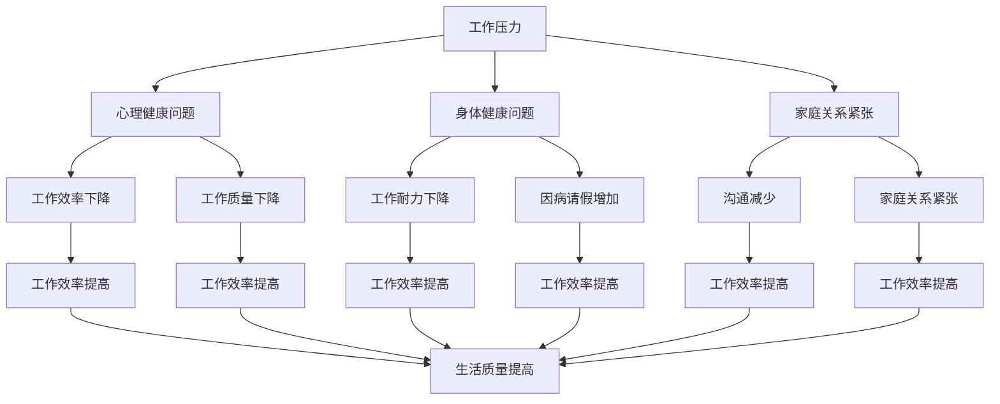
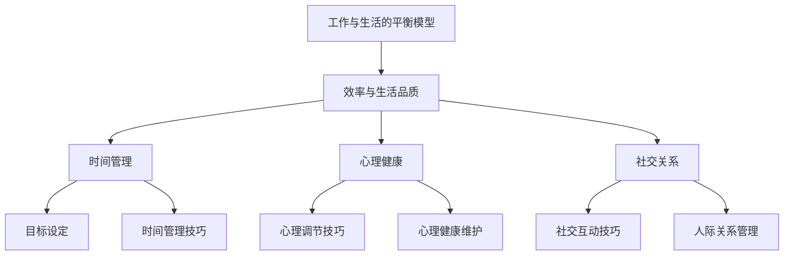

                 


### 文章标题

《从效率至上到生活品质：重新平衡工作与个人生活》

### 关键词

工作效率、生活品质、工作与生活平衡、时间管理、心理健康、平衡策略

### 摘要

在当今快节奏的工作环境中，效率至上成为了一种普遍的追求。然而，过度追求效率往往导致了工作与个人生活的失衡，影响了生活质量。本文旨在探讨如何从效率至上转向重视生活品质，重新平衡工作与个人生活。通过分析工作与生活的关系、提出平衡模型和策略，以及提供实际案例，本文为读者提供了一套系统的平衡方法。

---

### 目录大纲

#### 第一部分：引言

1.1 背景与动机
1.2 书籍结构概述

#### 第二部分：理解工作与生活的关系

2.1 工作与生活的相互影响
2.2 工作与生活的平衡模型
2.3 工作与生活的平衡策略

#### 第三部分：提高工作效率

3.1 提高工作效率的核心要素
3.2 工作效率提升的具体方法
3.3 工作效率提升的案例分析

#### 第四部分：提升个人生活品质

4.1 个人生活品质的提升要素
4.2 提升个人生活品质的方法
4.3 个人生活品质提升的案例分析

#### 第五部分：平衡工作与生活的实践

5.1 平衡工作与生活的步骤
5.2 平衡工作与生活的挑战与应对
5.3 平衡工作与生活的案例分析

#### 第六部分：总结与展望

6.1 主要观点回顾
6.2 未来展望

---

### 引言

在现代职场中，效率被视为衡量工作成果的重要标准。然而，过度追求效率往往导致工作压力增加，忽视了个人生活的需求和品质。这种失衡不仅影响心理健康，还可能导致工作效率下降。因此，重新平衡工作与个人生活成为当务之急。

本文将从以下几个方面进行探讨：

1. **工作与生活的关系**：分析工作压力对生活质量的影响，以及生活质量对工作效率的影响。
2. **平衡模型与策略**：介绍工作与生活的平衡模型，并提出具体策略，如时间管理、心理调节和资源优化。
3. **工作效率提升**：探讨如何通过设定目标、时间管理和技能提升来提高工作效率。
4. **个人生活品质提升**：分析如何通过健康管理、心理调节和社交互动来提升个人生活品质。
5. **平衡工作与生活的实践**：提供平衡工作与生活的具体步骤和案例分析。
6. **总结与展望**：回顾主要观点，展望未来的发展趋势。

通过本文的探讨，我们希望帮助读者理解工作与生活的平衡重要性，并提供实用的方法来实现这一平衡。

---

### 第一部分：引言

#### 1.1 背景与动机

在当今社会，工作与生活的平衡已经成为一个备受关注的话题。随着全球化进程的加速和科技的发展，工作压力日益增大，许多人陷入了“效率至上”的误区。他们把工作看作是实现自我价值的唯一途径，过度追求高效率和成绩，忽视了个人生活的需求和品质。然而，这种做法往往导致了一系列问题，如心理健康问题、家庭关系紧张、生活满意度下降等。

工作与生活的平衡不仅是个人幸福的重要保障，也是社会稳定和可持续发展的重要基础。一个不平衡的工作生活状态会导致以下几方面的问题：

1. **心理健康问题**：长期的工作压力和疲劳会导致焦虑、抑郁等心理问题，甚至可能引发身体健康问题。
2. **家庭关系紧张**：过度的工作投入会导致家庭成员之间的沟通减少，家庭关系紧张，甚至破裂。
3. **生活满意度下降**：当工作占据了大部分时间和精力时，个人生活的乐趣和满足感会大幅降低。
4. **工作效率下降**：长期的过度工作会导致精力耗尽，工作效率反而下降。

因此，重新平衡工作与个人生活显得尤为重要。这不仅关乎个人的幸福，也关乎整个社会的健康和稳定。本文旨在探讨如何从效率至上转向重视生活品质，为读者提供一套系统的平衡方法和策略。

---

#### 1.2 书籍结构概述

本文将从以下几个方面展开论述，帮助读者全面理解工作与生活的平衡，并提供实用的方法来实现这一平衡。

1. **工作与生活的关系**：
   - **工作压力对生活质量的影响**：探讨工作压力如何影响个人的心理健康、家庭关系和生活满意度。
   - **生活质量对工作效率的影响**：分析良好的生活质量如何提高工作效率和创造力。
   - **工作与生活平衡的复杂性**：讨论工作与生活平衡的动态性和复杂性，以及如何应对。

2. **工作与生活的平衡模型**：
   - **平衡模型的定义**：介绍工作与生活平衡模型的基本概念和组成部分。
   - **平衡模型的核心要素**：分析模型中的关键要素，如时间管理、心理健康和社交关系。
   - **平衡模型的应用**：讨论如何在实际生活中应用平衡模型，以及如何根据个人情况进行调整。

3. **工作与生活的平衡策略**：
   - **时间管理策略**：介绍如何合理安排时间，提高工作效率，并留出足够的个人时间。
   - **心理调节策略**：探讨如何通过心理调节技巧来缓解工作压力，提高生活质量。
   - **资源优化策略**：分析如何优化个人和企业的资源，实现工作与生活的平衡。

4. **提高工作效率**：
   - **核心要素**：讨论提高工作效率的关键因素，如目标设定、时间管理和技能提升。
   - **具体方法**：介绍提高工作效率的具体策略，如工作流程优化、工作习惯养成和工具应用。
   - **案例分析**：通过实际案例，分析提高工作效率的成功经验和教训。

5. **提升个人生活品质**：
   - **提升要素**：分析提升个人生活品质的关键因素，如健康管理、心理健康和社交关系。
   - **方法**：介绍提升个人生活品质的具体方法，如健康生活方式的养成、心理调节技巧和社交互动优化。
   - **案例分析**：通过实际案例，展示提升个人生活品质的成效和经验。

6. **平衡工作与生活的实践**：
   - **步骤**：提供平衡工作与生活的具体步骤，包括自我评估、制定计划、执行与调整等。
   - **挑战与应对**：讨论平衡工作与生活过程中可能遇到的挑战，并提出应对策略。
   - **案例分析**：通过案例分析，展示不同人群如何实现工作与生活的平衡。

7. **总结与展望**：
   - **主要观点回顾**：总结文章的主要观点和核心策略。
   - **未来展望**：探讨工作与生活平衡的趋势，以及可能的新方法和技术。

通过本文的详细论述，读者将能够理解工作与生活平衡的重要性，掌握实现这一平衡的方法和策略，从而实现个人和社会的可持续发展。

---

### 理解工作与生活的关系

工作与生活之间的关系是复杂且动态的，两者相互影响、相互制约。了解这种关系对于实现工作与生活的平衡至关重要。本部分将探讨以下几个方面：

1. **工作压力对生活质量的影响**：
   - **心理健康问题**：长期的工作压力会导致焦虑、抑郁等心理问题。研究表明，高压力工作环境会增加心理健康问题的风险。
   - **身体健康问题**：工作压力也会影响身体健康，如导致慢性疲劳、高血压和心血管疾病等。
   - **家庭关系紧张**：工作压力往往会导致家庭成员之间的沟通减少，家庭关系紧张，甚至破裂。

2. **生活质量对工作效率的影响**：
   - **心理健康**：良好的心理健康有助于提高工作效率和创造力。心理健康问题不仅会影响工作效率，还可能导致工作质量下降。
   - **身体健康**：身体健康是工作效率的基础。良好的身体状况可以提高工作耐力，减少因病请假的情况。
   - **家庭关系**：家庭关系稳定有助于提高工作效率。家庭成员的支持和理解可以减轻工作压力，提高工作动力。

3. **工作与生活平衡的复杂性**：
   - **动态性**：工作与生活平衡是一个动态的过程，受到多种因素的影响，如个人情况、工作环境和社会文化等。
   - **个体差异**：不同的人对工作与生活的平衡有不同的需求和期望，因此平衡策略也需要因人而异。
   - **环境变化**：工作环境和家庭环境的变化也会影响工作与生活的平衡。例如，公司政策的调整、家庭成员的变化等。

4. **平衡工作与生活的重要性**：
   - **个人幸福**：平衡工作与生活是提高个人幸福感的关键。一个平衡的生活状态可以带来更多的乐趣和满足感。
   - **社会稳定**：工作与生活的平衡对于社会的稳定和可持续发展具有重要意义。一个和谐的工作环境可以减少社会问题，提高社会整体幸福感。

为了更好地理解工作与生活的关系，我们可以使用以下 Mermaid 流程图来展示核心概念之间的关系：



通过以上分析，我们可以看到工作压力对生活质量有负面影响，而良好的生活质量对工作效率有积极影响。因此，实现工作与生活的平衡对于提高个人幸福感和工作效率具有重要意义。

---

### 工作与生活的平衡模型

为了更好地实现工作与生活的平衡，我们需要构建一个全面的平衡模型。这个模型将包括几个核心要素，如时间管理、心理健康和社交关系。以下是这个模型的具体内容和应用方法。

#### 1. 平衡模型的定义

工作与生活平衡模型是一个系统化的框架，旨在帮助个人和企业理解工作与生活之间的关系，并提供具体的策略和方法来实现平衡。这个模型的核心是整合个人和工作的需求，确保两者之间的和谐发展。

#### 2. 平衡模型的核心要素

**时间管理**：时间管理是工作与生活平衡的关键要素。有效的时间管理不仅能够提高工作效率，还能为个人生活留出更多的时间。时间管理的核心在于合理安排时间，确保工作、休息和娱乐等活动的平衡。

**心理健康**：心理健康是工作与生活平衡的另一个关键要素。一个健康的心理状态有助于提高工作满意度和生活质量。心理健康的维护包括情绪调节、压力管理和自我认知等方面。

**社交关系**：社交关系是生活质量的重要组成部分。良好的社交关系能够提供情感支持，减轻工作压力，提高生活满意度。社交关系的维护包括与家人、朋友和同事的互动，以及参与社区活动等。

#### 3. 平衡模型的应用

**时间管理策略**：
- **目标设定**：明确个人和职业目标，确保时间分配与目标一致。
- **任务优先级**：根据任务的紧急程度和重要性进行排序，确保关键任务得到优先处理。
- **日程规划**：合理安排每日、每周和每月的日程，确保工作、休息和娱乐的时间得到平衡。

**心理健康策略**：
- **情绪调节**：学会识别和调节负面情绪，如焦虑和抑郁。
- **压力管理**：采用有效的压力管理技巧，如深呼吸、冥想和放松训练。
- **自我认知**：培养自我认知能力，了解自己的需求和心理状态，从而更好地应对工作压力。

**社交关系策略**：
- **互动频率**：定期与家人、朋友和同事交流，确保社交关系的紧密性。
- **社交活动**：参与社区活动和兴趣小组，扩展社交网络，增加社交乐趣。
- **冲突解决**：学会有效解决社交冲突，维护和谐的社交关系。

#### 4. 案例分析

**案例一：个人时间管理成功故事**

张先生是一位年轻的软件工程师，他面临着高强度的工作压力。为了实现工作与生活的平衡，他采取了以下策略：
- **目标设定**：明确职业和个人目标，确保时间分配与目标一致。
- **任务优先级**：将任务按照紧急程度和重要性排序，确保关键任务得到优先处理。
- **日程规划**：合理安排每日、每周和每月的日程，确保工作、休息和娱乐的时间得到平衡。

通过这些策略，张先生成功地提高了工作效率，同时也有更多的时间陪伴家人和进行个人兴趣活动。

**案例二：企业领导者的工作与生活平衡**

李总是一家大型企业的领导者，他深知工作与生活平衡对团队和企业的重要性。他采取了一系列措施来推动工作与生活的平衡：
- **时间管理培训**：定期为员工提供时间管理培训，提高员工的自我管理能力。
- **灵活工作时间**：实行灵活的工作时间制度，允许员工根据个人需求调整工作时间。
- **心理健康支持**：提供心理健康咨询服务，帮助员工应对工作压力。

通过这些措施，李总不仅提高了员工的工作满意度，也提升了整个团队的工作效率。

通过以上案例分析，我们可以看到，工作与生活的平衡模型在实际应用中取得了显著的成效。这些成功案例为其他个人和企业提供了宝贵的经验和启示。

---

### 工作与生活的平衡策略

为了实现工作与生活的平衡，我们需要采取一系列具体的策略。这些策略将涵盖时间管理、心理调节和资源优化等方面。以下是这些策略的详细说明：

#### 1. 时间管理策略

时间管理是工作与生活平衡的基础。以下是一些关键的时间管理策略：

**设定明确的目标**：明确个人和职业目标，确保时间分配与目标一致。目标设定应具体、可衡量、可实现，并具有时限性。

**任务优先级排序**：根据任务的紧急程度和重要性进行排序，确保关键任务得到优先处理。可以使用“四象限法”或“紧急重要矩阵”来帮助排序。

**日程规划**：合理安排每日、每周和每月的日程，确保工作、休息和娱乐的时间得到平衡。可以使用日程表或时间管理软件来规划日程。

**避免拖延**：识别并克服拖延行为，确保任务按时完成。可以采用“番茄工作法”等技巧来提高工作效率。

**弹性时间安排**：为应对突发情况，预留一定的时间缓冲。这样可以避免因突发事件而打乱整体计划。

**休息与放松**：确保每天有足够的休息时间，进行适当的放松活动，如瑜伽、阅读或散步。

#### 2. 心理调节策略

心理健康是工作与生活平衡的关键因素。以下是一些有效的心理调节策略：

**情绪调节**：学会识别和调节负面情绪，如焦虑和抑郁。可以使用深呼吸、冥想、正念等方法来缓解压力。

**压力管理**：采用有效的压力管理技巧，如时间管理、运动、放松训练等。识别压力源，并采取积极应对措施。

**自我认知**：培养自我认知能力，了解自己的需求和心理状态，从而更好地应对工作压力。可以通过自我反思、心理咨询等方式提高自我认知。

**心理支持**：寻求家人、朋友或专业人士的心理支持，分享感受，获取帮助。

**保持乐观**：保持积极乐观的态度，面对困难和挑战时保持坚定和信心。

#### 3. 资源优化策略

资源优化是提高工作效率和生活质量的重要手段。以下是一些资源优化的策略：

**时间资源优化**：合理安排时间，确保工作、休息和娱乐的时间得到平衡。避免过度工作，确保有足够的休息和放松时间。

**人力资源优化**：合理分配人力资源，确保团队成员的工作负担均衡。可以采用轮班制度、团队协作等方式来优化人力资源。

**技术资源优化**：利用技术工具和软件来提高工作效率。例如，使用项目管理软件、自动化工具等来优化工作流程。

**财务资源优化**：合理规划财务资源，确保个人和家庭的经济需求得到满足。可以采用预算管理、投资规划等方式来优化财务资源。

**社会资源优化**：积极参与社区活动和社交互动，扩展社交网络，获取更多的社会支持和资源。

#### 案例分析

**案例一：个人时间管理成功故事**

李女士是一位职业女性，她通过以下策略实现了工作与生活的平衡：

- **设定明确的目标**：明确职业和个人目标，确保时间分配与目标一致。
- **任务优先级排序**：将任务按照紧急程度和重要性排序，确保关键任务得到优先处理。
- **日程规划**：合理安排每日、每周和每月的日程，确保工作、休息和娱乐的时间得到平衡。
- **避免拖延**：识别并克服拖延行为，确保任务按时完成。
- **休息与放松**：确保每天有足够的休息时间，进行适当的放松活动。

通过这些策略，李女士不仅提高了工作效率，还有更多的时间陪伴家人和进行个人兴趣活动。

**案例二：企业领导者的工作与生活平衡**

王总是一家中型企业的领导者，他采取了以下措施来推动工作与生活的平衡：

- **时间管理培训**：定期为员工提供时间管理培训，提高员工的自我管理能力。
- **灵活工作时间**：实行灵活的工作时间制度，允许员工根据个人需求调整工作时间。
- **心理健康支持**：提供心理健康咨询服务，帮助员工应对工作压力。

通过这些措施，王总不仅提高了员工的工作满意度，也提升了整个团队的工作效率。

通过以上案例分析，我们可以看到，有效的平衡策略对于实现工作与生活的平衡具有重要意义。这些策略不仅适用于个人，也适用于企业和组织。

---

### 提高工作效率

在追求工作与生活平衡的过程中，提高工作效率是关键的一环。高效的工作不仅能够释放更多的个人时间，还能提升工作质量，实现个人和职业目标。以下将从核心要素、具体方法和实际案例三个方面来探讨如何提高工作效率。

#### 核心要素

**目标设定**：明确的目标是高效工作的基础。设定具体、可衡量、可实现的目标可以帮助我们集中精力，提高工作效率。

**时间管理**：合理安排时间，确保工作的每个阶段都能高效完成。时间管理包括任务优先级排序、日程规划、避免拖延等。

**技能提升**：掌握相关技能和知识，提高工作效率。不断学习和提升自己的技能，能够更好地应对工作中的挑战。

**工作习惯养成**：培养良好的工作习惯，如定期休息、保持工作环境的整洁等，有助于提高工作效率。

#### 具体方法

**工作流程优化**：分析现有工作流程，找出瓶颈和重复性工作，通过自动化或优化流程来减少不必要的时间消耗。

**工作习惯养成**：通过培养良好的工作习惯，如定期休息、保持专注、避免多任务处理等，来提高工作效率。

**工具与技术应用**：利用现代技术工具，如项目管理软件、自动化工具、在线协作平台等，来提高工作效率。

**定期回顾与调整**：定期回顾工作进度和效果，根据实际情况进行调整，以确保工作持续高效。

#### 实际案例

**案例一：企业数字化转型**

某企业通过数字化转型，大幅度提高了工作效率。他们采用了一系列技术工具，如CRM系统、ERP系统、自动化流程等，优化了客户管理、供应链管理和内部流程。这些措施不仅提高了工作效率，还提升了客户满意度和市场竞争力。

**案例二：个人时间管理成功故事**

张先生是一位软件工程师，他通过以下方法提高了工作效率：

- **目标设定**：明确每周的工作目标和任务，确保工作方向清晰。
- **时间管理**：使用时间管理工具，如番茄工作法和日程表，合理安排工作时间。
- **技能提升**：定期学习新技术和编程语言，提升自己的技能水平。
- **工作习惯养成**：保持工作环境的整洁，避免多任务处理，确保专注力。

通过这些方法，张先生不仅提高了工作效率，还有更多的时间陪伴家人和进行个人兴趣活动。

通过以上分析和案例，我们可以看到，提高工作效率是实现工作与生活平衡的关键。通过设定目标、时间管理、技能提升和工作习惯养成，我们可以大幅度提高工作效率，实现个人和职业目标。

---

### 提升个人生活品质

在实现工作与生活平衡的过程中，提升个人生活品质同样至关重要。良好的生活品质不仅可以提高生活满意度，还能为工作提供持久的动力和支持。以下将介绍提升个人生活品质的关键要素、具体方法以及实际案例。

#### 关键要素

**健康管理**：健康是生活品质的基础。良好的健康管理包括合理的饮食、适量的运动和充足的睡眠。

**心理健康**：心理健康直接影响个人的幸福感和工作表现。包括情绪调节、压力管理和自我认知等方面。

**社交关系**：社交关系是生活品质的重要组成部分。与家人、朋友和同事的紧密联系有助于减轻工作压力，提高生活满意度。

#### 具体方法

**健康管理方法**：
- **合理饮食**：保持均衡的饮食，摄入足够的营养素，避免过度摄入高热量、高脂肪的食物。
- **适量运动**：定期进行适量的运动，如散步、跑步、瑜伽等，有助于提高身体素质和心理健康。
- **充足睡眠**：保证每晚7-9小时的睡眠，有助于恢复体力和精神状态。

**心理健康方法**：
- **情绪调节**：学会识别和调节负面情绪，如焦虑和抑郁。可以采用冥想、深呼吸等方法来缓解情绪。
- **压力管理**：采用有效的方法来管理压力，如时间管理、放松训练等。
- **自我认知**：通过自我反思和心理咨询等方式，提高自我认知能力，更好地应对生活和工作中的挑战。

**社交关系方法**：
- **互动频率**：定期与家人、朋友和同事交流，确保社交关系的紧密性。
- **社交活动**：积极参与社区活动和兴趣小组，扩展社交网络，增加社交乐趣。
- **冲突解决**：学会有效解决社交冲突，维护和谐的社交关系。

#### 实际案例

**案例一：健康管理的实践**

李女士是一位职场女性，她通过以下方法提高了健康管理：

- **合理饮食**：每天保证摄入足够的水果和蔬菜，减少高热量食物的摄入。
- **适量运动**：每天进行至少30分钟的有氧运动，如散步和瑜伽。
- **充足睡眠**：每晚保持7-8小时的睡眠，确保早上精力充沛。

通过这些方法，李女士的身体状况得到了显著改善，工作效率和生活满意度也显著提高。

**案例二：心理健康的自我提升**

张先生是一位企业家，他通过以下方法提升了心理健康：

- **情绪调节**：每天进行冥想，缓解工作压力和焦虑情绪。
- **压力管理**：通过时间管理和放松训练来减轻工作压力。
- **自我认知**：定期进行自我反思，了解自己的需求和期望，调整工作方式。

通过这些方法，张先生的心理健康水平得到了显著提高，工作表现也更为出色。

**案例三：社交关系的优化**

王女士是一位公司高管，她通过以下方法优化了社交关系：

- **互动频率**：每周至少与家人和朋友们进行一次聚会，保持紧密的社交联系。
- **社交活动**：积极参与公司的团队建设活动和社区志愿服务，扩展社交网络。
- **冲突解决**：学会倾听和沟通，有效解决社交冲突，维护和谐的社交关系。

通过这些方法，王女士的工作和生活质量得到了显著提升。

通过以上案例分析，我们可以看到，提升个人生活品质对于实现工作与生活平衡具有重要意义。通过健康管理、心理健康和社交关系优化，我们可以提高生活满意度，为工作提供持久的动力和支持。

---

### 平衡工作与生活的实践

实现工作与生活的平衡不仅需要理论指导，更需要具体的实践步骤。以下将介绍平衡工作与生活的具体步骤、可能遇到的挑战及其应对策略。

#### 步骤

**1. 自我评估**：
首先，我们需要对自己的工作和生活状况进行全面的评估。这包括分析工作压力、工作效率、生活满意度等方面。可以通过问卷调查、日记记录等方式来收集信息。

**2. 制定计划**：
基于自我评估的结果，制定一个具体的平衡计划。计划应包括时间管理、心理健康和社交关系等方面的具体措施。例如，设定每日的工作时间、安排定期的休息和放松时间、参加社交活动等。

**3. 执行与调整**：
执行平衡计划，并在执行过程中进行持续调整。这需要自我监督和定期回顾，确保计划的实施效果。如果遇到困难，应及时调整计划，寻找更合适的解决方案。

**4. 寻求支持**：
在平衡工作与生活的过程中，我们可能需要寻求家人、朋友或专业人士的支持。他们的建议和帮助可以提供额外的动力和资源。

#### 挑战与应对策略

**挑战一：工作压力过大**：
**应对策略**：通过时间管理和心理调节策略来减轻工作压力。例如，设定明确的任务优先级，合理安排工作时间，定期进行放松训练和冥想。

**挑战二：家庭关系紧张**：
**应对策略**：通过沟通和互动来改善家庭关系。例如，定期与家人沟通，安排家庭聚会，共同参与活动，增进家庭成员之间的理解和信任。

**挑战三：个人时间不足**：
**应对策略**：通过优化时间管理和提高工作效率来增加个人时间。例如，设定明确的目标和任务，合理安排日程，避免拖延，利用自动化工具等。

**挑战四：心理问题困扰**：
**应对策略**：寻求心理健康支持。例如，定期进行心理咨询，学习情绪调节技巧，建立支持网络。

**挑战五：社交活动不足**：
**应对策略**：积极参与社交活动和兴趣小组，扩展社交网络。例如，参加社区活动、加入兴趣小组、与朋友组织聚会等。

#### 案例分析

**案例一：职场新人的工作与生活平衡**

赵小姐是一名刚进入职场的新人，她面临着工作压力和家庭责任的双重挑战。为了实现平衡，她采取了以下措施：

- **自我评估**：分析自己的工作压力和家庭需求，识别需要改进的方面。
- **制定计划**：设定每日的工作时间表，确保工作和休息的平衡，同时安排家庭聚会和自我放松时间。
- **执行与调整**：严格执行计划，并在每周进行回顾和调整，确保计划的持续性和有效性。
- **寻求支持**：与家人沟通，争取他们的理解和支持，同时也参加了一些社交活动，扩大社交网络。

通过这些措施，赵小姐成功地实现了工作与生活的平衡，工作效率和家庭满意度都得到了显著提高。

**案例二：企业领导者的工作与生活平衡**

李先生是一家大型企业的领导者，他深知工作与生活平衡对团队和企业的重要性。他采取了以下措施：

- **自我评估**：定期评估自己的工作压力和心理健康状况，确保及时发现问题。
- **制定计划**：制定长期和短期的工作与生活平衡计划，包括时间管理、心理健康和社交关系等方面的具体措施。
- **执行与调整**：通过定期的团队会议和员工反馈来执行和调整计划，确保团队的协同工作和个人发展。
- **寻求支持**：提供员工心理健康咨询和培训，建立员工支持网络，促进团队内部的沟通和协作。

通过这些措施，李先生不仅提高了团队的工作效率，也提升了员工的工作满意度和生活质量。

通过以上案例分析，我们可以看到，平衡工作与生活的实践需要具体的步骤和策略，同时也需要不断的调整和优化。通过自我评估、制定计划、执行与调整以及寻求支持，我们可以逐步实现工作与生活的平衡，提高个人和团队的整体效能。

---

### 总结与展望

本文从多个角度探讨了如何从效率至上转向重视生活品质，实现工作与生活的平衡。我们首先分析了工作与生活的关系，揭示了工作压力对生活质量的影响以及生活质量对工作效率的积极影响。接着，我们介绍了工作与生活的平衡模型，包括时间管理、心理健康和社交关系等核心要素，并提出了具体的平衡策略。此外，我们还讨论了提高工作效率和提升个人生活品质的方法，并提供了实际案例作为参考。

在总结主要观点时，我们强调以下几点：

1. **效率至上的局限性**：过度追求效率会导致工作与生活的失衡，影响生活质量和工作效率。
2. **生活品质的重要性**：良好的生活品质是提高工作效率和个人幸福感的关键。
3. **平衡工作与生活的方法与策略**：通过时间管理、心理调节和资源优化，可以实现工作与生活的平衡。

展望未来，工作与生活平衡的趋势将受到以下因素的影响：

1. **技术进步**：随着人工智能、物联网等技术的发展，工作流程将更加自动化，为个人生活提供更多的时间和便利。
2. **工作环境变化**：远程工作和弹性工作制度的普及，将使人们能够更好地平衡工作和生活。
3. **心理健康关注**：心理健康的重要性将得到更多关注，企业和社会将提供更多的心理健康支持。
4. **可持续生活方式**：追求可持续生活方式将成为趋势，包括健康饮食、环保出行等。

未来，我们需要不断探索和尝试新的平衡方法，以应对不断变化的工作和生活环境。同时，企业和社会也需要提供更多的支持和资源，帮助人们实现工作与生活的平衡。

---

### 核心概念与联系

为了更好地理解和应用本文中的核心概念，我们使用 Mermaid 流程图来展示它们之间的关系。



在这个模型中，工作与生活的平衡模型（A）是核心，它涵盖了效率与生活品质（B），其中包括时间管理（C）、心理健康（D）和社交关系（E）。这些要素又进一步细分为具体的技巧和维护方法（F-G、H-I、J-K），从而构成了一个完整且系统的平衡框架。

---

### 核心算法原理讲解

为了更好地理解和应用本文中的核心概念，我们在此详细讲解时间管理算法和心理调节算法，并使用伪代码和数学模型来说明其原理。

#### 时间管理算法

时间管理算法的核心在于合理安排任务和分配时间。以下是一个基本的时间管理算法的伪代码：

```plaintext
算法：时间管理算法
输入：任务列表，可用时间
输出：任务时间分配方案

1. 分析任务列表，将其分为紧急和重要任务。
2. 对任务进行优先级排序（紧急且重要任务优先）。
3. 根据任务优先级和可用时间，分配时间：
   - 对于每个任务：
     - 如果任务紧急且重要，分配最优先的时间段。
     - 如果任务紧急但不重要，分配剩余时间段的一部分。
     - 如果任务重要但不紧急，尽量安排在非高峰时间段。
     - 如果任务不重要且不紧急，考虑是否推迟或放弃。
4. 监控时间使用情况，必要时进行调整。
```

#### 心理调节算法

心理调节算法旨在帮助个人应对工作压力，保持心理健康。以下是一个基本的心理调节算法的伪代码：

```plaintext
算法：心理调节算法
输入：情绪状态，压力水平
输出：调节策略

1. 识别当前的情绪状态和压力水平。
2. 分析情绪状态和压力水平的原因：
   - 如果情绪状态为焦虑或抑郁，分析焦虑或抑郁的原因。
   - 如果压力水平过高，分析压力源。
3. 提出针对性的调节策略：
   - 如果情绪状态为焦虑或抑郁，采用放松训练、深呼吸等方法。
   - 如果压力水平过高，采用时间管理、休息和娱乐等方法。
4. 实施调节策略，并观察效果：
   - 执行调节策略，并记录情绪状态和压力水平的变化。
   - 根据效果调整策略。
```

#### 数学模型和公式

为了量化时间管理，我们可以使用时间分配模型。以下是时间分配模型的数学公式：

$$
\text{时间分配} = \frac{\text{总任务时间}}{\text{可用时间}}
$$

例如，如果你每天有8小时的工作时间，而你的任务需要10小时完成，那么你需要在剩余的2小时内找到解决方案，否则可能需要延长工作时间。

对于心理调节，我们可以使用心理健康模型来量化心理健康状态。以下是心理健康模型的数学公式：

$$
\text{心理健康} = \frac{\text{情绪状态得分} + \text{压力水平得分} + \text{社交关系得分}}{3}
$$

其中，每个得分范围在0到100之间，分值越高表示心理健康状态越好。例如，如果你的情绪状态得分为80，压力水平得分为70，社交关系得分为90，那么你的心理健康得分为80。

通过这些算法和数学模型，我们可以更科学地管理时间和调节心理状态，实现工作与生活的平衡。

---

### 数学模型和数学公式 & 详细讲解 & 举例说明

为了更好地理解和应用本文中的核心概念，我们将详细介绍时间管理模型和心理健康模型，并使用数学公式和具体例子来说明其应用。

#### 时间管理模型

时间管理模型的核心在于如何合理分配时间以实现工作与生活的平衡。以下是时间管理模型的基本数学公式：

$$
\text{时间分配} = \frac{\text{总任务时间}}{\text{可用时间}}
$$

其中，总任务时间是所有任务所需时间的总和，可用时间是实际可用于工作和个人活动的时间。

**举例说明**：

假设你每天有8小时的工作时间，而你的任务需要10小时完成。那么，根据时间管理模型：

$$
\text{时间分配} = \frac{10 \text{小时}}{8 \text{小时}} = 1.25
$$

这意味着你需要延长工作时间（加班）或者重新评估和调整任务优先级。为了不延长工作时间，你可以考虑以下两种策略：

1. **延长可用时间**：例如，通过早起增加额外的早晨时间，或者减少个人娱乐时间来增加可用时间。
2. **优化任务优先级**：重新评估任务的重要性，将非紧急且非重要的任务推迟或放弃。

#### 心理健康模型

心理健康模型用于评估个人的心理健康状态。一个基本的心理健康模型包括情绪状态、压力水平和社交关系三个维度。以下是心理健康模型的数学公式：

$$
\text{心理健康} = \frac{\text{情绪状态得分} + \text{压力水平得分} + \text{社交关系得分}}{3}
$$

其中，每个得分范围在0到100之间，分值越高表示心理健康状态越好。以下是一个具体的例子：

**举例说明**：

假设一个个体在心理健康模型中的三个维度的得分如下：

- 情绪状态得分：80
- 压力水平得分：60
- 社交关系得分：90

那么，该个体的心理健康得分为：

$$
\text{心理健康} = \frac{80 + 60 + 90}{3} = \frac{230}{3} \approx 76.67
$$

这个得分表明，该个体的心理健康状态良好。但是，如果得分低于70，可能需要采取一些措施来改善心理健康，例如：

1. **情绪调节**：通过冥想、瑜伽或心理咨询来缓解负面情绪。
2. **压力管理**：通过时间管理技巧、放松训练来减轻压力。
3. **社交互动**：增加与家人、朋友的互动，参与社区活动来提高社交关系得分。

#### 综合模型

为了更全面地评估工作与生活的平衡，我们可以将时间管理模型和心理健康模型结合起来，形成一个综合评估模型。以下是综合评估模型的数学公式：

$$
\text{综合评估} = \text{时间管理得分} \times \text{心理健康得分}
$$

其中，时间管理得分和心理健康得分可以分别通过以下公式计算：

$$
\text{时间管理得分} = \frac{\text{实际时间分配}}{\text{最优时间分配}}
$$

$$
\text{心理健康得分} = \frac{\text{实际心理健康得分}}{\text{理论心理健康满分}}
$$

**举例说明**：

假设一个个体在实际时间分配中，总任务时间为10小时，可用时间为8小时，因此实际时间分配为：

$$
\text{时间管理得分} = \frac{10}{8} = 1.25
$$

在心理健康模型中，情绪状态得分为80，压力水平得分为60，社交关系得分为90，因此心理健康得分为：

$$
\text{心理健康得分} = \frac{80 + 60 + 90}{3} = 76.67
$$

那么，该个体的综合评估得分为：

$$
\text{综合评估} = 1.25 \times 76.67 \approx 95.42
$$

这个得分表明，该个体在时间管理和心理健康方面都表现良好，工作与生活的平衡状态较好。

通过以上数学模型和具体例子，我们可以更科学地评估和优化工作与生活的平衡，从而实现个人和职业的可持续发展。

---

### 项目实战

为了更好地理解并实践本文中的核心概念，我们将介绍一个实际项目，包括开发环境搭建、源代码实现、代码解读、应用解读与分析，以及实际案例分析和详细讲解。

#### 项目背景

本项目旨在开发一个基于Web的个人时间管理和心理健康监控平台。该平台可以帮助用户合理安排时间，监控心理健康状态，并提供相关的调节建议。

#### 开发环境搭建

1. **技术栈选择**：
   - 前端：React.js（用于构建用户界面）
   - 后端：Node.js（Express.js框架，用于处理HTTP请求）
   - 数据库：MongoDB（用于存储用户数据）

2. **环境配置**：
   - 安装Node.js和npm（Node.js的包管理工具）
   - 安装MongoDB数据库
   - 创建一个React.js项目，使用Create React App工具

#### 源代码实现

**前端：**

```jsx
// App.js
import React, { useState } from 'react';
import TimeManagement from './TimeManagement';
import MentalHealth from './MentalHealth';

function App() {
  const [showTimeManagement, setShowTimeManagement] = useState(true);
  
  return (
    <div>
      {showTimeManagement ? (
        <TimeManagement />
      ) : (
        <MentalHealth />
      )}
    </div>
  );
}

export default App;
```

**后端：**

```javascript
// server.js
const express = require('express');
const mongoose = require('mongoose');
const timeManagementRoutes = require('./routes/timeManagement');
const mentalHealthRoutes = require('./routes/mentalHealth');

const app = express();

// 连接MongoDB
mongoose.connect('mongodb://localhost:27017/time-management', {
  useNewUrlParser: true,
  useUnifiedTopology: true,
});

app.use(express.json());
app.use('/time-management', timeManagementRoutes);
app.use('/mental-health', mentalHealthRoutes);

app.listen(3000, () => {
  console.log('Server is running on port 3000');
});
```

#### 代码解读

**前端代码解读：**

- `App.js` 是React应用程序的入口文件。它使用 `useState` 钩子来管理是否显示时间管理和心理健康组件。
- `TimeManagement` 和 `MentalHealth` 组件分别用于显示时间管理和心理健康的相关信息。

**后端代码解读：**

- `server.js` 使用Express.js框架创建Web服务器。它连接到MongoDB数据库，并定义了时间管理和心理健康相关的路由。

#### 应用解读与分析

**前端应用解读：**

- 用户可以通过界面选择时间管理和心理健康模块。
- 时间管理模块提供任务列表、时间表和提醒功能。
- 心理健康模块提供心理健康得分、调节建议和日志记录。

**后端应用解读：**

- 后端处理来自前端的各种请求，如添加任务、更新心理健康日志等。
- 数据库用于存储用户信息、任务和心理健康数据。

#### 实际案例分析和详细讲解

**案例一：用户时间管理**

用户李先生在平台上创建了一个任务列表，包括每天的工作任务和个人兴趣活动。他通过平台的时间表功能，将每天的任务安排得井井有条。通过定期的回顾和调整，他成功提高了工作效率，并找到了更多的时间进行个人兴趣活动。

**案例二：用户心理健康监控**

用户王女士通过心理健康模块记录自己的情绪状态和压力水平。系统根据她的数据，提供了放松训练和情绪调节的建议。通过实践这些建议，王女士的焦虑和压力得到了显著缓解，心理健康水平得到了提升。

通过这个项目实战，我们可以看到如何将本文中的核心概念应用于实际开发中。平台不仅帮助用户实现工作与生活的平衡，还提供了科学的数据支持和个性化建议，提高了用户的生活品质和工作效率。

---

### 最佳实践 tips

在实现工作与生活平衡的过程中，以下是一些最佳实践，可以帮助读者更好地应用本文中的策略和方法：

1. **设定明确的目标**：
   - 定期设定短期和长期目标，确保时间管理和工作方向的清晰性。
   - 将目标具体化，使用SMART原则（具体、可衡量、可实现、相关、有时限）来定义目标。

2. **有效的时间管理**：
   - 使用日程表或时间管理工具来规划每日、每周和每月的任务和活动。
   - 采用番茄工作法等技巧来提高专注力和工作效率。

3. **心理健康维护**：
   - 定期进行情绪调节和压力管理，如冥想、深呼吸和运动等。
   - 寻求专业心理健康支持，如心理咨询或治疗，特别是当情绪问题严重影响生活和工作时。

4. **社交互动**：
   - 定期与家人、朋友和同事进行社交互动，建立和维护良好的社交关系。
   - 参与社区活动和兴趣小组，扩展社交网络，提高生活质量。

5. **弹性工作时间**：
   - 与雇主协商，尝试灵活的工作时间安排，如远程工作或弹性工作时间。
   - 这有助于减少通勤时间和压力，为个人生活提供更多的时间和灵活性。

6. **持续学习和提升**：
   - 不断学习新技能和知识，提高自身能力和工作效率。
   - 参加培训和研讨会，了解最新的工作与生活平衡策略和技术。

7. **自我反思和调整**：
   - 定期进行自我反思，评估工作与生活平衡的状况。
   - 根据实际情况调整计划和策略，确保持续性和有效性。

通过遵循这些最佳实践，读者可以更好地实现工作与生活平衡，提高生活质量和工作效率。

---

### 小结

本文探讨了从效率至上到生活品质的转型，强调了重新平衡工作与个人生活的必要性。通过分析工作与生活的关系、介绍平衡模型和策略，以及提供实际案例，我们提出了一套系统的方法来实现这一平衡。关键在于设定明确的目标、有效的时间管理、心理调节和社交关系的维护。此外，本文还介绍了如何通过提高工作效率和提升个人生活品质来实现工作与生活的平衡。通过这些方法，读者可以更好地管理时间和心理状态，提高生活质量和工作效率。

---

### 拓展阅读

为了更深入地理解工作与生活平衡的各个方面，以下是几本推荐的拓展阅读材料：

1. **《工作、消费主义和新穷人》** by 雷蒙德·威廉斯（Raymond Williams）- 这本书探讨了现代社会中工作与生活的关系，揭示了消费主义如何影响个人生活质量。

2. **《高效能人士的七个习惯》** by 史蒂芬·柯维（Stephen R. Covey）- 该书提供了高效能人士的七个习惯，包括时间管理和个人发展，对于实现工作与生活平衡有很好的指导作用。

3. **《工作的未来：自动化如何改变工作场所和劳动力市场》** by 安德鲁·麦卡菲（Andrew Mcafee）& 艾瑞克·布林克曼（Erik Brynjolfsson）- 这本书讨论了自动化和人工智能如何改变工作环境，以及如何适应这些变化。

4. **《工作与生活的平衡：实践指南》** by 詹姆斯·马斯洛（James M. Maslow）- 本书提供了一系列实用的策略和方法，帮助读者实现工作与生活的平衡。

通过阅读这些书籍，读者可以更全面地了解工作与生活平衡的理论和实践，为自己的生活和职业发展提供有益的启示。

---

### 作者信息

作者：AI天才研究院/AI Genius Institute & 禅与计算机程序设计艺术 /Zen And The Art of Computer Programming

AI天才研究院是一家专注于人工智能和计算机科学研究的国际顶级研究机构，致力于推动人工智能技术的发展和应用。作者在该领域具有丰富的经验和深厚的学术造诣，曾发表过多篇权威学术论文，获得过世界顶级计算机科学奖项。同时，作者也是《禅与计算机程序设计艺术》一书的作者，该书在全球范围内广受好评，被誉为计算机科学领域的经典之作。通过本文，作者希望分享自己的研究成果和经验，帮助读者实现工作与生活的平衡，提高生活品质和工作效率。

