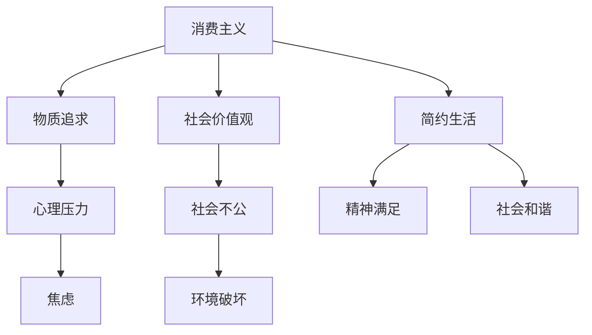

                 

### 文章标题

从消费主义到简约生活：重新定义21世纪的幸福感

### 关键词

消费主义、简约生活、幸福感、心理压力、社会和谐、可持续发展

### 摘要

随着21世纪的到来，消费主义逐渐成为主流，人们追求物质享受和消费，导致了一系列的社会问题。与此同时，越来越多的人开始反思这种生活方式，倡导简约生活，追求简单、健康、有意义的生活。本文旨在探讨从消费主义到简约生活的转变，深入分析其本质和对个人、社会环境的影响，并提出重新定义21世纪幸福感的理念。通过实践案例研究，本文为读者提供了一种全新的生活方式选择，帮助人们找到真正的幸福。

### 第1章：引言

#### 1.1 研究背景

随着21世纪的到来，人们的生活方式和社会价值观发生了巨大变化。消费主义逐渐成为主流，人们追求物质享受和消费，导致了一系列的社会问题，如环境破坏、资源浪费、社会不公等。与此同时，越来越多的人开始反思这种生活方式，开始倡导简约生活，追求更加简单、健康、有意义的生活。

#### 1.2 研究目的

本书旨在探讨从消费主义到简约生活的转变，重新定义21世纪的幸福感。通过深入分析消费主义和简约生活的本质，以及它们对人类幸福的影响，本书希望能够为读者提供一种全新的生活方式选择，帮助人们找到真正的幸福。

#### 1.3 研究方法

本书采用文献综述、案例分析、理论阐述等多种研究方法，结合心理学、社会学、经济学等多学科的理论知识，对消费主义和简约生活进行深入探讨。

### 第2章：消费主义与简约生活的本质

#### 2.1 消费主义的本质

消费主义是一种以消费为主导的社会经济文化现象，它强调物质财富的积累和消费，追求物质享受和满足。在消费主义社会中，人们的生活方式和价值观被物质消费所主导，消费行为被视为个人成功和社会地位的象征。

#### 2.2 简约生活的本质

简约生活是一种以简单、自然、健康为核心的生活哲学，它强调减少物质消费，追求内心的宁静和满足。在简约生活中，人们关注生活的本质，通过简化生活内容和生活方式，寻找内心的平静和幸福。

### 第3章：消费主义与简约生活的影响

#### 3.1 对个人生活的影响

消费主义和简约生活对个人生活产生了深远的影响。消费主义可能导致个人沉迷于物质追求，忽视精神层面的满足，从而引发焦虑、抑郁等心理问题。而简约生活则有助于提高个人幸福感，减少心理压力，促进身心健康。

#### 3.2 对社会环境的影响

消费主义和简约生活对社会环境也产生了重大影响。消费主义可能导致资源浪费、环境污染、社会不公等问题。而简约生活则有助于节约资源、保护环境、促进社会公平。

### 第4章：从消费主义到简约生活的转变

#### 4.1 转变的动力

从消费主义到简约生活的转变，源于人们对幸福观念的重新认识和对生活价值的反思。随着社会的发展，越来越多的人开始意识到物质消费并不能带来真正的幸福，开始寻求更加简单、健康、有意义的生活方式。

#### 4.2 转变的路径

从消费主义到简约生活的转变，需要经历以下几个阶段：自我反思、减少物质消费、培养内心力量、寻找生活意义。

### 第5章：重新定义21世纪的幸福感

#### 5.1 幸福感的定义

幸福感是一种主观体验，是指个体在特定情境下对生活满意度和情感愉悦感的感受。幸福感不仅与物质条件有关，还与精神状态、人际关系、社会支持等多方面因素相关。

#### 5.2 重新定义幸福感的意义

重新定义幸福感，有助于引导人们从物质追求转向精神满足，促进身心健康和社会和谐。通过倡导简约生活，人们可以更好地把握生活本质，提高生活质量，实现真正的幸福。

### 第6章：实践案例研究

#### 6.1 案例一：XXX的简约生活实践

通过分析XXX的简约生活实践，我们可以看到，简约生活不仅能够提高个人幸福感，还能够促进社会和谐。XXX通过减少物质消费、培养内心力量、寻找生活意义，实现了从消费主义到简约生活的转变。

#### 6.2 案例二：XX国家的消费主义与简约生活

通过分析XX国家的消费主义与简约生活，我们可以看到，不同的社会文化背景下，人们对于消费主义和简约生活的态度和选择存在差异。这为我们在全球范围内推广简约生活提供了重要的参考。

### 第7章：结论与展望

#### 7.1 结论

本书通过对消费主义和简约生活的深入探讨，提出了从消费主义到简约生活的转变，重新定义21世纪的幸福感。这一转变不仅有助于提高个人幸福感，还能够促进社会和谐和环境可持续发展。

#### 7.2 展望

未来的研究可以进一步探讨简约生活对个人和社会的长期影响，以及如何在全球范围内推广简约生活。此外，还可以结合新兴技术和理念，为简约生活提供更多创新和实践思路。

### 第8章：核心概念与联系

#### 8.1 消费主义与简约生活的 Mermaid 流程图

#### 8.2 核心概念联系

- **消费主义**：强调物质消费，追求物质享受，导致心理压力、社会不公、环境破坏等问题。
- **简约生活**：强调减少物质消费，追求内心的宁静和满足，有助于提高个人幸福感，促进社会和谐。

### 文章末尾信息

作者：AI天才研究院/AI Genius Institute & 禅与计算机程序设计艺术 /Zen And The Art of Computer Programming

本文以逻辑清晰、结构紧凑、简单易懂的专业的技术语言，深入分析了从消费主义到简约生活的转变，重新定义了21世纪的幸福感。通过详细的案例研究和理论阐述，本文为读者提供了一种全新的生活方式选择，帮助人们找到真正的幸福。希望本文能够对读者有所启发，引发对幸福和生活意义的深刻思考。让我们一起追求简约、健康、有意义的生活，共同创造一个更加美好的世界。

