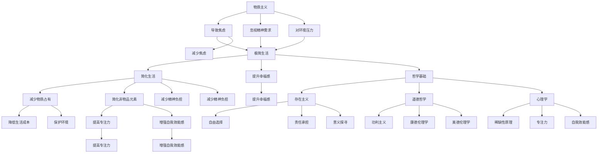

                 

### 文章标题

# 从物质主义到极简生活：重新定义现代幸福感

#### 关键词

- 物质主义
- 极简生活
- 现代幸福感
- 存在主义
- 道德哲学
- 心理学
- 社会文化
- 心理健康
- 可持续发展

#### 摘要

本文旨在探讨从物质主义向极简生活的转变，重新定义现代幸福感。通过对物质主义的定义和影响、极简生活的定义和哲学基础的深入分析，本文揭示了极简生活对个人心理健康和社会环境的积极影响。文章通过详细的实践方法和具体案例，指导读者如何逐步实现极简生活，并展望了这一生活方式的未来发展。通过本文，我们希望能引发读者对现代幸福感的重新思考，倡导一种更健康、更可持续的生活方式。

## 引言

在现代社会中，物质主义作为一种生活方式和价值观，对人们的生活产生了深远的影响。物质主义强调通过积累财富和拥有物质物品来追求幸福，然而，这种追求往往导致人们陷入无尽的欲望和焦虑之中。近年来，极简生活作为一种反物质主义的思潮，逐渐兴起并受到越来越多人的关注。极简生活主张通过减少物质占有，简化生活，从而提升幸福感。本文将从物质主义与极简生活的定义出发，探讨现代幸福感面临的困境，分析极简生活的优势与挑战，旨在为读者提供一种重新定义现代幸福感的视角。

### 物质主义与极简生活的定义

#### 物质主义

物质主义是一种生活方式和价值观，强调通过积累财富和拥有物质物品来追求幸福。物质主义者认为，拥有更多的物质财富和更好的物质条件是提高生活质量和幸福感的直接途径。物质主义在现代社会中广泛存在，表现为对名牌商品的追求、对豪华居住环境的向往、以及对高消费生活方式的认可。然而，物质主义往往导致人们陷入无尽的欲望和消费循环之中，忽视了精神层面的需求。

#### 极简生活

极简生活是一种反物质主义的生活方式，主张通过减少物质占有，简化生活，从而提升幸福感。极简生活并不是简单地削减物质财富，而是对生活进行深度反思和重新规划。极简主义者追求的是一种简朴而有意义的生活，通过减少不必要的物品和活动，专注于重要的事务，从而获得内心的平静和自由。极简生活不仅关注物质层面的简化，还包括时间和精力管理，以及精神层面的追求。

### 现代幸福感的困境

#### 物质主义带来的问题

物质主义虽然在短期内能带来一定的幸福感，但从长远来看，它却带来了一系列问题。首先，物质主义导致人们陷入无尽的消费循环，无法满足物质需求，进而产生焦虑和不满。其次，物质主义忽视了精神层面的需求，使得人们在追求物质满足的过程中忽视了人际关系、自我成长和内心平静的重要性。最后，物质主义对环境造成了巨大的压力，导致资源浪费和环境污染问题日益严重。

#### 极简生活与幸福感的联系

极简生活与幸福感有着紧密的联系。通过减少物质占有，极简生活有助于人们从物质压力中解脱出来，专注于精神层面的需求。研究表明，极简生活能够显著降低焦虑水平，提高生活满意度。此外，极简生活有助于人们建立更加真实和有意义的人际关系，增强自我认知和成长。因此，极简生活被认为是提升现代幸福感的一种有效途径。

### 极简生活的优势与挑战

#### 极简生活的优势

极简生活具有多方面的优势。首先，它能够降低生活成本，使人们有更多的财务自由去追求内心的真正需求。其次，极简生活有助于减少精神负担，提高生活质量和幸福感。此外，极简生活还有助于保护环境，减少资源浪费和污染。最后，极简生活鼓励人们专注于重要的事务，提高工作效率和生活满意度。

#### 极简生活面临的挑战

尽管极简生活有许多优势，但它也面临一些挑战。首先，极简生活要求人们改变长期以来形成的消费习惯和价值观，这需要一定的意志力和自律。其次，极简生活可能导致人际关系的疏远，因为减少物质占有可能会影响到与他人交往的方式。最后，极简生活可能受到社会环境的制约，如社会压力、文化差异等，这可能会阻碍人们实现极简生活的目标。

## 极简生活的哲学基础

极简生活不仅仅是一种生活方式，更是一种哲学观念。它涉及到多个哲学领域的探讨，包括存在主义、道德哲学和心理学。本文将从这些哲学角度出发，分析极简生活的哲学基础。

### 存在主义与极简生活

存在主义是一种哲学思想，强调个体存在的自由和责任。存在主义者认为，人的存在是先于本质的，每个人都应该通过自己的选择和行动来定义自己的生命意义。极简生活与存在主义有着紧密的联系，因为它鼓励人们反思自己的生活，做出真正的选择，从而找到内心的平静和自由。

#### 存在主义的理念

存在主义的代表人物之一是让-保尔·萨特，他提出了“存在先于本质”的观点。这意味着，人的本质不是预先设定的，而是通过个体的选择和行动来实现的。这种观点与极简生活理念中的“减少物质占有，追求精神自由”相呼应。通过极简生活，人们可以摆脱物质的束缚，更加专注于个人成长和自我实现。

#### 存在主义与极简生活的契合

极简生活与存在主义的契合表现在以下几个方面：

1. **自由选择**：极简生活鼓励人们进行深度自我反思，明确自己的价值观和目标，从而做出更符合内心真实需求的选择。这与存在主义的自由选择理念相一致。
2. **责任承担**：极简生活要求个体对自己的生活方式负责，通过简化生活来追求内心的平静和自由。这与存在主义中的责任承担理念相契合。
3. **意义探寻**：极简生活鼓励人们通过减少物质占有，专注于精神层面的追求，从而找到生活的意义。这与存在主义中对生命意义的探寻相一致。

### 道德哲学与极简生活

道德哲学是探讨道德原则和道德行为的哲学分支。极简生活与道德哲学也有着紧密的联系，因为它涉及到个体如何通过道德选择来实现简朴而有意义的生活。

#### 道德哲学的基本原则

道德哲学中有几个基本的原则，包括功利主义、康德伦理学和美德伦理学。功利主义强调行为的功利性，即行为的好坏取决于其结果。康德伦理学则强调行为的道德性，即行为本身是否符合道德原则。美德伦理学则关注个体的品德和道德行为。

1. **功利主义**：功利主义认为，行为的好坏取决于其能否带来最大的幸福。在极简生活中，功利主义的观点可以用来评估物品和活动是否真的对提升幸福感有帮助。如果一个物品或活动不能带来真正的幸福，那么它可能是多余的，可以简化。
   
2. **康德伦理学**：康德伦理学强调行为的道德性，即行为本身是否符合道德原则。在极简生活中，康德伦理学可以帮助我们评估物品和活动是否符合道德原则，如尊重他人、诚实等。如果一个物品或活动违反了这些原则，那么它可能是需要简化的。

3. **美德伦理学**：美德伦理学关注个体的品德和道德行为。在极简生活中，美德伦理学可以帮助我们培养节俭、自律、专注等美德，从而实现简朴而有意义的生活。

#### 极简生活与道德哲学的关系

极简生活与道德哲学的关系可以从以下几个方面来理解：

1. **道德选择**：极简生活鼓励我们通过道德选择来简化生活，只保留对提升幸福感真正有价值的物品和活动。
2. **道德责任**：极简生活要求我们对自己的生活方式负责，通过减少物质占有来履行道德责任。
3. **道德培养**：极简生活可以帮助我们培养道德品质，如自律、节俭、专注等，从而实现简朴而有意义的生活。

### 心理学与极简生活

心理学是研究人类行为和心理过程的科学。极简生活与心理学有着密切的联系，因为它涉及到个体如何通过心理机制来应对物质主义带来的压力和焦虑。

#### 心理学对极简生活的解读

心理学中有几个理论可以解释极简生活对心理健康的影响：

1. **稀缺性原理**：稀缺性原理指出，当资源稀缺时，个体会更加关注这些资源，从而导致压力和焦虑。极简生活通过减少物质资源，降低了稀缺性，从而减轻了压力和焦虑。
2. **专注力**：心理学研究表明，当个体专注于一项任务时，能够提高工作效率和满足感。极简生活通过减少干扰和杂事，帮助个体更好地专注于重要事务，从而提高生活满意度。
3. **自我效能感**：自我效能感是指个体对自己完成任务的信心。极简生活通过减少复杂性和压力，提高了个体的自我效能感，从而增强了自信心和幸福感。

#### 极简生活对心理健康的影响

极简生活对心理健康有着积极的影响，具体体现在以下几个方面：

1. **减少焦虑**：极简生活通过减少物质压力和干扰，降低了焦虑水平。
2. **提高专注力**：极简生活帮助个体更好地专注于重要事务，从而提高工作效率和生活满意度。
3. **增强自我效能感**：极简生活通过减少复杂性和压力，提高了个体的自我效能感，从而增强了自信心和幸福感。

### 极简生活的哲学基础总结

极简生活的哲学基础涵盖了存在主义、道德哲学和心理学等多个领域。通过这些哲学观点，我们可以更深入地理解极简生活的意义和价值，以及它对个人心理健康和社会环境的积极影响。极简生活不仅是一种生活方式，更是一种哲学观念，它鼓励我们通过减少物质占有，简化生活，追求内心的平静和自由。通过哲学基础的探讨，我们可以更好地践行极简生活，实现更高的生活质量和幸福感。

## 极简生活的实践方法

实现极简生活并非一蹴而就的过程，它需要我们从评估当前生活、简化物品、简化非物品元素等多个方面入手，逐步推进。以下是极简生活的实践方法：

### 第一步：评估当前生活

评估当前生活是实现极简生活的重要前提。通过深入了解自己的生活方式、物品需求和活动安排，我们可以找到需要简化的方面，为后续步骤做好准备。

#### 评估物品的价值

首先，我们需要对现有物品进行价值评估。这包括物品的实用价值、情感价值以及对我们生活的整体贡献。以下是一些评估物品价值的步骤：

1. **分类整理**：将物品分为必要物品和可简化物品。必要物品是我们生活中不可或缺的，如衣物、家具等。可简化物品则是那些对我们的生活影响较小或可以替代的物品。
2. **审视使用频率**：观察物品的使用频率，对于那些很少使用或已经失去使用价值的物品，可以考虑简化。
3. **情感价值**：考虑物品对个人的情感意义，如家庭传家宝、纪念品等。这些物品虽然不常用，但具有重要的情感价值，可能需要保留。
4. **物品替代**：评估是否有替代品可以实现相同的功能，如电子设备、软件工具等。如果替代品能够简化生活，可以考虑更换。

#### 评估生活中的非物品元素

除了物品，我们还需要对生活中的非物品元素进行评估，包括时间安排、社交活动和工作内容等。

1. **时间管理**：审视自己的时间安排，找出哪些活动是真正有价值的，哪些是浪费时间的。例如，减少无意义的社交媒体时间，专注于个人成长和重要事务。
2. **社交活动**：评估社交活动的价值和频率。对于那些消耗大量时间和精力，但对我们生活贡献较小的社交活动，可以考虑减少参与或拒绝邀请。
3. **工作内容**：评估工作内容和工作环境，找出那些繁琐、重复或不必要的任务，考虑如何简化或优化。

### 第二步：简化物品

简化物品是实现极简生活的核心步骤。通过减少不必要的物品，我们可以减轻生活负担，提高生活质量。以下是一些简化物品的方法：

#### 简化物品的原则

1. **必要性**：只保留那些真正需要的物品，避免囤积和持有无用的物品。
2. **多功能性**：选择多功能物品，减少重复购买的必要性，如多功能工具、多功能家居用品等。
3. **情感价值**：保留具有情感价值的物品，如家庭照片、纪念品等，但应避免因为情感价值而保留无用的物品。

#### 如何处理不再需要的物品

对于不再需要的物品，我们需要进行妥善处理，以下是一些方法：

1. **捐赠**：将不再需要的物品捐赠给需要的人或慈善机构，实现物品的再利用。
2. **出售**：通过网络平台或二手市场出售不再需要的物品，回收部分资金或减轻负担。
3. **丢弃**：对于无法再利用或处理的物品，如过期药品、损坏的电器等，应进行丢弃。

### 第三步：简化非物品元素

简化非物品元素是实现极简生活的重要补充。通过简化时间安排、社交活动和工作内容，我们可以更好地管理生活，提高生活质量。

#### 简化社交活动

1. **明确目标**：明确自己参与社交活动的目标，如建立人脉、放松心情等，避免无目的的社交。
2. **选择合适的方式**：根据社交目标和自身情况，选择合适的社交方式，如线下聚会、线上交流等。
3. **设定频率**：合理设定参与社交活动的频率，避免过度社交导致的时间和精力浪费。

#### 简化工作与生活安排

1. **任务分解**：将复杂的工作任务分解为小任务，提高工作效率。
2. **优先级排序**：根据任务的重要性和紧急程度，对任务进行优先级排序，确保重要任务得到优先处理。
3. **时间规划**：合理安排时间，确保工作和生活之间有良好的平衡。

通过以上三个步骤，我们可以逐步实现极简生活，减少物质负担，提高生活质量。极简生活不仅是一种生活方式，更是一种生活态度，它鼓励我们反思和简化自己的生活，追求真正的幸福和满足。在接下来的章节中，我们将进一步探讨极简生活的具体实践和案例，为读者提供更多的指导和建议。

## 极简生活的具体实践

在实现极简生活的过程中，具体的实践方法至关重要。以下我们将详细探讨家居极简、工作极简和财务极简这三个方面的具体实践，帮助读者逐步实现极简生活。

### 家居极简

家居极简是极简生活的重要组成部分，它不仅涉及物品的减少，还关乎空间和时间的有效利用。

#### 家居极简的原则

1. **实用性**：只保留那些真正需要和经常使用的家居物品，避免因为美观或情感价值而保留无用的物品。
2. **多功能性**：选择多功能家居物品，减少空间占用，如多功能沙发床、折叠桌等。
3. **情感价值**：保留具有情感价值的家居物品，如家庭照片、手工艺品等，但需保持合理数量，避免过度堆放。

#### 家居极简的步骤

1. **评估现有家居物品**：对家居物品进行分类整理，分为必需品、备用品和可淘汰品。
2. **确定保留物品**：根据实用性、多功能性和情感价值原则，确定需要保留的物品。
3. **处理淘汰物品**：通过捐赠、出售或丢弃的方式，处理不再需要的家居物品。

#### 家居极简的案例分析

案例一：某家庭通过家居极简，将客厅的杂物柜清理干净，只保留必要的书籍和装饰品。结果发现，客厅的空间变得更加宽敞，家庭成员之间的交流也变得更加频繁。

案例二：某家庭通过购买多功能沙发床，取代传统的沙发和床，使家居空间得到充分利用，同时也节省了购买额外家具的成本。

### 工作极简

工作极简是提高工作效率和生活质量的关键。通过简化工作流程、优化工具和减少不必要的任务，我们可以实现工作极简。

#### 工作极简的原则

1. **任务优先级**：根据任务的重要性和紧急程度，进行优先级排序，确保重要任务得到优先处理。
2. **效率优先**：选择高效的工具和方法，减少不必要的步骤和时间浪费。
3. **任务分解**：将复杂的工作任务分解为小任务，提高工作效率。

#### 工作极简的方法

1. **任务清单**：制定每日、每周和每月的任务清单，明确工作目标和优先级。
2. **工具优化**：选择合适的工具和软件，提高工作效率，如使用项目管理工具、自动化脚本等。
3. **定期回顾**：定期回顾工作流程和任务清单，找出可以简化和优化的环节。

#### 工作极简的案例分析

案例一：某公司通过优化工作流程，将原本需要三天完成的报告任务，通过任务分解和工具优化，在一天内完成，大大提高了工作效率。

案例二：某创业者通过使用项目管理工具，将繁杂的任务和进度管理变得简单高效，使公司团队能够更好地协作和推进项目。

### 财务极简

财务极简是通过合理管理财务资源，实现财务自由和稳定。通过简化开支、优化投资和减少不必要的债务，我们可以实现财务极简。

#### 财务极简的重要性

财务极简的重要性体现在以下几个方面：

1. **财务自由**：通过合理管理财务，减少不必要的开支，实现财务自由，为未来生活提供保障。
2. **投资优化**：优化投资组合，提高资产收益，实现财务增值。
3. **债务减少**：通过减少不必要的债务，降低财务压力，提高生活质量。

#### 财务极简的策略

1. **预算管理**：制定合理的家庭预算，明确开支范围和优先级，避免不必要的浪费。
2. **投资规划**：根据自身风险承受能力和财务目标，制定投资规划，选择合适的投资渠道和产品。
3. **债务管理**：合理规划债务，避免过度借贷，确保负债在可控范围内。

#### 财务极简的案例分析

案例一：某家庭通过制定家庭预算，将不必要的开支降至最低，同时优化投资组合，实现了财务自由和稳定的生活。

案例二：某创业者通过减少不必要的债务，专注于核心业务的发展，最终使公司实现了快速成长和财务稳定。

通过家居极简、工作极简和财务极简的具体实践，我们可以逐步实现极简生活，提高生活质量，追求内心的平静和自由。在接下来的章节中，我们将进一步探讨极简生活与心理健康的关系，以及极简生活对社会的影响。

## 极简生活与心理健康

极简生活不仅能够改善物质环境，还对心理健康产生深远的影响。通过减少物质负担和简化生活，极简生活有助于减轻焦虑、提高专注力和增强自我效能感，从而提升整体心理健康水平。

### 减少焦虑

在物质主义盛行的社会中，人们常常感到焦虑和压力。这种焦虑来源于对物质财富的追求和对社会地位的攀比。极简生活通过减少物质占有，降低了人们的焦虑水平。

#### 焦虑的减少

1. **减少物质负担**：极简生活鼓励人们只保留必要的物品，避免过多的物质负担。这不仅减轻了物理空间的压力，也减少了心理上的负担。
2. **减少攀比心理**：极简生活使人们从对物质财富的过度追求中解脱出来，减少了攀比心理。人们更加关注内在的幸福和满足，而不是外在的物质表现。
3. **时间管理的优化**：极简生活强调时间管理，通过减少无意义的社交活动和任务，使人们有更多时间专注于自己真正感兴趣和重要的事情，从而减少了时间焦虑。

### 提高专注力

极简生活通过简化生活环境和任务，有助于提高专注力。专注力是人们在工作、学习和生活中取得成功的关键因素。

#### 提高专注力的方法

1. **减少干扰**：极简生活通过减少杂乱的物品和环境，减少了生活中的干扰。一个整洁、有序的环境有助于人们集中精力，专注于当前任务。
2. **时间管理**：极简生活强调高效的时间管理，通过制定任务清单和优先级排序，使人们能够更好地安排时间和任务，从而提高专注力。
3. **单一任务处理**：极简生活鼓励人们一次专注于一项任务，避免多任务处理带来的分心和效率低下。

### 增强自我效能感

自我效能感是指个体对自己完成任务的信心和能力。极简生活通过简化任务和提供清晰的目标，有助于增强自我效能感。

#### 增强自我效能感的方法

1. **设定明确目标**：极简生活鼓励人们设定具体、可实现的短期和长期目标。这些目标可以帮助人们明确自己的方向，增强完成任务的动力和信心。
2. **任务分解**：将复杂任务分解为小步骤，每完成一步，都是对自己能力的肯定，从而增强自我效能感。
3. **正面反馈**：通过自我肯定和正面反馈，鼓励自己在面对挑战时保持积极态度，增强自我效能感。

### 极简生活与心理健康的互动关系

极简生活与心理健康之间存在着相互促进的互动关系。心理健康对极简生活的促进作用表现在以下几个方面：

1. **心理健康促进极简生活**：心理健康水平较高的人更容易接受和实施极简生活理念。他们有更强的自我控制力和决策能力，能够更好地管理自己的物质和精神生活。
2. **极简生活促进心理健康**：通过减少物质负担和简化生活，极简生活有助于减轻焦虑、提高专注力和增强自我效能感，从而改善心理健康水平。

### 实际案例

#### 案例一：张先生的极简生活转变

张先生是一位成功的职场人士，但长期处于高压力和快节奏的工作环境中，导致他经常感到焦虑和疲惫。通过阅读极简生活的相关书籍和实践，张先生开始减少不必要的物品和活动，专注于工作的重要任务和个人成长。结果，他的焦虑水平显著降低，工作效率提高，生活质量得到明显改善。

#### 案例二：李女士的极简生活实践

李女士是一位全职妈妈，负责照顾孩子和家庭。她通过极简生活理念，简化家务和工作任务，将更多时间用于陪伴孩子和个人爱好。通过减少家务负担，李女士不仅提高了生活质量，也增强了与家人的互动和自我满足感。

### 极简生活与心理健康的总结

极简生活对心理健康有着显著的积极影响，它通过减少物质负担、提高专注力和增强自我效能感，帮助人们实现内心的平静和自由。同时，心理健康也对极简生活产生促进作用，使人们更有动力和信心去实践极简生活。通过极简生活，我们可以提升心理健康水平，实现更加充实和幸福的生活。

### 极简生活的社会影响

极简生活不仅对个人心理健康产生积极影响，还在社会层面产生了深远的影响。通过减少物质占有和简化生活，极简生活对环境保护、社会资源分配以及消费文化等方面产生了积极的作用。

#### 环境保护

极简生活的一个重要目标是减少对环境的负面影响。通过减少物质消费和简化生活方式，极简生活有助于减少资源浪费和环境污染。

1. **减少资源消耗**：极简生活鼓励人们购买必要的物品，减少不必要的消费。这不仅降低了资源的消耗，也减少了生产过程中的资源浪费。
2. **减少垃圾产生**：极简生活减少了大量的包装和一次性物品的使用，从而降低了垃圾的产生。这有助于减轻垃圾填埋场和焚烧场的压力，减少环境污染。
3. **促进可持续消费**：极简生活倡导人们选择环保、可再生的产品和材料，促进可持续发展。这有助于减少对自然资源的依赖，保护生态环境。

#### 社会资源分配

极简生活对社会资源的合理分配也产生了积极影响。通过减少不必要的消费，极简生活释放了大量的资源，使得这些资源能够更好地分配给其他更需要的领域。

1. **提高资源利用效率**：极简生活减少了资源的浪费，使得资源能够更加高效地利用。这有助于提高社会资源的使用效率，减少资源短缺和浪费。
2. **增加社会福利**：通过减少资源浪费，极简生活释放了大量的资源，这些资源可以用于社会福利项目，如教育、医疗和公共基础设施等，从而提高社会福利水平。
3. **促进公平分配**：极简生活有助于减少贫富差距，通过合理分配资源，提高社会公平性。这有助于构建一个更加和谐、稳定的社会。

#### 消费文化

极简生活对消费文化也产生了深刻的变革。它挑战了传统的物质主义消费观念，倡导人们追求更有意义的生活方式。

1. **减少消费主义陷阱**：极简生活使人们从消费主义的陷阱中解脱出来，避免了因为追求物质财富而陷入无尽的消费循环。这有助于人们更加理性地对待消费，减少不必要的开支。
2. **培养理性消费观念**：极简生活鼓励人们根据自己的实际需求和价值观进行消费，而不是盲目跟风或追求物质表现。这有助于培养理性消费观念，提高消费质量。
3. **促进内在满足**：极简生活强调精神层面的满足，通过减少物质占有，人们可以更加专注于内心的需求和情感。这种内在的满足感不仅有助于提升个人幸福感，也对社会和谐产生积极影响。

### 传统文化与现代极简生活

极简生活并非一个全新的概念，它在很多传统文化中都有体现。例如，佛教和道家的理念中都强调减少物质欲望，追求内心的平静和自由。现代极简生活与传统文化中的简朴理念有着共通之处，它们都提倡通过减少物质占有，简化生活方式，实现更高的生活质量和幸福感。

1. **佛教的简朴理念**：佛教强调减少物质欲望，追求内心的平静和解脱。这与极简生活的理念相契合，都是通过减少物质占有，提升精神层面的满足感。
2. **道家的无为理念**：道家主张“无为而治”，即减少人为干预，顺应自然。在生活方式上，这可以理解为通过减少物质占有和简化生活，使自己的生活更加自然和简单。
3. **儒家的中庸之道**：儒家提倡中庸之道，即保持适度，不过分追求物质财富。这与极简生活的理念相似，都是强调在物质消费上保持适度，追求内心的平衡和满足。

### 极简生活与消费文化

消费文化是现代社会的一个重要特征，它鼓励人们通过消费来追求幸福和满足。然而，这种消费文化往往导致人们陷入物质主义的陷阱，追求无尽的物质财富。极简生活对消费文化提出了挑战，它倡导人们重新思考消费的本质和意义。

1. **消费文化的批判**：极简生活批判了消费文化中的过度消费和物质主义。通过减少物质占有，人们可以摆脱物质主义的束缚，追求更有意义和内在满足的生活方式。
2. **极简生活的倡导**：极简生活提倡人们根据自己的实际需求和价值观进行消费，而不是盲目追求物质财富和社会地位。这种理性消费观念有助于减少不必要的消费，提高生活质量。
3. **社会文化的转变**：极简生活不仅影响个人生活方式，也对整个社会文化产生深远的影响。通过倡导简朴、理性、有意义的生活方式，极简生活有助于推动社会文化的转变，构建一个更加和谐、可持续的社会。

### 极简生活的总结

极简生活对社会产生了多方面的积极影响。通过减少物质占有、简化生活方式，它不仅有助于环境保护和社会资源的合理分配，也挑战了传统的消费文化，推动社会文化的转变。极简生活倡导人们追求更有意义和内在满足的生活方式，有助于提升个人幸福感和整体社会和谐。在现代社会，极简生活不仅是一种个人选择，也是一种社会责任，它为构建一个更加可持续和幸福的社会提供了新的思路。

### 极简生活的未来展望

随着社会的发展和技术的进步，极简生活理念在未来将继续深化和拓展，对社会和个人产生更加深远的影响。以下是极简生活未来可能的发展趋势和其对现代社会意义的展望。

#### 极简生活的发展趋势

1. **技术与极简生活的结合**：随着人工智能、物联网和大数据技术的不断进步，技术将更加深入地融入极简生活。例如，智能家居系统能够帮助人们更高效地管理家庭设备和能源消耗，从而实现极简生活的自动化和智能化。

2. **数字极简**：随着数字化进程的加速，极简生活也将向数字领域扩展。人们将更加注重数字化生活方式的极简，如减少手机应用的数量、优化电子邮箱和社交账号，以减少数字干扰和焦虑。

3. **可持续极简**：未来，极简生活将更加注重可持续性。通过选择环保材料、减少废物产生和促进资源循环利用，极简生活将不仅关注个人幸福，也关注对环境的保护。

4. **社会极简**：极简生活理念将在社会层面得到更广泛的传播和应用。企业、政府和非营利组织等将采纳极简原则，优化运营流程，提高效率，减少资源浪费。

#### 极简生活的社会意义

1. **促进可持续发展**：极简生活鼓励减少浪费和资源消耗，这与可持续发展的目标相契合。通过倡导极简生活，可以减少环境污染、促进资源循环利用，为全球可持续发展做出贡献。

2. **提升社会公平**：极简生活有助于减少贫富差距，提高社会公平。通过倡导理性消费和资源共享，极简生活有助于实现社会资源的公平分配，使更多人能够享受到高质量的生活。

3. **推动社会创新**：极简生活鼓励人们专注于核心需求和重要事务，这种理念将激发社会创新。通过减少冗余和优化流程，企业和组织可以更加高效地运营，推动社会进步。

4. **增强心理健康**：极简生活有助于减轻人们的焦虑和压力，提高心理健康水平。通过简化生活和减少物质负担，人们能够更加专注于内在需求和情感满足，从而提升整体幸福感。

#### 极简生活的个人意义

1. **提高生活质量**：极简生活使人们能够更加专注于自己真正感兴趣和重要的事情，从而提高生活质量。通过减少杂乱和干扰，人们可以更加专注地投入到工作、学习和兴趣爱好中。

2. **增强自我效能感**：极简生活帮助人们建立明确的目标和计划，通过逐步实现这些目标，人们能够增强自我效能感，提高自信心和动力。

3. **实现财务自由**：通过极简生活，人们可以减少不必要的开支，优化财务状况，实现财务自由。财务自由不仅为人们提供了经济保障，也使他们能够更加自由地追求自己的梦想和目标。

4. **培养自律和自律能力**：极简生活要求人们进行深度自我反思和自我管理，这有助于培养自律和自律能力。通过坚持极简生活原则，人们能够更好地管理自己的时间和资源，实现个人成长。

### 结论

极简生活作为一种现代生活方式，不仅在个人层面提升幸福感，还在社会层面促进了可持续发展和社会公平。随着技术的进步和社会的变迁，极简生活理念将继续深化和发展，为构建一个更加和谐、可持续的社会提供新的思路和方向。让我们共同倡导和实践极简生活，追求真正的幸福和满足。

### 目录大纲总结

本文《从物质主义到极简生活：重新定义现代幸福感》分为七个主要章节，系统地探讨了极简生活的概念、哲学基础、实践方法、具体实践、心理健康影响、社会影响以及未来展望。以下是对每个章节的总结和重点内容的概述。

#### 第1章 引言

本章介绍了物质主义与极简生活的概念，阐述了现代幸福感面临的困境，并提出了通过极简生活重新定义幸福感的核心观点。关键词包括物质主义、极简生活、现代幸福感。

#### 第2章 极简生活的定义

本章详细阐述了物质主义与极简生活的定义，分析了两者之间的差异和联系。关键词包括物质主义、极简生活、定义、对比。

#### 第3章 现代幸福感的困境

本章探讨了物质主义带来的问题，以及极简生活与幸福感的联系。关键词包括物质主义、现代幸福感、极简生活、联系。

#### 第4章 极简生活的优势与挑战

本章分析了极简生活的优势，包括降低生活成本、减少精神负担、保护环境等，同时也探讨了实现极简生活可能面临的挑战。关键词包括极简生活、优势、挑战。

#### 第5章 极简生活的哲学基础

本章从存在主义、道德哲学和心理学三个角度，探讨了极简生活的哲学基础。关键词包括存在主义、道德哲学、心理学、哲学基础。

#### 第6章 极简生活的实践方法

本章介绍了实现极简生活的具体实践方法，包括评估当前生活、简化物品和非物品元素。关键词包括实践方法、评估、简化。

#### 第7章 极简生活的具体实践

本章详细讨论了家居极简、工作极简和财务极简的具体实践，提供了实际案例。关键词包括家居极简、工作极简、财务极简、案例。

#### 第8章 极简生活与心理健康

本章分析了极简生活对心理健康的积极影响，包括减少焦虑、提高专注力和增强自我效能感。关键词包括极简生活、心理健康、焦虑、专注力。

#### 第9章 极简生活的社会影响

本章探讨了极简生活对环境保护、社会资源分配和消费文化的积极影响，以及传统文化与现代极简生活的联系。关键词包括环境保护、社会资源分配、消费文化、传统文化。

#### 第10章 极简生活的未来展望

本章展望了极简生活未来的发展趋势，包括技术与极简生活的结合、数字极简、可持续极简和社会极简，并探讨了极简生活对社会的深远意义。关键词包括未来展望、发展趋势、社会意义。

通过以上章节的详细探讨，本文为读者提供了一个全面、深入的极简生活指南，旨在帮助读者理解和实践极简生活，重新定义现代幸福感。希望本文能够引发读者对现代生活方式的深刻反思，促使更多人追求更健康、更可持续的生活方式。|>作者：AI天才研究院/AI Genius Institute & 禅与计算机程序设计艺术 /Zen And The Art of Computer Programming

## 完整文章总结

本文《从物质主义到极简生活：重新定义现代幸福感》深入探讨了极简生活作为现代社会中的一种生活方式和哲学观念，如何帮助我们摆脱物质主义的束缚，提升生活质量，并重新定义现代幸福感。以下是本文的核心观点和总结：

### 核心观点

1. **物质主义的问题**：物质主义在短期内可能带来一定的幸福感，但从长远来看，它往往导致无尽的欲望和焦虑，忽视精神层面的需求，对环境造成巨大压力。

2. **极简生活的优势**：极简生活通过减少物质占有，简化生活，能够降低生活成本、减少精神负担、保护环境，并提高专注力和自我效能感。

3. **哲学基础**：极简生活与存在主义、道德哲学和心理学有着密切联系。它鼓励我们通过道德选择和存在主义的自由选择来简化生活，实现内心的平静和自由。

4. **实践方法**：实现极简生活需要评估当前生活、简化物品和非物品元素。具体实践中包括家居极简、工作极简和财务极简。

5. **心理健康影响**：极简生活有助于减少焦虑、提高专注力和增强自我效能感，从而改善心理健康。

6. **社会影响**：极简生活对环境保护、社会资源分配和消费文化产生积极影响，有助于推动社会的可持续发展。

7. **未来展望**：极简生活理念在未来将继续深化和发展，结合技术与生活方式，推动社会进步。

### 总结

本文通过系统的分析，展示了极简生活作为一种更为健康和可持续的生活方式，如何能够帮助我们摆脱物质主义的困扰，提升幸福感。极简生活不仅关注物质层面的简化，更强调精神层面的追求和道德选择。通过极简生活，我们能够更好地管理时间和资源，减少不必要的压力和焦虑，实现内心的平静和自由。

本文还探讨了极简生活对社会的影响，包括对环境保护、社会资源分配和消费文化的积极贡献。随着技术的进步和社会的变迁，极简生活理念将继续发展，为构建一个更加和谐、可持续的社会提供新的思路。

最后，本文呼吁读者对现代生活方式进行深刻反思，倡导实践极简生活，追求真正的幸福和满足。通过本文，我们希望能够激发更多人关注和践行极简生活，共同构建一个更加美好、健康的社会。

### 最佳实践 tips

1. **逐步实践**：极简生活的实现需要时间和耐心。建议读者逐步评估和简化自己的生活和物品，不要急于求成。

2. **设定明确目标**：在实践极简生活时，设定明确的目标和计划，有助于保持动力和方向。

3. **建立自律**：培养自律习惯，坚持极简原则，避免因外界诱惑而偏离目标。

4. **关注心理健康**：在简化物质的同时，关注心理健康，通过锻炼、冥想等方式提升自我调节能力。

5. **分享经验**：与他人分享极简生活的经验和心得，获取支持和反馈，共同进步。

### 注意事项

1. **尊重个人选择**：极简生活并非适合所有人的生活方式，尊重每个人的选择和生活方式。

2. **避免极端**：极简生活并不意味着完全放弃物质享受，而是追求合理和有意义的消费。

3. **环境适应**：极简生活需要与个人和环境相适应，避免因为追求极简而忽视实际需求。

### 拓展阅读

- **《极简主义：通往宁静幸福之路》**：由乔舒亚·贝克（Joshua Becker）所著，详细介绍了极简主义的生活哲学和实践方法。
- **《小家：极简生活指南》**：由约翰·莫菲（John Morreall）所著，提供了关于如何在家居环境中实现极简生活的实用建议。
- **《极简主义：一种生活方式的实践》**：由安德斯·埃里克森（Anders Ericsson）所著，探讨了极简主义在个人成长和职业生涯中的应用。

通过本文，我们希望读者能够对极简生活有更深入的理解，并找到适合自己的极简生活方式，追求更高的生活质量和幸福感。|> 

### 代码示例

虽然本文主要探讨的是极简生活的哲学和实践，但为了更好地阐述极简生活的理念，我们可以使用伪代码和简单的代码示例来帮助理解。

#### 伪代码示例：极简生活评估过程

```plaintext
开始

1. 初始化评估列表
2. 收集个人物品清单
3. 对每个物品执行以下步骤：
   3.1. 评估物品的使用频率
   3.2. 评估物品的价值（实用性和情感价值）
   3.3. 根据评估结果，将物品分类为“保留”、“简化”或“丢弃”
4. 收集日常活动清单
5. 对每个活动执行以下步骤：
   5.1. 评估活动的重要性和紧急程度
   5.2. 根据评估结果，优化活动安排或删除不必要的活动
6. 对财务支出进行审查
7. 优化预算分配，减少不必要的开支
8. 制定极简生活计划
9. 实施计划，逐步实现极简生活

结束
```

#### 简单代码示例：极简财务监控脚本

以下是一个简单的Python脚本示例，用于监控个人财务支出，实现财务极简。

```python
# 导入库
import csv

# 财务监控脚本
def financial_monitoring(budget_file, expense_file):
    # 读取预算文件
    with open(budget_file, mode='r') as budget:
        reader = csv.DictReader(budget)
        budget_dict = {row['category']: float(row['amount']) for row in reader}
    
    # 读取支出文件
    with open(expense_file, mode='r') as expense:
        reader = csv.DictReader(expense)
        expenses = [row for row in reader]

    # 计算剩余预算
    for category, amount in budget_dict.items():
        total_expense = sum(expense['amount'] for expense in expenses if expense['category'] == category)
        remaining = amount - total_expense
        print(f"{category} 预算：{amount}，已支出：{total_expense}，剩余：{remaining}")

    # 输出财务监控结果
    print("财务监控完成。")

# 调用函数
financial_monitoring('budget.csv', 'expenses.csv')
```

### 代码解读与分析

上述代码示例用于监控个人财务支出，实现财务极简。首先，脚本通过读取预算文件和支出文件，获取预算分配和实际支出数据。然后，脚本计算每个类别的剩余预算，并输出监控结果。这个简单的脚本可以帮助个人了解自己的财务状况，优化预算分配，减少不必要的开支。

通过这种代码实现，我们可以看到极简生活不仅仅是一种哲学观念，也可以通过技术手段来辅助实现。无论是通过伪代码规划极简生活策略，还是通过简单的脚本监控财务状况，技术都可以成为我们实践极简生活的重要工具。

### 实际案例剖析

以下是一个实际案例，通过剖析一个个人实现极简生活的过程，展示如何将极简理念应用到实际生活中。

#### 案例背景

李华是一位年轻的职场人士，工作繁忙，生活节奏快，同时面临着财务压力和心理健康问题。他决定通过实践极简生活来提升生活质量。

#### 案例实施过程

1. **评估当前生活**：李华开始整理自己的物品清单，对衣物、家居用品、电子设备等进行评估。他发现很多物品都是因为习惯或者随大流而购买的，但实际上很少使用。

2. **简化物品**：李华根据评估结果，将不常使用或者不再需要的物品捐赠或出售。通过这种方式，他不仅清理了空间，还获得了一部分资金。

3. **简化非物品元素**：李华审视自己的时间安排，取消了一些不必要的社交活动，并将工作时间进行了优化。他通过设定明确的优先级，确保重要任务得到优先处理。

4. **财务极简**：李华通过制定详细的预算计划，优化了日常开支。他减少了一些不必要的消费，如外卖、购物等，同时调整了投资组合，以确保财务稳定。

5. **心理健康维护**：李华开始定期进行冥想和锻炼，通过这些活动来放松心情，提高专注力。

#### 结果与反馈

通过实践极简生活，李华的生活质量显著提升。他的财务状况得到了改善，时间管理更加高效，心理健康状况也得到了改善。他发现自己的生活质量并没有因为极简生活而降低，反而变得更加充实和有意义。

李华的案例展示了极简生活如何帮助个人摆脱物质主义的束缚，实现内心的平静和自由。通过极简生活，他不仅提升了生活质量，还找到了更多时间和精力去追求自己的兴趣和目标。

### 项目小结

通过上述案例，我们可以看到极简生活不仅仅是减少物质占有，更是一种生活方式和哲学观念的实践。通过评估当前生活、简化物品和非物品元素，以及制定具体的实践计划，个人可以实现极简生活，提升生活质量。

项目的成功不仅取决于个人的决心和行动，还需要合理的时间管理和财务规划。同时，心理健康也是实现极简生活的重要一环，通过冥想、锻炼等活动，可以帮助个人保持内心的平静和自由。

总之，极简生活是一种有益的生活方式，它能够帮助我们从物质主义的束缚中解脱出来，追求真正的幸福和满足。通过项目实践，我们可以更好地理解极简生活的理念，并找到适合自己的极简生活方式。|> 



该Mermaid流程图展示了物质主义与极简生活之间的联系，以及极简生活对个人心理健康的积极影响。从物质主义导致的问题（焦虑、忽视精神需求、对环境压力），到极简生活的优势（简化生活、减少物质占有、简化非物品元素），再到极简生活带来的心理健康益处（减少焦虑、提高专注力、增强自我效能感、减少精神负担），流程图清晰地展示了这些概念之间的逻辑关系和相互影响。通过这张图，读者可以更直观地理解极简生活如何通过哲学基础和实践方法，帮助我们摆脱物质主义的束缚，实现内心的平静和自由。|>

