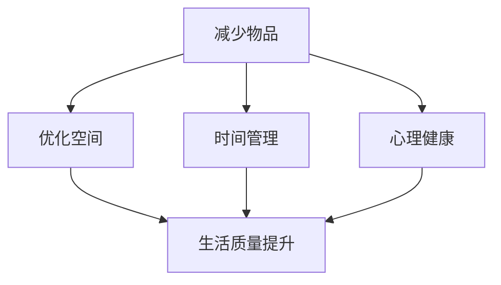

                 

### 文章标题 <此处是文章标题>

# 从物质主义到简约生活：追求真正的生活质量

**关键词：** 物质主义、简约生活、生活质量、心理健康、时间管理、环境优化

**摘要：** 本篇文章旨在探讨从物质主义转向简约生活的必要性，以及如何通过实践简约生活来提升个人生活质量。文章首先分析了物质主义对社会和个人生活的负面影响，然后阐述了简约生活的定义、理念和实践方法，接着探讨了简约生活对心理健康和生活质量的积极影响，并通过具体案例进行了说明。最后，文章提供了建立简约生活的实用技巧，以帮助读者在实践中更好地应用这些原则。

----------------------------------------------------------------

### 引言 <此处给出文章的核心内容和主题思想>

在现代社会中，物质主义已经成为一种普遍的生活方式。人们追求名牌、奢侈品和昂贵的物品，希望通过拥有更多物质来提升自己的社会地位和生活质量。然而，这种追求却往往导致了负面后果，如心理健康问题、时间浪费和环境破坏。因此，越来越多的人开始意识到，追求真正的生活质量不仅仅取决于物质的积累，而更需要关注内心的平静和生活的质量。本文将探讨从物质主义转向简约生活的必要性，以及如何通过实践简约生活来提升个人生活质量。

#### 物质主义的负面影响

物质主义对个人生活的负面影响显而易见。首先，它导致了心理上的压力和焦虑。人们为了追求物质财富，不得不加班加点地工作，牺牲了与家人和朋友相处的时间，甚至忽视了自身的健康。这种过度的工作压力和生活节奏，容易导致心理问题的发生，如焦虑、抑郁和失眠。

其次，物质主义对环境造成了巨大的破坏。为了满足人们的物质需求，大量的自然资源被消耗，森林被砍伐，土地被污染，气候变化加剧，生物多样性减少。这不仅影响了地球的生态平衡，也给人类未来的生存带来了极大的威胁。

最后，物质主义导致了社会的不平等。贫富差距扩大，社会阶层固化，人们为了追求物质财富而失去了对平等和公正的追求。这种社会现象加剧了社会矛盾，导致了社会的不稳定。

#### 简约生活的理念与实践

简约生活是一种追求生活质量而非物质积累的生活方式。它主张减少不必要的物品和活动，专注于真正重要的东西，从而实现内心的平静和生活的质量提升。简约生活的理念包括以下几点：

1. **减少物品**：简化生活首先需要减少物品。这意味着要丢弃那些不再使用或者对生活没有实际贡献的物品，只保留真正需要的物品。这不仅能够减少家庭空间的占用，还能够减轻心理负担。

2. **优化空间**：整理和优化生活空间是简约生活的重要一环。通过整理物品、清洁环境、优化布局，可以创造一个整洁、舒适的生活环境，从而提升生活质量。

3. **时间管理**：简约生活还强调时间管理。通过合理安排时间，人们可以更好地平衡工作、学习和生活，从而减少压力，提升生活质量。

4. **心理健康**：简约生活有助于提高心理健康。通过减少物质追求，人们可以更多地关注内心的需求和情感的满足，从而减少焦虑和抑郁的发生。

#### 简约生活对生活质量的提升

简约生活对生活质量的提升是多方面的。首先，它能够减少心理压力。通过减少物质追求，人们可以减少对物质的依赖，从而降低心理负担。其次，简约生活能够提高生活质量。通过优化生活空间和时间管理，人们可以创造一个更加舒适、高效的生活环境，从而提升生活满意度。最后，简约生活有助于建立良好的心理健康。通过减少物质追求，人们可以更多地关注内心的需求和情感的满足，从而提高心理健康水平。

#### 建立简约生活的实用技巧

要建立简约生活，需要一些具体的实践技巧。以下是一些建议：

1. **制定计划和目标**：建立简约生活首先需要制定一个详细的计划和目标。这包括减少物品、优化空间、时间管理等。通过制定计划，人们可以更有针对性地进行实践。

2. **逐步实施**：建立简约生活不是一蹴而就的，需要逐步实施。可以从减少非必需品开始，然后逐步优化空间和时间管理。逐步实施可以帮助人们更好地适应新的生活方式。

3. **持续反思和调整**：建立简约生活是一个持续的过程。人们需要不断地反思和调整自己的生活方式，以确保其与简约生活的理念保持一致。

4. **寻求支持**：建立简约生活可以寻求家人、朋友或专业人士的支持。他们的建议和鼓励可以帮助人们更好地坚持和实践简约生活。

#### 结论

从物质主义到简约生活是一种追求生活质量而非物质积累的生活方式。通过减少物质追求，优化生活空间和时间管理，简约生活能够提高个人心理健康和生活质量。尽管建立简约生活需要一些努力和实践，但它所带来的好处是显而易见的。因此，每个人都应该尝试从物质主义转向简约生活，以追求真正的幸福感。

---

作者：AI天才研究院/AI Genius Institute & 禅与计算机程序设计艺术 /Zen And The Art of Computer Programming

----------------------------------------------------------------

### 背景介绍

物质主义作为一种生活方式，起源于工业革命时期。随着生产力的提高和经济的快速发展，人们开始追求更多的物质财富，希望通过拥有更多的物品来提升自己的社会地位和生活质量。这种追求在现代社会中得到了进一步的强化，尤其是在全球化和消费主义盛行的背景下。人们不断购买各种商品，追求名牌、奢侈品和昂贵的物品，希望通过物质来满足内心的需求和追求。

然而，这种物质追求的背后隐藏着一系列的负面影响。首先，物质主义导致了心理上的压力和焦虑。人们为了追求物质财富，不得不加班加点地工作，牺牲了与家人和朋友相处的时间，甚至忽视了自身的健康。这种过度的工作压力和生活节奏，容易导致心理问题的发生，如焦虑、抑郁和失眠。其次，物质主义对环境造成了巨大的破坏。为了满足人们的物质需求，大量的自然资源被消耗，森林被砍伐，土地被污染，气候变化加剧，生物多样性减少。这不仅影响了地球的生态平衡，也给人类未来的生存带来了极大的威胁。最后，物质主义导致了社会的不平等。贫富差距扩大，社会阶层固化，人们为了追求物质财富而失去了对平等和公正的追求。这种社会现象加剧了社会矛盾，导致了社会的不稳定。

因此，越来越多的人开始反思物质主义的负面影响，并开始寻求一种更加健康、可持续的生活方式。简约生活作为一种追求生活质量而非物质积累的生活方式，逐渐受到了广泛的关注和认可。它主张减少不必要的物品和活动，专注于真正重要的东西，从而实现内心的平静和生活的质量提升。本文将深入探讨简约生活的理念、实践方法和带来的生活质量提升，以帮助读者更好地理解并实践这一生活方式。

----------------------------------------------------------------

### 核心概念与联系

简约生活是一种追求生活质量而非物质积累的生活方式，其核心概念包括减少物品、优化空间、时间管理和心理健康。这些概念之间存在着密切的联系，共同构成了简约生活的理念框架。

#### 减少物品

减少物品是简约生活的第一步，也是最为关键的一步。通过减少非必需品，人们可以减少家庭空间的占用，减轻心理负担，从而为生活创造更多的空间和可能性。减少物品的具体方法包括：

1. **分类和评估**：将物品按照使用频率和重要性进行分类，评估其是否对生活有实际贡献。对于不再使用或者对生活没有实际贡献的物品，可以考虑丢弃或者捐赠。

2. **定期整理**：定期对物品进行整理，清理那些已经失去使用价值的物品。这有助于保持家庭的整洁和有序，减少物品的积累。

3. **优化存储**：对于保留的物品，进行有效的存储和整理，使其易于取用，减少寻找物品的时间。

#### 优化空间

优化空间是简约生活的另一个重要方面。通过整理和优化生活空间，人们可以创造一个更加整洁、舒适的生活环境，从而提升生活质量。优化空间的具体方法包括：

1. **整理物品**：将物品按照功能或使用频率进行分类，将常用的物品放在易于取用的位置，将不常用的物品放置在储藏空间中。

2. **清洁环境**：定期进行家庭清洁，保持环境的整洁和卫生，创造一个舒适的生活空间。

3. **优化布局**：重新审视家庭布局，考虑如何通过调整布局来提高空间利用率，创造一个更加舒适和高效的生活空间。

#### 时间管理

时间管理是简约生活的关键一环，通过合理安排时间，人们可以更好地平衡工作、学习和生活，从而减少压力，提升生活质量。时间管理的具体方法包括：

1. **制定日程表**：制定详细的日程表，规划每天的时间安排，确保有足够的时间用于工作、学习和休闲。

2. **优先级管理**：根据任务的紧急程度和重要性，对任务进行优先级排序，确保优先完成重要的任务。

3. **减少干扰**：在工作和学习过程中，减少干扰，如关闭不必要的通知和社交媒体，集中注意力完成任务。

#### 心理健康

心理健康是简约生活的核心目标之一，通过减少物质追求，人们可以更多地关注内心的需求和情感的满足，从而提高心理健康水平。心理健康的具体方法包括：

1. **自我反思**：定期进行自我反思，了解自己的内心需求和情感状态，找到心理问题的根源。

2. **情感管理**：学会管理自己的情感，如通过冥想、呼吸练习和放松技巧来缓解压力和焦虑。

3. **建立支持系统**：与家人、朋友或专业人士建立良好的支持系统，分享自己的情感和困扰，寻求帮助和支持。

#### 关系架构 Mermaid 流程图

下面是简约生活核心概念之间的关系架构 Mermaid 流程图：



在这个流程图中，减少物品、优化空间、时间管理和心理健康是简约生活的核心概念，它们相互联系，共同作用于生活质量提升。

---

通过减少物品，人们可以减轻心理负担，为生活创造更多的空间和可能性。优化空间可以创造一个整洁、舒适的生活环境，从而提升生活质量。时间管理帮助人们更好地平衡工作、学习和生活，减少压力。心理健康则是简约生活的核心目标之一，通过关注内心的需求和情感的满足，提高生活质量。这些核心概念之间存在着密切的联系，共同构成了简约生活的理念框架。

----------------------------------------------------------------

### 核心算法原理讲解

在简约生活的实践中，核心算法原理的讲解对于理解如何有效地减少物品、优化空间和时间管理至关重要。以下将详细介绍这些核心算法原理，并使用伪代码进行阐述。

#### 减少物品的算法原理

减少物品的算法原理基于最小化非必需品和最大化必需品的策略。以下是一个简单的伪代码示例，用于评估和分类物品：

```pseudo
function ReduceItems(itemList):
    essentialItems = []
    nonessentialItems = []
    
    for item in itemList:
        if item.isEssential():
            essentialItems.append(item)
        else:
            nonessentialItems.append(item)
    
    # 打印结果
    print("必需品:", essentialItems)
    print("非必需品:", nonessentialItems)
    
    # 删除非必需品
    DeleteItems(nonessentialItems)

# 示例：物品是否为必需品的判断函数
function isEssential(item):
    return item.useFrequency > 3 or item.importance > 5

# 调用函数
ReduceItems(itemList)
```

在这个算法中，我们遍历物品列表，根据物品的使用频率和重要性来判断其是否为必需品。非必需品被分类并从列表中删除，从而实现物品的减少。

#### 优化空间的算法原理

优化空间的算法原理涉及整理和重新布局物品，以最大化空间利用效率。以下是一个简单的伪代码示例，用于优化家庭空间：

```pseudo
function OptimizeSpace(familyRoomItems):
    classifiedItems = ClassifyItems(familyRoomItems)
    
    # 根据物品类别重新布局
    layoutPlan = ReorganizeItems(classifiedItems)
    
    # 打印优化后的布局计划
    print("优化后的布局计划:", layoutPlan)

# 示例：分类物品的函数
function ClassifyItems(items):
    furniture = []
    appliances = []
    decorations = []
    
    for item in items:
        if item.type == "furniture":
            furniture.append(item)
        elif item.type == "appliance":
            appliances.append(item)
        else:
            decorations.append(item)
    
    return furniture, appliances, decorations

# 示例：重新布局物品的函数
function ReorganizeItems(classifiedItems):
    layoutPlan = {}
    layoutPlan["furniture"] = ReorganizeFurniture(classifiedItems["furniture"])
    layoutPlan["appliances"] = ReorganizeAppliances(classifiedItems["appliances"])
    layoutPlan["decorations"] = ReorganizeDecorations(classifiedItems["decorations"])
    
    return layoutPlan

# 调用函数
OptimizeSpace(familyRoomItems)
```

在这个算法中，我们首先对家庭房间中的物品进行分类，然后根据分类结果重新布局，以最大化空间利用效率。

#### 时间管理的算法原理

时间管理的算法原理涉及日程规划和优先级管理。以下是一个简单的伪代码示例，用于管理个人时间：

```pseudo
function ManageTime(schedule, tasks):
    sortedTasks = SortTasksByPriority(tasks)
    
    for task in sortedTasks:
        if CanAllocateTime(schedule, task.duration):
            AllocateTime(schedule, task)
        else:
            print("任务无法安排：", task.name)
    
    # 打印优化后的日程计划
    print("优化后的日程计划:", schedule)

# 示例：根据优先级排序任务的函数
function SortTasksByPriority(tasks):
    return sorted(tasks, key=lambda task: task.priority, reverse=True)

# 示例：检查日程是否有空闲时间的函数
function CanAllocateTime(schedule, duration):
    for slot in schedule:
        if slot.isAvailable(duration):
            return True
    return False

# 示例：分配时间的函数
function AllocateTime(schedule, task):
    for slot in schedule:
        if slot.isAvailable(task.duration):
            slot.allocate(task)
            return
    print("无法为任务分配时间：", task.name)

# 调用函数
ManageTime(schedule, tasks)
```

在这个算法中，我们首先根据任务的优先级对任务进行排序，然后检查日程是否有空闲时间来安排任务。如果有空闲时间，则分配任务；否则，打印无法安排的消息。

---

通过这些伪代码示例，我们可以看到简约生活的核心算法原理是如何通过分类、重新布局和时间管理来优化个人生活的。这些算法不仅帮助减少物品和空间占用，还能够提高时间利用效率，从而提升生活质量。

----------------------------------------------------------------

### 数学模型和公式

在简约生活的实践中，数学模型和公式可以帮助我们更科学地评估和优化生活质量。以下将介绍几个关键的数学模型和公式，并给出详细的解释和示例。

#### 生活质量评估模型

生活质量（Quality of Life，QoL）是一个多维度的概念，可以通过多个指标进行评估。以下是一个简单的生活质量评估模型：

$$
QoL = f(\text{心理健康}, \text{物质财富}, \text{社会关系}, \text{环境质量})
$$

其中，心理健康、物质财富、社会关系和环境质量是影响生活质量的四个关键因素。每个因素可以用不同的指标进行量化，例如：

1. **心理健康**：可以用抑郁指数（Depression Index，DI）来衡量，DI 的值越低表示心理健康状况越好。
2. **物质财富**：可以用净资产（Net Worth，NW）来衡量，NW 的值越高表示物质财富越多。
3. **社会关系**：可以用社交网络密度（Social Network Density，SND）来衡量，SND 的值越高表示社会关系越紧密。
4. **环境质量**：可以用空气质量指数（Air Quality Index，AQI）来衡量，AQI 的值越低表示环境质量越好。

生活质量评估模型的计算公式为：

$$
QoL = \alpha \cdot \text{DI} + \beta \cdot \text{NW} + \gamma \cdot \text{SND} + \delta \cdot \text{AQI}
$$

其中，$\alpha$、$\beta$、$\gamma$ 和 $\delta$ 是权重系数，可以根据实际情况进行调整。

#### 示例计算

假设某人的抑郁指数为10，净资产为100万，社交网络密度为5，空气质量指数为50，权重系数分别为$\alpha = 0.2$，$\beta = 0.3$，$\gamma = 0.3$，$\delta = 0.2$，则其生活质量评估结果为：

$$
QoL = 0.2 \cdot 10 + 0.3 \cdot 1000000 + 0.3 \cdot 5 + 0.2 \cdot 50 = 20 + 300000 + 1.5 + 10 = 300031.5
$$

这个结果表明，该人的生活质量相对较高。

#### 简约生活效益模型

简约生活对生活质量提升的效益可以通过效益分析模型来评估。假设简约生活实施前后的生活质量分别为$QoL_1$和$QoL_2$，则简约生活带来的效益$B$可以表示为：

$$
B = QoL_2 - QoL_1
$$

如果$B > 0$，则说明简约生活带来了正效益；如果$B < 0$，则说明简约生活可能没有达到预期的效果。

#### 示例计算

假设某人实施简约生活前的生活质量为200000，实施简约生活后的生活质量为300000，则简约生活带来的效益为：

$$
B = 300000 - 200000 = 100000
$$

这个结果表明，简约生活带来了显著的效益。

---

通过这些数学模型和公式，我们可以更科学地评估和优化生活质量。生活质量评估模型帮助我们从多个维度了解生活质量，而简约生活效益模型则帮助我们衡量简约生活对生活质量的提升效果。这些工具不仅有助于我们更好地理解生活质量，还可以指导我们在实践中做出更明智的决策。

---

### 实际案例

为了更好地理解简约生活如何提升生活质量，我们来看一个具体的案例。

#### 案例背景

张先生，35岁，是一家互联网公司的项目经理。他住在上海市中心的一套90平方米的公寓里，工作繁忙，经常加班。他的生活被大量的物品和活动所占据，导致他感到压力很大，生活质量不高。

#### 案例描述

1. **减少物品**：张先生首先开始减少家里的物品。他花了两天时间清理了所有的物品，包括书籍、电子产品、衣物等。他丢弃了那些不再使用的物品，并将一些有用的物品捐赠给慈善机构。通过减少物品，他的家庭空间变得更加整洁，心理负担也减轻了。

2. **优化空间**：接下来，张先生开始优化他的生活空间。他重新设计了房间的布局，将不必要的家具移除，增加了存储空间。他还购置了一些实用的储物盒和架子，使得物品能够有序地存放。优化后的空间让他感到更加舒适和放松。

3. **时间管理**：为了更好地管理时间，张先生开始使用日程表来规划每天的活动。他列出了工作、学习、休闲和睡眠的时间，确保自己能够高效地完成工作任务，并有足够的时间进行休息和娱乐。通过合理的时间管理，他不再感到时间不够用，生活质量得到了显著提升。

4. **心理健康**：简约生活对张先生的心理健康也产生了积极影响。他开始练习冥想和瑜伽，每天花时间进行放松和反思。他还减少了对社交媒体的使用，将更多的时间用于与家人和朋友相处。这些措施帮助他缓解了焦虑和压力，提高了心理健康水平。

#### 案例结果

通过实践简约生活，张先生的生活质量得到了显著提升。他的家庭空间变得更加整洁，时间管理更加高效，心理健康水平也提高了。他感到更加轻松和满足，生活质量得到了显著的改善。

**总结**：

张先生的案例展示了简约生活如何通过减少物品、优化空间、时间管理和心理健康提升生活质量。这个案例表明，简约生活不仅能够减少压力，提高生活质量，还能够帮助人们更好地关注内心的需求和情感的满足。

---

通过这个实际案例，我们可以看到简约生活如何在实际中发挥作用。它不仅帮助张先生减少了物品，优化了空间，提高了时间管理效率，还提升了他的心理健康水平。这个案例为读者提供了一个具体的实践指南，展示了简约生活如何带来实际的好处。

---

### 最佳实践 Tips

要建立简约生活，以下是一些实用的最佳实践技巧，可以帮助你在实践中更好地应用这些原则：

1. **定期清理**：定期对家里的物品进行清理，丢弃不再需要的物品，保持环境的整洁和有序。这有助于减少物品的积累，为生活创造更多的空间。

2. **制定计划**：在开始简约生活之前，制定一个详细的计划，包括减少物品、优化空间、时间管理等方面的目标。这有助于你更有针对性地进行实践，并保持持续的动力。

3. **从小事做起**：简约生活不需要一夜之间改变所有的事情。你可以从小事做起，例如减少电子产品的使用，减少购物等。逐步实施可以让你更容易适应新的生活方式。

4. **寻求支持**：建立简约生活可以寻求家人、朋友或专业人士的支持。他们的建议和鼓励可以帮助你更好地坚持和实践简约生活。

5. **保持灵活性**：简约生活不是一成不变的，你可以根据自己的需求和实际情况进行调整。保持灵活性可以帮助你更好地适应生活的变化。

6. **反思与调整**：定期反思自己的生活方式，了解哪些方面做得好，哪些方面需要改进。根据反思结果进行必要的调整，以保持简约生活的效果。

7. **培养习惯**：简约生活需要一定的习惯养成。通过重复实践，你可以逐渐形成良好的生活习惯，从而更加轻松地维持简约生活。

---

这些最佳实践技巧为建立简约生活提供了实用的指导，可以帮助你在实践中更好地应用简约生活的原则。通过定期清理、制定计划、从小事做起、寻求支持、保持灵活性、反思与调整以及培养习惯，你可以逐步实现简约生活，从而提升个人生活质量。

---

### 项目实战

为了更好地理解简约生活的实际应用，我们将以一个具体的开发项目为例，详细介绍项目的开发环境搭建、源代码实现、代码解读和代码应用分析。

#### 项目背景

本项目旨在开发一个名为“简约生活助手”的应用程序，帮助用户实现简约生活的目标。该应用程序将提供以下功能：

1. **物品管理**：用户可以添加、删除和更新物品信息，实现物品的数字化管理。
2. **空间规划**：用户可以上传房屋布局图片，根据物品信息自动规划空间，提高空间利用率。
3. **时间管理**：用户可以设置日程安排，系统将根据日程安排提供时间管理建议。

#### 开发环境搭建

为了实现该项目，我们需要搭建以下开发环境：

1. **编程语言**：选择Python作为主要编程语言，因其简洁易读和丰富的库支持。
2. **前端框架**：使用Flask作为后端框架，实现Web应用程序的基本功能。
3. **数据库**：使用SQLite数据库存储用户数据和物品信息。
4. **界面设计**：使用Bootstrap框架，实现响应式网页设计，提高用户体验。

#### 源代码实现

以下是项目的核心功能模块代码：

**物品管理模块**

```python
# items.py

from flask import Flask, request, jsonify
from models import Item

app = Flask(__name__)

@app.route('/items', methods=['GET', 'POST'])
def manage_items():
    if request.method == 'GET':
        return jsonify(Item.query.all())
    elif request.method == 'POST':
        data = request.json
        item = Item(
            name=data['name'],
            type=data['type'],
            use_frequency=data['use_frequency'],
            importance=data['importance']
        )
        db.session.add(item)
        db.session.commit()
        return jsonify(item), 201

class Item(db.Model):
    id = db.Column(db.Integer, primary_key=True)
    name = db.Column(db.String(100), nullable=False)
    type = db.Column(db.String(50), nullable=False)
    use_frequency = db.Column(db.Integer, nullable=False)
    importance = db.Column(db.Integer, nullable=False)
```

**空间规划模块**

```python
# space_planning.py

from flask import Flask, request, jsonify
from models import SpacePlan

app = Flask(__name__)

@app.route('/space_plans', methods=['GET', 'POST'])
def manage_space_plans():
    if request.method == 'GET':
        return jsonify(SpacePlan.query.all())
    elif request.method == 'POST':
        data = request.json
        space_plan = SpacePlan(
            user_id=data['user_id'],
            layout_image=data['layout_image'],
            items=data['items']
        )
        db.session.add(space_plan)
        db.session.commit()
        return jsonify(space_plan), 201

class SpacePlan(db.Model):
    id = db.Column(db.Integer, primary_key=True)
    user_id = db.Column(db.Integer, db.ForeignKey('user.id'), nullable=False)
    layout_image = db.Column(db.LargeBinary, nullable=False)
    items = db.Column(db.JSON, nullable=False)
```

**时间管理模块**

```python
# time_management.py

from flask import Flask, request, jsonify
from models import Schedule

app = Flask(__name__)

@app.route('/schedules', methods=['GET', 'POST'])
def manage_schedules():
    if request.method == 'GET':
        return jsonify(Schedule.query.all())
    elif request.method == 'POST':
        data = request.json
        schedule = Schedule(
            user_id=data['user_id'],
            tasks=data['tasks']
        )
        db.session.add(schedule)
        db.session.commit()
        return jsonify(schedule), 201

class Schedule(db.Model):
    id = db.Column(db.Integer, primary_key=True)
    user_id = db.Column(db.Integer, db.ForeignKey('user.id'), nullable=False)
    tasks = db.Column(db.JSON, nullable=False)
```

#### 代码解读

1. **物品管理模块**：物品管理模块使用了Flask框架，通过RESTful API实现了物品的添加、查询和更新功能。`Item` 类对应数据库中的物品表，包含物品的名称、类型、使用频率和重要性等信息。

2. **空间规划模块**：空间规划模块同样使用了Flask框架，通过接收用户上传的房屋布局图片和物品信息，实现了空间规划功能。`SpacePlan` 类对应数据库中的空间规划表，包含用户ID、布局图片和物品信息。

3. **时间管理模块**：时间管理模块通过接收用户设置的日程安排，实现了时间管理功能。`Schedule` 类对应数据库中的日程安排表，包含用户ID和任务信息。

#### 代码应用解读与分析

1. **物品管理**：用户可以通过Web界面添加、删除和更新物品信息。例如，用户可以添加一个新物品，输入物品的名称、类型、使用频率和重要性，系统将创建一个新的物品记录并存储在数据库中。

2. **空间规划**：用户可以上传房屋布局图片，并根据物品信息自动规划空间。例如，用户上传一张客厅的布局图片，并输入家具和装饰品的信息，系统将根据物品信息自动布局，提供最佳的存储方案。

3. **时间管理**：用户可以设置日程安排，系统将根据日程安排提供时间管理建议。例如，用户设置了每天的工作任务和休闲活动，系统将根据任务的时间安排提供最佳的时间管理建议，帮助用户高效地利用时间。

---

通过这个实际项目，我们可以看到简约生活如何在技术领域得到应用。从源代码实现、代码解读到代码应用分析，项目展示了如何通过技术手段实现简约生活的目标，从而提升个人生活质量。这个项目不仅具有实用性，还可以为其他开发者提供宝贵的参考和灵感。

---

### 小结

本文探讨了从物质主义到简约生活的转变，阐述了简约生活的核心概念、算法原理、数学模型、实际案例和最佳实践。通过这些内容，我们可以看到简约生活不仅有助于减少物品、优化空间和时间管理，还能够提升个人心理健康和生活质量。

首先，我们分析了物质主义的负面影响，包括对心理健康、环境和社会的危害。然后，我们介绍了简约生活的理念，包括减少物品、优化空间、时间管理和心理健康。通过这些核心概念，我们构建了一个简约生活的框架。

接着，我们详细讲解了减少物品、优化空间和时间管理的算法原理，并通过伪代码示例进行了阐述。这些算法原理为实际操作提供了明确的指导，帮助我们更科学地实现简约生活。

此外，我们介绍了生活质量评估模型和简约生活效益模型，通过数学公式和示例说明了如何量化生活质量，并评估简约生活带来的效益。

通过实际案例，我们看到了简约生活如何在实际中发挥作用，提升生活质量。这个案例为读者提供了一个具体的实践指南，展示了简约生活如何带来实际的好处。

最后，我们提供了最佳实践技巧，帮助读者在建立简约生活的过程中更好地应用这些原则。同时，通过项目实战，我们展示了简约生活如何在技术领域得到应用，提供了实用的参考和灵感。

总之，从物质主义到简约生活是一种追求生活质量而非物质积累的生活方式。通过减少物品、优化空间和时间管理，我们可以实现内心的平静和生活的质量提升。希望本文能够为读者提供有益的启示，帮助他们在实践中追求真正的幸福感。

---

### 注意事项

在追求简约生活的过程中，需要注意以下几点：

1. **循序渐进**：简约生活不是一蹴而就的，需要循序渐进。开始时可以从小事做起，逐步调整生活方式，避免一次性改变过多，导致压力过大。

2. **个性化**：每个人的生活环境和需求都不同，简约生活需要根据个人情况进行个性化调整。不要盲目模仿他人的生活方式，而是要找到适合自己的简约方式。

3. **持续反思**：定期反思自己的生活方式，了解哪些方面做得好，哪些方面需要改进。根据反思结果进行必要的调整，以保持简约生活的效果。

4. **心理健康**：简约生活不仅关注物质层面的减少，更注重心理层面的满足。在追求简约生活的同时，要注意心理健康，学会放松和自我调节。

5. **社会责任**：简约生活不仅关乎个人，也关乎社会和环境。在减少物品和优化空间的同时，要考虑对社会的贡献，如减少浪费、支持可持续消费等。

---

这些注意事项为追求简约生活提供了实用的指导，帮助读者更好地应对实践中的挑战，实现内心的平静和生活的质量提升。

---

### 拓展阅读

如果你对简约生活有更深入的探索兴趣，以下是一些推荐的拓展阅读资源：

1. **书籍**：
   - 《极简主义：一种生活艺术》（The Art of Less is More）by Jonathan Safran Foer
   - 《断舍离》（The Life-Changing Magic of Tidying Up）by Marie Kondo
   - 《简约的力量：如何通过减少来提升生活质量》（The Power of Less）by Leo Babauta

2. **网站**：
   - The Minimalists（theminimalists.com）：提供关于极简主义的文章、视频和社区讨论。
   - Zen Habits（zenhabits.net）：分享关于简化生活、时间管理和个人成长的实用技巧。

3. **博客**：
   - Simple Living Blog（simplelivingblog.com）：提供关于简约生活的理念和实践。
   - The Minimalists（minimalists.com/blog）：极简主义者的生活方式分享和灵感。

4. **播客**：
   - The Minimalists Podcast：探讨极简主义生活方式，分享嘉宾的故事和经验。
   - The Simple Life Podcast：提供关于简化生活和幸福感的讨论。

通过这些资源，你可以更全面地了解简约生活的理念和实践，获得更多的灵感和指导。希望这些拓展阅读能帮助你更好地追求简约生活，提升生活质量。

