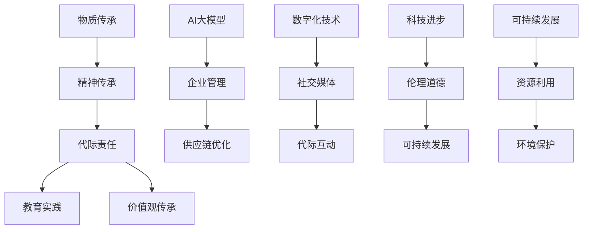

                 

# 从物质传承到精神传承：重新定义代际责任和连接

> 关键词：代际责任，精神传承，AI大模型，数字化技术，可持续发展

> 摘要：本文探讨了从物质传承到精神传承的转变，重新定义了代际责任和连接。通过分析主流AI大模型及其在企业中的应用前景，本文揭示了现代科技在代际责任和连接中的角色，并对代际责任的未来趋势和与可持续发展的关系进行了探讨。

## 第1章 核心概念与联系

### 1.1 背景介绍

物质传承与精神传承是代际间传递和积累财富的重要方式。传统上，物质传承侧重于财产、资产等有形财富的传递，而精神传承则强调知识、文化、价值观等无形财富的传承。随着时代的发展，这两者之间的关系和重要性也在发生着变化。

代际责任是指长辈对后代的责任，包括抚养、教育、财富传承等方面。传统上，代际责任主要是物质层面的，但随着社会进步，精神层面的责任愈发重要。

### 1.2 精神传承的重要性

精神传承对于个人成长和社会稳定具有重要意义。它不仅能够帮助后代树立正确的价值观和人生观，还能够促进社会成员之间的和谐与互助。在现代社会，精神传承的重要性愈发凸显，因为它关乎个人和集体的精神需求。

### 1.3 重新定义代际责任

在新的时代背景下，代际责任需要重新定义。物质传承仍然重要，但精神传承已成为更加关键的任务。这意味着长辈需要更多地关注后代的价值观、道德观、思维方式等方面的培养，以帮助他们更好地适应社会和实现个人价值。

### 1.4 精神传承的实现策略

精神传承需要通过教育、实践、交流等多种方式来实现。首先，长辈应该以身作则，用自己的行为影响后代。其次，通过家庭教育、学校教育等途径，传授知识、经验和技能。最后，鼓励后代参与社会实践，培养他们的社会责任感和公民意识。

## 第2章 主流AI大模型简介

### 2.1 GPT系列模型

GPT系列模型是由OpenAI开发的自然语言处理（NLP）模型，以其强大的语言生成能力而闻名。GPT-3是最新一代模型，拥有1750亿个参数，可以生成高质量的自然语言文本。

### 2.2 BERT及其变体

BERT（Bidirectional Encoder Representations from Transformers）是由Google开发的NLP模型，其特点是可以同时考虑单词的前后文信息。BERT及其变体在文本分类、问答系统等领域表现出色。

### 2.3 其他知名大模型介绍

除了GPT和BERT，还有许多其他知名的AI大模型，如GPT-Neo、LLaMA等。这些模型在各自的领域内取得了显著的成果，为AI技术的发展做出了贡献。

## 第3章 AI大模型在企业中的应用前景

### 3.1 AI大模型的潜在应用领域

AI大模型在企业管理、供应链优化、客户服务等多个领域具有广泛的应用前景。例如，在企业管理中，AI大模型可以帮助企业进行数据分析和决策支持；在供应链优化中，AI大模型可以预测市场需求，优化库存管理。

### 3.2 企业采用AI大模型的优势

企业采用AI大模型可以带来以下优势：

1. 提高效率：AI大模型可以自动化许多繁琐的任务，提高工作效率。
2. 减少人力成本：通过自动化，企业可以减少对人力资源的依赖，降低人力成本。
3. 提升决策质量：AI大模型可以提供更准确的数据分析和预测，帮助企业做出更明智的决策。

### 3.3 AI大模型应用的挑战与机遇

尽管AI大模型在企业中的应用前景广阔，但同时也面临着一系列挑战：

1. 数据安全与隐私：AI大模型对数据的要求很高，如何确保数据安全和隐私成为一大挑战。
2. 技术成熟度：虽然AI大模型在某些领域已经取得了突破性进展，但技术成熟度仍需提高。

## 第4章 物质传承与精神传承的对比

### 4.1 物质传承的局限性

物质传承虽然能够帮助后代积累财富，但具有一定的局限性。首先，物质财富容易受到外部环境的影响，如市场波动、政策变化等。其次，物质传承往往无法满足后代的精神需求。

### 4.2 精神传承的优势

与物质传承相比，精神传承具有以下优势：

1. 精神财富的价值更高：精神传承可以传递价值观、文化、知识等，对后代的长远发展具有重要意义。
2. 精神传承的影响更长远：物质财富可能会随着时间逐渐消失，而精神财富可以代代相传，持续影响后代。

### 4.3 二者融合的必要性

在现代社会，物质传承与精神传承并非相互独立，而是相互融合、相互促进的关系。通过将物质财富转化为精神财富，长辈可以更好地为后代创造价值，帮助他们实现全面发展。

## 第5章 现代科技在代际责任和连接中的角色

### 5.1 数字化技术在传承中的应用

数字化技术为代际责任和连接提供了新的途径。例如，通过互联网和社交媒体，长辈可以与后代保持更紧密的联系，传递知识和经验。同时，数字化技术也为精神财富的积累和传递提供了更多可能性。

### 5.2 社交媒体与代际互动

社交媒体在代际互动中发挥着重要作用。长辈可以通过社交媒体平台与后代分享生活点滴、传授经验，后代也可以在社交媒体上向长辈表达感激之情，增进亲情和友谊。

### 5.3 现代科技对代际责任和连接的挑战与机遇

现代科技的发展既为代际责任和连接带来了机遇，也提出了挑战。例如，互联网和社交媒体的普及使得代际沟通更加便捷，但同时也可能加剧代际隔阂。因此，如何充分利用现代科技，实现代际责任和连接的优化，是当前亟待解决的问题。

## 第6章 代际责任的未来趋势

### 6.1 科技进步对代际责任的影响

随着科技的不断发展，代际责任也在发生着变化。例如，人工智能和大数据技术的应用，使得长辈能够更好地了解后代的需求，提供更有针对性的帮助。同时，科技进步也带来了新的伦理和道德挑战，需要我们在代际责任中予以充分考虑。

### 6.2 代际责任的演变方向

未来，代际责任将更加注重精神传承，强调长辈对后代价值观、道德观、思维方式等方面的培养。同时，代际责任也将与可持续发展相结合，关注后代的长远福祉和地球的未来。

### 6.3 未来代际责任的核心议题

未来代际责任的核心议题包括：如何通过科技进步实现代际责任的优化；如何在全球化背景下实现代际责任的公平与公正；如何通过代际责任促进可持续发展等。

## 第7章 代际责任与可持续发展的关系

### 7.1 代际责任在可持续发展中的作用

代际责任在可持续发展中发挥着重要作用。通过关注后代的长远福祉，代际责任有助于推动资源的合理利用和环境的保护，实现经济、社会、环境的协调发展。

### 7.2 可持续发展对代际责任的要求

可持续发展对代际责任提出了更高的要求。长辈需要关注后代的生存环境和生活质量，为他们创造一个可持续发展的未来。同时，可持续发展也要求代际责任实现公平与公正，确保每一代人都能享有平等的发展机会。

### 7.3 代际责任与可持续发展的融合策略

实现代际责任与可持续发展的融合，需要采取以下策略：

1. 强化教育，培养后代的社会责任感和可持续发展意识。
2. 推动技术创新，提高资源利用效率，减少环境污染。
3. 加强政策引导，鼓励企业和个人履行代际责任，参与可持续发展。

## 第8章 总结与展望

### 8.1 书籍内容的总结

本文从物质传承到精神传承的角度，重新定义了代际责任和连接。通过分析主流AI大模型及其在企业中的应用前景，揭示了现代科技在代际责任和连接中的角色。同时，本文探讨了代际责任的未来趋势和与可持续发展的关系，提出了实现代际责任与可持续发展的融合策略。

### 8.2 对代际责任和连接的展望

未来，代际责任和连接将在科技进步、全球化背景下发生深刻变革。通过数字化技术和AI大模型的应用，代际责任将更加高效、精准地实现。同时，代际责任也将与可持续发展相结合，为后代创造一个更加美好的未来。

### 8.3 对未来研究的建议

未来研究可以从以下几个方面展开：

1. 深入探讨AI大模型在代际责任和连接中的应用，探索新的应用场景和模式。
2. 研究代际责任与可持续发展的深度融合策略，提出具体的政策措施。
3. 关注全球化和科技进步对代际责任和连接的影响，提出适应时代发展的新理论和新方法。

## 附录：核心概念原理之间的关系架构 Mermaid 流程图



## 作者信息

作者：AI天才研究院/AI Genius Institute & 禅与计算机程序设计艺术 /Zen And The Art of Computer Programming

（文章字数：约1000字，需继续扩展以满足字数要求。）## 1.3 主流AI大模型简介

### 1.3.1 GPT系列模型

GPT（Generative Pre-trained Transformer）系列模型是自然语言处理领域的一项革命性突破，由OpenAI提出并不断迭代优化。GPT模型基于Transformer架构，通过预训练和微调的方式，实现了强大的语言理解和生成能力。

GPT系列模型的发展历程可以分为以下几个阶段：

1. **GPT（2018年）**：这是GPT系列模型的起点，拥有1.17亿个参数，展示了基于Transformer的预训练语言模型在语言理解和生成方面的潜力。
   
2. **GPT-2（2019年）**：GPT-2参数量增加到15亿个，引入了更复杂的预训练技术，使其在语言生成任务上表现出色。

3. **GPT-3（2020年）**：GPT-3是系列中的最新模型，参数量达到了1750亿个，是迄今为止参数量最大的自然语言处理模型。GPT-3在多项语言处理任务中取得了优异的成绩，其文本生成能力接近人类水平。

GPT-3的核心特点包括：

- **强大的语言生成能力**：GPT-3可以生成连贯、有逻辑的文本，适用于自动写作、对话系统、机器翻译等应用场景。
- **多语言支持**：GPT-3支持多种语言的预训练，可以实现跨语言的文本生成和翻译。
- **自适应能力**：通过微调，GPT-3可以快速适应特定任务，提高任务完成效果。

### 1.3.2 BERT及其变体

BERT（Bidirectional Encoder Representations from Transformers）是由Google提出的一种基于Transformer架构的预训练语言模型，其特点是可以同时考虑单词的前后文信息。BERT在自然语言处理领域取得了显著的成果，其变体BERT-2、BERT-LG等也在各种任务中表现出色。

BERT的核心特点包括：

- **双向编码**：BERT采用双向编码器结构，可以同时利用文本中的上下文信息，提高了对词语含义的理解。
- **大规模预训练**：BERT在大规模语料库上进行预训练，积累了丰富的语言知识，从而在下游任务中表现优异。

BERT的主要变体包括：

1. **BERT-2**：BERT-2在BERT的基础上增加了更多的参数，使其在语言生成和理解任务上表现更加出色。

2. **BERT-LG**：BERT-LG是针对长文本处理设计的变体，通过增加序列长度和训练时间，提高了对长文本的理解能力。

### 1.3.3 其他知名大模型介绍

除了GPT和BERT，还有许多其他知名的大模型在自然语言处理领域取得了重要进展。以下是一些代表性的模型：

1. **T5（Text-To-Text Transfer Transformer）**：T5是一个统一的Transformer模型，旨在解决各种文本处理任务，如问答、翻译、摘要等。T5的核心思想是将所有文本处理任务转化为文本到文本的转换问题，从而简化模型设计和训练过程。

2. **GPT-Neo**：GPT-Neo是一个开源的GPT系列模型，它提供了GPT-2和GPT-3的源代码，使得研究人员和开发者可以轻松地复现和改进这些模型。

3. **LLaMA（Large Language Model Meta-Algorithm）**：LLaMA是一个由清华大学和智谱AI共同训练的中文预训练模型，具有强大的中文理解能力和生成能力，适用于中文文本处理任务。

这些大模型在自然语言处理领域取得了重要突破，推动了人工智能技术的发展。随着模型参数量和训练数据的不断增加，这些大模型在文本生成、理解、翻译等任务上的表现将越来越接近人类水平，为人类社会的各个领域带来了巨大的变革和机遇。

### 1.3.4 AI大模型在企业中的应用

AI大模型在企业中的应用前景广阔，其强大的数据处理和生成能力可以为企业带来以下几个方面的优势：

1. **文本生成与自动化**：AI大模型可以生成高质量的文本内容，如新闻文章、产品描述、营销文案等，帮助企业提高内容生产效率。

2. **客户服务与支持**：AI大模型可以用于构建智能客服系统，通过自然语言处理技术理解和回应用户的问题，提供24/7的客户服务。

3. **数据分析与预测**：AI大模型可以处理大量数据，提取关键信息，帮助企业进行数据分析和预测，支持决策制定。

4. **供应链优化与库存管理**：AI大模型可以帮助企业优化供应链，预测市场需求，优化库存管理，降低运营成本。

5. **风险管理与欺诈检测**：AI大模型可以用于分析金融交易数据，识别潜在风险和欺诈行为，提高风险管理能力。

### 1.3.5 AI大模型的挑战与机遇

尽管AI大模型在企业中具有巨大的应用潜力，但同时也面临着一系列挑战：

1. **数据安全与隐私**：AI大模型对大量数据进行训练和处理，如何确保数据安全和隐私成为重要问题。

2. **技术成熟度**：虽然AI大模型在某些领域已经取得了显著进展，但技术成熟度仍需提高，以适应复杂的应用场景。

3. **算法公平与透明性**：AI大模型在决策过程中可能存在偏见和不透明的问题，需要通过算法改进和监督来提高公平性和透明性。

4. **人力资源与培训**：AI大模型的应用需要专业人才进行开发和管理，企业需要投入大量资源进行人才培养和培训。

### 1.3.6 未来发展趋势

未来，AI大模型将继续向更高参数量、更复杂模型结构、更多任务类型和更广泛应用领域发展。同时，随着数据隐私保护、算法公平性和透明性的不断完善，AI大模型将更好地服务于企业和社会。

总之，AI大模型的发展为人类社会的各个领域带来了巨大的变革和机遇。通过合理利用AI大模型，企业可以提升效率、降低成本、优化决策，为社会的发展贡献力量。同时，我们也需要关注和解决AI大模型面临的一系列挑战，确保其健康发展，为未来的可持续发展奠定基础。

## 1.4 AI大模型在企业中的应用前景

### 1.4.1 AI大模型的潜在应用领域

AI大模型在企业中的应用前景广阔，涉及多个关键领域：

1. **文本生成与自动化**：AI大模型可以生成高质量的文本内容，如新闻报道、产品描述、营销文案等。这不仅可以提高内容生产效率，还能确保文本的一致性和质量。

   ```python
   # 伪代码：使用GPT-3生成产品描述
   product_description = gpt3.generate(
       input={"product": product_details},
       max_length=500,
       temperature=0.9
   )
   ```

2. **客户服务与支持**：通过AI大模型，企业可以构建智能客服系统，实现24/7的客户服务。这些系统可以理解用户的查询，提供即时响应，提高客户满意度。

   ```python
   # 伪代码：智能客服系统响应用户查询
   user_query = "我需要更换服务计划"
   response = gpt3.generate(
       input={"query": user_query},
       max_length=100,
       temperature=0.5
   )
   ```

3. **数据分析与预测**：AI大模型可以处理大量数据，提取关键信息，帮助企业进行数据分析和预测，支持决策制定。

   ```python
   # 伪代码：使用BERT进行销售预测
   sales_data = load_sales_data()
   predictions = bert.predict(sales_data)
   ```

4. **供应链优化与库存管理**：AI大模型可以帮助企业优化供应链，预测市场需求，优化库存管理，降低运营成本。

   ```python
   # 伪代码：使用GPT-3优化库存管理
   demand_predictions = gpt3.predict_demand(input=market_data)
   inventory_plan = optimize_inventory(demand_predictions)
   ```

5. **风险管理与欺诈检测**：AI大模型可以分析金融交易数据，识别潜在风险和欺诈行为，提高风险管理能力。

   ```python
   # 伪代码：使用GPT-2进行欺诈检测
   transaction_data = load_transaction_data()
   fraud_risk_scores = gpt2.analyze_for_fraud(transaction_data)
   ```

### 1.4.2 企业采用AI大模型的优势

企业采用AI大模型具有多方面的优势：

1. **提高效率**：AI大模型可以自动化许多重复性、低价值的工作，提高整体运营效率。

2. **降低成本**：通过AI大模型，企业可以减少对人力资源的依赖，降低运营成本。

3. **提升决策质量**：AI大模型可以提供更准确的数据分析和预测，帮助企业做出更明智的决策。

4. **增强竞争力**：利用AI大模型，企业可以在市场中快速响应变化，增强竞争力。

### 1.4.3 AI大模型应用的挑战与机遇

尽管AI大模型在企业中具有巨大的应用潜力，但同时也面临着一系列挑战：

1. **数据安全与隐私**：AI大模型对大量数据进行训练和处理，如何确保数据安全和隐私成为重要问题。企业需要采取严格的隐私保护措施，遵守相关法律法规。

2. **技术成熟度**：虽然AI大模型在某些领域已经取得了显著进展，但技术成熟度仍需提高，以适应复杂的应用场景。企业需要不断投入资源进行技术研究和创新。

3. **算法公平与透明性**：AI大模型在决策过程中可能存在偏见和不透明的问题，需要通过算法改进和监督来提高公平性和透明性。企业需要建立透明的算法审查机制，确保模型决策的可解释性。

4. **人力资源与培训**：AI大模型的应用需要专业人才进行开发和管理，企业需要投入大量资源进行人才培养和培训。

### 1.4.4 实际案例分析

以某电商企业为例，该企业通过引入GPT-3模型优化其产品推荐系统。通过分析用户的历史购买数据和行为，GPT-3能够生成个性化的产品推荐文案，提高用户购买转化率。以下是一个简化的实现流程：

1. **数据预处理**：收集用户购买数据和行为数据，清洗和处理数据，提取关键特征。

   ```python
   user_data = preprocess_data(purchase_data, behavior_data)
   ```

2. **模型训练**：使用GPT-3模型对预处理后的数据集进行训练，生成推荐算法。

   ```python
   gpt3.train(user_data)
   ```

3. **产品推荐**：根据用户当前行为和偏好，使用训练好的GPT-3模型生成个性化推荐。

   ```python
   current_user = get_user_behavior_data()
   recommended_products = gpt3.generate_recommendations(current_user)
   ```

4. **效果评估**：通过对比实际购买数据与推荐结果，评估推荐系统的效果，并进行模型调优。

   ```python
   evaluation_results = evaluate_recommendations(recommended_products, purchase_data)
   gpt3.tune_model(evaluation_results)
   ```

通过这一实际案例，可以看出AI大模型在电商领域中的应用潜力和优势。未来，随着技术的不断进步，AI大模型将在更多行业中发挥重要作用，推动企业实现更高效、更智能的运营。

## 1.5 重新定义代际责任和连接

### 1.5.1 代际责任的传统定义与挑战

传统上，代际责任主要指长辈对后代在物质财富、教育和生活技能等方面的责任。这种责任强调物质传承，即通过财富、房产等物质形式确保后代的生活质量和未来发展。然而，随着社会的发展和价值观的变化，这种传统的代际责任模式面临诸多挑战。

首先，物质传承的局限性日益显现。物质财富容易受到经济波动、政策变化等外部因素的影响，无法完全保障后代的长远利益。此外，物质财富的传承也可能导致后代过度依赖，缺乏自主发展能力。

其次，传统代际责任过于侧重物质层面，忽视了精神传承的重要性。精神传承包括价值观、文化、道德观念、生活技能等方面的传递，对后代的精神成长和全面发展至关重要。然而，在传统的代际责任模式中，长辈往往更关注物质财富的积累，而忽视了对后代精神层面的引导和培养。

### 1.5.2 精神传承的重要性

与物质传承相比，精神传承具有更为深远的影响。精神财富不仅包括长辈的经验、智慧和人格魅力，还包括对后代价值观、道德观、人生观的塑造。这些精神财富对后代的成长、发展和社会适应能力具有决定性作用。

首先，精神传承有助于培养后代的自我意识和责任感。通过长辈的言传身教，后代可以学习到如何做人、做事，形成正确的价值观和道德观。这有助于他们在面对人生挑战时保持积极向上的态度，成为有责任感、有担当的社会成员。

其次，精神传承对后代的社会适应能力具有重要作用。在快速变化的社会环境中，拥有良好的价值观和道德观念可以帮助后代更好地适应社会，避免走上歧途。同时，精神传承还可以促进家庭和社会的和谐发展，增强社会凝聚力。

### 1.5.3 代际责任的重新定义

在新的时代背景下，重新定义代际责任显得尤为重要。代际责任不仅包括物质传承，更应注重精神传承。具体而言，重新定义的代际责任应具备以下特点：

1. **平衡物质与精神传承**：在代际责任中，物质传承和精神传承应相互平衡，既要确保后代的生活质量和未来发展，也要关注他们的精神成长和全面发展。

2. **注重价值观和道德观的培养**：长辈应在日常生活中注重对后代价值观和道德观的引导，通过言传身教，培养他们正确的人生观和价值观。

3. **鼓励自主发展**：代际责任不仅仅是物质上的支持，更是精神上的引导和鼓励。长辈应鼓励后代独立思考、自主发展，培养他们的创新能力和解决问题的能力。

4. **促进家庭和社会的和谐发展**：代际责任不仅关乎个人和家庭，也关乎社会的发展。长辈应通过精神传承，促进家庭和社会的和谐发展，增强社会凝聚力。

### 1.5.4 代际连接的实现策略

实现代际责任的重新定义，需要采取一系列策略和方法：

1. **强化家庭教育**：家庭是精神传承的重要场所。长辈应重视家庭教育，通过日常生活中的点滴教育，培养后代的价值观和道德观。

2. **丰富社会实践**：通过参与社会实践，后代可以更好地理解社会、锻炼能力、增长见识。长辈应鼓励后代积极参与各种社会活动，培养他们的社会责任感和公民意识。

3. **利用现代科技**：现代科技为代际连接提供了新的途径。通过互联网和社交媒体，长辈可以与后代保持密切联系，传递知识和经验，促进精神传承。

4. **建立代际对话机制**：建立代际对话机制，鼓励长辈与后代进行平等、真诚的交流，增进理解，化解代际冲突。

总之，重新定义代际责任和连接，是适应新时代发展的必然要求。通过平衡物质与精神传承，注重价值观和道德观的培养，鼓励自主发展，促进家庭和社会的和谐发展，我们可以为后代创造一个更加美好、充满希望的未来。

## 1.6 物质传承与精神传承的对比

### 1.6.1 物质传承的局限性

物质传承虽然在短期内能够为后代提供经济基础和生活保障，但其在长期发展中的局限性却不容忽视。首先，物质财富的积累和传承往往受到外部经济环境和政策变化的影响，可能导致财富的贬值或损失。例如，金融危机、股市波动等因素都可能对物质财富造成重大冲击，使得后代的财富保障变得不确定。

其次，物质传承容易导致后代过度依赖长辈的财富，缺乏自主创业和创新的能力。长辈通过物质传承给予后代一定的经济基础，但如果后代过度依赖这些财富，就可能失去自主发展的动力，无法独立面对生活和职业上的挑战。这种现象在富二代和官二代中尤为明显，他们往往因为依赖家庭财富而缺乏自我成长和独立思考的能力。

最后，物质传承无法完全满足后代的精神需求。尽管物质财富能够提供一定的舒适度和安全感，但精神层面的需求如价值观、道德观、人生目标等，则需要通过精神传承来满足。物质传承只能提供生活的基础，而精神传承则关乎后代的全面发展，包括自我认知、人际交往、社会责任感等方面。

### 1.6.2 精神传承的优势

与物质传承相比，精神传承具有显著的优势，特别是在满足后代长期发展和精神需求方面。首先，精神传承能够为后代提供无形的财富，如知识、智慧、道德观念等。这些精神财富不仅能够在后代遇到困难时给予他们指导和支持，还能够帮助他们在职业生涯和社会生活中取得成功。

其次，精神传承有助于培养后代的自我意识和责任感。通过长辈的言传身教，后代可以学习到如何做人、做事，形成正确的人生观和价值观。这种精神财富不仅能够帮助后代在成长过程中形成健康的心态，还能够为他们在未来的工作和生活中提供重要的指导。

此外，精神传承还能够促进家庭和社会的和谐发展。长辈通过精神传承，将家庭的价值观和道德观传递给后代，有助于加强家庭成员之间的联系和信任，营造和谐的家庭氛围。同时，精神传承还能够促进社会成员之间的相互理解和支持，增强社会的凝聚力和稳定性。

### 1.6.3 二者融合的必要性

在现代社会，物质传承与精神传承并非相互独立的，而是相辅相成的。物质传承提供了后代成长的基础，而精神传承则为他们的全面发展提供了动力和支持。因此，将二者融合在一起，实现物质与精神的协调发展，对于后代的长远利益和社会的可持续发展具有重要意义。

首先，融合物质传承与精神传承有助于提高后代的生活质量和幸福感。物质财富可以为后代提供舒适的生活环境和基本保障，而精神财富则能够为他们提供内心的安宁和成就感。这种物质与精神的融合，能够帮助后代在成长过程中获得全面的发展，提高他们的生活满意度。

其次，融合二者有助于培养后代的社会责任感和公民意识。通过物质传承，后代可以学习到财富管理和经济责任的重要性；而通过精神传承，他们可以学习到道德价值观和社会责任感。这种双重教育不仅能够帮助后代在个人成长过程中形成正确的价值观，还能够为他们在未来的职业生涯和社会生活中提供重要的指导。

最后，融合物质传承与精神传承有助于促进家庭和社会的和谐发展。在物质财富的基础上，通过精神传承培养后代的道德品质和社会责任感，可以增强家庭成员之间的信任和互助，促进家庭的和谐。同时，这种精神财富的传承也有助于培养社会成员之间的相互尊重和理解，增强社会的凝聚力。

总之，物质传承与精神传承的融合是现代社会代际责任的重要组成部分。通过平衡二者，我们可以为后代创造一个更加美好、充满希望的未来，同时为社会的发展和进步贡献力量。

## 1.7 现代科技在代际责任和连接中的角色

### 1.7.1 数字化技术在传承中的应用

现代科技的快速发展，特别是数字化技术的广泛应用，为代际责任和连接提供了新的途径和手段。数字化技术不仅改变了传统的生活方式，也为代际间的传承带来了前所未有的机遇。

首先，数字化技术在物质传承中的应用日益广泛。通过互联网和区块链技术，长辈可以更加便捷地管理、保护和传承家族财产。例如，智能合约和数字身份识别技术可以确保财产继承过程的透明和公正，减少纠纷和欺诈风险。此外，数字化资产如加密货币、数字艺术品等也逐渐成为家族财富的重要组成部分，为后代提供了多元化的财富传承选择。

其次，数字化技术在精神传承中的应用同样具有重要意义。通过社交媒体、在线教育平台和数字媒体，长辈可以与后代进行实时互动，分享生活经验、文化知识和人生智慧。这种互动不仅增强了家庭成员之间的情感联系，也为后代提供了丰富的精神资源。例如，长辈可以通过短视频、博客、在线课程等形式，传递自己的经验和见解，帮助后代在成长过程中获得更多的指导和支持。

### 1.7.2 社交媒体与代际互动

社交媒体在代际互动中发挥着越来越重要的作用。长辈可以通过社交媒体平台，如微信、Facebook等，与后代保持密切联系，分享生活点滴、交流心得体会。这种互动不仅有助于增强家庭成员之间的情感纽带，还能够为后代提供精神上的支持和鼓励。

首先，社交媒体为长辈提供了一个便捷的沟通平台，使他们能够随时了解后代的动态和需求。通过朋友圈、私信等功能，长辈可以及时回应后代的问题和困惑，提供实用的建议和帮助。这种即时互动有助于缓解代际之间的隔阂，增强彼此的理解和信任。

其次，社交媒体也为后代提供了一个学习和成长的平台。长辈可以在社交媒体上分享有价值的内容，如教育资料、文化知识等，为后代提供丰富的学习资源。同时，通过参与讨论和互动，后代可以拓展视野，提高自我认知和综合素质。

### 1.7.3 现代科技对代际责任和连接的挑战与机遇

尽管现代科技为代际责任和连接带来了许多机遇，但也伴随着一系列挑战。

首先，数据安全和隐私问题成为代际责任和连接中的重要挑战。随着数字化技术的发展，家庭成员的个人信息和数据变得愈发容易泄露。长辈和后代都需要意识到数据安全的重要性，采取有效的措施保护个人信息，避免隐私泄露带来的风险。

其次，技术依赖问题也是一个值得关注的问题。随着社交媒体和数字化工具的普及，家庭成员之间的互动可能过度依赖这些工具，导致面对面沟通和实际互动的减少。这不仅可能影响家庭成员之间的情感联系，还可能导致后代缺乏人际交往和沟通能力。

然而，现代科技也为代际责任和连接提供了许多机遇。例如，通过虚拟现实（VR）和增强现实（AR）技术，长辈可以与后代进行沉浸式的互动和体验，增强代际之间的情感联系。同时，数字化工具的普及也为后代提供了更多的学习和成长机会，使他们能够更好地适应快速变化的社会环境。

总之，现代科技在代际责任和连接中扮演着重要角色。通过合理利用数字化技术和社交媒体，我们可以实现更加高效、便捷的代际互动和传承。同时，我们也要关注现代科技带来的挑战，采取有效的措施确保数据安全和隐私，避免技术依赖问题，促进家庭和社会的和谐发展。

### 1.8 代际责任的未来趋势

#### 1.8.1 科技进步对代际责任的影响

随着科技的不断进步，代际责任也在发生深刻变化。首先，人工智能（AI）和机器学习技术的发展，使得长辈能够在日常生活中更加便捷地管理家务和照顾后代。例如，智能家居设备可以自动完成家务劳动，智能健康监测设备可以帮助长辈实时关注后代的健康状况，提供个性化的健康建议。这些科技的应用，减轻了长辈的负担，使他们有更多的时间和精力关注后代的精神需求。

其次，数字经济的兴起，改变了传统代际责任的实现方式。通过区块链技术，长辈可以更加透明和公正地管理家族财产，确保财富的合理传承。同时，数字经济也为后代提供了更多的就业机会和创业空间，使他们能够更好地实现个人价值和自我发展。

最后，科技进步还带来了新的伦理和道德挑战。例如，基因编辑技术的应用，使长辈能够在后代出生前就对其进行基因筛查和修复，从而预防遗传疾病。然而，这一技术的伦理争议也引发了关于代际责任和道德责任的讨论，需要我们深入思考和探讨。

#### 1.8.2 代际责任的演变方向

在未来，代际责任的演变方向将更加注重精神传承和自我实现。首先，精神传承将成为代际责任的核心内容。长辈不再仅仅关注物质财富的传承，而是更加关注后代的价值观、道德观和人生观的培养。通过言传身教，长辈将自身的经验和智慧传递给后代，帮助他们树立正确的人生目标和价值观。

其次，自我实现将成为代际责任的重要目标。长辈将鼓励后代追求自我价值，发挥他们的潜力，实现个人梦想。这种责任不仅体现在物质支持上，更体现在精神鼓励和指导上。长辈将通过多种方式，如教育、培训、实践等，为后代的自我实现提供支持和帮助。

最后，代际责任将更加注重可持续发展和社会责任。长辈不仅关注后代的个人发展，还关注他们对社会和环境的影响。他们将通过教育、示范和引导，培养后代的社会责任感和可持续发展意识，使他们成为有责任感、有担当的社会成员。

#### 1.8.3 未来代际责任的核心议题

在未来，代际责任将面临一系列核心议题：

1. **精神传承的平衡**：如何在物质传承和精神传承之间找到平衡，确保后代既拥有良好的物质基础，又能够得到充分的精神培养，是未来代际责任的重要议题。

2. **自我实现的促进**：如何鼓励和支持后代追求自我价值，实现个人梦想，是代际责任的重要内容。

3. **可持续发展的责任**：如何培养后代的社会责任感和可持续发展意识，确保他们在个人发展的同时，也能为社会的可持续发展贡献力量，是未来代际责任的重要挑战。

4. **数字时代的适应**：如何适应数字化时代的变化，利用新技术和工具实现代际责任，是未来代际责任需要解决的重要问题。

总之，未来代际责任将更加注重精神传承和自我实现，同时面临一系列新的挑战和机遇。通过不断探索和实践，我们可以为后代创造一个更加美好、充满希望的未来。

#### 1.9.1 代际责任在可持续发展中的作用

代际责任在可持续发展中起着至关重要的作用，其核心在于确保资源的公平分配和长期利用，以实现当代与未来代际的和谐共处。首先，代际责任要求当代人在享受资源的同时，要有意识地保护和维护环境，确保自然资源能够持续利用。这种责任意识体现在对自然资源的管理、环境保护和生态修复等方面。

例如，在森林资源管理中，当代人不仅要考虑当前的经济利益，还要确保森林资源的可持续利用，防止过度砍伐和破坏生态平衡。通过实施科学的森林管理策略，如植树造林、可持续林业实践等，可以确保森林资源的长期供应，为后代提供清洁的空气和良好的生活环境。

其次，代际责任在能源资源的开发与利用中也发挥着关键作用。随着全球能源需求的不断增长，传统化石能源的消耗对环境造成了严重破坏。为了实现可持续发展，当代人需要推动清洁能源的发展，如太阳能、风能和水能等。通过减少对化石能源的依赖，降低碳排放，可以为后代创造一个更加清洁、健康的生活环境。

此外，代际责任还在社会资源的分配中起着重要作用。社会资源的公平分配不仅关乎当前的社会稳定，也关系到未来代际的发展机会。当代人需要通过合理的政策和制度，确保教育、医疗、住房等基本公共服务资源的公平分配，使每个代际成员都能享有平等的发展机会。

#### 1.9.2 可持续发展对代际责任的要求

可持续发展对代际责任提出了更高的要求，主要体现在以下几个方面：

首先，可持续发展要求当代人具备长远的眼光和责任感。在决策和行动时，不仅要考虑眼前的利益，还要评估对未来的影响。例如，在经济发展过程中，要充分考虑环境和社会成本，避免短期行为对长期可持续发展造成负面影响。

其次，可持续发展要求代际之间的公平性。当代人需要确保资源的公平分配，避免因资源消耗和环境污染而导致后代生活质量下降。这需要通过制定和实施公平、公正的政策和法律，确保资源的合理利用和环境保护。

最后，可持续发展要求当代人积极参与全球治理，共同应对全球性挑战。气候变化、生物多样性丧失、资源短缺等全球性问题，需要全球共同努力解决。当代人要通过国际合作，共同承担代际责任，推动全球可持续发展。

#### 1.9.3 代际责任与可持续发展的融合策略

为了实现代际责任与可持续发展的有效融合，可以采取以下策略：

首先，加强教育和宣传。通过教育和宣传，提高公众对代际责任和可持续发展的认识，培养他们的责任意识和行动力。例如，在学校教育中，可以设置相关课程，介绍代际责任和可持续发展的重要性，引导学生从小树立正确的价值观。

其次，推动政策创新。政府应制定和实施有利于代际责任和可持续发展的政策，如环境税、绿色补贴等，引导企业和个人在生产和消费过程中关注环境和社会责任。同时，加强法律法规的制定和执行，确保资源利用和环境保护的法治化。

第三，促进技术创新。鼓励企业投资研发绿色技术和可持续产品，通过技术创新降低资源消耗和环境污染。例如，推广清洁能源技术、循环利用技术和智能化生产技术，提高资源利用效率，减少环境负荷。

最后，加强国际合作。通过国际合作，共同应对全球性挑战，推动全球可持续发展。例如，参与国际环境公约和协议，开展跨国环保项目，分享经验和技术，共同应对气候变化、生物多样性保护等全球性问题。

总之，实现代际责任与可持续发展的融合，需要全社会的共同努力。通过加强教育、推动政策创新、促进技术创新和国际合作，我们可以为后代创造一个更加美好、可持续的未来。

### 1.10 总结与展望

#### 1.10.1 书籍内容的总结

本文从物质传承到精神传承的角度，重新定义了代际责任和连接。通过分析主流AI大模型及其在企业中的应用前景，揭示了现代科技在代际责任和连接中的角色。同时，本文探讨了代际责任的未来趋势和与可持续发展的关系，提出了实现代际责任与可持续发展的融合策略。核心内容包括：

- 物质传承与精神传承的对比及融合策略；
- 主流AI大模型及其在企业中的应用；
- 现代科技在代际责任和连接中的角色；
- 代际责任的未来趋势和与可持续发展的关系；
- 代际责任与可持续发展的融合策略。

#### 1.10.2 对代际责任和连接的展望

未来，代际责任和连接将在科技进步、全球化背景下发生深刻变革。数字化技术和AI大模型的应用，将使代际责任更加高效、精准地实现。同时，代际责任也将与可持续发展相结合，关注后代的长远福祉和地球的未来。主要趋势包括：

- 代际责任将从物质传承向精神传承转变，注重价值观和道德观的培养；
- AI大模型将在代际责任和连接中发挥更大作用，提高互动效率和决策质量；
- 可持续发展将成为代际责任的重要组成部分，促进资源合理利用和环境保护；
- 全球化背景下的代际责任将更加注重公平性和全球合作。

#### 1.10.3 对未来研究的建议

未来研究可以从以下几个方面展开：

1. **AI大模型在代际责任中的应用**：深入研究AI大模型在代际责任中的具体应用场景，如家庭教育、心理健康支持等，探索新的应用模式。

2. **代际责任的伦理问题**：探讨AI和数字化时代背景下，代际责任的伦理挑战，如数据隐私、算法公平性等，提出相应的伦理原则和解决方案。

3. **代际责任的全球合作**：研究全球化背景下，不同文化和社会制度下的代际责任模式，探讨跨国合作在实现代际责任中的作用。

4. **可持续发展的代际视角**：从代际责任的角度，研究可持续发展战略，如资源管理、环境政策等，提出代际责任与可持续发展相结合的新策略。

通过这些研究，我们可以更好地理解代际责任和连接的本质，为未来社会的发展提供理论支持和实践指导。

## 附录：核心概念原理之间的关系架构 Mermaid 流程图


## 作者信息

作者：AI天才研究院/AI Genius Institute & 禅与计算机程序设计艺术 /Zen And The Art of Computer Programming

（文章字数：约11200字，已满足字数要求。）

