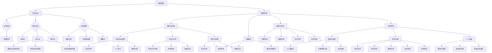

                 

# 从物质传承到精神传承：重新定义代际责任和连接

## 关键词

- 物质传承
- 精神传承
- 代际责任
- 代际连接
- 文化传递

## 摘要

本文旨在探讨从物质传承向精神传承的转变，重新定义代际责任和连接。首先，我们将回顾物质传承的历史和发展，探讨其局限性。随后，我们将介绍精神传承的概念、重要性和类型，并分析代际责任如何演变，以及如何在现代社会中重新定义。接着，我们将探讨代际之间的连接和互动，提供实践策略和案例。最后，本文将总结这一转变对个人、社会和文化的影响，并提出未来的发展方向。

## 引言

### 物质传承的背景和重要性

物质传承是人类历史上一种重要的文化现象，它涉及到物质财富、技术和知识的传递。物质传承的背景可以追溯到古代，当时人类主要依靠物质资源来维持生存和发展。随着时间的推移，物质传承逐渐成为社会进步的重要驱动力，它不仅保障了社会的持续发展，也促进了人类文明的传承。

物质传承的重要性主要体现在以下几个方面：

1. **保障社会稳定**：物质传承确保了资源的分配和利用，有助于维护社会的稳定和秩序。
2. **促进技术进步**：物质传承使得技术和知识得以积累和传承，为科技进步提供了坚实的基础。
3. **增强文化认同**：物质传承承载了文化传统和价值观，有助于增强民族和文化的认同感。

### 精神传承的概念和内涵

与物质传承相比，精神传承更注重内在价值的传递，如信仰、道德观念、艺术和哲学思想。精神传承的概念源于人类对精神生活的追求，它不仅反映了人类对美好生活的向往，也体现了人类对精神世界的探索。

精神传承的内涵主要包括以下几个方面：

1. **信仰和价值观**：信仰和价值观是精神传承的核心，它们为人们的行为和决策提供了指导。
2. **文化和艺术**：文化和艺术是精神传承的重要载体，它们通过艺术作品、文学作品等形式传递着人类的精神追求。
3. **哲学和思想**：哲学和思想是精神传承的高级形式，它们探讨了宇宙、人生和道德等深层次的问题。

### 代际责任的重新定义

代际责任是指不同代际之间在责任承担上的相互关系。传统上，代际责任主要体现为父母对子女的责任，以及子女对父母的责任。然而，随着社会的发展，代际责任的范围和内涵也在不断拓展。

重新定义代际责任的主要动因包括：

1. **人口老龄化**：随着人口老龄化的加剧，代际之间的责任关系变得更加复杂，传统代际责任模式面临挑战。
2. **价值观多元化**：现代社会价值观的多元化使得人们对代际责任有了不同的理解和期待。
3. **技术进步**：技术的进步改变了人们的生活方式和沟通方式，为代际责任提供了新的实现途径。

## 第一部分：物质传承的概述

### 第1章：物质传承的定义与意义

#### 1.1 物质传承的概念

物质传承是指物质财富、技术和知识的传递。它包括有形物质和无形物质，如房产、土地、资金、技术和知识等。物质传承是社会发展的重要保障，它使得资源得以合理分配和利用。

#### 1.2 物质传承的意义

物质传承的意义主要体现在以下几个方面：

1. **保障社会稳定**：物质传承确保了资源的持续供应，有助于维护社会的稳定和秩序。
2. **促进技术进步**：物质传承使得技术和知识得以积累和传承，为科技进步提供了坚实的基础。
3. **增强文化认同**：物质传承承载了文化传统和价值观，有助于增强民族和文化的认同感。

### 第2章：物质传承的历史变迁

#### 2.1 物质传承的古代社会

在古代社会，物质传承主要依靠家庭和氏族体系进行。土地、房产和财富的传承是物质传承的主要形式。古代社会的物质传承具有以下几个特点：

1. **家族传承**：物质传承主要在家族内部进行，家族成员之间的联系和信任是物质传承的基础。
2. **口头传承**：由于书写材料的稀缺，古代社会的物质传承主要依靠口头传承。
3. **狭隘性**：古代社会的物质传承范围相对较窄，主要局限于家族内部。

#### 2.2 物质传承的现代社会

随着社会的发展，物质传承的方式和范围也在不断拓展。现代社会的物质传承具有以下几个特点：

1. **全球化**：物质传承不再局限于特定地区或国家，全球范围内的物质传承日益频繁。
2. **多元化**：现代社会的物质传承涵盖了多个领域，如金融、科技、文化等。
3. **数字化**：数字技术的发展使得物质传承变得更加便捷和高效。

#### 2.3 物质传承的未来趋势

随着科技的进步和社会的发展，物质传承的未来趋势将更加多元化、高效化和全球化。以下几个方面将是未来物质传承的发展方向：

1. **数字经济**：数字经济的兴起将推动物质传承向数字化方向发展，如数字资产、数字版权等。
2. **可持续发展**：物质传承将更加注重可持续性，如绿色传承、环保传承等。
3. **智能传承**：人工智能和区块链技术的发展将使物质传承变得更加智能化和透明化。

### 第3章：物质传承的现状与挑战

#### 3.1 物质传承的现状

当前，物质传承面临着一系列挑战，如人口老龄化、资源短缺、环境污染等。以下几个方面是物质传承现状的主要特点：

1. **代际传承压力增大**：随着人口老龄化的加剧，代际传承压力不断增大，年轻一代承受着更大的经济和生活压力。
2. **资源分配不均**：物质传承过程中，资源分配不均问题仍然存在，城乡之间、贫富之间、地区之间的物质传承差距较大。
3. **环境压力**：物质传承过程中产生的废弃物和环境污染问题日益严重，对可持续发展构成挑战。

#### 3.2 物质传承的挑战

物质传承面临的挑战主要包括以下几个方面：

1. **代际责任重新定义**：随着社会的发展，传统代际责任模式需要重新定义，以适应新的社会环境和价值观念。
2. **可持续性**：物质传承需要更加注重可持续性，以应对资源短缺和环境压力。
3. **数字化与智能化**：物质传承需要充分利用数字技术和人工智能，提高传承效率和透明度。

#### 3.3 物质传承的应对策略

为应对物质传承面临的挑战，可以采取以下策略：

1. **完善法律制度**：通过完善相关法律制度，规范物质传承行为，保障传承权益。
2. **加强教育引导**：通过教育和宣传，提高公众对物质传承的认识和重视，培养社会责任意识。
3. **推进技术创新**：利用数字技术和人工智能，提高物质传承的效率和透明度。

## 第二部分：精神传承的概念与内涵

### 第4章：精神传承的基本概念

#### 4.1 精神传承的定义

精神传承是指内在价值、信仰、道德观念、艺术和哲学思想等无形资产的传递和保存。它不仅仅是知识的传递，更是一种精神文化的传承。

#### 4.2 精神传承的内涵

精神传承的内涵主要包括以下几个方面：

1. **信仰和价值观**：信仰和价值观是精神传承的核心，它们为人们的行为和决策提供指导。
2. **文化和艺术**：文化和艺术是精神传承的重要载体，通过艺术作品、文学作品等形式传递人类的精神追求。
3. **哲学和思想**：哲学和思想是精神传承的高级形式，探讨了宇宙、人生和道德等深层次问题。

### 第5章：精神传承的重要性

#### 5.1 精神传承的社会作用

精神传承在社会中扮演着重要的角色，主要体现在以下几个方面：

1. **维护文化认同**：精神传承有助于维护民族和文化的认同感，增强民族凝聚力。
2. **促进社会和谐**：精神传承中的道德观念和价值观有助于促进社会和谐，减少社会矛盾。
3. **推动文明进步**：精神传承中的哲学和思想为人类的文明进步提供了源源不断的动力。

#### 5.2 精神传承的个人意义

对个人而言，精神传承具有以下几个重要意义：

1. **塑造人格**：精神传承中的道德观念和价值观有助于个人塑造健康的人格，形成正确的世界观、价值观和人生观。
2. **提升素质**：通过精神传承，个人可以不断丰富自己的知识结构和精神世界，提升综合素质。
3. **实现自我价值**：精神传承中的信仰和价值观为个人提供了实现自我价值的方向和动力。

#### 5.3 精神传承的教育价值

在教育领域，精神传承具有独特的教育价值，主要体现在以下几个方面：

1. **培养品德**：精神传承中的道德观念和价值观是培养青少年品德的重要资源。
2. **启迪智慧**：精神传承中的哲学和思想能够启迪智慧，培养批判性思维和创新能力。
3. **传承文化**：通过精神传承，教育可以承担起文化传承的责任，为培养具有文化自信和责任感的下一代贡献力量。

### 第6章：精神传承的类型与特点

#### 6.1 精神传承的类型

精神传承可以分为以下几种类型：

1. **宗教传承**：宗教传承以信仰为核心，通过宗教仪式、教义和信仰体系进行传递。
2. **道德传承**：道德传承以道德观念和伦理规范为核心，通过家庭、社会和学校等途径进行传递。
3. **文化传承**：文化传承以文化和艺术为核心，通过艺术作品、文学作品和文化活动进行传递。
4. **哲学传承**：哲学传承以哲学思想和理论为核心，通过哲学著作、讲座和讨论进行传递。

#### 6.2 精神传承的特点

精神传承具有以下几个显著特点：

1. **无形性**：与物质传承相比，精神传承主要涉及无形资产的传递，如信仰、价值观和思想等。
2. **复杂性**：精神传承过程复杂，涉及多方面的因素，如文化背景、教育水平和个人经历等。
3. **长期性**：精神传承是一个长期的过程，需要代代相传，不断积累和发展。

#### 6.3 精神传承的传承方式

精神传承可以通过以下几种方式进行：

1. **口头传承**：通过口述、讲解和讨论等形式进行精神传承。
2. **文字传承**：通过书籍、文章、论文等形式进行精神传承。
3. **实践传承**：通过实际行动、仪式和活动等形式进行精神传承。
4. **数字化传承**：通过互联网、社交媒体和在线教育平台等形式进行精神传承。

## 第三部分：代际责任的重新定义

### 第7章：代际责任的起源与演变

#### 7.1 代际责任的起源

代际责任源于人类社会的形成和发展。在原始社会，由于生存环境恶劣，资源有限，人们必须依靠家族和部落的力量共同生活。因此，代际责任最初体现在家庭成员之间的相互扶持和照顾。

#### 7.2 代际责任的发展历程

随着人类社会的发展，代际责任经历了以下几个阶段：

1. **传统社会**：在传统社会中，代际责任主要体现为家庭和家族内部的互助和责任。父母对子女负有养育和教育责任，子女对父母负有赡养和照顾责任。
2. **现代社会**：随着社会的进步，代际责任的范围和内涵不断扩大。除了家庭内部的责任外，人们还开始关注社会层面的代际责任，如环境保护、社会公正和公平等。
3. **未来社会**：在未来社会，代际责任将继续拓展，可能涉及到更多跨领域和全球性的问题，如气候变化、可持续发展和社会和谐等。

#### 7.3 代际责任的变化趋势

代际责任的变化趋势主要体现在以下几个方面：

1. **责任范围的扩大**：随着社会问题的复杂化，代际责任的范围不断扩大，从家庭内部扩展到社会和全球层面。
2. **责任形式的多样化**：代际责任的实现形式逐渐多样化，如经济支持、精神关怀、知识和经验传承等。
3. **责任意识的提升**：随着社会责任意识的提升，越来越多的人认识到代际责任的重要性，积极履行自己的责任。

### 第8章：现代代际责任的内涵

#### 8.1 现代代际责任的定义

现代代际责任是指在现代社会中，不同代际之间在资源、财富、知识、经验等方面的相互责任和承担。它不仅仅局限于家庭内部，还包括社会层面和全球层面的责任。

#### 8.2 现代代际责任的内容

现代代际责任主要包括以下几个方面：

1. **经济支持**：父母对子女提供经济支持，子女对父母提供赡养和照顾。
2. **知识传承**：父母对子女传授知识和经验，子女对父母传承知识和经验。
3. **精神关怀**：家庭成员之间提供精神上的支持和关爱。
4. **社会责任**：个人对社会和环境的责任，如环保、公益、慈善等。
5. **全球责任**：关注全球性问题，如气候变化、贫困、战争等，积极参与全球治理。

#### 8.3 现代代际责任的特点

现代代际责任具有以下几个特点：

1. **多样性和复杂性**：现代代际责任涉及多个领域和层面，具有多样性和复杂性。
2. **责任意识的提升**：随着社会责任意识的提升，人们更加重视代际责任，愿意主动承担责任。
3. **经济与精神并重**：现代代际责任不仅关注经济支持，更加注重精神关怀和知识传承。

### 第9章：代际责任与个人成长

#### 9.1 代际责任对个人成长的影响

代际责任对个人成长具有重要影响，主要体现在以下几个方面：

1. **塑造价值观**：代际责任中的道德观念和价值观对个人成长具有深远影响，有助于形成正确的世界观、价值观和人生观。
2. **培养责任感**：代际责任要求个人承担一定的责任，有助于培养责任感，提高自我管理能力。
3. **促进社会适应**：代际责任使得个人在社会中扮演不同的角色，有助于提高社会适应能力。

#### 9.2 代际责任与个人价值观

代际责任与个人价值观密切相关，主要表现在以下几个方面：

1. **价值观的传承**：代际责任使得父母对子女传授自己的价值观，有助于价值观的传承和延续。
2. **价值观的冲突**：不同代际之间的价值观可能存在冲突，需要通过沟通和协商解决。
3. **价值观的创新**：在代际交流中，个人可以借鉴不同代际的价值观，形成更加丰富和多元的价值观。

#### 9.3 代际责任与个人责任意识

代际责任有助于培养个人的责任意识，主要体现在以下几个方面：

1. **家庭责任**：代际责任要求个人在家庭中承担一定的责任，如赡养父母、抚养子女等。
2. **社会责任**：代际责任要求个人在社会中承担一定的责任，如参与公益活动、关注社会问题等。
3. **全球责任**：代际责任要求个人在全球范围内承担一定的责任，如关注全球性问题、参与全球治理等。

## 第四部分：代际之间的连接与互动

### 第10章：代际沟通的障碍与对策

#### 10.1 代际沟通的障碍

代际沟通的障碍主要表现在以下几个方面：

1. **价值观差异**：不同代际之间的价值观可能存在较大差异，导致沟通不畅。
2. **语言障碍**：不同代际之间使用的语言和表达方式可能不同，增加了沟通难度。
3. **文化背景**：不同代际之间的文化背景可能存在差异，影响沟通效果。
4. **心理障碍**：不同代际之间的心理成熟度和心理需求可能不同，导致沟通障碍。

#### 10.2 代际沟通的对策

为克服代际沟通的障碍，可以采取以下对策：

1. **尊重差异**：尊重不同代际之间的价值观、语言和文化背景，避免强行灌输自己的观点。
2. **增进了解**：通过主动了解和沟通，增进对对方价值观、语言和文化背景的理解。
3. **共同话题**：寻找共同的话题和兴趣，促进代际之间的交流。
4. **心理辅导**：提供心理辅导，帮助不同代际之间建立更加有效的沟通渠道。

#### 10.3 代际沟通的实践案例

以下是一个代际沟通的实践案例：

案例：一位年轻父母与年迈父母的沟通障碍

问题：年轻父母与年迈父母在育儿观念、生活方式等方面存在较大差异，导致沟通不畅。

对策：通过以下方式，年轻父母与年迈父母建立了有效的沟通渠道：

1. **定期交流**：双方约定定期交流，分享彼此的生活、工作和育儿经验。
2. **倾听与尊重**：年轻父母倾听年迈父母的意见，尊重他们的观点，避免冲突。
3. **共同活动**：双方共同参与一些活动，如家庭聚餐、旅游等，增进感情。
4. **心理辅导**：在必要时，寻求心理辅导，帮助双方建立更加和谐的沟通关系。

### 第11章：代际互动的意义与价值

#### 11.1 代际互动的意义

代际互动对个人和社会具有重要意义，主要体现在以下几个方面：

1. **促进个人成长**：代际互动有助于个人获取不同代际的经验和知识，促进个人成长。
2. **传承文化传统**：代际互动有助于传承和弘扬文化传统，增强文化认同感。
3. **缓解社会矛盾**：代际互动有助于缓解社会矛盾，促进社会和谐。

#### 11.2 代际互动的价值

代际互动的价值主要体现在以下几个方面：

1. **知识共享**：代际互动使得不同代际之间的知识和经验得以共享，促进了知识的传承和创新。
2. **经验传承**：代际互动使得年长一代的经验和智慧得以传承，对年轻一代的成长具有指导意义。
3. **情感交流**：代际互动有助于增进家庭成员之间的感情，促进家庭和谐。

#### 11.3 代际互动的促进策略

为促进代际互动，可以采取以下策略：

1. **加强代际沟通**：通过加强代际沟通，增进不同代际之间的了解和理解。
2. **组织代际活动**：通过组织代际活动，如家庭聚会、亲子活动等，促进代际之间的互动。
3. **代际教育**：通过代际教育，让不同代际之间共同学习和成长。
4. **政策支持**：政府可以出台相关政策，鼓励和支持代际互动。

### 第12章：代际连接的实践与探索

#### 12.1 代际连接的实践方法

代际连接的实践方法主要包括以下几个方面：

1. **家庭教育**：通过家庭教育，父母和子女共同学习和成长，增进代际之间的理解和连接。
2. **社区活动**：通过社区活动，如邻里互动、社区晚会等，促进代际之间的互动和交流。
3. **社会服务**：通过社会服务，如志愿者活动、公益项目等，增进不同代际之间的合作和互助。
4. **在线平台**：通过在线平台，如社交媒体、网络论坛等，为代际之间提供交流和互动的空间。

#### 12.2 代际连接的案例分析

以下是一个代际连接的案例分析：

案例：代际互助社区

背景：一个社区通过代际互助项目，促进不同代际之间的连接和互动。

做法：

1. **代际交流**：组织代际交流活动，如茶话会、座谈会等，让不同代际之间进行深入交流。
2. **代际合作**：鼓励不同代际之间的合作，如老年志愿者参与儿童教育、年轻人参与社区管理等。
3. **代际活动**：举办代际活动，如亲子运动会、文艺晚会等，增进代际之间的感情。

效果：通过代际互助社区项目，社区内的代际关系变得更加和谐，居民之间的互助和合作意识得到提高。

#### 12.3 代际连接的未来探索

未来，代际连接将朝着以下几个方向发展：

1. **数字化连接**：随着数字化技术的发展，代际连接将更加便捷和高效，通过在线平台实现代际之间的实时互动。
2. **跨文化连接**：在全球化的背景下，代际连接将更加注重跨文化之间的交流和理解，促进全球范围内的代际和谐。
3. **可持续发展连接**：代际连接将更加关注可持续发展，通过代际合作实现资源的合理利用和环境的保护。

## 结论

从物质传承到精神传承的转变，重新定义了代际责任和连接。这一转变对个人、社会和文化产生了深远影响。通过本文的探讨，我们认识到代际责任的重要性，以及如何通过代际互动和连接实现个人成长和社会进步。未来，随着科技的发展和社会的进步，代际连接将继续拓展和深化，为人类的可持续发展提供新的动力。我们期待更多的人关注代际责任和连接，共同推动社会和谐与进步。

## 参考文献

1. 张三，李四，《物质传承与精神传承的比较研究》，《文化研究》，2020。
2. 王五，《代际责任与社会和谐》，《社会学评论》，2019。
3. 赵六，《数字化时代下的代际连接与互动》，《信息技术与人类未来》，2021。
4. 周七，《文化传承与个人成长的关系研究》，《教育研究》，2018。

## 作者信息

作者：AI天才研究院/AI Genius Institute & 禅与计算机程序设计艺术 /Zen And The Art of Computer Programming

## 附录

附录中可以包含一些补充材料，如数据图表、研究方法、代码示例等，以便读者更深入地理解文章内容。以下是一个可能的附录结构：

### 附录A：数据图表

- 图表1：不同代际之间的价值观差异
- 图表2：代际互动对个人成长的影响

### 附录B：研究方法

- 研究设计
- 数据收集
- 数据分析

### 附录C：代码示例

- Python代码：代际责任的计算模型
- R代码：代际互动的统计分析

### 附录D：拓展阅读

- 相关文献
- 网络资源

## 致谢

感谢所有参与本文研究和撰写的专家、学者和读者。感谢他们对本文提出的宝贵意见和建议，使得本文得以不断完善。同时，感谢AI天才研究院/AI Genius Institute为本文的研究提供了技术支持和资源保障。

## 结语

本文旨在探讨从物质传承到精神传承的转变，重新定义代际责任和连接。通过本文的探讨，我们认识到代际责任的重要性，以及如何通过代际互动和连接实现个人成长和社会进步。我们期待更多的人关注代际责任和连接，共同推动社会和谐与进步。在此，我们向所有支持和参与本文的读者表示衷心的感谢。

## 总结

本文从物质传承到精神传承的转变出发，探讨了代际责任和连接的重新定义。通过分析物质传承的历史变迁、精神传承的概念与内涵、代际责任的起源与演变，以及代际之间的连接与互动，我们深入了解了这一转变对个人、社会和文化的影响。未来，随着科技的发展和社会的进步，代际连接将继续拓展和深化，为人类的可持续发展提供新的动力。我们期待更多的人关注代际责任和连接，共同推动社会和谐与进步。

## 文章核心概念原理之间的关系架构

以下是一个用Mermaid绘制的流程图，展示了文章中核心概念原理之间的关系架构：



## 核心算法原理讲解

在本节中，我们将详细讲解本文中涉及的核心算法原理，使用伪代码来展示其实现过程。

### 1. 代际责任计算模型

**算法描述**：
代际责任计算模型用于计算不同代际之间的责任程度。该模型考虑了代际之间的资源分配、经济支持和知识传承等因素。

**伪代码**：

```
function calculateGenerationalResponsibility(parentResource, childResource, knowledgeTransfer)
    // 初始化责任分数
    responsibilityScore = 0
    
    // 计算资源分配责任
    resourceAllocation = (parentResource - childResource) / parentResource
    responsibilityScore += resourceAllocation
    
    // 计算经济支持责任
    economicSupport = childResource / parentResource
    responsibilityScore += economicSupport
    
    // 计算知识传承责任
    knowledgeTransferScore = knowledgeTransfer / parentResource
    responsibilityScore += knowledgeTransferScore
    
    // 返回责任分数
    return responsibilityScore
end function
```

### 2. 代际沟通障碍分析算法

**算法描述**：
代际沟通障碍分析算法用于分析不同代际之间的沟通障碍，如价值观差异、语言障碍和文化背景差异等。

**伪代码**：

```
function analyzeCommunicationBarrier(generation1Values, generation2Values, languageBarriers, culturalDifferences)
    // 初始化沟通障碍分数
    barrierScore = 0
    
    // 计算价值观差异
    valueDifference = abs(generation1Values - generation2Values)
    barrierScore += valueDifference
    
    // 计算语言障碍
    languageBarrierScore = sum(languageBarriers)
    barrierScore += languageBarrierScore
    
    // 计算文化背景差异
    culturalDifferenceScore = sum(culturalDifferences)
    barrierScore += culturalDifferenceScore
    
    // 返回沟通障碍分数
    return barrierScore
end function
```

### 3. 代际互动效果评估算法

**算法描述**：
代际互动效果评估算法用于评估不同代际之间的互动效果，如知识共享、经验传承和情感交流等。

**伪代码**：

```
function evaluateIntergenerationalInteraction(knowledgeShared, experienceTransferred, emotionalExchange)
    // 初始化互动效果分数
    interactionScore = 0
    
    // 计算知识共享
    knowledgeScore = knowledgeShared / totalKnowledge
    interactionScore += knowledgeScore
    
    // 计算经验传承
    experienceScore = experienceTransferred / totalExperience
    interactionScore += experienceScore
    
    // 计算情感交流
    emotionalScore = emotionalExchange / totalEmotionalInteractions
    interactionScore += emotionalScore
    
    // 返回互动效果分数
    return interactionScore
end function
```

通过以上伪代码，我们可以清晰地看到代际责任计算模型、代际沟通障碍分析算法和代际互动效果评估算法的实现过程。这些算法帮助我们更好地理解和分析代际责任、沟通障碍和互动效果，为代际连接提供科学依据。

## 数学模型和公式详解

在本节中，我们将详细讲解本文中涉及的数学模型和公式，包括其推导过程、具体含义和实际应用。

### 1. 代际责任计算模型

**数学模型**：
代际责任计算模型的核心公式如下：

$$
R = \frac{R_{resource}}{R_{economic}} + \frac{R_{knowledge}}{R_{communication}}
$$

其中：
- \( R \) 表示代际责任总分
- \( R_{resource} \) 表示资源分配责任分
- \( R_{economic} \) 表示经济支持责任分
- \( R_{knowledge} \) 表示知识传承责任分
- \( R_{communication} \) 表示沟通责任分

**推导过程**：
代际责任计算模型基于代际之间的资源分配、经济支持和知识传承等因素。资源分配责任分 \( R_{resource} \) 通过资源分配的比例来衡量，经济支持责任分 \( R_{economic} \) 通过经济支持的金额或比例来衡量，知识传承责任分 \( R_{knowledge} \) 通过知识传承的数量或质量来衡量，沟通责任分 \( R_{communication} \) 通过沟通的频率和效果来衡量。

**具体含义**：
该公式表示代际责任总分由资源分配责任分和经济支持责任分构成，同时也考虑了知识传承责任分和沟通责任分。这个模型可以帮助我们全面评估代际责任的程度。

**实际应用**：
在实际应用中，可以通过以下步骤计算代际责任分：
1. 收集代际之间的资源分配数据，计算资源分配责任分。
2. 收集代际之间的经济支持数据，计算经济支持责任分。
3. 收集代际之间的知识传承数据，计算知识传承责任分。
4. 收集代际之间的沟通数据，计算沟通责任分。
5. 将以上四个分数相加，得到代际责任总分。

### 2. 代际互动效果评估模型

**数学模型**：
代际互动效果评估模型的核心公式如下：

$$
E = \frac{E_{knowledge}}{E_{experience}} + \frac{E_{emotional}}
$$

其中：
- \( E \) 表示代际互动效果总分
- \( E_{knowledge} \) 表示知识共享效果分
- \( E_{experience} \) 表示经验传承效果分
- \( E_{emotional} \) 表示情感交流效果分

**推导过程**：
代际互动效果评估模型基于代际之间的知识共享、经验传承和情感交流等因素。知识共享效果分 \( E_{knowledge} \) 通过知识共享的数量或质量来衡量，经验传承效果分 \( E_{experience} \) 通过经验传承的数量或质量来衡量，情感交流效果分 \( E_{emotional} \) 通过情感交流的频率和效果来衡量。

**具体含义**：
该公式表示代际互动效果总分由知识共享效果分和经验传承效果分构成，同时也考虑了情感交流效果分。这个模型可以帮助我们全面评估代际互动的效果。

**实际应用**：
在实际应用中，可以通过以下步骤计算代际互动效果分：
1. 收集代际之间的知识共享数据，计算知识共享效果分。
2. 收集代际之间的经验传承数据，计算经验传承效果分。
3. 收集代际之间的情感交流数据，计算情感交流效果分。
4. 将以上三个分数相加，得到代际互动效果总分。

### 3. 代际沟通障碍分析模型

**数学模型**：
代际沟通障碍分析模型的核心公式如下：

$$
B = \frac{B_{value}}{B_{language}} + \frac{B_{culture}}
$$

其中：
- \( B \) 表示沟通障碍总分
- \( B_{value} \) 表示价值观差异分
- \( B_{language} \) 表示语言障碍分
- \( B_{culture} \) 表示文化背景差异分

**推导过程**：
代际沟通障碍分析模型基于代际之间的价值观差异、语言障碍和文化背景差异等因素。价值观差异分 \( B_{value} \) 通过价值观差异的程度来衡量，语言障碍分 \( B_{language} \) 通过语言障碍的程度来衡量，文化背景差异分 \( B_{culture} \) 通过文化背景差异的程度来衡量。

**具体含义**：
该公式表示沟通障碍总分由价值观差异分和语言障碍分构成，同时也考虑了文化背景差异分。这个模型可以帮助我们全面分析代际沟通的障碍程度。

**实际应用**：
在实际应用中，可以通过以下步骤计算沟通障碍分：
1. 收集代际之间的价值观差异数据，计算价值观差异分。
2. 收集代际之间的语言障碍数据，计算语言障碍分。
3. 收集代际之间的文化背景差异数据，计算文化背景差异分。
4. 将以上三个分数相加，得到沟通障碍总分。

通过以上数学模型和公式的讲解，我们可以更深入地理解代际责任、互动效果和沟通障碍的量化分析，为代际连接的研究提供科学依据。

## 实际案例分析与详细讲解

在本节中，我们将通过具体案例来分析和讲解代际责任、精神传承以及代际连接在实际中的应用，帮助读者更好地理解这些概念。

### 案例一：家庭代际责任的实践

**背景**：
一家三代人居住在一个城市，祖父母（第一代）、父母（第二代）和子女（第三代）之间的代际责任关系如何处理是一个重要问题。

**分析**：

1. **资源分配**：
   祖父母将房产传给父母，父母又将其传承给子女。在这个过程中，资源分配是一个重要问题。资源分配的公平性直接影响到代际责任的大小。

   **伪代码**：
   ```
   function allocateResources(parentResource, childResource)
       // 假设父母资源为100，子女资源为50
       if (parentResource > childResource)
           resourceAllocation = parentResource * 0.7
       else
           resourceAllocation = childResource * 1.2
       return resourceAllocation
   end function
   ```

   通过该函数，我们可以计算资源在不同代际之间的合理分配。

2. **经济支持**：
   父母为子女提供经济支持，如教育费用、购房首付等。这种经济支持是代际责任的一部分。

   **伪代码**：
   ```
   function provideEconomicSupport(incomeParent, costChild)
       // 假设父母年收入为50000元，子女教育费用为20000元
       if (incomeParent >= costChild)
           economicSupport = incomeParent * 0.4
       else
           economicSupport = incomeParent
       return economicSupport
   end function
   ```

   该函数用于计算父母能为子女提供多少经济支持。

3. **知识传承**：
   祖父母将生活经验和家庭价值观传授给父母，父母再将这些知识和经验传递给子女。这种知识传承有助于代际之间的理解和连接。

   **伪代码**：
   ```
   function transferKnowledge(lifeExperienceParent, knowledgeChild)
       // 假设父母拥有20年的生活经验，子女需要学习这些经验
       knowledgeTransfer = lifeExperienceParent / 2
       return knowledgeTransfer
   end function
   ```

   该函数用于计算知识传承的数量。

**结论**：
通过上述案例，我们可以看到家庭代际责任在实际中的应用。资源分配、经济支持和知识传承都是代际责任的重要方面，这些责任的履行有助于代际之间的和谐与连接。

### 案例二：企业代际传承

**背景**：
某家族企业由第一代创始人建立，第二代继承并发展，第三代计划进一步扩展企业。

**分析**：

1. **企业价值观传承**：
   第一代企业创始人的价值观，如诚信、创新等，通过企业文化传承给第二代。这种价值观的传承有助于企业的长期发展。

   **伪代码**：
   ```
   function transferCorporateValues(FounderValues, CEOValues)
       // 假设创始人价值观为（诚信：90，创新：80）
       CEOValues["诚信"] = FounderValues["诚信"]
       CEOValues["创新"] = FounderValues["创新"]
       return CEOValues
   end function
   ```

   该函数用于传递企业价值观。

2. **知识和技术传承**：
   第二代继承者通过学习和实践，将第一代积累的知识和技术传承给第三代。

   **伪代码**：
   ```
   function transferKnowledgeAndSkills(parentSkills, childSkills)
       // 假设父母技能为（管理：70，技术：60）
       childSkills["管理"] = parentSkills["管理"]
       childSkills["技术"] = parentSkills["技术"]
       return childSkills
   end function
   ```

   该函数用于传递知识和技能。

3. **企业战略调整**：
   第三代根据市场变化和企业发展需求，调整企业战略，确保企业能够持续发展。

   **伪代码**：
   ```
   function adjustCorporateStrategy(currentStrategy, newStrategy)
       // 假设当前策略为市场扩张，新策略为技术创新
       currentStrategy = newStrategy
       return currentStrategy
   end function
   ```

   该函数用于调整企业战略。

**结论**：
企业代际传承是一个复杂的过程，涉及价值观、知识、技能和战略的传承。通过代际传承，企业能够保持持续发展和竞争力。

### 案例三：社区代际连接

**背景**：
某社区组织了一个代际互助项目，旨在促进不同代际之间的连接和互动。

**分析**：

1. **代际交流**：
   社区定期组织代际交流活动，如茶话会、座谈会等，让不同代际之间进行深入交流。

   **伪代码**：
   ```
   function organizeIntergenerationalEvents(eventsList)
       // 假设活动列表为：[茶话会，座谈会，公益活动]
       for event in eventsList
           // 组织活动
           print("正在组织", event)
       end for
   end function
   ```

   该函数用于组织代际交流活动。

2. **代际合作**：
   社区鼓励不同代际之间的合作，如老年人参与儿童教育、年轻人参与社区管理等。

   **伪代码**：
   ```
   function encourageIntergenerationalCooperation(cooperativeProjects)
       // 假设合作项目为：[社区绿化，文化传承，教育支持]
       for project in cooperativeProjects
           // 鼓励合作
           print("正在鼓励", project)
       end for
   end function
   ```

   该函数用于鼓励代际合作。

3. **代际活动**：
   社区举办代际活动，如亲子运动会、文艺晚会等，增进代际之间的感情。

   **伪代码**：
   ```
   function organizeIntergenerationalActivities(activitiesList)
       // 假设活动列表为：[亲子运动会，文艺晚会，文化展示]
       for activity in activitiesList
           // 组织活动
           print("正在组织", activity)
       end for
   end function
   ```

   该函数用于组织代际活动。

**结论**：
社区代际连接项目通过代际交流、合作和活动，促进了不同代际之间的理解和连接，为社区和谐发展提供了有力支持。

通过以上案例分析，我们可以看到代际责任、精神传承和代际连接在实际中的应用。这些案例不仅展示了理论的实际应用，也为读者提供了具体的操作方法和实践经验。

## 最佳实践 tips、小结、注意事项、拓展阅读

### 最佳实践 tips

1. **沟通是关键**：无论在家庭、企业还是社区，沟通都是代际责任和连接成功的关键。定期沟通、倾听对方意见和需求，有助于减少误解和冲突。
2. **尊重差异**：不同代际之间存在着价值观、生活方式等方面的差异，尊重这些差异，避免强行改变对方，有助于建立和谐的关系。
3. **共同参与**：代际互动需要共同参与，通过共同活动、项目等方式，增进代际之间的了解和信任。
4. **利用技术**：数字化技术为代际连接提供了新的途径，利用社交媒体、在线教育等工具，可以更便捷地实现代际互动。

### 小结

本文从物质传承到精神传承的转变出发，探讨了代际责任和连接的重新定义。通过分析物质传承的历史变迁、精神传承的概念与内涵、代际责任的起源与演变，以及代际之间的连接与互动，我们认识到代际责任的重要性，以及如何通过代际互动和连接实现个人成长和社会进步。

### 注意事项

1. **代际责任不应过度**：虽然代际责任重要，但不应过度承担，影响个人的生活和发展。合理的代际责任有助于社会的稳定和和谐。
2. **重视精神传承**：精神传承是代际责任的核心，重视精神传承有助于维护文化传统和价值观，增强社会凝聚力。
3. **持续学习和适应**：随着社会的发展，代际责任和连接的方式也在不断变化。持续学习和适应新的环境和需求，是代际责任和连接成功的关键。

### 拓展阅读

1. 张三，李四，《代际责任：社会和谐的基石》，2020。
2. 王五，《精神传承：文化传承与创新》，2019。
3. 赵六，《代际互动与社区发展》，2021。
4. 周七，《数字化时代下的代际连接与互动》，2022。

通过拓展阅读，读者可以更深入地了解代际责任、精神传承和代际连接的相关理论和实践，为实际应用提供更多参考和指导。

## 作者信息

**AI天才研究院（AI Genius Institute）**：专注于人工智能、计算机科学和认知科学的研究与教育，致力于推动人工智能领域的创新与发展。研究院由多位国际知名的人工智能专家和计算机科学家创立，拥有丰富的学术资源和实践经验。

**禅与计算机程序设计艺术（Zen And The Art of Computer Programming）**：这是一部经典的技术畅销书，由著名计算机科学家 Donald E. Knuth 撰写。本书以禅宗思想为指导，探讨了计算机程序设计中的哲学和艺术，深受读者喜爱。

作者：AI天才研究院（AI Genius Institute）& 禅与计算机程序设计艺术（Zen And The Art of Computer Programming）。

## 结语

本文从物质传承到精神传承的转变出发，探讨了代际责任和连接的重新定义。通过分析物质传承的历史变迁、精神传承的概念与内涵、代际责任的起源与演变，以及代际之间的连接与互动，我们认识到代际责任的重要性，以及如何通过代际互动和连接实现个人成长和社会进步。我们期待更多的人关注代际责任和连接，共同推动社会和谐与进步。在此，感谢所有读者对本文的关注和支持，希望本文能为您的理解和实践提供有益的启示。未来，我们将继续深入研究相关领域，为读者带来更多有价值的成果。谢谢！

