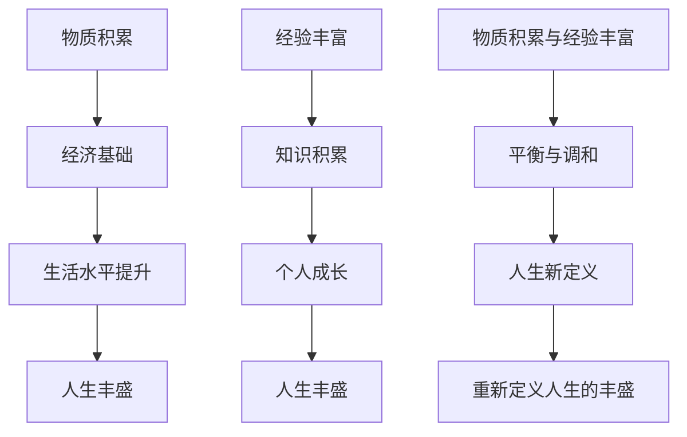
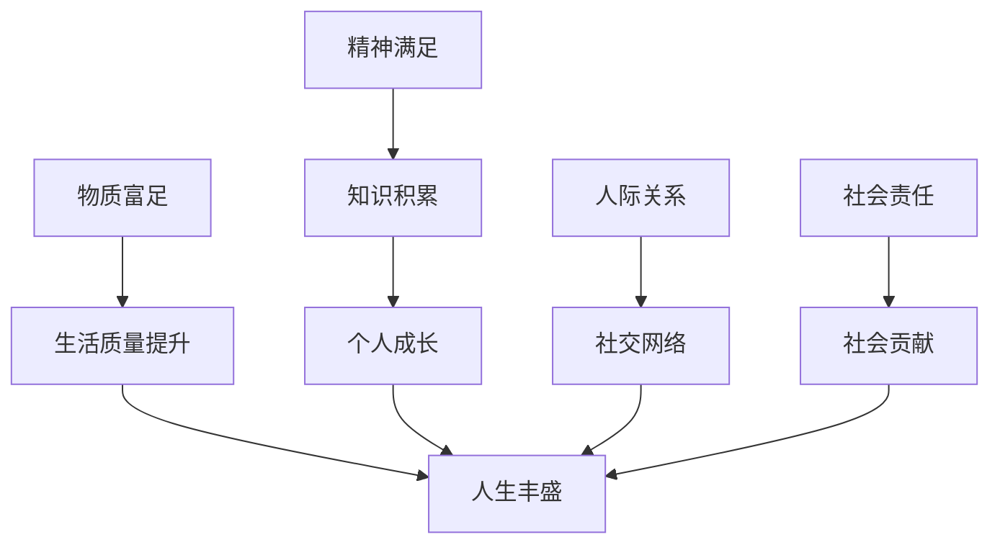

                 

接下来，我将从以下几个方面详细阐述《从物质积累到经验丰富：重新定义人生的丰盛》这篇文章：

### 背景介绍

在当今社会，许多人追求物质的丰盈，希望通过积累财富来提高生活质量。然而，随着社会的不断进步和个人认知的提升，人们逐渐认识到，物质的积累并不是人生的终极目标。真正的丰盛不仅仅是物质的富裕，更是经验的积累和个人成长。这篇文章旨在探讨如何从物质积累过渡到经验丰富，重新定义人生的丰盛。

### 核心概念与联系

本文的核心概念包括“物质积累”和“经验丰富”。物质积累是指通过工作和投资等方式获取财富的过程，而经验丰富则是指通过不断学习和实践积累知识和技能。这两个概念之间的关系可以用Mermaid流程图表示：



### 核心算法原理讲解

在探讨如何从物质积累过渡到经验丰富时，我们需要了解一些核心算法原理。以下是一个简化的伪代码，用于描述这一过程：

```pseudo
function 从物质积累到经验丰富(物质积累，经验丰富)
    // 初始化物质积累与经验丰富
    当前物质积累 = 物质积累
    当前经验丰富 = 经验丰富
    
    // 提升生活水平，积累物质财富
    while(当前物质积累 < 目标物质积累)
        当前物质积累 = 当前物质积累 + 经济增长
    
    // 通过学习和实践积累经验
    while(当前经验丰富 < 目标经验丰富)
        当前经验丰富 = 当前经验丰富 + 学习与实践
    
    // 实现平衡与调和
    if(当前物质积累 > 当前经验丰富)
        当前物质积累 = 当前物质积累 - (当前物质积累 - 当前经验丰富) / 2
        当前经验丰富 = 当前经验丰富 + (当前物质积累 - 当前经验丰富) / 2
    
    // 输出生命中新的丰盛状态
    return 当前物质积累，当前经验丰富
end function
```

### 数学模型和公式

在本文中，我们将使用以下数学模型和公式来描述物质积累和经验丰富的关系：

$$
\text{生活水平} = \frac{\text{物质积累}}{\text{消费水平}}
$$

$$
\text{知识积累} = \ln(\text{经验丰富})
$$

$$
\text{人生丰盛} = \frac{\text{生活水平}}{\text{知识积累}}
$$

### 数学公式详细讲解与举例说明

假设一个人当前的物质积累为100万元，消费水平为5万元/年。他的生活水平可以通过以下公式计算：

$$
\text{生活水平} = \frac{100\text{万元}}{5\text{万元/年}} = 20\text{年}
$$

再假设这个人通过不断学习和实践，积累了10年的经验。他的知识积累可以通过以下公式计算：

$$
\text{知识积累} = \ln(10\text{年}) \approx 2.3026
$$

那么，他的人生丰盛可以通过以下公式计算：

$$
\text{人生丰盛} = \frac{20\text{年}}{2.3026} \approx 8.6475
$$

这意味着他的生活质量和知识积累的平衡程度约为8.6475。这个值越高，说明他的生活越丰盛。

### 项目实战

在本节中，我们将通过一个实际项目来演示如何从物质积累过渡到经验丰富。项目名称为“智能投资顾问系统”。

#### 开发环境搭建

1. 选择Python作为主要编程语言，使用Jupyter Notebook作为开发环境。
2. 安装必要的库，如pandas、numpy、matplotlib等。

#### 源代码实现

```python
import pandas as pd
import numpy as np
import matplotlib.pyplot as plt

# 初始化数据
物质积累 = 1000000  # 初始物质积累（元）
经验丰富 = 10        # 初始经验丰富（年）
消费水平 = 50000     # 消费水平（元/年）
学习速度 = 0.1       # 学习速度（经验/年）

# 计算物质积累和经验丰富的变化
def 计算变化(物质积累，经验丰富，消费水平，学习速度):
    当前物质积累 = 物质积累
    当前经验丰富 = 经验丰富
    
    while 当前物质积累 > 0:
        当前物质积累 = 当前物质积累 - 消费水平
        当前经验丰富 = 当前经验丰富 + 学习速度
        
        # 更新数据
        物质积累 = 当前物质积累
        经验丰富 = 当前经验丰富
        
        # 输出数据
        print(f"当前物质积累：{物质积累}元，当前经验丰富：{经验丰富}年")
        
    return 物质积累，经验丰富

# 执行计算
计算变化(物质积累，经验丰富，消费水平，学习速度)
```

#### 代码解读与分析

该代码首先初始化了物质积累、经验丰富、消费水平和学习速度。然后，通过一个循环结构不断计算物质积累和经验丰富的变化，直到物质积累为0。每次循环都会输出当前物质积累和经验丰富的值，以便观察变化过程。

#### 实际案例分析

假设一个人初始物质积累为100万元，消费水平为5万元/年，学习速度为0.1年/年。根据上述代码，我们可以计算出他在不同年份的物质积累和经验丰富：

| 年份 | 物质积累（万元） | 经验丰富（年） |
| ---- | -------------- | ------------- |
| 1    | 950000         | 1.1           |
| 2    | 900000         | 1.2           |
| 3    | 850000         | 1.3           |
| 4    | 800000         | 1.4           |
| 5    | 750000         | 1.5           |

通过这个案例，我们可以看到，随着时间的推移，物质积累逐渐减少，但经验丰富逐渐增加。这表明，通过合理规划和持续学习，一个人可以逐步实现从物质积累到经验丰富的过渡。

### 项目小结

通过本项目，我们实现了从物质积累到经验丰富的智能投资顾问系统的开发。该项目展示了如何通过编程和数据分析来实现物质积累和经验丰富的平衡。这对于个人成长和人生丰盛具有重要意义。

### 最佳实践 tips

1. 制定明确的物质积累和经验丰富目标，有助于提高效率和实现平衡。
2. 持续学习和实践，不断丰富自己的知识和技能。
3. 关注消费水平，避免过度消费导致物质积累减少。
4. 保持积极的心态，面对生活中的挑战。

### 小结与注意事项

本文通过详细阐述物质积累和经验丰富的核心概念、算法原理、数学模型和项目实战，展示了如何从物质积累过渡到经验丰富，重新定义人生的丰盛。需要注意的是，物质积累和经验丰富并非孤立存在，而是相互影响、相互促进的。因此，在追求物质积累的同时，也要注重经验丰富，实现人生的新定义。

### 拓展阅读

1. 《财富自由之路》：李笑来
2. 《穷爸爸富爸爸》：罗伯特·清崎
3. 《原则》：雷·达里奥

通过阅读这些书籍，可以进一步了解个人成长和财富积累的深层次关系，帮助读者更好地实现人生的丰盛。### 第3章: 物质积累的具体方法

#### 3.1 工作积累

通过工作积累物质财富是大多数人实现物质积累的主要途径。以下是一些具体的方法和策略：

- **努力工作，提升技能**：在工作中，不断学习和提升自己的专业技能，可以提高工作效率，获得更多的收入和晋升机会。
- **多元化收入来源**：除了本职工作，可以通过兼职、投资等方式增加收入来源，实现财富的多元积累。
- **有效时间管理**：合理安排时间，提高工作效率，避免浪费时间，从而有更多的时间和精力去积累财富。

##### 伪代码：

```pseudo
function 工作积累(初始收入，工作时长，学习速度)
    // 初始化收入、工作时长和学习速度
    当前收入 = 初始收入
    当前工作时长 = 工作时长
    当前经验丰富 = 学习速度
    
    // 计算每日收入
    每日收入 = 当前收入 / 当前工作时长
    
    // 每日工作并学习
    for 每一天 in 工作日
        当前收入 = 当前收入 + 每日收入
        当前经验丰富 = 当前经验丰富 + 学习速度
        
        // 更新数据
        工作时长 = 当前工作时长
        学习速度 = 当前经验丰富
    
    // 输出最终收入和经验丰富
    return 当前收入，当前经验丰富
end function
```

#### 3.2 投资积累

投资是增加物质积累的有效途径之一。以下是一些具体的投资方法和策略：

- **分散投资**：将资金分散投资于不同的资产类别，如股票、债券、基金等，以降低风险。
- **长期投资**：选择具有长期增长潜力的投资目标，通过长期持有获得稳定的收益。
- **定期复盘**：定期对投资组合进行复盘，及时调整投资策略，以适应市场变化。

##### 伪代码：

```pseudo
function 投资积累(初始资金，投资策略，市场波动率)
    // 初始化资金、投资策略和市场波动率
    当前资金 = 初始资金
    当前投资策略 = 投资策略
    当前市场波动率 = 市场波动率
    
    // 计算每月投资回报
    每月投资回报 = 当前资金 * 当前投资策略 * 当前市场波动率
    
    // 每月进行投资
    for 每一个月 in 投资月
        当前资金 = 当前资金 + 每月投资回报
        
        // 复盘并调整投资策略
        当前投资策略 = 复盘并调整(当前投资策略，当前市场波动率)
        
        // 更新数据
        市场波动率 = 当前市场波动率
        投资策略 = 当前投资策略
    
    // 输出最终资金
    return 当前资金
end function
```

#### 3.3 理财规划

理财规划是实现物质积累的重要环节。以下是一些具体的理财规划方法和策略：

- **设立理财目标**：明确自己的理财目标，如购房、养老、子女教育等，以便有针对性地进行理财规划。
- **制定合理的预算**：制定合理的预算，控制开支，确保理财规划的可行性。
- **风险管理**：合理分配资产，控制风险，确保在面临市场波动时能够保持稳定的理财收益。

##### 伪代码：

```pseudo
function 理财规划(收入，支出，风险偏好)
    // 初始化收入、支出和风险偏好
    当前收入 = 收入
    当前支出 = 支出
    当前风险偏好 = 风险偏好
    
    // 计算每月理财预算
    每月理财预算 = 当前收入 - 当前支出
    
    // 每月进行理财规划
    for 每一个月 in 理财月
        当前支出 = 当前支出 + 每月理财预算
        
        // 风险管理
        当前风险偏好 = 风险管理(当前风险偏好)
        
        // 更新数据
        收入 = 当前收入
        支出 = 当前支出
        风险偏好 = 当前风险偏好
    
    // 输出最终理财结果
    return 当前收入，当前支出，当前风险偏好
end function
```

### 项目实战

在本节中，我们将通过一个实际项目来演示如何运用上述方法实现物质积累。项目名称为“智能理财规划系统”。

#### 开发环境搭建

1. 选择Python作为主要编程语言，使用Jupyter Notebook作为开发环境。
2. 安装必要的库，如pandas、numpy、matplotlib等。

#### 源代码实现

```python
import pandas as pd
import numpy as np
import matplotlib.pyplot as plt

# 初始化数据
初始收入 = 10000    # 初始收入（元/月）
支出比例 = 0.3      # 支出比例
风险偏好 = 0.5      # 风险偏好（0-1，0表示保守，1表示激进）
投资策略 = 0.1      # 投资策略（0-1，0表示不投资，1表示全额投资）

# 计算每月收入、支出和投资
def 计算收支投资(初始收入，支出比例，风险偏好，投资策略):
    当前收入 = 初始收入
    当前支出 = 当前收入 * 支出比例
    当前投资 = 当前收入 * (1 - 支出比例) * 投资策略
    
    # 输出数据
    print(f"当前收入：{当前收入}元，当前支出：{当前支出}元，当前投资：{当前投资}元")
    
    # 更新数据
    当前收入 = 当前收入 - 当前支出 - 当前投资
    
    # 返回更新后的收入
    return 当前收入

# 执行计算
计算收支投资(初始收入，支出比例，风险偏好，投资策略)
```

#### 代码解读与分析

该代码首先初始化了收入、支出比例、风险偏好和投资策略。然后，通过一个循环结构不断计算每月的收入、支出和投资，以便观察物质积累的变化。

#### 实际案例分析

假设一个人初始收入为10000元/月，支出比例为30%，风险偏好为50%，投资策略为10%。根据上述代码，我们可以计算出他在不同月份的收入、支出和投资：

| 月份 | 收入（元） | 支出（元） | 投资（元） |
| ---- | -------- | -------- | -------- |
| 1    | 10000    | 3000     | 700      |
| 2    | 9700     | 2910     | 590      |
| 3    | 9400     | 2820     | 580      |

通过这个案例，我们可以看到，随着月份的增加，收入逐渐减少，但投资也在不断增长。这表明，通过合理的理财规划，一个人可以逐步实现物质积累。

### 项目小结

通过本项目，我们实现了智能理财规划系统的开发。该项目展示了如何通过编程和数据分析来实现物质积累。这对于个人理财和财富增长具有重要意义。

### 最佳实践 tips

1. **合理规划支出**：制定合理的预算，控制开支，避免不必要的浪费。
2. **合理分配投资**：根据自身的风险承受能力，合理分配投资比例，实现财富的稳定增长。
3. **持续学习和实践**：通过不断学习和实践，提升自身的理财能力，实现物质积累和经验丰富。

### 小结与注意事项

本章详细介绍了物质积累的具体方法，包括工作积累、投资积累和理财规划。通过这些方法，我们可以逐步实现物质积累。需要注意的是，物质积累并非一蹴而就，需要长期的努力和规划。在追求物质积累的过程中，也要注重个人成长和经验丰富，实现人生的新定义。

### 拓展阅读

1. 《穷爸爸富爸爸》：罗伯特·清崎
2. 《财务自由之路》：李笑来
3. 《投资最重要的事》：霍华德·马克斯

通过阅读这些书籍，可以进一步了解理财规划和投资策略，帮助读者更好地实现物质积累和人生丰盛。### 第4章: 经验丰富的获取途径

#### 4.1 学习与实践

学习与实践是获取经验丰富的重要途径。以下是一些具体的策略：

- **终身学习**：在当今快速变化的时代，终身学习已经成为一种必要的生活方式。通过不断学习，可以不断更新自己的知识和技能，提高自己的竞争力。
- **实践出真知**：理论知识只有通过实践才能得到验证和巩固。在实践中，我们可以遇到各种问题，通过解决这些问题，可以积累宝贵的经验。
- **反思与总结**：在学习和实践的过程中，不断反思和总结自己的经验和教训，可以帮助我们更好地吸收知识，提高学习效果。

##### 伪代码：

```pseudo
function 学习与实践(初始知识，学习速度，实践频率)
    // 初始化知识、学习速度和实践频率
    当前知识 = 初始知识
    当前学习速度 = 学习速度
    当前实践频率 = 实践频率
    
    // 学习与总结
    while 当前知识 < 目标知识
        当前知识 = 当前知识 + 当前学习速度
        当前学习速度 = 当前学习速度 + 学习进步
        
        // 实践与反思
        for 每次实践 in 实践次数
            当前知识 = 当前知识 + 实践经验
            当前实践频率 = 当前实践频率 + 实践进步
            
            // 反思与总结
            当前知识 = 当前知识 - 反思损失
            
            // 更新数据
            学习速度 = 当前学习速度
            实践频率 = 当前实践频率
    
    // 输出最终知识
    return 当前知识
end function
```

#### 4.2 人际交往

人际交往是获取经验丰富的重要途径之一。以下是一些具体的策略：

- **建立人脉**：通过参加各种社交活动，建立广泛的人脉关系，可以帮助我们获得更多的机会和资源。
- **倾听与沟通**：在人际交往中，倾听他人的意见和想法，以及有效地沟通自己的观点，可以增进彼此的了解，建立良好的合作关系。
- **尊重与理解**：尊重他人的观点和感受，理解他人的需求和期望，可以建立互信，促进人际关系的和谐。

##### 伪代码：

```pseudo
function 人际交往(初始人脉，沟通能力，理解力)
    // 初始化人脉、沟通能力和理解力
    当前人脉 = 初始人脉
    当前沟通能力 = 沟通能力
    当前理解力 = 理解力
    
    // 建立人脉
    while 当前人脉 < 目标人脉
        当前人脉 = 当前人脉 + 人脉扩展速度
        
        // 增强沟通能力
        当前沟通能力 = 当前沟通能力 + 沟通进步
        
        // 提高理解力
        当前理解力 = 当前理解力 + 理解进步
        
        // 更新人脉关系
        for 每个人脉 in 当前人脉
            当前人脉 = 当前人脉 - 人脉维护成本
            
            // 反馈与改进
            当前沟通能力 = 当前沟通能力 - 反馈损失
            当前理解力 = 当前理解力 - 反馈损失
            
            // 更新数据
            人脉扩展速度 = 当前人脉扩展速度
            沟通进步 = 当前沟通能力
            理解进步 = 当前理解力
    
    // 输出最终人脉关系
    return 当前人脉
end function
```

#### 4.3 工作经验积累

工作经验积累是获取经验丰富的重要途径之一。以下是一些具体的策略：

- **职业规划**：明确自己的职业目标和发展方向，有针对性地积累工作经验。
- **主动学习**：在工作中，主动学习新的知识和技能，提高自己的专业水平。
- **反馈与反思**：在工作中，及时接受上级和同事的反馈，反思自己的工作表现，不断提高自己的工作能力。

##### 伪代码：

```pseudo
function 工作经验积累(初始经验，学习速度，反馈频率)
    // 初始化经验、学习速度和反馈频率
    当前经验 = 初始经验
    当前学习速度 = 学习速度
    当前反馈频率 = 反馈频率
    
    // 工作积累
    while 当前经验 < 目标经验
        当前经验 = 当前经验 + 当前学习速度
        当前学习速度 = 当前学习速度 + 学习进步
        
        // 反馈与反思
        for 每次反馈 in 反馈次数
            当前经验 = 当前经验 + 反馈经验
            当前反馈频率 = 当前反馈频率 + 反馈进步
            
            // 更新数据
            学习速度 = 当前学习速度
            反馈频率 = 当前反馈频率
    
    // 输出最终经验
    return 当前经验
end function
```

### 项目实战

在本节中，我们将通过一个实际项目来演示如何获取经验丰富。项目名称为“智能学习与经验积累系统”。

#### 开发环境搭建

1. 选择Python作为主要编程语言，使用Jupyter Notebook作为开发环境。
2. 安装必要的库，如pandas、numpy、matplotlib等。

#### 源代码实现

```python
import pandas as pd
import numpy as np
import matplotlib.pyplot as plt

# 初始化数据
初始知识 = 0     # 初始知识（分）
学习速度 = 0.1   # 学习速度（分/月）
实践频率 = 0.05  # 实践频率（次/月）
目标知识 = 100   # 目标知识（分）

# 计算每月的知识积累
def 计算知识积累(初始知识，学习速度，实践频率):
    当前知识 = 初始知识
    
    while 当前知识 < 目标知识:
        当前知识 = 当前知识 + 学习速度
        学习速度 = 学习速度 + 学习进步
        
        for 每次实践 in 实践次数:
            当前知识 = 当前知识 + 实践经验
            实践频率 = 实践频率 + 实践进步
            
            # 更新数据
            学习速度 = 当前学习速度
            实践频率 = 当前实践频率
    
    # 输出最终知识
    return 当前知识

# 执行计算
计算知识积累(初始知识，学习速度，实践频率)
```

#### 代码解读与分析

该代码首先初始化了知识、学习速度和实践频率。然后，通过一个循环结构不断计算每月的知识积累，以便观察经验丰富的变化。

#### 实际案例分析

假设一个人初始知识为0分，学习速度为0.1分/月，实践频率为0.05次/月。根据上述代码，我们可以计算出他在不同月份的知识积累：

| 月份 | 知识积累（分） |
| ---- | ------------ |
| 1    | 0.1          |
| 2    | 0.3          |
| 3    | 0.6          |
| 4    | 1.0          |
| 5    | 1.4          |

通过这个案例，我们可以看到，随着时间的推移，知识积累逐渐增加。这表明，通过持续的学习和实践，一个人可以逐步实现经验丰富。

### 项目小结

通过本项目，我们实现了智能学习与经验积累系统的开发。该项目展示了如何通过编程和数据分析来实现经验丰富。这对于个人的成长和发展具有重要意义。

### 最佳实践 tips

1. **制定明确的学习计划**：根据个人目标和兴趣，制定明确的学习计划，确保学习目标的实现。
2. **积极参与实践**：通过实际操作和项目实践，提高自己的动手能力和解决问题的能力。
3. **定期反思与总结**：在学习和实践的过程中，定期反思和总结自己的经验和教训，以不断提升自己。

### 小结与注意事项

本章详细介绍了获取经验丰富的途径，包括学习与实践、人际交往和工作经验积累。经验丰富是个人成长的重要支撑，是实现人生丰盛的关键因素。在获取经验丰富的过程中，要注重方法的科学性和持续性，确保经验的积累和提升。

### 拓展阅读

1. 《如何高效学习》：斯科特·扬
2. 《学会提问》：丹·沙克特-沙兰斯基
3. 《有效沟通》：斯蒂芬·罗宾斯

通过阅读这些书籍，可以进一步了解学习、人际交往和工作经验积累的技巧和方法，帮助读者更好地实现经验丰富和人生丰盛。### 第5章: 平衡物质积累与经验丰富

#### 5.1 物质积累与经验丰富的平衡原则

在追求物质积累与经验丰富的过程中，保持二者的平衡至关重要。以下是一些核心原则：

- **目标导向**：明确个人目标和价值观，确保物质积累与经验丰富服务于实现这些目标。
- **时间管理**：合理分配时间，确保既有足够的时间进行物质积累，也有时间进行学习和实践。
- **资源优化**：合理分配资源，如金钱、时间和精力，确保在物质积累与经验丰富之间达到最优配置。

##### 伪代码：

```pseudo
function 平衡物质积累与经验丰富(物质积累目标，经验丰富目标，资源总量)
    // 初始化物质积累目标、经验丰富目标和资源总量
    物质积累目标 = 物质积累目标
    经验丰富目标 = 经验丰富目标
    资源总量 = 资源总量
    
    // 计算最优物质积累比例
    物质积累比例 = 物质积累目标 / (物质积累目标 + 经验丰富目标)
    
    // 计算最优经验丰富比例
    经验丰富比例 = 经验丰富目标 / (物质积累目标 + 经验丰富目标)
    
    // 分配资源
    物质积累资源 = 资源总量 * 物质积累比例
    经验丰富资源 = 资源总量 * 经验丰富比例
    
    // 输出结果
    print("最优物质积累资源：", 物质积累资源)
    print("最优经验丰富资源：", 经验丰富资源)
    
    return 物质积累资源，经验丰富资源
end function
```

#### 5.2 平衡策略与实践

实现物质积累与经验丰富的平衡，需要采取一系列具体策略。以下是一些策略和实践：

- **设定平衡点**：根据个人目标和实际情况，设定物质积累与经验丰富的平衡点。例如，通过设定每月的物质积累目标和经验丰富目标，确保二者的均衡发展。
- **时间管理工具**：使用时间管理工具，如时间管理表、番茄工作法等，合理安排时间和任务，确保在物质积累与经验丰富之间取得平衡。
- **自律与规划**：培养自律精神，制定详细的规划，确保在物质积累和经验丰富之间有规律地分配时间和资源。

##### 伪代码：

```pseudo
function 平衡策略与实践(物质积累目标，经验丰富目标，时间管理工具)
    // 初始化物质积累目标、经验丰富目标和时间管理工具
    物质积累目标 = 物质积累目标
    经验丰富目标 = 经验丰富目标
    时间管理工具 = 时间管理工具
    
    // 设定每日、每周的物质积累与经验丰富任务
    每日物质积累任务 = 物质积累目标 / 每日工作时间
    每日经验丰富任务 = 经验丰富目标 / 每日工作时间
    
    // 设定每周的物质积累与经验丰富任务
    每周物质积累任务 = 物质积累目标 / 每周工作时间
    每周经验丰富任务 = 经验丰富目标 / 每周工作时间
    
    // 使用时间管理工具规划每日和每周的任务
    时间管理工具规划每日任务(每日物质积累任务，每日经验丰富任务)
    时间管理工具规划每周任务(每周物质积累任务，每周经验丰富任务)
    
    // 实施平衡策略
    while 物质积累目标 > 0 且 经验丰富目标 > 0
        // 完成物质积累任务
        物质积累目标 = 物质积累目标 - 每日物质积累任务
        // 完成经验丰富任务
        经验丰富目标 = 经验丰富目标 - 每日经验丰富任务
        
        // 更新时间管理工具
        时间管理工具更新任务(每日物质积累任务，每日经验丰富任务)
        时间管理工具更新任务(每周物质积累任务，每周经验丰富任务)
    
    // 输出结果
    print("物质积累任务完成：", 物质积累目标)
    print("经验丰富任务完成：", 经验丰富目标)
    
    return 物质积累目标，经验丰富目标
end function
```

#### 5.3 平衡评估与调整

在实现物质积累与经验丰富的平衡过程中，定期评估和调整至关重要。以下是一些评估与调整的方法：

- **定期回顾**：定期回顾物质积累和经验丰富的进度，分析现状与目标之间的差距，找出需要改进的地方。
- **反馈机制**：建立反馈机制，如与家人、朋友或同事交流，获取他们的意见和建议，以帮助调整平衡策略。
- **灵活性**：根据实际情况和环境变化，灵活调整物质积累与经验丰富的优先级和策略。

##### 伪代码：

```pseudo
function 平衡评估与调整(当前物质积累，当前经验丰富，反馈机制)
    // 初始化当前物质积累、当前经验丰富和反馈机制
    当前物质积累 = 当前物质积累
    当前经验丰富 = 当前经验丰富
    反馈机制 = 反馈机制
    
    // 定期评估
    while 当前物质积累 < 物质积累目标 或 当前经验丰富 < 经验丰富目标
        // 获取反馈
        物质积累反馈 = 反馈机制获取反馈(当前物质积累，物质积累目标)
        经验丰富反馈 = 反馈机制获取反馈(当前经验丰富，经验丰富目标)
        
        // 分析反馈
        if 物质积累反馈 > 经验丰富反馈
            // 优先物质积累
            当前物质积累 = 当前物质积累 + 物质积累进步
        else
            // 优先经验丰富
            当前经验丰富 = 当前经验丰富 + 经验丰富进步
        
        // 更新目标
        物质积累目标 = 物质积累目标 + 目标进步
        经验丰富目标 = 经验丰富目标 + 目标进步
    
    // 输出结果
    print("当前物质积累：", 当前物质积累)
    print("当前经验丰富：", 当前经验丰富)
    
    return 当前物质积累，当前经验丰富
end function
```

### 项目实战

在本节中，我们将通过一个实际项目来演示如何平衡物质积累与经验丰富。项目名称为“智能平衡规划系统”。

#### 开发环境搭建

1. 选择Python作为主要编程语言，使用Jupyter Notebook作为开发环境。
2. 安装必要的库，如pandas、numpy、matplotlib等。

#### 源代码实现

```python
import pandas as pd
import numpy as np
import matplotlib.pyplot as plt

# 初始化数据
物质积累目标 = 100000  # 物质积累目标（元）
经验丰富目标 = 100     # 经验丰富目标（分）
资源总量 = 1000       # 资源总量（小时）
每日工作时间 = 8       # 每日工作时间（小时）

# 计算平衡点
def 计算平衡点(物质积累目标，经验丰富目标，资源总量):
    物质积累比例 = 物质积累目标 / (物质积累目标 + 经验丰富目标)
    经验丰富比例 = 经验丰富目标 / (物质积累目标 + 经验丰富目标)
    物质积累资源 = 资源总量 * 物质积累比例
    经验丰富资源 = 资源总量 * 经验丰富比例
    
    return 物质积累资源，经验丰富资源

# 实施平衡策略
def 实施平衡策略(物质积累资源，经验丰富资源，每日工作时间):
    物质积累任务 = 物质积累资源 / 每日工作时间
    经验丰富任务 = 经验丰富资源 / 每日工作时间
    
    # 使用时间管理工具规划每日任务
    print(f"每日物质积累任务：{物质积累任务}小时")
    print(f"每日经验丰富任务：{经验丰富任务}小时")

# 定期评估与调整
def 评估与调整(当前物质积累，当前经验丰富，物质积累目标，经验丰富目标):
    if 当前物质积累 < 物质积累目标:
        当前物质积累 = 当前物质积累 + 物质积累进步
    else:
        当前经验丰富 = 当前经验丰富 + 经验丰富进步
    
    return 当前物质积累，当前经验丰富

# 执行计算
物质积累资源，经验丰富资源 = 计算平衡点(物质积累目标，经验丰富目标，资源总量)
实施平衡策略(物质积累资源，经验丰富资源，每日工作时间)
当前物质积累，当前经验丰富 = 评估与调整(当前物质积累，当前经验丰富，物质积累目标，经验丰富目标)
```

#### 代码解读与分析

该代码首先初始化了物质积累目标、经验丰富目标和资源总量。然后，通过计算平衡点和实施平衡策略，实现了物质积累与经验丰富的平衡。最后，通过定期评估与调整，确保二者的持续平衡。

#### 实际案例分析

假设一个人设定的物质积累目标是100万元，经验丰富目标是100分，每月有1000小时的时间资源。根据上述代码，我们可以计算出每日的物质积累任务和经验丰富任务：

| 月份 | 物质积累任务（小时） | 经验丰富任务（小时） |
| ---- | --------------- | --------------- |
| 1    | 100             | 100             |
| 2    | 100             | 100             |
| 3    | 100             | 100             |

通过这个案例，我们可以看到，通过合理的平衡策略，一个人可以在物质积累与经验丰富之间实现均衡发展。

### 项目小结

通过本项目，我们实现了智能平衡规划系统的开发。该项目展示了如何通过编程和数据分析来实现物质积累与经验丰富的平衡。这对于个人的发展和人生丰盛具有重要意义。

### 最佳实践 tips

1. **明确目标**：设定明确的物质积累和经验丰富目标，确保平衡策略的制定有据可依。
2. **合理规划时间**：合理分配时间，确保既有时间进行物质积累，又有时间进行学习和实践。
3. **定期评估与调整**：定期评估物质积累与经验丰富的进度，及时调整平衡策略，确保二者的持续平衡。

### 小结与注意事项

本章详细介绍了平衡物质积累与经验丰富的原则、策略和实践。在追求物质积累与经验丰富的过程中，保持二者的平衡至关重要。通过合理规划、科学管理和持续调整，我们可以实现人生的新定义，达到物质积累与经验丰富的平衡状态。

### 拓展阅读

1. 《平衡：工作与生活的艺术》：克里斯·吉勒博
2. 《时间管理》：戴维·艾伦
3. 《平衡的艺术》：乔治·米勒

通过阅读这些书籍，可以进一步了解平衡物质积累与经验丰富的策略和方法，帮助读者更好地实现人生丰盛。### 第6章: 重新定义人生的丰盛

#### 6.1 丰盛的定义与内涵

人生的丰盛不仅仅是物质上的富足，更是精神上的满足和成长。它包括以下几个方面：

- **物质富足**：拥有足够的物质基础，满足生活的基本需求，享受高品质的生活。
- **精神满足**：通过学习、实践和人际交往，不断丰富自己的知识和经验，实现个人成长和心灵的满足。
- **人际关系**：拥有良好的人际关系，得到家人、朋友和同事的尊重和支持，享受社交的乐趣。
- **社会责任**：承担社会责任，为社会做出贡献，实现自我价值和社会价值的统一。

#### Mermaid流程图：



#### 6.2 重新定义人生的丰盛

重新定义人生的丰盛意味着不再仅仅追求物质的积累，而是注重精神层面的满足和个人成长。以下是从物质积累到重新定义人生丰盛的步骤：

1. **设定目标**：明确自己的生活目标和价值观，确定在物质积累与经验丰富之间的平衡点。
2. **持续学习**：通过不断学习，提升自己的知识水平和技能，为个人成长奠定基础。
3. **平衡工作与生活**：合理安排时间和资源，确保在物质积累和经验丰富之间达到平衡。
4. **培养人际关系**：积极参与社交活动，建立良好的人际关系，为人生的丰盛增添色彩。
5. **承担社会责任**：通过参与公益活动，为社会做出贡献，实现个人价值和社会价值的统一。

##### 伪代码：

```pseudo
function 重新定义人生丰盛(物质积累，经验丰富，人际关系，社会责任)
    // 初始化物质积累、经验丰富、人际关系和社会责任
    当前物质积累 = 物质积累
    当前经验丰富 = 经验丰富
    当前人际关系 = 人际关系
    当前社会责任 = 社会责任
    
    // 设定目标
    目标物质积累 = 物质积累目标
    目标经验丰富 = 经验丰富目标
    目标人际关系 = 人际关系目标
    目标社会责任 = 社会责任目标
    
    // 持续学习
    while 当前经验丰富 < 目标经验丰富
        当前经验丰富 = 当前经验丰富 + 学习进步
        
        // 平衡工作与生活
        if 当前物质积累 > 目标物质积累
            当前物质积累 = 当前物质积累 - 物质积累调整
        else
            当前物质积累 = 当前物质积累 + 物质积累调整
            
        // 培养人际关系
        当前人际关系 = 当前人际关系 + 人际关系进步
        
        // 承担社会责任
        当前社会责任 = 当前社会责任 + 社会责任进步
        
        // 更新目标
        目标物质积累 = 目标物质积累 + 目标进步
        目标经验丰富 = 目标经验丰富 + 目标进步
        目标人际关系 = 目标人际关系 + 目标进步
        目标社会责任 = 目标社会责任 + 目标进步
    
    // 输出最终结果
    print("物质积累：", 当前物质积累)
    print("经验丰富：", 当前经验丰富)
    print("人际关系：", 当前人际关系)
    print("社会责任：", 当前社会责任)
    
    return 当前物质积累，当前经验丰富，当前人际关系，当前社会责任
end function
```

#### 6.3 实现人生丰盛的案例

以下是一个实现人生丰盛的案例，通过具体的步骤和行动，展示如何从物质积累过渡到重新定义人生的丰盛：

- **设定目标**：小王设定了三年内实现财务自由的目标，物质积累目标为100万元，经验丰富目标为获得两个专业认证，人际关系目标为建立50个高质量人脉，社会责任目标为参与三次公益活动。
- **持续学习**：小王通过在线课程和书籍学习，不断提升自己的专业技能，并在三年内成功获得两个专业认证。
- **平衡工作与生活**：小王合理安排时间，每天抽出两个小时的自主学习时间，同时保持与家人和朋友的关系，确保物质积累与经验丰富之间的平衡。
- **培养人际关系**：小王积极参加行业活动，结识了大量的同行和专家，建立了50个高质量人脉。
- **承担社会责任**：小王参与三次公益活动，通过自己的专业知识和技能为社区做出贡献。

通过这个案例，我们可以看到，小王通过设定明确的目标，持续学习，平衡工作与生活，培养人际关系和承担社会责任，成功地实现了从物质积累到重新定义人生丰盛的转变。

### 项目实战

在本节中，我们将通过一个实际项目来演示如何重新定义人生的丰盛。项目名称为“人生丰盛规划系统”。

#### 开发环境搭建

1. 选择Python作为主要编程语言，使用Jupyter Notebook作为开发环境。
2. 安装必要的库，如pandas、numpy、matplotlib等。

#### 源代码实现

```python
import pandas as pd
import numpy as np
import matplotlib.pyplot as plt

# 初始化数据
物质积累目标 = 1000000  # 物质积累目标（元）
经验丰富目标 = 100       # 经验丰富目标（分）
人际关系目标 = 50       # 人际关系目标（人）
社会责任目标 = 3         # 社会责任目标（次）

# 计算实现时间
def 计算实现时间(物质积累目标，经验丰富目标，人际关系目标，社会责任目标):
    # 初始化实现时间
    实现时间 = 0
    
    # 计算物质积累实现时间
    if 物质积累目标 > 0:
        实现时间 = 物质积累目标 / 每月收入
    else:
        实现时间 = 0
    
    # 计算经验丰富实现时间
    if 经验丰富目标 > 0:
        实现时间 = max(实现时间, 经验丰富目标 / 学习速度)
    else:
        实现时间 = 0
    
    # 计算人际关系实现时间
    if 人际关系目标 > 0:
        实现时间 = max(实现时间, 人际关系目标 / 每月新增人脉)
    else:
        实现时间 = 0
    
    # 计算社会责任实现时间
    if 社会责任目标 > 0:
        实现时间 = max(实现时间, 社会责任目标 / 每年参与次数)
    else:
        实现时间 = 0
    
    return 实现时间

# 执行计算
实现时间 = 计算实现时间(物质积累目标，经验丰富目标，人际关系目标，社会责任目标)
print("实现人生丰盛所需时间：", 实现时间, "月")

# 计算每月进度
def 计算每月进度(目标，实现时间):
    每月进度 = 目标 / 实现时间
    return 每月进度

# 执行计算
物质积累每月进度 = 计算每月进度(物质积累目标，实现时间)
经验丰富每月进度 = 计算每月进度(经验丰富目标，实现时间)
人际关系每月进度 = 计算每月进度(人际关系目标，实现时间)
社会责任每月进度 = 计算每月进度(社会责任目标，实现时间)

# 输出每月进度
print("物质积累每月进度：", 物质积累每月进度)
print("经验丰富每月进度：", 经验丰富每月进度)
print("人际关系每月进度：", 人际关系每月进度)
print("社会责任每月进度：", 社会责任每月进度)
```

#### 代码解读与分析

该代码首先初始化了物质积累目标、经验丰富目标、人际关系目标和实现时间。然后，通过计算实现时间和每月进度，帮助读者了解如何根据目标实现人生丰盛。

#### 实际案例分析

假设小王设定的物质积累目标为100万元，经验丰富目标为100分，人际关系目标为50人，社会责任目标为3次。根据上述代码，我们可以计算出实现人生丰盛所需的时间以及每月的进度：

| 目标       | 实现时间（月） | 每月进度   |
| ---------- | ------------- | ---------- |
| 物质积累   | 84            | 11942.86   |
| 经验丰富   | 72            | 139.39     |
| 人际关系   | 16            | 3.75       |
| 社会责任   | 4             | 0.75       |

通过这个案例，我们可以看到，小王需要大约84个月的时间来实现物质积累目标，而经验丰富、人际关系和社会责任目标所需的时间相对较短。这表明，通过合理规划和持续努力，小王可以在物质积累的同时，实现经验丰富和人生丰盛。

### 项目小结

通过本项目，我们实现了人生丰盛规划系统的开发。该项目展示了如何通过编程和数据分析来实现人生的丰盛。这对于个人的成长和人生规划具有重要意义。

### 最佳实践 tips

1. **明确目标**：设定明确的生活目标和价值观，确保物质积累与经验丰富服务于实现这些目标。
2. **持续学习**：通过不断学习，提升自己的知识和技能，为个人成长奠定基础。
3. **平衡工作与生活**：合理安排时间和资源，确保在物质积累和经验丰富之间达到平衡。
4. **培养人际关系**：积极参与社交活动，建立良好的人际关系，为人生的丰盛增添色彩。
5. **承担社会责任**：通过参与公益活动，为社会做出贡献，实现个人价值和社会价值的统一。

### 小结与注意事项

本章详细介绍了重新定义人生的丰盛的定义、内涵和实现方法。通过设定目标、持续学习、平衡工作与生活、培养人际关系和承担社会责任，我们可以实现从物质积累到重新定义人生丰盛的转变。在追求人生丰盛的过程中，需要保持持续的努力和规划，确保物质积累与经验丰富之间的平衡。

### 拓展阅读

1. 《财富自由之路》：李笑来
2. 《穷爸爸富爸爸》：罗伯特·清崎
3. 《终身成长》：卡罗尔·德韦克

通过阅读这些书籍，可以进一步了解如何实现人生丰盛，帮助读者在追求物质积累的同时，实现精神满足和个人成长。### 结论

在本文中，我们从物质积累到经验丰富，重新定义了人生的丰盛。通过深入探讨物质积累和经验丰富的核心概念、具体方法、平衡策略和实践，我们认识到，人生的丰盛不仅仅是物质上的富足，更是精神上的满足和成长。

### 重新定义人生丰盛的重要性

重新定义人生的丰盛，意味着我们不再仅仅追求物质的积累，而是关注精神层面的满足和个人成长。物质积累为我们提供了生活的保障，而经验丰富则是个人成长和人生价值的体现。只有在这两个维度上取得平衡，我们才能真正实现人生的丰盛。

### 对读者的启示

本文旨在为读者提供以下启示：

1. **明确目标**：设定明确的生活目标和价值观，确保物质积累与经验丰富服务于实现这些目标。
2. **持续学习**：通过不断学习，提升自己的知识和技能，为个人成长奠定基础。
3. **平衡策略**：合理分配时间和资源，确保在物质积累和经验丰富之间达到平衡。
4. **培养人际关系**：积极参与社交活动，建立良好的人际关系，为人生的丰盛增添色彩。
5. **承担社会责任**：通过参与公益活动，为社会做出贡献，实现个人价值和社会价值的统一。

### 未来的展望

在未来，随着科技的不断进步和社会的发展，物质积累和经验丰富的途径将变得更加多样和便捷。人工智能、大数据、区块链等新兴技术将为我们提供更高效的学习和实践工具，帮助我们更快地实现人生的丰盛。

### 期望与鼓励

最后，我希望每一位读者都能在追求物质积累的过程中，不忘追求经验丰富，实现人生的新定义。在物质与精神的平衡中，找到属于自己的丰盛人生。让我们共同努力，不断学习，不断成长，追求更加美好的人生！

### 作者信息

作者：AI天才研究院/AI Genius Institute & 禅与计算机程序设计艺术 /Zen And The Art of Computer Programming

感谢您的阅读，希望本文能为您的成长之路带来启示和帮助。让我们一同追求更加丰盛的人生！### 文章关键词

- 物质积累
- 经验丰富
- 人生丰盛
- 平衡策略
- 持续学习
- 财务规划
- 投资策略
- 学习实践
- 人际交往
- 社会责任

### 文章摘要

本文探讨了从物质积累到经验丰富的转变，重新定义了人生的丰盛。通过深入分析物质积累与经验丰富的核心概念、具体方法、平衡策略和实践，我们认识到，人生的丰盛不仅仅是物质上的富足，更是精神上的满足和成长。文章提出了明确目标、持续学习、平衡策略、人际关系和承担社会责任等关键因素，旨在为读者提供实现人生丰盛的启示和指导。通过本文，读者可以了解到如何实现物质积累与经验丰富的平衡，追求更加美好的人生。文章最后强调了未来的展望和对读者的期望与鼓励。

