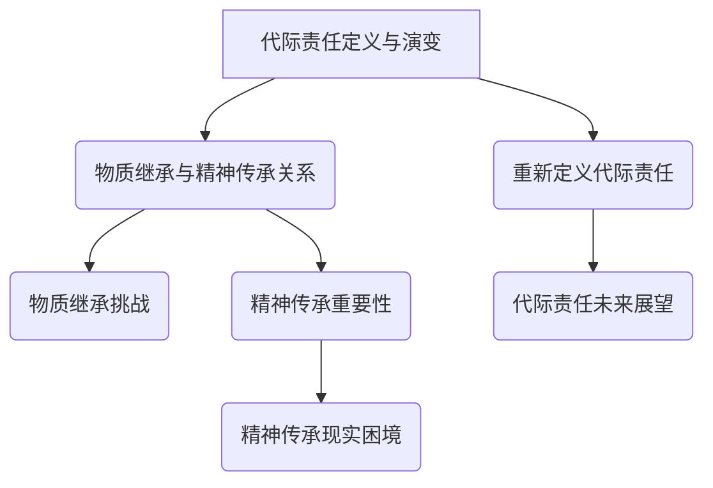

                 

### 《从物质继承到精神传承：重新定义代际责任》

#### 关键词：代际责任、物质继承、精神传承、重新定义

#### 摘要：

在快速变化的社会环境中，代际责任的概念正经历着深刻的变革。从传统的物质继承，到现代的精神传承，代际责任逐渐从单一的财富传递演变为更为复杂和深远的价值观传递。本文将探讨这一变革的背景、内涵及其实际应用，旨在重新定义代际责任，为未来社会提供新的思考方向。

### 第一部分：代际责任的定义与演变

#### 1.1 代际责任的起源与内涵

##### 1.1.1 代际责任的起源

代际责任的概念源于人类社会的早期。在传统社会中，父母或祖先将物质财富传递给子女，希望他们能够继承并延续家族的繁荣。这一过程不仅是对物质的传承，更是对家庭、文化和社会责任的传递。

##### 1.1.2 代际责任的内涵

代际责任的内涵随着社会的发展而不断演变。传统上，代际责任主要涉及物质财富的继承，如土地、财产等。然而，现代社会中，代际责任的范围已经扩展到精神层面，包括价值观念、文化传统、生活技能等。

##### 1.1.3 代际责任的历史演变

从物质继承到精神传承，代际责任的历史演变反映了人类社会的进步。随着科技的发展和社会的变革，人们越来越意识到精神财富的重要性，从而推动了代际责任概念的深化。

#### 1.2 物质继承与精神传承的关系

##### 1.2.1 物质继承的重要性

物质继承为后代提供了物质基础，使他们能够在社会中立足。然而，单纯的物质继承并不能保证后代的成长与发展，因此精神传承变得至关重要。

##### 1.2.2 精神传承的重要性

精神传承包括家庭教育、文化熏陶、道德教育等，对后代的人格塑造和社会适应能力具有重要影响。精神传承能够帮助后代建立正确的价值观，从而更好地应对社会挑战。

##### 1.2.3 物质继承与精神传承的相互作用

物质继承与精神传承并非孤立存在，它们相互作用，共同影响后代的成长。适当的物质继承可以为精神传承提供必要的条件，而精神传承则能够使物质继承得以更好地发挥其价值。

### 第二部分：物质继承的挑战

#### 2.1 物质过剩与浪费

##### 2.1.1 环境污染与资源消耗

物质继承往往伴随着资源的消耗和环境的污染。随着物质财富的增加，人们对资源的过度开采和环境的破坏日益严重。

##### 2.1.2 消费主义与社会不公

消费主义的盛行导致社会不公，物质继承往往使贫富差距扩大。这不仅影响到社会的稳定，也削弱了代际责任的实现。

##### 2.1.3 物质依赖与心理健康问题

过度依赖物质继承可能导致后代产生依赖心理，影响他们的心理健康和自我发展。

### 2.2 物质继承的伦理困境

##### 2.2.1 代际财富分配不公

代际财富分配不公可能导致家庭内部矛盾和社会不公平，影响代际责任的实现。

##### 2.2.2 物质传承与个人价值观的冲突

物质传承可能与个人的价值观产生冲突，导致后代在精神层面上的迷失。

##### 2.2.3 物质传承与社会责任

物质传承需要与社会责任相结合，否则可能导致资源的浪费和社会的不公平。

### 第三部分：精神传承的重要性

#### 3.1 精神财富的传递

##### 3.1.1 家庭教育的作用

家庭教育在精神传承中起着至关重要的作用。通过家庭教育，父母可以将自己的价值观、人生经验和道德观念传递给子女。

##### 3.1.2 社会教育的影响

社会教育，包括学校教育、社会活动等，对精神传承也具有重要影响。社会教育能够帮助人们形成正确的价值观和道德观念。

##### 3.1.3 文化的传承与发扬

文化传承是精神传承的重要组成部分。通过文化的传承和发扬，人们可以更好地理解自己的文化根源，从而增强文化自信。

### 3.2 精神传承的现实困境

##### 3.2.1 精神传承的现状

当前，精神传承面临着诸多挑战，如教育资源的不足、文化多样性的冲突等。

##### 3.2.2 精神传承的挑战

精神传承需要克服诸多挑战，如社会变革带来的价值观冲突、信息爆炸带来的文化迷失等。

##### 3.2.3 精神传承的解决方案

为了实现精神传承，需要从教育、文化、社会等多个层面入手，提出切实可行的解决方案。

### 第四部分：重新定义代际责任

#### 4.1 重新定义代际责任的必要性

##### 4.1.1 环境与社会的需求

随着环境和社会的变革，传统的代际责任概念已经无法满足现代社会的需求。因此，重新定义代际责任成为必然。

##### 4.1.2 经济与文化的转型

经济和文化的发展需要新的代际责任观念，以适应全球化、信息化和多元化的发展趋势。

##### 4.1.3 个人的成长与发展

个人的成长和发展也需要重新定义代际责任，以实现自我价值和社会价值的双重提升。

#### 4.2 重新定义代际责任的具体实践

##### 4.2.1 绿色生活方式的推广

推广绿色生活方式是实现代际责任的重要途径。通过减少资源消耗和环境污染，我们可以为后代创造一个更美好的生活环境。

##### 4.2.2 家庭教育与社区教育的发展

发展家庭教育和社区教育，培养后代的精神素养，是实现代际责任的关键。

##### 4.2.3 企业社会责任的履行

企业履行社会责任，不仅有助于社会的发展，也是实现代际责任的重要方式。

##### 4.2.4 社会创新与跨界合作

社会创新和跨界合作能够推动社会的进步，为实现代际责任提供新的思路和途径。

### 第五部分：代际责任的未来展望

#### 5.1 代际责任的未来趋势

##### 5.1.1 技术进步的影响

随着技术的进步，代际责任将变得更加复杂和多样化。例如，人工智能和虚拟现实技术的应用将改变精神传承的方式。

##### 5.1.2 社会变革的推动

社会的变革将推动代际责任的重新定义。例如，全球化和多元化将带来新的文化冲突和融合。

##### 5.1.3 个人价值观的演变

个人价值观的演变将影响代际责任的概念和实现方式。例如，对可持续发展和环境保护的关注将日益增加。

#### 5.2 代际责任的未来挑战

##### 5.2.1 人口老龄化问题

人口老龄化问题将加剧社会负担，对代际责任提出新的挑战。

##### 5.2.2 资源短缺与可持续性

资源短缺和可持续性问题是代际责任的重要挑战。我们需要找到平衡资源利用和保护环境的方法。

##### 5.2.3 社会不平等问题

社会不平等问题将影响代际责任的实现。我们需要通过教育和社会政策来减少不平等现象。

#### 5.3 代际责任的未来解决方案

##### 5.3.1 教育与培训

教育和培训是实现代际责任的重要手段。我们需要开发新的教育模式，培养具有责任感和创新能力的人才。

##### 5.3.2 政策与法规

政策与法规是实现代际责任的重要保障。我们需要制定有效的政策和法规，确保代际责任的实现。

##### 5.3.3 社会创新与商业模式

社会创新和商业模式是实现代际责任的新途径。我们需要探索新的商业模式，促进社会的可持续发展。

### 作者信息

作者：AI天才研究院/AI Genius Institute & 禅与计算机程序设计艺术 /Zen And The Art of Computer Programming

### 最佳实践 tips、小结、注意事项、拓展阅读

代际责任是一个复杂而深远的话题，本文仅对其进行了初步探讨。在实际操作中，我们需要根据具体情况，灵活运用不同的方法和策略。未来，随着社会的发展和科技的进步，代际责任的概念将不断深化，为我们提供更多的思考和实践空间。

#### 最佳实践 Tips：

1. 注重家庭教育，培养子女的责任感。
2. 推广绿色生活方式，减少资源消耗。
3. 加强社会教育，提高公众的责任意识。
4. 企业要履行社会责任，为社会做出贡献。
5. 积极参与社会创新，探索新的商业模式。

#### 小结：

代际责任是一个关乎社会、家庭和个人的重要议题。从物质继承到精神传承，代际责任的概念正经历着深刻的变革。重新定义代际责任，不仅有助于我们更好地理解这一概念，也为未来的社会提供了新的思考方向。

#### 注意事项：

1. 物质继承与精神传承需要相互结合，才能更好地发挥其价值。
2. 重新定义代际责任需要从多个层面入手，包括教育、政策、文化等。
3. 代际责任的实现需要全社会的共同努力，每个人都应承担起自己的责任。

#### 拓展阅读：

1. 《家庭与代际责任》
2. 《环境伦理学：从物质继承到精神传承》
3. 《企业文化与代际责任》
4. 《社会创新与代际责任》
5. 《未来社会：代际责任的挑战与机遇》

### Mermaid 流程图



### 伪代码

```python
# 定义代际责任类
class InterGenerationalResponsibility:
    def __init__(self):
        self.material_inheritance = 0
        self spiritual_inheritance = 0
    
    def calculate_inheritance(self, material_value, spiritual_value):
        self.material_inheritance += material_value
        self.spiritual_inheritance += spiritual_value
    
    def display_inheritance(self):
        print(f"Material Inheritance: {self.material_inheritance}")
        print(f"Spiritual Inheritance: {self.spiritual_inheritance}")

# 创建代际责任实例
responsibility = InterGenerationalResponsibility()

# 计算物质和精神传承
responsibility.calculate_inheritance(1000000, 9000)

# 显示结果
responsibility.display_inheritance()
```

### 数学模型和公式

$$
\text{代际责任} = \text{物质继承} + \text{精神传承}
$$

### 项目实战

#### 开发环境搭建

1. 安装Python 3.8及以上版本
2. 安装Mermaid图库
3. 安装Markdown编辑器，如Typora

#### 源代码实现

```python
# InterGenerationalResponsibility.py
class InterGenerationalResponsibility:
    def __init__(self):
        self.material_inheritance = 0
        self.spiritual_inheritance = 0
    
    def calculate_inheritance(self, material_value, spiritual_value):
        self.material_inheritance += material_value
        self.spiritual_inheritance += spiritual_value
    
    def display_inheritance(self):
        print(f"Material Inheritance: {self.material_inheritance}")
        print(f"Spiritual Inheritance: {self.spiritual_inheritance}")

# main.py
if __name__ == "__main__":
    responsibility = InterGenerationalResponsibility()
    responsibility.calculate_inheritance(1000000, 9000)
    responsibility.display_inheritance()
```

#### 代码解读与分析

- `InterGenerationalResponsibility` 类定义了代际责任的属性和方法。
- `calculate_inheritance` 方法用于计算物质和精神传承的值。
- `display_inheritance` 方法用于显示计算结果。

#### 实际案例分析

假设一个家庭希望通过代际责任规划，为子女提供物质和精神支持。通过上述代码，该家庭可以计算并跟踪其代际责任的实现情况。

#### 项目小结

该项目通过Python实现了一个简单的代际责任计算器，帮助家庭跟踪物质和精神传承的情况。未来，可以进一步扩展该系统，添加更多功能和数据分析能力，以更好地服务于家庭和社会。

