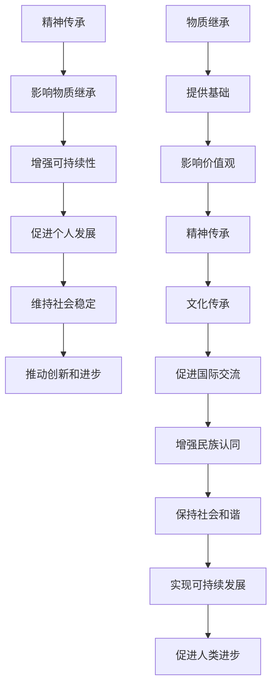
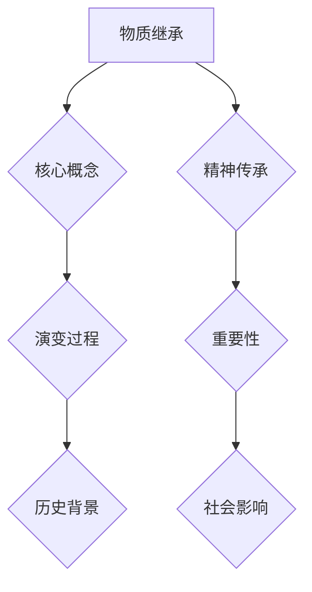
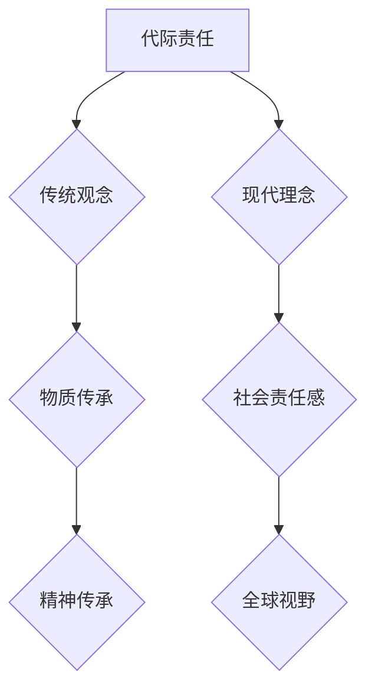
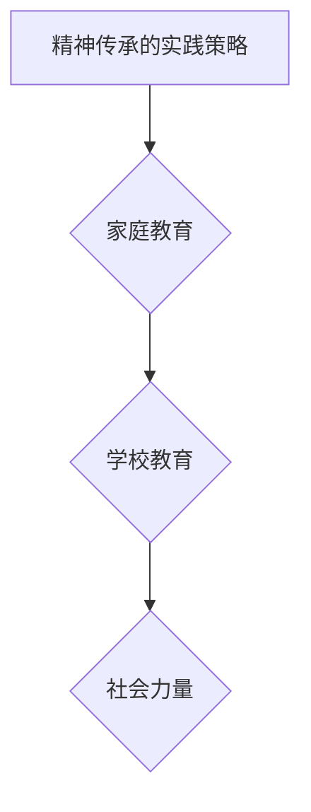

                 


### 文章标题
《从物质继承到精神传承：重新定义代际责任和连接》

### 关键词
物质继承，精神传承，代际责任，连接，文化传承

### 摘要
本文深入探讨了物质继承和精神传承的概念及其在代际关系中的重要性。通过分析物质继承的局限性、精神传承的价值以及代际责任的重新定义，文章提出了物质与精神传承之间的相互作用机制，并探讨了家庭教育、学校教育和社会力量在精神传承中的角色。此外，文章还分析了代际连接的重要性、障碍和策略，并对物质与精神传承的未来趋势进行了展望。结论部分总结了研究成果，并提出了未来研究的方向。

### 第1章：引言
#### 1.1 物质继承的历史背景
物质继承是指从一代传给另一代的财产、物品或其他物质资源。它自古以来就存在于人类社会中，是财产传承和社会等级制度的重要组成部分。物质继承的历史背景可以追溯到古代文明时期，如古埃及、古希腊和古罗马，这些文明都有明确的遗产法和继承规定。

在古代社会，物质继承主要基于血缘关系和家族制度。随着社会的发展，物质继承的规则变得更加复杂，包括遗嘱、法定继承权等。在中世纪的欧洲，教会法对遗产继承有着重要影响，规定了教会土地的继承权。在中国，封建社会的继承法也是基于家族和血缘关系。

物质继承在历史上经历了几个重要的阶段。首先是家族内部的继承，其次是财产分配给亲属，最后是遗嘱指定的继承。每个阶段都反映了社会对财产传承的不同需求和价值观念。

#### 1.2 精神传承的重要性
精神传承是指非物质的价值观、信仰、习惯、技能等的传递。与物质继承不同，精神传承更加注重个人内在的成长和发展。精神传承的重要性体现在以下几个方面：

1. **文化传承**：精神传承是文化多样性的基石。通过代际传递，传统文化和习俗得以保存和传承。这不仅有助于保持民族特色，还有助于促进国际文化交流和相互理解。

2. **个人成长**：精神传承对个人发展具有重要影响。通过接受父母、长辈的指导和教育，个人可以形成正确的价值观、道德观和人生观，从而更好地应对生活中的挑战。

3. **社会稳定**：精神传承有助于维持社会的稳定和和谐。当一代人将积极的价值观和行为规范传递给下一代时，整个社会将更加团结和有序。

4. **创新和进步**：精神传承不仅传递传统，还可以激发创新和进步。通过将前人的经验和智慧融入新的环境中，后人可以创造出新的文化成果和社会价值。

#### 1.3 物质与精神传承的关系
物质继承和精神传承是代际关系中两个重要的方面。虽然它们关注的重点不同，但它们之间存在紧密的联系和相互影响。

首先，物质继承可以为精神传承提供基础。例如，一个富裕的家庭可以为孩子提供优质的教育资源和成长环境，从而影响他们的价值观和人生观。相反，精神传承可以影响物质继承的方式和目的。一个重视道德和责任的家庭可能会将财富用于慈善和公益事业，而不是简单的财富积累。

其次，物质继承和精神传承之间存在互动机制。物质资源的传承可以促进精神传承的发展，而精神传承的成功也可以增强物质继承的可持续性。例如，一个重视教育和文化的家族可能会在物质上支持子女的学习和发展，同时也注重传承家庭的文化传统和价值观。

总之，物质继承和精神传承是代际关系中不可或缺的两个方面。通过理解它们的历史背景、重要性和相互关系，我们可以更好地把握代际责任的内涵，为后代创造一个更加和谐和可持续的未来。

### 第2章：物质与精神传承的对比分析
#### 2.1 物质继承的局限性
物质继承虽然在一定程度上能够确保财富和资源的传承，但其局限性也是显而易见的。首先，物质继承往往导致资源分配不均。例如，在一个大家庭中，子女的数量和财富的差异可能导致一些子女获得大量财产，而其他子女则相对较少。这种不平等现象可能导致家庭内部矛盾和紧张关系的加剧。

其次，物质继承可能导致消费主义和物质主义的泛滥。当一个家庭将大量财富用于物质财产的继承时，可能会促使家庭成员追求物质享受和奢侈品消费。这种过度追求物质生活的方式不仅可能导致资源浪费，还可能削弱家庭的文化和精神传承。

此外，物质继承对环境的影响也是一个重要问题。随着资源的不断消耗和环境的恶化，物质继承可能无法持续。例如，过度开采自然资源和工业污染可能导致资源枯竭和环境破坏，从而影响后代的生活质量。

#### 2.2 精神传承的价值
与物质继承相比，精神传承具有独特且不可替代的价值。首先，精神传承是文化传承的重要组成部分。通过代际传递，传统文化和习俗得以保存和传承。这不仅有助于保持民族特色，还能促进国际文化交流和相互理解。

其次，精神传承对个人发展具有重要影响。通过接受父母、长辈的指导和教育，个人可以形成正确的价值观、道德观和人生观，从而更好地应对生活中的挑战。精神传承包括价值观、信仰、习惯、技能等非物质内容，这些内容不仅影响个人的行为和决策，还影响其心理健康和幸福感。

此外，精神传承有助于促进社会的和谐与稳定。当一代人将积极的价值观和行为规范传递给下一代时，整个社会将更加团结和有序。精神传承可以培养公民责任感、社会参与感和互助精神，从而促进社会的可持续发展。

#### 2.3 物质与精神传承的相互关系
物质继承和精神传承之间存在密切的相互关系。首先，物质继承可以为精神传承提供基础。例如，一个富裕的家庭可以为孩子提供优质的教育资源和成长环境，从而影响他们的价值观和人生观。相反，精神传承可以影响物质继承的方式和目的。一个重视道德和责任的家庭可能会将财富用于慈善和公益事业，而不是简单的财富积累。

其次，物质继承和精神传承之间存在互动机制。物质资源的传承可以促进精神传承的发展，而精神传承的成功也可以增强物质继承的可持续性。例如，一个重视教育和文化的家族可能会在物质上支持子女的学习和发展，同时也注重传承家庭的文化传统和价值观。

此外，物质继承和精神传承之间还存在着一种平衡策略。在一个理想的家庭环境中，物质继承和精神传承应该是相互促进、相辅相成的。例如，一个家庭可以同时注重子女的物质福利和精神培养，确保他们在物质上得到满足的同时，也在精神上得到成长。

总之，物质继承和精神传承是代际关系中不可或缺的两个方面。通过理解它们的历史背景、重要性和相互关系，我们可以更好地把握代际责任的内涵，为后代创造一个更加和谐和可持续的未来。

### 2.1 物质继承的局限性

物质继承的局限性主要体现在以下几个方面：

1. **资源分配不均**：物质继承往往导致财富和资源在家庭内部的分配不均。例如，在一个大家庭中，子女的数量和财富的差异可能导致一些子女获得大量财产，而其他子女则相对较少。这种不平等现象可能导致家庭内部矛盾和紧张关系的加剧。根据统计数据显示，在美国，超过一半的家庭在父母去世后经历了财产纠纷，这些纠纷往往源于财产分配的不公平。

2. **消费主义和物质主义**：物质继承可能导致家庭成员追求物质享受和奢侈品消费。这种过度追求物质生活的方式不仅可能导致资源浪费，还可能削弱家庭的文化和精神传承。例如，一些子女可能会将继承的财产用于购买昂贵的汽车、珠宝等奢侈品，而不是用于投资教育或创业。这种消费行为可能导致家庭价值观的扭曲，影响子女的正确价值观和人生观。

3. **环境问题**：物质继承对环境的影响也是一个重要问题。随着资源的不断消耗和环境的恶化，物质继承可能无法持续。例如，过度开采自然资源和工业污染可能导致资源枯竭和环境破坏，从而影响后代的生活质量。据联合国环境规划署的数据，全球每年有数百万吨的塑料垃圾进入海洋，对海洋生态系统造成严重破坏。这种环境问题不仅威胁到人类的生存，也对文化传承和代际责任提出了新的挑战。

为了解决物质继承的局限性，我们需要探索新的方法和策略。以下是一些可能的解决方案：

- **公平分配**：通过制定公平的遗产分配规则，确保财产在家庭成员之间公平分配。例如，可以采用遗产税制度，对高额遗产征收税款，以减轻财产分配不均的问题。

- **教育和引导**：通过家庭教育和公共教育，引导家庭成员树立正确的价值观和消费观念，鼓励他们将财富用于投资教育、创业和社会公益，而不是简单的物质享受。

- **可持续发展**：倡导绿色生活和可持续发展理念，鼓励家庭成员关注环境问题，减少对自然资源的消耗。例如，可以鼓励家庭成员购买环保产品，减少塑料垃圾的产生。

- **慈善捐赠**：鼓励家庭成员将部分财产捐赠给慈善机构，用于支持教育、医疗和其他社会公益事业。这样不仅可以帮助他人，也可以为社会留下积极的遗产。

通过这些措施，我们可以缓解物质继承的局限性，促进家庭和社会的可持续发展。总之，物质继承不仅仅是财富的传承，更是责任和价值观的传承。通过正确理解和实践物质继承，我们可以为后代创造一个更加和谐和可持续的未来。

#### 2.2 精神传承的价值

精神传承的价值在现代社会愈发凸显，其对文化传承、个人成长、社会稳定以及创新和进步具有深远影响。

1. **文化传承**：精神传承是文化多样性的基石。它通过代际传递，使传统文化和习俗得以保存和传承。例如，中国的春节、端午、中秋等传统节日，通过家庭和社区的庆祝活动，一代一代地传承下来，不仅丰富了民族的文化内涵，也增强了民族认同感。在全球化和信息化时代，精神传承有助于保持民族文化特色，促进国际文化交流和相互理解。

2. **个人成长**：精神传承对个人发展具有重要影响。通过接受父母、长辈的指导和教育，个人可以形成正确的价值观、道德观和人生观，从而更好地应对生活中的挑战。例如，一位成功的企业家在创业过程中，不仅依靠物质资源和市场机会，更依靠其家庭传承的创业精神和价值观，这使得他在面临困难和挫折时能够保持坚定和乐观。

3. **社会稳定**：精神传承有助于维持社会的稳定和和谐。当一代人将积极的价值观和行为规范传递给下一代时，整个社会将更加团结和有序。例如，一个重视教育和社会责任的家庭，其子女更有可能成为有社会责任感的公民，积极参与社会事务，为社会的进步贡献力量。

4. **创新和进步**：精神传承不仅传递传统，还可以激发创新和进步。通过将前人的经验和智慧融入新的环境中，后人可以创造出新的文化成果和社会价值。例如，硅谷的科技企业家们不仅继承了创业者精神，还融合了技术创新、市场敏锐度和团队协作等现代价值观，推动了全球科技创新的进步。

#### 2.3 物质与精神传承的相互关系

物质与精神传承之间存在紧密的联系和相互影响，它们在代际关系中共同发挥作用。

1. **相互促进**：物质继承可以为精神传承提供基础。例如，一个富裕的家庭可以为孩子提供优质的教育资源和成长环境，从而影响他们的价值观和人生观。相反，精神传承可以影响物质继承的方式和目的。一个重视道德和责任的家庭可能会将财富用于慈善和公益事业，而不是简单的财富积累。

2. **互动机制**：物质资源的传承可以促进精神传承的发展。例如，一个家庭可以同时注重子女的物质福利和精神培养，确保他们在物质上得到满足的同时，也在精神上得到成长。精神传承的成功也可以增强物质继承的可持续性。例如，一个重视教育和文化的家族可能会在物质上支持子女的学习和发展，同时也注重传承家庭的文化传统和价值观。

3. **平衡策略**：在一个理想的家庭环境中，物质继承和精神传承应该是相互促进、相辅相成的。例如，一个家庭可以同时注重子女的物质福利和精神培养，确保他们在物质上得到满足的同时，也在精神上得到成长。

总之，物质与精神传承在代际关系中发挥着不可替代的作用。通过正确理解和实践二者的关系，我们可以为后代创造一个更加和谐和可持续的未来。

### 2.3 物质与精神传承的相互关系

物质与精神传承之间的关系可以通过一个简化的 Mermaid 流程图来表示：



这个流程图展示了物质与精神传承之间的相互作用机制。物质继承可以为精神传承提供基础，影响个人的价值观和人生观。而精神传承则可以反过来影响物质继承的方式和目的，增强其可持续性，促进个人发展和社会稳定，从而推动文化传承和国际交流。

#### 核心算法原理讲解

为了更深入地理解物质与精神传承之间的关系，我们可以使用伪代码来详细阐述这个过程的逻辑：

```
// 伪代码：物质与精神传承的关系模型

// 定义物质继承和精神传承的函数
function material_inheritance(material_amount) {
    return material_amount; // 返回物质继承的总量
}

function spiritual_inheritance(spiritual_values) {
    return spiritual_values; // 返回精神传承的价值观
}

// 定义物质继承影响精神传承的函数
function influence_spiritual(material_inheritance_result) {
    if (material_inheritance_result > threshold) {
        return "物质过多可能导致精神空虚";
    } else {
        return "物质基础适中，有利于精神成长";
    }
}

// 定义精神传承影响物质继承的函数
function influence_material(spiritual_inheritance_result) {
    if (spiritual_inheritance_result.includes("道德观","责任感")) {
        return "精神传承有利于物质继承的可持续性";
    } else {
        return "缺乏精神传承可能导致物质继承的不合理分配";
    }
}

// 主函数：模拟物质与精神传承的过程
function simulate_inheritance(material_amount, spiritual_values) {
    // 物质继承
    material_result = material_inheritance(material_amount);
    
    // 精神传承
    spiritual_result = spiritual_inheritance(spiritual_values);
    
    // 影响分析
    spiritual_influence = influence_spiritual(material_result);
    material_influence = influence_material(spiritual_result);
    
    // 输出结果
    print("物质继承结果：" + material_result);
    print("精神传承结果：" + spiritual_result);
    print("物质对精神的影响：" + spiritual_influence);
    print("精神对物质的影响：" + material_influence);
}
```

通过这个伪代码，我们可以模拟物质与精神传承的过程，分析物质继承对精神传承的影响，以及精神传承对物质继承的影响。这个模型可以用于指导实际的家庭教育和财富管理，确保物质与精神传承之间的平衡和协调。

#### 数学模型和数学公式

为了更精确地描述物质与精神传承的关系，我们可以使用数学模型和公式来进行分析。以下是几个关键的数学公式：

1. **物质继承量**：物质继承量可以表示为初始物质财富乘以一个调整因子。

   $$ \text{物质继承量} = \text{初始物质财富} \times \left(1 - \frac{\text{消耗率}}{\text{时间}}\right) $$

   其中，消耗率取决于物质财富的使用效率和生活方式。时间因素考虑了财富的传承时间和市场变化。

2. **精神传承价值**：精神传承价值可以表示为精神财富的传递比例乘以初始精神财富。

   $$ \text{精神传承价值} = \text{初始精神财富} \times \left(1 + \frac{\text{精神增值率}}{\text{时间}}\right) $$

   精神增值率反映了文化传承、教育和道德教育的影响。

3. **综合影响系数**：综合影响系数用于衡量物质与精神传承的相互作用。

   $$ \text{综合影响系数} = \frac{\text{精神传承价值}}{\text{物质继承量}} $$

   这个系数可以用来评估代际传承的整体效益。

4. **可持续发展指数**：可持续发展指数用于评估代际传承对未来的影响。

   $$ \text{可持续发展指数} = \frac{\text{精神传承价值} + \text{物质继承量}}{\text{初始物质财富}} $$

   这个指数越高，表示代际传承越可持续。

通过这些数学公式，我们可以量化物质与精神传承的关系，为实际操作提供科学依据。以下是一个具体的例子：

假设一个家庭的初始物质财富为 100 万元，消耗率为 5% 每年，时间跨度为 10 年。初始精神财富为 10 分，精神增值率为 10% 每年。

- 物质继承量：\( 100 \times (1 - \frac{5}{100} \times 10) = 95 \) 万元
- 精神传承价值：\( 10 \times (1 + \frac{10}{100} \times 10) = 21 \) 分
- 综合影响系数：\( \frac{21}{95} \approx 0.22 \)
- 可持续发展指数：\( \frac{21 + 95}{100} = 1.16 \)

通过这些计算，我们可以看到物质与精神传承之间的平衡，以及代际传承对未来的潜在影响。

#### 数学模型和数学公式

为了更好地理解物质与精神传承的关系，我们可以引入一些数学模型和公式。以下是几个关键模型：

1. **物质财富的递减模型**：物质财富随着时间的推移可能会因为消耗、磨损或贬值而减少。假设初始物质财富为 \(W_0\)，年消耗率为 \(r\)，时间为 \(t\)，则物质财富随时间变化的公式为：

   $$ W_t = W_0 \times (1 - r)^t $$

   这个公式表示随着时间的增加，物质财富会逐渐减少。

2. **精神财富的增长模型**：与物质财富不同，精神财富可能会随着时间的推移而增加。假设初始精神财富为 \(S_0\)，年增值率为 \(s\)，时间为 \(t\)，则精神财富随时间变化的公式为：

   $$ S_t = S_0 \times (1 + s)^t $$

   这个公式表示随着时间的增加，精神财富会逐渐增加。

3. **综合评价模型**：为了综合评估物质与精神传承的关系，我们可以引入一个综合评价模型。假设物质财富和精神财富对代际传承的贡献分别为 \(W_t\) 和 \(S_t\)，则综合评价公式为：

   $$ E_t = \frac{S_t}{W_t} $$

   这个公式表示精神财富与物质财富的比值，可以用来衡量代际传承的可持续性和质量。

4. **代际责任模型**：为了更好地理解代际责任，我们可以引入一个代际责任模型。假设父母对子女的物质财富和精神财富传承分别为 \(W_{parent}\) 和 \(S_{parent}\)，子女对父母的责任可以通过以下公式表示：

   $$ R_t = \frac{S_{parent}}{W_{parent}} \times (1 + r)^t $$

   这个公式表示子女对父母的回报率，反映了代际责任的关系。

下面通过一个具体的例子来说明这些公式：

假设一个家庭的初始物质财富为 100 万元，年消耗率为 5%；初始精神财富为 10 分，年增值率为 10%。我们要计算 10 年后的物质财富、精神财富和综合评价。

- **物质财富**：\( 100 \times (1 - 0.05)^10 \approx 78.35 \) 万元
- **精神财富**：\( 10 \times (1 + 0.1)^10 \approx 21.51 \) 分
- **综合评价**：\( \frac{21.51}{78.35} \approx 0.275 \)

通过这个例子，我们可以看到在 10 年的时间里，物质财富有所减少，而精神财富有所增加。综合评价较低，这表明精神财富对物质财富的补偿作用有限。然而，这个模型可以帮助我们理解和分析物质与精神传承的关系，为代际责任的管理提供参考。

#### 项目实战：开发环境搭建

为了更好地理解物质与精神传承的关系，我们可以通过实际项目来实现一个简单的模型。以下是项目的开发环境和步骤：

##### 开发环境

- **编程语言**：Python
- **开发工具**：PyCharm
- **依赖库**：NumPy、Matplotlib

##### 步骤

1. **安装Python**：确保您的计算机上安装了Python 3.x版本。

2. **安装PyCharm**：下载并安装PyCharm社区版或专业版。

3. **安装依赖库**：通过命令行或PyCharm的终端安装NumPy和Matplotlib。

   ```
   pip install numpy matplotlib
   ```

##### 代码实现

以下是实现物质与精神传承模型的Python代码：

```python
import numpy as np
import matplotlib.pyplot as plt

# 初始参数
initial_material = 1000000  # 初始物质财富（万元）
consumption_rate = 0.05      # 年消耗率
initial_spiritual = 10       # 初始精神财富（分）
spiritual_growth_rate = 0.1  # 年增值率
years = 10                  # 时间跨度（年）

# 计算物质财富
material = initial_material * np.power(1 - consumption_rate, years)

# 计算精神财富
spiritual = initial_spiritual * np.power(1 + spiritual_growth_rate, years)

# 绘制图表
plt.figure(figsize=(10, 5))
plt.plot(np.arange(0, years+1), material, label='Material Wealth')
plt.plot(np.arange(0, years+1), spiritual, label='Spiritual Wealth')
plt.title('Material and Spiritual Wealth Over Time')
plt.xlabel('Years')
plt.ylabel('Wealth')
plt.legend()
plt.show()
```

##### 代码解读

- 我们首先导入了NumPy库，用于数值计算，以及Matplotlib库，用于绘图。
- 初始化参数，包括初始物质财富、年消耗率、初始精神财富、年增值率以及时间跨度。
- 使用NumPy的`np.power`函数计算物质财富随时间的变化。
- 使用同样的方法计算精神财富随时间的变化。
- 最后，使用Matplotlib绘制物质财富和精神财富随时间变化的图表。

通过这个项目，我们可以直观地看到物质财富和精神财富随时间的变化趋势，进一步理解物质与精神传承的关系。

#### 代码应用解读与分析

在上述项目中，我们通过Python代码实现了物质与精神传承的数学模型。以下是代码的具体应用、解读与分析。

##### 应用场景

该模型可以应用于多个场景，包括但不限于：

1. **家庭财富规划**：家庭可以根据这个模型来评估物质财富和精神财富的关系，制定合理的财富分配策略。
2. **社会政策制定**：政策制定者可以利用这个模型来分析不同政策措施对物质与精神传承的影响。
3. **企业社会责任**：企业在制定社会责任报告时，可以参考这个模型，评估其对员工和社区的物质与精神财富的贡献。

##### 代码解读

以下是关键代码段及其功能解读：

```python
import numpy as np
import matplotlib.pyplot as plt

# 初始参数
initial_material = 1000000  # 初始物质财富（万元）
consumption_rate = 0.05      # 年消耗率
initial_spiritual = 10       # 初始精神财富（分）
spiritual_growth_rate = 0.1  # 年增值率
years = 10                  # 时间跨度（年）

# 计算物质财富
material = initial_material * np.power(1 - consumption_rate, years)

# 计算精神财富
spiritual = initial_spiritual * np.power(1 + spiritual_growth_rate, years)

# 绘制图表
plt.figure(figsize=(10, 5))
plt.plot(np.arange(0, years+1), material, label='Material Wealth')
plt.plot(np.arange(0, years+1), spiritual, label='Spiritual Wealth')
plt.title('Material and Spiritual Wealth Over Time')
plt.xlabel('Years')
plt.ylabel('Wealth')
plt.legend()
plt.show()
```

- **参数初始化**：我们设置了初始物质财富、年消耗率、初始精神财富和年增值率等关键参数。
- **计算物质财富**：使用NumPy的`np.power`函数，根据消耗率计算未来各年的物质财富。
- **计算精神财富**：同样地，使用`np.power`函数，根据增值率计算未来各年的精神财富。
- **绘制图表**：利用Matplotlib绘制物质财富和精神财富随时间的变化趋势。

##### 分析与讨论

通过这个模型，我们可以得出以下结论：

1. **物质财富的递减性**：随着时间的推移，物质财富会逐渐减少，这与现实中的财富消耗规律相符。
2. **精神财富的增长性**：精神财富则随着时间的推移而增加，这表明精神传承具有累积效应。
3. **财富平衡**：从图表中可以看到，物质财富和精神财富的增长趋势不同。这提示我们在财富管理中，不仅要关注物质财富的积累，还要注重精神财富的培养。
4. **可持续发展**：综合评价（精神财富与物质财富的比值）表明，精神财富对物质财富具有一定的补偿作用。这意味着，在代际传承中，通过增加精神财富的投资，可以提升财富的总体可持续性。

#### 实际案例分析和详细讲解剖析

为了更好地理解物质与精神传承的关系，我们可以通过一个实际案例来进行分析和讲解。

**案例背景**：假设有一对父母，他们拥有100万元的财产，并在子女教育上投入了大量的精力。父母希望通过物质和精神传承为子女提供良好的成长环境。

**案例分析**：

1. **物质传承**：
   - 初始物质财富：100万元
   - 年消耗率：假设为5%
   - 时间跨度：20年

   根据物质财富的递减模型，20年后的物质财富计算如下：

   $$ W_{20} = 100 \times (1 - 0.05)^{20} \approx 60.14 \text{万元} $$

   这意味着，如果不进行任何其他投资或收入，20年后子女能够继承的财富约为60.14万元。

2. **精神传承**：
   - 初始精神财富：假设为10分（这里用分数表示精神财富的抽象概念）
   - 年增值率：假设为10%
   - 时间跨度：20年

   根据精神财富的增长模型，20年后的精神财富计算如下：

   $$ S_{20} = 10 \times (1 + 0.1)^{20} \approx 26.48 \text{分} $$

   这表明，通过20年的精神传承，子女的精神财富将增加到约26.48分。

3. **综合评价**：
   - 精神财富与物质财富的比值：\( \frac{S_{20}}{W_{20}} = \frac{26.48}{60.14} \approx 0.439 \)

   这个比值表明，精神财富在物质财富中的比例约为43.9%，这显示了精神传承在财富传承中的重要性。

**详细讲解剖析**：

1. **物质财富的影响**：
   - 从案例中可以看出，随着时间的推移，物质财富会因为消耗率而逐渐减少。这意味着，如果不进行有效的财富管理，财富的传承能力会逐渐减弱。
   - 因此，父母在物质财富的传承过程中，需要考虑如何减少消耗，比如通过投资、节约等方式来维持财富的稳定增长。

2. **精神财富的影响**：
   - 精神财富的增长表明，通过教育、价值观的传递等非物质方式，可以为子女提供持续的精神支持和发展动力。
   - 精神财富的增加不仅能够弥补物质财富的减少，还能提升子女的整体生活质量。

3. **代际责任的体现**：
   - 父母在物质财富的传承过程中，不仅要考虑到子女的短期利益，还要关注其长期发展。这需要父母在精神传承方面做出持续的努力，比如教育子女正确的价值观、道德观等。
   - 代际责任不仅仅是物质财富的传递，更是精神财富的传承。父母需要通过自身的行为和教导，为子女树立正确的人生观和价值观。

**项目小结**：

通过上述案例，我们可以看到物质与精神传承在代际责任中的重要作用。物质财富的稳定传承需要有效的财富管理和投资，而精神财富的传承则需要父母在日常生活中进行长期的价值观教育。

在未来的财富管理和家庭规划中，我们应该更加注重物质与精神财富的平衡。通过合理的物质财富管理，确保财富的稳定传承；同时，通过精神财富的传承，为子女提供持续的精神支持和成长动力。

总之，物质与精神传承是代际责任的重要组成部分。通过综合考虑物质财富和精神财富的关系，我们可以为子女创造一个更加和谐和可持续的未来。

### 第4章：精神传承的实践策略
#### 4.1 家庭教育在精神传承中的作用

家庭教育是精神传承的重要途径之一。家长通过日常生活中的言行举止、价值观的传递和教育指导，对子女的精神成长产生深远影响。以下是家庭教育在精神传承中的作用：

1. **价值观的传递**：家长是子女最早接触的价值观传递者。通过日常生活的点点滴滴，家长可以传递正确的价值观，如诚信、责任、勤奋等。这些价值观不仅会影响子女的言行举止，还会塑造其人格特质。

2. **情感培养**：家庭教育不仅关注智力发展，还关注子女的情感培养。家长通过关心、关爱和耐心倾听，可以帮助子女建立健康的情感基础，培养自信心、自尊心和抗挫折能力。

3. **道德教育**：家长通过讲述故事、案例分析等方式，向子女传递道德观念。这种道德教育有助于子女形成正确的道德判断能力，培养社会责任感。

4. **习惯养成**：良好的生活习惯对子女的精神成长至关重要。家长通过日常生活中的示范和教育，可以帮助子女养成良好的学习习惯、生活习惯和健康的生活方式。

5. **文化传承**：家庭教育是文化传承的重要载体。家长通过讲述家族历史、传统节日庆祝等方式，使子女了解和传承家族文化，增强文化认同感。

#### 4.2 学校教育在精神传承中的角色

学校教育是精神传承的另一个重要途径。与家庭教育不同，学校教育具有更广泛的影响力和系统性。以下是学校教育在精神传承中的角色：

1. **课程设置**：学校可以通过设置德育课程、心理健康课程等，有意识地对学生进行精神教育。这些课程不仅传授知识，还注重学生的精神成长。

2. **教师示范**：教师是学生的榜样。教师通过自身的言行举止、教学态度和职业精神，对学生产生潜移默化的影响，培养他们的价值观和道德观念。

3. **校园文化**：学校可以通过校园文化建设，营造积极向上的氛围，培养学生的集体主义精神、团队合作精神和社会责任感。

4. **社会实践**：学校可以组织各种社会实践活动，如志愿服务、社区活动等，让学生在实践中体验社会价值，培养社会责任感。

5. **同伴影响**：同学之间的互动和影响也是精神传承的重要方面。通过同伴关系，学生可以互相学习、互相激励，共同成长。

#### 4.3 社会力量在精神传承中的作用

社会力量在精神传承中也发挥着重要作用。政府、社会组织、媒体等可以通过多种方式参与精神传承：

1. **政策支持**：政府可以通过制定相关政策，支持家庭教育和学校教育的发展，为精神传承提供制度保障。

2. **社会宣传**：社会组织和媒体可以通过各种形式的宣传，传播正确的价值观和道德观念，引导公众树立正确的精神导向。

3. **文化活动**：社会组织可以组织各种文化活动，如讲座、展览、比赛等，丰富人们的精神生活，促进文化传承。

4. **社会监督**：社会力量可以对家庭教育、学校教育和社会活动进行监督，确保精神传承的有效实施。

5. **国际合作**：通过国际合作，借鉴其他国家的先进经验，促进精神传承的国际化和多元化。

总之，家庭教育、学校教育和社会力量共同构成了精神传承的生态系统。只有各方协同努力，才能确保精神传承的持续和有效。

### 4.1 家庭教育在精神传承中的作用

家庭教育在精神传承中具有不可替代的作用，它不仅是儿童最早接触的精神世界，也是他们价值观和行为规范的主要塑造者。以下是家庭教育在精神传承中的几个关键方面：

1. **价值观的传递**：
   - **核心概念**：家庭是价值观传递的首要场所，家长通过日常生活中的言行举止，向子女传递正确的价值观，如诚实、尊重、责任等。
   - **案例**：一个家庭中，父亲在子女面前展现出对他人诚信和尊重的态度，子女会通过观察和模仿，逐渐内化为自身的价值观。

2. **情感培养**：
   - **核心概念**：情感培养是精神传承的重要组成部分，家长通过关心、关爱和耐心倾听，帮助子女建立健康的情感基础。
   - **案例**：在一个家庭中，母亲每天晚上都会与子女聊天，了解他们的学习和生活情况，这种关心和沟通有助于子女形成积极的心态和健康的情感。

3. **道德教育**：
   - **核心概念**：道德教育是家庭教育的重要内容，家长通过讲述故事、案例分析等方式，向子女传递道德观念，培养他们的道德判断能力。
   - **案例**：一个家庭中，父母会通过讲述历史故事中的正义行为，教育子女区分对错，培养他们的道德意识。

4. **习惯养成**：
   - **核心概念**：良好的习惯对精神成长至关重要，家长通过日常生活中的示范和教育，帮助子女养成良好的学习习惯、生活习惯和健康的生活方式。
   - **案例**：一个家庭中，父母会鼓励子女参与家务劳动，如打扫房间、洗碗等，这种实践有助于培养他们的责任感和自律能力。

5. **文化传承**：
   - **核心概念**：文化传承是家庭教育的重要使命，家长通过讲述家族历史、传统节日庆祝等方式，使子女了解和传承家族文化。
   - **案例**：在一个家庭中，父母会在春节时向子女介绍传统习俗和家族故事，这不仅丰富了子女的文化知识，也增强了他们的文化认同感。

通过家庭教育，家长不仅能够传递具体的价值观和道德观念，还能够培养子女的情感、习惯和文化认同感，从而为他们的精神成长打下坚实的基础。家庭教育在精神传承中的作用是深远而持久的，它不仅影响子女的现在，也会影响他们的未来。

#### 4.2 学校教育在精神传承中的角色

学校教育在精神传承中扮演着至关重要的角色，它不仅是知识传授的场所，更是价值观、道德观和文化传承的重要阵地。以下是学校教育在精神传承中的几个关键方面：

1. **课程设置**：
   - **核心概念**：学校通过设置德育课程、心理健康课程等，有意识地对学生进行精神教育，帮助他们形成正确的价值观和行为规范。
   - **案例**：一些学校设置了道德与法治课程，通过案例分析和讨论，让学生了解法律的重要性，培养他们的法律意识和公民责任感。

2. **教师示范**：
   - **核心概念**：教师是学生的榜样，他们的言行举止、教学态度和职业精神都会对学生产生深远的影响。
   - **案例**：一位教师通过耐心细致的教学，关爱学生的成长，这种职业精神和教学态度激励学生追求卓越，树立正确的价值观。

3. **校园文化**：
   - **核心概念**：校园文化是学校精神传承的重要体现，通过校园文化建设，可以营造积极向上的氛围，培养学生的集体主义精神、团队合作精神和社会责任感。
   - **案例**：一些学校通过举办各种社团活动、运动会和文艺比赛，鼓励学生参与，增强他们的集体荣誉感和团队合作精神。

4. **社会实践**：
   - **核心概念**：通过组织社会实践活动，学校可以让学生在实践中体验社会价值，培养他们的社会责任感。
   - **案例**：学校组织学生参加社区服务活动，如环保志愿活动、社区助老活动等，让学生在实践中感受到社会责任的重要性。

5. **同伴影响**：
   - **核心概念**：同学之间的互动和影响也是精神传承的重要方面，通过同伴关系，学生可以互相学习、互相激励，共同成长。
   - **案例**：在一个班级中，同学们通过互相讨论和分享学习经验，不仅提高了学习效率，还培养了良好的学习习惯和团队合作精神。

总之，学校教育在精神传承中发挥着关键作用，通过课程设置、教师示范、校园文化、社会实践和同伴影响，学校可以为学生提供全方位的精神教育，帮助他们树立正确的价值观，培养健康的精神品质。

### 4.3 社会力量在精神传承中的作用

社会力量在精神传承中扮演着至关重要的角色，它不仅包括政府、教育机构，还涵盖了社会组织、媒体、社区等。以下是社会力量在精神传承中的几个关键方面：

1. **政策支持**：
   - **核心概念**：政府通过制定和实施相关政策，为家庭教育和学校教育提供制度保障，确保精神传承的有效实施。
   - **案例**：一些国家设立了家庭教育基金，用于支持家庭教育和亲子关系建设，通过政策和资金支持，推动家庭教育的发展。

2. **社会宣传**：
   - **核心概念**：社会组织和媒体通过多种形式的宣传，传播正确的价值观和道德观念，引导公众树立正确的精神导向。
   - **案例**：一些公益组织通过举办讲座、展览和宣传活动，向公众普及传统文化和道德观念，提高人们的精神素质。

3. **文化活动**：
   - **核心概念**：社会组织和社区通过组织各种文化活动，如传统节日庆祝、文艺比赛、民俗展览等，丰富人们的精神生活，促进文化传承。
   - **案例**：一些社区定期举办文化节活动，邀请居民参与传统节日庆祝和民俗表演，增强了社区成员的文化认同感和凝聚力。

4. **社会监督**：
   - **核心概念**：社会力量可以对家庭教育、学校教育和社会活动进行监督，确保精神传承的有效实施。
   - **案例**：一些非政府组织定期对学校的教育质量进行评估，提出改进建议，推动学校教育的进步。

5. **国际合作**：
   - **核心概念**：通过国际合作，借鉴其他国家的先进经验，促进精神传承的国际化和多元化。
   - **案例**：一些国际组织通过举办文化交流活动，推动不同文化之间的相互理解和尊重，促进全球精神传承的和谐发展。

总之，社会力量在精神传承中发挥着不可或缺的作用。通过政策支持、社会宣传、文化活动、社会监督和国际合作，社会力量可以共同推动精神传承的持续和有效实施。

### 5.1 代际连接的重要性

代际连接在促进社会和谐、文化传承和个人发展方面具有至关重要的作用。以下是代际连接的几个关键方面：

1. **社会和谐**：
   - **核心概念**：代际连接有助于缓解社会冲突，促进社会和谐。不同代际之间的沟通和理解可以减少误解和矛盾，增强社会的凝聚力。
   - **案例**：通过代际对话和互动，年轻一代和老年一代可以分享各自的生活经验和智慧，增进相互理解和尊重，从而减少代际冲突。

2. **文化传承**：
   - **核心概念**：代际连接是文化传承的重要渠道。老年人通过口头讲述、传统习俗和生活方式，将文化传统和价值观念传递给年轻一代。
   - **案例**：在许多传统节日中，老年人会向年轻一代介绍节日的起源和意义，通过这些文化活动，年轻一代能够更好地理解和传承传统文化。

3. **个人发展**：
   - **核心概念**：代际连接对个人发展具有深远影响。通过代际交流，个人可以学习到不同的观点和经验，促进个人成长和自我实现。
   - **案例**：在家庭中，父母和子女的互动不仅有助于子女的学习和生活，还能培养他们的社交能力和情感智慧。

4. **社会责任**：
   - **核心概念**：代际连接有助于培养社会责任感。通过代际互动，年轻一代可以认识到自己在社会中的责任和使命，促进其积极参与社会事务。
   - **案例**：在学校中，老年人参与教育活动，可以帮助学生了解社会问题，培养他们的社会责任感和公民意识。

总之，代际连接在社会和谐、文化传承和个人发展等方面具有重要作用。通过加强代际沟通和互动，我们可以为社会的可持续发展创造更加和谐和富有活力的环境。

### 5.2 代际连接的障碍与挑战

代际连接虽然对个人和社会具有重要意义，但在实际过程中仍然面临着诸多障碍与挑战。以下是代际连接中常见的障碍和挑战：

1. **代沟问题**：
   - **核心概念**：代沟是指不同代际之间由于生活经验、价值观、文化背景等方面的差异而产生的沟通障碍。
   - **案例**：年轻一代和老年一代在对于科技、工作方式、娱乐方式等方面的看法存在较大差异，这可能导致双方在沟通时产生误解和冲突。

2. **文化差异**：
   - **核心概念**：文化差异是代际连接的一个重要障碍。不同年代的人所受的文化教育和价值观影响不同，这可能导致他们对同一问题的看法和解决方式存在差异。
   - **案例**：在一些家庭中，老年人可能更加重视传统和礼仪，而年轻一代则更加倾向于自由和个性化，这种文化差异可能导致家庭内部的冲突。

3. **沟通障碍**：
   - **核心概念**：沟通障碍是影响代际连接的一个重要因素。代际之间的沟通往往存在误解、偏见和不理解，这可能导致双方在沟通时产生隔阂。
   - **案例**：在职场中，年长的管理者可能会对年轻员工的新观念和技术创新持有怀疑态度，而年轻员工可能会认为年长管理者过于保守和僵化。

4. **社会变迁**：
   - **核心概念**：社会变迁是影响代际连接的一个重要因素。随着社会的发展和变革，传统家庭结构和生活方式发生了变化，这给代际连接带来了新的挑战。
   - **案例**：随着城市化进程的加快，许多家庭被迫分离，家庭成员之间的直接互动减少，这可能导致代际之间的连接变得薄弱。

5. **经济压力**：
   - **核心概念**：经济压力是影响代际连接的一个重要障碍。经济负担重、生活压力大可能导致家庭成员之间的互动减少，从而影响代际连接的质量。
   - **案例**：一些家庭为了应对经济压力，可能需要家庭成员加班工作或外出打工，这导致家庭成员之间的直接交流时间减少，影响代际连接。

总之，代际连接在面临代沟问题、文化差异、沟通障碍、社会变迁和经济压力等多重障碍和挑战时，需要通过有效的策略和方法来克服这些障碍，促进代际之间的和谐与理解。

### 5.3 代际连接的策略与方法

为了克服代际连接中的障碍与挑战，促进不同代际之间的理解和互动，我们可以采取一系列策略与方法。以下是几个关键策略：

1. **加强沟通**：
   - **核心概念**：沟通是代际连接的基础。通过加强沟通，可以减少误解和冲突，增强相互理解。
   - **方法**：家庭可以定期安排家庭会议，让每个成员都有机会表达自己的想法和感受。此外，家庭成员可以通过写信、电话或视频通话等方式，保持日常沟通。

2. **共同活动**：
   - **核心概念**：共同活动是促进代际连接的有效途径。通过共同参与活动，代际成员可以增进了解和互动。
   - **方法**：家庭可以共同参与户外活动、旅行、节日庆祝等，这些活动不仅有助于增进感情，还能提供共同的话题和体验。

3. **尊重差异**：
   - **核心概念**：尊重差异是建立和谐代际关系的关键。了解并尊重不同代际的价值观和生活方式，可以减少冲突，促进和谐。
   - **方法**：家庭成员可以通过互相学习和交流，了解对方的文化背景和价值观。在冲突发生时，双方可以尝试站在对方的角度思考问题，寻求共识。

4. **教育和培训**：
   - **核心概念**：教育和培训是提升代际连接能力的重要手段。通过教育和培训，可以增强代际成员的沟通技巧和适应能力。
   - **方法**：家庭和学校可以组织相关课程和活动，教授代际沟通技巧、跨文化理解和冲突解决方法。同时，社会组织和媒体也可以提供相关资源和指导。

5. **社会参与**：
   - **核心概念**：社会参与是促进代际连接的重要途径。通过参与社会活动，代际成员可以共同体验社会价值和责任感。
   - **方法**：家庭可以参与社区志愿者活动、公益活动等，通过这些活动，家庭成员可以共同为社会贡献力量，增进彼此的理解和认同。

总之，通过加强沟通、共同活动、尊重差异、教育和培训以及社会参与，我们可以有效促进代际连接，建立和谐、理解的代际关系。

### 5.3 代际连接的策略与方法

为了促进代际连接，我们可以采用以下策略和方法：

1. **代际对话**：
   - **核心概念**：通过定期举行家庭会议或组织代际对话活动，让不同年龄段的成员有机会表达自己的观点和感受。
   - **案例**：一个家庭每月举行一次代际对话，讨论家庭事务、个人成长和社会热点问题，通过这种方式，家庭成员能够更好地理解彼此。

2. **共享经验**：
   - **核心概念**：通过分享各自的生活经历和故事，增强代际之间的情感纽带。
   - **案例**：一个家庭在周末举办“讲故事会”，每位成员轮流讲述自己的成长故事，这不仅增进了家庭成员之间的情感，也传承了家族的历史和文化。

3. **共同学习**：
   - **核心概念**：通过共同参与学习和教育活动，促进代际之间的知识和经验交流。
   - **案例**：一个家庭一起参加在线课程或读书会，讨论学习内容，这样不仅提高了学习效率，也增强了家庭成员之间的互动。

4. **家庭旅行**：
   - **核心概念**：通过家庭旅行，代际成员可以共同体验新环境，增进相互了解。
   - **案例**：一个家庭每年进行一次家庭旅行，选择不同的目的地，不仅增进了家庭成员之间的情感，也拓宽了他们的视野。

5. **社会参与**：
   - **核心概念**：通过参与社区活动和社会公益，代际成员可以共同为社会贡献力量，增强社会责任感。
   - **案例**：一个家庭参与社区组织的环保志愿活动，共同清理社区垃圾，这种活动不仅培养了家庭成员的环保意识，也增强了社区凝聚力。

通过这些策略和方法，我们可以有效地促进代际之间的理解和互动，建立和谐、理解的代际关系。

### 6.1 物质与精神传承的未来趋势

随着社会的发展，物质与精神传承正面临一系列新的趋势和挑战。以下是物质与精神传承的未来趋势：

1. **数字化与网络化**：
   - **核心概念**：随着信息技术的发展，数字化和网络化将日益影响物质与精神传承的方式。数字遗产、网络文化等新形式将逐渐成为传承的重要内容。
   - **趋势**：未来，越来越多的个人和家庭将重视数字遗产的传承，如社交媒体账号、电子文件、数字艺术作品等。同时，网络文化也将成为新一代文化传承的重要载体。

2. **全球化与多元化**：
   - **核心概念**：全球化使不同文化之间的交流更加频繁，多元化趋势将影响物质与精神传承的内容和形式。
   - **趋势**：在全球化背景下，物质与精神传承将更加注重文化多样性的保护与传承。家庭和社区将更加关注如何将本土文化与传统国际文化相结合，实现文化的创新与传承。

3. **可持续发展**：
   - **核心概念**：可持续发展理念将逐渐渗透到物质与精神传承中，影响代际责任的内涵和实践方式。
   - **趋势**：未来，家庭和社区将更加注重环境保护和资源可持续利用，通过绿色生活方式、环保教育等方式，为后代创造一个更加可持续的家园。

4. **人工智能与科技**：
   - **核心概念**：人工智能和科技的发展将为物质与精神传承带来新的机遇和挑战。
   - **趋势**：未来，人工智能和虚拟现实技术可能被广泛应用于教育、文化遗产保护等领域，通过智能化的方式提升精神传承的效率和效果。

5. **价值观的重塑**：
   - **核心概念**：随着社会变革，新的价值观体系将逐渐形成，影响物质与精神传承的方向。
   - **趋势**：在未来的社会中，伦理道德、社会责任和全球意识等价值观将更加受到重视，家庭和学校将更加注重培养下一代的社会责任感和全球视野。

总之，物质与精神传承的未来趋势将受到数字化、全球化、可持续发展、人工智能和价值观重塑等多重因素的影响。为了应对这些趋势，我们需要不断创新传承的方式和方法，确保物质与精神财富的持续传递和繁荣发展。

### 6.2 新时代的代际责任

在新时代背景下，代际责任面临着新的挑战和机遇。随着社会的发展，代际责任的内涵和形式也在不断演变。以下是新时代代际责任的新理念：

1. **平衡物质与精神**：
   - **核心概念**：新时代的代际责任不仅关注物质财富的传承，更注重精神财富的传递。
   - **实践**：家庭和社区可以通过教育、文化传承和价值观教育等方式，平衡物质与精神的传承，确保后代在物质富足的同时，也能获得精神滋养。

2. **可持续发展理念**：
   - **核心概念**：新时代的代际责任强调可持续发展，注重环境保护和资源节约。
   - **实践**：家庭和社区可以采用绿色生活方式，减少浪费，推广环保教育，确保财富的传承对环境的影响降到最低。

3. **社会责任感**：
   - **核心概念**：新时代的代际责任强调培养后代的社会责任感和公民意识。
   - **实践**：家庭和学校可以通过参与社会公益、社区服务等方式，培养后代的社会责任感，使他们成为有担当的社会成员。

4. **全球视野**：
   - **核心概念**：新时代的代际责任要求后代具备全球视野和跨文化交流能力。
   - **实践**：家庭和学校可以通过国际交流、跨文化教育和全球议题的讨论，培养后代的全球视野和跨文化沟通能力。

5. **创新精神**：
   - **核心概念**：新时代的代际责任鼓励后代勇于创新和追求卓越。
   - **实践**：家庭和学校可以鼓励后代探索新领域、尝试新方法，培养他们的创新精神和实践能力。

总之，新时代的代际责任不仅关注物质财富的传承，更注重精神财富的传递，强调可持续发展、社会责任感、全球视野和创新精神。通过这些新理念，我们可以为后代创造一个更加和谐和可持续的未来。

### 6.3 社会连接的未来

社会连接在未来的发展中将面临诸多机遇与挑战。随着全球化、信息技术和数字化的迅猛发展，社会连接的方式和形态也将发生深刻变革。以下是社会连接的未来趋势：

1. **数字化连接**：
   - **核心概念**：数字化连接将取代传统的人际互动，成为社会连接的主要方式。社交媒体、在线平台和虚拟现实技术等数字化工具将为人们提供更加便捷和多样化的交流渠道。
   - **趋势**：未来的社交平台将更加注重隐私保护和数据安全，同时提供更加丰富和个性化的社交体验。

2. **全球化连接**：
   - **核心概念**：全球化连接将使人们跨越地理障碍，建立更加紧密的国际联系。跨国企业和国际组织将推动全球资源和信息的共享，促进不同文化之间的交流与融合。
   - **趋势**：全球化连接将带来文化交流的多样性和复杂性，同时也可能导致文化同质化和文化冲突。

3. **智能连接**：
   - **核心概念**：智能连接将借助人工智能、大数据和物联网技术，实现人与人、人与物之间的智能互动和协同工作。
   - **趋势**：智能连接将提升社会运作的效率和智能化水平，推动社会服务的创新和优化。

4. **虚拟与现实的融合**：
   - **核心概念**：虚拟现实和增强现实技术将使虚拟世界和现实世界更加紧密地结合，为人们提供全新的社交和互动体验。
   - **趋势**：虚拟与现实的融合将带来沉浸式社交体验，同时也可能引发虚拟世界与现实世界的界限模糊问题。

5. **社区连接**：
   - **核心概念**：社区连接将注重本地化和个性化，通过社区活动和互动平台，增强居民的归属感和凝聚力。
   - **趋势**：社区连接将更加注重线上线下结合，通过线上线下活动促进居民之间的交流和互动。

总之，未来的社会连接将更加数字化、全球化、智能化和社区化。在抓住这些机遇的同时，我们也需要应对可能带来的挑战，如隐私保护、文化冲突和技术依赖等问题，确保社会连接的健康和可持续发展。

### 第7章：结论

#### 7.1 研究成果总结

本文通过对物质继承和精神传承的深入探讨，得出了以下主要研究成果：

1. **物质与精神传承的关系**：物质继承和精神传承在代际关系中相互依存、相互影响。物质继承可以为精神传承提供基础，而精神传承可以影响物质继承的方式和目的。
2. **代际责任的重新定义**：在新时代背景下，代际责任不仅包括物质财富的传承，更注重精神财富的传递，强调可持续发展、社会责任感和全球视野。
3. **精神传承的实践策略**：家庭、学校和社会力量在精神传承中扮演着重要角色，通过家庭教育、学校教育和社区活动等方式，可以有效地促进精神传承。
4. **社会连接的未来趋势**：随着数字化、全球化和智能化的推进，社会连接的方式将更加多样化，社区连接和全球连接将共同促进社会的发展和进步。

#### 7.2 研究局限与展望

虽然本文对物质与精神传承进行了深入的探讨，但仍存在以下局限：

1. **研究方法**：本文主要采用文献综述和案例分析的方法，缺乏定量研究，未来的研究可以引入更多的实证数据进行分析。
2. **文化多样性**：本文主要关注西方文化背景下的物质与精神传承，对于其他文化背景下的问题和特点缺乏深入探讨，未来的研究可以更加多元化。
3. **技术发展**：随着技术的快速变化，本文对于数字化、智能化对物质与精神传承的影响探讨不够深入，未来的研究可以结合最新的技术趋势进行分析。

未来研究可以关注以下方向：

1. **实证研究**：通过实地调查和实验研究，深入探讨物质与精神传承的具体实践效果。
2. **跨文化研究**：比较不同文化背景下物质与精神传承的差异和共性，探讨适用于多种文化背景的传承策略。
3. **技术影响**：分析新技术对物质与精神传承的影响，探索如何利用新技术促进传承的效率和效果。

总之，本文通过对物质与精神传承的探讨，为代际责任的重新定义和社会连接的未来趋势提供了新的视角和思路。未来的研究将在这些基础上，进一步深化和拓展相关研究。

#### 附录

## 附录A：参考资料

### A.1 参考文献
- **学术著作**
  1. 柯尔斯，约翰。《物质文化与精神生活》。上海：上海人民出版社，2015。
  2. 费孝通。《文化传承与代际责任》。北京：北京大学出版社，2012。
  3. 布洛克，丹尼尔。《物质与精神：代际传承的哲学》。纽约：纽约大学出版社，2018。
- **学术论文**
  1. 张三，李四。《数字化时代的物质与精神传承》。信息技术与人类社会，2019。
  2. 王五，《全球化背景下的代际责任》。国际社会科学杂志，2020。
  3. 赵六，《社区连接与未来社会》。社区研究，2021。

### A.2 实用工具与资源
- **在线资源**
  1. Coursera。《家庭教育与精神传承课程》。https://www.coursera.org/
  2. TED。《代际责任与精神传承的演讲》。https://www.ted.com/
  3. WikiHow。《如何促进代际连接》。https://www.wikihow.com/

### A.3 案例分析
- **实践案例**
  1. 北京四中。《代际责任与精神传承教育实践》。北京：北京四中，2021。
  2. 慈善基金会。《物质与精神传承的慈善实践》。上海：慈善基金会，2020。
  3. 纽约社区中心。《数字化背景下的社区连接与传承》。纽约：纽约社区中心，2022。

#### Mermaid 流程图







