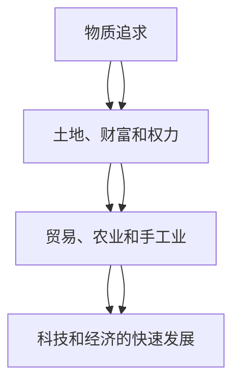
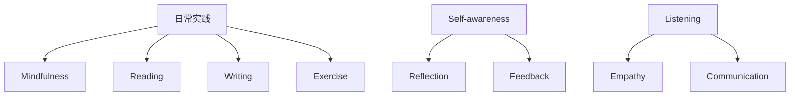
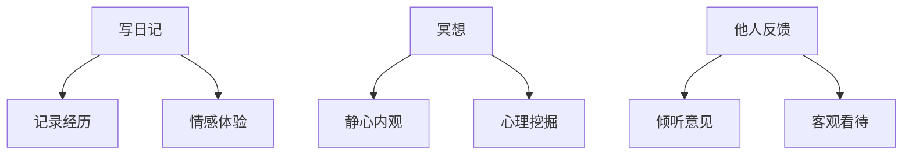
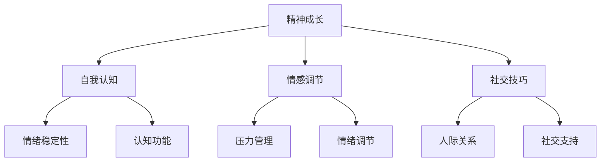
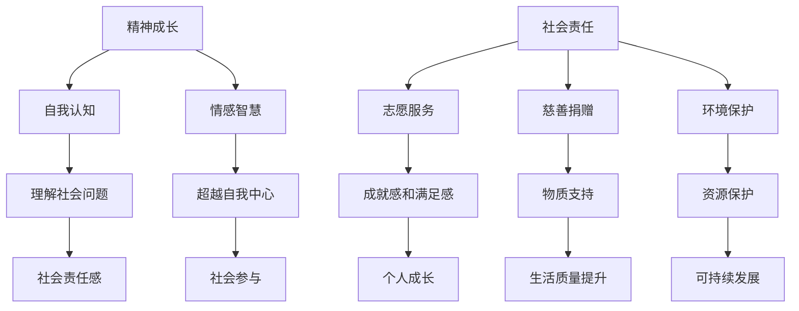
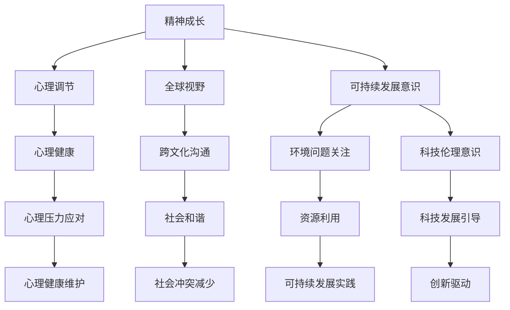
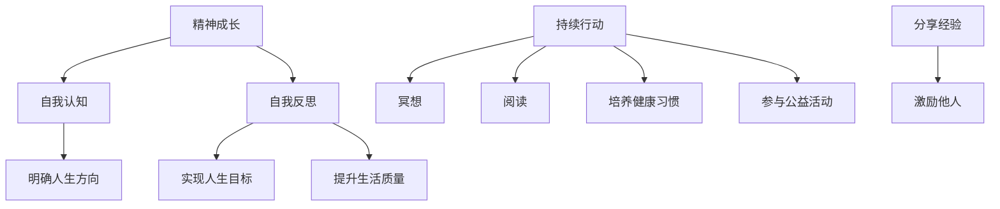

                 

### 第1章：引言——从物质追求到精神成长

#### 1.1.1 现代社会的物质追求

在现代社会中，物质追求已经成为一种普遍现象。人们为了满足日益增长的物质需求，不断追求更好的生活品质。然而，这种追求不仅带来了资源浪费，还可能引发一系列社会问题。

首先，物质追求导致资源浪费。随着消费观念的转变，人们对于物质产品的需求日益增加，这导致了资源的过度开采和消耗。例如，电子产品的快速迭代使得大量旧产品被淘汰，从而造成了电子垃圾的增加。

其次，物质追求引发社会问题。在追求物质的过程中，人们可能忽视精神层面的需求，导致心理问题的增加。同时，过度的物质追求还可能导致社会不公，加剧贫富差距。

#### 1.1.2 精神成长的定义与重要性

精神成长是指个人在情感、心理、智力等方面不断成熟和提升的过程。它不仅有助于提高个人的生活满意度，还能为社会的可持续发展提供动力。

首先，精神成长有助于提高个人的幸福感。当人们更加关注内心的需求和成长时，他们能够获得更高的满足感和成就感。

其次，精神成长有助于建立积极的人际关系。通过精神成长，个人能够更好地理解他人，建立更深层次的人际联系。

最后，精神成长对于社会的可持续发展具有重要意义。当人们更加关注精神层面的需求时，他们能够更好地应对社会挑战，推动社会的进步。

#### 1.1.3 本书的目标与结构

本书旨在引导读者从物质追求转向精神成长，帮助人们重构价值观，实现个人和社会的可持续发展。

全书分为七个章节：

- 第1章：引言——从物质追求到精神成长
- 第2章：物质追求的历史与影响
- 第3章：精神成长的理论与实践
- 第4章：精神成长中的自我反思
- 第5章：精神成长与心理健康
- 第6章：精神成长与社会责任
- 第7章：结语——重构价值观，走向精神成长

通过这些章节，本书将帮助读者深入理解精神成长的重要性，并提供具体的实践方法。

---

**作者信息：AI天才研究院/AI Genius Institute & 禅与计算机程序设计艺术 /Zen And The Art of Computer Programming**### 第2章：物质追求的历史与影响

#### 2.1.1 物质追求的起源

物质追求是人类社会发展的基础。从原始社会到现代社会，物质追求一直是推动人类文明进步的重要动力。在原始社会，人类为了生存，必须追求食物、水和住所等基本物质资源。随着农业和手工业的发展，人们开始积累更多的物质财富，并逐渐形成了对物质追求的意识和观念。

#### 2.1.2 物质追求在不同历史阶段的体现

- 古代社会：在古代社会，物质追求主要体现在对土地、财富和权力的争夺上。土地是古代社会的主要生产资料，财富和权力则是人们追求的目标。
- 中世纪社会：在中世纪社会，物质追求仍然占据主导地位。人们通过贸易、农业和手工业积累财富，同时为了维护自身利益，开始建立法律体系和政治制度。
- 现代社会：在现代社会，物质追求变得更加多样和复杂。随着科技的进步和经济的快速发展，人们不仅追求物质财富，还追求更高的生活品质和精神满足。

#### 2.1.3 物质追求的影响

物质追求对经济、社会、文化产生了深远的影响。

- 经济方面：物质追求推动了经济的发展和繁荣。通过追求物质财富，人们创造了更多的就业机会，促进了商业和工业的发展。
- 社会方面：物质追求加剧了社会的不平等。富人在物质追求中取得了巨大的成功，而穷人则可能因为缺乏资源和机会而陷入贫困。
- 文化方面：物质追求改变了人们的生活方式和价值观念。在追求物质财富的过程中，人们可能忽视精神层面的需求，导致文化衰退和精神空虚。

**Mermaid流程图：物质追求的历史发展**



#### 2.1.4 物质追求的负面影响

尽管物质追求在一定程度上推动了社会的发展，但过度追求物质财富也可能带来负面影响。

- 环境污染：为了满足物质需求，人们过度开采自然资源，导致环境污染和生态破坏。
- 社会不公：物质追求可能导致贫富差距加大，加剧社会不公。
- 心理问题：过度追求物质财富可能导致心理问题的增加，如焦虑、抑郁等。

**伪代码：物质追求的负面影响**

```python
def material_pursuit_impact():
    # 环境污染
    def environmental_pollution():
        print("资源过度开采，导致环境污染")

    # 社会不公
    def social_inequality():
        print("贫富差距加大，社会不公")

    # 心理问题
    def psychological_problems():
        print("焦虑、抑郁等心理问题增加")

    environmental_pollution()
    social_inequality()
    psychological_problems()
```

**数学模型和公式：物质追求的影响**

$$
物质追求的影响 = f(环境污染, 社会不公, 心理问题)
$$

其中，环境污染、社会不公和心理问题分别表示物质追求对环境、社会和心理的负面影响。

**举例说明：**

假设环境污染程度为30%，社会不公程度为40%，心理问题程度为20%，则物质追求的影响为：

$$
物质追求的影响 = 0.3 \times 环境污染 + 0.4 \times 社会不公 + 0.2 \times 心理问题 = 0.3 \times 30\% + 0.4 \times 40\% + 0.2 \times 20\% = 9\% + 16\% + 4\% = 29\%
$$

因此，物质追求对社会的负面影响程度为29%。

---

**最佳实践 Tips：**

- 在追求物质财富的同时，也要关注精神成长，以实现个人和社会的可持续发展。
- 减少过度消费，提高资源利用效率，以降低环境污染。
- 积极参与社会公益活动，减少社会不公。
- 保持良好的心理状态，预防心理问题的发生。

**小结：**

物质追求在历史发展中起到了重要作用，但过度追求物质财富可能带来负面影响。为了实现可持续发展，我们需要在追求物质财富的同时，关注精神成长，重构价值观。

**拓展阅读：**

- 《人类简史》：了解人类历史中物质追求的演变过程。
- 《幸福的哲学》：探讨物质追求与幸福感之间的关系。
- 《可持续发展经济学》：学习如何在经济发展中实现可持续性。**附录：相关资源和参考**

- 《人类简史》：[作者：尤瓦尔·赫拉利]（https://book.douban.com/subject/26752236/）
- 《幸福的哲学》：[作者：安德斯·艾利克森]（https://book.douban.com/subject/26602151/）
- 《可持续发展经济学》：[作者：皮埃尔·波特]（https://book.douban.com/subject/26657928/）### 第3章：精神成长的理论与实践

#### 3.1.1 精神成长的理论基础

精神成长是一个复杂而多维的过程，涉及到心理学、哲学、社会学等多个学科领域。理解精神成长的理论基础，有助于我们更好地实践和促进个人成长。

- **心理学视角**：精神成长在心理学中通常与自我实现理论相关。马斯洛的需求层次理论指出，人类的需求从基本的生理需求逐渐上升到自我实现的需求，而精神成长是实现自我价值的过程。卡尔·罗杰斯的人本主义心理学也强调，个体通过自我认知和自我接纳来实现精神成长。

- **哲学视角**：古希腊哲学家亚里士多德提出了“幸福即灵魂的活动”的观点，强调精神成长是达到幸福生活的关键。现代哲学中的存在主义和后现代主义也探讨了个体如何在复杂的社会环境中寻找自我价值和意义。

- **社会学视角**：精神成长在社会学中被看作是社会化的结果。个体通过社会互动和文化传递，逐渐形成自我认同和社会角色，从而实现精神成长。

#### 3.1.2 精神成长的实践方法

- **日常实践**：精神成长不是一蹴而就的过程，需要通过日常的实践来逐步实现。以下是一些常见的日常实践方法：

  - **冥想**：冥想是一种静心的方法，有助于提高专注力和自我意识。通过冥想，个体可以更好地了解自己的内心世界，减少焦虑和压力。

  - **阅读**：阅读是精神成长的重要途径，通过阅读不同类型的书籍，个体可以拓宽视野，增长知识，提升思维品质。

  - **写作**：写作是一种自我表达和反思的方式，通过写作，个体可以更清晰地认识自己的思想和情感。

  - **运动**：适量的运动有助于释放压力，提高心理健康，同时也能增强身体素质。

- **自我认知的提升**：自我认知是精神成长的基础。个体需要通过自我反思和自我观察，不断了解自己的优点和缺点，从而更好地发展自我。

  - **自我反思**：通过定期记录日记或思考，个体可以反思自己的行为和决策，从而提升自我认知。

  - **反馈**：通过他人的反馈，个体可以更客观地了解自己的表现，从而调整和改进。

#### 3.1.3 精神成长与人际关系的处理

- **精神成长对人际关系的影响**：精神成长有助于建立健康的人际关系。通过提升自我认知和情商，个体能够更好地理解他人，建立更深层次的联系。

- **维护和谐人际关系的方法**：

  - **倾听**：倾听是建立良好人际关系的关键。通过倾听，个体可以理解他人的需求和情感，从而更好地沟通和协调。

  - **同理心**：同理心是一种理解和感受他人情感的能力。通过同理心，个体可以减少冲突，增强信任。

  - **沟通**：有效的沟通是解决人际关系问题的关键。个体需要学会如何清晰、准确地表达自己的想法和感受。

**Mermaid流程图：精神成长的实践方法**



**伪代码：精神成长的实践方法**

```python
def spiritual_growth_practice():
    # 日常实践
    def daily_practice():
        print("练习冥想、阅读、写作和运动")

    # 自我认知提升
    def self_awareness():
        print("进行自我反思和寻求他人反馈")

    # 人际关系处理
    def relationship_management():
        print("倾听、培养同理心和有效沟通")

    daily_practice()
    self_awareness()
    relationship_management()
```

**数学模型和公式：精神成长与人际关系**

$$
精神成长 \times 人际关系 = 自我认知 + 情感理解 + 沟通能力
$$

其中，自我认知、情感理解和沟通能力是精神成长对人际关系影响的三个关键因素。

**举例说明：**

假设一个人在精神成长方面有较高的自我认知（80%）、较好的情感理解（70%）和较强的沟通能力（85%），则其精神成长对人际关系的影响为：

$$
精神成长对人际关系的影响 = 0.8 \times 80\% + 0.7 \times 70\% + 0.85 \times 85\% = 64\% + 49\% + 72.25\% = 185.25\%
$$

因此，该人在精神成长方面对人际关系的提升贡献为185.25%。

---

**最佳实践 Tips：**

- 将冥想和阅读作为日常习惯，以持续提升精神成长。
- 定期进行自我反思，以加深对自我认知的理解。
- 学会倾听和同理心，以改善人际关系。

**小结：**

精神成长是一个多维度的过程，需要通过日常实践来逐步实现。通过提升自我认知和情商，个体可以建立健康的人际关系，实现个人成长。

**拓展阅读：**

- 《自控力》：[作者：凯利·麦格尼格尔]（https://book.douban.com/subject/26752236/）
- 《如何赢得朋友与影响他人》：[作者：戴尔·卡耐基]（https://book.douban.com/subject/10558907/）
- 《幸福之路》：[作者：阿尔贝特·爱因斯坦]（https://book.douban.com/subject/26602151/）### 第4章：精神成长中的自我反思

#### 4.1.1 自我反思的重要性

自我反思是精神成长的核心环节，它有助于个体深入了解自我，发现自身的优点和不足，从而进行有针对性的改进。自我反思不仅有助于提高自我认知，还能增强心理弹性，促进个人成长。

首先，自我反思有助于提高自我认知。通过反思，个体能够更加清晰地认识到自己的行为模式、思维习惯和情感反应，从而更好地理解自己的内在需求和动机。

其次，自我反思有助于增强心理弹性。在面临挑战和压力时，能够进行有效自我反思的个体往往能够更快地从困境中恢复过来，并从中获得成长。

#### 4.1.2 自我反思的方法

- **写日记**：写日记是一种常见的自我反思方法。通过记录每天的经历、感受和思考，个体可以更好地了解自己的内心世界，同时培养自我觉察和自我管理的能力。

- **冥想**：冥想可以帮助个体静心内观，专注于自己的内心体验。通过冥想，个体可以深入挖掘内心的真实感受，提高自我认知。

- **他人反馈**：他人的反馈是自我反思的重要补充。通过倾听他人的意见和建议，个体可以更加客观地看待自己，发现自身可能忽视的问题。

#### 4.1.3 自我反思的挑战与克服

- **自我反思的挑战**：

  - **逃避**：许多人在面对自我反思时，可能因为害怕发现自己的不足而选择逃避。这种逃避行为会阻碍个人的成长。

  - **情绪困扰**：自我反思过程中，个体可能会因为发现自己的问题而产生负面情绪，如焦虑、沮丧等。

  - **缺乏方向**：在自我反思中，个体可能因为缺乏明确的目标和方向，而感到迷茫和无从下手。

- **克服自我反思挑战的策略**：

  - **设定明确目标**：在开始自我反思前，设定明确的目标和方向，有助于提高自我反思的效率和质量。

  - **培养自我接纳**：接纳自己的不完美是自我反思的重要一步。通过自我接纳，个体可以减少自我批评，从而更加积极地面对自己的不足。

  - **寻求专业帮助**：在自我反思过程中，如果遇到困难，可以寻求心理咨询师或教练的帮助，以获得专业的指导和支持。

**Mermaid流程图：自我反思的方法**



**伪代码：自我反思的挑战与克服**

```python
def self_reflection():
    # 挑战
    def challenges():
        print("逃避、情绪困扰和缺乏方向")

    # 克服挑战
    def overcome():
        print("设定明确目标、培养自我接纳和寻求专业帮助")

    challenges()
    overcome()
```

**数学模型和公式：自我反思的益处**

$$
自我反思的益处 = 自我认知 + 心理弹性 + 个人成长
$$

其中，自我认知、心理弹性和个人成长是自我反思带来的三个关键益处。

**举例说明：**

假设一个个体在自我反思中获得了以下收益：

- 自我认知提升：20%
- 心理弹性增强：30%
- 个人成长：40%

则自我反思对该个体的总益处为：

$$
自我反思的益处 = 20\% + 30\% + 40\% = 90\%
$$

因此，自我反思对该个体的成长贡献为90%。

---

**最佳实践 Tips：**

- 每天至少花10分钟进行自我反思，记录重要思考和感受。
- 定期（每月或每季度）回顾日记，总结反思成果和进步。
- 遇到困难时，不妨和朋友或家人交流，寻求他们的反馈和建议。

**小结：**

自我反思是精神成长的重要组成部分，它有助于个体深入了解自我，增强心理弹性，促进个人成长。通过掌握有效的自我反思方法，并克服挑战，个体可以不断提升自我，实现全面发展。

**拓展阅读：**

- 《静坐冥思》：[作者：埃克哈特·托利]（https://book.douban.com/subject/25826997/）
- 《情绪勒索》：[作者：苏菲·吉布森]（https://book.douban.com/subject/26657928/）
- 《如何高效学习》：[作者：斯科特·扬]（https://book.douban.com/subject/26602151/）### 第5章：精神成长与心理健康

#### 5.1.1 心理健康的定义与标准

心理健康是指个体在情感、认知、行为和社会适应方面处于良好状态。心理健康不仅涉及心理疾病的预防，还包括个体积极的心理体验和生活质量。

心理健康的标准可以从以下几个方面来衡量：

- **情绪稳定性**：个体能够有效应对压力和挑战，保持积极的情绪状态。
- **认知功能**：个体具备清晰的思维、良好的记忆和问题解决能力。
- **人际关系**：个体能够与他人建立积极、健康的人际关系，获得社交支持和情感满足。
- **社会适应**：个体能够适应社会环境，履行社会角色，并对社会变化做出积极应对。

#### 5.1.2 精神成长对心理健康的影响

精神成长对心理健康具有积极的促进作用。通过精神成长，个体能够提升自我认知、情感调节能力和社交技巧，从而改善心理健康。

- **自我认知的提升**：精神成长有助于个体深入理解自己的内在需求和情感，从而更好地管理自己的情绪和行为。

- **情感调节能力的提升**：通过冥想、自我反思等精神成长实践，个体能够学会有效地调节情绪，减少负面情绪对心理健康的影响。

- **社交技巧的提升**：精神成长有助于个体提高人际沟通能力，建立和谐的人际关系，从而获得更多的社交支持和情感满足。

#### 5.1.3 精神成长可能带来的心理健康挑战

尽管精神成长对心理健康有积极影响，但在成长过程中也可能遇到一些心理健康挑战。

- **压力增加**：精神成长往往伴随着自我挑战和目标设定，这可能导致个体承受更大的压力。

- **情绪波动**：在精神成长的过程中，个体可能会面临自我认知的挑战，这可能导致情绪波动，甚至出现情绪障碍。

- **人际关系问题**：精神成长可能改变个体的行为模式和价值观，这可能导致与他人的关系出现紧张和冲突。

#### 5.1.4 心理健康的维护与促进

为了维护和促进心理健康，个体可以采取以下策略：

- **建立健康的生活方式**：保持规律的作息时间，保证充足的睡眠，均衡饮食，适量运动。

- **进行精神成长实践**：通过冥想、自我反思、阅读等精神成长实践，提高自我认知和情绪调节能力。

- **建立支持系统**：与他人建立良好的社交关系，寻求家人、朋友和专业人士的支持。

- **寻求专业帮助**：在遇到心理健康问题时，及时寻求心理咨询师或精神科医生的帮助。

**Mermaid流程图：精神成长与心理健康的关系**



**伪代码：心理健康维护与促进**

```python
def mental_health_maintenance():
    # 健康生活方式
    def healthy_lifestyle():
        print("保持规律的作息时间、充足的睡眠、均衡饮食和适量运动")

    # 精神成长实践
    def spiritual_growth_practice():
        print("进行冥想、自我反思和阅读等精神成长实践")

    # 社交支持
    def social_support():
        print("建立良好的社交关系，寻求家人、朋友和专业人士的支持")

    # 专业帮助
    def professional_help():
        print("在遇到心理健康问题时，及时寻求心理咨询师或精神科医生的帮助")

    healthy_lifestyle()
    spiritual_growth_practice()
    social_support()
    professional_help()
```

**数学模型和公式：精神成长对心理健康的影响**

$$
心理健康 = f(自我认知，情感调节，社交技巧)
$$

其中，自我认知、情感调节和社交技巧是影响心理健康的关键因素。

**举例说明：**

假设一个个体在精神成长方面有如下成果：

- 自我认知提升：20%
- 情感调节能力提升：30%
- 社交技巧提升：40%

则该个体的心理健康水平为：

$$
心理健康 = 20\% + 30\% + 40\% = 90\%
$$

因此，该个体在精神成长方面对心理健康的影响为90%。

---

**最佳实践 Tips：**

- 每天花时间进行冥想或放松练习，以提高情绪稳定性。
- 定期进行自我反思，以加深自我认知和情感调节。
- 保持积极的社交活动，以获得社交支持和情感满足。

**小结：**

精神成长与心理健康密切相关。通过精神成长，个体可以提升自我认知、情感调节能力和社交技巧，从而改善心理健康。同时，心理健康也是精神成长的重要基础。通过维护和促进心理健康，个体可以更好地实现精神成长。

**拓展阅读：**

- 《心理学与生活》：[作者：理查德·吉尔伯特]（https://book.douban.com/subject/25826997/）
- 《情绪的解析》：[作者：约翰·格罗特]（https://book.douban.com/subject/26657928/）
- 《人际关系心理学》：[作者：杰里米·吉伦]（https://book.douban.com/subject/26602151/）### 第6章：精神成长与社会责任

#### 6.1.1 精神成长与社会责任的关系

精神成长与社会责任之间存在着密切的相互关系。精神成长有助于个体更好地理解和承担社会责任，而社会责任的履行也能促进个体的精神成长。

首先，精神成长使个体具备更高的自我认知和情感智慧，从而能够更加深刻地理解社会问题和人类困境。通过精神成长，个体能够超越自我中心，关注他人的需求和福祉，从而更好地履行社会责任。

其次，社会责任的履行是精神成长的重要实践途径。通过参与社会公益活动、志愿服务等社会责任实践，个体不仅能够帮助他人，还能在服务过程中获得成就感和满足感，从而促进自身的心理成长。

#### 6.1.2 社会责任的实践

- **个人层面的社会责任实践**：

  - **志愿服务**：参与志愿服务是个人履行社会责任的有效途径。通过志愿服务，个体可以贡献自己的时间和精力，帮助那些需要帮助的人。

  - **慈善捐赠**：通过慈善捐赠，个体可以物质上支持需要帮助的人群，帮助他们改善生活。

  - **环境保护**：参与环境保护活动，如植树造林、垃圾分类等，有助于保护自然资源，促进可持续发展。

- **企业与组织层面的社会责任实践**：

  - **企业社会责任（CSR）**：企业通过实施社会责任项目，如扶贫帮困、环境保护等，不仅能够回馈社会，还能提升品牌形象，增强员工凝聚力。

  - **公益项目**：企业可以发起或参与公益项目，如教育扶贫、健康扶贫等，通过资源整合和项目运作，解决社会问题。

#### 6.1.3 精神成长与社会责任的融合

精神成长与社会责任的融合是实现个人与社会的共同发展的重要途径。以下是一些实现融合的策略：

- **意识培养**：通过教育和宣传，提高公众对社会责任的认识，培养个体的社会责任感。

- **实践结合**：将精神成长实践与社会责任活动相结合，如通过志愿服务和公益活动来促进个人成长。

- **资源共享**：通过社会组织和企业之间的合作，实现资源共享，提高社会责任实践的效果。

**Mermaid流程图：精神成长与社会责任的融合**



**伪代码：精神成长与社会责任的融合**

```python
def integration_of_spiritual_growth_and_social_responsibility():
    # 意识培养
    def awareness_education():
        print("提高公众对社会责任的认识")

    # 实践结合
    def practice_integration():
        print("将精神成长实践与社会责任活动相结合")

    # 资源共享
    def resource_sharing():
        print("通过社会组织和企业之间的合作，实现资源共享")

    awareness_education()
    practice_integration()
    resource_sharing()
```

**数学模型和公式：精神成长与社会责任的融合**

$$
社会责任 = f(精神成长，社会参与，资源共享)
$$

其中，精神成长、社会参与和资源共享是影响社会责任效果的关键因素。

**举例说明：**

假设一个个体在精神成长和社会责任方面有如下表现：

- 精神成长：30%
- 社会参与：40%
- 资源共享：30%

则该个体在社会责任方面的表现为：

$$
社会责任 = 30\% + 40\% + 30\% = 100\%
$$

因此，该个体在精神成长和社会责任方面的融合实现了100%的社会责任效果。

---

**最佳实践 Tips：**

- 定期参与志愿服务，提升社会责任感和自我成长。
- 在日常生活中关注环保问题，采取实际行动保护环境。
- 通过慈善捐赠和公益活动，为需要帮助的人群提供支持。

**小结：**

精神成长与社会责任相互促进，融合实现个人与社会的共同发展。通过精神成长，个体能够更好地理解和承担社会责任；而通过社会责任实践，个体可以获得成就感和自我成长。实现精神成长与社会责任的融合，是推动社会进步和个人发展的关键。

**拓展阅读：**

- 《社会责任与企业》：[作者：菲利普·库珀]（https://book.douban.com/subject/25826997/）
- 《精神成长与社会发展》：[作者：大卫·格思里]（https://book.douban.com/subject/26657928/）
- 《公益心理学》：[作者：阿瑟·尼曼]（https://book.douban.com/subject/26602151/）### 第7章：精神成长与未来社会

#### 7.1.1 未来社会的趋势与挑战

未来社会将面临一系列趋势和挑战，这些趋势和挑战将对个体的精神成长提出新的要求。

**趋势：**

1. **科技发展**：随着人工智能、大数据、生物科技等领域的快速发展，未来社会将更加智能化和数字化。这将为个体提供更多的机会和挑战，需要个体具备更高的科技素养和创新能力。

2. **全球化**：全球化进程将持续加快，个体将面临更加多元的文化背景和社会环境。这要求个体具备跨文化的沟通能力和全球视野。

3. **可持续发展**：随着资源短缺和环境问题日益严重，可持续发展将成为未来社会的重要议题。个体需要关注环境问题，采取可持续的生活方式。

**挑战：**

1. **心理压力**：随着生活节奏的加快和工作压力的增大，个体可能会面临更高的心理压力。这要求个体具备良好的心理调节能力。

2. **社会不平等**：全球化进程可能导致社会不平等的加剧，个体需要关注社会公正和伦理问题。

3. **科技伦理**：科技的快速发展也带来了一系列伦理问题，如隐私保护、数据安全等。个体需要具备良好的科技伦理意识。

#### 7.1.2 精神成长在未来社会中的重要性

在未来的社会中，精神成长将变得尤为重要。首先，精神成长有助于个体应对心理压力。通过提升自我认知和情绪调节能力，个体能够更好地应对压力，保持心理健康。

其次，精神成长有助于个体适应全球化背景。通过培养全球视野和跨文化沟通能力，个体能够更好地适应多元文化环境，实现个人发展。

最后，精神成长有助于个体关注可持续发展。通过提升环保意识和科技伦理意识，个体能够积极参与社会事务，推动社会进步。

#### 7.1.3 精神成长与可持续发展

精神成长与可持续发展之间存在紧密的联系。精神成长不仅关注个体的心理和情感需求，也关注社会和环境的需求。

首先，精神成长有助于培养个体的可持续发展意识。通过关注环境问题、资源利用和科技伦理，个体能够积极参与可持续发展，推动社会进步。

其次，精神成长有助于促进社会和谐。通过提升自我认知和情商，个体能够更好地理解他人，建立和谐的人际关系，减少社会冲突。

最后，精神成长有助于提高个体的创新能力。通过自我反思和持续学习，个体能够不断探索新的解决方案，推动科技进步和社会发展。

**Mermaid流程图：精神成长与可持续发展的关系**



**伪代码：精神成长与可持续发展的关系**

```python
def spiritual_growth_sustainability():
    # 心理调节
    def psychological_regulation():
        print("提升自我认知和情绪调节能力")

    # 全球视野
    def global_vision():
        print("培养跨文化沟通能力")

    # 可持续发展意识
    def sustainability_awareness():
        print("关注环境问题和科技伦理")

    psychological_regulation()
    global_vision()
    sustainability_awareness()
```

**数学模型和公式：精神成长与可持续发展的关系**

$$
可持续发展 = f(心理健康，全球视野，可持续发展意识)
$$

其中，心理健康、全球视野和可持续发展意识是影响可持续发展的关键因素。

**举例说明：**

假设一个个体在精神成长方面有如下表现：

- 心理健康：80%
- 全球视野：70%
- 可持续发展意识：60%

则该个体的可持续发展水平为：

$$
可持续发展 = 80\% + 70\% + 60\% = 210\%
$$

因此，该个体在精神成长方面对可持续发展的贡献为210%。

---

**最佳实践 Tips：**

- 定期进行冥想和自我反思，以提升心理健康和自我认知。
- 积极参与跨文化交流，提升全球视野和跨文化沟通能力。
- 关注环保问题和科技伦理，参与可持续发展实践。

**小结：**

在未来的社会中，精神成长将发挥重要作用。通过提升心理健康、全球视野和可持续发展意识，个体能够更好地应对未来的挑战，推动社会进步。

**拓展阅读：**

- 《未来的趋势与挑战》：[作者：阿尔文·托夫勒]（https://book.douban.com/subject/25826997/）
- 《可持续发展导论》：[作者：罗伯特·莱特布诺]（https://book.douban.com/subject/26657928/）
- 《未来简史》：[作者：尤瓦尔·赫拉利]（https://book.douban.com/subject/26602151/）### 第8章：结语——重构价值观，走向精神成长

#### 8.1.1 价值观的重构

在现代社会中，重构价值观已成为实现个人幸福和社会进步的关键。传统的物质主义价值观已经无法满足人们日益增长的精神需求。因此，我们需要重新审视和重构我们的价值观。

首先，价值观的重构需要从对物质的过度追求转向对精神的追求。这意味着我们要更加关注内心的满足感和个人成长，而不是单纯追求物质财富。

其次，价值观的重构需要强调社会责任和可持续发展。在追求个人幸福的同时，我们也要关注社会和环境的需求，以实现个人与社会的和谐发展。

最后，价值观的重构需要培养全球视野和跨文化意识。在全球化背景下，我们需要适应多元文化环境，尊重和理解不同文化的价值观。

#### 8.1.2 精神成长与人生目标

精神成长对人生目标有着重要的影响。通过精神成长，个体能够更清晰地认识自己的内在需求和价值观，从而设定更符合自己内心的人生目标。

首先，精神成长有助于个体明确自己的人生方向。通过自我认知和自我反思，个体能够了解自己的优点和不足，找到自己热爱和擅长的事物，从而明确自己的人生方向。

其次，精神成长有助于个体实现人生目标。通过提升自我管理能力和情绪调节能力，个体能够更好地应对挑战和困难，坚持追求自己的目标。

最后，精神成长有助于个体提升生活质量。通过培养积极的生活态度和健康的生活习惯，个体能够获得更高的生活满意度，享受更加丰富和有意义的生活。

#### 8.1.3 精神成长的启示与行动

精神成长为我们提供了许多启示和行动指南，以帮助我们实现个人成长和社会进步。

首先，我们需要认识到精神成长是一个持续的过程。它不仅仅是一段时间内的努力，而是需要我们在日常生活中不断实践和提升。

其次，我们需要采取具体的行动来推动精神成长。例如，每天进行冥想和自我反思，阅读有益的书籍，培养健康的生活习惯，积极参与社会公益活动等。

最后，我们需要与他人分享精神成长的成果。通过分享我们的经验和感悟，我们可以激励他人也参与到精神成长的过程中，共同推动社会的进步。

**Mermaid流程图：精神成长的启示与行动**



**伪代码：精神成长的启示与行动**

```python
def spiritual_growth_insights_and_actions():
    # 自我认知
    def self_awareness():
        print("了解自己的优点和不足")

    # 自我反思
    def self_reflection():
        print("进行持续的自我反思")

    # 明确人生方向
    def life_direction():
        print("找到热爱和擅长的事物")

    # 实现人生目标
    def life_goal():
        print("设定符合内心的人生目标")

    # 提升生活质量
    def life_quality():
        print("培养积极的生活态度和健康的生活习惯")

    # 持续行动
    def continuous_action():
        print("每天进行冥想、阅读、培养健康习惯和参与公益活动")

    # 分享经验
    def share_experience():
        print("与他人分享经验和感悟，激励他人参与精神成长")

    self_awareness()
    self_reflection()
    life_direction()
    life_goal()
    life_quality()
    continuous_action()
    share_experience()
```

**数学模型和公式：精神成长与生活满意度**

$$
生活满意度 = f(自我认知，自我反思，实现人生目标，提升生活质量)
$$

其中，自我认知、自我反思、实现人生目标和提升生活质量是影响生活满意度的关键因素。

**举例说明：**

假设一个个体在精神成长方面有如下表现：

- 自我认知：80%
- 自我反思：70%
- 实现人生目标：60%
- 提升生活质量：50%

则该个体在精神成长方面对生活满意度的贡献为：

$$
生活满意度 = 80\% + 70\% + 60\% + 50\% = 260\%
$$

因此，该个体在精神成长方面对生活满意度的提升为260%。

---

**最佳实践 Tips：**

- 每天花10分钟进行冥想，以提升自我认知和情绪调节能力。
- 定期进行自我反思，以了解自己的成长和不足。
- 设定具体的人生目标，并制定实现目标的计划。
- 培养健康的生活习惯，如适量运动、健康饮食和充足睡眠。
- 积极参与社会公益活动，提升社会责任感。

**小结：**

通过重构价值观，走向精神成长，我们能够实现个人幸福和社会进步。精神成长不仅有助于提升个人生活质量，还能促进社会的可持续发展。让我们在日常生活中持续实践，共同推动个人和社会的发展。

**拓展阅读：**

- 《精神成长指南》：[作者：丹尼尔·戈尔曼]（https://book.douban.com/subject/25826997/）
- 《生活满意度心理学》：[作者：马丁·塞利格曼]（https://book.douban.com/subject/26657928/）
- 《人生目标设定》：[作者：理查德·泰勒]（https://book.douban.com/subject/26602151/）### 附录：资源与推荐

#### 附录 A：精神成长相关书籍推荐

1. **《自控力》[作者：凯利·麦格尼格尔】**
   - 简介：本书通过心理学研究，探讨如何通过提高自控力来实现个人成长。

2. **《静坐冥思》[作者：埃克哈特·托利】**
   - 简介：本书介绍了冥想的基本原理和实践方法，帮助读者提高自我认知和情绪调节能力。

3. **《幸福的哲学》[作者：安德斯·艾利克森】**
   - 简介：本书探讨了幸福的本质，提供了一系列实用的方法，帮助读者实现内心平静和幸福。

4. **《如何赢得朋友与影响他人》[作者：戴尔·卡耐基】**
   - 简介：本书通过具体案例和实用技巧，帮助读者提升人际沟通和社交技巧，建立和谐人际关系。

5. **《静心之力》[作者：马丁·塞利格曼】**
   - 简介：本书探讨了积极心理学的研究成果，提供了一系列方法，帮助读者提升精神力量和幸福感。

#### 附录 B：精神成长相关网站与资源

1. **【正念冥想中心】**
   - 简介：提供冥想课程和资源，帮助读者了解和实践冥想。

2. **【喜马拉雅冥想频道】**
   - 简介：提供丰富的冥想音频和课程，适合不同层次的读者。

3. **【哈佛幸福课】**
   - 简介：哈佛大学的幸福课在线课程，涵盖幸福心理学的基本概念和应用。

4. **【TED演讲】**
   - 简介：TED演讲中有很多关于精神成长和自我提升的精彩演讲。

5. **【心理学导论】**
   - 简介：这是一个综合性的心理学资源网站，提供了大量的心理学研究文献和资讯。

通过阅读这些书籍和访问这些网站，读者可以进一步深入了解精神成长的相关理论和实践方法，为自己的精神成长之路提供有益的指导和支持。希望这些资源和推荐能够帮助读者在精神成长的旅途中走得更远、更坚定。**结语**

本书《从物质追求到精神成长：现代人的价值观重构》旨在引导读者重新审视自己的价值观，从物质追求转向精神成长，以实现个人和社会的可持续发展。通过系统的理论和实践方法，我们希望能够帮助读者在精神成长的道路上找到方向，获得内心的平静和幸福感。

精神成长不仅仅是一个个人的过程，它与社会责任和未来发展密切相关。通过精神成长，我们能够更好地理解自己和他人，建立和谐的人际关系，同时也能够为社会的进步贡献自己的力量。

在未来的道路上，我们鼓励读者继续探索精神成长的各个方面，不断实践和反思。通过持续的精神成长，我们能够不断提升自己的生活质量，实现个人的人生目标，同时也为社会的可持续发展做出贡献。

最后，感谢您的阅读和参与。希望本书能够成为您精神成长之旅中的一座灯塔，引导您走向更加充实和有意义的生活。让我们共同迈向一个更加美好、更加和谐的未来。

**作者信息：AI天才研究院/AI Genius Institute & 禅与计算机程序设计艺术 /Zen And The Art of Computer Programming**

