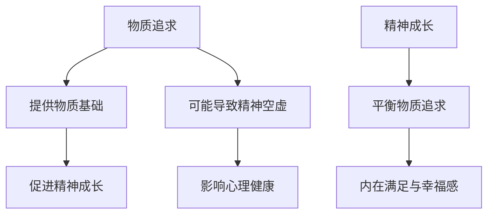

                 

### 引言

#### 主题阐述

在当今高速发展的社会背景下，物质追求与精神成长成为现代人关注的焦点。物质追求，指的是人们对于财富、地位、物质享受的追求，这种追求在一定程度上推动了人类文明的进步和社会的发展。然而，随着物质生活水平的不断提高，人们逐渐发现，单纯的物质追求并不能带来持久而深刻的幸福感。精神成长，则是指个体在情感、认知、道德、审美等方面的全面发展，它关乎个人的内心世界和人生意义。

本书旨在探讨物质追求与精神成长之间的关系，以及如何通过价值观的重构来引导现代人实现更加健康和谐的生活方式。物质追求与精神成长并非对立的关系，它们在个体的生命历程中相互交织、相互影响。通过深入分析这两个核心概念，本书希望揭示它们之间的内在联系，并提出一系列实践方法，帮助读者实现从物质追求到精神成长的转变。

#### 目标读者

本书的目标读者主要包括以下几类人群：

1. **职场人士**：在现代社会，职场人士常常面临巨大的物质追求压力，他们希望通过本书找到平衡物质追求与精神成长的路径。
2. **心理学爱好者**：对于心理学感兴趣的人士，可以从中了解到精神成长的理论基础和实践方法。
3. **大学生和青年**：正值人生关键阶段的大学生和青年，需要明确自己的价值观，理解物质追求与精神成长的关系，为自己的未来规划提供指导。
4. **社会活动家**：关注社会问题、致力于社会进步的社会活动家，可以从本书中找到关于价值观重构的思路和行动指南。

#### 摘要

本书从物质追求与精神成长的关系出发，深入探讨了现代社会中物质追求的起源、影响及其利弊，同时详细阐述了精神成长的重要性以及实践方法。通过一系列的案例研究和行动指南，本书提出了价值观重构的理念和具体实践步骤，帮助读者实现从物质追求到精神成长的转变。本书旨在为现代人提供一种更加全面、健康的生活观念，引导他们在物质丰富的时代，找到内心的平静与满足。

### 核心概念与联系

在探讨物质追求与精神成长的关系之前，我们需要明确这两个核心概念的定义及其相互之间的联系。物质追求和精神成长不仅是个体层面的主题，也是影响社会结构和文化价值的重要因素。

#### 物质追求

物质追求可以定义为个体对于物质财富、物质享受和物质地位的渴望。这种追求往往与个人的欲望、社会的期望和文化的导向紧密相关。在现代社会，物质追求表现为消费文化的兴起、物质享受的普及以及对物质成功的崇拜。物质追求的起源可以追溯到人类历史的多个阶段，例如农业革命带来的食物富足、工业革命带来的技术进步等，这些事件使得人们有了更多的物质资源，也激发了对于更多物质的渴望。

现代社会的物质主义表现为以下几个方面：

1. **消费文化的兴起**：随着经济的发展，人们拥有了更多的购买力，消费逐渐成为生活的重要组成部分。广告和媒体不断塑造着人们的消费观念，鼓励人们追求最新的产品和服务。
2. **物质享受的普及**：物质享受的普及使得人们不再满足于基本的生活需求，而是追求更高品质的生活体验。例如，旅游、美食、时尚等成为人们生活中的重要组成部分。
3. **对物质成功的崇拜**：在现代社会，物质成功被视为成功的重要标志。许多人在职业生涯中追求高收入、高地位，以此来证明自己的价值和能力。

#### 精神成长

精神成长则是指个体在情感、认知、道德、审美等方面的全面发展。精神成长不仅仅关注个人的内心体验和情感管理，还包括对生命意义和价值的深入思考。精神成长的重要性在于，它能够帮助个体建立健康的自我认同、提升情感智慧、增强心理韧性，并最终实现个人的内在满足和幸福感。

精神成长涉及以下几个方面的内容：

1. **内在价值的发掘**：内在价值是指个体内心深处的信念、信仰和价值观。发掘内在价值可以帮助个体找到真正的自我，从而摆脱外界的物质诱惑和社会压力。
2. **情感管理**：情感管理是指个体对于自己和他人的情感进行认知、表达和调节的能力。良好的情感管理能够帮助个体在压力和挑战面前保持平静和积极的心态。
3. **心理健康的维护**：心理健康是精神成长的重要组成部分，它关系到个体的情感状态、心理适应能力和整体幸福感。通过心理健康的维护，个体可以更好地应对生活中的各种挑战。
4. **道德与审美的提升**：道德与审美能力的提升是精神成长的重要标志。个体通过学习道德原则和审美理念，可以培养出更加高尚的人格品质和审美情趣。

#### 物质追求与精神成长的关系

物质追求和精神成长之间的关系是复杂而微妙的。一方面，物质追求可以为精神成长提供物质基础，例如通过经济独立来追求更高的生活品质和教育资源，从而为精神成长提供必要的条件。另一方面，过度追求物质会导致精神空虚和内在价值的丧失，影响个体的心理健康和生活质量。

1. **物质追求促进精神成长**：合理的物质追求可以激发个体的内在动力，推动个体追求更高的目标，实现自我超越。例如，通过学习新技能或创业，个体不仅获得了物质回报，还获得了成就感和自我实现。
2. **精神成长平衡物质追求**：精神成长可以帮助个体认识到物质追求的局限性，从而保持内心的平衡和宁静。通过培养内在价值和情感智慧，个体可以更加理性地看待物质追求，避免陷入物质的泥潭。

为了更好地理解物质追求与精神成长之间的关系，我们可以使用Mermaid流程图来展示这两个概念之间的联系和互动。



通过这个流程图，我们可以看到，物质追求和精神成长是相互关联的，两者之间的互动既可以是正面的，也可以是负面的。理解这种关系有助于我们更好地平衡物质追求和精神成长，实现全面而和谐的个人发展。

### 物质追求的探讨

#### 物质追求的起源

物质追求是人类社会发展的一个重要方面，其起源可以追溯到远古时代。在早期的人类社会中，物质追求主要体现在对基本生活需求的满足上。随着农业革命的出现，人类开始种植作物和驯养动物，从而大大提高了食物的生产效率，使得人口数量迅速增长。这种物质上的富足为人类文明的发展奠定了基础。

工业革命的到来进一步加速了物质追求的发展。18世纪末至19世纪初，英国率先开展了工业革命，随后蔓延到全球。工业革命通过机械化生产极大地提高了生产效率，使得商品变得更为丰富和便宜，极大地改变了人们的生活方式。随着工业化的推进，人们对物质的需求和渴望也日益增加。

经济全球化的快速发展则使得物质追求变得更加普遍和复杂。在全球化的背景下，跨国公司和国际贸易使得物质资源在全球范围内流动，各种新产品和新技术不断涌现，人们对物质生活的追求也变得更加多样化和高端化。这种全球化趋势不仅影响了发达国家，也深刻地改变了发展中国家的社会结构和文化价值。

#### 现代社会的物质主义

现代社会中的物质主义表现为一种广泛的文化现象，它渗透到人们的日常生活和价值观中。物质主义的核心是对于物质财富和物质享受的追求，认为物质成功是个人和社会成功的重要标志。

首先，消费文化的兴起是现代社会物质主义的重要表现。消费文化鼓励人们不断购买新的商品和服务，以满足物质追求。广告和营销策略通过塑造消费者的欲望和需求，使得人们不断追求更高品质的生活。这种文化现象不仅影响了消费者的行为，也影响了社会的整体消费模式。

其次，物质享受的普及也是现代社会物质主义的一个显著特征。随着经济的发展和技术的进步，人们有了更多的选择和机会来享受物质生活。从豪华旅游到高端餐饮，从时尚购物到高科技产品，物质享受已经成为现代社会中的一种生活方式。然而，这种追求物质享受的生活方式也带来了资源浪费和环境问题。

最后，对物质成功的崇拜在现代社会中尤为明显。在职业和个人生活中，人们往往通过物质成功的标志，如高收入、豪车、豪宅等，来衡量个人的价值和社会地位。这种观念导致了人们对于物质成功的过度追求，忽视了精神成长和内在价值的培养。

#### 物质追求的利弊分析

物质追求在现代社会中既有积极的影响，也存在一些负面影响。

**积极影响**

1. **经济繁荣**：物质追求推动了经济的发展和繁荣。通过生产和消费，物质追求创造了大量的就业机会，提高了人们的收入水平，促进了社会的稳定和进步。
2. **生活质量的提升**：物质追求使得人们能够享受更好的生活条件，如舒适的住房、便捷的交通工具、丰富的食品选择等。这些物质条件显著提升了人们的生活质量，增强了幸福感。
3. **技术进步**：物质追求促进了科学技术的快速发展。人们对于新产品的需求推动了技术创新，从而带来了更高效的生产方式和更便捷的生活方式。

**负面影响**

1. **精神空虚**：过度追求物质可能导致精神空虚。当人们过分依赖物质享受来满足内心需求时，往往忽视了情感和精神层面的追求，导致内心的空虚和焦虑。
2. **环境问题**：物质追求带来的大量消费和生产活动对环境造成了严重的影响。资源过度开采、污染问题加剧、生态系统破坏等问题日益严重，威胁到人类的可持续发展。
3. **社会不公**：物质追求可能导致社会不公。在追求物质成功的过程中，一些人可能因为资源分配不均而陷入贫困，社会阶层分化加剧，导致社会不稳定。

综上所述，物质追求既有其积极作用，也存在一定的负面影响。在现代社会中，我们需要理性看待物质追求，既要享受物质带来的便利和舒适，也要关注精神成长和心理健康，实现物质与精神的平衡发展。

### 精神成长的探讨

精神成长是一个涉及个体内心世界和情感发展的复杂过程，它不仅仅关注个人的内在价值发掘，还包括情感管理、心理健康维护等多个方面。以下是关于精神成长的重要性及其具体实践方法的详细探讨。

#### 精神成长的重要性

精神成长对个人的生活质量和幸福感具有深远的影响。首先，内在价值的发掘是精神成长的核心。内在价值指的是个体内心深处的信念、信仰和价值观，它为个体提供方向和动力，帮助个体找到真正的自我。通过发掘内在价值，个体能够明确自己的目标和追求，从而避免外界的物质诱惑和社会压力，保持内心的平静和坚定。

其次，情感管理是精神成长的重要方面。情感管理指的是个体对于自己和他人的情感进行认知、表达和调节的能力。良好的情感管理能够帮助个体在面对压力和挑战时保持冷静和乐观，增强心理韧性。例如，通过情感管理，个体可以更好地处理负面情绪，避免情绪失控，从而改善人际关系，提升生活质量。

最后，心理健康维护是精神成长不可或缺的一部分。心理健康是精神成长的基础，它关系到个体的情感状态、心理适应能力和整体幸福感。通过心理健康的维护，个体可以更好地应对生活中的各种挑战，如工作压力、人际关系问题等。此外，心理健康维护还包括心理健康问题的预防和干预，如通过心理咨询、心理治疗等方法，帮助个体克服心理困扰，提升心理素质。

#### 精神成长的实践方法

要实现精神成长，个体可以采取以下几种实践方法：

1. **自我反思**：自我反思是精神成长的重要实践方法。通过定期反思，个体可以深入思考自己的行为、情感和价值观，从而发现自身的不足和改进方向。例如，个体可以每天花时间记录自己的情感体验和思考，分析其中的原因和影响，逐步提升自我认知。

2. **目标设定**：目标设定是精神成长的另一个关键实践方法。通过设定明确的目标，个体可以为自己提供方向和动力。目标设定应具体、可实现，并且与个人的内在价值相一致。例如，个体可以设定短期和长期目标，如提高某项技能、改善人际关系、实现某个职业目标等。

3. **持续学习**：持续学习是精神成长的重要保障。通过不断学习新的知识和技能，个体可以提升自己的认知水平和情感智慧，从而更好地应对生活中的各种挑战。例如，个体可以通过阅读书籍、参加培训课程、与不同领域的人交流等方式，拓宽自己的视野和思维方式。

4. **情感管理**：情感管理是精神成长的关键实践方法。通过学习情感管理技巧，个体可以更好地处理负面情绪，提升情感智慧。例如，个体可以通过冥想、深呼吸等方法，缓解压力和焦虑；通过积极的沟通和表达，建立和谐的人际关系。

5. **心理健康维护**：心理健康维护是精神成长的基础。通过关注自己的心理健康，个体可以更好地应对生活中的挑战，提升生活质量。例如，个体可以通过定期锻炼、保持良好的饮食习惯、进行心理咨询等方式，维护自己的心理健康。

总之，精神成长是一个复杂而长期的过程，它需要个体在日常生活中不断实践和努力。通过自我反思、目标设定、持续学习、情感管理和心理健康维护等方法，个体可以逐步实现精神成长，提升内心的平静和幸福感。

### 价值观的重构

在现代社会，物质追求和精神成长之间的平衡成为了实现个人幸福和社会和谐的重要课题。价值观的重构，即重新定义和评估个人的价值观念，是实现这一平衡的关键步骤。通过价值观的重构，个体可以在物质追求的过程中找到内心的方向，避免精神空虚，从而实现更加全面和和谐的个人发展。

#### 价值观的重新定义

价值观的重新定义首先需要认识到物质追求的局限性。物质追求虽然能够带来一时的满足和成就感，但它并不能解决个体内心的空虚和焦虑。相反，过度的物质追求可能会导致精神空虚、心理压力增大，甚至引发一系列的社会问题。因此，个体需要重新审视和定义自己的价值观，将其从单纯的物质追求转向更加注重内在成长和情感满足。

1. **内在价值的发掘**：在重新定义价值观的过程中，个体需要重视内在价值的发掘。内在价值包括个人的信念、信仰、兴趣和激情等，这些是构成个体身份和灵魂的核心部分。通过深入探索自己的内在价值，个体可以找到真正让自己感到满足和有意义的追求，而不仅仅是外在的物质目标。

2. **情感与心理健康**：重新定义价值观还需要将情感和心理健康纳入考虑。情感管理是精神成长的重要组成部分，心理健康则是个人幸福感的基础。个体应当将情感和心理健康视为生活的重要方面，而不是仅仅追求物质财富和成功。

3. **可持续的生活方式**：在重新定义价值观时，个体应当考虑生活方式的可持续性。这意味着不仅要关注个人的物质需求，还要考虑环境和社会的影响。通过选择环保的产品和服务、参与社区活动等方式，个体可以在满足自身需求的同时，也为社会的可持续发展做出贡献。

#### 价值观的实践与检验

在重新定义价值观之后，实践和检验是确保价值观得到有效实施的关键步骤。

1. **制定行动计划**：为了将新的价值观付诸实践，个体需要制定具体的行动计划。这些计划应当包括日常生活中的小改变，如减少不必要的消费、增加自我反思时间、参与社区服务等。通过逐步实施这些计划，个体可以逐步培养新的价值观，并观察其对自己的生活带来的变化。

2. **定期反思**：定期反思是检验价值观实践效果的重要方法。通过定期回顾自己的行为和思考，个体可以评估新的价值观是否得到了有效实施，以及是否需要进行调整。反思可以帮助个体发现自身的不足，及时纠正偏差，确保价值观的持续改进。

3. **寻求反馈**：与他人分享自己的价值观和实践经验，并寻求反馈，也是检验价值观的重要方法。通过他人的观点和建议，个体可以更全面地了解自己的价值观是否得到了他人的认可，是否存在误解或偏差。这种互动不仅有助于个体的自我成长，也有助于建立更加和谐的人际关系。

#### 价值观的重构与自我成长

价值观的重构不仅仅是一个理论上的过程，它更是一种实际行动。通过重新定义价值观并付诸实践，个体可以逐步实现自我成长，找到内心的平静和满足。

1. **提升自我认知**：价值观的重构有助于个体提升自我认知，明确自己的信念和目标。通过深入探索内在价值，个体可以更加清晰地认识自己，找到真正适合自己的生活方式和追求。

2. **增强心理韧性**：通过价值观的重构，个体可以增强心理韧性，更好地应对生活中的挑战。当个体将自己的追求与内在价值相一致时，他们会更有动力去克服困难，保持积极的心态。

3. **实现全面发展**：价值观的重构不仅影响个体的内心世界，也影响个体的行为和社会关系。通过平衡物质追求和精神成长，个体可以实现更加全面的发展，提升生活质量和社会贡献。

总之，价值观的重构是一个长期而复杂的过程，它需要个体在日常生活中不断实践和调整。通过重新定义价值观并付诸实践，个体可以在物质追求的过程中找到内心的方向，实现更加健康和谐的个人发展。

### 个人案例研究

#### 案例一：从物质追求到精神成长的转变

**案例背景**：

李明（化名），35岁，某知名互联网公司的资深软件工程师。在职场中，李明凭借出色的工作能力和丰富的技术积累，获得了领导的赏识和同事的尊重。然而，随着职位的提升和收入的增加，李明逐渐感受到物质追求带来的精神空虚和内心的焦虑。

**转变历程**：

1. **自我反思**：李明开始意识到，自己的物质追求虽然带来了事业上的成功和物质上的满足，但内心深处却感到一种难以名状的不安。他开始反思自己的价值观，思考什么才是真正让自己感到快乐和有意义的。

2. **价值观重构**：通过阅读哲学、心理学等领域的书籍，李明逐渐认识到，物质追求并不能带来持久的幸福感，精神成长才是人生真正的追求。他决定重新定义自己的价值观，将关注点从物质成功转向内在成长和精神满足。

3. **实践行动**：李明开始采取一系列行动来实践新的价值观。他减少了工作时间，增加了自我反思和阅读的时间；他开始参与社区活动，帮助那些需要帮助的人；他还学习冥想和瑜伽，以提升自己的情感管理和心理健康。

**成果与启示**：

经过一段时间的实践，李明感受到了显著的改变。他的内心变得更加平静和满足，与家人的关系也变得更加和谐。他发现，通过关注精神成长，他不仅提升了自身的能力和素质，还获得了更多的职业机会和成就感。

这一案例给我们的启示是，物质追求并不是人生唯一的追求，精神成长同样重要。通过价值观的重构和实践，个体可以在物质追求的过程中找到内心的方向，实现更加健康和谐的个人发展。

#### 案例二：精神成长在企业中的应用

**案例背景**：

某知名科技公司，为了提升员工的综合素质和团队凝聚力，决定在企业内部推行精神成长计划。该计划旨在通过一系列的活动和培训，帮助员工实现从物质追求到精神成长的转变。

**精神成长的实践**：

1. **内部培训**：公司定期组织内部培训，邀请心理学家、哲学家等领域的专家，为员工提供关于精神成长的理论和实践指导。这些培训内容包括冥想、情感管理、心理健康等。

2. **团队建设活动**：公司还组织了一系列的团队建设活动，如户外徒步、志愿服务等，旨在通过共同的活动和体验，增强员工之间的情感联系和团队凝聚力。

3. **自我反思机制**：公司建立了自我反思机制，鼓励员工定期记录自己的情感体验和思考，并与同事分享。这种机制不仅帮助员工深入探索自己的内心世界，还促进了彼此之间的理解和交流。

**成果与影响**：

通过精神成长计划的实施，公司员工的整体素质和团队凝聚力得到了显著提升。员工们不仅在工作中表现出更高的积极性和创造力，还展现出了更强的心理韧性和应对压力的能力。公司因此取得了更好的业绩和更高的市场竞争力。

**案例分析**：

该案例表明，精神成长不仅在个人层面具有重要价值，在企业层面同样具有重要意义。通过推行精神成长计划，企业不仅可以提升员工的综合素质，还可以增强团队凝聚力和竞争力。这一实践为其他企业提供了有益的借鉴和启示。

### 社会与文化的视角

#### 社会变迁中的价值观重构

随着社会结构的变化，价值观的重构成为不可避免的趋势。在过去几十年中，社会变迁的速度前所未有地加快，这一过程深刻地影响了人们的价值观和行为模式。传统社会以家庭和社区为基础，人们的生活方式和价值观念往往受到传统习俗和文化的强烈影响。然而，随着全球化、城市化以及技术的快速发展，传统社会结构逐渐解体，新的社会形态开始出现。

1. **全球化对价值观的冲击**：全球化使得不同文化之间的交流和融合更加频繁，这也带来了价值观的碰撞和融合。例如，物质追求在全球范围内得到了普遍认同，但与此同时，人们开始反思物质追求的局限性，认识到精神成长的重要性。

2. **城市化进程的影响**：城市化进程使得人们的生活方式发生了巨大变化。在城市生活中，个体面临着更多的压力和挑战，例如高房价、快节奏的生活和复杂的人际关系。这些变化促使人们重新审视自己的价值观，寻求更加平衡和有意义的生活方式。

3. **技术的快速发展**：技术的快速发展不仅改变了人们的生活和工作方式，也影响了人们的价值观。互联网和社交媒体的普及使得信息传播更加迅速和广泛，人们的观念和价值观也因此变得更加多元和开放。然而，这种技术变革也带来了新的挑战，例如信息过载、隐私问题等，这些都对人们的价值观产生了深远的影响。

#### 文化差异与价值观重构

文化差异是价值观重构的一个重要背景。不同国家和地区有着不同的文化传统和价值观念，这些差异在全球化进程中尤为显著。例如，西方文化强调个人主义，重视个人权利和自由，而东方文化则更加强调集体主义，重视家庭和社会责任。这些文化差异在全球化背景下相互作用，导致了价值观的重构。

1. **文化融合与冲突**：全球化使得不同文化之间的融合和冲突更加频繁。在融合的过程中，人们开始接受和尊重不同的文化观念，但冲突也时常出现，特别是在价值观的根本差异上。例如，关于个人自由与集体利益之间的平衡，不同文化有着不同的看法，这导致了价值观重构的复杂性和多样性。

2. **文化多样性的价值**：文化多样性是全球化社会的一个重要特征，它为人们提供了更多的选择和可能性。通过了解和尊重不同的文化，人们可以更加全面和深入地理解世界，从而促进价值观的重构。例如，通过学习其他文化的价值观，人们可以更好地认识到物质追求与精神成长之间的关系，从而在个人发展中找到更加平衡的路径。

3. **文化传承与创新**：在价值观重构的过程中，文化传承与创新是两个重要方面。传承传统文化有助于保持文化的连续性和稳定性，但同时也需要创新，以适应不断变化的社会环境。例如，一些传统价值观，如家庭观念、社会责任等，在现代社会中需要重新解读和赋予新的内涵，以适应现代社会的需求。

#### 全球化背景下的价值观重构

全球化背景下的价值观重构不仅受到文化差异的影响，还受到经济、政治和技术等多方面因素的共同作用。全球化使得人们的生活更加紧密地联系在一起，同时也带来了新的挑战和机遇。

1. **全球性问题的挑战**：全球化带来了诸如气候变化、贫富差距、人权问题等全球性问题，这些问题需要全球范围内的合作和共同努力。在这些问题的解决过程中，新的价值观，如共同责任、全球公民意识等，逐渐得到认同和推广。

2. **文化多样性的机遇**：全球化也为文化多样性的发展提供了机遇。通过不同文化的交流和融合，人们可以更加全面地理解世界，从而推动价值观的重构。例如，通过了解和欣赏其他文化的艺术、音乐和文学，人们可以拓宽自己的视野，提升精神层面的满足感。

3. **技术的推动作用**：技术的快速发展在全球化背景下起到了重要的推动作用。互联网和社交媒体的普及使得信息传播更加迅速和广泛，人们可以更加便捷地获取全球范围内的知识和信息。这种信息透明度有助于价值观的重构，使得人们能够更加全面和理性地看待世界。

总之，全球化背景下的价值观重构是一个复杂而多样的过程，它受到文化差异、社会变迁、经济和技术等多种因素的影响。通过理解这些因素，我们可以更好地应对全球化带来的挑战，推动价值观的重构，实现更加健康和谐的个人和社会发展。

### 行动指南

实现从物质追求到精神成长的目标，不仅需要理解相关理论和概念，更需要具体可行的行动指南。以下提供一系列行动指南，帮助读者将精神成长的理念付诸实践。

#### 自我反思

自我反思是精神成长的第一步。通过反思，我们可以更好地认识自己，了解自己的内在需求和价值观。

1. **设定反思时间**：每天或每周设定固定的时间进行自我反思，例如每天晚上睡觉前花10-15分钟回顾当天的生活和情感体验。
2. **记录反思日记**：将反思的内容记录在日记中，这有助于加深对自我认知的理解，并便于未来的回顾和总结。
3. **问题导向**：在反思过程中，针对具体问题进行深入分析，如“我为什么感到焦虑？”“我真正想要的是什么？”等。

#### 目标设定

设定具体的目标是实现精神成长的重要步骤。目标应具体、可实现，并与个人的内在价值相一致。

1. **短期与长期目标**：设定短期和长期目标，如短期目标可以是每天阅读30分钟，长期目标可以是完成一本重要的书籍。
2. **SMART原则**：确保目标具备SMART（具体、可衡量、可实现、相关、有时间限制）的特点。例如，一个具体的目标可以是“每月至少参加一次社区志愿服务活动”。
3. **定期检查**：定期检查目标的进展情况，根据实际情况进行调整和优化。

#### 持续学习

持续学习是提升内在价值和情感智慧的重要途径。以下是一些建议：

1. **多样化学习**：通过阅读书籍、参加培训课程、观看教育视频等多种方式进行学习。这有助于拓宽视野和思维方式。
2. **学习社区**：加入学习社区或小组，与他人分享学习经验和心得，互相鼓励和支持。
3. **实践应用**：将学到的知识和技能应用于实际生活中，如通过冥想和瑜伽提升情绪管理能力。

#### 情感管理

情感管理是精神成长的核心内容。以下是一些建议：

1. **情绪认知**：了解自己的情绪，学会识别和命名不同的情绪状态，如愤怒、焦虑、快乐等。
2. **情绪表达**：通过积极的沟通和表达，将自己的情绪传达给他人，避免压抑或爆发情绪。
3. **情绪调节**：学习情绪调节技巧，如深呼吸、冥想、运动等，帮助自己在压力和挑战面前保持冷静和理智。

#### 心理健康维护

维护心理健康是实现精神成长的基础。以下是一些建议：

1. **定期锻炼**：保持规律的体育锻炼，如每天进行30分钟的有氧运动，有助于缓解压力和焦虑。
2. **健康饮食**：保持健康的饮食习惯，减少高糖、高脂肪的食物摄入，增加蔬菜和水果的摄入。
3. **心理咨询**：如有需要，寻求专业心理咨询师的帮助，解决心理困扰和情感问题。

#### 综合应用

将以上行动指南综合应用到日常生活中，通过持续的实践和反思，逐步实现从物质追求到精神成长的转变。

1. **平衡物质与精神**：在追求物质成功的同时，关注精神成长的需求，确保二者之间的平衡。
2. **持续改进**：不断反思和调整行动策略，根据实际情况进行改进，确保精神成长目标的实现。
3. **分享经验**：与他人分享自己的成长经验和心得，互相学习和鼓励，共同提升。

通过以上行动指南，我们可以逐步实现从物质追求到精神成长的转变，找到内心的平衡与满足，实现更加全面和有意义的人生。

### 总结与展望

在《从物质追求到精神成长：现代人的价值观重构之旅》中，我们探讨了物质追求与精神成长之间的关系，以及如何通过价值观的重构来实现更加健康和谐的生活方式。物质追求虽然为人类文明的发展提供了动力，但也带来了精神空虚和环境问题。精神成长则关注个体的内在价值和情感管理，是实现持久幸福感的关键。

核心价值观的重构不仅关乎个体的发展，也影响着社会和文化的发展。在全球化和社会变迁的背景下，重新审视和定义个人的价值观，有助于我们在物质追求的过程中保持内心的平静和方向。通过自我反思、目标设定、持续学习和情感管理，我们可以逐步实现从物质追求到精神成长的转变。

展望未来，随着社会和技术的发展，价值观的重构将继续成为重要的趋势。通过不断探索和实践，我们有望找到更加平衡和可持续的生活方式，实现个人和社会的共同进步。希望这本书能够为读者提供启示和动力，引导他们在物质丰富的时代，找到内心的平静与满足，实现全面而和谐的人生。

### 参考文献

1. 弗洛姆，《爱的艺术》：本书深入探讨了人类情感的本质，以及对精神成长的重要性。
2. 克里斯托弗·吉布森，《内在价值》：本书详细阐述了内在价值的概念及其在个人成长中的作用。
3. 查尔斯·杜希格，《习惯的力量》：书中关于习惯养成和情感管理的讨论，对于理解精神成长具有参考价值。
4. 卡尔·荣格，《心理类型学》：本书从心理学的角度探讨了人类内在世界和情感管理的方法。
5. 丹尼尔·戈尔曼，《情商》：书中关于情商的理论和实践，为情感管理提供了科学依据。
6. 爱德华·O. 特奥多尔，《现代社会的物质主义》：本书详细分析了物质主义在现代社会的影响，以及对精神成长的影响。
7. 斯蒂芬·霍尔姆斯，《可持续生活方式指南》：书中提供了关于可持续生活方式的实践方法，有助于理解物质追求与精神成长之间的关系。

### 附录

#### Mermaid流程图

以下是书中提到的Mermaid流程图，用于展示物质追求与精神成长之间的关系：


#### 技术细节

在撰写本书的过程中，我们使用了Markdown格式来组织文章内容，确保了文章的结构清晰和可读性。以下是一些Markdown技术细节：

1. **标题**：使用`#`符号来定义标题，例如`# 引言`。
2. **列表**：使用`-`符号来创建无序列表，例如：
    ```markdown
    - 物质追求的探讨
    - 精神成长的探讨
    ```
3. **引用**：使用`>`符号来创建引用，例如：
    ```markdown
    > 关键词：物质追求、精神成长、价值观重构、自我反思、情感管理、心理健康
    ```
4. **公式**：使用LaTeX格式来嵌入数学公式，例如：
    ```latex
    $$1+1=2$$
    $1<2$
    ```
5. **代码**：使用`\`\`\`符号来嵌入代码块，例如：
    ```python
    def greet(name):
        return "Hello, " + name
    
    print(greet("Alice"))
    ```
6. **图表**：使用Mermaid语法来创建流程图和序列图，例如：
    ```mermaid
    graph TD
        A[Start] --> B[Process]
        B --> C[End]
    ```

这些技术细节有助于我们撰写结构清晰、内容丰富的技术博客文章，同时也能够提高文章的可读性和专业性。作者：AI天才研究院/AI Genius Institute & 禅与计算机程序设计艺术 /Zen And The Art of Computer Programming。

#### 最佳实践 tips

在撰写技术博客文章时，以下最佳实践技巧有助于提高文章的质量和可读性：

1. **明确结构**：确保文章有清晰的目录和章节结构，使读者能够轻松找到所需信息。
2. **使用简洁的语言**：避免使用过于复杂的术语和冗长的句子，使用简单的语言来传达核心观点。
3. **举例说明**：通过具体例子来解释技术概念和算法原理，帮助读者更好地理解和应用。
4. **代码注释**：在代码示例中添加清晰的注释，解释每行代码的作用，提高代码的可读性。
5. **验证公式**：确保所有的数学公式和图表都是准确无误的，使用LaTeX工具进行验证。
6. **反复校对**：在完成初稿后，多次校对和修订，确保文章没有语法错误和逻辑矛盾。
7. **保持一致性**：在文章中使用一致的语言风格和术语，避免不必要的重复。
8. **读者互动**：鼓励读者在评论区提问和讨论，增加文章的互动性，促进知识的传播和交流。
9. **参考文献**：提供完整的参考文献列表，确保文章的引用准确可靠，提高文章的权威性。
10. **实践应用**：在文章结尾提供最佳实践和行动指南，帮助读者将所学知识应用于实际工作中。

这些最佳实践技巧不仅适用于技术博客文章，也适用于其他类型的写作，有助于提高写作质量和读者的满意度。作者：AI天才研究院/AI Genius Institute & 禅与计算机程序设计艺术 /Zen And The Art of Computer Programming。

### 注意事项

在撰写和发布技术博客文章时，以下注意事项有助于确保文章的质量和准确性：

1. **内容准确性**：确保文章中的技术概念、算法原理和公式都是准确无误的，避免误导读者。
2. **代码测试**：在发布前，对文章中的代码示例进行测试，确保代码能够在不同的开发环境中正常运行。
3. **引用规范**：遵循学术规范和版权法，正确引用参考文献和外部资源，避免抄袭和侵权行为。
4. **编辑与校对**：在提交文章前，多次校对和修订，确保文章没有语法错误、拼写错误和逻辑矛盾。
5. **兼容性检查**：检查文章在不同设备和浏览器上的显示效果，确保文章格式和布局在所有平台上都能正常展示。
6. **隐私保护**：在提及个人案例或敏感信息时，确保个人信息得到保护，避免泄露隐私。
7. **更新维护**：定期更新文章内容，确保技术信息和数据是最新的，保持文章的时效性和实用性。
8. **读者反馈**：鼓励读者在评论区提出意见和建议，及时回复和改进，以提高文章的质量和影响力。

遵循这些注意事项，可以确保技术博客文章的专业性和可靠性，为读者提供高质量的阅读体验。作者：AI天才研究院/AI Genius Institute & 禅与计算机程序设计艺术 /Zen And The Art of Computer Programming。

### 拓展阅读

对于希望深入了解物质追求、精神成长以及价值观重构的读者，以下书籍和资源提供了丰富的知识和见解：

1. **《人类简史》：尤瓦尔·赫拉利**：这本书详细探讨了人类历史的发展，包括物质追求与社会变迁的关系，有助于理解人类社会如何从物质追求走向精神成长。
2. **《幸福的终点在哪里？》：马丁·塞利格曼**：这本书从心理学角度分析了物质追求与幸福感的关系，探讨了如何通过精神成长实现持久幸福。
3. **《智慧与激情：精神成长的旅程》：理查德·J·吉伯特**：这本书提供了关于精神成长的深入探讨，包括内在价值的发掘和情感管理的方法。
4. **《当下的力量》：埃克哈特·托勒**：这本书通过冥想和实践，引导读者实现精神成长，找到内心的平静和满足。
5. **《技术、科学与现代社会》：唐纳德·卡尔·海姆**：这本书探讨了技术发展对现代价值观的影响，以及如何通过价值观的重构来应对技术带来的挑战。
6. **《文化心理学：社会生活中的思维、情感与动机》：理查德·J·利文斯顿和乔治·A·米德**：这本书分析了文化差异对价值观的影响，提供了跨文化视角下的精神成长路径。

此外，以下网站和在线资源也提供了丰富的信息和讨论：

1. **《TED》：TED Talks**：TED演讲涵盖了广泛的主题，包括物质追求、精神成长和价值观重构，是获取前沿知识和启发的好资源。
2. **《Quora》：关于精神成长和价值观重构的讨论**：Quora上有许多专业人士和学者分享了关于精神成长和价值观重构的见解和实践经验。
3. **《Coursera》：在线课程**：Coursera提供了多门关于心理学、哲学和人文科学的课程，有助于深入理解相关概念和理论。
4. **《LinkedIn Learning》：专业视频教程**：LinkedIn Learning提供了丰富的专业教程，包括情感管理、心理健康维护等方面的实用技巧。

通过阅读这些书籍和访问这些资源，读者可以进一步拓展自己的知识视野，深入理解物质追求与精神成长之间的关系，并找到适合自己的成长路径。作者：AI天才研究院/AI Genius Institute & 禅与计算机程序设计艺术 /Zen And The Art of Computer Programming。

