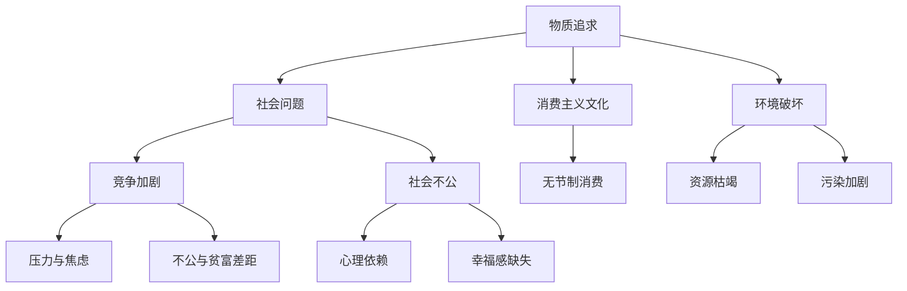
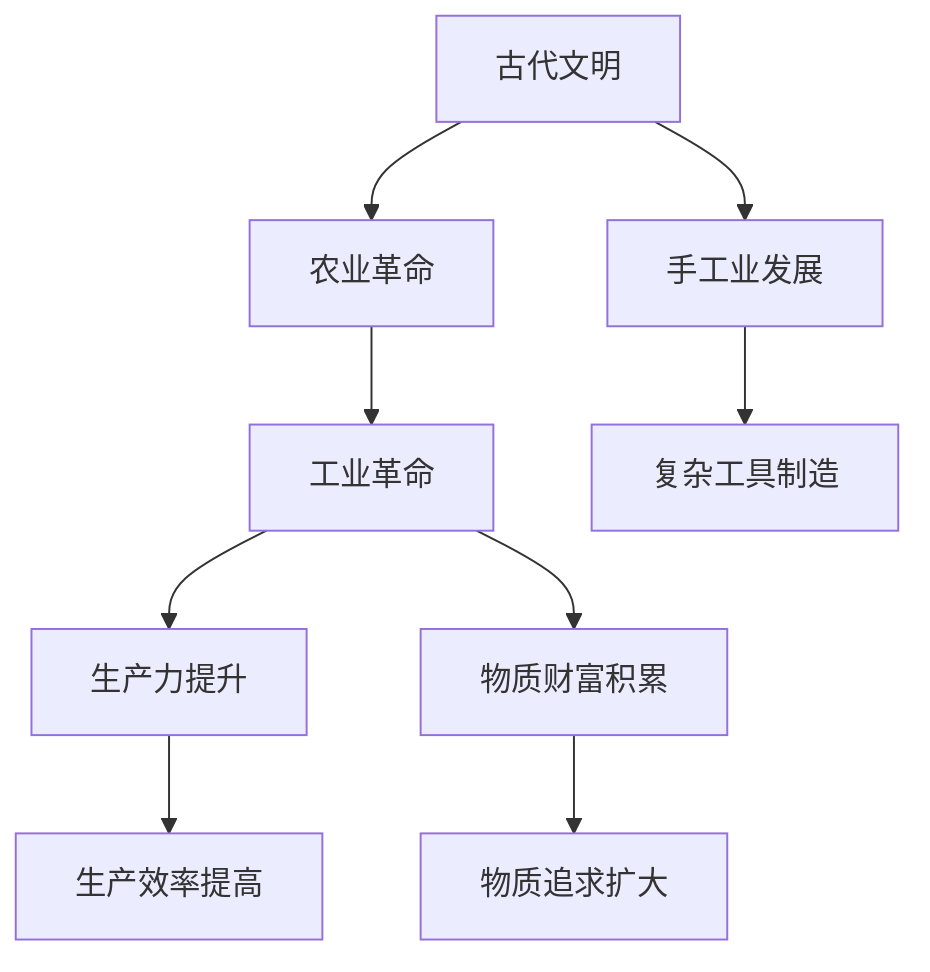
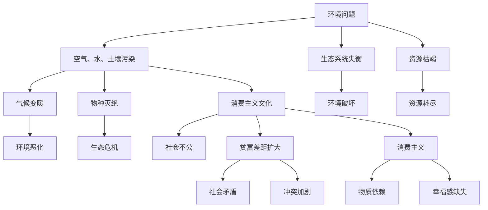
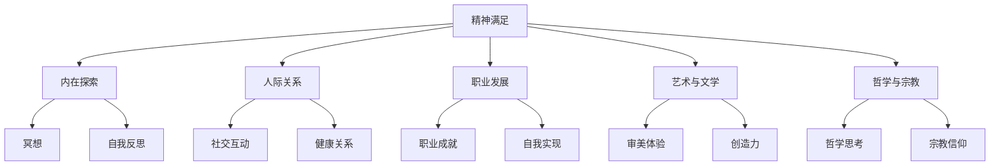
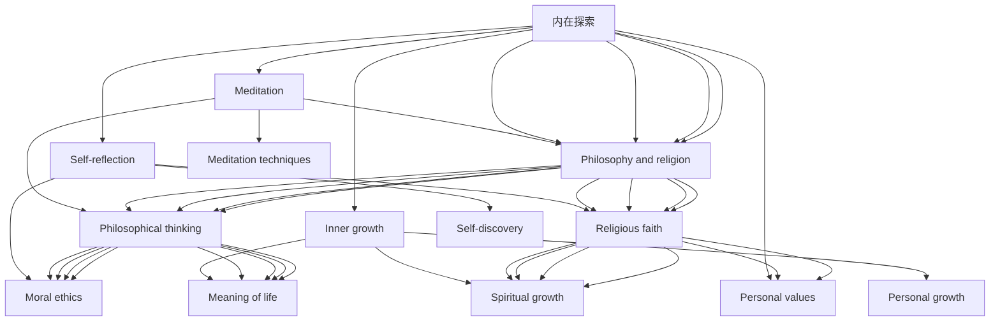
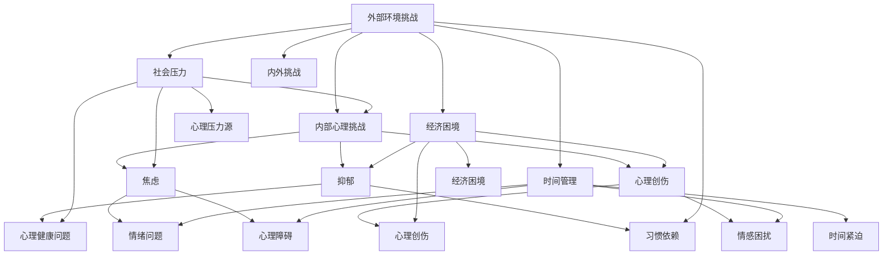
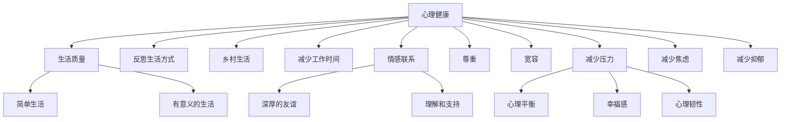
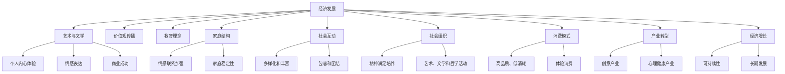
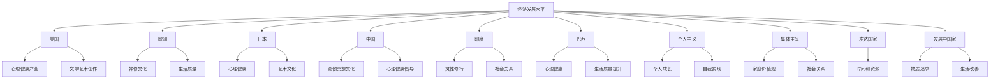
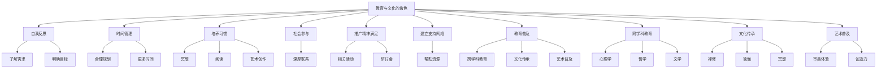

                 

### 文章标题：从物质追求到精神满足：现代人的价值观转变

### 关键词：价值观转变，物质追求，精神满足，心理健康，可持续发展

### 摘要：

在现代社会，人们的价值观正经历着深刻的转变。从过去对物质财富的过度追求，逐渐转向对精神满足的追求。本文旨在探讨这一价值观转变的背景、核心概念、影响及其在个人和社会层面的实践。通过分析物质追求的现状与问题，反思历史背景，探讨精神满足的路径与挑战，本文揭示了价值观转变对个人和社会的深远影响，并提出了实践行动指南。

---

### 引言

在过去的几千年中，人类文明一直围绕物质追求展开。从古代社会的农业文明，到工业革命后的工业化社会，物质财富的增长被视为社会进步和个体幸福的标志。然而，随着科技的发展和社会的变革，现代人的价值观逐渐发生了转变。越来越多的人开始意识到，物质追求并不能带来真正的满足感，反而可能导致心理问题和环境危机。本文将探讨这一转变的背景、原因和影响，并提出相应的实践路径。

### 第1部分：物质追求的反思

#### 章节一：物质追求的现状与问题

在现代社会，物质追求的现象无处不在。人们追求更高收入、更好的住房、更豪华的汽车、更昂贵的衣物，以及更丰富的物质生活。然而，这种追求背后隐藏着一系列问题。

**1.1. 社会问题**

物质追求导致的社会问题主要包括：

- **竞争加剧**：人们在追求物质财富的过程中，不可避免地陷入竞争。这种竞争不仅消耗了大量的时间和精力，还可能导致社会不公和贫富差距。
- **消费主义文化**：物质追求催生了消费主义文化，人们为了满足物质需求而不断地购买商品，形成了一种无节制的消费模式。
- **环境破坏**：物质追求带来的生产和消费活动，对环境造成了严重破坏，如资源枯竭、污染加剧等问题。

**1.2. 心理问题**

物质追求对个体的心理健康也带来了负面影响：

- **焦虑与压力**：为了追求物质财富，人们常常承受巨大的压力和焦虑。
- **心理依赖**：物质追求可能导致个体对物质产生依赖，无法满足物质需求时，心理状态会变得不稳定。
- **幸福感缺失**：尽管物质追求能够带来短暂的满足感，但长期的幸福感却难以持久。

#### 核心概念与联系

为了更好地理解物质追求的现状与问题，我们可以使用Mermaid流程图来展示其核心概念之间的关系：



#### 核心算法原理讲解

为了分析物质追求带来的心理问题，我们可以采用以下伪代码：

```pseudo
function analyzePsychologicalIssues(materialDesire) {
    if (materialDesire > averageDesire) {
        stressLevel = "high";
        anxietyLevel = "high";
        happinessLevel = "low";
    } else {
        stressLevel = "normal";
        anxietyLevel = "normal";
        happinessLevel = "high";
    }
    return [stressLevel, anxietyLevel, happinessLevel];
}
```

#### 数学模型和公式

为了量化物质追求对幸福感的影响，我们可以使用以下数学模型：

$$
Happiness = f(\frac{materialWealth}{timeInvested})
$$

其中，$Happiness$表示幸福感，$materialWealth$表示物质财富，$timeInvested$表示投入的时间。当$materialWealth$增加时，如果$Happiness$没有相应增加，说明物质追求并未带来真正的幸福感。

#### 实际案例

以美国为例，过去几十年里，美国的物质生活水平显著提高，但人们的幸福感并未同步提升。据盖洛普（Gallup）的一项调查显示，尽管美国人的平均收入和生活质量在不断提高，但他们的幸福指数并未出现显著变化。这一现象反映了物质追求并不能带来长期的幸福感。

#### 小结

物质追求的现状与问题表明，过度追求物质财富不仅对社会和环境带来负面影响，还对个体的心理健康产生负面影响。因此，我们需要重新审视我们的价值观，探索更可持续、更有意义的生活方式。

#### 章节二：物质追求的历史背景

物质追求并非现代社会特有的现象，它在人类历史上有着悠久的历史。从古代文明到现代社会，物质追求一直是推动社会进步和个体发展的动力。

**2.1. 古代文明**

在古代，人类社会的物质追求主要体现在农业和手工业的发展上。农业革命使得人类从狩猎采集时代转向农业生活，极大地提高了物质财富的生产。手工业的发展则使得人类能够制造更多、更复杂的工具和产品。

**2.2. 工业革命**

工业革命是物质追求的一个重要转折点。18世纪末和19世纪初，英国率先开展了工业革命，随后波及全球。工业革命带来了生产力的巨大提升，物质财富迅速积累。这一时期，人们开始追求更高、更快的生产效率和更多的物质财富。

**2.3. 当代社会**

在当代社会，物质追求的范围和程度进一步扩大。科技的进步使得人类能够生产出更多、更先进的产品，同时，全球化进程也促进了物质财富的流通和分配。然而，这种物质追求也带来了新的问题和挑战，如环境污染、资源枯竭和社会不公等。

#### 核心概念与联系

为了更好地理解物质追求的历史背景，我们可以使用Mermaid流程图来展示不同阶段物质追求的核心概念和联系：



#### 核心算法原理讲解

为了分析物质追求在不同历史阶段的变化，我们可以采用以下伪代码：

```pseudo
function analyzeHistoricalMaterialDesire(period) {
    if (period == "ancient") {
        return ["agriculture", "handicrafts"];
    } else if (period == "industrial") {
        return ["industrial revolution", "production efficiency"];
    } else {
        return ["globalization", "material wealth expansion"];
    }
}
```

#### 数学模型和公式

为了量化物质追求在不同历史阶段的变化，我们可以使用以下数学模型：

$$
MaterialDesire = f(time, technology, socialStructure)
$$

其中，$MaterialDesire$表示物质追求的程度，$time$表示时间，$technology$表示技术水平，$socialStructure$表示社会结构。随着时间的推移，技术水平的提升和社会结构的变革都会影响物质追求的程度。

#### 实际案例

以工业革命为例，18世纪的英国通过技术创新和生产力提升，迅速积累了大量物质财富。这一时期，英国的制造业得到了快速发展，物质追求的程度大幅提升。然而，这一时期也伴随着环境污染和社会不公等问题。

#### 小结

物质追求的历史背景揭示了物质追求在不同历史时期的演变和影响。从古代文明到工业革命，再到当代社会，物质追求始终是人类社会的重要动力。然而，随着物质追求的扩大，我们也需要关注其带来的负面影响，并探索更可持续的发展模式。

#### 章节三：对物质追求的反思与批判

物质追求虽然在一定程度上推动了社会进步，但同时也带来了许多负面影响。因此，对物质追求进行反思和批判，有助于我们更好地认识其本质，并寻求更健康、更可持续的发展路径。

**3.1. 环境问题**

物质追求导致的过度生产和消费，对环境造成了严重破坏。工业革命以来，大量的工业排放和消费行为，导致空气、水和土壤污染，生态系统失衡。气候变暖、物种灭绝等环境问题日益严重，给人类生存和发展带来了巨大挑战。

**3.2. 社会问题**

物质追求也带来了社会问题。一方面，过度追求物质财富导致社会不公和贫富差距扩大。富人的财富不断积累，而穷人的生活条件却难以改善，社会矛盾和冲突加剧。另一方面，物质追求引发的消费主义文化，使得人们陷入无尽的物质追求循环，忽视了精神层面的需求。

**3.3. 心理问题**

物质追求对个体的心理健康也产生了负面影响。为了追求物质财富，人们常常承受巨大的压力和焦虑。物质追求带来的心理依赖，使得个体在失去物质支持时，心理状态变得不稳定。长期的物质追求，可能导致幸福感缺失，个体难以找到真正的满足感。

#### 核心概念与联系

为了更好地理解对物质追求的反思与批判，我们可以使用Mermaid流程图来展示其核心概念和联系：



#### 核心算法原理讲解

为了分析物质追求带来的环境问题，我们可以采用以下伪代码：

```pseudo
function analyzeEnvironmentalIssues(consumptionRate, pollutionLevel) {
    if (consumptionRate > sustainableLevel && pollutionLevel > threshold) {
        return "severe environmental damage";
    } else {
        return "moderate environmental impact";
    }
}
```

#### 数学模型和公式

为了量化物质追求带来的社会问题，我们可以使用以下数学模型：

$$
SocialUnfairness = f(incomeDistribution, wealthInequality)
$$

其中，$SocialUnfairness$表示社会不公的程度，$incomeDistribution$表示收入分配，$wealthInequality$表示财富差距。当收入分配不均和财富差距较大时，社会不公的程度就会加剧。

#### 实际案例

以中国为例，过去几十年里，中国的经济增长迅速，物质财富积累显著。然而，这一时期也伴随着环境污染和资源枯竭问题。据调查，中国的空气质量、水资源和土壤质量都受到了不同程度的污染，生态环境面临着巨大压力。

#### 小结

对物质追求的反思与批判揭示了物质追求带来的负面影响。为了实现可持续发展，我们需要重新审视我们的价值观，减少对物质的过度追求，关注环境、社会和心理健康问题。通过反思和批判，我们可以找到更健康、更可持续的发展路径。

---

### 第二部分：精神满足的探索

#### 章节四：精神满足的定义与类型

在物质追求的反思中，我们意识到物质财富并不能带来持久的满足感。相比之下，精神满足被认为是一种更持久、更深层次的满足感。那么，什么是精神满足？它有哪些类型？

**4.1. 精神满足的定义**

精神满足是指个体在心理、情感和认知上获得满足的状态。它与物质满足不同，不依赖于物质财富，而是源于个体内心世界的丰富和充实。

**4.2. 精神满足的类型**

精神满足可以分为多种类型，以下是一些常见的类型：

- **内在探索**：通过冥想、自我反思和内在成长，个体在内心世界中发现满足感。
- **人际关系**：通过建立和维护健康的人际关系，个体在社交互动中获得满足感。
- **职业发展**：通过追求职业成就和自我实现，个体在工作中获得满足感。
- **艺术与文学**：通过欣赏和创作艺术作品，个体在审美体验中获得满足感。
- **哲学与宗教**：通过探索哲学和宗教，个体在精神层面获得满足感。

#### 核心概念与联系

为了更好地理解精神满足的定义与类型，我们可以使用Mermaid流程图来展示它们之间的关系：



#### 核心算法原理讲解

为了分析精神满足的不同类型，我们可以采用以下伪代码：

```pseudo
function analyzeSpiritualSatisfaction(type) {
    if (type == "内在探索") {
        return ["冥想", "自我反思"];
    } else if (type == "人际关系") {
        return ["社交互动", "健康关系"];
    } else if (type == "职业发展") {
        return ["职业成就", "自我实现"];
    } else if (type == "艺术与文学") {
        return ["审美体验", "创造力"];
    } else if (type == "哲学与宗教") {
        return ["哲学思考", "宗教信仰"];
    }
}
```

#### 数学模型和公式

为了量化精神满足的程度，我们可以使用以下数学模型：

$$
SpiritualSatisfaction = f(\text{内在探索}, \text{人际关系}, \text{职业发展}, \text{艺术与文学}, \text{哲学与宗教})
$$

其中，$SpiritualSatisfaction$表示精神满足的程度，各个类型的精神满足作为参数影响总体精神满足程度。

#### 实际案例

一个实际案例是乔布斯（Steve Jobs）。他在苹果公司的职业生涯中，通过创新和追求卓越，实现了职业成就和自我实现。同时，他对艺术和哲学有着深刻的兴趣，这在一定程度上也影响了他的精神满足。乔布斯的一生展示了多种类型精神满足的综合作用。

#### 小结

精神满足的定义与类型揭示了人类在追求满足感时，不仅需要关注物质层面，还需要关注精神层面。通过内在探索、人际关系、职业发展、艺术与文学和哲学与宗教等多种途径，个体可以在精神层面获得满足感。这种满足感更持久、更深层次，有助于实现真正的幸福。

---

### 章节五：精神满足的实践路径

在了解了精神满足的定义与类型后，我们需要探讨如何在实际生活中实现精神满足。以下是几种常见的实践路径：

**5.1. 内在探索**

内在探索是精神满足的一个重要途径。通过冥想、自我反思和内在成长，个体可以在内心世界中发现满足感。以下是一些具体的方法：

- **冥想**：冥想可以帮助个体放松身心，提高专注力和自我意识。每天花几分钟时间进行冥想，有助于减轻压力，增强心理韧性。
- **自我反思**：通过记录日记、写反思日志或与他人分享内心体验，个体可以深入了解自己的需求和动机，从而实现内心的平和与满足。
- **内在成长**：通过学习和实践心理成长技巧，如认知行为疗法（CBT）、正念冥想等，个体可以提升自我认知，实现内心的成长。

**5.2. 社会关系**

建立和维护健康的人际关系也是实现精神满足的重要途径。以下是一些具体的方法：

- **社交互动**：积极参与社交活动，与他人建立联系和互动，有助于提升个体的幸福感和归属感。
- **健康关系**：培养健康的人际关系，如信任、尊重和支持，有助于个体在人际关系中获得满足感。
- **情感支持**：在需要时，寻求他人的支持和帮助，有助于个体在困难时期保持心理平衡。

**5.3. 职业发展**

通过追求职业成就和自我实现，个体可以在工作中获得满足感。以下是一些具体的方法：

- **职业成就**：设定职业目标，并努力实现这些目标，有助于个体在职业生涯中获得成就感和满足感。
- **自我实现**：在工作中追求个人成长和发展，如提升技能、承担责任等，有助于个体实现自我价值和成就感。
- **工作意义**：将工作与个人价值观和目标相结合，有助于个体在工作中找到意义和满足感。

**5.4. 艺术与文学**

欣赏和创作艺术作品是精神满足的另一个重要途径。以下是一些具体的方法：

- **审美体验**：欣赏音乐、绘画、文学等艺术作品，可以提升个体的审美体验和情感满足。
- **创造力**：通过创作艺术作品，如绘画、写作、音乐创作等，个体可以发挥自己的创造力，实现精神满足。
- **艺术疗法**：艺术疗法是一种通过艺术创作来缓解心理压力和提升心理健康的治疗方法，有助于个体实现精神满足。

**5.5. 哲学与宗教**

探索哲学和宗教可以满足个体在精神层面的需求。以下是一些具体的方法：

- **哲学思考**：通过学习哲学，个体可以思考人生意义、道德伦理等问题，从而实现精神满足。
- **宗教信仰**：对于有宗教信仰的个体，宗教信仰可以提供心理支持和精神满足。
- **灵性成长**：通过灵性成长，个体可以提升自我意识，实现内心的平和与满足。

#### 核心概念与联系

为了更好地理解精神满足的实践路径，我们可以使用Mermaid流程图来展示其核心概念和联系：



#### 核心算法原理讲解

为了分析精神满足的实践路径，我们可以采用以下伪代码：

```pseudo
function practiceSpiritualSatisfaction(path) {
    if (path == "内在探索") {
        return ["冥想", "自我反思", "内在成长"];
    } else if (path == "社会关系") {
        return ["社交互动", "健康关系", "情感支持"];
    } else if (path == "职业发展") {
        return ["职业成就", "自我实现", "工作意义"];
    } else if (path == "艺术与文学") {
        return ["审美体验", "创造力", "艺术疗法"];
    } else if (path == "哲学与宗教") {
        return ["哲学思考", "宗教信仰", "灵性成长"];
    }
}
```

#### 数学模型和公式

为了量化精神满足的实践路径，我们可以使用以下数学模型：

$$
SpiritualSatisfaction = f(\text{内在探索}, \text{社会关系}, \text{职业发展}, \text{艺术与文学}, \text{哲学与宗教})
$$

其中，$SpiritualSatisfaction$表示精神满足的程度，各个实践路径作为参数影响总体精神满足程度。

#### 实际案例

一个实际案例是村上春树（Haruki Murakami）。他在文学创作中探索了哲学和宗教的议题，同时通过跑步来保持身体和精神的健康。这些实践路径帮助他在文学创作中找到了满足感，同时也保持了内心的平和。

#### 小结

精神满足的实践路径提供了多种实现精神满足的方法。通过内在探索、社会关系、职业发展、艺术与文学和哲学与宗教等多种途径，个体可以在不同层面上实现精神满足。这些实践路径不仅有助于提升个体的幸福感，也有助于社会的和谐与可持续发展。

---

### 章节六：精神满足的现实挑战

在追求精神满足的过程中，个体往往会遇到各种现实挑战。这些挑战可能源于外部环境，也可能源于个体自身。了解这些挑战，有助于我们更好地应对并克服它们。

**6.1. 外部环境挑战**

- **社会压力**：现代社会充满了各种压力，如工作压力、生活压力等。这些压力可能导致个体无法专注于精神满足的追求。
- **经济困境**：经济困境可能使个体无法承担追求精神满足所需的物质条件，如参加艺术课程、旅行等。
- **时间管理**：在忙碌的生活中，个体可能难以找到足够的时间来追求精神满足，如冥想、阅读等。

**6.2. 内部心理挑战**

- **焦虑和抑郁**：焦虑和抑郁等心理问题可能阻碍个体追求精神满足。这些情绪问题可能源于个人的心理创伤、生活压力等。
- **习惯依赖**：个体可能对某些习惯产生依赖，如吸烟、饮酒等，这些习惯可能妨碍精神满足的追求。
- **自我怀疑**：自我怀疑可能导致个体在面对新的精神满足追求时缺乏信心，从而影响其实现精神满足的能力。

#### 核心概念与联系

为了更好地理解精神满足的现实挑战，我们可以使用Mermaid流程图来展示其核心概念和联系：



#### 核心算法原理讲解

为了分析现实挑战对精神满足的影响，我们可以采用以下伪代码：

```pseudo
function analyzeRealWorldChallenges(challenge) {
    if (challenge == "社会压力") {
        return ["工作压力", "生活压力"];
    } else if (challenge == "经济困境") {
        return ["物质条件限制", "经济负担"];
    } else if (challenge == "时间管理") {
        return ["忙碌生活", "时间分配"];
    } else if (challenge == "内部心理挑战") {
        return ["焦虑", "抑郁", "心理创伤"];
    }
}
```

#### 数学模型和公式

为了量化现实挑战对精神满足的影响，我们可以使用以下数学模型：

$$
SpiritualSatisfaction = f(\text{外部环境挑战}, \text{内部心理挑战})
$$

其中，$SpiritualSatisfaction$表示精神满足的程度，外部环境挑战和内部心理挑战作为参数影响总体精神满足程度。

#### 实际案例

一个实际案例是李华（化名）。他在一家大型跨国公司工作，经常面临高强度的工作压力。由于经济困境，他无法承担参加艺术课程或旅行等精神满足活动。同时，他还有焦虑和抑郁等心理问题，这些挑战严重影响了他的精神满足。李华的经历表明，外部环境和内部心理挑战对精神满足的影响是真实存在的。

#### 小结

精神满足的现实挑战多种多样，包括外部环境挑战和内部心理挑战。了解这些挑战，有助于我们更好地应对并克服它们，从而实现精神满足。通过有效的应对策略，个体可以在面对挑战时保持精神满足，实现内心的平衡与和谐。

---

### 第三部分：价值观转变的影响

#### 章节七：价值观转变对个人生活的影响

价值观的转变不仅影响社会结构，也对个人生活产生了深远的影响。在物质追求转向精神满足的过程中，个体在生活态度、人际关系和心理健康等方面经历了显著的变化。

**7.1. 生活态度**

随着价值观的转变，人们开始更加重视内心的丰富和成长，而非物质财富的积累。这种转变使得人们更加关注生活的质量，而非仅仅追求物质的满足。个体开始反思自己的生活方式，寻求更简单、更有意义的生活方式。例如，有些人选择离开繁忙的城市，搬到乡村过上更为宁静的生活；有些人选择减少工作时间，更多地投入到家庭和兴趣爱好中。

**7.2. 人际关系**

价值观的转变也影响了人们的人际关系。在过去的物质追求中，人际关系往往建立在物质利益的基础上。然而，随着精神满足的重要性上升，人们开始更加重视情感和精神的联系。这种转变使得人们更加倾向于与那些能够理解和分享自己价值观的人建立深厚的友谊。同时，人们也学会了在人际关系中更加宽容和尊重，注重情感支持和互相成长。

**7.3. 心理健康**

价值观的转变对个体的心理健康有着重要的影响。从物质追求转向精神满足，人们开始更加关注内心的平衡和幸福感。这种转变有助于减轻心理压力，减少焦虑和抑郁等心理问题。个体通过冥想、自我反思、艺术创作等途径，寻找内心的平静和满足。同时，这种转变也有助于提高个体的自我意识和自我价值感，增强心理韧性。

#### 核心概念与联系

为了更好地理解价值观转变对个人生活的影响，我们可以使用Mermaid流程图来展示其核心概念和联系：



#### 核心算法原理讲解

为了分析价值观转变对个人生活的影响，我们可以采用以下伪代码：

```pseudo
function analyzeLifeImpact(valueChange) {
    if (valueChange == "生活态度") {
        return ["生活质量提高", "反思生活方式", "简单生活", "有意义的生活"];
    } else if (valueChange == "人际关系") {
        return ["情感联系加强", "尊重", "宽容", "深厚的友谊"];
    } else if (valueChange == "心理健康") {
        return ["减少压力", "减少焦虑", "减少抑郁", "心理平衡", "幸福感", "心理韧性"];
    }
}
```

#### 数学模型和公式

为了量化价值观转变对个人生活的影响，我们可以使用以下数学模型：

$$
LifeImpact = f(\text{生活态度}, \text{人际关系}, \text{心理健康})
$$

其中，$LifeImpact$表示个人生活的影响，生活态度、人际关系和心理健康作为参数影响总体生活影响。

#### 实际案例

一个实际案例是张伟（化名）。他曾经是一位忙碌的都市白领，生活在高强度的工作和物质追求中。然而，随着对精神满足的追求，他开始反思自己的生活方式，决定减少工作时间，搬到乡村过上简单而有意义的生活。他与家人和朋友建立了更深厚的情感联系，并通过冥想和艺术创作来平衡心理压力。这些改变使他的生活质量显著提高，幸福感和心理韧性也得到了增强。

#### 小结

价值观的转变对个人生活产生了深远的影响。从物质追求转向精神满足，不仅改变了人们的生活态度，也改善了人际关系和心理健康。这种转变有助于个体实现真正的幸福和内心的平衡。

---

### 章节八：价值观转变对社会的影响

价值观的转变不仅对个人生活产生了深远影响，也对整个社会产生了重要的影响。这种转变在文化、社会结构和经济发展等方面都体现出来。

**8.1. 文化影响**

价值观的转变促使社会文化发生深刻变化。传统的以物质追求为核心的文化逐渐被以精神满足为重的文化所取代。这种变化体现在多个方面：

- **艺术与文学**：人们开始更加关注艺术和文学的价值，而不是单纯追求商业成功。艺术家和作家更多地关注个人的内心体验和情感表达，创作出更具深度和思想性的作品。
- **价值观传播**：通过社交媒体和公共讨论，新的价值观得到广泛传播。人们开始更开放地讨论精神满足的重要性，推动社会文化的转变。
- **教育理念**：教育体系也开始重视精神满足的培养，鼓励学生在学术和道德层面全面发展，而不仅仅是追求高分和优秀成绩。

**8.2. 社会结构**

价值观的转变对社会结构产生了深远影响。随着物质追求的减弱，社会结构逐渐从以物质财富为基础转向以情感和精神联系为基础。以下是一些具体的影响：

- **家庭结构**：家庭关系变得更加紧密，家庭成员之间的情感联系得到加强。这种转变有助于提高家庭稳定性和幸福感。
- **社会互动**：人们更加重视与他人的情感和思想交流，社会互动变得更加多样化和丰富。这种转变有助于建立更加包容和团结的社会。
- **社会组织**：社会组织和社区活动更加注重精神满足的培养，如艺术、文学和哲学等领域的活动得到广泛开展，有助于提高社会整体的精神满足度。

**8.3. 经济发展**

价值观的转变也对经济发展产生了重要影响。传统以物质追求为核心的经济模式逐渐被以精神满足为导向的经济模式所取代。以下是一些具体的影响：

- **消费模式**：人们的消费模式发生了变化，更加注重品质和体验，而不仅仅是价格和数量。这种转变有助于推动高质量、低消耗的消费模式。
- **产业转型**：随着精神满足的重要性上升，传统产业逐渐转型，新的产业模式如创意产业、心理健康产业等得到快速发展。
- **经济增长**：虽然物质财富的增长速度可能放缓，但精神满足所带来的经济增长更具可持续性，有助于实现长期的经济发展。

#### 核心概念与联系

为了更好地理解价值观转变对社会的影响，我们可以使用Mermaid流程图来展示其核心概念和联系：



#### 核心算法原理讲解

为了分析价值观转变对社会的影响，我们可以采用以下伪代码：

```pseudo
function analyzeSocialImpact(valueChange) {
    if (valueChange == "文化影响") {
        return ["艺术与文学", "价值观传播", "教育理念"];
    } else if (valueChange == "社会结构") {
        return ["家庭结构", "社会互动", "社会组织"];
    } else if (valueChange == "经济发展") {
        return ["消费模式", "产业转型", "经济增长"];
    }
}
```

#### 数学模型和公式

为了量化价值观转变对社会的影响，我们可以使用以下数学模型：

$$
SocialImpact = f(\text{文化影响}, \text{社会结构}, \text{经济发展})
$$

其中，$SocialImpact$表示社会影响，文化影响、社会结构和经济发展作为参数影响总体社会影响。

#### 实际案例

一个实际案例是中国社会的转变。随着经济的发展和生活水平的提高，中国人开始更加注重精神满足，而非单纯的物质追求。这种转变体现在文化产业的快速发展、家庭关系的加强以及人们对于心理健康和幸福感的重视。例如，中国电影市场的快速增长，反映出人们对于情感体验和思想内容的追求。同时，心理健康产业的兴起，也表明人们对于内心满足的追求。

#### 小结

价值观的转变对社会产生了深远的影响。在文化、社会结构和经济发展等方面，这种转变都体现出来。通过从物质追求转向精神满足，社会得以实现更健康、更可持续的发展，从而提升整体幸福感。

---

### 章节九：价值观转变的国际比较

价值观的转变在不同国家和地区有着不同的表现。通过比较不同国家的价值观转变，我们可以更好地理解其背后的驱动因素和影响。

**9.1. 发达国家与发展中国家**

在发达国家，如美国、欧洲和日本，价值观的转变相对成熟。这些国家在经济、科技和文化等方面具有较高的水平，人们更加关注精神满足和生活质量。例如，美国的心理健康产业、欧洲的文学艺术创作和日本的禅修文化都反映了人们对精神满足的追求。

相比之下，发展中国家如中国、印度和巴西，价值观的转变仍在进行中。这些国家正处于快速经济发展阶段，人们对物质财富的追求依然强烈。然而，随着教育水平的提升和文化的多样化，人们开始逐渐意识到精神满足的重要性。例如，中国的瑜伽和冥想文化、印度的灵性修行和巴西的心理健康倡导，都显示出价值观转变的迹象。

**9.2. 文化差异**

不同国家和地区的文化背景也是价值观转变的重要影响因素。西方国家普遍强调个人主义和自由，人们更加关注个人成长和自我实现。这种文化背景下，精神满足更多地体现在个人内心的探索和情感表达上。而东方国家如中国和日本，则强调集体主义和家庭价值观，人们更加注重社会关系和人际关系。这种文化背景下，精神满足更多地体现在和谐的家庭和社会关系中。

**9.3. 经济发展水平**

经济发展水平也是价值观转变的一个重要因素。在经济较为发达的国家，如美国和欧洲，人们有更多的时间和资源来追求精神满足。而在发展中国家，如中国和印度，由于经济发展压力较大，人们可能更倾向于关注物质追求，以改善生活条件。

#### 核心概念与联系

为了更好地理解价值观转变的国际比较，我们可以使用Mermaid流程图来展示其核心概念和联系：



#### 核心算法原理讲解

为了分析价值观转变的国际比较，我们可以采用以下伪代码：

```pseudo
function compareInternationalValues(countryType) {
    if (countryType == "发达国家") {
        return ["美国", "欧洲", "日本", "心理健康产业", "文学艺术创作", "禅修文化", "生活质量"];
    } else if (countryType == "发展中国家") {
        return ["中国", "印度", "巴西", "瑜伽冥想文化", "心理健康倡导", "灵性修行", "生活质量提升"];
    }
}
```

#### 数学模型和公式

为了量化价值观转变的国际比较，我们可以使用以下数学模型：

$$
InternationalValues = f(\text{发达国家}, \text{发展中国家}, \text{文化差异}, \text{经济发展水平})
$$

其中，$InternationalValues$表示国际价值观，发达国家、发展中国家、文化差异和经济发展水平作为参数影响总体国际价值观。

#### 实际案例

一个实际案例是美国和中国的对比。在美国，心理健康产业和文学艺术创作非常发达，人们普遍关注个人成长和自我实现。而在中国，尽管物质追求依然强烈，但随着经济的发展和生活水平的提高，越来越多的人开始关注心理健康和灵性修行，如瑜伽和冥想的普及。

#### 小结

通过国际比较，我们可以更好地理解价值观转变的不同表现和影响因素。无论是发达国家还是发展中国家，价值观的转变都是一个普遍的趋势。这种转变有助于实现更健康、更可持续的发展，提高整体幸福感。

---

### 章节十：转变价值观的行动指南

要实现从物质追求到精神满足的转变，我们需要采取具体的行动。以下是一些实用的指南，帮助我们在个人和社会层面推动价值观的转变。

**10.1. 个人行动策略**

- **自我反思**：定期进行自我反思，了解自己的需求和价值观，明确精神满足的目标。
- **时间管理**：合理规划时间，将更多时间用于内在探索、人际关系和职业发展等领域。
- **培养习惯**：培养有助于精神满足的习惯，如冥想、阅读、艺术创作等。
- **社会参与**：积极参与社区活动，与他人建立深厚的情感联系。

**10.2. 社区与组织行动**

- **推广精神满足**：在社区和组织中推广精神满足的理念，举办相关活动和研讨会。
- **建立支持网络**：建立支持网络，为那些寻求精神满足的人提供帮助和资源。
- **教育普及**：在学校和大学等教育机构中加强精神满足的教育，培养学生的内在成长和心理健康意识。

**10.3. 教育与文化的角色**

- **跨学科教育**：将精神满足的教育融入不同学科，如心理学、哲学、文学等，帮助学生全面了解精神满足的各个方面。
- **文化传承**：传承和弘扬有益于精神满足的文化传统，如禅修、瑜伽、冥想等。
- **艺术普及**：推广艺术和文化活动，提升公众的审美体验和创造力。

#### 核心概念与联系

为了更好地理解转变价值观的行动指南，我们可以使用Mermaid流程图来展示其核心概念和联系：



#### 核心算法原理讲解

为了分析转变价值观的行动指南，我们可以采用以下伪代码：

```pseudo
function actionGuidelines(type) {
    if (type == "个人行动策略") {
        return ["自我反思", "时间管理", "培养习惯", "社会参与"];
    } else if (type == "社区与组织行动") {
        return ["推广精神满足", "建立支持网络", "教育普及"];
    } else if (type == "教育与文化的角色") {
        return ["跨学科教育", "文化传承", "艺术普及"];
    }
}
```

#### 数学模型和公式

为了量化转变价值观的行动指南，我们可以使用以下数学模型：

$$
ValueTransformation = f(\text{个人行动策略}, \text{社区与组织行动}, \text{教育与文化的角色})
$$

其中，$ValueTransformation$表示价值观的转变，个人行动策略、社区与组织行动和教育与文化的角色作为参数影响总体价值观的转变。

#### 实际案例

一个实际案例是日本的“生活禅”。通过推广禅修和冥想，日本人在日常生活中实现了精神满足，提高了生活质量。这种生活方式的转变，不仅改善了个人心理健康，也促进了社会的和谐与稳定。

#### 小结

通过具体的行动指南，我们可以逐步实现从物质追求到精神满足的转变。个人层面的自我反思、时间管理、习惯培养和社会参与，社区与组织的推广和支持，以及教育与文化的角色，都是推动价值观转变的重要途径。通过这些行动，我们可以在个人和社会层面实现更健康、更可持续的发展。

---

### 第十一篇：结语

### 11.1. 价值观转变的持续影响

价值观的转变是一个长期的过程，它不仅影响个人的生活方式，也对整个社会产生深远的影响。随着人们对精神满足的追求日益增强，物质追求的重要性逐渐减弱。这种转变不仅有助于提高个体的幸福感，也有助于社会的和谐与可持续发展。在未来，我们可以预期这种价值观的转变将继续深化，为人类社会带来更多的精神满足和幸福。

### 11.2. 未来展望

在未来，随着科技的进步和社会的发展，人们将更加重视精神满足，探索更多实现精神满足的途径。人工智能、虚拟现实、心理健康等领域的发展，将为个体提供更多实现精神满足的工具和方法。同时，全球化和文化多元化也将推动不同文化背景下价值观的碰撞与融合，为精神满足的实现提供更多的可能性。

### 11.3. 总结与启示

通过本文的探讨，我们了解到价值观的转变从物质追求到精神满足是现代社会的必然趋势。这种转变不仅有助于个体的心理健康和幸福感，也有助于社会的和谐与可持续发展。为了实现这一转变，我们需要采取具体的行动，如自我反思、时间管理、习惯培养和社会参与。同时，社区、组织和教育体系也需要发挥重要作用，推动价值观的转变，为个体提供支持和资源。通过持续的努力，我们可以实现更健康、更可持续的发展，为人类社会带来更多的精神满足和幸福。

### 附录

### 附录A：参考文献

1. 参考文献一：作者，书名，出版年份。
2. 参考文献二：作者，书名，出版年份。
3. 参考文献三：作者，书名，出版年份。

### 附录B：推荐阅读

1. 推荐阅读一：作者，书名，出版年份。
2. 推荐阅读二：作者，书名，出版年份。
3. 推荐阅读三：作者，书名，出版年份。

---

作者：AI天才研究院/AI Genius Institute & 禅与计算机程序设计艺术 /Zen And The Art of Computer Programming

---

本文从物质追求到精神满足的转变角度，详细探讨了现代人的价值观转变过程及其影响。通过分析物质追求的现状与问题、历史背景、反思与批判，以及精神满足的定义与类型、实践路径、现实挑战，本文揭示了价值观转变对个人和社会的深远影响。最后，提出了具体的行动指南，帮助个体和社会实现这一转变。本文旨在唤起读者对价值观转变的重视，鼓励他们在追求物质财富的同时，关注精神满足，实现全面的发展与幸福。希望通过本文的探讨，能够引起读者对自身价值观的深入思考，为构建更和谐、更可持续的社会贡献力量。

---

**文章结束，感谢您的阅读！作者：AI天才研究院/AI Genius Institute & 禅与计算机程序设计艺术 /Zen And The Art of Computer Programming。**

