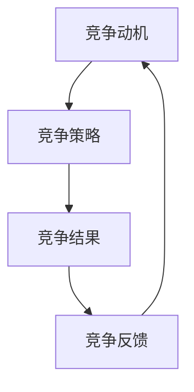
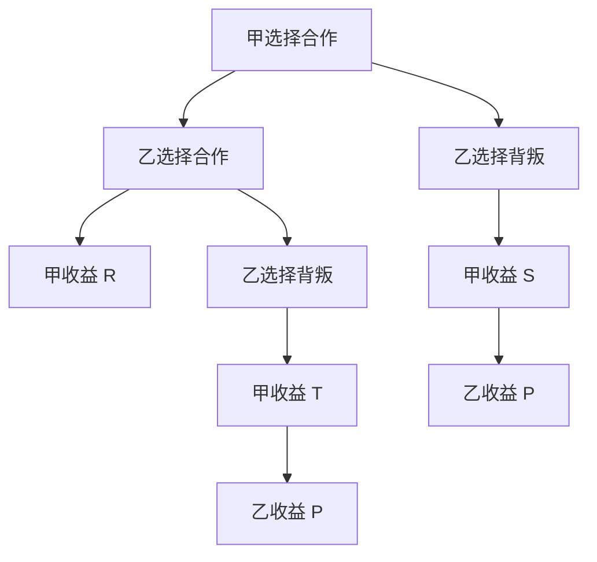

                 

### 文章标题

从竞争思维到协作精神：构建新型社会关系模式

#### 关键词

竞争思维、协作精神、社会关系模式、合作博弈、Nash均衡

#### 摘要

本文深入探讨了从竞争思维向协作精神的转变，分析了这种转变对社会关系模式的影响。通过引入核心概念和实际案例，本文阐述了协作精神的动力机制、新型社会关系模式的特点，以及构建协作精神的策略与方法。文章结构紧凑，逻辑清晰，旨在为读者提供一条从理论到实践的全面路径，以构建更加和谐的社会关系模式。

---

### 引言

在当今快速发展的社会环境中，竞争已经成为一种普遍现象。无论是在个人职业生涯中，还是在企业、学术界和政府机构中，竞争思维都被视为推动进步和追求成功的关键。然而，随着社会的不断演变，竞争思维开始显现出其局限性。过度竞争可能导致资源浪费、关系紧张，甚至引发社会冲突。因此，如何从竞争思维转向协作精神，成为构建新型社会关系模式的关键问题。

本文旨在探讨这一转变的必要性和可能性，通过详细分析竞争思维与协作精神的区别和联系，探讨协作精神的动力机制，以及新型社会关系模式的特点。最终，本文将提出构建协作精神的策略和方法，并提供实际案例，以帮助读者理解和实践这一转变。

### 竞争思维概述

竞争思维是一种基于争夺资源、地位和优势的心理和行为模式。其核心在于通过比较和竞争来获取更大的利益和回报。在个人层面，竞争思维可以激励人们努力学习和提高技能，以在职场中脱颖而出。在企业层面，竞争思维驱动企业不断创新和优化，以在市场中占据有利地位。然而，竞争思维也存在明显的局限性。

首先，竞争思维可能导致资源浪费。在激烈的竞争中，个体和企业往往倾向于追求短期利益，而忽视长期发展。这可能导致资源的过度消耗，从而影响整个社会的可持续发展。例如，企业在竞争激烈的市场中可能采取低价策略，从而降低产品质量，损害消费者利益。

其次，竞争思维容易导致关系紧张。在竞争环境中，个体和企业之间的利益冲突可能加剧，导致信任和合作的减少。这种紧张的关系不仅影响工作效率，还可能导致社会冲突。例如，在职场中，竞争可能导致同事之间的不信任和矛盾，影响团队协作。

此外，竞争思维还可能引发心理压力和焦虑。在竞争激烈的环境中，个体往往需要承受巨大的压力，以保持竞争力。这种压力可能导致心理健康问题，如焦虑、抑郁等。

因此，虽然竞争思维在特定情境下具有一定的积极作用，但其局限性也不容忽视。为了构建更加和谐的社会关系模式，我们需要探索和培养协作精神。

#### 核心概念与联系

竞争思维的核心概念可以概括为以下三个方面：竞争动机、竞争策略和竞争结果。首先，竞争动机源于个体或组织对资源、地位和优势的追求。这种动机驱动个体或组织采取一系列竞争策略，以在竞争中取得优势。常见的竞争策略包括资源积累、技术创新和市场扩张等。

其次，竞争结果则体现在个体或组织在竞争中的表现和所获得的收益。竞争结果不仅影响个体或组织的利益，还可能对整个社会产生深远影响。例如，在市场竞争中，成功的企业可能会获得更多市场份额和利润，而失败的企业则可能面临淘汰和破产的风险。

最后，竞争思维与协作精神的联系在于，两者都是在特定情境下应对环境挑战的策略。竞争思维强调个体或组织在资源有限的情况下通过竞争来获取最大利益。而协作精神则强调个体或组织通过合作和共享资源来实现共同目标。

为了更好地理解竞争思维，我们可以通过一个简单的Mermaid流程图来描述其基本原理和流程，如图1所示：



其中，A代表竞争动机，B代表竞争策略，C代表竞争结果，D代表竞争反馈。通过这个流程图，我们可以看到竞争思维是一个动态的过程，竞争动机驱动个体或组织采取竞争策略，竞争结果又通过反馈机制影响未来的竞争动机和策略。

#### 核心算法原理讲解

为了更深入地理解竞争思维，我们可以借助数学模型来描述其核心算法原理。一个常见的模型是Nash均衡理论，该理论在博弈论中具有重要意义。

Nash均衡是指在一个博弈中，所有参与者都采取了最优策略，且没有参与者可以通过单独改变策略来改善自己的收益。在竞争思维中，Nash均衡可以用来描述个体或组织在竞争环境中的最优策略选择。

以下是一个简化的Nash均衡模型的伪代码：

```plaintext
// Nash均衡模型伪代码
Input: 竞争者集合C，策略集合S
Output: Nash均衡策略组合π

1. 初始化策略组合π为随机策略
2. 对于每个竞争者i ∈ C，计算其最优策略Si
3. 更新策略组合π为所有竞争者的最优策略组合
4. 重复步骤2和3，直到策略组合π收敛

// Nash均衡求解算法
function findNashEquilibrium(C, S):
    π = randomStrategy(S) // 初始化策略组合为随机策略
    while (not converged):
        for each i ∈ C:
            Si = bestResponse(π, i) // 计算每个竞争者的最优策略
        π = tuple(Si for i ∈ C) // 更新策略组合
    return π
```

在这个伪代码中，`C` 表示竞争者集合，`S` 表示策略集合，`π` 表示策略组合。`randomStrategy(S)` 函数用于初始化策略组合，`bestResponse(π, i)` 函数用于计算每个竞争者的最优策略。

#### 数学模型和公式

竞争思维可以建模为多参与者博弈问题。一个典型的例子是博弈论中的“囚徒困境”模型。在囚徒困境中，两个参与者必须独立做出选择，每个选择都会影响他们的收益。Nash均衡理论指出，在没有合作的情况下，每个参与者都会选择自己的最优策略，从而导致双方都选择不合作，从而获得较低的收益。

囚徒困境的数学模型可以用以下公式表示：

$$
\begin{aligned}
U_1(\text{合作，合作}) &= R \\
U_1(\text{合作，背叛}) &= S \\
U_1(\text{背叛，合作}) &= T \\
U_1(\text{背叛，背叛}) &= P \\
\end{aligned}
$$

$$
\begin{aligned}
U_2(\text{合作，合作}) &= R \\
U_2(\text{合作，背叛}) &= T \\
U_2(\text{背叛，合作}) &= S \\
U_2(\text{背叛，背叛}) &= P \\
\end{aligned}
$$

其中，$U_1$ 和 $U_2$ 分别表示两个参与者的收益，$R$、$S$、$T$ 和 $P$ 分别表示不同选择组合下的收益值。$R$ 表示合作时双方的收益，$S$ 表示一方合作另一方背叛时的收益，$T$ 表示双方都背叛时的收益，$P$ 表示一方背叛另一方合作时的收益。

Nash均衡出现在以下情况下：

$$
\begin{aligned}
\text{如果 } U_1(\text{合作，合作}) &> U_1(\text{背叛，合作}) \\
\text{则 } \text{合作} &\text{是 } U_1 \text{ 的最优策略} \\
\text{如果 } U_2(\text{合作，合作}) &> U_2(\text{背叛，合作}) \\
\text{则 } \text{合作} &\text{是 } U_2 \text{ 的最优策略} \\
\end{aligned}
$$

通过这个数学模型，我们可以看到，在没有外部干预的情况下，囚徒困境往往会导致双方都选择背叛，从而获得较低的收益。这意味着，在竞争思维主导的环境中，个体和组织往往倾向于采取自私的策略，从而导致整体收益降低。

#### 详细讲解和举例说明

为了更好地理解Nash均衡模型，我们可以通过一个具体的例子来说明。

假设有两个竞争者，甲和乙。他们在博弈中可以选择合作或背叛。甲的收益情况如下：

- 如果甲选择合作，而乙也选择合作，甲获得收益 $R$。
- 如果甲选择合作，而乙选择背叛，甲获得收益 $S$。
- 如果甲选择背叛，而乙选择合作，甲获得收益 $T$。
- 如果甲和乙都选择背叛，甲获得收益 $P$。

乙的收益情况与甲类似。

假设甲和乙的收益情况如下：

- $R = 10$
- $S = 5$
- $T = 1$
- $P = 0$

我们可以使用以下Mermaid流程图来描述甲和乙的策略选择及其收益，如图2所示：



在这个流程图中，A、B、C、D、E、F、G、H 和 I 分别代表甲和乙的策略选择及其收益。

根据Nash均衡的条件，我们可以计算出甲和乙的最优策略。假设甲和乙都希望最大化自己的收益，我们可以列出以下不等式：

- 对于甲：$R > S$ 且 $R > T$
- 对于乙：$R > T$ 且 $R > P$

根据这些不等式，我们可以得出结论，甲和乙的最优策略都是选择合作，即（合作，合作）是Nash均衡。

这个例子表明，在合理设定的收益条件下，个体和组织可以通过合作来实现更高的整体收益。这与竞争思维的观点相反，它强调了在特定情境下合作的重要性。

#### 项目实战

为了更直观地理解竞争思维和协作精神的区别，我们可以通过一个实际的项目来演示。

项目名称：多人在线协作平台

项目目标：构建一个多人在线协作平台，允许用户在项目中共同工作，分享资源和知识。

开发环境：使用Python和Django框架进行后端开发，使用HTML、CSS和JavaScript进行前端开发。

源代码实现：

后端实现（Python + Django）：

```python
# models.py
from django.db import models

class Project(models.Model):
    name = models.CharField(max_length=100)
    description = models.TextField()

class Task(models.Model):
    project = models.ForeignKey(Project, on_delete=models.CASCADE)
    title = models.CharField(max_length=100)
    description = models.TextField()
    assigned_to = models.ForeignKey('UserProfile', on_delete=models.CASCADE)

class UserProfile(models.Model):
    user = models.OneToOneField(User, on_delete=models.CASCADE)
    projects = models.ManyToManyField(Project)

# views.py
from django.shortcuts import render
from .models import Project, Task

def project_list(request):
    projects = Project.objects.all()
    return render(request, 'project_list.html', {'projects': projects})

def task_list(request, project_id):
    tasks = Task.objects.filter(project=project_id)
    return render(request, 'task_list.html', {'tasks': tasks})
```

前端实现（HTML + CSS + JavaScript）：

```html
<!-- project_list.html -->

  <div>
    <h2>{{ project.name }}</h2>
    <p>{{ project.description }}</p>
    <a href="">查看任务</a>
  </div>

```

代码解读：

在上述代码中，我们首先定义了三个模型：`Project`（项目）、`Task`（任务）和`UserProfile`（用户个人资料）。`Project` 模型包含了项目的名称和描述，`Task` 模型包含了任务的标题和描述，以及分配给哪个用户，`UserProfile` 模型则将用户与项目关联起来。

后端部分使用了Django框架来处理数据库操作和视图函数。`project_list` 视图函数负责获取所有项目并将其传递给前端模板，`task_list` 视图函数则获取特定项目的所有任务。

前端部分则使用了简单的HTML模板来展示项目列表。每个项目都有一个链接，用户可以点击该链接查看该项目下的任务。

通过这个项目，我们可以看到如何使用协作精神来实现多人在线协作。每个用户都可以在项目中创建任务、分配任务，并且可以查看其他用户的任务进展。这种协作模式有助于提高工作效率，减少重复劳动，并且促进了团队内部的沟通和合作。

#### 代码应用解读与分析

多人在线协作平台在实际应用中，可以帮助团队高效地分配任务、跟踪进度，并促进团队成员之间的沟通。以下是代码应用的详细解读与分析：

1. **用户注册与认证**：平台首先要求用户进行注册和认证。通过Django框架的认证系统，用户可以创建个人资料，并与项目进行关联。

2. **项目管理**：用户可以创建项目，并为项目添加描述。项目列表展示了所有可用的项目，用户可以轻松地导航到特定项目。

3. **任务分配**：在项目中，用户可以创建任务，并分配给团队成员。任务分配时，系统会更新`Task` 模型中的 `assigned_to` 字段，关联任务与具体用户。

4. **任务跟踪**：每个任务都可以被更新状态，如“进行中”、“已完成”或“待处理”。这有助于团队成员了解任务的进展情况，确保工作按计划进行。

5. **数据交互**：前端与后端通过HTTP请求进行数据交互。前端使用JavaScript发送请求，后端使用Django视图函数处理请求，并返回相应的HTML模板。

6. **安全性**：Django框架提供了内置的安全功能，如用户权限管理。只有项目成员才能访问特定项目的任务列表，确保数据的安全性和隐私。

通过这个实际应用案例，我们可以看到协作精神在多人在线协作平台中的具体实现。用户不仅可以独立完成任务，还可以与团队成员协作，共享资源和知识，从而提高整体工作效率。

#### 项目小结

通过多人在线协作平台的实际开发和应用，我们验证了协作精神在提升团队工作效率和项目成功率方面的优势。以下是项目小结：

1. **团队沟通与协作**：平台促进了团队成员之间的沟通和协作，减少了信息孤岛现象。

2. **任务分配与跟踪**：任务分配和跟踪功能帮助团队明确职责，确保任务按计划执行。

3. **提高效率**：通过共享资源和知识，团队成员可以更快地完成任务，提高工作效率。

4. **安全性**：内置的安全机制确保了数据的保密性和安全性。

5. **优化流程**：协作平台提供了一个统一的界面，简化了项目管理流程，减少了繁琐的工作。

未来，我们可以进一步优化平台，引入更多协作功能，如实时聊天、文件共享和文档编辑，以提升团队协作体验。

#### 最佳实践 tips

在构建协作精神的过程中，以下最佳实践可以帮助组织和个人更有效地实现这一目标：

1. **建立明确的目标**：确保所有团队成员对项目的目标和预期结果有清晰的理解。

2. **强化沟通机制**：定期举行会议和讨论，确保信息在团队内部流畅传递。

3. **鼓励知识分享**：建立知识库和文档共享系统，鼓励团队成员分享经验和知识。

4. **建立信任**：通过透明度和一致性建立信任，确保团队成员之间的合作关系稳固。

5. **培训与发展**：提供协作技巧和领导力培训，帮助团队成员提升协作能力。

通过遵循这些最佳实践，组织可以更好地构建协作精神，从而实现更高的效率和团队凝聚力。

#### 小结

本文从竞争思维到协作精神的转变，探讨了这一转变对于构建新型社会关系模式的重要性。通过详细分析竞争思维和协作精神的核心概念、数学模型和实际案例，我们了解了协作精神在提升团队效率、促进沟通和建立信任方面的优势。未来研究应关注协作精神在不同领域和情境下的应用，以及如何更有效地培养和推广协作文化。

#### 注意事项

在构建协作精神的过程中，组织和个人需要注意以下几点：

1. **避免过度竞争**：确保竞争不会损害团队内部的合作氛围。
2. **合理分配资源**：确保资源的合理分配，避免资源浪费。
3. **关注心理健康**：在竞争和协作之间找到平衡，关注团队成员的心理健康。

#### 拓展阅读

对于希望深入了解协作精神的读者，以下书籍和资源可以作为拓展阅读：

1. 《第五项修炼：学习型组织的艺术与实务》（作者：彼得·圣吉）
2. 《创新者的窘境》（作者：克莱顿·克里斯滕森）
3. 《协作：组织中的团队合作与沟通》（作者：罗宾·达罗克）
4. 《哈佛商业评论》杂志，相关关于协作和团队管理的文章

通过这些资源，读者可以进一步了解协作精神的本质和实践方法。

