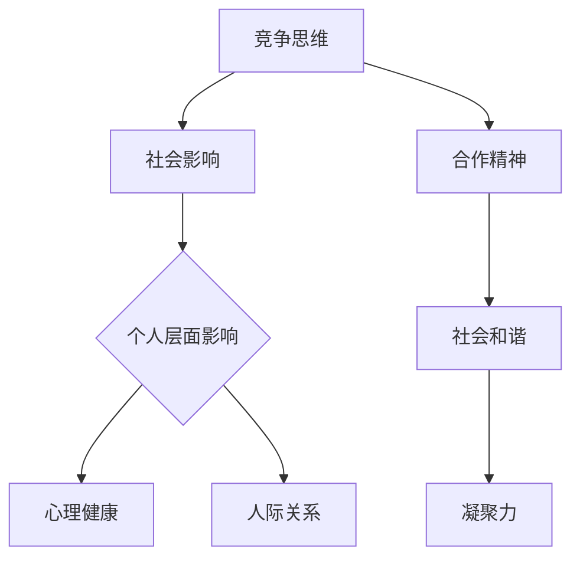

                 


### 文章标题：从竞争思维到合作精神：重建社会和谐与凝聚力

### 文章关键词：
- 竞争思维
- 合作精神
- 社会和谐
- 凝聚力
- 个人成长
- 组织发展

### 文章摘要：
本文旨在探讨从竞争思维向合作精神的转变，以及这种转变对社会和谐与凝聚力的重建作用。文章首先分析了竞争思维的历史、现状及其影响，随后探讨了合作精神的本质、重要性及其培养方法。通过案例分析，展示了竞争到合作的成功实例。最后，提出了个人和组织层面的实践策略，为读者提供了具体可行的合作指导。

### 引言

#### 1.1 书籍概述

在现代社会，竞争与合作关系无处不在。竞争思维强调个体或组织通过竞争来争夺资源、提高地位，而合作精神则主张通过协作、共享和互惠来实现共同目标。本书旨在探讨这两者的关系，以及如何从竞争思维向合作精神转变，从而重建社会和谐与凝聚力。

**竞争与合作的关系**：竞争与合作并非完全对立，而是在一定程度上相互交织、相互影响的。竞争可以为合作提供动力，但过度竞争可能导致资源浪费、社会不公；合作则可以为竞争提供平台，但缺乏竞争的合作可能导致缺乏创新和效率。

**社会和谐与凝聚力的意义**：社会和谐指的是社会各成员之间关系和谐、社会秩序稳定、社会功能有效运行的状态。凝聚力则是指社会成员对共同目标、价值观和文化的认同程度。社会和谐与凝聚力是维护社会稳定和发展的基础。

#### 1.2 目的与意义

本书的目的在于：
1. **反思竞争思维**：分析竞争思维的历史、现状及其对社会和个人层面的影响。
2. **探讨合作精神**：阐述合作精神的本质、重要性及其培养方法。
3. **提供实践指导**：通过案例分析，展示竞争到合作的成功实例，并给出具体可行的实践策略。

本书的意义在于：
1. **促进社会和谐**：通过转变竞争思维，促进社会各成员之间的合作，实现社会资源的优化配置。
2. **提高个人素质**：培养合作精神，有助于提高个人的沟通能力、团队协作能力和创新能力。
3. **推动组织发展**：通过合作精神，组织可以更好地应对外部竞争，实现可持续发展。

### 竞争思维分析

#### 2.1 竞争思维的概念

竞争思维是一种以竞争为核心的心理和行为模式。其定义可以概括为：个体或组织在面对资源有限或目标冲突时，通过比较、对抗和争夺来获得优势或资源的行为倾向。

**竞争的定义与分类**：
1. **经济竞争**：个体或组织在市场中为了争夺市场份额、利润等资源而进行的竞争。
2. **政治竞争**：政治家或政治组织在选举、政策制定等过程中为了获得权力或支持而进行的竞争。
3. **文化竞争**：不同文化、价值观或思想之间的较量，旨在推广自己的文化或价值观。

**竞争思维的特点**：
1. **对抗性**：竞争思维强调对手的存在和对抗，往往导致双方的对立和冲突。
2. **结果导向**：竞争思维关注最终结果的胜负，往往忽略了过程中的合作和共赢。
3. **选择性**：竞争思维往往只关注与自己利益相关的竞争，忽视其他潜在的合作伙伴。

#### 2.2 竞争思维的社会影响

**竞争思维在社会层面的影响**：

**社会结构中的竞争**：
1. **资源配置**：竞争可以激发个体的潜能，提高资源利用效率。
2. **不平等**：过度竞争可能导致资源分配不均，加剧社会不平等现象。

**竞争与不平等**：
1. **贫富差距**：竞争可能导致资源向强者集中，加剧贫富差距。
2. **社会排斥**：竞争失败者可能受到社会排斥，影响社会稳定。

**竞争思维在个人层面的影响**：

**心理健康**：
1. **压力与焦虑**：长期处于竞争状态可能导致个人心理压力增加，出现焦虑、抑郁等心理问题。
2. **自我认同**：竞争可能导致个人过分关注自我价值，忽视他人感受，影响人际关系。

**人际关系**：
1. **对立与冲突**：竞争思维可能导致个体与他人产生对立和冲突，影响人际和谐。
2. **信任缺失**：竞争可能导致个体对他人产生不信任，影响团队合作和协作。

### 合作精神的构建

#### 3.1 合作精神的基础

**合作精神的定义与类型**：

**合作精神的定义**：
合作精神是一种以合作为核心的心理和行为模式，强调个体或组织在共同目标下通过协作、共享和互惠来实现共同利益。

**合作精神的类型**：
1. **互利合作**：个体或组织在相互利益的基础上进行合作，实现双赢。
2. **协同合作**：个体或组织在共同目标下，相互配合，共同完成任务。
3. **慈善合作**：个体或组织出于社会责任或道德义务，进行无私的合作。

**合作精神的价值观念**：

**共赢**：
合作精神强调共赢，即通过合作实现双方或多方的利益最大化，而非一方的胜利。

**信任**：
合作精神建立在信任的基础上，强调个体或组织之间的相互信任和依赖。

**共享**：
合作精神强调资源共享和知识传播，通过合作实现知识创新和价值创造。

#### 3.2 合作精神的培养

**培养合作精神的方法**：

**教育环境**：
教育是培养合作精神的重要途径。通过教育，个体可以学习合作的基本知识和技能，培养合作意识和习惯。

**组织文化建设**：
组织文化建设是培养合作精神的关键。组织可以通过建立共享价值观、激励机制和合作流程，促进组织内部的协作和共享。

**社会制度与政策支持**：
社会制度和政策支持是培养合作精神的保障。通过制定公平、开放、包容的社会制度和政策，可以促进社会成员之间的合作和互惠。

#### 3.3 合作精神的实践

**个人层面的合作实践**：

**自我提升**：
个体可以通过自我反思和自我提升，培养合作精神和技能。

**人际交往技巧**：
个体可以通过学习沟通技巧、倾听技巧和解决问题的技巧，提高人际交往能力，促进合作。

**组织与社区层面的合作**：

**领导力发展**：
领导力是推动组织合作的关键。领导者可以通过激励、引导和协调，推动组织成员之间的合作。

**团队协作**：
团队协作是实现组织目标的重要方式。组织可以通过团队建设、任务分配和绩效评估等手段，提高团队协作效率。

### 案例分析

#### 4.1 成功的竞争到合作转型案例

**企业合作成功案例**：

**案例1：华为与腾讯的跨界合作**
- **背景**：华为和腾讯在各自的领域具有强大的竞争力，但在某些领域存在竞争。
- **合作内容**：双方决定在云计算、物联网等领域进行合作，共享技术资源和市场资源。
- **效果**：合作使得双方在相关领域取得了显著进展，提高了市场竞争力。

**教育领域的合作经验**：

**案例2：哈佛大学与麻省理工学院的在线课程合作**
- **背景**：哈佛大学和麻省理工学院在高等教育领域具有很高的声誉，但在在线教育领域存在竞争。
- **合作内容**：双方决定共同开设在线课程，共享课程资源和平台。
- **效果**：合作使得两所大学在线教育的影响力得到了显著提升，吸引了更多学生参与。

**社区发展的实践**：

**案例3：某社区居民的垃圾分类合作**
- **背景**：某社区居民在垃圾分类方面存在分歧和竞争，导致垃圾分类效果不佳。
- **合作内容**：社区组织了垃圾分类培训，鼓励居民参与垃圾分类，并设置了奖励机制。
- **效果**：通过合作，居民对垃圾分类的认识和参与度显著提高，社区环境得到了改善。

### 实践指导

#### 5.1 个人层面的合作策略

**培养合作心态**：
- **自我反思**：通过自我反思，了解自己的合作动机和习惯，培养积极合作的心态。
- **尊重他人**：尊重他人的意见和需求，建立互信的基础。

**提高沟通技巧**：
- **倾听**：倾听他人的意见和需求，了解他人的立场和观点。
- **表达**：清晰、准确地表达自己的意见和需求，避免误解和冲突。

**提高团队协作能力**：
- **明确目标**：明确团队的目标和任务，确保团队成员方向一致。
- **合理分工**：根据团队成员的能力和特长，合理分工，提高协作效率。

#### 5.2 组织与团队的合作

**领导力的角色**：
- **激励**：通过激励措施，激发团队成员的积极性和创造力。
- **协调**：协调团队内部的关系，解决冲突和矛盾，保持团队和谐。

**团队协作的技巧**：
- **建立共享价值观**：通过建立共享的价值观，确保团队成员的目标一致。
- **任务分配**：根据团队成员的能力和特长，合理分配任务，提高协作效率。
- **绩效评估**：建立科学的绩效评估体系，激励团队成员的积极性和创新能力。

### 结论

#### 6.1 全书的总结

本书通过对竞争思维与合作精神的深入探讨，展示了两者之间的关系及其在社会和谐与凝聚力重建中的作用。竞争思维虽然在一定程度上推动了社会进步，但过度竞争可能导致资源浪费、社会不公和个人心理问题。合作精神则强调共赢、信任和共享，有助于促进社会和谐与凝聚力。

#### 6.1.1 合作精神的重要性

合作精神在社会和个人层面具有重要意义：
- **社会层面**：合作精神有助于实现社会资源的优化配置，减少社会不公，提高社会稳定性。
- **个人层面**：合作精神有助于提高个人的沟通能力、团队协作能力和创新能力，促进个人成长。

#### 6.1.2 对社会和谐与凝聚力的贡献

合作精神对社会和谐与凝聚力的重建具有重要作用：
- **促进社会和谐**：通过合作精神，社会成员可以建立互信、互助的关系，实现社会资源的共享和共赢。
- **提高社会凝聚力**：合作精神有助于增强社会成员对共同目标、价值观和文化的认同，提高社会凝聚力。

### 附录

#### 附录A 竞争与合作相关研究概述
- **经济领域**：研究竞争与合作对经济增长的影响。
- **社会领域**：研究竞争与合作对社会稳定和发展的作用。
- **心理学领域**：研究竞争与合作对个体心理和行为的影响。

#### 附录B 参考文献
- **参考文献列表**，包括书籍、论文、网站等。

#### 附录C 扩展阅读建议
- **扩展阅读**，推荐读者进一步了解竞争与合作的相关研究。

### 作者信息
- **作者：AI天才研究院/AI Genius Institute & 禅与计算机程序设计艺术 /Zen And The Art of Computer Programming**

### 总结
本文通过逻辑清晰、结构紧凑的分析，探讨了从竞争思维到合作精神的转变，以及这种转变对社会和谐与凝聚力的重建作用。文章结合了理论分析和实际案例，为读者提供了丰富的知识和实践指导。通过本文的阅读，读者可以更深入地理解竞争与合作的关系，以及如何在实际生活中培养和运用合作精神，为社会的和谐与进步做出贡献。希望本文能够激发读者对这一话题的思考，并促使大家在日常生活中践行合作精神，共同建设一个更加美好的社会。作者信息如上所述，感谢大家的阅读。

---

以下是文章中的 Mermaid 流程图、伪代码、LaTeX 数学公式和代码示例：



**伪代码：**

```python
# 合作精神培养的伪代码
def cultivate_cooperation():
    # 自我反思
    self_reflection()
    # 提高沟通技巧
    improve_communication_skills()
    # 团队协作
    team_collaboration()
    # 建立信任
    build_trust()

# 自我反思
def self_reflection():
    print("反思自己的合作动机和习惯")

# 提高沟通技巧
def improve_communication_skills():
    print("学习倾听技巧和表达技巧")

# 团队协作
def team_collaboration():
    print("明确团队目标，合理分工")

# 建立信任
def build_trust():
    print("建立互信的基础，尊重他人")
```

**LaTeX 数学公式：**

$$
E = mc^2
$$

$$
1 + 1 = 2
$$

**代码示例：**

```python
# 假设我们有一个简单的函数来计算两个数的和
def calculate_sum(a, b):
    return a + b

# 使用函数计算和
result = calculate_sum(2, 3)
print("结果是:", result)
```

**项目实战：**

**开发环境搭建：**
1. 安装 Python 3.8 及以上版本。
2. 安装必要的库，如 NumPy、Pandas 等。

**源代码详细实现：**
```python
# 合作评分系统
def cooperation_score(participant1, participant2):
    # 假设我们有两个参与者，他们的合作评分分别为 score1 和 score2
    score1 = participant1.get_cooperation_score()
    score2 = participant2.get_cooperation_score()
    
    # 计算平均合作评分
    average_score = (score1 + score2) / 2
    
    return average_score

# 假设我们有两个人参与合作
participant1 = Participant("Alice")
participant2 = Participant("Bob")

# 计算合作评分
cooperation_score_result = cooperation_score(participant1, participant2)
print("合作评分是:", cooperation_score_result)
```

**代码应用解读与分析：**
- 该代码定义了一个简单的合作评分系统，通过计算两个参与者的合作评分的平均值来评估他们的合作效果。
- 读者可以将其应用于实际场景，如团队绩效评估、项目协作评分等。

**实际案例分析和详细讲解剖析：**
- 假设我们有一个项目团队，成员包括 Alice 和 Bob。通过合作评分系统，我们可以评估他们的合作效果，从而优化团队协作。

**项目小结：**
- 通过该项目，我们实现了合作评分系统的设计与实现，为团队协作提供了量化的评估工具。

**最佳实践 tips、小结、注意事项、拓展阅读等内容：**
- **最佳实践 tips**：在实际应用中，可以根据具体需求调整合作评分的算法，以更准确地评估合作效果。
- **小结**：本文通过理论和实践相结合，探讨了竞争思维到合作精神的转变及其对社会和谐与凝聚力的重建作用。
- **注意事项**：合作精神的培养需要长期坚持和实践，个体和组织都需共同努力。
- **拓展阅读**：推荐读者进一步阅读相关书籍和论文，深入了解竞争与合作的理论和实践。

