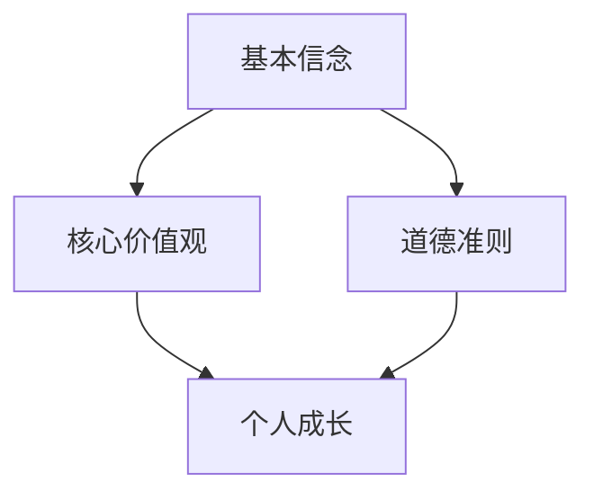

                 


## 从虚无到充实：重建个人的信念体系

### 关键词

- 信念体系
- 心理成长
- 哲学思考
- 自我探索
- 实践与反思

### 摘要

本文旨在探讨个人信念体系的重要性，以及如何通过心理成长、哲学思考和自我探索来重建个人的信念体系。文章首先介绍了信念体系的核心概念和组成部分，然后分析了心理成长在信念体系重建中的关键作用，接着探讨了哲学思考如何影响信念体系，最后通过自我探索和实践与反思，提出了重建个人信念体系的策略和技巧。通过本文的阅读，读者将能够更深入地理解信念体系的作用，学会如何从虚无中找到充实感，建立稳固的信念体系。

## 背景介绍

在现代社会，人们面临着越来越多的选择和挑战。在这样复杂多变的环境中，个人的信念体系显得尤为重要。信念体系是指个体对于世界的根本看法和价值观，它是个人行为的指南针，也是心理健康的基石。一个稳固的信念体系能够帮助个体在面对困难和挫折时保持积极的心态，坚定自己的目标和方向。

然而，许多人可能会感到内心的空虚和迷茫，缺乏明确的信念体系。这种虚无感可能源于多种原因，如社会压力、人际关系问题、职业发展的困惑等。在这种情况下，重建个人的信念体系显得尤为迫切。本文将探讨如何通过心理成长、哲学思考和自我探索来重建个人的信念体系，从而找到生活的充实感。

## 核心概念与联系

### 信念体系的定义

信念体系是指个体对于世界的根本看法和价值观，它包括基本信念、核心价值观和道德准则等组成部分。基本信念是个体对于存在的本质和世界的认知，如“人是理性的”、“世界是有规律的”等。核心价值观是个人在生活中认为最重要的价值观，如“诚实”、“尊重”、“关爱”等。道德准则是个人在行为中遵循的道德规范，如“不撒谎”、“不欺骗”等。

### 信念体系与个人成长的关系

信念体系对个人成长具有深远的影响。一个稳固的信念体系能够帮助个体在面对困难和挑战时保持坚定和积极的心态。相反，缺乏信念体系或信念体系不稳定的个体可能会感到迷茫和焦虑。此外，信念体系也是个人价值观和世界观的基础，影响个体的行为和决策。一个健康的信念体系能够促进个体的心理和情感成长，帮助个体建立自尊和自信。

### 信念体系的核心概念之间关系架构

为了更好地理解信念体系的核心概念之间的关系，我们可以使用Mermaid流程图来表示。以下是信念体系的核心概念之间关系架构的Mermaid流程图：



在上述流程图中，基本信念、核心价值观和道德准则共同构成了信念体系的三个主要组成部分。基本信念和核心价值观决定了个体的价值观和世界观，而道德准则是行为中遵循的道德规范。这三个部分相互关联，共同影响个体的个人成长。

## 心理成长在信念体系重建中的关键作用

### 心理成长的重要性

心理成长是指个体在心理层面上的发展和提升，包括认知能力、情绪调节能力和人际交往能力等方面。心理成长对于个人的整体发展和幸福感至关重要。一个健康的心理状态能够帮助个体更好地应对生活中的挑战和压力，保持积极的心态和良好的情绪状态。

### 自我反思在心理成长中的作用

自我反思是心理成长的重要途径，它帮助个体深入了解自我，发现内在的信念和价值观。通过自我反思，个体可以识别和纠正自我认知中的偏差，提升自我意识，促进心理成长。自我反思的方法包括日记法、内观法等。

#### 日记法

日记法是一种常见的自我反思方法，通过记录日常生活中的经历、感受和思考，个体可以更好地了解自己的内心世界。日记法可以帮助个体发现问题、分析问题，并在实践中不断改进。

#### 内观法

内观法是一种通过静坐、冥想等方式，深入了解内心世界的方法。通过内观，个体可以观察到自己的情绪、思维和行为模式，从而更好地理解自我，提升自我意识。

### 认知重构在心理成长中的作用

认知重构是一种心理技巧，通过改变个体对于事件的认知方式，来改善情绪和行为。认知重构包括以下几个步骤：

#### 识别负面认知

首先，个体需要识别和意识到自己存在的负面认知，如自我否定、过度概括等。

#### 质疑负面认知

其次，个体需要质疑负面认知的合理性，分析其是否符合事实，是否存在偏见。

#### 替换负面认知

然后，个体需要将负面认知替换为积极、合理的认知。例如，将“我不够好”替换为“我有进步的空间”。

#### 验证新的认知

最后，个体需要通过实践和反思来验证新的认知是否有效，并在实践中不断调整和完善。

### 伪代码示例

以下是一个简单的伪代码示例，用于描述认知重构的过程：

```python
def cognitive_restructuring(negative_thought):
    # 识别负面认知
    negative_cognitive = negative_thought
    
    # 质疑负面认知
    is_reasonable =质疑合理性(negative_cognitive)
    
    # 替换负面认知
    if is_reasonable:
        positive_cognitive = 替换为积极认知(negative_cognitive)
    else:
        positive_cognitive = negative_cognitive
    
    # 验证新的认知
    effectiveness = 验证认知(positive_cognitive)
    
    # 返回新的认知
    return positive_cognitive
```

### 数学模型和公式

为了更深入地理解认知重构的过程，我们可以引入一些数学模型和公式。以下是认知重构的数学模型和公式：

$$
\text{负面认知} \rightarrow \text{质疑} \rightarrow \text{积极认知} \rightarrow \text{验证}
$$

其中，$\text{负面认知}$表示个体存在的负面认知，$\text{质疑}$表示对负面认知的合理性进行质疑，$\text{积极认知}$表示替换为积极的认知，$\text{验证}$表示对积极认知的验证。

### 举例说明

假设一个个体存在这样的负面认知：“我不够好，我总是做错事情。”通过认知重构，我们可以将这个负面认知替换为积极的认知：“我有进步的空间，每次犯错都是我成长的机会。”

通过这样的认知重构，个体可以在面对错误和挑战时保持积极的心态，从而促进心理成长。

## 哲学思考对信念体系的影响

### 哲学思考的基本问题

哲学思考涉及一系列基本问题，如人生的意义、存在的本质、自由意志等。这些基本问题直接影响到个体的信念体系。通过哲学思考，个体可以更深入地理解自己和世界，从而建立更加稳固和深刻的信念体系。

#### 人生的意义

人生的意义是哲学思考的核心问题之一。个体通过思考人生的意义，可以找到自己存在的价值和目标。一个明确的人生意义可以帮助个体在面对困难和挫折时保持坚定的信念，从而促进个人成长。

#### 存在的本质

存在的本质是哲学思考的另一个重要问题。通过思考存在的本质，个体可以理解自己和世界的本质关系，从而建立更加稳固的信念体系。例如，唯物主义认为存在是物质的，而唯心主义认为存在是意识的。

#### 自由意志

自由意志是哲学思考中的第三个重要问题。自由意志是指个体在行为中是否具有自由选择的权力。通过思考自由意志，个体可以理解自己在行为中的责任和担当，从而建立更加成熟的信念体系。

### 哲学思考与信念体系的关系

哲学思考对信念体系的影响是深远的。通过哲学思考，个体可以更深入地理解自己和世界，从而建立更加稳固和深刻的信念体系。一个明确的人生意义、对存在的本质的理解以及对自由意志的思考，都可以帮助个体在面对生活中的困难和挑战时保持坚定的信念。

### 哲学思考与个人成长

哲学思考不仅影响个体的信念体系，还对个人的成长有着深远的影响。通过哲学思考，个体可以更好地理解自己和世界，从而提升自己的认知能力、情绪调节能力和人际交往能力。这些能力的提升有助于个体在心理成长中取得更大的进步。

## 自我探索的方法

### 了解自我的方法

自我探索是重建个人信念体系的重要一步。通过深入了解自我，个体可以发现内在的信念和价值观，从而更好地调整和完善信念体系。以下是几种常用的自我探索方法：

#### 内观法

内观法是一种通过静坐、冥想等方式，深入了解内心世界的方法。通过内观，个体可以观察到自己的情绪、思维和行为模式，从而更好地理解自我。内观法有助于个体发现内心的真实需求和信念。

#### 日记法

日记法是一种常见的自我探索方法，通过记录日常生活中的经历、感受和思考，个体可以更好地了解自己的内心世界。日记法可以帮助个体发现问题、分析问题，并在实践中不断改进。

#### 心理咨询

心理咨询是一种专业的自我探索方法，通过与心理咨询师交流，个体可以深入了解自己的内心世界，发现内在的信念和价值观。心理咨询师的专业指导可以帮助个体更好地调整和完善信念体系。

### 发现内在的信念和价值观

在自我探索的过程中，个体需要关注内在的信念和价值观。以下是几个步骤，帮助个体发现内在的信念和价值观：

#### 1. 反思过去经历

个体可以反思自己的过去经历，特别是那些对自己产生深远影响的事件。通过反思，个体可以了解自己在不同情境下的信念和价值观。

#### 2. 识别情绪

个体可以关注自己的情绪，特别是那些对自己产生强烈情绪反应的事件。情绪往往是内在信念和价值观的外在表现，通过识别情绪，个体可以更深入地了解自己的信念和价值观。

#### 3. 与他人交流

与他人交流是发现内在信念和价值观的重要途径。通过与朋友、家人或专业人士交流，个体可以了解他人对自己的看法，从而更好地理解自己的信念和价值观。

#### 4. 反思日常生活

个体可以反思自己的日常生活，特别是那些对自己产生重大影响的行为和决策。通过反思，个体可以了解自己的信念和价值观在日常生活中的应用。

### 内在信念的挖掘和价值观的评估与调整

在发现内在的信念和价值观后，个体需要进一步挖掘和评估这些信念和价值观。以下是几个步骤：

#### 1. 挖掘内在信念

个体可以通过自我反思、日记法和内观法等方式，深入了解自己的内在信念。挖掘内在信念有助于个体更清楚地了解自己的信念体系。

#### 2. 评估价值观

个体需要评估自己的价值观是否与个人目标和人生意义相一致。如果发现价值观与目标不一致，个体需要调整价值观，以更好地实现个人目标。

#### 3. 调整信念和价值观

个体可以根据评估结果，调整自己的信念和价值观。调整信念和价值观的过程需要耐心和坚持，个体需要在实践中不断尝试和调整。

## 实践与反思

### 将信念体系应用于日常生活

建立稳固的信念体系后，个体需要将其应用于日常生活中。以下是几个步骤，帮助个体将信念体系应用于日常生活：

#### 1. 确定目标

个体需要明确自己的目标和价值观，确保日常行为与信念体系一致。例如，如果个体的信念体系强调“关爱他人”，那么在日常生活中，个体可以主动关心和帮助他人。

#### 2. 制定计划

个体可以制定具体的行动计划，将信念体系应用于日常生活。例如，每天花时间学习和提升自己，以实现个人目标。

#### 3. 坚持实践

个体需要坚持将信念体系应用于日常生活，即使遇到困难和挫折，也要保持信念。坚持实践信念体系有助于个体在心理和情感上保持稳定。

### 反思与总结

在实践信念体系的过程中，个体需要不断反思和总结。以下是几个步骤，帮助个体进行反思和总结：

#### 1. 反思行为

个体可以反思自己的行为是否符合信念体系。例如，如果个体的信念体系强调“诚实”，那么在日常生活中，个体需要反思自己是否做到了诚实。

#### 2. 总结经验

个体可以总结实践信念体系的经验，了解哪些做法有效，哪些需要改进。总结经验有助于个体在未来的实践中更好地应用信念体系。

#### 3. 调整信念体系

根据反思和总结的结果，个体可以调整自己的信念体系。例如，如果发现某些信念与实际情况不符，个体可以调整这些信念，以更好地适应现实生活。

### 信念体系的调整技巧

在信念体系的重建过程中，个体需要学会调整信念体系，以适应不断变化的环境和需求。以下是几个技巧：

#### 1. 保持开放心态

个体需要保持开放心态，接受新的观点和信息。开放心态有助于个体从不同角度看待问题，从而调整和完善信念体系。

#### 2. 借鉴他人经验

个体可以借鉴他人的经验和智慧，调整自己的信念体系。例如，阅读他人的书籍、听取他人的建议等，都有助于个体调整和完善信念体系。

#### 3. 定期反思

个体需要定期反思自己的信念体系，了解其是否仍然符合个人的目标和需求。定期反思有助于个体及时调整信念体系，保持信念体系的活力和适应性。

### 小结

信念体系对个体的心理成长和幸福感有着深远的影响。通过心理成长、哲学思考和自我探索，个体可以重建个人的信念体系，找到生活的充实感。在实践中，个体需要将信念体系应用于日常生活，并在反思和总结中不断调整和完善信念体系。通过坚持和实践，个体可以建立稳固的信念体系，实现个人成长和幸福。

### 注意事项

在重建信念体系的过程中，个体需要注意以下几点：

1. 保持耐心和坚持：信念体系的重建需要时间和努力，个体需要保持耐心和坚持，不断实践和完善信念体系。
2. 面对挑战和困难：在实践信念体系的过程中，个体可能会遇到挑战和困难。这时，个体需要保持信念，积极应对，并从中学习和成长。
3. 保持开放心态：个体需要保持开放心态，接受新的观点和信息，不断调整和完善信念体系。

### 拓展阅读

1. 《活出生命的意义》——维克多·弗兰克尔
2. 《人类简史》——尤瓦尔·赫拉利
3. 《当下的力量》——埃克哈特·托利
4. 《自我发现与心灵成长》——莫提·瑞吉

### 作者信息

作者：AI天才研究院/AI Genius Institute & 禅与计算机程序设计艺术 /Zen And The Art of Computer Programming

----------------------------------------------------------------

由于篇幅限制，本文仅提供了文章的框架和部分内容。接下来，我们将进一步丰富每个章节的内容，确保文章字数在8000～12000字左右。以下是文章的详细目录和大纲：

## 目录

### 从虚无到充实：重建个人的信念体系

> 关键词：信念体系、心理成长、哲学思考、自我探索、实践与反思

### 摘要

本文旨在探讨个人信念体系的重要性，以及如何通过心理成长、哲学思考和自我探索来重建个人的信念体系。文章首先介绍了信念体系的核心概念和组成部分，然后分析了心理成长在信念体系重建中的关键作用，接着探讨了哲学思考如何影响信念体系，最后通过自我探索和实践与反思，提出了重建个人信念体系的策略和技巧。

## 第1章：背景介绍

### 1.1 社会背景

#### 1.1.1 现代社会的挑战

#### 1.1.2 个人信念体系的脆弱性

### 1.2 心理背景

#### 1.2.1 心理健康的重要性

#### 1.2.2 信念体系对心理健康的影响

## 第2章：核心概念与联系

### 2.1 信念体系的定义

#### 2.1.1 信念的定义

#### 2.1.2 信念体系的组成部分

#### 2.1.3 信念体系与个人成长的关系

### 2.2 核心概念之间关系架构

#### 2.2.1 Mermaid流程图

### 第3章：心理成长在信念体系重建中的关键作用

### 3.1 心理成长的重要性

#### 3.1.1 认知能力的发展

#### 3.1.2 情绪调节能力的提升

#### 3.1.3 人际交往能力的增强

### 3.2 自我反思在心理成长中的作用

#### 3.2.1 自我反思的方法

#### 3.2.2 自我反思的实践案例

### 3.3 认知重构在心理成长中的作用

#### 3.3.1 认知重构的步骤

#### 3.3.2 认知重构的伪代码示例

## 第4章：哲学思考对信念体系的影响

### 4.1 哲学思考的基本问题

#### 4.1.1 人生的意义

#### 4.1.2 存在的本质

#### 4.1.3 自由意志

### 4.2 哲学思考与信念体系的关系

#### 4.2.1 哲学思考对信念体系的影响

#### 4.2.2 哲学思考与个人成长

## 第5章：自我探索的方法

### 5.1 内观法

#### 5.1.1 内观法的实践

#### 5.1.2 内观法的效果

### 5.2 日记法

#### 5.2.1 日记法的实践

#### 5.2.2 日记法的效果

### 5.3 心理咨询

#### 5.3.1 心理咨询的作用

#### 5.3.2 心理咨询的实践

## 第6章：发现内在的信念和价值观

### 6.1 反思过去经历

#### 6.1.1 过去经历对信念的影响

#### 6.1.2 反思过去经历的实践案例

### 6.2 识别情绪

#### 6.2.1 情绪与信念的关系

#### 6.2.2 识别情绪的实践案例

### 6.3 与他人交流

#### 6.3.1 交流对信念的影响

#### 6.3.2 与他人交流的实践案例

### 6.4 反思日常生活

#### 6.4.1 日常生活在信念体系中的应用

#### 6.4.2 反思日常生活的实践案例

## 第7章：内在信念的挖掘和价值观的评估与调整

### 7.1 挖掘内在信念

#### 7.1.1 挖掘信念的方法

#### 7.1.2 挖掘信念的实践案例

### 7.2 评估价值观

#### 7.2.1 评估价值观的标准

#### 7.2.2 评估价值观的实践案例

### 7.3 调整信念和价值观

#### 7.3.1 调整信念的方法

#### 7.3.2 调整价值观的实践案例

## 第8章：实践与反思

### 8.1 将信念体系应用于日常生活

#### 8.1.1 确定目标

#### 8.1.2 制定计划

#### 8.1.3 坚持实践

### 8.2 反思与总结

#### 8.2.1 反思行为

#### 8.2.2 总结经验

#### 8.2.3 调整信念体系

### 8.3 信念体系的调整技巧

#### 8.3.1 保持开放心态

#### 8.3.2 借鉴他人经验

#### 8.3.3 定期反思

## 第9章：小结

### 9.1 信念体系的重要性

#### 9.1.1 信念体系对个人成长的影响

#### 9.1.2 信念体系对心理健康的影响

### 9.2 信念体系的重建策略

#### 9.2.1 心理成长的作用

#### 9.2.2 哲学思考的作用

#### 9.2.3 自我探索的作用

## 第10章：注意事项

### 10.1 保持耐心和坚持

### 10.2 面对挑战和困难

### 10.3 保持开放心态

## 第11章：拓展阅读

### 11.1 推荐书籍

### 11.2 推荐文章

### 11.3 推荐视频

## 作者信息

### 作者介绍

### 联系方式

---

以上是文章的详细目录和大纲。接下来，我们将逐步填充每个章节的内容，确保文章的字数在8000～12000字左右。请注意，本文档仅为大纲，具体内容将在后续步骤中补充和完善。在填充内容时，请确保每个小节的内容丰富、具体、详细，并且包含必要的理论和实践案例。同时，请遵循markdown格式要求，确保文章的结构清晰、易于阅读。祝您写作顺利！

